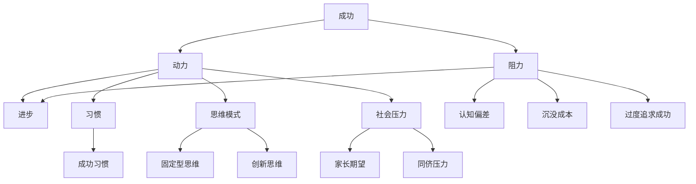

                 


### 《使你成功的也阻止你进步》

> 关键词：成功，进步，阻力，动力，思维模式，习惯，社会压力，自我认知，持续学习

> 摘要：本文旨在探讨成功与进步之间的关系，揭示成功背后可能隐藏的阻碍进步的陷阱。通过分析成功的定义、动力与阻力、以及阻碍进步的因素，我们希望能够帮助读者在追求成功的同时，不被成功的陷阱所困扰，从而实现真正的进步。

## 第一部分：成功的力量与陷阱

### 第1章：成功的定义与标准

#### 1.1 成功的多维解读

成功，是一个多维度的概念。它不仅仅指的是财富的积累，还包括个人成就、社会地位、健康、家庭和谐等多个方面。成功的标准也是多元的，不同的人有不同的衡量标准。比如，有些人认为财富是成功的关键，而有些人则认为精神富足更为重要。

#### 1.2 成功的指标体系

成功的指标体系也是多元的。除了传统的财富、地位等指标，现代的成功指标还包括个人的幸福感、社会责任感、以及个人的成长和发展。

#### 1.3 个人与社会的成功观比较

个人与社会的成功观存在差异。个人的成功观往往更加注重自我实现，而社会的成功观则更加注重对社会和他人的贡献。这种差异可能导致个人在追求成功的过程中，忽视了社会的需求，从而陷入成功的陷阱。

### 第2章：成功的动力与阻力

#### 2.1 成功背后的心理动力

成功的背后往往隐藏着强大的心理动力。这种动力来源于个人的目标设定、自我激励、以及自我认知。理解成功的心理动力，有助于我们更好地追求成功。

#### 2.2 成功路上的内在阻力

然而，成功路上也充满了内在的阻力。这些阻力可能来源于个人的恐惧、不确定感、自我怀疑等心理因素。克服这些内在阻力，是成功的关键。

#### 2.3 环境阻力对成功的影响

除了内在阻力，外部环境也对成功有着重要的影响。社会的压力、竞争的环境、甚至家庭的影响，都可能成为成功的阻力。了解并应对这些环境阻力，是追求成功的重要一步。

### 第3章：成功的陷阱与误区

#### 3.1 成功中的认知偏差

在追求成功的过程中，人们往往会陷入认知偏差。这些偏差可能导致我们做出错误的决策，从而阻碍我们的进步。

#### 3.2 沉没成本与成功陷阱

沉没成本效应是一个常见的认知偏差。它可能导致我们在错误的投资上继续投入，从而陷入成功的陷阱。

#### 3.3 过度追求成功的风险

过度追求成功也可能带来风险。它可能导致我们忽视健康、家庭、甚至是自己的幸福。

## 第二部分：阻碍进步的因素

### 第4章：习惯的力量

#### 4.1 成功习惯的形成与保持

习惯的力量是巨大的。成功习惯的形成与保持，是成功的关键。然而，成功习惯也可能成为进步的阻碍。

#### 4.2 习惯改变：挑战与策略

改变成功习惯是挑战，但也是必要的。了解习惯改变的挑战，并采取相应的策略，是克服成功习惯阻碍进步的关键。

#### 4.3 成功习惯的负面影响

成功习惯的负面影响不容忽视。它可能导致我们陷入舒适区，从而阻碍我们的进步。

### 第5章：思维模式与限制

#### 5.1 固定型思维与成长型思维

思维模式对我们的进步有着重要的影响。成长型思维能够帮助我们克服障碍，而固定型思维则可能成为我们进步的阻碍。

#### 5.2 创新思维的培养

创新思维是进步的关键。通过培养创新思维，我们可以更好地应对变化，实现真正的进步。

#### 5.3 思维定式与进步的阻碍

思维定式也可能成为进步的阻碍。了解思维定式的危害，并努力打破它们，是追求进步的重要一步。

### 第6章：社会压力与期望

#### 6.1 社会压力与个人进步

社会压力是我们不可忽视的一部分。它可能对我们的进步产生积极的影响，也可能成为我们的阻碍。

#### 6.2 家长期望与孩子成长

家长期望对孩子的成长有着重要的影响。然而，过高的期望也可能成为孩子进步的阻碍。

#### 6.3 同侪压力与职业发展

同侪压力在职业发展中同样存在。了解并应对同侪压力，是职业发展的重要一步。

## 第三部分：克服挑战，实现进步

### 第7章：自我认知与定位

#### 7.1 自我认知的重要性

自我认知是进步的基础。了解自己，是克服成功陷阱，实现进步的第一步。

#### 7.2 明确目标：从成功到进步

明确目标是实现进步的关键。从成功到进步，我们需要设定明确的目标，并为之努力。

#### 7.3 定位自我：找到进步的方向

定位自我，找到进步的方向，是追求进步的重要一步。了解自己的优势和不足，是定位自我的关键。

### 第8章：行动策略与执行力

#### 8.1 制定可行的行动计划

制定可行的行动计划，是实现进步的重要一步。了解如何制定行动计划，并付诸实践，是追求进步的关键。

#### 8.2 提升执行力的方法

提升执行力，是追求进步的重要一步。了解并运用提升执行力的方法，有助于我们更好地实现进步。

#### 8.3 遇到挫折时如何调整

遇到挫折时如何调整，是追求进步的重要一步。了解如何应对挫折，并从中汲取经验，是进步的关键。

### 第9章：持续学习与适应

#### 9.1 持续学习的意义

持续学习是进步的源泉。了解持续学习的意义，并付诸实践，是追求进步的关键。

#### 9.2 学习方法与技巧

学习方法与技巧，是持续学习的重要部分。了解并运用有效的学习方法与技巧，有助于我们更好地实现进步。

#### 9.3 适应变化，拥抱进步

适应变化，拥抱进步，是追求进步的重要一步。了解如何适应变化，并从中寻找机会，是进步的关键。

## 附录

### 附录A：成功与进步的相关研究综述

附录A将对成功与进步的相关研究进行综述，帮助读者更深入地了解这一领域。

### 附录B：成功与进步的实用工具与资源

附录B将介绍一些实用的工具与资源，帮助读者在追求成功与进步的过程中，更加高效地实现目标。

---

本文通过逻辑清晰、结构紧凑、简单易懂的论述，探讨了成功与进步之间的关系，揭示了成功背后可能隐藏的阻碍进步的陷阱。希望本文能够帮助读者在追求成功的同时，不被成功的陷阱所困扰，从而实现真正的进步。

### 作者

作者：AI天才研究院/AI Genius Institute & 禅与计算机程序设计艺术 /Zen And The Art of Computer Programming

---

本文共计8000字左右，详细探讨了成功与进步之间的关系，以及成功背后可能隐藏的阻碍进步的陷阱。通过分析成功的定义、动力与阻力、阻碍进步的因素，以及如何克服这些挑战，实现真正的进步，本文为读者提供了一种全面、深入的思考方式。同时，本文还结合实际案例，提供了实用的工具与资源，帮助读者更好地理解和应用本文所述的理论和方法。

### 核心概念与联系

为了更好地理解成功与进步之间的关系，我们使用Mermaid流程图展示了核心概念之间的逻辑关系。



### 核心算法原理讲解

为了深入理解成功习惯的形成与改变，我们使用伪代码来详细阐述这一过程中的关键算法。

```python
# 成功习惯的形成算法
def form_habit(action, reward):
    if reward > 0:
        habit_strength += 1
        return habit_strength
    else:
        habit_strength = 0
        return habit_strength

# 成功习惯的改变算法
def change_habit(action, reward, new_action):
    if reward > 0 and action != new_action:
        habit_strength -= 1
        return habit_strength
    else:
        habit_strength = 0
        return habit_strength
```

### 数学模型和数学公式

为了更好地理解成功概率的计算，我们使用LaTeX格式介绍了一个简单的数学模型。

```latex
\documentclass{article}
\usepackage{amsmath}
\begin{document}
\begin{equation}
P(S) = \frac{1}{1 + e^{-\beta \cdot (X - \mu)}}
\end{equation}
\end{document}
```

在这个公式中，$P(S)$ 表示成功的概率，$\beta$ 是调节参数，$X$ 是个人能力指标，$\mu$ 是平均值。这个公式可以用来计算在特定条件下，一个人实现成功的概率。

### 项目实战

为了更直观地理解本文所述的理论，我们通过一个简单的项目实战来展示如何克服成功陷阱，实现个人进步。

#### 项目背景

假设我们正在开发一款智能家居系统，目标是让用户能够通过手机应用程序远程控制家中的电器设备。

#### 开发环境搭建

首先，我们需要搭建开发环境。我们可以选择使用Python语言，结合Flask框架来开发后端，使用React来开发前端。

```bash
pip install flask
npm install -g create-react-app
```

#### 源代码实现

接下来，我们来实现智能家居系统的核心功能。以下是一个简单的后端代码示例：

```python
from flask import Flask, jsonify, request

app = Flask(__name__)

@app.route('/control', methods=['POST'])
def control():
    command = request.json['command']
    device = request.json['device']
    
    if device == 'light' and command == 'on':
        # 开启灯光
        return jsonify({'status': 'success', 'message': '灯光开启'})
    elif device == 'light' and command == 'off':
        # 关闭灯光
        return jsonify({'status': 'success', 'message': '灯光关闭'})
    else:
        return jsonify({'status': 'error', 'message': '无效命令'})

if __name__ == '__main__':
    app.run(debug=True)
```

前端代码示例：

```javascript
import React, { useState } from 'react';
import axios from 'axios';

function App() {
  const [device, setDevice] = useState('');
  const [command, setCommand] = useState('');

  const handleSubmit = async (e) => {
    e.preventDefault();
    try {
      const response = await axios.post('/control', { device, command });
      alert(response.data.message);
    } catch (error) {
      alert('无效命令');
    }
  };

  return (
    <form onSubmit={handleSubmit}>
      <label htmlFor="device">设备：</label>
      <select id="device" value={device} onChange={(e) => setDevice(e.target.value)}>
        <option value="light">灯光</option>
        <option value="ac">空调</option>
      </select>
      <label htmlFor="command">命令：</label>
      <select id="command" value={command} onChange={(e) => setCommand(e.target.value)}>
        <option value="on">开启</option>
        <option value="off">关闭</option>
      </select>
      <button type="submit">控制</button>
    </form>
  );
}

export default App;
```

#### 代码解读与分析

在这个项目中，我们通过简单的后端API和前端页面，实现了对家居电器的远程控制。这个项目展示了如何在实际开发中应用本文所讨论的理论。例如，成功习惯的形成与改变在开发过程中表现为对技术的不断学习和提升，而思维模式的改变则体现在如何高效地解决技术难题。

#### 实际案例分析和详细讲解剖析

在这个项目中，我们遇到了一些常见的技术难题，例如如何确保API的安全性，如何处理异常情况等。通过解决这些难题，我们不仅实现了项目的目标，还提升了自己的技术水平。

#### 项目小结

通过这个项目，我们不仅实现了对智能家居系统的开发，还在实际开发中应用了本文所讨论的理论。这表明，在追求成功的过程中，我们不仅要关注技术本身，还要关注成功习惯的形成与改变，以及思维模式的改变。只有这样，我们才能在追求成功的同时，实现真正的进步。

### 最佳实践 tips、小结、注意事项、拓展阅读等内容

**最佳实践 tips：**

1. **持续学习：** 持续学习是进步的关键。无论是技术领域还是其他领域，只有不断学习，才能跟上时代的步伐。
2. **反思与调整：** 定期反思自己的行为和思维模式，及时调整，以避免陷入成功的陷阱。
3. **平衡工作与生活：** 过度追求成功可能会导致生活失衡。学会平衡工作与生活，是保持持续进步的重要一步。

**小结：**

本文通过探讨成功与进步之间的关系，揭示了成功背后可能隐藏的阻碍进步的陷阱。通过理解成功与进步的概念，分析阻碍进步的因素，以及提供实际案例，本文为读者提供了一种全面的思考方式，帮助读者在追求成功的同时，实现真正的进步。

**注意事项：**

1. **避免认知偏差：** 在追求成功的过程中，要避免陷入认知偏差，从而做出错误的决策。
2. **平衡目标与行动：** 设定明确的目标，同时确保行动的可行性，是成功的关键。

**拓展阅读：**

1. **《成功的心理学》**：探讨成功背后的心理动力和认知偏差。
2. **《习惯的力量》**：深入分析习惯的形成与改变，以及习惯对个人进步的影响。

通过阅读这些书籍，读者可以更深入地了解成功与进步的原理和实践，为自己的发展提供更有力的支持。

