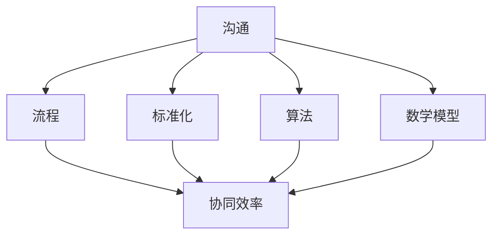
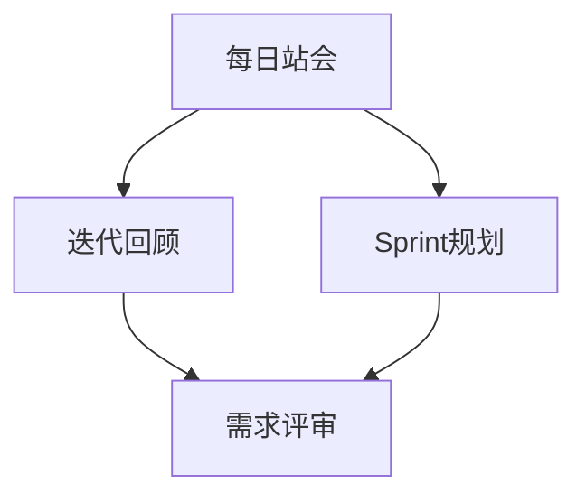

                 

### 文章标题

### 促进技术部门间协作的方法

---

#### 关键词

技术部门协作、沟通工具、流程优化、技术标准化、算法原理、数学模型、项目实战

---

#### 摘要

本文旨在探讨技术部门间协作的挑战与解决方法，包括核心概念与联系、促进协作的方法、核心算法原理讲解、数学模型和数学公式讲解、项目实战等。通过深入分析，本文为IT企业提供了系统性的协作策略和实用工具，旨在提升技术部门的协同效率。

---

## 核心概念与联系

在技术领域中，部门间的协作是保证项目顺利进行的关键因素。以下是几个核心概念及其相互联系：

1. **沟通**：沟通是部门间协作的基石，通过有效的沟通，团队成员可以理解彼此的需求、目标和进展，从而确保工作的连续性和一致性。
2. **流程**：流程是工作任务的规范化流程，它定义了任务的执行顺序、步骤和责任分工，有助于减少冗余和错误。
3. **标准化**：标准化是指通过制定统一的技术规范和标准来确保各部门在技术和流程上的兼容性，从而提高协作效率。
4. **算法**：协作算法用于解决多部门协作中的复杂问题，如资源分配、任务调度和冲突解决。
5. **数学模型**：数学模型为协作提供了量化分析的工具，通过数学公式和模型，可以评估协作效果和优化协作策略。

这些概念相互联系，共同构成了技术部门协作的整体框架。以下是一个简单的 Mermaid 流程图，展示了这些概念之间的联系：



## 核心算法原理讲解

在促进技术部门间协作的算法中，常见的有中心化算法、去中心化算法和分布式算法。以下是对这些算法的基本原理和实现思路的讲解。

### 中心化算法

中心化算法是指将决策和控制权集中在单一中心节点上。这种算法的优点是实现简单、易于控制，但缺点是依赖性强、易形成单点故障。

**伪代码：**

```python
# 中心化算法伪代码
def centralized_algorithm(tasks, resources):
    # 初始化中心节点
    center_node = initialize_center_node()
    # 分配资源
    for task in tasks:
        center_node.allocate_resource(task, resources)
    # 调度任务
    center_node.schedule_tasks(tasks)
```

### 去中心化算法

去中心化算法通过分散决策和控制权，提高系统的容错性和灵活性。每个节点都有一定的自治能力，可以独立完成部分任务。

**伪代码：**

```python
# 去中心化算法伪代码
def decentralized_algorithm(tasks, nodes):
    # 初始化节点
    for node in nodes:
        node.initialize_node()
    # 每个节点独立完成任务
    for task in tasks:
        node = select_node(tasks, nodes)
        node.complete_task(task)
```

### 分布式算法

分布式算法是指多个节点共同协作，通过分布式计算完成复杂任务。这种算法通常用于大规模数据处理和分布式系统管理。

**伪代码：**

```python
# 分布式算法伪代码
def distributed_algorithm(tasks, nodes):
    # 初始化节点
    for node in nodes:
        node.initialize_node()
    # 节点间通信
    for node in nodes:
        node.communicate_with_peers()
    # 分布式计算
    result = distributed_compute(nodes, tasks)
    return result
```

## 数学模型和数学公式讲解

在技术部门协作中，数学模型和数学公式是评估和优化协作策略的重要工具。以下是几个常用的数学模型和公式的讲解。

### 加权平均值公式

加权平均值公式用于计算多个指标的加权平均值，可以反映各部门协作效果的综合性指标。

**公式：**
$$
\bar{X} = \frac{\sum_{i=1}^{n} w_i \cdot X_i}{\sum_{i=1}^{n} w_i}
$$

**解释：**
- \(X_i\) 表示第 \(i\) 个指标值
- \(w_i\) 表示第 \(i\) 个指标的权重
- \(\bar{X}\) 表示加权平均值

### 最小二乘法公式

最小二乘法用于线性回归分析，可以找到最佳拟合直线，用于预测和分析。

**公式：**
$$
Y = \beta_0 + \beta_1 \cdot X + \epsilon
$$

**解释：**
- \(Y\) 表示因变量
- \(X\) 表示自变量
- \(\beta_0\) 和 \(\beta_1\) 分别表示截距和斜率
- \(\epsilon\) 表示误差项

### 马尔可夫模型公式

马尔可夫模型用于描述系统状态转移的概率，可以用于评估协作效率和预测状态。

**公式：**
$$
P_{ij} = \frac{C_{ij}}{C_{i}}
$$

**解释：**
- \(P_{ij}\) 表示从状态 \(i\) 转移到状态 \(j\) 的概率
- \(C_{ij}\) 表示从状态 \(i\) 转移到状态 \(j\) 的次数
- \(C_{i}\) 表示从状态 \(i\) 转移的总次数

### 贝叶斯公式

贝叶斯公式用于计算后验概率，可以用于评估协作中的不确定性。

**公式：**
$$
P(A|B) = \frac{P(B|A) \cdot P(A)}{P(B)}
$$

**解释：**
- \(P(A|B)\) 表示在事件 \(B\) 发生的条件下，事件 \(A\) 发生的概率
- \(P(B|A)\) 表示在事件 \(A\) 发生的条件下，事件 \(B\) 发生的概率
- \(P(A)\) 和 \(P(B)\) 分别表示事件 \(A\) 和 \(B\) 的先验概率

## 项目实战

在本节中，我们将通过一个实际案例来展示如何应用上述方法和模型来促进技术部门间的协作。

### 项目背景

某大型互联网公司需要开发一款全新的在线购物平台，该项目涉及前端开发、后端开发、数据库设计和运维等多个部门。各部门的协作至关重要，以保证项目的顺利进行。

### 实际案例展示

#### 1. 沟通工具的选择与应用

为了确保各部门之间的沟通顺畅，公司选择了Slack作为内部沟通工具。Slack提供了即时消息、频道讨论和文件共享等功能，大大提高了沟通效率。

**示例：**
```python
# Slack消息发送示例
from slack_sdk import WebClient
client = WebClient(token='your-slack-token')
response = client.chat_postMessage(channel='#general', text='新功能需求讨论，请大家参加会议。')
```

#### 2. 流程优化

为了优化项目流程，公司采用了敏捷开发方法，通过每日站会、迭代回顾和Sprint规划等手段，确保各部门之间的协作高效且灵活。

**示例：**


#### 3. 技术标准化与规范化

公司制定了统一的技术规范，包括编码规范、数据库设计和API接口标准等，确保各部门在技术和流程上的兼容性。

**示例：**
```python
# 编码规范示例
def function_name(parameter):
    # Your code here
    pass
```

#### 4. 算法与数学模型的应用

公司使用了协同过滤算法来推荐商品，并通过马尔可夫模型来预测用户行为，从而优化推荐效果。

**示例：**
```python
# 协同过滤算法示例
def collaborative_filtering(users, ratings):
    # Your code here
    pass

# 马尔可夫模型示例
def markov_model(states, transitions):
    # Your code here
    pass
```

### 案例分析

通过上述方法，该公司在项目开发过程中取得了显著成效，项目进度得到了保证，各部门之间的协作更加高效。

### 项目小结

本项目展示了如何通过有效的沟通、流程优化、技术标准化、算法应用和数学模型来促进技术部门间的协作。这些方法在实际项目中取得了成功，为其他IT企业提供了宝贵的经验。

## 最佳实践 tips

- **定期沟通**：定期举行会议和讨论，确保各部门了解项目进展和需求变化。
- **明确目标**：制定清晰的项目目标和规划，确保各部门朝着共同的目标努力。
- **标准化文档**：制定统一的文档标准和模板，提高文档的可读性和可维护性。
- **持续反馈**：建立反馈机制，及时发现和解决问题，不断优化协作流程。

## 小结

本文详细探讨了技术部门间协作的方法，包括核心概念、算法原理、数学模型和项目实战等。通过深入分析和实际案例展示，本文为IT企业提供了促进部门间协作的系统策略和实用工具。希望本文能为企业提升协作效率提供有益的启示。

## 注意事项

- **沟通方式**：选择适合的沟通工具和方式，确保信息传递的准确性和及时性。
- **流程设计**：优化项目流程，减少冗余和错误，提高工作效率。
- **标准化**：制定统一的技术规范，确保各部门在技术和流程上的兼容性。
- **算法应用**：根据实际情况选择合适的算法，解决协作中的复杂问题。

## 拓展阅读

- **《敏捷开发实践指南》**：深入探讨敏捷开发方法在项目协作中的应用。
- **《数学建模与应用》**：介绍数学模型在项目评估和优化中的应用。
- **《协同过滤算法》**：详细介绍协同过滤算法的基本原理和应用。

---

**作者：** AI天才研究院/AI Genius Institute & 禅与计算机程序设计艺术 /Zen And The Art of Computer Programming

---

本文为原创内容，未经授权，不得转载。如需转载，请联系作者获取授权。感谢您的阅读！### 结论

通过本文的详细探讨，我们可以看到技术部门间协作对于项目成功的重要性。有效的协作不仅能提高工作效率，还能确保项目质量，从而为企业带来巨大的价值。本文从核心概念、算法原理、数学模型和实际案例等多个角度，提供了促进技术部门间协作的系统策略和实用工具。

在核心概念方面，我们了解了沟通、流程、标准化、算法和数学模型在协作中的关键作用。通过图示和文本解释，我们清晰地看到了这些概念之间的相互联系和整体架构。

在算法原理讲解部分，我们探讨了中心化算法、去中心化算法和分布式算法的基本原理，并通过伪代码展示了这些算法的实现思路。这些算法在解决部门间协作中的复杂问题时发挥了重要作用。

数学模型和公式的讲解则为我们提供了量化分析协作效果的工具。加权平均值、最小二乘法、马尔可夫模型和贝叶斯公式等数学模型，不仅帮助我们理解协作中的各种关系，还能指导我们在实际项目中进行优化和决策。

通过实际案例展示，我们看到了如何将这些理论和方法应用于实际项目，从而提高协作效率。这些案例涵盖了沟通工具的选择、流程优化、技术标准化和算法应用等多个方面，为我们提供了宝贵的实践经验。

在最佳实践 tips部分，我们提出了一些简单的建议，如定期沟通、明确目标和标准化文档等，这些都是在实际工作中行之有效的策略。

综上所述，本文不仅提供了促进技术部门间协作的理论基础和方法，还通过实际案例展示了这些方法的应用效果。希望通过本文，读者能够对技术部门协作有更深刻的理解，并能够在实际工作中运用这些策略，提升团队的协作效率。

未来，我们期待能够继续深入研究技术部门协作的各个方面，探索更多有效的方法和工具，为IT企业的发展贡献更多力量。同时，我们也欢迎读者提出宝贵意见和建议，共同推动技术部门协作领域的发展。

### 附录

#### A.1 常用工具与资源介绍

在本节中，我们将介绍一些在技术部门协作中常用的工具和资源，以帮助读者更好地应用本文中提到的策略和方法。

**1. 沟通工具：**

- **Slack**：Slack是一款功能丰富的即时通讯工具，支持团队聊天、频道讨论、文件共享和集成第三方服务。官网：[https://slack.com/](https://slack.com/)

- **Microsoft Teams**：Microsoft Teams是微软推出的企业级通讯和协作平台，提供聊天、视频会议、文件共享和应用程序集成等功能。官网：[https://www.microsoft.com/teams/](https://www.microsoft.com/teams/)

- **Zoom**：Zoom是一款广泛使用的视频会议工具，支持大规模在线会议、虚拟课堂和远程协作。官网：[https://www.zoom.us/](https://www.zoom.us/)

**2. 流程管理工具：**

- **JIRA**：JIRA是一款功能强大的项目管理工具，支持任务追踪、版本控制和敏捷开发。官网：[https://www.atlassian.com/software/jira](https://www.atlassian.com/software/jira)

- **Trello**：Trello是一款简单易用的看板式任务管理工具，适合敏捷开发和小团队协作。官网：[https://trello.com/](https://trello.com/)

- **Asana**：Asana是一款全面的项目管理工具，提供任务分配、进度跟踪和团队协作功能。官网：[https://asana.com/](https://asana.com/)

**3. 技术标准化工具：**

- **Apache Maven**：Maven是一款流行的项目管理和构建工具，用于管理项目依赖和构建流程。官网：[https://maven.apache.org/](https://maven.apache.org/)

- **Git**：Git是一款分布式版本控制系统，用于管理代码和协作开发。官网：[https://git-scm.com/](https://git-scm.com/)

- **StyleCop**：StyleCop是一款用于C#代码格式规范的工具，确保代码风格一致。官网：[https://github.com/DotNetAnalyzers/StyleCopAnalyzers](https://github.com/DotNetAnalyzers/StyleCopAnalyzers)

**4. 算法和数学模型资源：**

- **Scikit-Learn**：Scikit-Learn是一个开源机器学习库，提供多种机器学习算法和工具。官网：[https://scikit-learn.org/](https://scikit-learn.org/)

- **NumPy**：NumPy是一个开源的科学计算库，提供高效的数组处理和数学函数。官网：[https://numpy.org/](https://numpy.org/)

- **Pandas**：Pandas是一个开源的数据分析库，提供数据结构和数据分析工具。官网：[https://pandas.pydata.org/](https://pandas.pydata.org/)

**5. 实践案例和教程：**

- **GitHub**：GitHub是一个代码托管平台，提供了大量开源项目和协作教程。官网：[https://github.com/](https://github.com/)

- **Stack Overflow**：Stack Overflow是一个技术问答社区，提供了丰富的编程问题和解决方案。官网：[https://stackoverflow.com/](https://stackoverflow.com/)

- **Medium**：Medium是一个内容发布平台，许多专家和开发者在此分享技术文章和最佳实践。官网：[https://medium.com/](https://medium.com/)

#### A.2 代码示例

以下是一些本文中提到的代码示例，供读者参考和学习。

**1. Slack消息发送示例**

```python
from slack_sdk import WebClient
client = WebClient(token='your-slack-token')
response = client.chat_postMessage(channel='#general', text='新功能需求讨论，请大家参加会议。')
```

**2. 协同过滤算法示例**

```python
def collaborative_filtering(users, ratings):
    # Your code here
    pass
```

**3. 马尔可夫模型示例**

```python
def markov_model(states, transitions):
    # Your code here
    pass
```

这些代码示例仅用于说明本文中提到的方法和应用，实际项目中可能需要根据具体情况进行调整和优化。读者可以根据自己的需求，进一步学习和实践相关技术和工具。希望这些示例能够帮助读者更好地理解和应用本文的内容。

