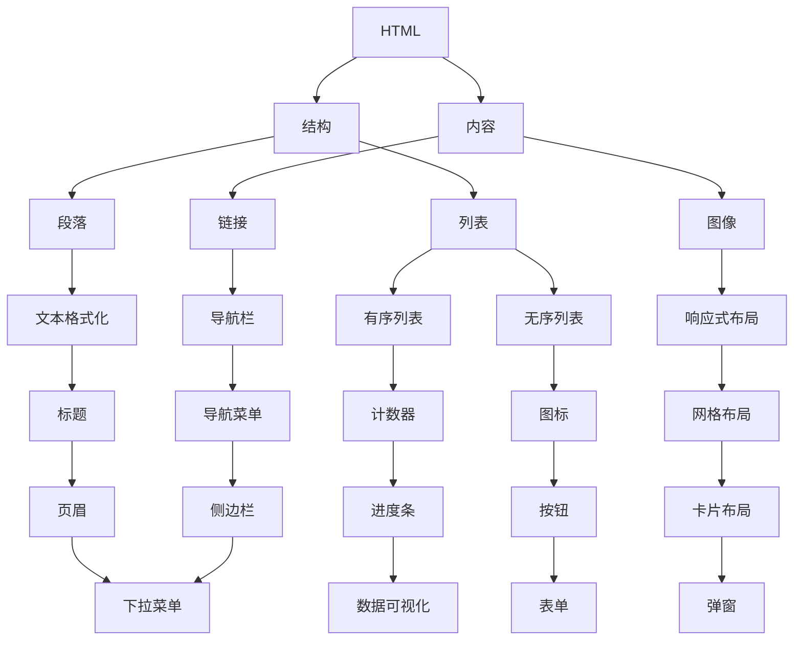
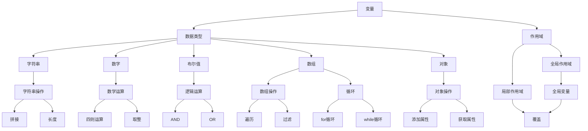
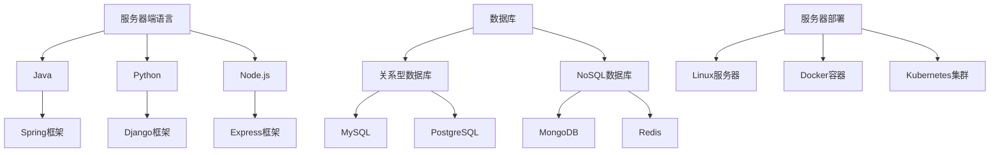
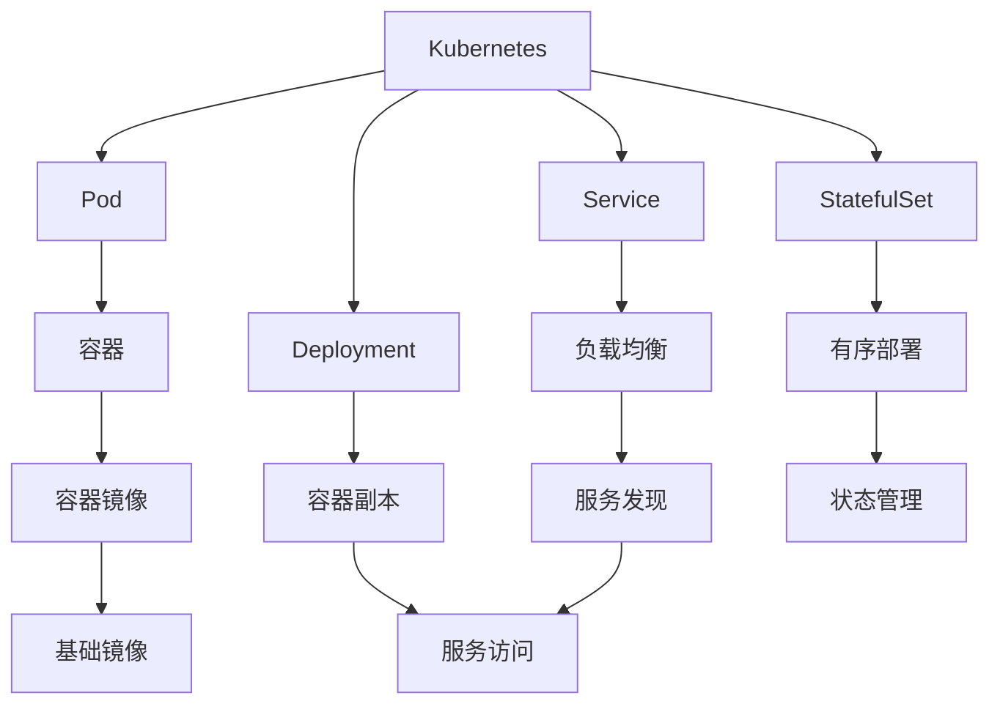
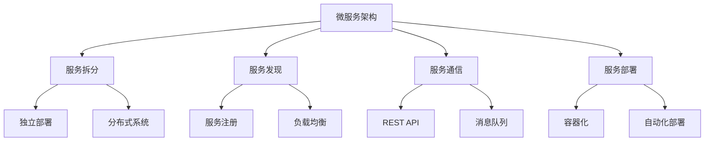
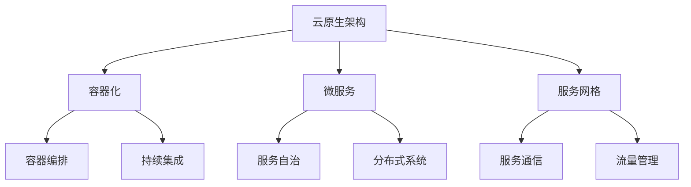
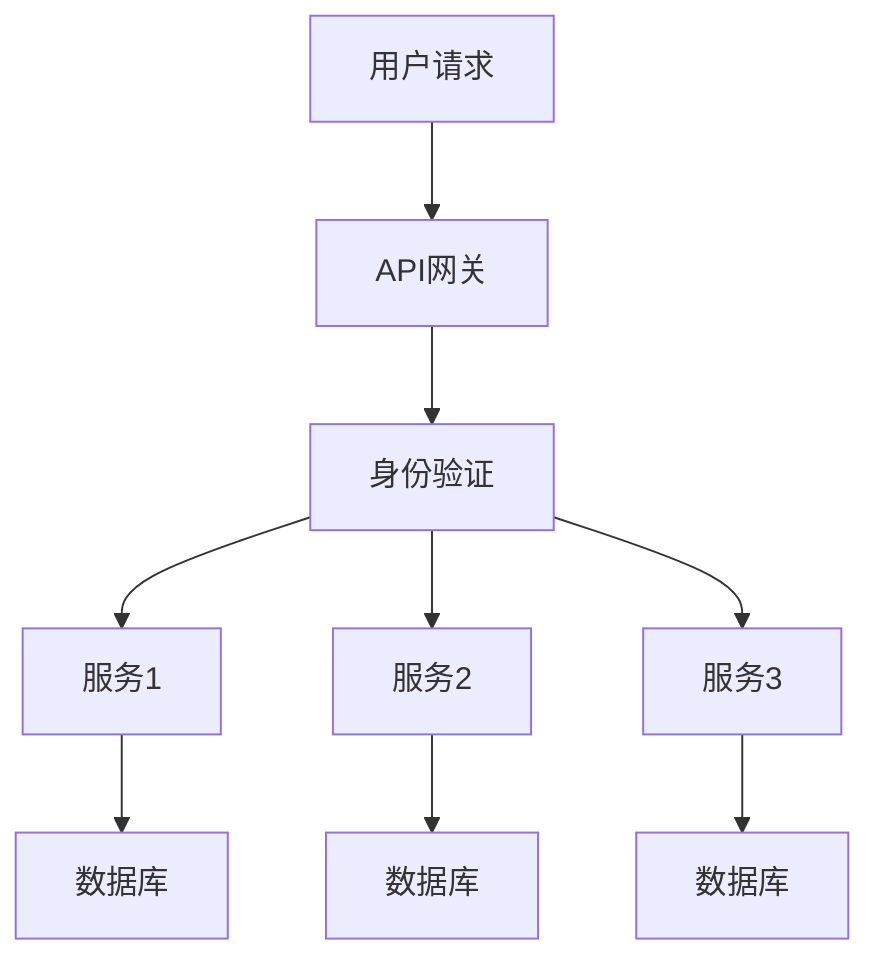
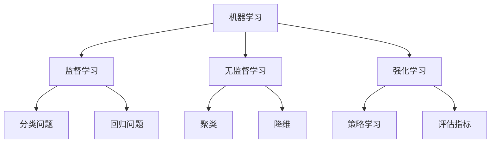
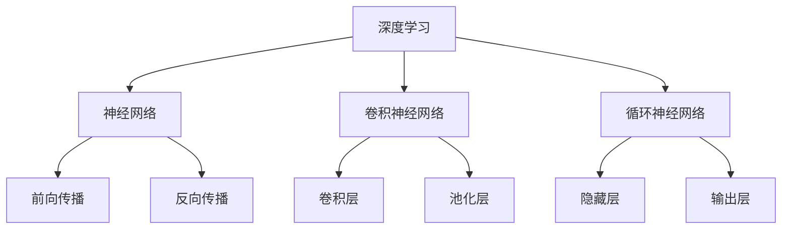
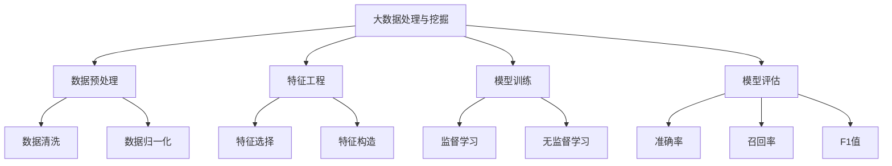

                 

### 文章标题：全栈工程师养成：跨界技能的培养

#### 关键词：全栈工程师、前端开发、后端开发、数据库、跨平台、云原生、人工智能

> **摘要**：本文将深入探讨全栈工程师的角色与技能要求，逐步讲解从基础到高级的跨界技能培养。通过详细剖析前端、后端开发、数据库技术、跨平台开发、云原生与人工智能，以及职业规划，旨在帮助读者全面掌握全栈工程师所需的全面技能，实现职业发展。

---

### 第一部分：全栈工程师的基础

#### 第1章：全栈工程师的职责与技能

##### 1.1 全栈工程师的定义与职责

全栈工程师（Full-Stack Engineer）是一种能够同时掌握前端和后端技术，能够独立完成产品开发的高级工程师。他们不仅需要了解前端技术的HTML、CSS、JavaScript，还需要掌握后端编程语言如Java、Python、Node.js等，同时还要熟悉数据库技术、服务器部署和运维等。全栈工程师的核心职责是能够独立完成产品开发，包括需求分析、设计、开发、测试和部署。

##### 1.2 全栈工程师的核心技能

1. **前端开发技能**：包括HTML、CSS和JavaScript的基础知识，熟悉主流前端框架如React、Vue、Angular等。
2. **后端开发技能**：掌握至少一种后端编程语言，如Java、Python、Node.js，了解服务器、API设计和数据库交互。
3. **数据库技术**：熟悉关系型数据库（如MySQL、PostgreSQL）和NoSQL数据库（如MongoDB、Redis）。
4. **服务器与部署**：了解Linux服务器管理、Docker容器化技术、Kubernetes集群管理。
5. **跨平台开发**：熟悉跨平台开发框架如React Native、Flutter。

##### 1.3 全栈工程师的发展路径

全栈工程师的职业发展可以分为以下几个阶段：

1. **初级全栈工程师**：掌握基础技能，能够独立完成小型项目。
2. **中级全栈工程师**：具备多语言开发能力，能够解决复杂问题，进行系统优化。
3. **高级全栈工程师**：拥有丰富的项目经验，能够独立领导团队，进行技术选型和架构设计。

#### 第2章：前端开发基础

##### 2.1 HTML与CSS基础

HTML（HyperText Markup Language）是网页内容的骨架，定义了网页的结构和内容。CSS（Cascading Style Sheets）用于控制网页的样式和布局。

**核心概念与联系**：


**HTML基础**：
```html
<!DOCTYPE html>
<html>
<head>
  <title>我的网页</title>
</head>
<body>

  <h1>欢迎来到我的网页</h1>
  <p>这是一个段落。</p>
  
  <a href="https://www.example.com">链接</a>

</body>
</html>
```

**CSS基础**：
```css
/* 样式规则 */
body {
  font-family: Arial, sans-serif;
  margin: 0;
  padding: 0;
}

h1 {
  color: #333;
  text-align: center;
}

p {
  font-size: 16px;
  line-height: 1.5;
}

img {
  max-width: 100%;
  height: auto;
}
```

##### 2.2 JavaScript基础

JavaScript是一种客户端脚本语言，用于增强网页的交互性和动态效果。

**核心概念与联系**：


**JavaScript基础**：
```javascript
// 变量和数据类型
let message = "Hello, World!";
const PI = 3.14159;

// 字符串操作
let greeting = "Hello";
greeting += ", JavaScript!";

// 数组操作
let colors = ["red", "green", "blue"];
colors.push("yellow");

// 对象操作
let person = {
  name: "John",
  age: 30,
  greet: function() {
    alert("Hello, " + this.name);
  }
};

// 事件处理
document.getElementById("myButton").addEventListener("click", function() {
  alert("Button clicked!");
});
```

##### 2.3 前端框架与库

前端框架与库如React、Vue、Angular等，可以简化前端开发流程，提高开发效率。

**React基础**：
```javascript
import React from 'react';

function HelloWorld() {
  return <h1>Hello, World!</h1>;
}

export default HelloWorld;
```

**Vue基础**：
```html
<!DOCTYPE html>
<html>
  <head>
    <title>Vue.js 示例</title>
    <script src="https://cdn.jsdelivr.net/npm/vue@2.6.14/dist/vue.js"></script>
  </head>
  <body>
    <div id="app">
      {{ message }}
    </div>
    <script>
      new Vue({
        el: '#app',
        data: {
          message: 'Hello, Vue!'
        }
      });
    </script>
  </body>
</html>
```

#### 第3章：后端开发基础

##### 3.1 后端技术概述

后端技术主要包括服务器端编程语言、框架、数据库和服务器部署等。

**核心概念与联系**：


**Java基础**：
```java
public class HelloWorld {
  public static void main(String[] args) {
    System.out.println("Hello, Java!");
  }
}
```

**Python基础**：
```python
# 使用 Python 3.x 版本
print("Hello, Python!")
```

**Node.js基础**：
```javascript
const http = require('http');

const server = http.createServer((req, res) => {
  res.writeHead(200, {'Content-Type': 'text/plain'});
  res.end('Hello, Node.js!');
});

server.listen(3000, () => {
  console.log('Server running at http://localhost:3000/');
});
```

##### 3.2 数据库基础

数据库是存储和管理数据的重要工具。关系型数据库（如MySQL、PostgreSQL）和NoSQL数据库（如MongoDB、Redis）各有特点。

**关系型数据库（MySQL）基础**：
```sql
-- 创建数据库
CREATE DATABASE mydatabase;

-- 创建表
CREATE TABLE users (
  id INT AUTO_INCREMENT PRIMARY KEY,
  name VARCHAR(50),
  age INT
);

-- 插入数据
INSERT INTO users (name, age) VALUES ('John', 30);

-- 查询数据
SELECT * FROM users;

-- 更新数据
UPDATE users SET age = 31 WHERE id = 1;

-- 删除数据
DELETE FROM users WHERE id = 1;
```

**NoSQL数据库（MongoDB）基础**：
```javascript
// 使用 MongoDB 3.6.x 版本
db = connect('mydatabase');

// 创建集合
db.createCollection('users');

// 插入文档
db.users.insertOne({
  _id: ObjectId(),
  name: 'John',
  age: 30
});

// 查询文档
db.users.find({});

// 更新文档
db.users.updateOne(
  { _id: ObjectId() },
  {
    $set: {
      age: 31
    }
  }
);

// 删除文档
db.users.deleteOne({ _id: ObjectId() });
```

##### 3.3 服务器与部署

服务器与部署包括Linux服务器管理、Docker容器化和Kubernetes集群管理。

**Linux服务器基础**：
```shell
# 安装 Apache 服务器
sudo apt-get update
sudo apt-get install apache2

# 启动 Apache 服务器
sudo systemctl start apache2

# 查看 Apache 服务器状态
sudo systemctl status apache2

# 安装 MySQL 服务器
sudo apt-get install mysql-server

# 配置 MySQL 密码
sudo mysql_secure_installation
```

**Docker容器化基础**：
```shell
# 安装 Docker
sudo apt-get update
sudo apt-get install docker-ce docker-ce-cli containerd.io

# 启动 Docker 服务
sudo systemctl start docker

# 查看 Docker 服务状态
sudo systemctl status docker

# 运行容器
sudo docker run -d -p 8080:80 nginx

# 查看 Docker 容器列表
sudo docker ps
```

**Kubernetes集群基础**：
```yaml
# Kubernetes 配置文件示例
apiVersion: v1
kind: Pod
metadata:
  name: my-pod
spec:
  containers:
  - name: my-container
    image: nginx
    ports:
    - containerPort: 80
```

#### 第4章：跨平台开发

##### 4.1 React Native与Flutter基础

React Native和Flutter是两种流行的跨平台开发框架，分别基于JavaScript和Dart语言。

**React Native基础**：
```javascript
import React from 'react';
import { View, Text, StyleSheet } from 'react-native';

const HelloWorld = () => {
  return (
    <View style={styles.container}>
      <Text style={styles.text}>Hello, React Native!</Text>
    </View>
  );
};

const styles = StyleSheet.create({
  container: {
    flex: 1,
    justifyContent: 'center',
    alignItems: 'center',
  },
  text: {
    fontSize: 24,
    fontWeight: 'bold',
  },
});

export default HelloWorld;
```

**Flutter基础**：
```dart
import 'package:flutter/material.dart';

void main() {
  runApp(MyApp());
}

class MyApp extends StatelessWidget {
  @override
  Widget build(BuildContext context) {
    return MaterialApp(
      title: 'Flutter Demo',
      theme: ThemeData(
        primarySwatch: Colors.blue,
      ),
      home: HelloWorld(),
    );
  }
}

class HelloWorld extends StatelessWidget {
  @override
  Widget build(BuildContext context) {
    return Scaffold(
      appBar: AppBar(title: Text('Hello, Flutter!')),
      body: Center(
        child: Text(
          'Hello, Flutter!',
          style: TextStyle(fontSize: 24, fontWeight: FontWeight.bold),
        ),
      ),
    );
  }
}
```

##### 4.2 移动端开发实践

移动端开发实践涉及UI设计、交互逻辑、数据存储等方面。

**React Native移动端开发实践**：
- **UI设计**：使用React Native组件库，如React Native Paper、Ant Design Mobile等。
- **交互逻辑**：使用React Native的事件处理机制，如onClick、onChange等。
- **数据存储**：使用AsyncStorage、SQLite等本地存储库。

**Flutter移动端开发实践**：
- **UI设计**：使用Flutter的Material和Cupertino主题库，实现iOS和Android的UI风格。
- **交互逻辑**：使用Flutter的Widget体系，如StatefulWidget和StatelessWidget。
- **数据存储**：使用Flutter的SharedPreferences、Hive等库进行数据存储。

##### 4.3 跨平台开发的优势与挑战

**优势**：
- **快速开发**：跨平台框架使得开发者可以同时开发iOS和Android应用，提高开发效率。
- **代码复用**：通过跨平台框架，开发者可以实现大部分代码的复用，降低维护成本。
- **用户体验**：跨平台应用可以提供接近原生应用的性能和用户体验。

**挑战**：
- **性能优化**：跨平台应用的性能通常不如原生应用，需要额外的时间和精力进行优化。
- **兼容性**：不同平台的特性和限制可能导致跨平台应用的兼容性问题。
- **生态差异**：iOS和Android的生态和技术栈存在差异，开发者需要适应不同的开发环境和工具。

#### 第5章：数据库技术

##### 5.1 关系型数据库与NoSQL数据库

关系型数据库（如MySQL、PostgreSQL）和NoSQL数据库（如MongoDB、Redis）各有优缺点。

**关系型数据库**：
- **优点**：数据结构化、查询效率高、易于维护。
- **缺点**：扩展性有限、不适合处理大量非结构化数据。

**NoSQL数据库**：
- **优点**：高扩展性、支持海量数据、灵活性高。
- **缺点**：查询效率相对较低、数据一致性较弱。

##### 5.2 数据库性能优化

数据库性能优化包括查询优化、索引优化、缓存策略等方面。

**查询优化**：
- **使用索引**：根据查询条件创建索引，提高查询效率。
- **避免全表扫描**：使用限制性较强的查询条件，减少全表扫描的次数。

**索引优化**：
- **选择合适的索引类型**：如B树索引、哈希索引等。
- **避免冗余索引**：删除不必要或冗余的索引，减少索引维护的开销。

**缓存策略**：
- **使用内存缓存**：将常用数据缓存到内存中，减少磁盘IO操作。
- **设置合理的缓存过期时间**：避免缓存数据过时导致查询失败。

##### 5.3 数据库安全性与备份

数据库安全性与备份包括用户权限管理、数据加密、定期备份等方面。

**用户权限管理**：
- **严格权限控制**：根据用户角色分配适当的权限，避免权限滥用。
- **定期审计权限**：定期审查用户权限，确保权限分配合理。

**数据加密**：
- **加密存储**：使用加密算法对敏感数据进行加密存储，防止数据泄露。
- **加密传输**：使用SSL/TLS等协议对数据传输进行加密，确保数据安全。

**定期备份**：
- **备份策略**：根据业务需求制定合适的备份策略，如全量备份、增量备份等。
- **备份验证**：定期验证备份数据的完整性和可用性，确保备份成功。

### 第二部分：全栈工程师的高级技能

#### 第6章：云原生与容器化

##### 6.1 Kubernetes入门

Kubernetes是一种容器编排工具，用于自动化部署、扩展和管理容器化应用。

**核心概念与联系**：


**Kubernetes基础**：
```yaml
# Kubernetes 配置文件示例
apiVersion: v1
kind: Pod
metadata:
  name: my-pod
spec:
  containers:
  - name: my-container
    image: nginx
    ports:
    - containerPort: 80
```

**部署与操作**：
```shell
# 创建 Pod
kubectl create -f my-pod.yaml

# 查看 Pod 状态
kubectl get pods

# 删除 Pod
kubectl delete -f my-pod.yaml
```

##### 6.2 容器化与微服务

容器化是利用Docker等工具将应用及其依赖打包为容器镜像，实现应用环境的隔离和可移植性。

**容器化基础**：
```shell
# 安装 Docker
sudo apt-get update
sudo apt-get install docker-ce docker-ce-cli containerd.io

# 启动 Docker 服务
sudo systemctl start docker

# 查看 Docker 服务状态
sudo systemctl status docker

# 运行容器
sudo docker run -d -p 8080:80 nginx

# 查看 Docker 容器列表
sudo docker ps
```

**微服务架构**：
微服务架构将应用拆分为多个独立的服务，每个服务负责特定的业务功能，通过API进行通信。

**核心概念与联系**：


**微服务实践**：
```shell
# 创建服务
sudo docker run -d -p 8080:80 my-service

# 查看服务状态
sudo docker ps

# 删除服务
sudo docker rm my-service
```

##### 6.3 云原生架构的设计与实现

云原生架构利用容器化、微服务、服务网格等技术，实现应用的弹性、可扩展性和自动化管理。

**核心概念与联系**：


**设计与实现**：
1. **容器化**：使用Docker将应用打包为容器镜像，实现环境一致性和可移植性。
2. **微服务**：将应用拆分为多个微服务，每个服务负责特定的业务功能，通过API进行通信。
3. **服务网格**：使用Istio等工具实现服务间的流量管理和安全控制。

**示例架构**：


### 第7章：人工智能与大数据

##### 7.1 机器学习基础

机器学习是人工智能的一个重要分支，通过算法从数据中学习规律，进行预测和决策。

**核心概念与联系**：


**监督学习**：
监督学习是一种从标记数据中学习的方法，包括分类和回归任务。

**核心算法原理讲解**：
分类问题：
```python
from sklearn.datasets import load_iris
from sklearn.model_selection import train_test_split
from sklearn.neighbors import KNeighborsClassifier

# 加载数据
iris = load_iris()
X_train, X_test, y_train, y_test = train_test_split(iris.data, iris.target, test_size=0.3)

# 创建模型
knn = KNeighborsClassifier(n_neighbors=3)

# 训练模型
knn.fit(X_train, y_train)

# 预测结果
predictions = knn.predict(X_test)

# 评估模型
accuracy = knn.score(X_test, y_test)
print("Accuracy:", accuracy)
```

回归问题：
```python
from sklearn.datasets import load_boston
from sklearn.model_selection import train_test_split
from sklearn.linear_model import LinearRegression

# 加载数据
boston = load_boston()
X_train, X_test, y_train, y_test = train_test_split(boston.data, boston.target, test_size=0.3)

# 创建模型
lr = LinearRegression()

# 训练模型
lr.fit(X_train, y_train)

# 预测结果
predictions = lr.predict(X_test)

# 评估模型
accuracy = lr.score(X_test, y_test)
print("Accuracy:", accuracy)
```

**无监督学习**：
无监督学习是从未标记的数据中学习的方法，包括聚类和降维任务。

聚类问题：
```python
from sklearn.datasets import make_blobs
from sklearn.cluster import KMeans

# 生成数据
X, _ = make_blobs(n_samples=100, centers=3, n_features=2, random_state=0)

# 创建模型
kmeans = KMeans(n_clusters=3, random_state=0)

# 训练模型
kmeans.fit(X)

# 预测结果
predictions = kmeans.predict(X)

# 评估模型
print("Cluster centers:", kmeans.cluster_centers_)
print("Labels:", predictions)
```

降维问题：
```python
from sklearn.datasets import make_circles
from sklearn.decomposition import PCA

# 生成数据
X, _ = make_circles(n_samples=1000, factor=0.5, noise=0.05)

# 创建模型
pca = PCA(n_components=2)

# 训练模型
X_pca = pca.fit_transform(X)

# 预测结果
print("Original data:", X)
print("Projected data:", X_pca)
```

**强化学习**：
强化学习是一种通过与环境交互进行决策的方法，包括策略学习和评估指标。

策略学习：
```python
import gym
import numpy as np

# 创建环境
env = gym.make("CartPole-v0")

# 定义策略
policy = np.zeros((env.observation_space.n, env.action_space.n))

# 训练策略
for episode in range(1000):
    state = env.reset()
    done = False
    while not done:
        action = np.argmax(policy[state])
        state, reward, done, _ = env.step(action)
        # 更新策略
        policy[state][action] += reward

# 评估策略
state = env.reset()
total_reward = 0
while True:
    action = np.argmax(policy[state])
    state, reward, done, _ = env.step(action)
    total_reward += reward
    if done:
        break
print("Total reward:", total_reward)
```

**评估指标**：
评估指标用于衡量模型的表现，常用的指标包括准确率、召回率、F1值、均方误差等。

准确率：
```python
from sklearn.metrics import accuracy_score

predictions = [0, 1, 1, 0]
actual = [0, 1, 0, 1]

accuracy = accuracy_score(actual, predictions)
print("Accuracy:", accuracy)
```

召回率：
```python
from sklearn.metrics import recall_score

predictions = [0, 1, 1, 0]
actual = [0, 1, 0, 1]

recall = recall_score(actual, predictions, average='macro')
print("Recall:", recall)
```

F1值：
```python
from sklearn.metrics import f1_score

predictions = [0, 1, 1, 0]
actual = [0, 1, 0, 1]

f1 = f1_score(actual, predictions, average='macro')
print("F1 Score:", f1)
```

均方误差：
```python
from sklearn.metrics import mean_squared_error

predictions = [1.0, 1.5, 2.0]
actual = [1.0, 1.2, 1.8]

mse = mean_squared_error(actual, predictions)
print("Mean Squared Error:", mse)
```

##### 7.2 深度学习实践

深度学习是机器学习的一个分支，通过多层神经网络进行特征提取和建模。

**核心概念与联系**：


**核心算法原理讲解**：
神经网络：
神经网络是一种由多个神经元组成的计算模型，用于模拟人脑神经元的工作原理。

前向传播：
前向传播是神经网络中的一系列计算过程，用于将输入数据通过网络传递到输出层。

反向传播：
反向传播是神经网络中的一种优化算法，用于通过反向传递误差来更新网络权重。

**TensorFlow基础**：
TensorFlow是一种开源深度学习框架，用于构建和训练神经网络。

```python
import tensorflow as tf

# 定义输入层
inputs = tf.keras.layers.Input(shape=(784,))

# 定义隐藏层
hidden = tf.keras.layers.Dense(128, activation='relu')(inputs)

# 定义输出层
outputs = tf.keras.layers.Dense(10, activation='softmax')(hidden)

# 创建模型
model = tf.keras.Model(inputs, outputs)

# 编译模型
model.compile(optimizer='adam', loss='categorical_crossentropy', metrics=['accuracy'])

# 加载数据
(x_train, y_train), (x_test, y_test) = tf.keras.datasets.mnist.load_data()

# 预处理数据
x_train = x_train.reshape(-1, 784).astype('float32') / 255.0
x_test = x_test.reshape(-1, 784).astype('float32') / 255.0

# 转换标签为one-hot编码
y_train = tf.keras.utils.to_categorical(y_train, 10)
y_test = tf.keras.utils.to_categorical(y_test, 10)

# 训练模型
model.fit(x_train, y_train, epochs=5, batch_size=32, validation_data=(x_test, y_test))

# 评估模型
model.evaluate(x_test, y_test)
```

**卷积神经网络（CNN）基础**：
卷积神经网络是一种专门用于图像处理和识别的神经网络。

卷积层：
卷积层用于从输入图像中提取局部特征。

池化层：
池化层用于降低图像分辨率，减少参数数量。

**核心算法原理讲解**：
卷积操作：
卷积操作是一种将滤波器（也称为卷积核）与输入图像进行点积的操作。

```python
import tensorflow as tf

# 创建模型
model = tf.keras.Sequential([
    tf.keras.layers.Conv2D(32, (3, 3), activation='relu', input_shape=(28, 28, 1)),
    tf.keras.layers.MaxPooling2D((2, 2)),
    tf.keras.layers.Conv2D(64, (3, 3), activation='relu'),
    tf.keras.layers.MaxPooling2D((2, 2)),
    tf.keras.layers.Flatten(),
    tf.keras.layers.Dense(128, activation='relu'),
    tf.keras.layers.Dense(10, activation='softmax')
])

# 编译模型
model.compile(optimizer='adam', loss='categorical_crossentropy', metrics=['accuracy'])

# 加载数据
(x_train, y_train), (x_test, y_test) = tf.keras.datasets.mnist.load_data()

# 预处理数据
x_train = x_train.reshape(-1, 28, 28, 1).astype('float32') / 255.0
x_test = x_test.reshape(-1, 28, 28, 1).astype('float32') / 255.0

# 转换标签为one-hot编码
y_train = tf.keras.utils.to_categorical(y_train, 10)
y_test = tf.keras.utils.to_categorical(y_test, 10)

# 训练模型
model.fit(x_train, y_train, epochs=5, batch_size=32, validation_data=(x_test, y_test))

# 评估模型
model.evaluate(x_test, y_test)
```

**循环神经网络（RNN）基础**：
循环神经网络是一种适用于序列数据的神经网络。

隐藏层：
隐藏层用于存储序列的信息。

输出层：
输出层用于生成序列的预测结果。

**核心算法原理讲解**：
门控机制：
门控机制是一种用于控制信息流动的机制，包括输入门、遗忘门和输出门。

```python
import tensorflow as tf

# 创建模型
model = tf.keras.Sequential([
    tf.keras.layers.LSTM(50, activation='relu', return_sequences=True),
    tf.keras.layers.LSTM(50, activation='relu'),
    tf.keras.layers.Dense(1)
])

# 编译模型
model.compile(optimizer='adam', loss='mse')

# 加载数据
x_train, y_train = ..., ...

# 预处理数据
x_train = tf.keras.preprocessing.sequence.pad_sequences(x_train, maxlen=100)
y_train = ...

# 训练模型
model.fit(x_train, y_train, epochs=100, batch_size=32)

# 评估模型
model.evaluate(x_train, y_train)
```

##### 7.3 大数据处理与挖掘

大数据处理与挖掘是利用大量数据进行分析和决策的过程，包括数据预处理、特征工程、模型训练和评估等方面。

**核心概念与联系**：


**核心算法原理讲解**：
数据预处理：
数据预处理是大数据处理的第一步，包括数据清洗、归一化和填充等操作。

特征工程：
特征工程是提高模型性能的重要手段，包括特征选择、构造和转换等操作。

模型训练：
模型训练是利用训练数据对模型进行调整和优化的过程。

模型评估：
模型评估是评估模型性能的重要手段，包括准确率、召回率、F1值等指标。

**Pandas基础**：
Pandas是一种Python数据处理库，用于进行数据预处理和特征工程。

```python
import pandas as pd

# 加载数据
data = pd.read_csv('data.csv')

# 数据清洗
data = data.dropna()

# 数据归一化
data = (data - data.mean()) / data.std()

# 特征选择
features = data[['feature1', 'feature2']]
labels = data['label']

# 特征构造
data['new_feature'] = data['feature1'] * data['feature2']

# 模型训练
from sklearn.linear_model import LinearRegression

model = LinearRegression()
model.fit(features, labels)

# 模型评估
predictions = model.predict(features)
accuracy = model.score(features, labels)
print("Accuracy:", accuracy)
```

**Scikit-learn基础**：
Scikit-learn是一种Python机器学习库，用于模型训练和评估。

```python
from sklearn.datasets import load_iris
from sklearn.model_selection import train_test_split
from sklearn.neighbors import KNeighborsClassifier
from sklearn.metrics import accuracy_score

# 加载数据
iris = load_iris()
X = iris.data
y = iris.target

# 数据预处理
X_train, X_test, y_train, y_test = train_test_split(X, y, test_size=0.3)

# 模型训练
knn = KNeighborsClassifier(n_neighbors=3)
knn.fit(X_train, y_train)

# 模型评估
predictions = knn.predict(X_test)
accuracy = accuracy_score(y_test, predictions)
print("Accuracy:", accuracy)
```

### 第8章：全栈工程师的职业规划

##### 8.1 职业发展路径

全栈工程师的职业发展路径可以分为以下几个阶段：

1. **初级全栈工程师**：掌握基础技能，能够独立完成小型项目。
2. **中级全栈工程师**：具备多语言开发能力，能够解决复杂问题，进行系统优化。
3. **高级全栈工程师**：拥有丰富的项目经验，能够独立领导团队，进行技术选型和架构设计。

##### 8.2 技能提升与学习资源

**技能提升方法**：
1. **自学**：通过在线课程、技术博客、书籍等学习资源，不断积累知识。
2. **实践**：通过实际项目锻炼技能，积累经验。
3. **合作**：与同行交流，参与开源项目，提升团队协作能力。

**学习资源推荐**：
1. **在线课程**：Coursera、edX、Udemy等平台提供的编程和人工智能课程。
2. **技术博客**：Medium、Dev.to、Hackernoon等平台上的技术文章。
3. **书籍**：《你不知道的JavaScript》、《深度学习》、《Python数据科学》等。

##### 8.3 职业规划与个人品牌建设

**职业规划**：
1. **明确目标**：设定清晰的职业目标，如成为某个领域的技术专家。
2. **规划路径**：制定实现目标的路径，包括所需技能和经验。
3. **持续学习**：不断学习新技能，保持对技术的热情。

**个人品牌建设**：
1. **建立个人博客**：分享自己的学习心得和技术经验，积累粉丝。
2. **参与开源项目**：贡献代码，提高技术影响力。
3. **参与技术社区**：加入技术社群，与同行交流，扩大人脉。

### 附录：全栈工程师资源与工具

#### 附录1：常用开发工具与资源

- **开发工具**：
  - Visual Studio Code
  - IntelliJ IDEA
  - PyCharm
  - WebStorm

- **学习资源**：
  - Coursera、edX、Udemy等在线课程平台
  - Medium、Dev.to、Hackernoon等技术博客平台
  - GitHub、Stack Overflow、GitHub等开源社区

#### 附录2：全栈工程师学习路径

1. **前端开发**：
   - HTML、CSS、JavaScript基础
   - React、Vue、Angular等前端框架
   - Web性能优化

2. **后端开发**：
   - Java、Python、Node.js等后端编程语言
   - Spring、Django、Express等后端框架
   - RESTful API设计

3. **数据库技术**：
   - MySQL、PostgreSQL等关系型数据库
   - MongoDB、Redis等NoSQL数据库
   - 数据库性能优化

4. **服务器与部署**：
   - Linux服务器管理
   - Docker、Kubernetes容器化技术
   - 服务器部署与运维

5. **跨平台开发**：
   - React Native、Flutter等跨平台框架
   - 移动端开发实践

6. **人工智能与大数据**：
   - 机器学习、深度学习基础
   - 大数据处理与挖掘
   - 数据可视化

#### 附录3：开源项目推荐

- **前端**：
  - React官方示例：[https://github.com/reactjs/react-webpack-starter](https://github.com/reactjs/react-webpack-starter)
  - Vue官方示例：[https://github.com/vuejs/vue-cli](https://github.com/vuejs/vue-cli)
  - Angular官方示例：[https://github.com/angular/angular-cli](https://github.com/angular/angular-cli)

- **后端**：
  - Spring Boot官方示例：[https://github.com/spring-projects/spring-boot-samples](https://github.com/spring-projects/spring-boot-samples)
  - Django官方示例：[https://github.com/django/django](https://github.com/django/django)
  - Flask官方示例：[https://github.com/pallets/flask](https://github.com/pallets/flask)

- **数据库**：
  - MySQL官方文档：[https://dev.mysql.com/doc/](https://dev.mysql.com/doc/)
  - MongoDB官方文档：[https://docs.mongodb.com/](https://docs.mongodb.com/)
  - Redis官方文档：[https://redis.io/documentation](https://redis.io/documentation)

- **容器化**：
  - Docker官方文档：[https://docs.docker.com/](https://docs.docker.com/)
  - Kubernetes官方文档：[https://kubernetes.io/docs/](https://kubernetes.io/docs/)

- **人工智能**：
  - TensorFlow官方文档：[https://www.tensorflow.org/](https://www.tensorflow.org/)
  - PyTorch官方文档：[https://pytorch.org/docs/](https://pytorch.org/docs/)

### 作者信息

作者：AI天才研究院/AI Genius Institute & 禅与计算机程序设计艺术 /Zen And The Art of Computer Programming

---

在撰写技术博客文章时，确保每个章节都包含核心概念、算法原理、数学模型、项目实战等内容，以便读者能够全面掌握相关技能。文章结构清晰，逻辑连贯，使用markdown格式输出，便于读者阅读和理解。通过详细的示例和讲解，帮助读者将理论知识应用到实践中，提高技术水平。同时，文章末尾提供相关资源和工具，方便读者进一步学习和实践。在撰写过程中，注意保持简洁明了的风格，避免冗长和复杂的叙述，以提高文章的可读性。最后，确保文章字数在8000～12000字左右，内容完整丰富，符合约

