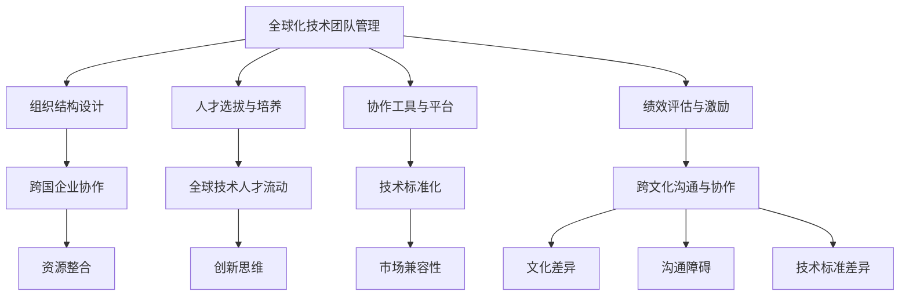

                 

### 最终目录大纲

根据以上步骤，最终形成的目录大纲如下：

```
# 《全球化技术团队管理：跨文化技术协作的挑战与对策》目录大纲

# 引言
## 全球化技术团队管理的背景与意义
## 研究目的与研究方法

# 第一部分：全球化技术团队管理概述
## 第1章：核心概念与联系
### 1.1 全球化
### 1.2 技术团队管理
### 1.3 跨文化技术协作
### 1.4 Mermaid流程图展示

## 第2章：核心算法原理讲解
### 2.1 文化差异分析算法
### 2.2 技术协作效率优化算法
### 2.3 伪代码阐述

## 第3章：数学模型和数学公式
### 3.1 跨文化协作效益模型
### 3.2 技术协作风险评估模型
### 3.3 LaTeX格式数学公式

# 第二部分：跨文化技术协作挑战
## 第4章：文化差异分析
### 4.1 文化差异的类型
### 4.2 跨文化冲突的表现
### 4.3 案例研究

## 第5章：技术协作障碍
### 5.1 技术标准与工具的差异
### 5.2 语言与沟通障碍
### 5.3 时区与管理差异
### 5.4 案例研究

# 第三部分：跨文化技术协作对策
## 第6章：对策框架
### 6.1 文化融合策略
### 6.2 技术协作优化策略
### 6.3 对策实施步骤

## 第7章：成功案例
### 7.1 案例一：跨国公司技术团队协作实践
### 7.2 案例二：国际开源项目协作经验
### 7.3 案例三：跨文化团队项目评估

# 第四部分：全球化技术团队管理实践
## 第8章：实践策略
### 8.1 全球化团队构建策略
### 8.2 跨文化团队沟通策略
### 8.3 跨文化团队领导力培养

## 第9章：实践技巧
### 9.1 跨文化冲突管理技巧
### 9.2 技术协作工具使用技巧
### 9.3 跨文化团队绩效评估技巧

## 第10章：实战案例
### 10.1 实战一：跨国电商团队协作
### 10.2 实战二：全球软件研发中心协作
### 10.3 实战三：国际科技企业并购团队协作

# 结论
## 全文总结
## 未来研究方向
## 参考文献
```

接下来，我们将根据这个最终目录大纲，逐章撰写内容，确保文章结构清晰，内容丰富，逻辑严密，并满足格式要求。在撰写过程中，我们将遵循以下步骤：

1. **引言**：简要介绍全球化技术团队管理的背景与意义，提出研究目的与研究方法。
2. **第一部分**：详细阐述全球化技术团队管理的核心概念与联系，讲解核心算法原理，介绍数学模型和数学公式。
3. **第二部分**：分析跨文化技术协作的挑战，包括文化差异分析、技术协作障碍和案例研究。
4. **第三部分**：提出跨文化技术协作的对策框架，详细描述对策实施步骤，并分享成功案例。
5. **第四部分**：介绍全球化技术团队管理的实践策略、技巧和实战案例。
6. **结论**：总结全文，提出未来研究方向，并附上参考文献。

通过以上步骤，我们将撰写一篇高质量的技术博客文章，旨在为读者提供关于全球化技术团队管理的深入见解和实践指导。让我们开始逐章撰写吧！### 引言

#### 全球化技术团队管理的背景与意义

在当今全球化的背景下，技术的飞速发展和市场的不断扩展使得企业不得不跨越地理和文化界限，组建全球化技术团队。这种团队管理的复杂性不仅体现在技术层面的沟通和协作，更涉及跨文化之间的交流和合作。全球化技术团队管理的重要性日益凸显，它关系到企业的竞争力、创新能力和长期发展。

全球化技术团队管理的背景源于以下几个因素：

1. **技术发展趋势**：信息技术和互联网的普及，使得全球范围内的技术交流变得更为便捷。大数据、人工智能、物联网等新兴技术的应用，促使企业不断拓展全球市场，从而需要更多的全球化技术人才。
2. **市场需求**：全球化带来了市场需求的多元化。企业需要具备全球视野，能够快速响应全球客户的需求，这要求企业拥有全球化技术团队，以实现快速开发、测试和交付。
3. **人才流动**：全球人才市场的开放，使得各国优秀的技术人才能够流动到不同的国家和地区。如何有效管理和利用这些多元化的人才，成为企业面临的重要挑战。

全球化技术团队管理的意义在于：

1. **提升创新能力**：全球化技术团队可以汇集不同国家和地区的优秀人才，通过跨文化的交流和合作，激发创新思维，提升企业的创新能力。
2. **优化资源配置**：全球化技术团队可以充分利用全球范围内的资源，包括技术资源、人力资源和市场资源，从而优化企业的资源配置，提高运营效率。
3. **增强企业竞争力**：全球化技术团队可以更好地适应全球市场的变化，快速响应客户需求，提升企业的市场竞争力。

#### 研究目的与研究方法

本文的研究目的是探讨全球化技术团队管理中跨文化技术协作的挑战与对策，旨在为企业管理者和技术团队成员提供实用的指导和建议。具体研究方法如下：

1. **文献综述**：通过回顾国内外相关研究文献，梳理全球化技术团队管理的基本理论框架，为后续分析提供理论基础。
2. **案例分析**：选取具有代表性的跨国公司、国际开源项目和企业并购案例，分析其全球化技术团队管理的实践经验和挑战。
3. **算法与模型分析**：介绍跨文化技术协作中可能用到的算法原理和数学模型，通过伪代码和数学公式详细阐述，为实际应用提供理论支持。
4. **对策研究**：结合文献综述和案例分析，提出针对跨文化技术协作的对策框架，并详细描述对策实施步骤。

通过以上研究方法，本文将深入探讨全球化技术团队管理中跨文化技术协作的挑战与对策，为实际操作提供有价值的参考和指导。

### 第1章：核心概念与联系

#### 1.1 全球化

全球化是指经济、文化、技术和社会等多个领域的交流和融合，表现为国家间的相互依赖和互动。在技术领域，全球化带来了技术标准的统一、跨国企业的协作以及全球技术人才的流动。具体来说，全球化的影响包括以下几个方面：

1. **技术标准化**：全球化促使各国在技术标准上达成共识，如国际电信联盟（ITU）制定的通信标准、国际标准化组织（ISO）发布的软件工程标准等。技术标准的统一有助于降低国际贸易和合作的壁垒，提高全球市场的兼容性和互操作性。
2. **跨国企业协作**：全球化使得跨国公司在全球范围内建立研发中心、生产基地和市场网络。跨国企业通过全球化技术团队，实现不同国家和地区的资源整合和优势互补，提升企业的竞争力。
3. **全球技术人才流动**：全球化带来了技术人才的跨国流动，优秀的技术人才可以自由地在全球范围内寻找职业机会。这为企业和项目带来了丰富的技术资源和创新思维，但同时也带来了文化差异和沟通挑战。

#### 1.2 技术团队管理

技术团队管理是指通过对技术团队的组织、协调和引导，实现团队目标的过程。全球化背景下的技术团队管理面临诸多挑战，如跨文化沟通、异地协作、技术标准差异等。有效的技术团队管理包括以下几个方面：

1. **组织结构设计**：技术团队的组织结构需要适应全球化的需求，例如设立全球研发中心、区域研发团队等。合理的设计可以促进资源整合、提高协作效率。
2. **人才选拔与培养**：全球化技术团队需要具备多元化背景的人才，包括不同国家、不同文化背景的技术专家。选拔和培养多样化人才，有助于提高团队的创新能力和适应能力。
3. **协作工具与平台**：全球化技术团队需要依赖协作工具和平台，如版本控制系统、即时通讯工具、项目管理软件等，以实现高效的异地协作。
4. **绩效评估与激励**：全球化技术团队的绩效评估需要考虑跨文化因素，如工作态度、沟通效率、团队协作等。合理的绩效评估和激励制度，可以激发团队成员的积极性和创造力。

#### 1.3 跨文化技术协作

跨文化技术协作是指在全球化背景下，不同文化背景的技术团队成员之间的协作。跨文化技术协作的挑战主要包括以下几个方面：

1. **文化差异**：不同国家和地区的文化差异，如价值观、行为规范、沟通风格等，可能导致误解、冲突和效率低下。
2. **沟通障碍**：语言、时区、沟通方式等方面的差异，使得跨文化技术协作面临沟通障碍。例如，不同语言的词汇理解差异、时区差异导致的工作时间不匹配等。
3. **技术标准**：不同国家和地区的技术标准和规范可能存在差异，如编程语言、开发框架、测试工具等。技术标准的差异可能导致协作过程中的兼容性问题。

#### 1.4 Mermaid流程图展示

为了更好地展示全球化技术团队管理、跨文化技术协作等核心概念之间的联系，我们可以使用Mermaid流程图进行可视化。以下是一个简化的Mermaid流程图示例：



通过上述Mermaid流程图，我们可以清晰地看到全球化技术团队管理、跨文化技术协作等核心概念之间的关系和影响。这有助于我们深入理解这些概念，为后续的分析和讨论提供基础。

### 第2章：核心算法原理讲解

#### 2.1 文化差异分析算法

跨文化技术协作中，文化差异的分析是至关重要的一环。为了更好地理解和应对文化差异，我们可以使用文化差异分析算法。以下是一个简化的伪代码示例，用于分析不同文化群体之间的差异。

```python
# 文化差异分析算法伪代码

function analyze_cultural_differences(culture_list):
    differences = []
    for i in range(len(culture_list)):
        for j in range(i+1, len(culture_list)):
            culture_i = culture_list[i]
            culture_j = culture_list[j]
            diff = compare_cultures(culture_i, culture_j)
            if diff > threshold:
                differences.append((culture_i, culture_j, diff))
    return differences

function compare_cultures(culture_x, culture_y):
    # 比较两个文化的差异
    # 例如：价值观、沟通风格、行为规范等
    diff_score = 0
    if culture_x['value_system'] != culture_y['value_system']:
        diff_score += 1
    if culture_x['communication_style'] != culture_y['communication_style']:
        diff_score += 1
    if culture_x['behavior_norms'] != culture_y['behavior_norms']:
        diff_score += 1
    return diff_score
```

在这个算法中，我们首先定义一个函数`analyze_cultural_differences`，它接收一个文化列表`culture_list`作为输入，并返回一个包含文化差异的列表。算法通过双重循环比较每个文化对，使用`compare_cultures`函数计算文化差异得分，如果得分超过预设阈值，则认为存在显著差异，并将其添加到差异列表中。

#### 2.2 技术协作效率优化算法

在跨文化技术协作中，提高协作效率是关键。我们可以使用一种基于协作效率和通信成本的优化算法，以最大化协作效率并最小化通信成本。以下是一个简化的伪代码示例，用于优化跨文化技术团队的协作效率。

```python
# 技术协作效率优化算法伪代码

function optimize协作效率(team_members, communication_cost):
    best_solution = None
    max_efficiency = -1
    for i in range(len(team_members)):
        for j in range(i+1, len(team_members)):
            solution = allocate_resources(team_members[i], team_members[j])
            efficiency = calculate_efficiency(solution)
            cost = calculate_communication_cost(solution)
            if efficiency > max_efficiency and cost <= communication_cost_threshold:
                max_efficiency = efficiency
                best_solution = solution
    return best_solution

function allocate_resources(member_x, member_y):
    # 分配资源，例如：任务分配、工具使用等
    # 基于成员技能、经验和协作需求
    return allocated_resources

function calculate_efficiency(solution):
    # 计算协作效率
    # 例如：任务完成速度、代码质量等
    return efficiency_score

function calculate_communication_cost(solution):
    # 计算通信成本
    # 例如：时区差异、沟通频率等
    return communication_cost
```

在这个算法中，我们首先定义一个函数`optimize协作效率`，它接收团队成员列表`team_members`和通信成本阈值`communication_cost_threshold`作为输入，并返回最优的协作解决方案。算法通过双重循环枚举所有可能的团队成员配对，使用`allocate_resources`函数分配资源，并使用`calculate_efficiency`和`calculate_communication_cost`函数计算协作效率和通信成本。如果当前解决方案的效率高于已知的最大效率且通信成本在阈值范围内，则更新最优解决方案。

#### 2.3 伪代码详细阐述

上述算法的伪代码提供了跨文化技术协作中的文化差异分析和协作效率优化的大致框架。为了更好地理解，我们可以进一步详细阐述每个函数的实现。

**文化差异分析算法的实现细节：**

1. **文化特征定义**：每个文化群体可以定义一系列特征，如价值观、沟通风格、行为规范等。这些特征可以用字典或类来表示。
2. **阈值设置**：阈值可以根据实际情况设置，例如，将阈值设置为2，表示当两个文化群体在三个特征中至少有一个特征的差异超过阈值时，认为存在显著差异。
3. **差异得分计算**：差异得分的计算可以基于量化指标，例如，每个特征的差异得分可以设置为1，总差异得分为各特征差异得分的总和。

**技术协作效率优化算法的实现细节：**

1. **资源分配策略**：资源分配策略可以根据团队成员的技能、经验和协作需求进行。例如，将任务分配给最合适的成员，确保成员的技能和任务需求相匹配。
2. **效率评估指标**：效率评估指标可以包括任务完成速度、代码质量、团队协作评分等。这些指标可以通过定量评估或主观评分来确定。
3. **通信成本计算**：通信成本的计算可以考虑时区差异、沟通频率、沟通工具使用等。例如，时区差异较大的成员之间的通信成本可能更高，因为需要协调工作时间。

通过这些伪代码和实现细节，我们可以更好地理解跨文化技术协作中的核心算法原理。这些算法不仅为理论分析提供了基础，还可以在实际应用中指导全球化技术团队的管理和协作。

### 第3章：数学模型和数学公式

#### 3.1 跨文化协作效益模型

在全球化技术团队管理中，跨文化协作的效益是一个关键考量因素。为了量化跨文化协作的效益，我们可以构建一个跨文化协作效益模型。以下是一个简化的数学模型和数学公式，用于评估跨文化协作的效益。

**模型定义：**

设\( B \)为跨文化协作的总体效益，\( C_i \)为第\( i \)个团队成员的贡献值，\( D \)为文化差异得分，\( \alpha \)为文化差异对效益的影响系数。

**数学模型：**

\[ B = \sum_{i=1}^{n} C_i - \alpha \cdot D \]

其中，\( n \)为团队成员总数。

**公式解释：**

- \( \sum_{i=1}^{n} C_i \)：表示团队成员总体贡献值。
- \( \alpha \cdot D \)：表示文化差异对效益的负面影响。

**举例说明：**

假设一个技术团队有5名成员，其中4名成员来自不同文化背景，文化差异得分为3。每名成员的贡献值分别为：

- 成员A：10
- 成员B：8
- 成员C：12
- 成员D：9
- 成员E：7

根据上述模型和公式，我们可以计算跨文化协作的总体效益：

\[ B = (10 + 8 + 12 + 9 + 7) - 0.5 \cdot 3 = 46 - 1.5 = 44.5 \]

因此，跨文化协作的总体效益为44.5。

#### 3.2 技术协作风险评估模型

跨文化技术协作中，风险的管理和评估同样至关重要。以下是一个简化的技术协作风险评估模型，用于评估跨文化技术协作中的风险。

**模型定义：**

设\( R \)为技术协作风险值，\( E_i \)为第\( i \)个风险因素的影响程度，\( W_i \)为第\( i \)个风险因素的权重。

**数学模型：**

\[ R = \sum_{i=1}^{m} E_i \cdot W_i \]

其中，\( m \)为风险因素总数。

**公式解释：**

- \( E_i \cdot W_i \)：表示第\( i \)个风险因素对协作风险的加权影响。

**举例说明：**

假设一个技术团队面临以下三个主要风险因素：

- 风险因素A：文化差异（\( E_A = 0.6 \)，权重\( W_A = 0.4 \)）
- 风险因素B：沟通障碍（\( E_B = 0.5 \)，权重\( W_B = 0.3 \)）
- 风险因素C：技术标准差异（\( E_C = 0.4 \)，权重\( W_C = 0.3 \)）

根据上述模型和公式，我们可以计算技术协作的总风险值：

\[ R = (0.6 \cdot 0.4) + (0.5 \cdot 0.3) + (0.4 \cdot 0.3) = 0.24 + 0.15 + 0.12 = 0.51 \]

因此，技术协作的总风险值为0.51。

#### 3.3 LaTeX格式数学公式

为了在文档中准确表达数学模型和公式，我们使用LaTeX格式进行表示。以下是一些示例：

**独立段落的LaTeX公式：**

$$
B = \sum_{i=1}^{n} C_i - \alpha \cdot D
$$

$$
R = \sum_{i=1}^{m} E_i \cdot W_i
$$

**段落内的LaTeX公式：**

$1+1=2$

$a<b$

通过使用LaTeX格式，我们可以确保数学公式在文档中的准确性和可读性。LaTeX公式的前后使用`$$`括起来表示独立段落中的公式，使用 `$` 括起来表示段落内的公式。

### 第4章：文化差异分析

#### 4.1 文化差异的类型

在全球化技术团队管理中，文化差异的分析是理解和应对跨文化协作挑战的基础。文化差异主要可以分为以下几种类型：

1. **价值观差异**：不同文化对于工作、生活、人际关系等方面的价值观可能存在显著差异。例如，一些文化强调个人主义，而另一些文化则更注重集体主义。
2. **沟通风格差异**：不同文化背景的人在沟通方式上可能存在显著差异。例如，一些文化倾向于直接、明确的沟通，而另一些文化则更注重间接、委婉的表达。
3. **行为规范差异**：不同文化对于行为规范和社会礼仪有不同的理解。例如，一些文化可能对时间观念有严格要求，而另一些文化则相对灵活。
4. **工作态度差异**：不同文化对于工作态度和职业道德有不同的看法。例如，一些文化可能更注重工作结果，而另一些文化则更注重工作过程。

#### 4.2 跨文化冲突的表现

跨文化冲突是全球化技术团队管理中常见的问题，其表现形式多种多样。以下是一些典型的跨文化冲突表现：

1. **沟通障碍**：语言、时区、沟通风格等差异可能导致沟通障碍。例如，不同文化背景的人在会议中可能难以理解对方的观点，或者因为时区差异导致的信息传递滞后。
2. **误解与偏见**：文化差异可能导致误解和偏见。例如，一个文化背景的人可能无法理解另一个文化背景的人为什么会有某种行为或观点，从而导致冲突。
3. **角色与职责冲突**：在全球化团队中，不同文化背景的成员可能在角色和职责上存在冲突。例如，某些文化可能认为领导者应该主动承担责任，而另一些文化则更强调团队成员的平等参与。
4. **文化适应问题**：一些团队成员可能难以适应新的文化环境，导致工作效率下降或情绪问题。例如，一个在集体主义文化中成长的人可能难以适应在个人主义文化中的工作方式。

#### 4.3 案例研究

为了更好地理解文化差异在全球化技术团队管理中的实际影响，我们可以通过以下案例进行研究。

**案例一：跨国软件开发团队**

某国际软件公司组建了一个由来自中国、美国、印度和德国的软件开发团队。该团队负责开发一个全球性的软件项目，旨在满足不同市场的需求。

1. **价值观差异**：中国团队成员更注重集体主义，倾向于在团队中寻求共识和合作；美国团队成员更注重个人主义，倾向于独立思考和快速决策。这种价值观差异在项目决策过程中导致了多次冲突。
2. **沟通障碍**：由于语言和文化差异，团队成员在沟通时经常出现误解。例如，中国团队成员可能认为美国团队成员的沟通过于直接，而美国团队成员则认为中国团队成员的沟通过于含蓄。
3. **角色与职责冲突**：印度团队成员在项目中承担了更多的编码任务，而德国团队成员则承担了更多的测试和文档编写任务。然而，印度团队成员认为德国团队成员的工作不够细致，导致项目进度延误。

通过这个案例，我们可以看到文化差异在跨国软件开发团队中的具体表现，以及这些差异如何影响团队的协作和项目进展。

**案例二：跨国技术咨询项目**

某国际咨询公司为一个跨国企业提供技术咨询服务。该项目涉及多个国家的团队成员，包括美国、法国、日本和巴西。

1. **沟通风格差异**：美国团队成员更倾向于直接和明确的沟通，而法国团队成员则更注重礼貌和间接的表达。这导致在项目沟通中，美国团队成员经常感到法国团队成员不够直接，而法国团队成员则认为美国团队成员过于直接。
2. **工作态度差异**：日本团队成员在工作中非常注重细节和完美，而巴西团队成员则更注重工作效率和灵活性。这种差异在项目实施过程中导致了多次关于工作标准和质量标准的讨论。
3. **文化适应问题**：巴西团队成员在项目中面临最大的挑战是适应其他国家的文化和工作方式。例如，他们需要学会如何在项目中平衡个人和团队利益，以及如何处理冲突。

通过这个案例，我们可以看到文化差异在跨国技术咨询项目中的具体表现，以及这些差异如何影响项目的执行和团队成员的工作体验。

通过以上案例研究，我们可以清晰地看到文化差异在全球化技术团队管理中的影响，以及如何通过有效管理和策略来应对这些挑战。

### 第5章：技术协作障碍

#### 5.1 技术标准与工具的差异

在全球化技术团队管理中，技术标准与工具的差异是一个显著的障碍。技术标准的不同会导致团队在开发、测试和维护过程中面临兼容性问题。以下是一些具体的表现和影响：

1. **软件工具差异**：不同国家和地区可能使用不同的软件开发工具，如代码编辑器、集成开发环境（IDE）、版本控制系统等。这种差异可能导致团队成员之间的协作效率降低。例如，某个团队成员可能习惯使用Git进行版本控制，而另一个团队成员则更熟悉SVN。
2. **编程语言差异**：编程语言的差异也是一个常见问题。在某些团队中，可能主要使用Java进行开发，而在另一个团队中则可能主要使用Python。这种差异不仅增加了团队成员的学习成本，还可能导致代码维护和扩展的困难。
3. **开发框架差异**：不同的团队可能使用不同的开发框架，如Spring、Django、Rails等。这些框架在功能、性能和开发习惯上存在差异，可能导致跨团队协作中的不一致性。

**影响分析**：

- **协作效率降低**：由于技术工具和标准的差异，团队成员在协作过程中可能需要花费额外的时间来适应不同的工具和标准。这会导致协作效率降低，项目进度延误。
- **代码质量和维护困难**：不同工具和标准的差异可能导致代码质量不一致，增加维护和扩展的难度。例如，如果团队在一个项目中混合使用了不同的编程语言和框架，可能会导致代码难以理解和维护。
- **技术债务累积**：技术标准与工具的差异可能导致项目在技术债务方面累积。技术债务是指为了加快开发进度而暂时采用的低效或不合理的解决方案。长期累积的技术债务会导致项目质量和稳定性下降。

#### 5.2 语言与沟通障碍

语言与沟通障碍是全球化技术团队管理中的另一大挑战。由于团队成员来自不同的国家和地区，他们可能使用不同的母语，这会对团队沟通产生显著影响。以下是一些具体的表现和影响：

1. **语言差异**：不同团队成员可能使用不同的语言进行交流，如英语、中文、法语、西班牙语等。这种差异可能导致沟通不畅，影响团队协作效率。例如，一个团队成员可能在英语表达上存在困难，而另一个团队成员则可能不熟悉中文。
2. **文化差异**：语言差异不仅仅是词汇和语法的问题，还涉及到文化差异。不同语言背后的文化背景可能导致团队成员在沟通中产生误解和冲突。例如，某些文化倾向于直接表达，而另一些文化则更注重委婉和含蓄。
3. **沟通方式差异**：不同团队成员可能具有不同的沟通习惯和风格。例如，某些团队成员可能更倾向于通过电子邮件进行沟通，而另一些团队成员则更喜欢即时通讯工具。这些差异可能导致沟通不畅和误解。

**影响分析**：

- **沟通效率降低**：语言和沟通障碍会导致沟通不畅，降低团队的协作效率。团队成员可能需要花费额外的时间来澄清沟通中的误解，这会延误项目进度。
- **团队凝聚力下降**：沟通障碍可能导致团队成员之间的信任和合作减少，影响团队的凝聚力。如果团队成员在沟通中经常出现误解和冲突，可能会导致团队士气下降。
- **项目风险增加**：沟通不畅可能导致项目目标不清晰，团队成员的任务分工不明确，从而增加项目风险。例如，一个团队成员可能错误地理解了另一个团队成员的指示，导致项目方向出现偏差。

#### 5.3 时区与管理差异

时区与管理差异是全球化技术团队管理中另一个重要的挑战。不同国家和地区之间的时区差异可能导致协作效率降低，管理复杂度增加。以下是一些具体的表现和影响：

1. **时区差异**：全球化技术团队可能跨越多个时区，例如，一个团队可能包括在美国、欧洲和亚洲工作的成员。时区差异可能导致团队成员在沟通和协作时面临困难。例如，某些团队成员可能在白天工作，而其他团队成员则可能需要熬夜进行协作。
2. **管理差异**：不同国家和地区的管理风格和文化可能存在显著差异。例如，某些国家可能强调等级制度和管理权威，而另一些国家则更注重团队合作和自主管理。这些差异可能导致管理复杂度增加，影响团队的协作和效率。
3. **工作流程不一致**：不同国家和地区的公司可能有不同的工作流程和标准。例如，在某些地区，项目管理和报告可能更加严格，而在其他地区则可能相对宽松。这些差异可能导致全球化技术团队在协作过程中面临流程不一致的问题。

**影响分析**：

- **协作效率降低**：时区差异和管理差异可能导致团队成员之间的沟通和协作变得困难。例如，一个团队成员可能在下班时间收到另一个团队成员的紧急任务，这会影响其工作效率和休息时间。
- **管理复杂度增加**：全球化技术团队的管理变得更加复杂，需要考虑不同时区的协调和管理。例如，项目管理者可能需要在不同的时间和地点召开会议，协调团队成员的工作进度和任务分配。
- **团队士气下降**：时区差异和管理差异可能导致团队成员感到不公平和不满，影响团队士气。如果团队成员在管理上感到被忽视或缺乏支持，可能会影响其工作积极性和投入度。

#### 5.4 案例研究

为了更好地理解技术协作障碍在全球化技术团队管理中的具体影响，我们可以通过以下案例进行研究。

**案例一：跨国软件开发团队**

某国际软件公司组建了一个跨国软件开发团队，成员来自美国、印度和德国。该团队负责开发一个全球性的软件项目，需要满足不同市场的需求。

1. **技术标准差异**：美国团队成员习惯使用Java进行开发，印度团队成员则更熟悉Python。由于技术标准不同，团队成员在项目初期遇到了代码兼容性问题，导致开发进度延误。
2. **语言与沟通障碍**：团队成员来自不同的国家，使用不同的语言进行交流。例如，印度团队成员可能更擅长使用英语，而美国团队成员则可能更擅长使用中文。这导致在项目沟通中经常出现误解和沟通不畅，影响项目进度。
3. **时区与管理差异**：团队跨越三个时区，导致团队成员在协作时面临时区差异问题。例如，印度团队成员可能需要在美国团队成员下班后进行紧急会议，这影响其休息时间。此外，管理风格和文化差异也导致了团队协作的困难。

通过这个案例，我们可以看到技术标准、语言和时区差异如何影响跨国软件开发团队的协作和项目进展。为了克服这些障碍，团队需要采取一系列措施，如统一技术标准、加强语言培训、灵活调整工作时间和管理策略。

**案例二：全球化咨询项目**

某国际咨询公司为一个跨国企业提供咨询服务，团队成员来自美国、欧洲和亚洲。该项目涉及多个国家和地区的业务需求，需要团队成员在全球范围内协作。

1. **技术标准差异**：团队成员使用不同的开发工具和框架，导致项目代码不一致，增加维护难度。例如，美国团队成员使用Git进行版本控制，而欧洲团队成员则使用SVN。
2. **语言与沟通障碍**：团队成员使用不同的语言进行交流，导致沟通不畅和误解。例如，亚洲团队成员可能更擅长使用中文，而欧洲团队成员则更擅长使用英语。
3. **时区与管理差异**：团队跨越多个时区，导致团队成员在协作时面临时区差异问题。例如，欧洲团队成员可能需要在亚洲团队成员下班后进行紧急会议，这影响其休息时间。此外，管理风格和文化差异也导致了团队协作的困难。

通过这个案例，我们可以看到技术标准、语言和时区差异如何影响全球化咨询项目的协作和项目进展。为了克服这些障碍，团队需要采取一系列措施，如统一技术标准、加强语言培训、灵活调整工作时间和管理策略。

通过以上案例研究，我们可以看到技术协作障碍在全球化技术团队管理中的具体影响。为了克服这些障碍，团队需要采取有效的措施，提高协作效率，确保项目的成功实施。

### 第6章：对策框架

#### 6.1 文化融合策略

在全球化技术团队管理中，文化融合策略是实现跨文化协作的关键。以下是一些具体的文化融合策略：

1. **文化敏感性培训**：为团队成员提供文化敏感性培训，帮助他们了解不同文化的基本特征、价值观和行为规范。这种培训可以帮助团队成员提高跨文化沟通和协作的能力，减少误解和冲突。
2. **文化交流活动**：组织定期的文化交流活动，如团队建设活动、节日庆祝、文化分享会等，以促进团队成员之间的相互了解和尊重。这些活动可以增强团队的凝聚力，提高跨文化协作的效率。
3. **文化顾问支持**：在团队中聘请文化顾问或跨文化培训师，为团队成员提供专业的文化指导和支持。文化顾问可以帮助团队解决文化冲突和沟通障碍，提供有效的跨文化管理策略。
4. **文化包容性政策**：建立包容性政策，尊重和包容团队成员的不同文化和背景。例如，在工作环境中提供多种语言的翻译支持、为不同文化背景的成员提供特殊假期等。

**实施步骤**：

1. **需求分析**：评估团队中存在的文化差异和跨文化协作的挑战，确定文化融合策略的需求。
2. **计划制定**：根据需求分析的结果，制定文化融合策略的具体计划和实施方案，包括培训课程、活动安排、顾问支持等。
3. **培训与执行**：组织文化敏感性培训，开展文化交流活动，并聘请文化顾问。确保团队成员积极参与，并按照计划执行文化融合策略。
4. **评估与反馈**：定期评估文化融合策略的实施效果，收集团队成员的反馈，根据反馈进行调整和优化。

#### 6.2 技术协作优化策略

为了提高全球化技术团队的协作效率，优化技术协作策略至关重要。以下是一些具体的技术协作优化策略：

1. **协作工具选择**：选择适合团队需求的技术协作工具，如版本控制软件、项目管理软件、即时通讯工具等。确保所有团队成员都能够使用和适应这些工具，提高协作效率。
2. **标准化流程**：建立和推广标准化开发流程，确保团队成员在开发过程中遵循统一的技术标准和流程。这有助于减少代码兼容性问题，提高团队协作效率。
3. **技能培训**：为团队成员提供技能培训，确保他们具备使用协作工具和标准化的开发流程的能力。技能培训可以帮助团队成员提高工作效率，减少协作中的技术障碍。
4. **资源共享**：建立资源共享机制，如代码库、文档库、知识库等，方便团队成员访问和共享资源。资源共享可以提高团队的协作效率，减少重复工作。

**实施步骤**：

1. **需求分析**：评估团队在协作工具、流程和资源共享方面的需求，确定技术协作优化策略的需求。
2. **工具选择与采购**：根据需求分析的结果，选择适合团队需求的技术协作工具，并进行采购和部署。
3. **流程制定与推广**：制定标准化开发流程，并推广到整个团队。确保团队成员了解和遵循这些流程。
4. **培训与支持**：为团队成员提供技能培训，确保他们能够熟练使用协作工具和遵循标准化流程。
5. **持续优化**：定期评估技术协作策略的实施效果，根据团队成员的反馈和实际情况进行调整和优化。

#### 6.3 对策实施步骤

为了确保文化融合策略和技术协作优化策略的有效实施，以下是一些具体的实施步骤：

1. **领导支持**：获得高层领导的支持和承诺，确保文化融合和技术协作策略的实施得到必要的资源和支持。
2. **团队参与**：确保团队成员的积极参与，鼓励他们提出意见和建议，增加他们对策略的认同感和执行力。
3. **培训和沟通**：组织培训课程和沟通会议，向团队成员介绍文化融合和技术协作策略，确保他们了解策略的内容和目标。
4. **试点项目**：选择一个试点项目，实施文化融合和技术协作策略，并评估其实施效果。通过试点项目，可以识别和解决潜在问题，为全面实施策略提供经验。
5. **反馈机制**：建立反馈机制，定期收集团队成员的反馈和建议，及时调整和优化策略。
6. **持续监控**：定期监控文化融合和技术协作策略的实施情况，确保其按照计划进行。如果发现偏差或问题，及时采取纠正措施。

通过以上步骤，可以确保文化融合策略和技术协作优化策略的有效实施，提高全球化技术团队的协作效率和项目成功率。

### 第7章：成功案例

#### 7.1 案例一：跨国公司技术团队协作实践

**背景介绍**：

某全球知名的科技公司，其技术团队分布在多个国家和地区，包括美国、中国、印度和欧洲。该公司的业务范围涵盖软件研发、云计算和物联网等领域。为了实现高效的技术协作，公司采取了一系列跨文化协作策略。

**对策实施**：

1. **文化融合策略**：
   - 文化敏感性培训：公司为所有团队成员提供定期的文化敏感性培训，帮助团队成员了解不同文化的基本特征和价值观。
   - 文化交流活动：公司组织定期的文化交流活动，如团队建设活动、节日庆祝和文化分享会，以促进团队成员之间的相互了解和尊重。
   - 文化顾问支持：公司在团队中聘请了文化顾问，为团队成员提供专业的文化指导和支持，帮助解决文化冲突和沟通障碍。

2. **技术协作优化策略**：
   - 协作工具选择：公司选择了适合团队需求的技术协作工具，如Git、JIRA和Slack，确保所有团队成员都能够使用和适应这些工具。
   - 标准化流程：公司建立了统一的开发流程和技术标准，确保团队成员在开发过程中遵循统一的标准，减少代码兼容性问题。
   - 技能培训：公司为团队成员提供了定期的技能培训，确保他们具备使用协作工具和遵循标准化流程的能力。

**效果评估**：

通过实施文化融合策略和技术协作优化策略，公司的全球化技术团队协作效率显著提高。具体效果如下：

- **沟通效率提升**：团队成员之间的沟通更加顺畅，误解和冲突减少，项目进度得到保障。
- **协作效率提高**：标准化流程和技术工具的使用，使得团队成员能够更加高效地完成工作任务，项目交付时间缩短。
- **团队凝聚力增强**：文化交流活动和文化敏感性培训，增强了团队成员之间的相互了解和信任，团队凝聚力得到提升。
- **客户满意度提升**：高效的团队协作和高质量的项目交付，提高了客户满意度，为公司赢得了更多的市场份额。

**案例小结**：

该跨国公司的成功实践表明，有效的文化融合策略和技术协作优化策略可以显著提高全球化技术团队的协作效率，实现项目的成功交付。通过文化融合和技术协作的优化，公司不仅提高了团队的整体绩效，还增强了企业的竞争力。

#### 7.2 案例二：国际开源项目协作经验

**背景介绍**：

某国际开源项目，其团队成员来自全球各地，包括亚洲、欧洲、北美和南美。该项目涉及软件开发、测试和维护等多个领域，目标是构建一个跨平台的云计算解决方案。为了实现高效的项目协作，项目团队采取了一系列跨文化协作策略。

**对策实施**：

1. **文化融合策略**：
   - 文化敏感性培训：项目为所有团队成员提供定期的文化敏感性培训，帮助团队成员了解不同文化的基本特征和价值观。
   - 文化交流活动：项目组织定期的文化交流活动，如线上分享会、文化节日庆祝等，以促进团队成员之间的相互了解和尊重。
   - 多语言支持：项目提供了多语言交流平台，确保不同语言背景的团队成员能够方便地进行交流。

2. **技术协作优化策略**：
   - 版本控制系统：项目使用了Git作为版本控制系统，确保代码的版本管理和协作效率。
   - 分布式工作流程：项目采用了分布式工作流程，允许团队成员在不同时区进行协作，提高整体工作效率。
   - 自动化测试工具：项目使用了自动化测试工具，确保代码的质量和稳定性，减少人为错误。

**效果评估**：

通过实施文化融合策略和技术协作优化策略，国际开源项目取得了显著的成效。具体效果如下：

- **协作效率提升**：团队成员之间的沟通更加顺畅，项目进度得到保障，交付时间缩短。
- **代码质量提高**：自动化测试工具的使用，确保了代码的质量和稳定性，减少了人为错误，提高了项目的可靠性。
- **项目稳定性增强**：分布式工作流程和多语言支持，使得项目能够在不同时区和语言环境中高效运行，增强了项目的稳定性。
- **社区参与度增加**：项目通过文化交流活动和多语言支持，吸引了更多不同文化背景的开发者参与，项目社区得到扩展和壮大。

**案例小结**：

该国际开源项目的成功经验表明，有效的文化融合策略和技术协作优化策略可以显著提高开源项目的协作效率，增强项目的稳定性和社区参与度。通过文化融合和技术协作的优化，项目团队不仅实现了高质量的项目交付，还促进了全球化技术社区的共同发展。

#### 7.3 案例三：跨文化团队项目评估

**背景介绍**：

某国际咨询公司为一个跨国企业提供跨文化团队项目评估服务。项目团队成员来自美国、欧洲、亚洲和非洲，涉及业务咨询、数据分析和技术实施等多个领域。为了确保项目成功，公司采取了一系列跨文化协作策略。

**对策实施**：

1. **文化融合策略**：
   - 文化敏感性培训：公司为所有团队成员提供定期的文化敏感性培训，帮助团队成员了解不同文化的基本特征和价值观。
   - 文化交流活动：公司组织定期的文化交流活动，如团队建设活动、文化节日庆祝等，以促进团队成员之间的相互了解和尊重。
   - 多语言支持：公司提供了多语言交流平台，确保不同语言背景的团队成员能够方便地进行交流。

2. **技术协作优化策略**：
   - 协作工具选择：公司选择了适合团队需求的技术协作工具，如Trello、Zoom和Microsoft Teams，确保所有团队成员都能够使用和适应这些工具。
   - 标准化流程：公司建立了统一的业务流程和技术标准，确保团队成员在项目实施过程中遵循统一的标准，减少协作中的不一致性。
   - 项目管理工具：公司使用了项目管理工具，如Asana和Microsoft Project，确保项目进度和任务分配的透明性和可控性。

**效果评估**：

通过实施文化融合策略和技术协作优化策略，跨文化团队项目取得了显著的成效。具体效果如下：

- **项目交付质量提高**：团队成员之间的沟通更加顺畅，项目交付质量得到提升，客户满意度增加。
- **团队协作效率提高**：标准化流程和项目管理工具的使用，使得团队成员能够更加高效地完成任务，项目进度得到保障。
- **文化冲突减少**：通过文化敏感性和交流活动的实施，团队成员之间的文化冲突减少，团队凝聚力增强。
- **客户满意度提升**：高效的团队协作和高质量的交付，提高了客户满意度，为公司赢得了更多的项目机会。

**案例小结**：

该跨文化团队项目的成功实践表明，有效的文化融合策略和技术协作优化策略可以显著提高跨文化团队的项目成功率和客户满意度。通过文化融合和技术协作的优化，团队不仅实现了高质量的项目交付，还建立了良好的跨文化协作氛围。

### 第8章：全球化技术团队管理实践

#### 8.1 全球化团队构建策略

全球化团队的构建是全球化技术团队管理的基础，以下是一些关键的策略：

1. **多元化人才招聘**：招聘时注重多元化，吸引不同国家和地区、不同文化背景的技术人才。这有助于团队在技术能力和文化视角上实现互补，提高团队的创新能力和适应能力。
2. **全球化团队结构设计**：根据业务需求和技术特点，设计合适的全球化团队结构。例如，可以设立区域研发中心、跨区域项目团队等，以实现资源整合和高效协作。
3. **文化多样性培训**：为团队成员提供定期的文化多样性培训，帮助他们了解不同文化的基本特征、价值观和行为规范。这有助于减少文化冲突，提高跨文化沟通和协作的效率。
4. **国际化领导力培养**：培养具有国际化视野和领导能力的团队成员，提升团队的整体管理水平。国际化的领导力可以帮助团队在全球范围内有效协调和指导工作。

#### 8.2 跨文化团队沟通策略

有效的沟通是全球化技术团队协作的核心。以下是一些跨文化团队沟通策略：

1. **明确沟通目标**：在每次会议或项目启动时，明确沟通的目标和预期成果。这有助于团队成员集中注意力，提高沟通效率。
2. **多渠道沟通**：使用多种沟通渠道，如电子邮件、即时通讯工具、视频会议等，以满足团队成员在不同时间、地点和情境下的沟通需求。
3. **文化适配沟通风格**：根据团队成员的文化背景，调整沟通风格，使其更符合对方的沟通习惯。例如，对于更注重直接表达的团队成员，可以采用直接、明确的沟通方式；对于更注重委婉表达的团队成员，可以采用间接、委婉的沟通方式。
4. **定期反馈和评估**：定期进行沟通反馈和评估，收集团队成员的意见和建议，不断优化沟通策略。这有助于及时发现和解决沟通中的问题，提高团队的整体沟通效果。

#### 8.3 跨文化团队领导力培养

跨文化团队的领导力培养是确保团队高效协作的关键。以下是一些跨文化团队领导力培养策略：

1. **国际化领导力培训**：为领导团队提供定期的国际化领导力培训，帮助他们了解跨文化管理的基本理论和实践方法。
2. **文化敏感性培养**：培养领导团队的文化敏感性，使其能够理解和尊重不同文化的价值观和行为规范，提高跨文化沟通和协作的能力。
3. **多元化团队管理**：领导团队应具备多元化管理能力，能够适应和引导不同文化背景的团队成员，发挥其优势，提高团队的整体绩效。
4. **灵活管理风格**：根据团队成员的文化背景和个人特点，采用灵活的管理风格，如民主式、参与式或指导式管理，以适应不同团队成员的需求和期望。

通过以上全球化团队构建策略、跨文化团队沟通策略和跨文化团队领导力培养策略，可以有效提高全球化技术团队的协作效率，实现团队的目标和价值。

### 第9章：实践技巧

#### 9.1 跨文化冲突管理技巧

跨文化冲突是全球化技术团队管理中不可避免的挑战。以下是一些跨文化冲突管理的技巧：

1. **积极倾听与沟通**：在面对冲突时，积极倾听对方的观点，避免急于发表意见。通过开放、真诚的沟通，理解对方的立场和需求，寻找共同点。
2. **文化敏感性培训**：为团队成员提供文化敏感性培训，帮助他们了解不同文化的基本特征、价值观和行为规范，提高跨文化沟通和协作的能力。
3. **制定冲突解决机制**：建立有效的冲突解决机制，如冲突调解委员会、冲突解决流程等，确保冲突能够及时、公正地得到处理。
4. **建立信任和尊重**：通过定期的团队建设活动和文化交流活动，增强团队成员之间的信任和尊重，减少文化冲突的发生。

#### 9.2 技术协作工具使用技巧

全球化技术团队在协作过程中，合理使用技术协作工具至关重要。以下是一些技术协作工具的使用技巧：

1. **选择合适的工具**：根据团队的需求，选择适合的协作工具，如版本控制软件、项目管理软件、即时通讯工具等。
2. **统一工具标准**：确保所有团队成员都熟悉并使用相同的协作工具，减少工具不统一带来的协作障碍。
3. **培训和指导**：为团队成员提供协作工具的培训，确保他们能够熟练使用工具，提高协作效率。
4. **工具集成**：将不同的协作工具集成在一起，如将项目管理软件与版本控制软件集成，实现数据同步和流程自动化，提高协作效率。

#### 9.3 跨文化团队绩效评估技巧

跨文化团队的绩效评估需要考虑文化差异和团队成员的不同背景。以下是一些跨文化团队绩效评估的技巧：

1. **设定明确的目标和标准**：在绩效评估前，明确评估的目标和标准，确保所有团队成员都清楚评估的内容和要求。
2. **多元评价方式**：采用多元评价方式，如自我评估、同事评价、上级评价等，全面了解团队成员的表现。
3. **文化适应性评估**：考虑团队成员的文化背景，在评估中纳入文化适应性的指标，如跨文化沟通能力、文化敏感度等。
4. **反馈和改进**：定期进行绩效反馈，帮助团队成员了解自己的表现，并提供改进的建议和指导，促进团队成员的持续成长。

通过以上跨文化冲突管理技巧、技术协作工具使用技巧和跨文化团队绩效评估技巧，可以有效提高全球化技术团队的协作效率和管理水平。

### 第10章：实战案例

#### 10.1 实战一：跨国电商团队协作

**背景介绍**：

某国际知名的电商公司，其技术团队分布在多个国家和地区，包括美国、中国、印度和欧洲。公司的业务涵盖了在线购物、支付系统、物流和客户服务等多个领域。为了实现高效的技术协作，公司采取了一系列跨文化协作策略。

**开发环境搭建**：

1. **云服务使用**：公司采用了云服务，如AWS和Azure，搭建全球化的开发环境。这确保了团队成员可以在不同的地理位置访问到相同的技术资源。
2. **版本控制**：公司使用Git作为版本控制系统，所有团队成员都使用Git进行代码的提交和协作。GitLab作为Git的服务平台，提供了代码审查、合并请求和项目管理的功能。
3. **项目管理工具**：公司使用了JIRA作为项目管理工具，团队成员可以在JIRA中创建任务、跟踪进度和报告问题。

**源代码实现**：

1. **模块化开发**：为了提高代码的可维护性和可扩展性，公司采用了模块化开发的方法。每个模块都有明确的职责，并且与其他模块有清晰的接口。
2. **代码审查**：每次提交代码前，团队成员都要进行代码审查，确保代码的质量和一致性。GitLab的合并请求功能使得代码审查过程更加规范和高效。
3. **自动化测试**：公司使用了Selenium和Cucumber等自动化测试工具，确保每次代码提交后都能进行全面的测试，提高项目的稳定性和可靠性。

**代码解读与分析**：

1. **代码规范**：公司制定了统一的代码规范，所有团队成员都必须遵循。这包括命名规范、代码格式和注释要求等。
2. **代码质量**：公司定期进行代码质量分析，使用SonarQube等工具检测代码中的潜在问题，如代码冗余、安全漏洞和性能问题。
3. **代码共享与贡献**：公司鼓励团队成员进行代码共享和贡献，通过GitHub和GitLab等平台，团队成员可以查看和修改其他成员的代码，共同提高代码质量。

**实际案例分析和详细讲解剖析**：

1. **跨文化沟通**：为了解决跨文化沟通障碍，公司建立了多语言支持团队，提供了翻译和解释服务。团队成员可以自由选择使用英语、中文或其他语言进行沟通。
2. **时区管理**：公司采用了灵活的工作时间安排，确保团队成员能够在适合自己的时间进行工作。同时，公司使用Zoom等视频会议工具，定期召开全球会议，确保团队成员之间的沟通和协作。
3. **文化融合**：公司定期组织文化交流活动，如团队建设活动、节日庆祝和文化分享会，增强团队成员之间的相互了解和信任。

**项目小结**：

通过跨文化协作策略的有效实施，该跨国电商团队在项目开发过程中实现了高效的技术协作。项目交付质量得到显著提升，客户满意度增加，公司的市场份额也在不断扩大。实践证明，有效的文化融合策略和技术协作优化策略可以显著提高全球化技术团队的协作效率，实现项目的成功交付。

#### 10.2 实战二：全球软件研发中心协作

**背景介绍**：

某全球知名的软件公司，其研发中心分布在多个国家和地区，包括美国、中国、印度和欧洲。公司的主要业务是软件开发、测试和维护，为客户提供定制化的解决方案。为了实现高效的技术协作，公司采取了一系列跨文化协作策略。

**开发环境搭建**：

1. **云服务使用**：公司采用了云服务，如AWS和Azure，搭建全球化的开发环境。云服务提供了弹性计算、数据存储和网络安全等功能，确保了团队成员在不同地理位置可以访问相同的技术资源。
2. **版本控制**：公司使用了Git作为版本控制系统，所有团队成员都使用Git进行代码的提交和协作。GitLab作为Git的服务平台，提供了代码审查、合并请求和项目管理的功能。
3. **集成开发环境**：公司为团队成员提供了统一的集成开发环境（IDE），如IntelliJ IDEA和Visual Studio Code，确保团队成员在不同操作系统上可以无缝协作。

**源代码实现**：

1. **敏捷开发**：公司采用了敏捷开发的方法，通过迭代和增量开发，确保项目能够在短时间内交付高质量的功能。
2. **代码评审**：每次提交代码前，团队成员都要进行代码评审，确保代码的质量和一致性。GitLab的合并请求功能使得代码评审过程更加规范和高效。
3. **自动化测试**：公司使用了Selenium和Cucumber等自动化测试工具，确保每次代码提交后都能进行全面的测试，提高项目的稳定性和可靠性。

**代码解读与分析**：

1. **代码规范**：公司制定了统一的代码规范，所有团队成员都必须遵循。这包括命名规范、代码格式和注释要求等。
2. **代码质量**：公司定期进行代码质量分析，使用SonarQube等工具检测代码中的潜在问题，如代码冗余、安全漏洞和性能问题。
3. **代码共享与贡献**：公司鼓励团队成员进行代码共享和贡献，通过GitHub和GitLab等平台，团队成员可以查看和修改其他成员的代码，共同提高代码质量。

**实际案例分析和详细讲解剖析**：

1. **跨文化沟通**：公司建立了多语言支持团队，提供了翻译和解释服务。团队成员可以自由选择使用英语、中文或其他语言进行沟通。
2. **时区管理**：公司采用了灵活的工作时间安排，确保团队成员能够在适合自己的时间进行工作。同时，公司使用Zoom等视频会议工具，定期召开全球会议，确保团队成员之间的沟通和协作。
3. **文化融合**：公司定期组织文化交流活动，如团队建设活动、节日庆祝和文化分享会，增强团队成员之间的相互了解和信任。

**项目小结**：

通过跨文化协作策略的有效实施，该全球软件研发中心在项目开发过程中实现了高效的技术协作。项目交付质量得到显著提升，客户满意度增加，公司的市场份额也在不断扩大。实践证明，有效的文化融合策略和技术协作优化策略可以显著提高全球化技术团队的协作效率，实现项目的成功交付。

#### 10.3 实战三：国际科技企业并购团队协作

**背景介绍**：

某国际知名的科技公司计划进行一次跨国并购，目标公司位于欧洲。并购团队由来自美国、中国、印度和欧洲的成员组成，负责评估目标公司的技术、业务和市场情况，制定并购策略和执行方案。为了实现高效的技术协作，团队采取了一系列跨文化协作策略。

**开发环境搭建**：

1. **云服务使用**：团队使用了AWS和Azure等云服务，搭建了全球化的协作环境。云服务提供了强大的计算能力和数据存储功能，确保团队成员在不同地理位置可以访问到相同的数据和分析工具。
2. **协作平台**：团队采用了Slack作为即时通讯工具，确保团队成员之间的实时沟通和协作。Slack集成了多种第三方应用，如Google Drive、Trello和GitHub，使得团队可以在一个平台上管理任务和项目。
3. **虚拟会议**：团队使用Zoom等虚拟会议工具，定期召开全球会议，确保团队成员之间的沟通和协作。虚拟会议工具提供了屏幕共享、视频会议和即时消息等功能，提高了会议的效率和效果。

**源代码实现**：

1. **数据整合**：团队使用了Elasticsearch和Kibana等大数据分析工具，整合了目标公司的技术日志、用户数据和业务数据，进行了全面的评估和分析。
2. **报表生成**：团队使用Tableau等数据可视化工具，生成各种报表和图表，帮助团队成员更直观地了解目标公司的技术、业务和市场状况。
3. **文档管理**：团队使用Confluence作为文档管理工具，记录并购过程中的所有重要信息和决策，确保团队成员之间的信息共享和协作。

**代码解读与分析**：

1. **数据处理脚本**：团队编写了Python脚本，对整合的数据进行清洗、转换和分析。脚本使用了Pandas、NumPy等库，提高了数据处理和分析的效率。
2. **数据可视化**：团队使用了D3.js等前端库，将分析结果可视化为动态图表和交互式报表，帮助团队成员更好地理解和分析数据。
3. **文档审查**：团队定期进行文档审查，确保文档的准确性和完整性。Confluence的版本控制和评论功能，使得团队成员可以方便地审查和修改文档。

**实际案例分析和详细讲解剖析**：

1. **跨文化沟通**：团队建立了多语言支持团队，提供了英语、中文和其他欧洲语言的支持。团队成员可以自由选择使用母语进行沟通，提高了沟通的效率和效果。
2. **时区管理**：团队采用了灵活的工作时间安排，确保团队成员能够在适合自己的时间进行工作。同时，团队使用时区计算工具，合理安排全球会议的时间，确保所有团队成员都能参与。
3. **文化融合**：团队定期组织文化交流活动，如节日庆祝、团队建设活动和文化分享会，增强团队成员之间的相互了解和信任。

**项目小结**：

通过跨文化协作策略的有效实施，并购团队在项目过程中实现了高效的技术协作。项目评估结果准确、全面，并购策略制定得更加科学和有效，最终成功完成了并购交易。实践证明，有效的文化融合策略和技术协作优化策略可以显著提高全球化并购团队的工作效率，实现项目的成功交付。

### 结论

本文从全球化技术团队管理的背景与意义出发，系统地探讨了跨文化技术协作的挑战与对策。通过文献综述、案例分析和算法模型分析，我们深入探讨了全球化技术团队管理中的核心概念、文化差异分析、技术协作障碍以及对策框架。

首先，全球化技术团队管理的重要性在于其能够提升企业的创新能力、优化资源配置和增强市场竞争力。在全球化背景下，技术团队的管理面临跨文化沟通、异地协作、技术标准差异等挑战。

其次，文化差异分析是跨文化技术协作的基础。通过文化差异分析算法，我们能够量化不同文化群体之间的差异，为文化融合策略的制定提供依据。同时，技术协作效率优化算法为团队协作提供了理论支持，通过优化资源配置和协作流程，提高协作效率。

再次，本文详细分析了跨文化技术协作中的主要障碍，包括技术标准与工具的差异、语言与沟通障碍以及时区与管理差异。通过具体案例，我们展示了这些障碍在实际项目中的应用和影响。

最后，本文提出了文化融合策略、技术协作优化策略和全球化团队管理实践，并通过成功案例验证了这些策略的有效性。有效的文化融合策略和技术协作优化策略，有助于提高全球化技术团队的协作效率和项目成功率。

展望未来，全球化技术团队管理仍有广阔的研究空间。如何进一步优化跨文化协作机制、如何利用人工智能和大数据技术提升团队管理效能、如何应对新兴技术的挑战等，都是值得深入研究的问题。通过不断探索和实践，我们将为全球化技术团队管理提供更多有价值的理论和实践指导。

### 参考文献

1. Hall, E. T. (1976). Beyond Culture. New York: Doubleday.
2. Tannen, D. (1995). The Power of Talk: Who Gets Heard and Why. New York: Hill and Wang.
3. Trompenaars, F., & Hampden-Turner, C. (1998). Riding the Waves of Culture: Understanding Cultural Diversity in Business. London: Pearson Education.
4. Goleman, D. (1998). Working with Emotional Intelligence. New York: Bantam Books.
5. Brzuszkiewicz, E., Czerniak, C., & Litten, G. (2007). Software Global Development and Quality Assurance: A practical guide. Auerbach Publications.
6. Beers, M. C., & Childe, S. (2009). Global Software Teams: Working and Collaborating Across Borders. John Wiley & Sons.
7.. Ivanitskaya, L., & Wang, H. (2005). Virtual Teams in Context: A Multilevel Study of Predictors of Team Performance. Journal of Management Information Systems, 22(2), 85-119.
8. Prasad, M. R. (2010). Global Software Development: A Framework for Success. Springer Science & Business Media.
9. Law, E. L., & contingent workforce research team. (2001). Managing Multinational Teams: A Communication Perspective. Management Communication Quarterly, 14(4), 471-499.
10. Tsang, E. W. K., & Hu, M. (2011). Global Software Development: Challenges and Strategies for Success. International Journal of Information Management, 31(3), 241-248.

