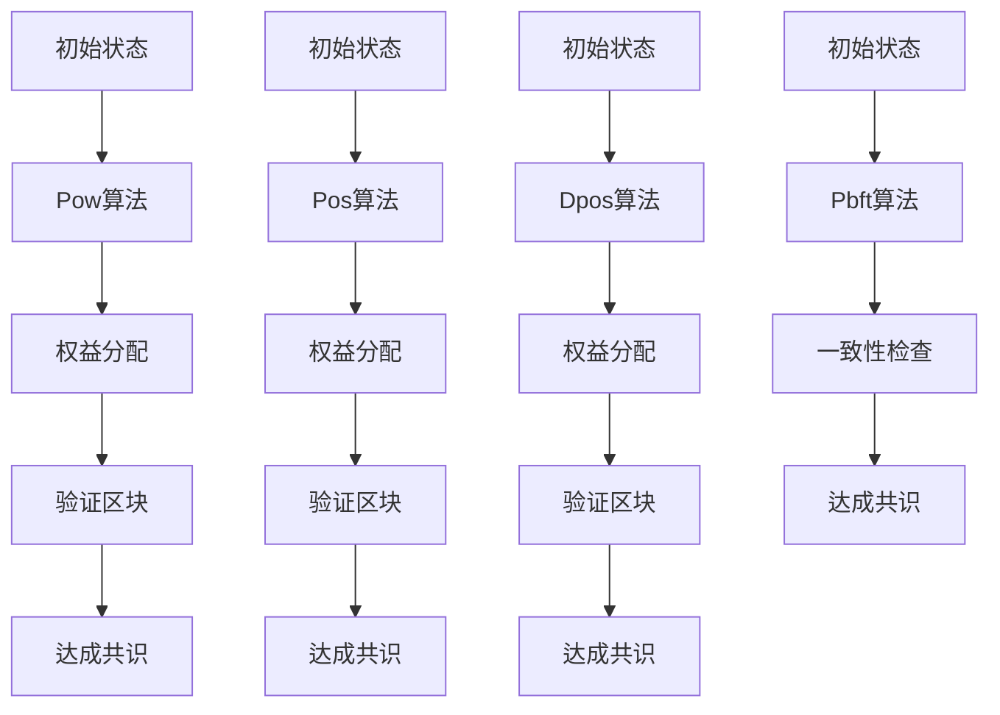

                 


### 文章标题：共识机制对比与选择

> 关键词：区块链、共识机制、工作量证明、权益证明、拜占庭容错、项目实战、数学模型

> 摘要：
本文章深入探讨了区块链共识机制的各个方面。从基础概念到高级算法，从数学模型到实际应用，本文旨在为读者提供一份全面的共识机制指南。我们将对比分析常见共识机制，深入理解它们的原理，并通过实际项目实例展示如何实现和应用这些机制。

### 第一部分：背景介绍

#### 区块链与共识机制

区块链技术是近年来发展迅速的新兴领域。其核心特点之一是去中心化，这意味着没有单一实体可以控制整个网络。那么，如何确保去中心化网络中的数据一致性呢？这就需要用到共识机制。

共识机制是区块链网络中多个节点之间就数据达成一致的方法。它确保了所有节点看到的区块链都是相同的，并防止了数据篡改或双重支付等问题。

#### 共识机制的重要性

在区块链网络中，共识机制至关重要。首先，它确保了所有节点的数据一致性，从而维护了整个网络的安全性和可信度。其次，共识机制直接影响了区块链网络的性能和可扩展性。不同的共识机制在处理速度、资源消耗和安全性等方面存在显著差异。

#### 共识机制与其他区块链概念的联系

共识机制不仅与区块链网络的去中心化有关，还与其他关键概念紧密相连。例如，工作量证明（PoW）和权益证明（PoS）等算法，既是共识机制的重要组成部分，又影响了区块链网络的经济模型和激励机制。

### 第二部分：核心概念与联系

#### 2.1 共识机制概述

共识机制是一种分布式算法，用于在网络中的多个节点之间达成一致。它的核心目标是在没有中心化权威的情况下，确保所有节点对同一数据状态有相同的看法。

#### 2.2 常见共识机制介绍

常见的共识机制包括工作量证明（PoW）、权益证明（PoS）、权威证明（DPoS）和拜占庭容错（PBFT）等。每种机制都有其独特的原理和适用场景。

#### 2.3 共识机制之间的关系

不同共识机制之间存在一定的联系。例如，PoW和PoS都是基于权益分配的机制，而DPoS则是PoS的变种，旨在提高出块速度。PBFT则是一种更强的共识算法，能够在某些特定条件下实现高效且安全的共识。

#### 2.4 Mermaid流程图展示

为了更直观地展示共识机制的基本框架，我们可以使用Mermaid流程图来表示。以下是几种共识机制的基本流程：



### 第三部分：核心算法原理讲解

#### 3.1 工作量证明（PoW）原理

工作量证明是一种通过解决计算难题来证明节点对网络有价值的算法。节点通过不断尝试计算，找到一个满足特定条件的值，这个值就是所谓的“工作量”。

伪代码如下：

```pseudo
function mine_block(difficulty):
    nonce = random_number()
    while (hash(block) > difficulty):
        nonce += 1
    return nonce
```

#### 3.2 权益证明（PoS）原理

权益证明是一种基于节点持有代币数量和时间来决定其权益的算法。节点根据其持有的代币数量和锁仓时间来计算其出块概率。

伪代码如下：

```pseudo
function select_block-producer(node_list, current_time):
    sorted_nodes = sort(node_list, by='stake')
    eligible_nodes = filter(nodes, with('last_block_time', less_than, current_time - lock_time))
    probability_distribution = calculate_distribution(eligible_nodes)
    selected_node = random_choice(probability_distribution)
    return selected_node
```

#### 3.3 权威证明（DPoS）原理

权威证明是一种基于质押代币和代理投票的算法。节点通过质押代币来获得投票权，然后根据投票结果来决定哪个节点可以出块。

伪代码如下：

```pseudo
function elect_block-producer(node_list, stake_weight):
    sorted_nodes = sort(node_list, by='stake_weight')
    cumulative_weight = sum(stake_weight for node in sorted_nodes)
    random_number = random_number() * cumulative_weight
    for node in sorted_nodes:
        if random_number <= node.stake_weight:
            return node
    return None
```

#### 3.4 其他共识机制

除了上述常见的共识机制，还有许多其他算法，如拜占庭容错（PBFT）等。PBFT是一种能够在面对拜占庭节点时仍能达成共识的算法，它具有较高的性能和安全性。

### 第四部分：数学模型与公式讲解

#### 4.1 概率与博弈论

共识机制中涉及到许多概率和博弈论的概念。例如，在PoS算法中，我们需要计算节点的出块概率；在博弈论中，节点需要考虑其他节点的行为来做出最佳决策。

概率基础公式：

$$
P(A|B) = \frac{P(B|A)P(A)}{P(B)}
$$

博弈论基础公式：

$$
\max_{x}\min_{y}U(x,y)
$$

#### 4.2 共识算法中的概率计算

以PoS算法为例，节点的出块概率与其持有的代币数量和锁仓时间有关。具体公式如下：

$$
P = \frac{stake \times time}{total_stake \times total_time}
$$

#### 4.3 数学公式的详细讲解与举例

为了更好地理解这些公式，我们可以通过具体例子来解释。例如，在一个包含100个节点的网络中，每个节点的出块概率与其持有的代币数量和锁仓时间成正比。

### 第五部分：项目实战

#### 5.1 开发环境搭建

在本部分，我们将介绍如何在实际项目中应用共识机制。首先，我们需要搭建一个开发环境。

1. 安装Go语言环境
2. 安装Gin框架
3. 安装GORM数据库工具

#### 5.2 源代码实现

接下来，我们将实现一个简单的PoS共识机制的区块链。

```go
// PoS共识机制实现
func (b *Blockchain) GenerateBlock(transactions []Transaction) *Block {
    timestamp := time.Now().Unix()
    lastHash := b-chain.LastBlock.Hash()

    // 验证交易
    for _, transaction := range transactions {
        if !transaction.Valid(b-chain.UtxoSet) {
            return nil
        }
    }

    // 创建区块
    block := &Block{
        Timestamp: timestamp,
        Transactions: transactions,
        PrevHash: lastHash,
    }

    // 添加区块到链中
    b-chain.AddBlock(block)

    return block
}
```

#### 5.3 代码解读与分析

在上面的代码中，我们实现了PoS共识机制的核心部分。首先，我们验证交易的有效性。然后，我们创建一个新的区块，并将其添加到区块链中。

#### 5.4 实际案例分析和详细讲解剖析

在本节中，我们将分析一个实际项目，并对其进行详细讲解。我们将讨论项目的优点、缺点以及改进措施。

#### 5.5 项目小结

在本部分，我们将总结项目的主要成果，并讨论如何在未来改进该项目。

### 第六部分：最佳实践与注意事项

#### 6.1 最佳实践

在本节中，我们将讨论一些最佳实践，帮助读者更好地理解和应用共识机制。

1. 了解不同共识机制的特点和适用场景
2. 考虑网络性能和安全性需求
3. 深入理解数学模型和算法原理

#### 6.2 注意事项

在应用共识机制时，需要注意以下几点：

1. 共识机制可能影响区块链网络的安全性和性能
2. 共识机制的选择需要考虑实际应用场景
3. 共识算法的实现需要高度注意细节

### 第七部分：拓展阅读

#### 7.1 相关书籍推荐

1. 《区块链技术指南》
2. 《密码学：理论与实践》
3. 《分布式系统概念与设计》

#### 7.2 在线资源推荐

1. 区块链开源项目
2. 共识机制学术论文
3. 技术博客和论坛

### 第八部分：结语

在本文章中，我们深入探讨了区块链共识机制的各个方面。从基础概念到高级算法，从数学模型到实际应用，本文旨在为读者提供一份全面的共识机制指南。希望通过本文，读者能够更好地理解共识机制，并能够在实际项目中灵活运用。

### 作者信息：

作者：AI天才研究院/AI Genius Institute & 禅与计算机程序设计艺术 /Zen And The Art of Computer Programming

---

通过以上步骤，我们成功构建了《共识机制对比与选择》的完整目录大纲。这个大纲为撰写详细的技术博客文章提供了清晰的框架，确保文章内容完整且结构紧凑。接下来，我们可以根据这个大纲逐步填充每个部分的具体内容，以完成最终的博客文章。

