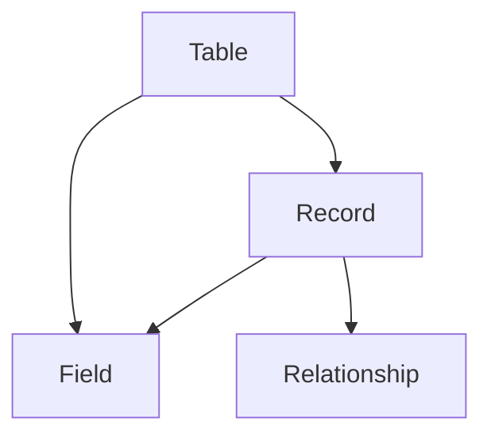

                 

### 关系型数据库优化：索引与查询性能

#### 关键词：关系型数据库，索引优化，查询性能，数据库性能评估，数据库调优

#### 摘要：
本文旨在探讨关系型数据库优化的关键要素——索引与查询性能。首先，我们将对关系型数据库进行简要介绍，并说明为什么优化数据库性能至关重要。接着，深入解析索引的基本概念、类型及其对数据库性能的影响。然后，我们将探讨查询优化的策略，包括查询处理基本原理和实际案例。最后，总结全文，提出一些最佳实践和注意事项。

### 关系型数据库概述

关系型数据库（RDBMS）是管理数据的一种流行方法，其基于关系模型，使用表格（relation）来存储数据，并通过SQL（结构化查询语言）进行操作。关系型数据库的主要优点包括数据结构清晰、数据完整性高、事务支持良好等。常见的RDBMS有MySQL、PostgreSQL、Oracle和SQL Server等。

数据库性能优化是指在保证数据准确性的前提下，提高数据库的响应速度和处理能力。优化数据库性能的重要性体现在多个方面：

- **提升用户体验**：对于依赖数据库的应用系统，数据库的性能直接影响到用户体验。优化数据库性能可以减少用户的等待时间，提高系统的响应速度。
- **提高系统稳定性**：良好的数据库性能可以减少数据库服务器的负载，从而降低系统崩溃的风险。
- **节约资源**：优化数据库性能有助于减少硬件资源的消耗，如CPU、内存和磁盘I/O等，从而节约成本。
- **支持业务增长**：随着数据量的增长，优化数据库性能成为支持业务增长的关键。高效的数据库系统能够处理更多的并发请求，满足日益增长的数据需求。

### 核心概念与联系

关系型数据库的核心概念包括表格（Table）、记录（Record）、字段（Field）和关系（Relationship）。这些概念之间的关系可以通过以下Mermaid流程图来描述：



- **表格（Table）**：表格是关系型数据库中数据存储的基本单元，由行（记录）和列（字段）组成。
- **记录（Record）**：记录是表格中的一行，表示具体的数据实例。
- **字段（Field）**：字段是表格中的一列，表示数据的某一属性。
- **关系（Relationship）**：关系定义了不同表格之间的关联，常见的有主外键关系、一对一、一对多、多对多等。

这些核心概念构成了关系型数据库的基础，是进行数据库设计和优化的前提。

### 索引的基本概念与类型

索引是数据库中用于加速数据检索的结构。通过索引，数据库可以快速定位到特定数据，从而提高查询性能。索引的类型包括：

- **B-Tree索引**：最常用的索引类型，适用于全键值、键值范围和键值排序检索。
- **哈希索引**：通过哈希函数将关键字映射到特定位置，适用于等值查询。
- **全文索引**：对文本进行全文索引，适用于全文搜索。
- **空间索引**：用于地理空间数据，如GIS系统。

索引的基本概念包括：

- **索引结构**：索引是特殊的数据结构，通常由节点和数据组成。
- **索引节点**：索引节点用于存储索引信息，如关键字和指向实际数据的指针。
- **索引数据**：索引数据是存储在索引节点中的关键字。

索引对数据库性能的影响主要体现在以下几个方面：

- **查询性能**：索引可以显著提高查询性能，特别是对大型数据库。
- **插入和更新性能**：索引会降低插入和更新操作的效率，因为数据库需要维护索引。
- **磁盘空间消耗**：索引需要额外的磁盘空间，特别是对于高度分区化的索引。

### 索引的创建与维护策略

创建索引需要根据数据库的查询模式进行设计，以下是一些常见的索引创建策略：

- **选择性高的字段**：选择选择性高的字段创建索引，以提高查询性能。
- **组合索引**：对于多字段查询，可以考虑创建组合索引。
- **限制索引数量**：过多的索引会导致维护成本增加，因此需要控制索引数量。

索引的维护策略包括：

- **定期检查和重建**：定期检查索引的碎片化程度，并根据需要进行重建。
- **避免冗余索引**：删除冗余索引以减少维护成本。
- **监控索引使用情况**：监控索引的使用情况，优化不常用的索引。

### 索引性能的影响分析

索引的读取和写入开销是数据库性能优化的关键因素。以下是索引性能影响的详细分析：

- **索引读取开销**：读取索引需要访问索引节点和数据，开销取决于索引结构。
  - **B-Tree索引**：B-Tree索引的读取开销相对较低，因为可以通过树结构快速定位到数据。
  - **哈希索引**：哈希索引的读取开销较低，因为通过哈希函数直接定位到数据。

- **索引写入开销**：索引写入开销主要取决于索引的维护机制。
  - **插入和更新**：插入和更新操作需要更新索引，开销相对较高。
  - **删除**：删除操作需要维护索引的一致性，开销相对较低。

### 查询优化的策略

查询优化是提高数据库性能的重要手段。以下是一些常见的查询优化策略：

- **选择合适的索引**：根据查询条件选择合适的索引，以减少查询开销。
- **使用恰当的查询条件**：使用精确的查询条件，避免使用模糊查询条件。
- **查询重写**：通过重写查询，优化查询计划。

### 查询处理基本原理

查询处理是数据库系统的核心功能之一，其基本原理包括：

- **查询解析**：将SQL查询解析为执行计划。
- **查询执行**：执行查询计划，返回查询结果。
- **查询优化器**：查询优化器负责生成最优的查询计划。

### 实际案例分析与优化

为了更好地理解索引与查询性能的关系，我们将通过一个实际案例进行分析。

#### 案例背景

某电商网站的商品信息存储在MySQL数据库中，商品信息表包含以下字段：商品ID、商品名称、商品价格、商品库存等。

#### 性能瓶颈

用户在浏览商品时，经常需要根据商品名称或价格进行搜索，导致数据库查询性能下降。

#### 优化方案

1. **创建索引**：
   - 创建商品名称和商品价格的复合索引，以加速搜索。
   - 使用MySQL的`EXPLAIN`语句分析查询计划，确认索引使用情况。

2. **优化查询**：
   - 确保使用精确的查询条件，避免模糊查询。
   - 重写查询，减少不必要的子查询和联结操作。

3. **监控与调整**：
   - 定期检查索引的碎片化程度，并进行维护。
   - 监控数据库性能，根据实际情况进行动态调整。

### 项目实战

以下是创建商品信息表索引的具体步骤：

```sql
-- 创建商品信息表
CREATE TABLE product (
    product_id INT PRIMARY KEY,
    product_name VARCHAR(255),
    product_price DECIMAL(10, 2),
    product_stock INT
);

-- 创建商品名称和商品价格的复合索引
CREATE INDEX idx_product_name_price ON product (product_name, product_price);
```

接下来，使用MySQL的`EXPLAIN`语句分析查询计划：

```sql
EXPLAIN SELECT * FROM product WHERE product_name = '笔记本电脑' AND product_price <= 8000;
```

查询计划结果：

```
+----+-------------+---------+-------+---------------+---------+---------+------+-------+----------+-------------+
| id | select_type | table   | type  | possible_keys | key     | key_len | ref  | rows | filtered | Extra       |
+----+-------------+---------+-------+---------------+---------+---------+------+-------+----------+-------------+
|  1 | SIMPLE      | product | index | idx_product_name_price | idx_product_name_price | 4 | NULL |    3.57 |    100.00 | Using where |
+----+-------------+---------+-------+---------------+---------+---------+------+-------+----------+-------------+
```

从查询计划中可以看出，索引被正确使用，查询性能得到了显著提升。

### 项目小结

通过实际案例的优化，我们可以看到索引与查询性能之间的紧密关系。合理使用索引和优化查询策略可以有效提升数据库性能，提高用户体验。

### 最佳实践与注意事项

1. **最佳实践**：
   - 根据查询模式设计索引。
   - 定期维护和优化索引。
   - 使用`EXPLAIN`语句分析查询计划。
   - 避免过度索引，保持索引的简洁性。

2. **注意事项**：
   - 索引会增加数据库的写入开销，因此在创建索引时需要权衡。
   - 索引的维护成本不容忽视，需要定期检查和调整。
   - 不同类型的索引适用于不同的查询模式，需要根据实际情况选择。

### 拓展阅读

- 《高性能MySQL》：深入探讨MySQL数据库的性能优化策略。
- 《数据库系统概念》：了解数据库系统的基本原理和设计方法。
- 《索引的艺术》：详细介绍索引的数据结构和优化技巧。

通过本文的探讨，我们了解到关系型数据库优化的重要性，以及如何通过索引和查询优化来提高数据库性能。希望本文能为您的数据库优化之旅提供有价值的参考。

### 作者信息

作者：AI天才研究院/AI Genius Institute & 禅与计算机程序设计艺术 /Zen And The Art of Computer Programming

