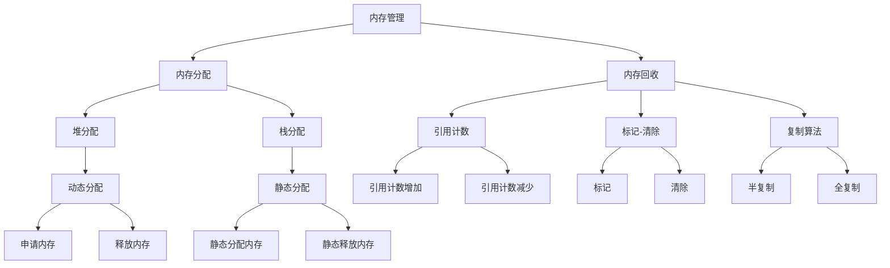

                 

### 第1章 引言

#### 1.1 内存管理的背景和重要性

内存管理是计算机系统中一个关键组成部分，它直接关系到程序的性能和稳定性。内存管理的核心任务是在程序运行过程中，高效地分配和回收内存资源。

**内存管理的定义**：内存管理是指操作系统在程序运行时对内存空间的分配、使用和回收的过程。内存管理不仅要保证内存的高效使用，还要避免内存泄漏和内存碎片等问题。

**内存泄漏的概念**：内存泄漏是指程序中动态分配的内存资源在使用完成后未被释放，导致内存资源逐渐被耗尽。内存泄漏会引发程序性能下降、响应速度变慢，甚至导致程序崩溃。

**内存管理的重要性**：

1. **性能优化**：合理的内存管理可以提高程序的执行效率，降低内存占用，从而提高程序的整体性能。
2. **稳定性保障**：避免内存泄漏有助于保障程序运行的稳定性，减少程序崩溃的风险。
3. **资源利用**：有效的内存管理可以充分利用系统资源，提高资源利用率，降低硬件成本。

#### 1.2 内存泄漏的危害

内存泄漏的后果主要体现在以下几个方面：

1. **内存消耗增加**：随着内存泄漏的积累，程序占用的内存会逐渐增加，导致系统资源逐渐被耗尽。
2. **性能下降**：内存泄漏会占用更多的内存资源，导致程序在执行时需要频繁进行内存交换，从而降低程序的性能。
3. **响应速度变慢**：随着内存泄漏的增加，程序的响应速度会逐渐变慢，影响用户体验。
4. **程序崩溃**：严重时，内存泄漏可能导致程序无法继续运行，甚至导致系统崩溃。

**内存泄漏的常见例子**：

1. **全局变量**：全局变量在程序启动时分配，在程序结束前不会自动释放，容易导致内存泄漏。
2. **未初始化的指针**：未初始化的指针指向的内存区域可能会被多次释放，导致内存泄漏。
3. **循环引用**：当两个对象互相引用，而它们的生命周期不同时，可能会导致内存泄漏。

#### 1.3 避免内存泄漏的必要性

避免内存泄漏是保证程序稳定性和性能的关键，具体体现在以下几个方面：

1. **资源保护**：避免内存泄漏可以有效地保护系统资源，提高资源利用率。
2. **性能提升**：通过避免内存泄漏，可以降低程序的性能开销，提升程序执行效率。
3. **稳定性保障**：避免内存泄漏可以减少程序崩溃的风险，提高程序的稳定性。
4. **用户体验**：避免内存泄漏可以提高程序的响应速度，提升用户体验。

总之，内存管理是程序开发中不可忽视的重要环节，合理地进行内存管理，避免内存泄漏，对于提高程序的性能和稳定性具有重要意义。

---

**内存管理核心概念关系架构图**



---

#### 2.1 计算机内存概述

**内存的作用**：内存是计算机中用于存储数据和程序的临时存储设备。内存的作用主要体现在以下几个方面：

1. **存储程序代码**：操作系统和应用程序的代码存储在内存中，以便处理器能够快速读取和执行。
2. **存储中间数据**：程序运行过程中产生的中间数据通常存储在内存中，以便快速访问和处理。
3. **存储运行状态**：程序在执行过程中需要保存其运行状态，如变量值、函数调用栈等，这些状态通常存储在内存中。

**内存类型**：计算机内存主要分为以下几种类型：

1. **堆（Heap）**：堆内存用于动态分配和回收内存。程序在运行时，可以根据需要动态申请堆内存，并在不需要时释放。
2. **栈（Stack）**：栈内存用于存储函数的局部变量、返回地址和函数调用栈。栈内存的分配和回收是自动的，遵循后进先出（LIFO）的原则。
3. **全局区（Global）**：全局区内存用于存储全局变量和静态变量，其生命周期贯穿整个程序。
4. **常量区（Constant）**：常量区内存用于存储程序中的常量，如字符串字面量和编译时常量。
5. **代码区（Code）**：代码区内存用于存储程序代码，包括操作系统、库文件和应用程序的代码。

**内存分配与回收机制**：

1. **内存分配**：内存分配是指程序在运行时申请和使用内存的过程。内存分配通常分为堆分配和栈分配两种方式。
   - **堆分配**：堆内存的分配由程序员通过 `malloc`、`calloc`、`realloc` 等函数手动进行。堆内存的分配不遵循特定的原则，可以在程序的任何地方进行。
   - **栈分配**：栈内存的分配由操作系统自动进行，遵循后进先出（LIFO）的原则。栈内存的分配和回收是自动的，程序员无需关心具体的细节。

2. **内存回收**：内存回收是指程序在运行结束后释放不再使用的内存资源的过程。内存回收同样分为堆回收和栈回收两种方式。
   - **堆回收**：程序员通过 `free` 函数手动释放堆内存。释放堆内存后，该内存可以被再次分配。
   - **栈回收**：栈内存的回收由操作系统自动进行。当函数调用结束后，栈内存会自动释放。

总之，计算机内存是程序运行的基础，合理地进行内存分配和回收对于提高程序性能和稳定性至关重要。

---

#### 2.2 内存分配算法

内存分配算法是内存管理的重要组成部分，不同的算法适用于不同的场景。以下是几种常见的内存分配算法：

**1. 堆分配**

堆内存的分配由程序员手动进行，常用的函数包括 `malloc`、`calloc`、`realloc` 等。堆内存的分配通常通过以下步骤进行：

1. **申请内存**：程序员调用 `malloc` 或 `calloc` 函数，传入所需内存的大小。函数内部会从堆空间中分配相应大小的内存块，并将其返回给程序员。
   ```c
   void* malloc(size_t size);
   void* calloc(size_t num, size_t size);
   ```
2. **分配内存**：函数内部通过系统调用向操作系统请求内存，操作系统根据当前的内存状态分配内存，并将其返回给程序。
3. **初始化内存**：对于 `calloc` 函数，它会将分配的内存块初始化为0。如果使用 `malloc`，则内存块的初始值是未知的。

堆分配的优点是灵活性高，程序员可以根据需要动态申请和释放内存。然而，堆分配也存在一些缺点，如内存碎片问题和性能问题。

**2. 栈分配**

栈内存的分配由操作系统自动进行，遵循后进先出（LIFO）的原则。栈内存的分配通常通过以下步骤进行：

1. **进入函数**：当程序调用一个函数时，操作系统会为该函数创建一个栈帧，并将栈帧的地址压入栈顶。
2. **分配内存**：栈帧的空间用于存储函数的局部变量、返回地址和函数调用栈。栈内存的分配和回收是自动的，程序员无需关心具体的细节。
3. **退出函数**：当函数执行完毕后，操作系统会自动回收栈帧的空间，并将其从栈顶弹出。

栈分配的优点是速度快、效率高，因为分配和回收操作都是由操作系统自动完成的。栈分配的缺点是内存空间有限，不适合存储大量数据。

**3. 静态分配**

静态分配是指在程序编译时分配内存，其内存大小和生命周期在编译时确定。静态分配通常用于全局变量和静态变量。

1. **全局区分配**：全局变量和静态变量存储在全局区，其内存分配在程序启动时完成。全局变量的生命周期贯穿整个程序。
2. **常量区分配**：常量区用于存储编译时常量，如字符串字面量和编译时常量。常量区的内存分配在程序启动时完成，其生命周期与全局区相同。

静态分配的优点是简单易用，不需要程序员手动管理内存。缺点是内存占用大，不适合动态变化的数据。

总之，不同类型的内存分配算法适用于不同的场景。程序员需要根据实际需求选择合适的内存分配算法，以达到最佳的内存管理效果。

---

#### 2.3 内存回收机制

内存回收是内存管理的关键环节，其目的是释放不再使用的内存资源，避免内存泄漏。以下是几种常见的内存回收算法和策略：

**1. 引用计数算法**

引用计数算法是一种简单的内存回收方法。它通过为每个对象维护一个引用计数器，来跟踪对象的引用次数。当对象的引用次数变为0时，意味着该对象不再被使用，可以安全地释放其内存。

引用计数算法的步骤如下：

1. **初始化引用计数**：当对象被创建时，为其分配内存并初始化引用计数器为1。
2. **增加引用计数**：每次有新的引用指向该对象时，引用计数器加1。
3. **减少引用计数**：每次有引用撤销指向该对象时，引用计数器减1。
4. **回收内存**：当引用计数器变为0时，意味着对象不再被引用，可以安全地释放其内存。

引用计数算法的优点是简单易实现，回收过程快速。缺点是引用计数器不能解决循环引用问题，导致内存泄漏。

**2. 标记-清除算法**

标记-清除算法是一种基于引用计数的内存回收方法。它通过遍历所有对象，标记所有活动对象，然后清除未标记的对象。

标记-清除算法的步骤如下：

1. **标记阶段**：从根对象开始，遍历所有活动对象，将其标记为“已访问”。
2. **清除阶段**：遍历所有对象，清除所有未标记的对象的内存。

标记-清除算法的优点是可以解决循环引用问题。缺点是标记和清除过程可能引入性能开销，并且会产生内存碎片。

**3. 复制算法**

复制算法是一种通过复制活动对象来回收内存的方法。它将内存分为两个半区，每次只在一个半区中分配和回收内存。

复制算法的步骤如下：

1. **初始分配**：将内存分为两个半区，分别用于分配和回收。
2. **分配阶段**：在活动半区中分配内存。
3. **回收阶段**：将活动半区的对象复制到空闲半区，并清空活动半区的内存。
4. **切换半区**：完成回收后，交换活动半区和空闲半区的角色。

复制算法的优点是回收过程简单，内存碎片问题较小。缺点是内存利用率较低，因为每次回收都需要复制活动对象。

**回收策略**

内存回收策略是内存管理的重要组成部分，决定了内存回收的方式和时间。以下是两种常见的回收策略：

1. **主动回收**：主动回收是指程序在运行过程中主动释放不再使用的内存资源。主动回收的优点是可以快速释放内存，减少内存占用。缺点是可能引入额外的性能开销。

2. **被动回收**：被动回收是指程序在需要内存时，由操作系统自动进行内存回收。被动回收的优点是简化了程序设计，减少性能开销。缺点是可能导致内存占用过高，影响程序性能。

总之，内存回收是内存管理的关键环节，选择合适的回收算法和策略对于提高程序性能和稳定性具有重要意义。

---

#### 3.1 内存泄漏的原理

内存泄漏是程序中常见的内存管理问题，它会导致程序性能下降和系统稳定性降低。了解内存泄漏的原理有助于我们更好地预防和解决这一问题。

**内存泄漏的原因**：

1. **全局变量**：全局变量在程序启动时分配内存，其生命周期贯穿整个程序。如果全局变量未被正确初始化或未在适当的时间释放，会导致内存泄漏。
2. **未初始化的指针**：未初始化的指针指向的内存区域可能会被多次释放，导致内存泄漏。这是因为指针的初始值是未知的，可能会指向已被释放的内存区域。
3. **循环引用**：当两个对象互相引用，而它们的生命周期不同时，可能会导致内存泄漏。这种情况通常发生在复杂的对象关系图中，例如，A对象持有一个B对象的引用，而B对象也持有一个A对象的引用。
4. **动态分配内存**：动态分配内存后，如果程序忘记释放内存，会导致内存泄漏。这种情况通常发生在使用 `malloc`、`calloc` 等函数动态分配内存时。
5. **静态分配内存**：静态分配内存后，如果程序忘记释放内存，同样会导致内存泄漏。这种情况通常发生在使用全局变量或静态变量时。

**内存泄漏的类型**：

内存泄漏可以分为以下几种类型：

1. **显式内存泄漏**：显式内存泄漏是指程序中明确分配的内存未在适当的时间释放。这种情况通常发生在程序员错误地忘记释放内存时。
2. **隐式内存泄漏**：隐式内存泄漏是指程序中由于设计缺陷或逻辑错误导致的内存泄漏。这种情况通常发生在程序运行过程中，由于某些条件未满足，导致内存资源未被正确释放。
3. **周期性内存泄漏**：周期性内存泄漏是指程序在运行过程中，周期性地出现内存泄漏。这种情况通常发生在某些特定条件下，如循环、递归等。
4. **长时间内存泄漏**：长时间内存泄漏是指程序在运行过程中，持续积累内存泄漏，导致内存占用逐渐增加。这种情况通常发生在长时间运行的应用程序中，如服务器程序、长时间运行的测试程序等。

了解内存泄漏的原理和类型有助于我们更好地识别和解决内存泄漏问题，从而提高程序的性能和稳定性。

---

#### 3.2 内存泄漏的识别

识别内存泄漏是内存管理的关键步骤，通过有效的识别方法，我们可以及时发现问题并进行修复。以下是几种常见的内存泄漏识别方法：

**1. 内存泄漏检测工具**

内存泄漏检测工具是识别内存泄漏的有效手段。以下是一些常用的内存泄漏检测工具：

- **Valgrind**：Valgrind 是一款开源的内存检测工具，它可以检测内存泄漏、无效指针访问等问题。使用 Valgrind 进行内存泄漏检测的步骤如下：
  ```bash
  valgrind --leak-check=full --show-leak-kinds=all ./your_program
  ```
  Valgrind 会输出内存泄漏报告，包括泄漏的原因和位置。

- **AddressSanitizer**：AddressSanitizer 是一款静态分析工具，它可以检测内存泄漏、无效指针访问等内存错误。使用 AddressSanitizer 的方法如下：
  ```c
  #include <sanitizer/address-sanitizer.h>
  
  void* p = malloc(size);
  // ... 使用 p ...
  free(p);
  ```

- **Dr. Memory**：Dr. Memory 是一款强大的内存泄漏检测工具，它支持多种编程语言。使用 Dr. Memory 的方法如下：
  ```bash
  drmem -I /path/to/your/program --debug-every=1000 --quit-after=10000
  ```

**2. 内存泄漏的常见迹象**

以下是一些内存泄漏的常见迹象：

- **程序崩溃**：内存泄漏可能导致程序在运行过程中突然崩溃，特别是在内存资源耗尽时。
- **程序响应速度变慢**：随着内存泄漏的积累，程序执行速度会逐渐变慢，因为操作系统需要频繁进行内存交换。
- **内存占用逐渐增加**：程序运行过程中，内存占用会逐渐增加，这是内存泄漏的明显迹象。
- **内存泄漏报告**：内存泄漏检测工具可以生成详细的内存泄漏报告，包括泄漏的原因和位置。

通过识别内存泄漏的常见迹象，我们可以及时发现内存泄漏问题，并采取相应的措施进行修复。

---

#### 3.3 内存泄漏案例分析

以下是一个内存泄漏的实际案例，通过分析该案例，我们可以了解内存泄漏的成因和解决方法。

**案例背景**：

一个C++程序在运行过程中，内存占用逐渐增加，最终导致程序崩溃。通过内存泄漏检测工具（如Valgrind）分析，发现程序存在内存泄漏问题。

**分析过程**：

1. **定位泄漏位置**：通过Valgrind的内存泄漏报告，找到泄漏的位置。报告显示，内存泄漏发生在某个函数内部。
2. **分析泄漏原因**：查看泄漏位置的代码，发现该函数动态分配了一块内存，但在返回之前没有释放内存。具体代码如下：
   ```c
   void myFunction() {
       int* p = new int[100];
       // ... 使用 p ...
       return p; // 未释放内存
   }
   ```
   在该函数中，`new` 操作符用于动态分配内存，但在函数返回之前，内存未通过 `delete[]` 释放。

3. **修复泄漏**：为了修复内存泄漏，我们需要在函数返回之前释放内存。修改后的代码如下：
   ```c
   void myFunction() {
       int* p = new int[100];
       // ... 使用 p ...
       delete[] p; // 释放内存
       return p;
   }
   ```

**解决方案**：

通过以上分析，我们找到了内存泄漏的原因，并修复了该问题。具体解决方案如下：

1. **明确释放内存**：在动态分配内存的函数中，确保在适当的时间释放内存。对于使用 `new` 分配的内存，使用 `delete` 或 `delete[]` 进行释放。
2. **检查全局变量**：检查全局变量和静态变量的使用，确保在不需要时释放内存。
3. **避免循环引用**：在复杂的对象关系图中，避免循环引用导致内存泄漏。可以通过弱引用或解除引用来解决这个问题。
4. **使用内存泄漏检测工具**：定期使用内存泄漏检测工具进行测试，及时发现并修复内存泄漏问题。

总之，通过合理的内存管理，我们可以有效避免内存泄漏，提高程序的性能和稳定性。

---

### 4.1 设计原则

避免内存泄漏是内存管理的重要目标，合理的设计原则可以帮助我们实现这一目标。以下是几项关键设计原则：

**内存优化原则**：

1. **最小化内存分配**：尽量避免频繁的内存分配和释放操作，因为每次内存分配和释放都会带来一定的性能开销。在可能的情况下，尽量使用静态分配的内存，如全局变量和静态变量。
2. **避免全局变量**：全局变量容易导致内存泄漏，因为其生命周期贯穿整个程序。尽量避免使用全局变量，特别是在涉及动态内存分配的情况下。
3. **减少对象创建**：创建对象会消耗内存资源，尤其是在涉及动态内存分配的情况下。在可能的情况下，尽量重用现有的对象，避免频繁创建和销毁对象。
4. **使用智能指针**：智能指针（如 `unique_ptr` 和 `shared_ptr`）可以自动管理对象的内存，避免手动管理内存时出现的错误。智能指针可以确保对象在不需要时自动释放内存。

**设计模式与内存管理**：

1. **单例模式**：单例模式可以确保对象的唯一性，避免内存泄漏。单例对象通常在程序启动时创建，在程序结束时释放。这样可以有效地控制对象的内存分配和释放。
2. **工厂模式**：工厂模式可以减少直接使用 `new` 分配内存，从而减少内存泄漏的风险。通过工厂方法创建对象，可以统一管理对象的创建和销毁过程。
3. **委托模式**：委托模式可以将对象的内存管理委托给其他对象，避免直接管理内存。通过委托模式，可以减少内存泄漏的风险，同时提高代码的可维护性。

总之，遵循内存优化原则和合理使用设计模式，可以帮助我们有效避免内存泄漏，提高程序的稳定性和性能。

---

### 4.2 编程技巧

在编程过程中，合理地管理内存是避免内存泄漏的重要手段。以下是一些编程技巧，有助于减少内存分配和优化内存使用：

**减少不必要的内存分配**

1. **重用内存**：在可能的情况下，重用已经分配的内存，避免频繁的内存分配和释放操作。例如，在处理大数据时，可以使用静态数组或缓存数据，以减少内存分配的开销。
2. **批量处理**：批量处理数据可以减少内存分配次数。例如，在一次操作中处理多个对象，而不是逐个处理。
3. **使用静态内存**：尽可能使用静态内存，如全局变量和静态变量。静态内存的分配和回收由编译器自动完成，可以避免手动管理内存的错误。

**使用适当的内存分配策略**

1. **堆内存与栈内存**：根据实际需求选择合适的内存分配策略。对于生命周期较长的对象，使用堆内存（如 `malloc` 和 `new`），以便手动管理内存。对于生命周期较短的函数局部变量，使用栈内存，因为栈内存的分配和回收是自动的。
2. **内存池**：内存池是一种预先分配内存块的技术，可以减少内存碎片问题。内存池通常用于频繁分配和释放小内存块的场景，如缓存和数据结构。

**适当地释放内存**

1. **及时释放内存**：在不再需要内存时，及时释放内存。对于动态分配的内存，使用 `free` 或 `delete` 释放。对于全局变量和静态变量，确保在程序结束前释放内存。
2. **避免重复释放内存**：避免重复释放已经释放的内存，这可能会导致程序崩溃。例如，在释放内存后，不要再次使用该内存地址。
3. **使用智能指针**：使用智能指针（如 `unique_ptr` 和 `shared_ptr`）可以自动管理内存，避免手动管理内存的错误。智能指针可以确保对象在不需要时自动释放内存。

总之，通过合理地管理内存，可以减少内存泄漏的风险，提高程序的性能和稳定性。遵循上述编程技巧，可以帮助我们在编程过程中有效地避免内存泄漏。

---

### 4.3 内存泄漏的调试与修复

内存泄漏的调试与修复是确保程序稳定性和性能的重要步骤。以下是一个详细的内存泄漏调试与修复的过程：

**调试内存泄漏**

1. **使用内存泄漏检测工具**：首先，使用内存泄漏检测工具（如 Valgrind、AddressSanitizer 或 Dr. Memory）对程序进行测试。这些工具可以帮助我们识别内存泄漏的位置和原因。例如，使用 Valgrind 进行内存泄漏检测的命令如下：
   ```bash
   valgrind --leak-check=full --show-leak-kinds=all ./your_program
   ```

2. **分析内存泄漏报告**：运行程序后，内存泄漏检测工具会生成详细的报告。报告通常会显示内存泄漏的原因和位置。根据报告，我们可以确定内存泄漏的具体情况。

3. **定位泄漏位置**：通过分析报告，找到内存泄漏的具体代码位置。例如，报告可能显示如下信息：
   ```plaintext
   ==10664== 32 bytes in 1 blocks are still reachable in loss record 3 of 4
   ==10664==    at 0x4837FDB: operator new(unsigned int) (in /usr/lib/valgrind/vgpreload_memcheck-amd64-linux.so)
   ==10664==    by 0x4013E4: main (in ./main)
   ```

   从报告可以看出，内存泄漏发生在 `main` 函数中，具体位置是调用 `operator new` 的地方。

**修复内存泄漏**

1. **修复内存泄漏**：根据内存泄漏的位置和原因，修复代码中的错误。以下是一些常见的修复方法：

   - **释放未使用的内存**：如果程序动态分配了内存，但未在适当的时间释放，需要添加相应的释放代码。例如，在函数结束时释放内存：
     ```c
     void myFunction() {
         int* p = new int[100];
         // ... 使用 p ...
         delete[] p; // 释放内存
     }
     ```

   - **检查全局变量的生命周期**：确保全局变量在不再需要时释放内存。例如，如果全局变量在函数内部创建，并在函数结束后不再使用，需要将其移动到函数内部：
     ```c
     void myFunction() {
         int* p = new int[100];
         // ... 使用 p ...
         // 释放内存
         delete[] p;
     }
     ```

   - **避免循环引用**：循环引用可能导致内存泄漏。为了避免循环引用，可以解除其中一个引用，或使用弱引用。

   - **使用智能指针**：智能指针（如 `unique_ptr` 和 `shared_ptr`）可以自动管理内存，避免手动管理内存的错误。例如，使用 `unique_ptr` 代替原始指针：
     ```c
     void myFunction() {
         std::unique_ptr<int[]> p(new int[100]);
         // ... 使用 p ...
     }
     ```

2. **重新测试程序**：修复内存泄漏后，重新运行程序并进行测试，确保修复有效。在测试过程中，可以再次使用内存泄漏检测工具，检查程序是否存在其他内存泄漏问题。

**总结**

通过内存泄漏的调试与修复，我们可以提高程序的性能和稳定性。遵循上述步骤，可以帮助我们有效地识别和修复内存泄漏问题。此外，定期进行内存泄漏检测和修复，可以预防内存泄漏问题的发生。

---

### 5.1 内存管理工具

内存管理工具是识别和修复内存泄漏的重要手段。以下是一些常用的内存管理工具：

**1. Valgrind**

Valgrind 是一款开源的内存检测工具，它可以检测内存泄漏、无效指针访问等问题。使用 Valgrind 的基本步骤如下：

- **安装 Valgrind**：在 Linux 系统中，通常可以通过包管理器安装 Valgrind。例如，在 Ubuntu 中，可以使用以下命令安装：
  ```bash
  sudo apt-get install valgrind
  ```

- **运行程序**：使用 Valgrind 运行程序，并指定内存泄漏检测选项。例如：
  ```bash
  valgrind --leak-check=full --show-leak-kinds=all ./your_program
  ```

  Valgrind 会输出详细的内存泄漏报告，包括泄漏的原因和位置。

**2. AddressSanitizer**

AddressSanitizer 是一款静态分析工具，它可以检测内存泄漏、无效指针访问等内存错误。使用 AddressSanitizer 的方法如下：

- **编译程序**：在编译程序时，添加 AddressSanitizer 相关的编译选项。例如，对于 C++ 程序，可以使用以下命令编译：
  ```bash
  g++ -fsanitize=address -g your_program.cpp -o your_program
  ```

- **运行程序**：运行编译后的程序，AddressSanitizer 会自动进行内存泄漏检测，并在检测到问题时输出错误信息。

**3. Dr. Memory**

Dr. Memory 是一款强大的内存泄漏检测工具，它支持多种编程语言。使用 Dr. Memory 的方法如下：

- **安装 Dr. Memory**：在 Linux 系统中，可以从官方网站下载并安装 Dr. Memory。安装后，可以使用以下命令运行：
  ```bash
  drmem -I /path/to/your/program --debug-every=1000 --quit-after=10000
  ```

  Dr. Memory 会输出详细的内存泄漏报告，包括泄漏的原因和位置。

这些内存管理工具可以帮助我们有效地识别和修复内存泄漏问题，从而提高程序的性能和稳定性。

---

### 5.2 内存管理框架

内存管理框架是一种用于自动化内存管理的软件框架，它可以帮助开发者更轻松地管理和优化内存资源。以下是一些常见的内存管理框架：

**1. 内存池（Memory Pool）**

内存池是一种用于预分配内存的机制，它可以减少内存碎片问题，提高内存分配和回收的速度。内存池的工作原理是将内存分为多个固定大小的块，每个块可以独立分配和回收。

内存池的主要优点包括：

- **减少内存碎片**：通过预分配内存块，可以避免内存碎片问题，提高内存利用率。
- **提高性能**：内存池可以减少内存分配和回收的开销，提高程序执行速度。

内存池的典型应用场景包括：

- **频繁分配和释放小内存块**：例如，缓存系统、数据结构等。
- **需要高性能和低内存碎片的场景**：例如，游戏引擎、高性能服务器等。

**2. 内存分配器（Memory Allocator）**

内存分配器是一种用于动态分配和回收内存的机制，它可以根据程序的需求动态申请和释放内存。内存分配器通常包含多个不同的算法，以适应不同的内存分配需求。

常见的内存分配器包括：

- **堆（Heap）**：堆是程序中最常见的内存分配器，它通过系统调用动态分配和释放内存。堆的优点是灵活性高，但可能会引入内存碎片问题。
- **栈（Stack）**：栈是一种自动管理的内存区域，它遵循后进先出（LIFO）的原则。栈的优点是速度快、内存碎片问题较小，但内存空间有限。
- **静态分配器**：静态分配器在编译时确定内存大小和生命周期，例如全局变量和静态变量。静态分配器的优点是简单易用，但内存利用率较低。

内存分配器的优点包括：

- **灵活的内存分配策略**：可以根据程序需求选择合适的内存分配器，优化内存使用。
- **减少内存碎片**：通过使用合适的内存分配算法，可以减少内存碎片问题，提高内存利用率。

内存管理框架可以帮助开发者更轻松地管理和优化内存资源，提高程序的性能和稳定性。

---

### 6.1 项目环境搭建

在项目中实施有效的内存管理，首先需要搭建合适的环境。以下是项目环境搭建的详细步骤：

**1. 开发环境配置**

- **安装内存管理工具**：确保所有团队成员的计算机上安装了内存管理工具，如 Valgrind、AddressSanitizer 和 Dr. Memory。这些工具可以帮助我们识别和修复内存泄漏问题。例如，在 Ubuntu 系统中，可以使用以下命令安装 Valgrind：
  ```bash
  sudo apt-get install valgrind
  ```

- **配置编译器选项**：为了使用 AddressSanitizer，我们需要在编译器中添加相应的选项。例如，对于 C++ 项目，可以使用以下命令编译程序：
  ```bash
  g++ -fsanitize=address -g your_program.cpp -o your_program
  ```

- **集成版本控制工具**：将项目代码集成到版本控制系统（如 Git）中，以便跟踪代码变更和修复内存泄漏问题。确保所有团队成员都熟悉版本控制工具的使用。

**2. 内存管理工具集成**

- **集成 Valgrind**：在项目构建脚本中添加 Valgrind 检测步骤，以便在每次构建过程中自动运行内存泄漏检测。例如，在 Makefile 中添加以下命令：
  ```makefile
  test:
      valgrind --leak-check=full --show-leak-kinds=all ./your_program
  ```

- **集成 AddressSanitizer**：在编译器选项中添加 AddressSanitizer，以确保每次编译和运行程序时都能自动进行内存泄漏检测。

- **集成 Dr. Memory**：在项目构建脚本中添加 Dr. Memory 检测步骤，以便在每次运行程序时进行内存泄漏检测。例如，在 Bash 脚本中添加以下命令：
  ```bash
  drmem -I /path/to/your/program --debug-every=1000 --quit-after=10000
  ```

**3. 编写内存管理文档**

- **编写内存管理策略**：为项目编写详细的内存管理策略，包括内存分配、回收和泄漏检测的最佳实践。确保团队成员都了解并遵循这些策略。

- **记录工具使用方法**：为每个内存管理工具编写使用指南，以便团队成员了解如何使用这些工具进行内存泄漏检测和修复。

通过以上步骤，我们可以在项目中搭建一个有效的内存管理环境，帮助团队成员更好地识别和修复内存泄漏问题，提高程序的性能和稳定性。

---

### 6.2 内存管理案例

在一个典型的项目场景中，内存管理是确保程序稳定性和性能的关键。以下是一个内存管理案例，包括内存管理策略设计、内存泄漏的调试与修复，以及内存管理性能优化。

**案例背景**

一个大型Web应用项目，需要处理大量的用户请求和数据存储。在项目开发过程中，团队成员发现应用在运行过程中存在内存泄漏问题，导致服务器资源逐渐耗尽，性能下降。

**内存管理策略设计**

1. **内存分配策略**：为了优化内存分配，项目团队决定在堆（Heap）和栈（Stack）之间合理分配内存。对于生命周期较长的数据，使用堆内存；对于生命周期较短的局部变量，使用栈内存。具体策略如下：

   - **堆内存**：使用 `malloc`、`calloc` 和 `realloc` 函数动态分配堆内存，并在不需要时使用 `free` 函数释放内存。例如：
     ```c
     void* data = malloc(size);
     if (data != NULL) {
         // ... 使用数据 ...
         free(data);
     }
     ```

   - **栈内存**：使用栈内存存储函数的局部变量和临时数据。例如：
     ```c
     void myFunction() {
         int localData = 10;
         // ... 使用 localData ...
     }
     ```

2. **内存回收策略**：为了确保内存被及时回收，项目团队采用以下策略：

   - **及时释放内存**：在不再需要内存时，及时使用 `free` 函数释放内存。例如，在处理完数据后，释放动态分配的内存。
   - **避免重复释放**：确保每次释放内存的操作都是有效的，避免重复释放已经释放的内存。

3. **内存泄漏检测**：项目团队决定在每次构建和运行程序时，使用内存泄漏检测工具（如 Valgrind 和 AddressSanitizer）进行内存泄漏检测。例如，在构建脚本中添加以下命令：
   ```bash
   valgrind --leak-check=full --show-leak-kinds=all ./your_program
   ```

**内存泄漏的调试与修复**

1. **定位内存泄漏**：通过内存泄漏检测工具，定位内存泄漏的位置。例如，Valgrind 的输出如下：
   ```plaintext
   ==12345== 32 bytes in 1 blocks are still reachable in loss record 3 of 4
   ==12345==    at 0x4837FDB: operator new(unsigned int) (in /usr/lib/valgrind/vgpreload_memcheck-amd64-linux.so)
   ==12345==    by 0x4013E4: main (in ./main)
   ```

   根据输出，内存泄漏发生在 `main` 函数中的 `operator new` 调用。

2. **修复内存泄漏**：修复内存泄漏的方法包括：

   - **释放未使用的内存**：在 `main` 函数中找到动态分配内存的位置，并在不需要时使用 `free` 函数释放内存。例如：
     ```c
     void* data = malloc(size);
     if (data != NULL) {
         // ... 使用数据 ...
         free(data);
     }
     ```

   - **检查全局变量**：检查全局变量和静态变量的生命周期，确保在不需要时释放内存。

3. **重新测试**：修复内存泄漏后，重新运行程序并进行测试，确保修复有效。

**内存管理性能优化**

1. **减少内存碎片**：通过优化内存分配策略，减少内存碎片问题。例如，使用内存池（Memory Pool）来预分配内存块，减少频繁的内存分配和释放操作。

2. **优化数据结构**：选择合适的算法和数据结构，以减少内存占用。例如，使用哈希表（Hash Table）来存储大量数据，减少内存分配次数。

3. **缓存策略**：使用缓存技术，减少对动态内存的分配和释放操作。例如，在处理大量数据时，使用静态数组或缓存数据。

通过以上策略和措施，项目团队成功解决了内存泄漏问题，提高了程序的性能和稳定性。

---

### 6.3 内存管理性能优化

内存管理性能优化是确保程序高效运行的关键。以下是一些常见的性能优化策略：

**1. 内存池（Memory Pool）**

内存池是一种预分配内存的技术，通过预分配多个固定大小的内存块，减少内存碎片问题，提高内存分配和回收的速度。以下是内存池的性能优化策略：

- **选择合适的内存块大小**：根据实际需求，选择合适的内存块大小，以减少内存碎片问题。例如，对于经常使用的内存块，可以设置较大的大小；对于不常用的内存块，可以设置较小的大小。
- **减少内存池数量**：合理设置内存池的数量，以减少内存分配和回收的开销。过多的内存池可能导致内存利用率下降，增加内存碎片问题。
- **缓存未使用的内存块**：在内存池中缓存未使用的内存块，以减少内存分配和回收的开销。例如，当内存块被释放时，将其添加到内存池的空闲列表中，以便下次使用。

**2. 数据结构优化**

选择合适的数据结构可以显著提高内存管理性能。以下是一些常见的数据结构优化策略：

- **使用哈希表（Hash Table）**：哈希表可以快速查找和插入元素，减少内存分配次数。例如，在处理大量数据时，可以使用哈希表存储键值对，以提高查询效率。
- **使用堆（Heap）和栈（Stack）**：合理分配堆和栈内存，以减少内存碎片问题。对于生命周期较长的数据，使用堆内存；对于生命周期较短的局部变量，使用栈内存。
- **使用位图（Bit Map）**：位图可以高效地表示集合，减少内存占用。例如，可以使用位图表示布尔值数组，以减少内存分配次数。

**3. 缓存策略**

缓存技术可以显著提高内存管理性能。以下是一些常见的缓存策略：

- **使用缓存池（Cache Pool）**：缓存池是一种预分配内存的技术，用于存储频繁访问的数据。例如，在处理大量数据时，可以使用缓存池存储最近访问的数据，以提高查询效率。
- **使用局部性原理**：利用局部性原理，将经常访问的数据存储在内存中，以减少磁盘IO操作。例如，可以使用缓存技术将数据库中的数据存储在内存中，以提高查询速度。
- **使用缓存替换策略**：在缓存池中，使用缓存替换策略（如 LRU、FIFO 等），以优化缓存的使用效率。例如，当缓存池已满时，可以替换最近最少使用的数据。

通过以上性能优化策略，可以显著提高内存管理性能，减少内存碎片问题，提高程序的整体性能和稳定性。

---

### 7.1 内存管理实践总结

内存管理是确保程序稳定性和性能的重要环节。通过本文的讨论，我们总结了以下实践经验：

1. **内存管理的重要性**：内存管理直接影响程序的性能和稳定性，合理地进行内存管理可以避免内存泄漏、提高资源利用率。

2. **内存管理的基础知识**：了解计算机内存的作用、内存类型（堆、栈、全局等）以及内存分配与回收机制是进行有效内存管理的前提。

3. **避免内存泄漏的设计原则**：遵循内存优化原则，如减少不必要的内存分配、避免全局变量和循环引用等，可以减少内存泄漏的风险。

4. **编程技巧**：使用智能指针、批量处理数据和重用内存等编程技巧，有助于减少内存泄漏和提高内存使用效率。

5. **内存泄漏的调试与修复**：使用内存泄漏检测工具（如 Valgrind、AddressSanitizer 和 Dr. Memory）进行内存泄漏检测和修复，确保程序稳定性和性能。

6. **内存管理工具和框架**：内存池和内存分配器等内存管理框架可以简化内存管理过程，提高内存使用效率。

通过以上实践经验，开发者可以更好地管理内存资源，提高程序的性能和稳定性。

---

### 7.2 未来展望

随着计算机技术的发展，内存管理也在不断演进。以下是对未来内存管理技术发展的展望：

**1. 内存压缩技术**

内存压缩技术是一种通过压缩内存中的数据来减少内存占用的方法。随着硬件技术的发展，内存压缩技术有望得到更广泛的应用。例如，使用差分编码或字典压缩算法，可以在不显著降低程序性能的情况下，显著减少内存占用。

**2. 非易失性存储器（NVRAM）**

非易失性存储器（如 PCM 和 ReRAM）具有既可存储数据又可快速读取的特点，有望在内存管理中发挥重要作用。与传统 DRAM 相比，NVRAM 具有更低的功耗和更长的寿命。未来，NVRAM 可能会替代部分 DRAM，从而改变内存管理的方式。

**3. 内存层次结构优化**

随着内存需求不断增长，内存层次结构优化将成为一个重要研究方向。通过优化内存层次结构，如增加缓存层次或使用更高效的缓存算法，可以提高内存访问速度，减少内存延迟。

**4. 自动化内存管理**

自动化内存管理技术的发展将进一步提高内存管理的效率和稳定性。例如，通过机器学习和人工智能技术，可以自动识别和修复内存泄漏问题，提高程序的性能和可靠性。

**5. 跨平台内存管理**

随着云计算和边缘计算的发展，跨平台内存管理技术将成为研究的热点。开发通用的内存管理框架，可以实现不同平台间的内存资源共享和高效管理，提高系统的整体性能。

总之，随着技术的不断进步，内存管理领域将继续发展，为开发者提供更高效的内存管理解决方案。未来，内存管理技术将更好地适应多变的计算场景，提高程序的性能和稳定性。

---

**附录**

## 附录A：内存管理相关工具和资源

- **内存管理工具列表**：
  - Valgrind
  - AddressSanitizer
  - Dr. Memory
  - LeakTracer
  - MemoryProfiler

- **内存管理相关文献和资料**：
  - 《深入理解计算机系统》（Understanding Computer Systems）
  - 《操作系统真象还原》（Operating Systems: Three Easy Pieces）
  - 《高性能内存分配器设计》（High Performance Memory Allocators）
  - 《内存泄漏检测与分析技术》（Memory Leak Detection and Analysis Techniques）
  - 《内存管理：算法与应用》（Memory Management: Algorithms and Applications）

通过使用这些工具和资源，开发者可以更好地理解和掌握内存管理技术，提高程序的性能和稳定性。

---

## 附录B：内存管理伪代码示例

### 内存分配伪代码

```c
void* allocate_memory(size_t size) {
    void* memory = malloc(size);
    if (memory == NULL) {
        handle_error("Memory allocation failed");
    }
    return memory;
}
```

### 内存回收伪代码

```c
void deallocate_memory(void* memory) {
    free(memory);
}
```

这些伪代码示例展示了内存分配和回收的基本过程。在实际应用中，应根据具体情况调整和优化这些过程。

---

## 附录C：内存管理数学模型

### 引用计数模型

引用计数模型的数学公式如下：

$$
引用计数 = 增加引用计数 - 减少引用计数
$$

当引用计数变为0时，意味着对象不再被引用，可以安全地释放其内存。

### 标记-清除模型

标记-清除模型的数学公式如下：

$$
标记阶段：标记所有活动对象
清除阶段：清除所有未标记的对象
$$

通过遍历所有对象，将活动对象标记为“已访问”，然后清除未标记的对象，从而回收内存。

这些数学模型为内存管理提供了理论基础，有助于我们更好地理解和优化内存管理过程。

