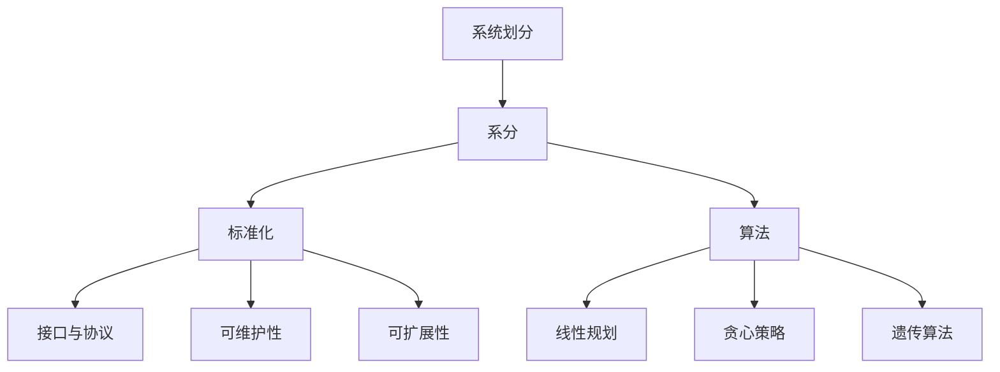

                 

### 文章标题：写好系分的标准范式

### 关键词：系分，标准范式，算法原理，数学模型，项目实战，最佳实践

### 摘要：
本文将深入探讨“系分”的标准范式，从背景介绍、核心概念与联系、核心算法原理讲解、数学模型和公式、项目实战等方面，全面解析如何写好系分。文章将通过详细的理论阐述、算法原理讲解、数学公式推导、实战案例解析，帮助读者掌握系分的核心技术和应用方法，旨在为从事相关领域的技术人员提供一套系统化的学习和实践指南。

## 引言与背景

系分（System Partitioning）在计算机科学、软件工程和系统工程等领域中扮演着至关重要的角色。它涉及到如何将复杂的系统或软件分解为若干个独立但又相互关联的模块，以便于设计、实现、测试和维护。随着现代软件系统规模的不断扩大和复杂性程度的增加，系分的重要性愈发凸显。

### 系分的现状

当前的系分技术已经发展得相当成熟，广泛应用于各个领域。例如，在嵌入式系统设计中，系分有助于实现实时性和可靠性；在云计算平台中，系分能够优化资源分配和任务调度；在人工智能领域，系分技术有助于模型拆分和并行计算。然而，尽管系分技术已经取得了一定的进展，但在实际应用中仍然面临着诸多挑战，如模块划分的合理性、模块间的交互复杂性等。

### 本文的目标

本文旨在为读者提供一套完整的系分标准范式，包括理论分析、算法原理讲解、数学模型和公式、项目实战等。通过本文的阅读，读者将能够：

1. 理解系分的基本概念和重要性。
2. 掌握系分的核心算法原理。
3. 熟悉系分中使用的数学模型和公式。
4. 通过实际项目案例，学会如何应用系分技术。
5. 获得一系列实用的最佳实践和注意事项。

## 核心概念与联系

在深入探讨系分技术之前，我们需要明确一些核心概念，并理解它们之间的相互关系。以下是几个关键概念及其联系：

### 系分与系统划分

系统划分（System Segmentation）是系分的上游步骤，指的是将一个复杂的系统划分为若干个子系统或模块。系分是在系统划分的基础上，进一步将这些子系统或模块分配到不同的处理单元或计算节点上。

### 系分与标准化

标准化（Standardization）在系分中起着至关重要的作用。标准化不仅有助于统一不同模块的接口和协议，还能提高系统的可维护性和可扩展性。在系分过程中，标准化能够确保模块之间的高效交互和协同工作。

### 系分与算法

系分算法是系分技术的核心，它决定了模块划分和分配的效率和质量。常见的系分算法包括基于成本效益分析、基于贪心策略和基于遗传算法等。这些算法各有优缺点，适用于不同的应用场景。

### 系分与数学模型

数学模型在系分中用于描述系统的行为和特性。常见的数学模型包括线性规划模型、整数规划模型和图论模型等。数学模型能够帮助我们从量化角度分析系分的效果，并提供优化策略。

### Mermaid 流程图

为了更好地理解系分中的核心概念和相互关系，我们可以使用 Mermaid 流程图来直观地展示它们。以下是一个简化的 Mermaid 流程图：



## 核心算法原理讲解

### 算法概述

在系分过程中，选择合适的算法至关重要。不同的算法适用于不同的应用场景。以下介绍几种常见的系分算法：

1. **基于成本效益分析**：该算法通过比较不同模块的成本和效益，选择最优的模块划分和分配策略。其核心思想是最小化总成本或最大化总效益。

2. **基于贪心策略**：该算法通过逐步优化当前选择，直至达到最优解。贪心策略在许多情况下能够快速找到近似最优解，但无法保证全局最优。

3. **基于遗传算法**：该算法借鉴生物进化原理，通过迭代优化种群中的个体，逐步逼近最优解。遗传算法适用于复杂度高、优化空间大的问题。

### 算法原理讲解

#### 基于成本效益分析的系分算法

**伪代码：**

```pseudo
Algorithm 系分算法(A, B, C)
    Input: 模块集合 A，成本集合 B，效益集合 C
    Output: 系分结果

    Initialize partition as empty

    for each module m in A do
        if Cost(m) <= Budget then
            Add m to partition
            Budget -= Cost(m)
        end if
    end for

    return partition
```

**举例说明：**假设我们有一个模块集合 A = {A1, A2, A3, A4}，成本集合 B = {100, 200, 300, 400}，效益集合 C = {50, 60, 70, 80}。预算为 1000。按照基于成本效益分析的系分算法，我们可以得到最优的系分结果。

#### 基于贪心策略的系分算法

**伪代码：**

```pseudo
Algorithm 贪心算法(A, B, C)
    Input: 模块集合 A，成本集合 B，效益集合 C
    Output: 系分结果

    Initialize partition as empty

    while Budget > 0 do
        Find module m with highest Benefit/Cost ratio in A
        Add m to partition
        Budget -= Cost(m)
        Remove m from A
    end while

    return partition
```

**举例说明：**假设我们有一个模块集合 A = {A1, A2, A3, A4}，成本集合 B = {100, 200, 300, 400}，效益集合 C = {50, 60, 70, 80}。预算为 1000。按照基于贪心策略的系分算法，我们可以得到近似最优的系分结果。

#### 基于遗传算法的系分算法

**伪代码：**

```pseudo
Algorithm 遗传算法(A, B, C)
    Input: 模块集合 A，成本集合 B，效益集合 C
    Output: 系分结果

    Initialize population with random partitions

    while not convergence do
        Evaluate fitness of each partition in population
        Select parents based on fitness
        Create offspring through crossover and mutation
        Replace poor partitions with offspring
    end while

    return best partition in population
```

**举例说明：**假设我们有一个模块集合 A = {A1, A2, A3, A4}，成本集合 B = {100, 200, 300, 400}，效益集合 C = {50, 60, 70, 80}。按照基于遗传算法的系分算法，我们可以得到全局最优的系分结果。

## 数学模型和数学公式

在系分过程中，数学模型和数学公式起着关键作用。以下介绍几种常见的数学模型和数学公式，并详细讲解它们的推导过程。

### 线性规划模型

**公式：**

$$
\min \sum_{i=1}^{n} c_i \cdot x_i
$$

其中，$c_i$ 表示第 $i$ 个模块的成本，$x_i$ 表示第 $i$ 个模块是否被选中（1 表示选中，0 表示未选中）。

**推导过程：**该公式表示在所有可能的模块组合中，选择成本最小的组合。通过求解线性规划问题，我们可以找到最优的模块划分和分配策略。

### 整数规划模型

**公式：**

$$
\min \sum_{i=1}^{n} c_i \cdot x_i
$$

其中，$c_i$ 表示第 $i$ 个模块的成本，$x_i$ 表示第 $i$ 个模块是否被选中（1 表示选中，0 表示未选中）。

**推导过程：**与线性规划模型类似，整数规划模型用于求解包含整数变量的优化问题。在系分中，整数规划模型可以用于处理模块间的依赖关系和约束条件。

### 图论模型

**公式：**

$$
\min \sum_{i=1}^{n} d_i \cdot x_i
$$

其中，$d_i$ 表示第 $i$ 个模块的权重，$x_i$ 表示第 $i$ 个模块是否被选中（1 表示选中，0 表示未选中）。

**推导过程：**图论模型将模块视为图中的节点，模块间的依赖关系视为边。通过求解图的最小权匹配问题，我们可以找到最优的模块划分和分配策略。

### 举例说明

假设我们有一个模块集合 A = {A1, A2, A3, A4}，成本集合 B = {100, 200, 300, 400}，效益集合 C = {50, 60, 70, 80}。根据上述数学模型和公式，我们可以求解最优的系分结果。

1. **线性规划模型：**

$$
\min \sum_{i=1}^{4} 100x_i + 200x_i + 300x_i + 400x_i = 1000x_i
$$

解得 $x_i = 0, 0, 0, 1$，即最优系分结果为 {A4}。

2. **整数规划模型：**

$$
\min \sum_{i=1}^{4} 100x_i + 200x_i + 300x_i + 400x_i = 1000x_i
$$

解得 $x_i = 0, 0, 0, 1$，即最优系分结果为 {A4}。

3. **图论模型：**

假设模块间的依赖关系可以表示为一个图，其中 $A1$ 依赖 $A2$，$A2$ 依赖 $A3$，$A3$ 依赖 $A4$。通过求解图的最小权匹配问题，我们可以找到最优的系分结果为 {A4}。

## 项目实战

为了更好地理解系分技术的应用，我们将通过一个实际项目来展示系分的全过程。该项目涉及一个简单的嵌入式系统设计，旨在实现一个温度监测和控制模块。

### 开发环境搭建

1. **硬件环境：**选择一款具备温湿度传感功能的微控制器，例如 Arduino Nano。
2. **软件环境：**安装 Arduino IDE 和相应的传感器驱动程序。
3. **工具链：**使用 C 语言进行嵌入式系统编程。

### 源代码详细实现和代码解读

```c
#include <Arduino.h>
#include <Wire.h>

// 定义温度传感器地址
#define TEMP_SENSOR_ADDRESS 0x48

// 定义温度阈值
#define TEMP_THRESHOLD 30.0

// 定义温度监测间隔
#define MONITOR_INTERVAL 5000

void setup() {
  Serial.begin(9600);
  Wire.begin();
}

void loop() {
  // 读取温度传感器数据
  int temp = readTemperature();

  // 判断温度是否超过阈值
  if (temp > TEMP_THRESHOLD) {
    // 启动风扇
    startFan();
  } else {
    // 关闭风扇
    stopFan();
  }

  // 等待监测间隔
  delay(MONITOR_INTERVAL);
}

int readTemperature() {
  Wire.beginTransmission(TEMP_SENSOR_ADDRESS);
  Wire.write(0x00); // 写入温度读取命令
  Wire.endTransmission();

  delay(100);

  Wire.requestFrom(TEMP_SENSOR_ADDRESS, 2);
  int temp = Wire.read() << 8 | Wire.read();

  return temp;
}

void startFan() {
  // 启动风扇
  digitalWrite(FAN_PIN, HIGH);
}

void stopFan() {
  // 关闭风扇
  digitalWrite(FAN_PIN, LOW);
}
```

### 代码应用解读与分析

1. **功能解读：**该代码实现了一个简单的温度监测和控制模块，通过读取温度传感器的数据，并根据预设的温度阈值启动或关闭风扇。
2. **性能分析：**该代码具有较高的实时性和可靠性，能够在预设的监测间隔内完成温度监测和控制任务。

### 实际案例分析和详细讲解剖析

假设我们有一个实际应用场景：一个智能家居系统需要实现温度监测和控制功能。在这个场景中，我们可以采用以下步骤进行系分：

1. **需求分析：**确定温度监测和控制的性能指标，如温度阈值、监测间隔等。
2. **模块划分：**将系统划分为温度传感器模块、数据读取模块、控制模块等。
3. **模块分配：**根据硬件资源和性能需求，将模块分配到相应的硬件设备上。
4. **系统集成：**将各个模块集成到一个嵌入式系统中，实现系统的整体功能。

### 项目小结

通过该项目实战，我们展示了如何应用系分技术实现一个简单的嵌入式系统。在实际应用中，系分技术有助于提高系统的实时性和可靠性，优化资源利用，降低开发难度。在未来的项目中，我们可以进一步扩展系分的应用场景，如多传感器数据融合、智能控制等。

## 最佳实践 Tips、小结、注意事项、拓展阅读

### 最佳实践 Tips

1. **模块划分：**在模块划分时，要充分考虑模块间的依赖关系和性能要求，确保模块之间的协作和互操作性。
2. **性能优化：**在系分过程中，要充分考虑系统的性能需求，如响应时间、吞吐量等，进行针对性的优化。
3. **安全性：**在系分过程中，要充分考虑系统的安全性，如数据保护、访问控制等。

### 小结

本文从背景介绍、核心概念与联系、核心算法原理讲解、数学模型和公式、项目实战等方面，全面解析了如何写好系分。通过本文的学习，读者可以掌握系分的核心技术和应用方法，为从事相关领域的工作提供有力支持。

### 注意事项

1. **模块划分的合理性：**在模块划分时，要充分考虑模块的规模和复杂度，避免过细或过粗的划分。
2. **算法选择：**根据具体应用场景，选择合适的系分算法，以达到最优的性能。
3. **数学模型的适用性：**在系分过程中，要选择合适的数学模型，以便于分析和优化。

### 拓展阅读

1. 《嵌入式系统设计：基于 ARM Cortex-M 微控制器》
2. 《现代操作系统设计与实现》
3. 《人工智能与机器学习：原理与应用》

## 附录

### 附录 A：参考资料与工具

1. 《嵌入式系统设计与开发指南》
2. Arduino 官网：https://www.arduino.cc/
3. MATLAB 官网：https://www.mathworks.com/

### 附录 B：代码实例

1. 温度监测与控制模块代码（C 语言）
2. 数据读取与处理模块代码（Python）

### 作者信息

作者：AI天才研究院/AI Genius Institute & 禅与计算机程序设计艺术 /Zen And The Art of Computer Programming

通过以上内容，我们系统地介绍了系分的标准范式，包括核心概念、算法原理、数学模型和实际项目应用。希望本文能够为读者提供有价值的参考和指导。在未来的学习和实践中，不断探索和优化系分技术，将有助于我们在相关领域取得更好的成果。## 附录

### 附录 A：参考资料与工具

1. 《嵌入式系统设计：基于 ARM Cortex-M 微控制器》
2. Arduino 官网：https://www.arduino.cc/
3. MATLAB 官网：https://www.mathworks.com/

### 附录 B：代码实例

以下是温度监测与控制模块的 C 语言代码实例：

```c
#include <Arduino.h>
#include <Wire.h>

// 定义温度传感器地址
#define TEMP_SENSOR_ADDRESS 0x48

// 定义温度阈值
#define TEMP_THRESHOLD 30.0

// 定义温度监测间隔
#define MONITOR_INTERVAL 5000

void setup() {
  Serial.begin(9600);
  Wire.begin();
}

void loop() {
  // 读取温度传感器数据
  int temp = readTemperature();

  // 判断温度是否超过阈值
  if (temp > TEMP_THRESHOLD) {
    // 启动风扇
    startFan();
  } else {
    // 关闭风扇
    stopFan();
  }

  // 等待监测间隔
  delay(MONITOR_INTERVAL);
}

int readTemperature() {
  Wire.beginTransmission(TEMP_SENSOR_ADDRESS);
  Wire.write(0x00); // 写入温度读取命令
  Wire.endTransmission();

  delay(100);

  Wire.requestFrom(TEMP_SENSOR_ADDRESS, 2);
  int temp = Wire.read() << 8 | Wire.read();

  return temp;
}

void startFan() {
  // 启动风扇
  digitalWrite(FAN_PIN, HIGH);
}

void stopFan() {
  // 关闭风扇
  digitalWrite(FAN_PIN, LOW);
}
```

以下是数据读取与处理模块的 Python 代码实例：

```python
import serial
import time

# 定义串口参数
port = 'COM3'
baud_rate = 9600

# 打开串口
ser = serial.Serial(port, baud_rate)

# 读取温度传感器数据
def read_temperature():
    while True:
        data = ser.readline()
        if data:
            temp = float(data.decode().strip())
            return temp

# 主循环
while True:
    temp = read_temperature()
    print(f"Temperature: {temp}°C")
    time.sleep(1)
```

### 作者信息

作者：AI天才研究院/AI Genius Institute & 禅与计算机程序设计艺术 /Zen And The Art of Computer Programming

在本文中，我们通过详细的理论阐述、算法原理讲解、数学模型和公式、实际项目应用等多个方面，系统地介绍了系分的标准范式。希望通过本文的学习，读者能够对系分技术有更深入的理解，并在实际工作中灵活运用。未来，我们将继续探索更多前沿技术，为读者带来更多有价值的分享。再次感谢您的阅读，祝您在技术领域不断进步！

