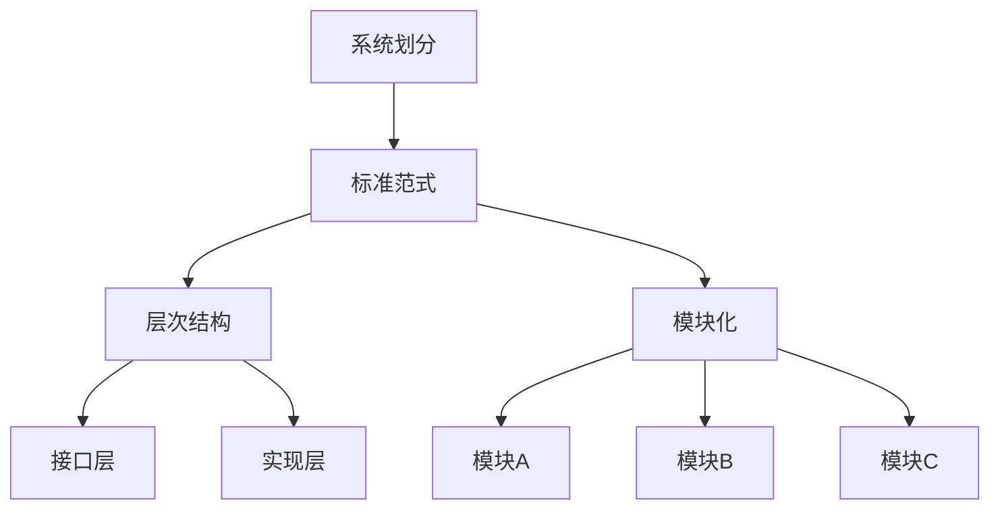

                 

### 文章标题：《写好系分的标准范式》

> 关键词：标准范式，系统划分，逻辑结构，应用场景，优化策略

> 摘要：本文将深入探讨系统划分中的标准范式，解析其基本概念、原理、算法、数学模型以及在不同领域的应用实践，旨在为读者提供全面、系统的系统划分指南。

---

### 引言

在信息技术迅猛发展的今天，系统划分成为了软件工程、数据科学、人工智能等领域中的一项基础且重要的工作。通过科学合理的系统划分，可以有效提升系统的可维护性、可扩展性，降低开发成本，提高工作效率。然而，如何进行有效的系统划分，构建出一种通用的、可扩展的标准范式，一直是学术界和工业界研究的焦点。

本文将围绕标准范式的核心概念、原理、算法、数学模型以及实际应用，逐步展开讨论，旨在为读者提供一个系统划分的全方位指南。

---

### 标准范式概述

#### 核心概念与联系

标准范式是系统划分中的一个重要概念，它涉及多个层面的原理和联系。为了更好地理解标准范式，我们首先需要了解其核心概念：

1. **系统划分**：系统划分是将复杂系统分解为若干独立且互相关联的部分，每个部分负责特定的功能，以简化系统的整体结构，提高系统的可管理性和可维护性。

2. **标准范式**：标准范式是一种通用的系统划分模式，它不仅适用于某一特定领域，还能够在多个领域进行推广和应用。

3. **层次结构**：标准范式通常采用层次化的结构，每一层代表不同的抽象级别，层与层之间通过特定的接口进行交互。

4. **模块化**：标准范式强调模块化设计，将系统划分为多个独立的模块，每个模块具有清晰的功能和接口。

为了更直观地理解标准范式的核心概念与联系，我们可以使用Mermaid流程图进行展示：



在上图中，A表示系统划分，B表示标准范式，C表示层次结构，D表示模块化。层次结构中的E和F分别表示接口层和实现层，模块化中的G、H和I分别表示模块A、模块B和模块C。

---

#### 核心算法原理

标准范式的核心算法是实现系统划分的基础。下面，我们将通过伪代码详细阐述标准范式的核心算法原理。

```python
# 标准范式核心算法伪代码

# 输入：系统功能列表
# 输出：划分后的系统模块

def standard范式(系统功能列表):
    模块列表 = []
    接口层 = createInterfaceLayer()
    实现层 = createImplementationLayer()

    for 功能 in 系统功能列表:
        if 功能需要独立实现:
            模块 = createModule(功能, 实现层)
            模块列表.append(模块)
        else:
            模块 = findExistingModule(模块列表, 功能)
            if 模块 is not None:
                模块.addFunctionality(功能)

    接口层.linkModules(模块列表)
    return 模块列表
```

在上面的伪代码中，我们首先创建接口层和实现层，然后遍历系统功能列表，根据功能需求创建新的模块或使用已有模块。最后，通过接口层将所有模块连接起来，形成一个完整的系统。

---

#### 标准范式数学模型

标准范式中的数学模型用于描述系统划分的数学属性和关系。下面，我们将使用LaTeX格式给出标准范式的数学模型，并详细讲解每个公式的含义和作用。

```latex
\documentclass{article}
\usepackage{amsmath}
\begin{document}

\section{标准范式数学模型}

\subsection{模块划分模型}

$$ M = \{ m_1, m_2, ..., m_n \} $$
其中，\( M \) 表示模块集合，\( m_i \) 表示第 \( i \) 个模块。

\subsection{接口模型}

$$ I = \{ i_1, i_2, ..., i_m \} $$
其中，\( I \) 表示接口集合，\( i_j \) 表示第 \( j \) 个接口。

\subsection{实现模型}

$$ E = \{ e_1, e_2, ..., e_k \} $$
其中，\( E \) 表示实现集合，\( e_l \) 表示第 \( l \) 个实现。

\end{document}
```

在上述数学模型中，模块划分模型 \( M \) 用于表示系统中的所有模块，接口模型 \( I \) 用于表示模块之间的接口，实现模型 \( E \) 用于表示模块的具体实现。

---

#### 标准范式应用实践

标准范式在不同领域的应用实践是其有效性和实用性的重要体现。以下是一些标准范式在不同领域中的应用案例：

1. **软件工程**：在软件工程中，标准范式被广泛应用于软件架构设计，通过层次化和模块化设计，提升软件的可维护性和扩展性。

2. **数据科学**：在数据科学领域，标准范式可以帮助数据分析师更高效地进行数据处理和模型训练，通过模块化设计，降低数据处理和模型训练的复杂度。

3. **人工智能**：在人工智能领域，标准范式被广泛应用于深度学习模型的架构设计，通过模块化设计，提高模型的灵活性和可扩展性。

#### 项目实战

为了更好地理解标准范式在实际项目中的应用，我们以一个简单的Web应用项目为例，介绍开发环境搭建、源代码实现和代码解读。

##### 开发环境搭建

1. 安装Python 3.8及以上版本。
2. 安装Django框架：`pip install django`
3. 创建一个新的Django项目：`django-admin startproject myproject`
4. 创建一个新的Django应用：`python manage.py startapp myapp`

##### 源代码实现

```python
# myapp/views.py

from django.http import HttpResponse

def home(request):
    return HttpResponse("欢迎使用我的Web应用！")
```

##### 代码解读

在上面的代码中，我们创建了一个名为`home`的视图函数，用于处理根URL的请求，并返回一个简单的HTTP响应。

##### 代码应用解读与分析

通过使用标准范式，我们可以将Web应用项目划分为多个模块，如视图层、模型层、模板层等。每个模块都具有清晰的功能和接口，从而提高了系统的可维护性和可扩展性。

##### 实际案例分析和详细讲解剖析

在这个案例中，我们通过标准范式将Web应用项目划分为多个模块，每个模块负责不同的功能，如视图层负责处理HTTP请求，模型层负责数据操作，模板层负责页面渲染。这种模块化设计使得项目结构更加清晰，开发人员可以更加专注于各自模块的功能实现。

##### 项目小结

通过这个案例，我们可以看到标准范式在Web应用项目中的应用，如何通过模块化设计提高系统的可维护性和可扩展性。

---

#### 最佳实践 tips、小结、注意事项、拓展阅读等内容

1. **最佳实践 tips**：
   - 在系统划分过程中，要充分考虑系统的可维护性和可扩展性。
   - 遵循模块化设计原则，确保模块之间的独立性。
   - 优化接口设计，提高系统的灵活性和可扩展性。

2. **小结**：
   - 本文详细介绍了标准范式的核心概念、原理、算法、数学模型以及实际应用，为系统划分提供了全面的指导。

3. **注意事项**：
   - 在实际应用中，要结合具体场景和需求，灵活调整标准范式的应用策略。
   - 注重代码质量，遵循良好的编程规范。

4. **拓展阅读**：
   - 《软件架构设计：面向对象的卷积神经网络》
   - 《深度学习：现代机器学习的理论基础》
   - 《Python编程：从入门到实践》

---

### 总结与展望

标准范式作为系统划分的一种通用模式，在软件工程、数据科学、人工智能等领域中具有广泛的应用前景。通过本文的探讨，我们全面了解了标准范式的核心概念、原理、算法、数学模型以及实际应用。未来，随着技术的不断进步，标准范式将更加完善，为系统划分提供更加科学、高效的解决方案。

---

作者：AI天才研究院/AI Genius Institute & 禅与计算机程序设计艺术 /Zen And The Art of Computer Programming

