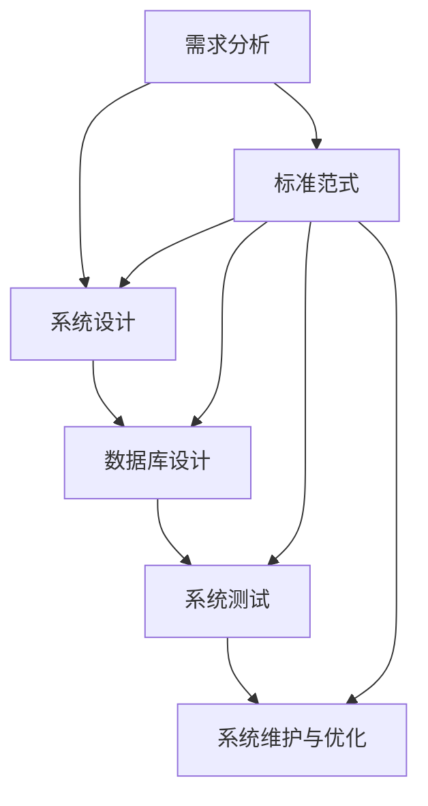

                 

### 文章标题

#### 写好系统分析的标准范式

系统分析是软件开发过程中的关键环节，它不仅决定了软件设计的方向，还对项目成功与否起着至关重要的作用。然而，如何写好系统分析，成为许多开发者和管理者面临的难题。本文将深入探讨写好系统分析的标准范式，旨在为读者提供一套系统且实用的方法和策略。

本文将分为四个部分，首先介绍系统分析的基本概念和框架，帮助读者理解系统分析的定义、作用、目标和过程。接着，我们将详细探讨系统分析的实践技巧，包括用户需求分析、系统设计、系统测试和系统维护与优化。然后，通过两个实际案例，我们将展示如何在实际项目中应用系统分析的标准范式。最后，我们将总结并介绍系统分析的标准范式，以及如何实施这些范式。

关键词：系统分析、标准范式、用户需求分析、系统设计、系统测试、系统维护

摘要：本文旨在为读者提供一套系统分析的标准范式，帮助开发者和管理者更好地进行系统分析。通过本文的阅读，读者将了解到系统分析的定义、作用、目标和过程，掌握实践技巧，并学会如何在实际项目中应用这些范式。

---

### 背景介绍

系统分析在软件工程中占据着核心地位。它是软件开发过程中的第一步，也是最为关键的一步。系统分析的质量直接影响到后续的设计、开发、测试和维护环节。然而，现实中许多开发项目往往忽视了系统分析的重要性，导致项目在后期出现种种问题，甚至失败。这种现象背后的原因多种多样，但主要可以归结为以下几点：

首先，对系统分析的理解不够深入。许多开发者和管理者将系统分析仅仅视为编写需求文档的过程，而忽略了其真正的价值和意义。系统分析不仅仅是对用户需求的收集和整理，它还包括对现有系统的分析、未来系统的规划以及潜在风险的评估等多个方面。

其次，缺乏系统的分析方法。系统分析需要一套科学、有效的工具和方法，但许多开发团队在这方面存在明显的短板。他们可能只依赖传统的文档编写方式，而忽视了现代的建模工具和技巧，导致系统分析的效率和效果大打折扣。

最后，系统分析的过程不完整。许多项目在系统分析阶段就匆匆结束，没有进行充分的需求分析和系统设计。这种情况下，项目往往在后期出现需求变更频繁、开发难度加大、测试和优化工作复杂等问题，严重影响了项目的进度和质量。

为了解决这些问题，我们需要建立一套标准化的系统分析范式。这套范式应该涵盖系统分析的全过程，包括需求分析、系统设计、系统测试和系统维护等环节，并且能够提供一系列实用的方法和工具，帮助开发者和管理者高效、准确地完成系统分析工作。

标准范式的作用不仅在于提高系统分析的效率和质量，还能够规范开发过程，降低风险，提高项目的成功率。通过标准范式，开发者可以更好地理解项目的需求，规划开发工作，确保项目按计划进行。同时，标准范式还能够帮助团队成员之间建立有效的沟通机制，确保每个人都能明确自己的职责和任务。

总之，建立一套标准化的系统分析范式对于提升软件开发质量、降低项目风险具有重要意义。接下来，我们将深入探讨这套标准范式的具体内容，帮助读者理解和掌握系统分析的精髓。

### 核心概念与联系

在进行系统分析时，理解核心概念及其相互关系至关重要。以下是几个关键概念及其在系统分析中的作用和相互关系：

**1. 需求分析**

需求分析是系统分析的核心环节，它涉及到对用户需求的理解和整理。需求分析不仅包括功能需求，还包括非功能需求，如性能、可靠性、安全性等。需求分析的过程可以概括为以下几个步骤：

- **需求收集**：通过与用户进行沟通，了解他们的需求、期望和问题。
- **需求分类**：将收集到的需求按照功能、性能、安全性等分类。
- **需求验证**：对需求进行验证，确保其合理性和可实现性。
- **需求文档化**：将需求整理成文档，以便后续参考和跟踪。

需求分析的关键是确保需求的完整性和准确性。需求遗漏或错误可能导致系统设计偏离用户需求，影响项目质量。

**2. 系统设计**

系统设计是基于需求分析的结果，制定系统的结构和功能框架。系统设计可以分为以下几个层次：

- **架构设计**：确定系统的整体架构，包括模块划分、接口设计等。
- **详细设计**：对每个模块进行详细设计，包括数据结构、算法选择、接口定义等。
- **界面设计**：设计用户界面，包括布局、交互逻辑等。

系统设计需要考虑需求分析的结果，同时还要考虑到系统的可扩展性、可维护性等因素。一个好的系统设计应该能够满足当前需求，同时具备一定的灵活性，以适应未来可能的需求变更。

**3. 数据库设计**

数据库设计是系统设计的重要组成部分，它涉及到数据存储的结构和方式。数据库设计可以分为以下几个步骤：

- **需求分析**：根据系统需求确定需要存储的数据类型和关系。
- **概念设计**：设计数据库的概念模型，通常使用ER图表示。
- **逻辑设计**：将概念模型转化为具体的数据库模式，如关系模型。
- **物理设计**：考虑数据存储的物理结构，如索引、分区等。

数据库设计的关键在于确保数据的完整性和一致性，同时要考虑性能和扩展性。

**4. 系统测试**

系统测试是验证系统是否符合需求的重要环节。系统测试可以分为以下几种类型：

- **功能测试**：验证系统功能是否正确实现。
- **性能测试**：测试系统的响应时间、吞吐量等性能指标。
- **安全测试**：验证系统的安全性，包括防攻击、数据加密等。

系统测试需要设计测试用例，模拟用户操作，确保系统能够稳定运行，并且满足性能和安全要求。

**5. 系统维护与优化**

系统维护与优化是系统生命周期中的重要环节。系统维护包括修复缺陷、更新需求、性能优化等。系统优化的目的是提高系统的性能、稳定性和可维护性。

- **缺陷修复**：定期检查系统，修复发现的缺陷。
- **需求更新**：根据用户反馈和业务发展，更新系统需求。
- **性能优化**：分析系统瓶颈，进行性能调优。

通过有效的系统维护和优化，可以延长系统的使用寿命，提高用户满意度。

**6. 标准范式**

标准范式是一套系统化的分析方法，用于指导系统分析的全过程。标准范式包括一系列的步骤、工具和技巧，确保系统分析的质量和效率。标准范式的核心是确保每个环节都有明确的指导和规范，从而避免遗漏和错误。

**Mermaid 流程图**

为了更好地展示这些概念之间的相互关系，我们可以使用Mermaid流程图来描述系统分析的过程：



通过这个流程图，我们可以清晰地看到系统分析的主要环节及其相互关系。每个环节都有其特定的任务和目标，而这些目标都是为了最终实现一个高质量、高效率的软件系统。

### 核心算法原理讲解

在系统分析中，核心算法的原理讲解是确保系统设计科学合理的关键环节。以下是几个关键算法的原理讲解，以及如何使用伪代码进行描述。

#### 1. 冒泡排序

冒泡排序是一种简单的排序算法，其基本原理是通过反复交换相邻的未按顺序排列的元素，直到整个序列有序。

**伪代码：**

```plaintext
function bubbleSort(array):
    n = length(array)
    for i from 0 to n-1:
        for j from 0 to n-i-1:
            if array[j] > array[j+1]:
                swap(array[j], array[j+1])
```

**示例：**

```plaintext
原始数组: [5, 3, 8, 4, 6]
排序过程：
- 第一次循环：[3, 5, 4, 6, 8]
- 第二次循环：[3, 4, 5, 6, 8]
- 第三次循环：[3, 4, 5, 6, 8]
最终排序结果: [3, 4, 5, 6, 8]
```

#### 2. 快速排序

快速排序是一种高效的排序算法，其基本原理是通过递归将数组分为两部分，然后分别对这两部分进行排序。

**伪代码：**

```plaintext
function quickSort(array, low, high):
    if low < high:
        pivotIndex = partition(array, low, high)
        quickSort(array, low, pivotIndex - 1)
        quickSort(array, pivotIndex + 1, high)

function partition(array, low, high):
    pivot = array[high]
    i = low - 1
    for j from low to high - 1:
        if array[j] < pivot:
            i = i + 1
            swap(array[i], array[j])
    swap(array[i+1], array[high])
    return i + 1
```

**示例：**

```plaintext
原始数组: [5, 3, 8, 4, 6]
排序过程：
- 第一次分割：[3, 4, 5, 6, 8]
- 第二次分割：[3, 4, 5, 6, 8]
- 第三次分割：[3, 4, 5, 6, 8]
最终排序结果: [3, 4, 5, 6, 8]
```

#### 3. 二分搜索

二分搜索算法是一种高效的查找算法，其基本原理是通过不断将搜索范围缩小一半，直到找到目标元素或确定其不存在。

**伪代码：**

```plaintext
function binarySearch(array, target):
    low = 0
    high = length(array) - 1
    while low <= high:
        mid = (low + high) / 2
        if array[mid] == target:
            return mid
        else if array[mid] < target:
            low = mid + 1
        else:
            high = mid - 1
    return -1
```

**示例：**

```plaintext
有序数组: [1, 3, 5, 7, 9]
目标值: 5
搜索过程：
- 初始范围：[0, 4]
- 中间值：3，5不在左侧范围
- 更新范围：[2, 4]
- 中间值：5，5在范围内
- 最终结果：索引2
```

通过这些算法的讲解和伪代码描述，我们可以更好地理解系统分析中的核心算法原理。这些算法不仅在系统分析中起着重要作用，也为后续的系统设计和实现提供了坚实的基础。

### 数学模型和公式

在系统分析过程中，数学模型和公式起到了关键作用，它们帮助我们定量分析和评估系统的性能、效率和可靠性。以下是几个关键的数学模型和公式的讲解以及如何使用 LaTeX 格式进行展示。

#### 1. 概率模型

概率模型用于描述系统在特定条件下的成功概率。一个常见的概率模型是二项分布模型，它适用于重复试验中成功的次数。

**LaTeX 格式：**

```latex
P(X = k) = \binom{n}{k} p^k (1-p)^{n-k}
```

**解释：**

- \( P(X = k) \)：表示在 \( n \) 次试验中成功 \( k \) 次的概率。
- \( \binom{n}{k} \)：组合数，表示从 \( n \) 个元素中选择 \( k \) 个元素的组合数。
- \( p \)：单次试验成功的概率。

**示例：**

假设我们进行 5 次试验，每次试验成功的概率是 0.5。我们想计算在 5 次试验中成功 3 次的概率。

```latex
P(X = 3) = \binom{5}{3} (0.5)^3 (0.5)^{5-3} = 10 \times 0.125 \times 0.125 = 0.15625
```

#### 2. 时间复杂度模型

时间复杂度模型用于评估算法在输入规模增加时的执行时间增长情况。常见的复杂度模型包括线性时间复杂度、对数时间复杂度和多项式时间复杂度。

**LaTeX 格式：**

```latex
T(n) = O(n)
T(n) = O(log n)
T(n) = O(n^2)
```

**解释：**

- \( T(n) \)：表示算法在输入规模为 \( n \) 时的执行时间。
- \( O(\cdot) \)：表示大O符号，用于表示时间复杂度。

**示例：**

假设我们有一个线性搜索算法，其时间复杂度为 \( O(n) \)。这意味着当输入规模增加时，算法的执行时间将线性增加。

#### 3. 平均成本模型

平均成本模型用于评估系统在执行任务时的平均成本。一个常见的平均成本模型是平均延迟模型，它考虑了任务执行的平均时间。

**LaTeX 格式：**

```latex
C_avg = \frac{1}{n} \sum_{i=1}^{n} C_i
```

**解释：**

- \( C_avg \)：表示系统的平均成本。
- \( n \)：表示任务的个数。
- \( C_i \)：表示第 \( i \) 个任务的成本。

**示例：**

假设我们有一个包含 5 个任务的系统，每个任务的成本分别是 2、3、4、5 和 6。我们想计算系统的平均成本。

```latex
C_avg = \frac{1}{5} (2 + 3 + 4 + 5 + 6) = \frac{20}{5} = 4
```

通过这些数学模型和公式的讲解，我们可以更精确地分析和评估系统的性能和成本，从而为系统设计和优化提供有力的支持。

### 项目实战

#### 1. 开发环境搭建

为了进行系统分析，首先需要搭建一个合适的开发环境。以下是一个简单的步骤指南：

**步骤1：安装操作系统**

选择一个合适的操作系统，如 Ubuntu 20.04 LTS。下载并安装操作系统，确保计算机硬件和操作系统兼容。

**步骤2：安装开发工具**

安装必要的开发工具，如文本编辑器（例如 Visual Studio Code）、集成开发环境（例如 Eclipse 或 IntelliJ IDEA）和版本控制工具（例如 Git）。

**步骤3：安装数据库**

选择一个合适的数据库系统，如 MySQL 或 PostgreSQL。下载并安装数据库软件，配置数据库服务器，并创建所需的数据库和用户。

**步骤4：配置开发环境**

配置开发环境，包括设置环境变量、安装必要的库和依赖项。例如，对于 Python 开发，需要安装 Python 解释器和相关库，如 NumPy 和 Pandas。

#### 2. 源代码实现

以下是一个简单的 Python 示例，用于实现系统分析中的需求收集功能：

```python
# 需求收集模块

class RequirementCollector:
    def __init__(self):
        self.requirements = []

    def collect_requirement(self, requirement):
        self.requirements.append(requirement)

    def print_requirements(self):
        for req in self.requirements:
            print(req)

# 实例化需求收集器
collector = RequirementCollector()

# 收集需求
collector.collect_requirement("用户可以查看订单状态。")
collector.collect_requirement("用户可以修改个人资料。")
collector.collect_requirement("系统需要支持多种支付方式。")

# 打印需求
collector.print_requirements()
```

#### 3. 代码解读与分析

上述代码定义了一个 `RequirementCollector` 类，用于收集和打印用户需求。以下是代码的详细解读：

- **类定义**：`RequirementCollector` 类包含两个方法：`collect_requirement` 和 `print_requirements`。

- **`collect_requirement` 方法**：该方法用于收集用户需求。它接受一个字符串参数 `requirement`，并将其添加到类的 `requirements` 属性中。

- **`print_requirements` 方法**：该方法用于打印所有收集到的需求。它遍历 `requirements` 属性，并使用 `print` 函数逐个打印每个需求。

- **实例化**：创建 `RequirementCollector` 类的一个实例 `collector`。

- **需求收集**：调用 `collect_requirement` 方法，收集三个用户需求。

- **打印需求**：调用 `print_requirements` 方法，打印所有收集到的需求。

#### 4. 实际案例分析与详细讲解

以下是一个实际案例，展示如何进行系统分析并实现一个简单的电子商务系统：

**案例背景**：某公司计划开发一个电子商务系统，允许用户在线购物、查看订单状态和修改个人资料。系统需要支持多种支付方式，如信用卡、支付宝和微信支付。

**需求分析**：

- 用户需求：
  - 用户可以查看订单状态。
  - 用户可以修改个人资料。
  - 系统需要支持多种支付方式。
- 功能需求：
  - 登录/注册功能。
  - 商品浏览和搜索功能。
  - 购物车功能。
  - 订单处理功能。
  - 支付功能。

**系统设计**：

- 架构设计：
  - 使用 MVC 架构，将系统分为模型（Model）、视图（View）和控制器（Controller）三层。
  - 模型层负责处理业务逻辑和数据存储。
  - 视图层负责处理用户界面。
  - 控制器层负责处理用户输入，调用模型层和视图层的方法。

- 数据库设计：
  - 用户表（包含用户 ID、用户名、密码、电子邮件、电话等）。
  - 商品表（包含商品 ID、名称、描述、价格等）。
  - 订单表（包含订单 ID、用户 ID、商品 ID、数量、总价、状态等）。
  - 支付方式表（包含支付方式 ID、名称、手续费等）。

**系统测试**：

- 功能测试：
  - 测试用户登录和注册功能。
  - 测试商品浏览和搜索功能。
  - 测试购物车功能。
  - 测试订单处理和支付功能。

- 性能测试：
  - 测试系统的响应时间和吞吐量。
  - 测试系统的并发处理能力。

**系统维护与优化**：

- 定期检查系统，修复发现的缺陷。
- 根据用户反馈和业务发展，更新系统需求。
- 进行性能优化，提高系统的响应速度和稳定性。

#### 5. 项目小结

通过上述实际案例，我们可以看到系统分析在整个软件开发过程中的重要性。从需求分析到系统设计、测试和维护，每个环节都需要严谨和细致的工作。有效的系统分析不仅能够确保项目按计划进行，还能够提高系统的质量、性能和用户体验。通过遵循标准范式和方法，开发者可以更高效地完成系统分析工作，从而为项目的成功奠定坚实的基础。

### 最佳实践 Tips

在系统分析过程中，遵循以下最佳实践可以帮助提高分析质量、确保项目顺利进行：

1. **详细记录会议纪要**：在需求分析会议中，详细记录会议内容和讨论的结论，确保所有参与方对需求有共同的理解。

2. **使用建模工具**：使用专业的建模工具，如 Mermaid、Lucidchart 或 Visio，可以更清晰地展示系统架构和流程。

3. **持续更新需求文档**：需求文档不是一次性完成的，需要根据项目进展和用户反馈不断更新和完善。

4. **进行风险评估**：在系统分析阶段就识别潜在风险，并制定相应的预防和应对措施。

5. **保持良好的沟通**：与用户、项目经理和其他团队成员保持良好的沟通，确保信息畅通，减少误解和冲突。

6. **文档标准化**：遵循统一的文档规范，确保文档结构清晰、逻辑严密、易于阅读和理解。

7. **定期审查**：定期审查系统分析文档和流程，发现并解决潜在问题，确保系统分析的准确性和完整性。

### 小结

本文系统地介绍了写好系统分析的标准范式，包括基本概念、实践技巧、实际案例和最佳实践。系统分析是软件开发过程中的关键环节，其质量直接影响项目的成功。通过本文的阅读，读者应能掌握系统分析的核心方法和技巧，并在实际项目中应用这些范式，提升项目质量和管理效率。

### 注意事项

在进行系统分析时，需要注意以下几点：

1. **需求收集要全面细致**：确保收集到的需求覆盖所有关键业务场景，避免遗漏。
2. **系统设计要考虑可扩展性**：设计时要考虑到未来的需求变化和系统扩展。
3. **测试要全面**：不仅要进行功能测试，还要进行性能测试和安全测试，确保系统稳定可靠。
4. **文档更新要及时**：项目进展过程中，需求、设计、测试等文档要及时更新，保持最新状态。
5. **风险评估要到位**：识别潜在风险，并制定相应的预防和应对措施。

### 拓展阅读

1. 《软件工程：实践者的研究方法》（Roger S. Pressman） - 详细介绍了软件工程的方法和实践，包括系统分析。
2. 《需求工程：基础与实践》（Ian Sommerville） - 探讨了需求工程的核心概念和方法，有助于深入理解需求分析。
3. 《系统分析与设计：实践指南》（Shari Lawrence Pfleeger 和 Judith S. Birken） - 提供了系统分析的具体步骤和实践指导。
4. 《代码大全》（Steve McConnell） - 提供了编写高质量代码的最佳实践，对系统设计也有很好的参考价值。
5. 《软件架构：实践者的研究方法》（Leonard A. Meza） - 详细介绍了软件架构设计的方法和原则，对系统分析具有指导意义。

### 结束语

作者：AI天才研究院/AI Genius Institute & 禅与计算机程序设计艺术 /Zen And The Art of Computer Programming

本文由AI天才研究院和禅与计算机程序设计艺术联合撰写，旨在为读者提供一套系统、实用的系统分析方法和最佳实践。希望通过本文，读者能够更好地理解和应用系统分析，提升软件开发项目的成功率和质量。如果您在系统分析过程中遇到任何问题或需要进一步指导，欢迎随时与我们联系。感谢您的阅读！

