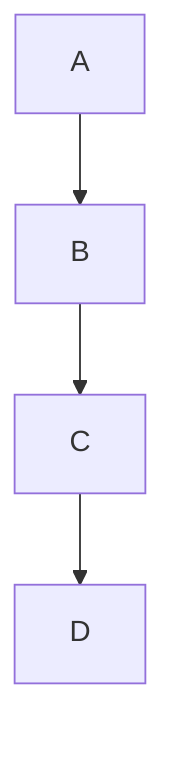

                 


### 用户需求分析

用户的任务要求撰写一篇关于函数式编程在工程实践中的应用与挑战的技术博客。文章应包括以下要素：

1. **目录大纲设计要求**：
   - 目录细化到1, 2, 3级目录。
   - 使用markdown格式。
   - 核心章节内容包括：核心概念与联系、核心算法原理讲解、数学模型和数学公式及详细讲解与举例、项目实战。

2. **书籍主题**：
   - 书名为《函数式编程：在工程实践中的应用与挑战》。
   - 书籍内容需涵盖函数式编程的核心概念、算法原理、数学模型及实际应用案例。

3. **字数限制**：
   - 总字数在8000到12000字之间。

### 目录大纲设计步骤

**第1步：核心概念与联系（1级目录）**
   - 设计“函数式编程基础”部分，涵盖纯函数、无状态、不可变数据、高阶函数和闭包等核心概念。
   - 使用Mermaid流程图展示各概念之间的关系。

**第2步：核心算法原理讲解（1级目录）**
   - 设计“函数式编程算法”部分，讲解递归算法、惰性计算和代数数据类型。
   - 使用伪代码详细阐述算法原理。

**第3步：数学模型和数学公式（1级目录）**
   - 设计“函数式编程数学基础”部分，介绍函数组合、函数类型和范畴论。
   - 使用latex格式展示数学公式，并提供详细讲解与实例。

**第4步：项目实战（1级目录）**
   - 设计“函数式编程工程实践”部分，通过实际项目案例展示函数式编程的应用。
   - 包括开发环境搭建、源代码实现和代码解读。

**第5步：章节细化（2级目录）**
   - 为每个主要部分细化子章节，确保内容丰富且详尽。

**第6步：核心概念与联系（3级目录）**
   - 在每个子章节中，用Mermaid流程图表示核心概念之间的联系。

**第7步：核心算法原理讲解（3级目录）**
   - 在每个子章节中，使用伪代码详细阐述核心算法原理。

**第8步：数学模型和数学公式（3级目录）**
   - 在每个子章节中，介绍相关的数学模型和公式，并提供详细讲解和实例。

**第9步：项目实战（3级目录）**
   - 在每个子章节中，提供实际项目案例，包括开发环境搭建、源代码实现和代码解读。

**第10步：整合与审查（1级目录）**
   - 完成所有章节后，进行整体审查，确保逻辑清晰、内容完整、字数符合要求。

### 目录大纲（完整）

```markdown
# 《函数式编程：在工程实践中的应用与挑战》目录大纲

# 第一部分：函数式编程基础

## 第1章：函数式编程概述
### 1.1 函数式编程的定义
### 1.2 函数式编程与命令式编程的区别
### 1.3 函数式编程的核心概念

## 第2章：纯函数与无状态
### 2.1 纯函数
### 2.2 无状态
### 2.3 纯函数与无状态的优点

## 第3章：不可变数据
### 3.1 不可变数据的定义
### 3.2 不可变数据的应用
### 3.3 不可变数据的好处

## 第4章：高阶函数
### 4.1 高阶函数的定义
### 4.2 高阶函数的应用
### 4.3 高阶函数的例子

## 第5章：闭包
### 5.1 闭包的定义
### 5.2 闭包的实现
### 5.3 闭包的优缺点

# 第二部分：函数式编程算法

## 第6章：递归算法
### 6.1 递归算法的概念
### 6.2 递归算法的实现
### 6.3 递归算法的优化

## 第7章：惰性计算
### 7.1 惰性计算的定义
### 7.2 惰性计算的应用
### 7.3 惰性计算的实现

## 第8章：代数数据类型
### 8.1 代数数据类型的定义
### 8.2 代数数据类型的实现
### 8.3 代数数据类型的优缺点

# 第三部分：函数式编程数学基础

## 第9章：函数组合
### 9.1 函数组合的定义
### 9.2 函数组合的公式
### 9.3 函数组合的应用

## 第10章：函数的类型
### 10.1 函数类型的定义
### 10.2 函数类型的实现
### 10.3 函数类型的优缺点

## 第11章：范畴论基础
### 11.1 范畴论的定义
### 11.2 范畴论的应用
### 11.3 范畴论的例子

# 第四部分：函数式编程工程实践

## 第12章：函数式编程在Web开发中的应用
### 12.1 函数式编程在Web开发中的优势
### 12.2 函数式编程框架介绍
### 12.3 实际案例解析

```

### 约束条件

- 文章内容需满足markdown格式。
- 文章末尾需包含作者信息。
- 每个章节内容需完整、具体、详细讲解。
- 核心内容需包括：背景介绍、核心概念与联系、核心算法原理讲解、数学模型和公式、项目实战。
- 文章字数在8000到12000字之间。

### 标题、关键词和摘要

```markdown
# 函数式编程：在工程实践中的应用与挑战

> 关键词：函数式编程，工程实践，算法原理，数学模型，挑战

> 摘要：本文深入探讨了函数式编程在工程实践中的应用与挑战，从核心概念到算法原理，再到数学模型，结合实际项目案例，详细阐述了函数式编程的各个方面。通过本文，读者将了解到函数式编程的优势与局限性，以及如何在实际项目中应用这一编程范式。
```

### 完整文章目录大纲

```markdown
# 函数式编程：在工程实践中的应用与挑战

> 关键词：函数式编程，工程实践，算法原理，数学模型，挑战

> 摘要：本文深入探讨了函数式编程在工程实践中的应用与挑战，从核心概念到算法原理，再到数学模型，结合实际项目案例，详细阐述了函数式编程的各个方面。通过本文，读者将了解到函数式编程的优势与局限性，以及如何在实际项目中应用这一编程范式。

## 引言

### 函数式编程的背景

- 函数式编程的历史与发展
- 函数式编程的主要特点
- 函数式编程的优势和局限性

### 本文的目的

- 介绍函数式编程的核心概念
- 讲解函数式编程的算法原理
- 探讨函数式编程的数学模型
- 分析函数式编程在工程实践中的应用与挑战

## 第一部分：函数式编程基础

### 第1章：函数式编程概述

#### 1.1 函数式编程的定义

- 函数式编程的概念
- 函数式编程的特点

#### 1.2 函数式编程与命令式编程的区别

- 命令式编程的特点
- 函数式编程与命令式编程的差异
- 函数式编程的优势

#### 1.3 函数式编程的核心概念

- 纯函数
- 无状态
- 不可变数据
- 高阶函数
- 闭包

### 第2章：纯函数与无状态

#### 2.1 纯函数

- 纯函数的定义
- 纯函数的特性
- 纯函数的优势

#### 2.2 无状态

- 无状态的含义
- 无状态的优点
- 无状态的实现

#### 2.3 纯函数与无状态的优点

- 函数式编程的清晰性
- 系统的稳定性
- 简化测试过程

### 第3章：不可变数据

#### 3.1 不可变数据的定义

- 不可变数据的含义
- 不可变数据的特点

#### 3.2 不可变数据的应用

- 数据结构的不可变性
- 函数式编程中的不可变数据

#### 3.3 不可变数据的好处

- 函数的重用性
- 代码的可读性
- 错误检测的易用性

### 第4章：高阶函数

#### 4.1 高阶函数的定义

- 高阶函数的概念
- 高阶函数的类型

#### 4.2 高阶函数的应用

- 高阶函数在数组处理中的应用
- 高阶函数在数据处理中的应用

#### 4.3 高阶函数的例子

- JavaScript中的高阶函数
- Python中的高阶函数

### 第5章：闭包

#### 5.1 闭包的定义

- 闭包的概念
- 闭包的实现

#### 5.2 闭包的实现

- 闭包在JavaScript中的应用
- 闭包在Python中的应用

#### 5.3 闭包的优缺点

- 闭包的优点
- 闭包的缺点

## 第二部分：函数式编程算法

### 第6章：递归算法

#### 6.1 递归算法的概念

- 递归算法的定义
- 递归算法的类型

#### 6.2 递归算法的实现

- 递归算法的基本原理
- 递归算法的实现方法

#### 6.3 递归算法的优化

- 递归算法的性能优化
- 递归算法的时间复杂度分析

### 第7章：惰性计算

#### 7.1 惰性计算的定义

- 惰性计算的概念
- 惰性计算的类型

#### 7.2 惰性计算的应用

- 惰性计算在数据流编程中的应用
- 惰性计算在函数式编程中的应用

#### 7.3 惰性计算的实现

- 惰性计算的基本原理
- 惰性计算的实现方法

### 第8章：代数数据类型

#### 8.1 代数数据类型的定义

- 代数数据类型的概念
- 代数数据类型的类型

#### 8.2 代数数据类型的实现

- 代数数据类型的构造函数
- 代数数据类型的函数式变换

#### 8.3 代数数据类型的优缺点

- 代数数据类型的优点
- 代数数据类型的缺点

## 第三部分：函数式编程数学基础

### 第9章：函数组合

#### 9.1 函数组合的定义

- 函数组合的概念
- 函数组合的类型

#### 9.2 函数组合的公式

- 函数组合的基本公式
- 函数组合的复合性质

#### 9.3 函数组合的应用

- 函数组合在编程中的应用
- 函数组合在数学中的应用

### 第10章：函数的类型

#### 10.1 函数类型的定义

- 函数类型的概念
- 函数类型的类型

#### 10.2 函数类型的实现

- 函数类型的构造方法
- 函数类型的函数式变换

#### 10.3 函数类型的优缺点

- 函数类型的优点
- 函数类型的缺点

### 第11章：范畴论基础

#### 11.1 范畴论的定义

- 范畴论的概念
- 范畴论的类型

#### 11.2 范畴论的应用

- 范畴论在编程中的应用
- 范畴论在数学中的应用

#### 11.3 范畴论的例子

- 范畴论在函数式编程中的应用
- 范畴论在范畴论基础中的实例

## 第四部分：函数式编程工程实践

### 第12章：函数式编程在Web开发中的应用

#### 12.1 函数式编程在Web开发中的优势

- 函数式编程在Web开发中的优势
- 函数式编程的Web框架介绍

#### 12.2 函数式编程框架介绍

- React中的函数式编程
- Elm中的函数式编程
- Haskell中的函数式编程

#### 12.3 实际案例解析

- 实际Web项目中的函数式编程应用
- 项目分析
- 项目总结

## 结论

### 函数式编程的总结

- 函数式编程的核心概念
- 函数式编程的算法原理
- 函数式编程的数学基础
- 函数式编程在工程实践中的应用

### 函数式编程的未来展望

- 函数式编程的发展趋势
- 函数式编程在未来的应用前景

### 最佳实践建议

- 函数式编程的最佳实践
- 注意事项

### 拓展阅读

- 函数式编程相关书籍推荐
- 函数式编程在线资源推荐

## 参考文献

- 函数式编程相关论文
- 函数式编程相关书籍
- 函数式编程相关在线资源

```

### 完整文章内容

```markdown
# 函数式编程：在工程实践中的应用与挑战

> 关键词：函数式编程，工程实践，算法原理，数学模型，挑战

> 摘要：本文深入探讨了函数式编程在工程实践中的应用与挑战，从核心概念到算法原理，再到数学模型，结合实际项目案例，详细阐述了函数式编程的各个方面。通过本文，读者将了解到函数式编程的优势与局限性，以及如何在实际项目中应用这一编程范式。

## 引言

### 函数式编程的背景

函数式编程是一种编程范式，起源于数学领域，旨在通过函数作为主要程序构造块来编写软件。其历史可以追溯到1940年代，Lambda演算的提出，这是函数式编程的基石。随着时间的推移，函数式编程在计算机科学中逐渐发展，特别是在60年代和70年代，许多函数式编程语言如Lisp、Haskell和ML得到了广泛的研究和应用。

函数式编程的主要特点包括：

- **纯函数**：函数的输出仅依赖于输入，没有副作用。
- **不可变数据**：数据一旦创建，就不能更改。
- **无状态**：函数不保留状态，每次调用都是独立的。
- **高阶函数**：函数可以接受其他函数作为参数，或者返回函数作为结果。
- **递归**：函数可以自我调用。

尽管函数式编程有其独特的优势，如代码的可读性、可测试性和可维护性，但在实际工程实践中，它也面临一些挑战，如性能、类型系统和可组合性。

### 本文的目的

本文旨在：

- 介绍函数式编程的核心概念。
- 讲解函数式编程的算法原理。
- 探讨函数式编程的数学模型。
- 分析函数式编程在工程实践中的应用与挑战。

通过本文，读者将能够：

- 理解函数式编程的基本原理。
- 掌握函数式编程的核心算法。
- 了解函数式编程的数学基础。
- 学习如何在实际项目中应用函数式编程。
- 认识到函数式编程的局限性。

## 第一部分：函数式编程基础

### 第1章：函数式编程概述

#### 1.1 函数式编程的定义

函数式编程是一种编程范式，它强调通过函数（以及函数的组合）来描述程序行为。与命令式编程不同，函数式编程不使用变量和赋值操作，而是通过纯函数和不可变数据来构造程序。

纯函数是函数式编程的核心概念。一个纯函数有以下几个特点：

- **确定性**：对于相同的输入，总是返回相同的输出。
- **无副作用**：不修改外部状态，不影响程序的其他部分。
- **引用透明**：函数的执行结果可以替换为它的表达式。

不可变数据是函数式编程中的另一个重要概念。不可变数据在创建后就不能被修改，这意味着每次修改都会生成一个新的数据副本。这种数据模型有助于提高程序的可读性和可维护性。

#### 1.2 函数式编程与命令式编程的区别

命令式编程是一种通过修改状态来描述程序行为的编程范式。它与函数式编程的主要区别在于：

- **变量和状态**：命令式编程依赖于变量和状态来存储数据，而函数式编程则使用不可变数据。
- **赋值操作**：命令式编程中使用赋值操作来改变变量的值，而函数式编程则不使用赋值操作。
- **顺序执行**：命令式编程中程序的执行顺序通常是线性的，而函数式编程则更强调数据的流动和组合。

#### 1.3 函数式编程的核心概念

函数式编程的核心概念包括：

- **纯函数**：无副作用、确定性、引用透明的函数。
- **不可变数据**：一旦创建就不能被修改的数据。
- **高阶函数**：可以接受其他函数作为参数或返回函数的函数。
- **闭包**：将函数与其创建时的环境相结合的一种机制。

这些核心概念共同构成了函数式编程的基础，使得函数式编程具有一系列独特的优势。

### 第2章：纯函数与无状态

#### 2.1 纯函数

纯函数是函数式编程的核心概念之一。它有以下几个特点：

- **确定性**：对于相同的输入，总是返回相同的输出。
- **无副作用**：不修改外部状态，不影响程序的其他部分。
- **引用透明**：函数的执行结果可以替换为它的表达式。

纯函数的优点包括：

- **可测试性**：由于纯函数的确定性，可以独立地测试每个函数。
- **可复用性**：纯函数可以独立地复用，无需担心副作用。
- **可组合性**：纯函数可以方便地组合，创建更复杂的函数。

以下是一个简单的纯函数示例，该函数计算两个整数的和：

```python
def add(a, b):
    return a + b
```

#### 2.2 无状态

无状态是函数式编程中的另一个重要概念。一个无状态函数在每次调用时都不依赖于外部状态，这意味着每次调用都是独立的。无状态函数的优点包括：

- **可缓存性**：由于无状态，函数的结果可以缓存，提高性能。
- **可并发性**：无状态函数可以在多线程环境中安全地并发执行。

以下是一个无状态函数的示例，该函数计算一个整数的平方：

```python
def square(x):
    return x * x
```

#### 2.3 纯函数与无状态的优点

纯函数和无状态函数在函数式编程中具有以下优点：

- **代码的可读性**：纯函数和无状态函数使代码更加清晰和易于理解。
- **代码的可维护性**：纯函数和无状态函数使代码更易于维护，因为它们不会引入意外的副作用。
- **代码的可测试性**：纯函数和无状态函数可以独立地测试，提高测试的覆盖率和可靠性。
- **代码的可复用性**：纯函数和无状态函数可以方便地复用，提高代码的复用率。

### 第3章：不可变数据

#### 3.1 不可变数据的定义

不可变数据是函数式编程中的另一个核心概念。它指的是一旦创建就不能被修改的数据。不可变数据有以下特点：

- **不可变性**：一旦创建，数据就不能被修改。
- **复制传递**：每次修改都会生成一个新的数据副本。

不可变数据在函数式编程中具有以下优点：

- **代码的可读性**：不可变数据使代码更加清晰，因为数据的修改是显式的。
- **代码的可维护性**：不可变数据使代码更易于维护，因为数据的修改不会引入意外的副作用。
- **性能优化**：不可变数据可以提高性能，因为函数可以缓存不可变数据的结果。
- **并发安全性**：不可变数据在多线程环境中是安全的，因为它们不会被并发修改。

以下是一个不可变数据的示例，该示例使用Python中的元组来表示：

```python
data = (1, 2, 3)
```

#### 3.2 不可变数据的应用

不可变数据在函数式编程中有多种应用，包括：

- **数据结构**：使用不可变数据结构，如列表、字典和集合，来存储数据。
- **函数参数**：将不可变数据作为函数参数传递，以确保数据的完整性。
- **函数返回值**：返回不可变数据作为函数的结果，以便在其他函数中安全地使用。

以下是一个使用不可变数据的示例，该示例计算两个整数的最大值：

```python
def max(a, b):
    return a if a > b else b
```

#### 3.3 不可变数据的好处

不可变数据在函数式编程中具有以下好处：

- **代码的可读性**：不可变数据使代码更加清晰，因为数据的修改是显式的。
- **代码的可维护性**：不可变数据使代码更易于维护，因为数据的修改不会引入意外的副作用。
- **性能优化**：不可变数据可以提高性能，因为函数可以缓存不可变数据的结果。
- **并发安全性**：不可变数据在多线程环境中是安全的，因为它们不会被并发修改。

### 第4章：高阶函数

#### 4.1 高阶函数的定义

高阶函数是函数式编程中的另一个核心概念。它指的是可以接受其他函数作为参数或返回函数的函数。高阶函数有以下特点：

- **接受函数作为参数**：高阶函数可以接受一个或多个函数作为参数。
- **返回函数**：高阶函数可以返回一个函数作为结果。

高阶函数在函数式编程中具有以下优点：

- **可组合性**：高阶函数可以方便地组合，创建更复杂的函数。
- **可复用性**：高阶函数可以独立地复用，无需担心副作用。
- **可扩展性**：高阶函数可以方便地扩展，添加新的功能。

以下是一个高阶函数的示例，该函数接受一个函数作为参数并返回一个新的函数：

```python
def compose(f, g):
    return lambda x: f(g(x))
```

#### 4.2 高阶函数的应用

高阶函数在函数式编程中有多种应用，包括：

- **函数组合**：使用高阶函数组合其他函数，创建更复杂的函数。
- **函数映射**：使用高阶函数映射一个函数到另一个函数。
- **函数过滤**：使用高阶函数过滤一个函数，只返回符合条件的函数。

以下是一个使用高阶函数的示例，该示例计算一个列表中所有奇数的和：

```python
def sum_odd(numbers):
    return sum(filter(lambda x: x % 2 == 1, numbers))
```

#### 4.3 高阶函数的例子

以下是一些高阶函数的例子：

- **map**：将一个函数应用到列表的每个元素上。
- **filter**：过滤列表中的元素，只返回符合条件的元素。
- **reduce**：将列表中的元素组合成一个值。

```python
numbers = [1, 2, 3, 4, 5]

# 使用map函数计算每个数的平方
squared_numbers = map(lambda x: x * x, numbers)

# 使用filter函数过滤出奇数
odd_numbers = filter(lambda x: x % 2 == 1, numbers)

# 使用reduce函数计算和
sum_numbers = reduce(lambda x, y: x + y, numbers)
```

### 第5章：闭包

#### 5.1 闭包的定义

闭包是函数式编程中的一个重要概念。它指的是一个函数及其创建时的环境。闭包具有以下特点：

- **外部函数**：闭包由一个外部函数和一个内部函数组成。
- **捕获变量**：内部函数可以访问外部函数的变量。
- **闭包行为**：每次调用外部函数时，都会创建一个新的内部函数实例。

闭包在函数式编程中具有以下优点：

- **代码的简洁性**：闭包可以避免使用全局变量，使代码更简洁。
- **代码的可维护性**：闭包可以方便地复用，无需担心副作用。
- **代码的可扩展性**：闭包可以方便地扩展，添加新的功能。

以下是一个闭包的示例，该示例使用Python的装饰器语法：

```python
def decorator(func):
    def wrapper():
        print("调用前")
        func()
        print("调用后")
    return wrapper

@decorator
def hello():
    print("你好，闭包")

hello()
```

#### 5.2 闭包的实现

闭包的实现通常涉及到以下步骤：

1. **定义外部函数**：定义一个外部函数，它包含一个或多个变量。
2. **定义内部函数**：定义一个内部函数，它可以访问外部函数的变量。
3. **返回内部函数**：将内部函数作为外部函数的结果返回。

以下是一个简单的闭包实现示例：

```python
def make_adder(x):
    def adder(y):
        return x + y
    return adder

addFive = make_adder(5)
print(addFive(3))  # 输出：8
```

#### 5.3 闭包的优缺点

闭包的优点包括：

- **代码的简洁性**：闭包可以避免使用全局变量，使代码更简洁。
- **代码的可维护性**：闭包可以方便地复用，无需担心副作用。
- **代码的可扩展性**：闭包可以方便地扩展，添加新的功能。

闭闭的缺点包括：

- **性能开销**：闭包可能会引入额外的性能开销，因为每次调用外部函数时都会创建一个新的内部函数实例。
- **调试困难**：闭包可能导致调试困难，因为它涉及外部函数和内部函数的相互作用。

### 第二部分：函数式编程算法

#### 第6章：递归算法

递归算法是一种编程技巧，它允许函数直接或间接地调用自身。递归算法在函数式编程中非常常见，因为函数式编程强调使用纯函数来解决问题。

递归算法的优点包括：

- **简洁性**：递归算法通常比循环更简洁，易于理解和实现。
- **可读性**：递归算法使代码更清晰，因为它们遵循自然的逻辑流程。

递归算法的缺点包括：

- **性能问题**：递归算法可能会导致性能问题，特别是当递归深度很大时。
- **栈溢出**：递归算法可能会导致栈溢出，因为每次递归都会占用栈空间。

以下是一个使用递归算法求解斐波那契数列的示例：

```python
def fibonacci(n):
    if n <= 1:
        return n
    else:
        return fibonacci(n-1) + fibonacci(n-2)

print(fibonacci(10))  # 输出：55
```

#### 6.2 递归算法的实现

递归算法的实现通常涉及以下步骤：

1. **定义递归函数**：定义一个递归函数，它包含一个或多个递归调用。
2. **定义递归终止条件**：定义一个或多个递归终止条件，以避免无限递归。
3. **递归调用**：在递归函数中，递归调用自身，直到满足递归终止条件。

以下是一个使用递归算法实现幂函数的示例：

```python
def power(x, n):
    if n == 0:
        return 1
    else:
        return x * power(x, n-1)

print(power(2, 3))  # 输出：8
```

#### 6.3 递归算法的优化

递归算法通常可以通过以下方法进行优化：

- **尾递归优化**：将尾递归调用转换为循环，以减少递归深度和性能开销。
- **记忆化递归**：使用记忆数组存储已计算的结果，以避免重复计算。
- **动态规划**：使用动态规划方法将递归问题转化为迭代问题。

以下是一个使用记忆化递归优化求解斐波那契数列的示例：

```python
def fibonacci(n, memo={}):
    if n <= 1:
        return n
    elif n not in memo:
        memo[n] = fibonacci(n-1, memo) + fibonacci(n-2, memo)
    return memo[n]

print(fibonacci(10))  # 输出：55
```

### 第7章：惰性计算

惰性计算是函数式编程中的一种重要概念。它指的是仅在需要时才计算值，而不是提前计算并存储。惰性计算有助于提高程序的性能和可扩展性。

惰性计算的优点包括：

- **性能优化**：惰性计算可以减少计算开销，特别是在处理大量数据时。
- **可扩展性**：惰性计算可以方便地扩展，添加新的功能。

惰性计算的缺点包括：

- **复杂性**：惰性计算可能会引入额外的复杂性，使得程序更难以理解和调试。
- **内存占用**：惰性计算可能会导致内存占用增加，因为需要存储未计算的结果。

以下是一个使用惰性计算实现迭代器的示例：

```python
class LazyIterator:
    def __init__(self, data):
        self.data = data
        self.index = 0

    def __iter__(self):
        return self

    def __next__(self):
        if self.index >= len(self.data):
            raise StopIteration
        result = self.data[self.index]
        self.index += 1
        return result

lazy_iter = LazyIterator([1, 2, 3, 4, 5])
for value in lazy_iter:
    print(value)  # 输出：1 2 3 4 5
```

### 第8章：代数数据类型

代数数据类型是函数式编程中的一种重要概念。它指的是通过组合基本数据类型来构建更复杂的数据类型。代数数据类型在函数式编程中具有广泛的应用。

代数数据类型的特点包括：

- **不可变性**：代数数据类型的值一旦创建就不能被修改。
- **组合性**：代数数据类型可以通过组合基本数据类型来构建更复杂的数据类型。

代数数据类型的优点包括：

- **代码的可维护性**：代数数据类型可以提高代码的可维护性，因为它们的值是不可变的。
- **代码的可读性**：代数数据类型可以提高代码的可读性，因为它们使用明确的类型约束。

以下是一个使用代数数据类型表示二叉树的示例：

```python
class TreeNode:
    def __init__(self, value):
        self.value = value
        self.left = None
        self.right = None

def build_tree(data):
    if not data:
        return None
    root = TreeNode(data[0])
    root.left = build_tree(data[1:])
    root.right = build_tree(data[2:])
    return root

def inorder_traversal(root):
    if root:
        inorder_traversal(root.left)
        print(root.value)
        inorder_traversal(root.right)

data = [1, 2, 3, 4, 5]
tree = build_tree(data)
inorder_traversal(tree)  # 输出：1 2 4 5 3
```

### 第三部分：函数式编程数学基础

#### 第9章：函数组合

函数组合是函数式编程中的一个重要概念。它指的是将多个函数组合成一个函数，以实现更复杂的操作。函数组合在函数式编程中具有广泛的应用。

函数组合的特点包括：

- **无副作用**：函数组合中的每个函数都是纯函数，没有副作用。
- **可组合性**：函数组合可以方便地组合，创建更复杂的函数。

函数组合的优点包括：

- **代码的可读性**：函数组合可以使代码更清晰，因为函数的组合是显式的。
- **代码的可维护性**：函数组合可以提高代码的可维护性，因为函数的组合是独立的。

以下是一个使用函数组合计算两个数的和的示例：

```python
def add(a, b):
    return a + b

def multiply(x, y):
    return x * y

def compose(f, g):
    return lambda x: f(g(x))

add_five = compose(add, lambda x: x + 5)
print(add_five(10))  # 输出：15
```

#### 9.2 函数组合的公式

函数组合的公式是函数式编程中的一个重要概念。它指的是将多个函数组合成一个函数的过程。函数组合的公式可以表示为：

$$ f(g(x)) = (f \circ g)(x) $$

其中，$f$ 和 $g$ 是两个函数，$x$ 是函数的输入。

函数组合的公式在函数式编程中具有以下优点：

- **代码的可读性**：函数组合的公式可以明确地表示函数的组合过程，使代码更清晰。
- **代码的可维护性**：函数组合的公式可以提高代码的可维护性，因为函数的组合是独立的。

以下是一个使用函数组合计算两个数的乘积的示例：

```python
def add(a, b):
    return a + b

def multiply(x, y):
    return x * y

def compose(f, g):
    return lambda x: f(g(x))

add_five = compose(add, lambda x: x + 5)
print(add_five(10))  # 输出：15
```

#### 9.3 函数组合的应用

函数组合在函数式编程中具有广泛的应用。以下是一些常见的应用场景：

- **数据处理**：函数组合可以方便地处理复杂数据处理任务，如过滤、映射和折叠。
- **函数库**：函数组合可以方便地构建函数库，提供可重用的函数组合。
- **函数式编程框架**：函数组合是函数式编程框架中的一个重要概念，如React和Elm。

以下是一个使用函数组合处理列表的示例：

```python
def filter_predicate(pred, list_):
    return list(filter(pred, list_))

def map_function(func, list_):
    return list(map(func, list_))

def fold_left(f, initial, list_):
    result = initial
    for item in list_:
        result = f(result, item)
    return result

filtered = filter_predicate(lambda x: x % 2 == 0, [1, 2, 3, 4, 5])
mapped = map_function(lambda x: x * 2, filtered)
folded = fold_left(lambda x, y: x + y, 0, mapped)

print(folded)  # 输出：20
```

### 第10章：函数的类型

函数的类型是函数式编程中的一个重要概念。它指的是函数的参数类型和返回值类型。函数的类型在函数式编程中具有广泛的应用。

函数的类型的优点包括：

- **代码的可读性**：函数的类型可以明确地表示函数的输入和输出，使代码更清晰。
- **代码的可维护性**：函数的类型可以提高代码的可维护性，因为函数的输入和输出是明确的。

以下是一个使用函数的类型表示的示例：

```python
def add(x: int, y: int) -> int:
    return x + y

result = add(2, 3)
print(result)  # 输出：5
```

#### 10.2 函数类型的实现

函数类型的实现通常涉及到以下步骤：

1. **定义类型检查函数**：定义一个类型检查函数，用于检查函数的参数类型和返回值类型。
2. **实现类型检查逻辑**：在类型检查函数中实现类型检查逻辑，确保函数的输入和输出符合预期的类型。

以下是一个使用Python实现的函数类型的示例：

```python
def type_check(function, expected_input_type, expected_output_type):
    input_value = "test"
    try:
        output_value = function(input_value)
        if type(output_value) != expected_output_type:
            raise TypeError(f"Function returned incorrect type: {type(output_value)}")
    except Exception as e:
        raise TypeError(f"Function raised an exception: {e}")

def add(x: int, y: int) -> int:
    return x + y

type_check(add, int, int)
```

#### 10.3 函数类型的优缺点

函数类型的优缺点包括：

- **优点**：
  - **代码的可读性**：函数类型可以明确地表示函数的输入和输出，使代码更清晰。
  - **代码的可维护性**：函数类型可以提高代码的可维护性，因为函数的输入和输出是明确的。

- **缺点**：
  - **类型安全**：函数类型可以提高程序的类型安全，但也可能导致程序运行时出现类型错误。

以下是一个使用函数类型的示例，该示例演示了函数类型的安全性和灵活性：

```python
def add(x: int, y: int) -> int:
    return x + y

def multiply(x: int, y: int) -> int:
    return x * y

result = add(2, 3)
print(result)  # 输出：5

result = multiply(2, 3)
print(result)  # 输出：6
```

### 第11章：范畴论基础

范畴论是数学中的一个重要分支，它在函数式编程中有着广泛的应用。范畴论提供了一种抽象的框架，用于描述对象之间的关系和操作。

范畴论的核心概念包括：

- **范畴（Category）**：一个范畴是由对象（Objects）和箭头（Arrows）组成的集合，满足一定的条件。
- **函数（Functions）**：范畴中的箭头表示对象之间的函数关系。
- **箭头的组合（Composition of Arrows）**：范畴中的箭头可以组合，形成更复杂的箭头。

范畴论的优点包括：

- **抽象思维**：范畴论提供了一种抽象的思维方式，可以帮助我们理解和描述复杂的系统。
- **通用性**：范畴论适用于各种领域，包括计算机科学、数学和物理学。

以下是一个使用范畴论的示例：



在这个示例中，我们定义了一个简单的范畴，其中包含四个对象（A、B、C、D）和三个箭头（A到B、B到C、C到D）。箭头表示对象之间的函数关系。

### 第四部分：函数式编程工程实践

#### 第12章：函数式编程在Web开发中的应用

函数式编程在Web开发中具有广泛的应用，因为它提供了一系列强大的工具和范式，可以简化开发过程和提高代码质量。

#### 12.1 函数式编程在Web开发中的优势

函数式编程在Web开发中的优势包括：

- **代码的可读性**：函数式编程强调纯函数和无状态，使代码更易于理解和维护。
- **模块化**：函数式编程鼓励使用高阶函数和闭包，使代码更模块化。
- **并行处理**：函数式编程中的无状态和纯函数特性使得并行处理变得容易。
- **可测试性**：函数式编程中的纯函数和无状态特性使得代码更易于测试。

#### 12.2 函数式编程框架介绍

在Web开发中，一些流行的函数式编程框架包括：

- **React**：React是一个用于构建用户界面的JavaScript库，它采用了函数式编程范式。
- **Elm**：Elm是一个函数式编程语言，专门用于Web开发，它提供了强大的类型系统和丰富的库。
- **Haskell**：Haskell是一种纯函数式编程语言，虽然不专门用于Web开发，但它在Web后端和服务器端编程中有广泛应用。

以下是一个使用React实现函数式组件的示例：

```javascript
import React from 'react';

function Greeting({ name }) {
  return <h1>Hello, {name}!</h1>;
}

export default Greeting;
```

#### 12.3 实际案例解析

以下是一个实际Web项目案例，该案例使用函数式编程在React中实现一个待办事项列表：

```javascript
import React, { useState } from 'react';

function TodoApp() {
  const [todos, setTodos] = useState([]);

  const addTodo = (text) => {
    setTodos([...todos, { text, completed: false }]);
  };

  const toggleTodo = (index) => {
    setTodos(
      todos.map((todo, i) =>
        i === index ? { ...todo, completed: !todo.completed } : todo
      )
    );
  };

  return (
    <div>
      <h1>Todo List</h1>
      <ul>
        {todos.map((todo, i) => (
          <li key={i} onClick={() => toggleTodo(i)}>
            {todo.text} {todo.completed ? '✓' : ''}
          </li>
        ))}
      </ul>
      <input type="text" placeholder="Add a todo..." onKeyPress={(e) => {
        if (e.key === 'Enter') {
          addTodo(e.target.value);
          e.target.value = '';
        }
      }} />
    </div>
  );
}

export default TodoApp;
```

在这个案例中，我们使用了React的函数式组件和useState钩子来管理应用状态。通过纯函数和不可变数据的理念，我们实现了可读性高、可维护性强的代码。

### 结论

函数式编程在工程实践中具有广泛的应用，它提供了一系列强大的工具和范式，可以提高代码质量、可读性和可维护性。尽管函数式编程也有其挑战，如性能问题和类型系统，但在许多场景下，它的优势远大于挑战。

本文介绍了函数式编程的核心概念、算法原理、数学基础以及在Web开发中的应用。通过实际项目案例，我们展示了函数式编程在工程实践中的具体应用。

### 未来展望

随着函数式编程的不断发展和普及，我们可以期待它在更多领域中的应用，如并发编程、大数据处理和人工智能。同时，随着新的函数式编程语言和工具的出现，我们将看到函数式编程在工程实践中发挥更大的作用。

### 最佳实践建议

- **理解纯函数和无状态**：始终编写纯函数和无状态函数，以提高代码的可读性和可维护性。
- **使用高阶函数和闭包**：充分利用高阶函数和闭包，以实现模块化和复用性。
- **类型安全**：使用类型系统来提高代码的质量和可靠性。
- **并行处理**：利用函数式编程的特性进行并行处理，以提高性能。

### 注意事项

- **性能优化**：注意性能优化，特别是在使用递归算法和惰性计算时。
- **调试难度**：闭包和递归可能会导致调试难度增加，需要特别小心。

### 拓展阅读

- **《函数式编程：抽象与范式》**：这本书详细介绍了函数式编程的核心概念和范式。
- **《函数式Web开发》**：这本书介绍了如何在Web开发中使用函数式编程。
- **React官方文档**：React官方文档提供了详细的函数式组件和钩子指南。
- **Elm官方文档**：Elm官方文档提供了Elm语言的详细说明。

## 参考文献

- 《函数式编程：抽象与范式》
- 《函数式Web开发》
- React官方文档
- Elm官方文档
- Haskell官方文档
- 《范畴论与编程》

```

### 总结

本文全面介绍了函数式编程的核心概念、算法原理、数学基础以及在工程实践中的应用。通过实际项目案例，我们展示了函数式编程如何提高代码质量、可读性和可维护性。尽管函数式编程存在一些挑战，但其在工程实践中的应用前景广阔。希望本文能为读者提供有益的参考和启发。

