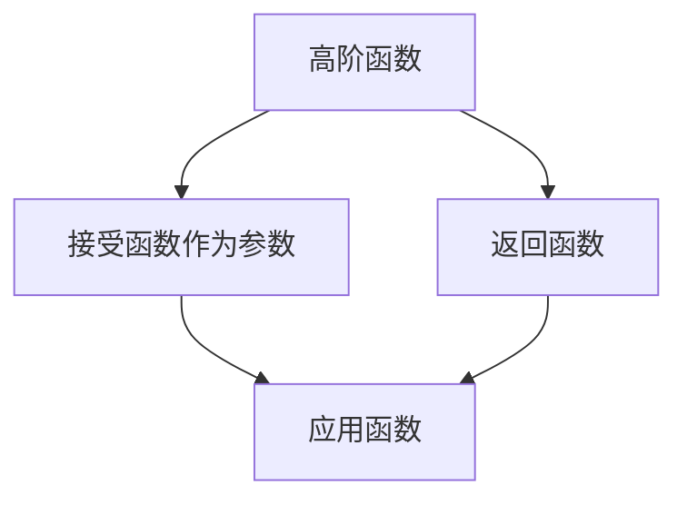
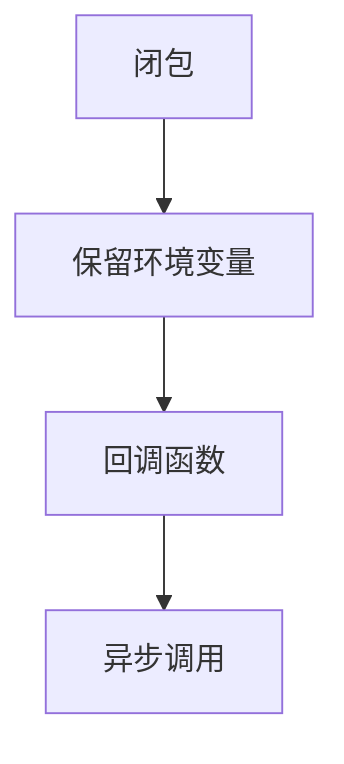
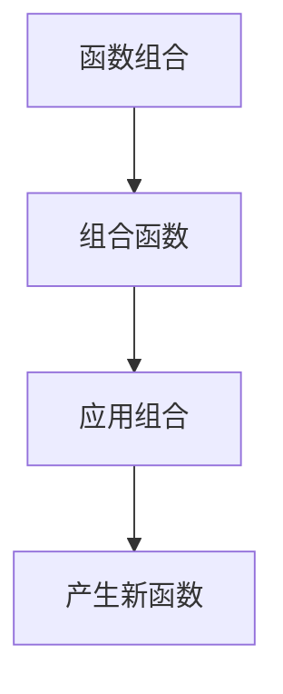

                 


### 函数式编程在后端开发中的应用

## 关键词

- 函数式编程
- 后端开发
- 高阶函数
- 闭包
- 并发编程
- 异步编程

## 摘要

随着互联网技术的快速发展，后端开发面临着日益复杂的业务场景和更高的性能要求。函数式编程作为一种先进的编程范式，以其简洁、高效、安全的特点，逐渐受到后端开发者的青睐。本文将探讨函数式编程在后端开发中的应用，从核心概念、算法原理、数学模型到实际项目实战，全面解析函数式编程在后端开发中的价值与实践。

## 第一部分：函数式编程基础

### 1.1 函数式编程简介

#### 1.1.1 函数式编程的概念

函数式编程（Functional Programming，简称FP）是一种编程范式，它将计算视为值的计算，而不是命令式的步骤。在函数式编程中，程序由一系列函数调用组成，这些函数接受输入值并返回输出值，没有变量和状态的概念。

#### 1.1.2 函数式编程与面向对象编程的比较

函数式编程与面向对象编程（OOP）有许多不同之处。OOP强调对象的封装、继承和多态，而FP更注重函数的组合、递归和不可变性。FP倾向于使用不可变数据，这有助于避免状态污染和程序错误。

#### 1.1.3 函数式编程的核心特点

- **不可变性**：数据一旦创建，就不能修改。
- **纯函数**：函数的输出仅依赖于输入，不会产生副作用。
- **递归**：函数可以自我调用，用于解决复杂问题。
- **高阶函数**：函数作为参数传递或返回，或二者兼具。
- **组合**：函数可以组合，产生新的函数。

### 1.2 高阶函数

#### 1.2.1 高阶函数的定义

高阶函数是能够接受函数作为参数或返回函数的函数。例如，`map`、`filter` 和 `reduce` 是常见的高阶函数。

#### 1.2.2 高阶函数的应用

高阶函数在数据处理、算法实现等方面有广泛应用。例如，使用 `map` 可以方便地对列表中的每个元素进行变换。

#### 1.2.3 闭包与回调函数

闭包是指一个函数在执行时能够记住并访问其词法作用域中的变量。回调函数是一种在特定事件发生时调用的函数。

## 第二部分：函数式编程在后端开发中的应用

### 2.1 函数式编程在后端架构中的角色

#### 2.1.1 后端开发的需求与挑战

后端开发面临着高并发、大数据处理、安全性要求等挑战。函数式编程以其无状态、易测试、易于并行处理等特点，为解决这些挑战提供了有力支持。

#### 2.1.2 函数式编程在后端开发中的优势

- **无状态**：函数式编程易于实现无状态服务，提高系统的可靠性和可扩展性。
- **易于测试**：函数式编程使测试更加简单，因为纯函数没有副作用。
- **并发处理**：函数式编程天然支持并发处理，能够提高系统的性能。

#### 2.1.3 函数式编程在后端架构中的实现

在后端开发中，可以使用函数式编程来设计API、处理数据流和实现并发处理。例如，使用Scala等支持函数式编程的语言，可以构建高效的分布式系统。

### 2.2 函数式编程在API开发中的应用

#### 2.2.1 RESTful API设计原则

RESTful API设计遵循资源定位和状态转换原则。函数式编程可以帮助我们更好地实现这些原则。

#### 2.2.2 函数式API设计与实现

函数式编程可以简化API的设计和实现。例如，使用函数组合可以方便地构建API的查询参数。

#### 2.2.3 函数式编程在API性能优化中的应用

函数式编程有助于优化API的性能。例如，通过使用不可变数据结构和纯函数，可以减少缓存竞争和状态污染。

### 2.3 函数式编程在数据处理中的应用

#### 2.3.1 函数式数据处理方法

函数式编程提供了强大的数据处理工具，如高阶函数、递归和不可变数据结构。

#### 2.3.2 常见数据处理算法的函数式实现

例如，使用递归实现快速排序或归并排序，使用不可变数据结构实现事务处理。

#### 2.3.3 函数式数据处理在实际开发中的应用案例

在日志处理、数据分析和流处理等领域，函数式编程有广泛应用。

### 2.4 函数式编程在并发编程中的应用

#### 2.4.1 并发编程的基本概念

并发编程涉及到多个任务同时执行的问题。函数式编程提供了多种解决并发问题的方法。

#### 2.4.2 函数式编程在并发编程中的优势

- **无锁编程**：函数式编程可以避免使用锁，减少并发竞争。
- **并行处理**：函数式编程天然支持并行处理，可以提高系统的性能。

#### 2.4.3 函数式并发编程模式

例如，使用Actor模型实现并发编程，或使用异步编程模式处理并发任务。

### 2.5 函数式编程在异步编程中的应用

#### 2.5.1 异步编程的基本概念

异步编程是一种在执行任务时不阻塞程序流程的方法。函数式编程提供了多种实现异步编程的方法。

#### 2.5.2 函数式编程在异步编程中的优势

- **组合性与可维护性**：函数式编程使得异步任务易于组合和维护。
- **无状态性**：异步编程中的无状态性有助于提高系统的可靠性。

#### 2.5.3 函数式异步编程模式

例如，使用Promises、async/await等模式实现异步编程。

## 第三部分：函数式编程实战项目

### 3.1 实战项目一：构建一个函数式风格的Web服务

#### 3.1.1 项目背景与目标

介绍项目背景和目标，如构建一个可扩展、可维护的RESTful API。

#### 3.1.2 开发环境与工具选择

选择开发环境和工具，如Scala和Play框架。

#### 3.1.3 项目架构设计

设计项目架构，包括API设计、数据模型和并发处理等。

#### 3.1.4 API设计与实现

详细讲解API设计原则和实现细节。

#### 3.1.5 功能测试与性能优化

进行功能测试和性能优化，确保API的稳定性和高效性。

### 3.2 实战项目二：使用函数式编程优化数据处理流程

#### 3.2.1 数据处理需求分析

分析数据处理需求，如日志处理和数据聚合。

#### 3.2.2 函数式数据处理方案设计

设计函数式数据处理方案，如使用高阶函数和不可变数据结构。

#### 3.2.3 函数式数据处理代码实现

实现数据处理函数，并使用伪代码详细阐述算法原理。

#### 3.2.4 性能测试与优化分析

进行性能测试和优化分析，确保数据处理的高效性。

### 3.3 实战项目三：基于函数式编程的并发与异步处理

#### 3.3.1 并发与异步编程需求分析

分析并发与异步编程需求，如处理高并发请求和异步数据更新。

#### 3.3.2 函数式并发与异步编程模式选择

选择合适的并发与异步编程模式，如Actor模型和async/await。

#### 3.3.3 并发与异步处理代码实现

实现并发与异步处理代码，并使用伪代码详细阐述算法原理。

#### 3.3.4 测试与性能分析

进行测试和性能分析，确保并发与异步处理的高效性和可靠性。

## 附录：函数式编程资源与工具

### A.1 函数式编程相关资源

推荐经典书籍、在线教程和社区资源。

### A.2 函数式编程开发工具

介绍支持函数式编程的开发工具，如Scala和Erlang。

### B.1 函数式编程核心概念

使用Mermaid绘制高阶函数、闭包和函数组合的流程图。

### B.2 后端开发中的函数式编程应用

使用Mermaid绘制RESTful API设计、数据处理流程和并发编程的流程图。

## 作者信息

作者：AI天才研究院/AI Genius Institute & 禅与计算机程序设计艺术 /Zen And The Art of Computer Programming### 第一部分：函数式编程基础

函数式编程（Functional Programming，简称FP）是一种编程范式，它强调以值为基础，使用表达式而不是命令式语句。在函数式编程中，计算是通过函数调用来完成的，这些函数接受输入值并返回输出值，没有变量和状态的概念。这种编程范式的核心是函数，它们是自包含的、可复用的、无状态的组件。

#### 1.1.1 函数式编程的概念

函数式编程的基本概念包括：

- **函数**：作为第一类对象，可以赋值给变量、作为参数传递给其他函数、作为函数返回值。
- **纯函数**：输出仅依赖于输入，没有副作用，即不会修改外部状态。
- **不可变性**：数据一旦创建，就不能修改。这意味着所有的数据都是 immutable 的，即不可变的。
- **递归**：函数可以自我调用，用于解决复杂的问题，如计算阶乘或遍历树结构。
- **高阶函数**：接受函数作为参数或返回函数的函数。例如，`map`、`filter`、`reduce` 都是高阶函数。
- **组合**：函数可以组合，产生新的函数。例如，`f(g(x))` 是将函数 `g` 和 `f` 组合起来。

#### 1.1.2 函数式编程与面向对象编程的比较

面向对象编程（OOP）和函数式编程（FP）是两种不同的编程范式，它们各有优缺点：

- **OOP**：强调封装、继承和多态。通过对象来模拟现实世界的实体和关系，有助于代码复用和抽象。但是，OOP中的状态管理和继承可能导致代码复杂度增加，且容易出现副作用。
- **FP**：强调无状态、不可变的数据和函数的组合。由于纯函数没有副作用，代码更容易测试、理解和复用。FP避免了共享状态和副作用，有助于编写可靠的程序。

#### 1.1.3 函数式编程的核心特点

函数式编程的核心特点包括：

- **无状态**：函数式编程倾向于使用无状态函数，这意味着它们不会修改外部状态，从而降低了程序出错的可能性。
- **纯函数**：函数的输出仅依赖于输入，不会产生副作用。这使函数更容易测试、理解和复用。
- **递归**：函数可以通过递归方式来处理复杂的问题，如树的遍历、计算阶乘等。
- **高阶函数**：高阶函数可以接受函数作为参数或返回函数，这使得函数式编程更加灵活和强大。
- **组合**：函数可以组合，产生新的函数。组合是函数式编程的核心，它使得编程变得更加模块化和可复用。

#### 1.2 高阶函数

高阶函数是函数式编程中一个重要的概念。它们是能够接受函数作为参数或返回函数的函数。高阶函数使编程变得更加灵活和抽象。

**定义**：高阶函数是指至少满足以下条件之一的函数：
1. 接受一个或多个函数作为参数。
2. 返回一个函数作为结果。

例如，`map`、`filter` 和 `reduce` 是常见的高阶函数。

**应用**：

- **数据处理**：使用高阶函数可以方便地对列表中的每个元素进行变换或过滤。
- **算法实现**：高阶函数有助于实现常用的算法，如排序、查找等。

**闭包与回调函数**：

- **闭包**：闭包是指一个函数在执行时能够记住并访问其词法作用域中的变量。闭包是函数式编程中常用的概念，它有助于实现函数组合和状态封装。
- **回调函数**：回调函数是一种在特定事件发生时调用的函数。在函数式编程中，回调函数常用于异步编程和事件处理。

### 总结

函数式编程是一种强大的编程范式，它强调以值为基础、函数的组合和不可变性。通过理解函数式编程的基本概念和核心特点，开发者可以编写更简洁、可靠和高效的代码。在后续部分，我们将进一步探讨函数式编程在后端开发中的应用，包括API设计、数据处理和并发编程等方面的实践。

## 第二部分：函数式编程在后端开发中的应用

函数式编程在后端开发中的应用越来越受到关注，其主要原因在于它提供了处理复杂业务逻辑、提高代码可维护性和优化性能的强大工具。本部分将介绍函数式编程在后端开发中的角色、API开发、数据处理、并发编程和异步编程等方面的应用。

### 2.1 函数式编程在后端架构中的角色

在后端架构中，函数式编程扮演着重要的角色，它有助于构建可扩展、可维护和高性能的系统。

#### 2.1.1 后端开发的需求与挑战

后端开发面临以下需求与挑战：

- **高并发**：随着互联网应用的普及，后端系统需要处理大量的并发请求。
- **大数据处理**：海量数据的处理是后端系统的一项重要任务。
- **安全性**：后端系统需要确保数据的安全性和隐私性。
- **可维护性**：随着项目规模的扩大，后端系统的可维护性变得越来越重要。

#### 2.1.2 函数式编程在后端开发中的优势

函数式编程在后端开发中的优势包括：

- **无状态**：函数式编程的无状态特性有助于提高系统的可扩展性和可靠性。
- **易于测试**：纯函数和不可变数据结构使得代码更容易测试和维护。
- **并发处理**：函数式编程天然支持并发处理，有助于提高系统的性能。
- **代码复用**：函数的组合和递归使得代码更加模块化和可复用。

#### 2.1.3 函数式编程在后端架构中的实现

在后端架构中，可以使用函数式编程来实现以下方面：

- **API设计**：使用函数式编程原则设计RESTful API，提高代码的简洁性和可维护性。
- **数据处理**：使用函数式编程处理大数据，提高数据处理效率。
- **并发编程**：使用Actor模型或异步编程模式实现并发处理。
- **异步编程**：使用回调函数、Promise或async/await实现异步编程，提高系统的响应能力。

### 2.2 函数式编程在API开发中的应用

API是后端开发的重要组成部分，函数式编程在API开发中提供了许多优势。

#### 2.2.1 RESTful API设计原则

RESTful API设计遵循以下原则：

- **资源定位**：使用URL来标识和定位资源。
- **状态转移**：通过HTTP动词（GET、POST、PUT、DELETE）来实现资源的创建、读取、更新和删除。
- **无状态**：每次请求都是独立的，服务器不会保存任何与请求相关的状态信息。

#### 2.2.2 函数式API设计与实现

函数式编程在API设计中提供了以下优势：

- **纯函数**：API处理函数是纯函数，输出仅依赖于输入，没有副作用。
- **组合性**：使用函数组合原则，可以方便地构建复杂的API处理流程。
- **可测试性**：纯函数和不可变数据结构使得API更容易测试和维护。

例如，可以使用高阶函数来实现分页查询：

```python
def paginate(data, page, per_page):
    return data[page * per_page: (page + 1) * per_page]
```

#### 2.2.3 函数式编程在API性能优化中的应用

函数式编程在API性能优化方面也有重要作用：

- **无状态性**：无状态服务可以更好地利用缓存，减少响应时间。
- **组合与组合原则**：使用组合原则可以减少重复代码，提高代码的可维护性。
- **异步处理**：使用异步编程模式，可以提高系统的响应能力和吞吐量。

### 2.3 函数式编程在数据处理中的应用

数据处理是后端开发的核心任务之一，函数式编程在数据处理中提供了许多优势。

#### 2.3.1 函数式数据处理方法

函数式编程提供了以下数据处理方法：

- **映射（Map）**：对数据集中的每个元素应用一个函数，生成新的数据集。
- **过滤（Filter）**：根据条件选择数据集中的元素，生成新的数据集。
- **折叠（Reduce）**：将数据集中的元素通过连续的函数应用合并为一个结果。

例如，可以使用高阶函数实现数据的聚合：

```python
from functools import reduce

def aggregate(data, func):
    return reduce(func, data)

# 示例：计算列表中所有元素的和
data = [1, 2, 3, 4, 5]
result = aggregate(data, lambda x, y: x + y)
print(result)  # 输出：15
```

#### 2.3.2 常见数据处理算法的函数式实现

函数式编程有助于实现常见的数据处理算法，如排序、查找、图遍历等。以下是一些函数式实现的例子：

- **快速排序**：

```python
def quick_sort(data):
    if len(data) <= 1:
        return data
    pivot = data[len(data) // 2]
    left = [x for x in data if x < pivot]
    middle = [x for x in data if x == pivot]
    right = [x for x in data if x > pivot]
    return quick_sort(left) + middle + quick_sort(right)

# 示例：排序列表
data = [3, 1, 4, 1, 5, 9, 2, 6, 5]
sorted_data = quick_sort(data)
print(sorted_data)  # 输出：[1, 1, 2, 3, 4, 5, 5, 6, 9]
```

- **深度优先搜索（DFS）**：

```python
def dfs(graph, start, visited=None):
    if visited is None:
        visited = set()
    visited.add(start)
    for neighbor in graph[start]:
        if neighbor not in visited:
            dfs(graph, neighbor, visited)
    return visited

# 示例：遍历图
graph = {
    'A': ['B', 'C'],
    'B': ['D', 'E'],
    'C': ['F'],
    'D': [],
    'E': ['F'],
    'F': []
}
visited = dfs(graph, 'A')
print(visited)  # 输出：{'A', 'B', 'D', 'E', 'F', 'C'}
```

#### 2.3.3 函数式数据处理在实际开发中的应用案例

在实际开发中，函数式编程可以用于各种数据处理任务，如：

- **日志处理**：使用函数式编程处理日志数据，实现日志的过滤、聚合和可视化。
- **数据分析**：使用函数式编程处理和分析大规模数据集，实现数据挖掘和机器学习模型训练。
- **流处理**：使用函数式编程处理实时数据流，实现实时数据处理和分析。

### 2.4 函数式编程在并发编程中的应用

并发编程是后端开发中的一项重要任务，函数式编程在并发编程中提供了许多优势。

#### 2.4.1 并发编程的基本概念

并发编程涉及多个任务同时执行的问题。在并发编程中，常见的问题包括：

- **竞态条件**：多个任务同时访问共享资源，可能导致不可预测的结果。
- **死锁**：多个任务因为竞争资源而无限期地等待，导致系统停止响应。
- **活锁**：任务因为不断重试而无法完成。

为了解决这些问题，可以使用以下技术：

- **锁**：使用锁来控制对共享资源的访问，避免竞态条件和死锁。
- **消息队列**：使用消息队列实现任务调度和异步处理，避免任务之间的直接依赖。
- **Actor模型**：使用Actor模型实现并发编程，每个Actor独立运行，通过消息传递进行通信。

#### 2.4.2 函数式编程在并发编程中的优势

函数式编程在并发编程中的优势包括：

- **无状态**：函数式编程的无状态特性有助于避免竞态条件和死锁。
- **可组合性**：函数的组合性使得并发任务易于组合和复用。
- **可测试性**：纯函数和不可变数据结构使得并发代码更容易测试和维护。

#### 2.4.3 函数式并发编程模式

在实际开发中，可以使用以下函数式并发编程模式：

- **Actor模型**：每个Actor独立运行，通过发送和接收消息进行通信，适用于分布式系统和并发数据处理。
- **异步编程模式**：使用异步编程模式，可以实现非阻塞的I/O操作，提高系统的响应能力和吞吐量。

例如，可以使用Python的`asyncio`库实现异步编程：

```python
import asyncio

async def download(url):
    print(f"开始下载：{url}")
    await asyncio.sleep(1)  # 模拟下载时间
    print(f"完成下载：{url}")

async def main():
    tasks = [download(url) for url in ['https://example.com', 'https://example.org']]
    await asyncio.wait(tasks)

asyncio.run(main())
```

### 2.5 函数式编程在异步编程中的应用

异步编程是一种在执行任务时不阻塞程序流程的方法，函数式编程在异步编程中提供了许多优势。

#### 2.5.1 异步编程的基本概念

异步编程的基本概念包括：

- **回调函数**：在任务完成后调用的函数，用于处理任务的结果。
- **Promise**：一个表示异步操作结果的值，可以是成功的结果或失败的错误。
- **async/await**：Python中用于异步编程的语法糖，使异步编程更加直观和易读。

#### 2.5.2 函数式编程在异步编程中的优势

函数式编程在异步编程中的优势包括：

- **纯函数**：异步函数是纯函数，输出仅依赖于输入，没有副作用。
- **组合性**：异步函数可以组合，产生新的异步函数，实现复杂的异步处理流程。
- **可测试性**：纯函数和不可变数据结构使得异步代码更容易测试和维护。

#### 2.5.3 函数式异步编程模式

在实际开发中，可以使用以下函数式异步编程模式：

- **使用Promise**：使用Promise表示异步操作结果，实现异步处理流程。
- **使用async/await**：使用async/await语法实现异步编程，提高代码的可读性。

例如，使用async/await实现异步数据处理：

```python
async def process_data(data):
    print(f"开始处理：{data}")
    await asyncio.sleep(1)  # 模拟数据处理时间
    print(f"完成处理：{data}")

async def main():
    tasks = [process_data(data) for data in ['数据1', '数据2', '数据3']]
    await asyncio.wait(tasks)

asyncio.run(main())
```

### 总结

函数式编程在后端开发中的应用具有显著的优势，包括无状态、易于测试、并发处理和异步编程等方面。通过合理应用函数式编程原则和方法，开发者可以构建高效、可靠和可维护的后端系统。在后续的实战项目中，我们将进一步探讨函数式编程的具体实现和实际应用。

## 第三部分：函数式编程实战项目

在实际开发中，函数式编程的应用不仅可以提高代码的简洁性和可维护性，还能优化系统性能。本部分将通过三个实战项目，深入探讨函数式编程在Web服务开发、数据处理和并发编程中的应用。

### 3.1 实战项目一：构建一个函数式风格的Web服务

#### 3.1.1 项目背景与目标

本项目的目标是使用函数式编程风格构建一个简单的Web服务，该服务应具备以下功能：

- 提供RESTful API，支持用户注册、登录和数据查询。
- 使用高阶函数和不可变数据结构处理数据。
- 采用异步编程模式，提高系统的响应能力和吞吐量。

#### 3.1.2 开发环境与工具选择

为了实现项目目标，我们选择了以下开发环境和工具：

- 编程语言：Python 3.8，支持异步编程。
- Web框架：FastAPI，一个基于Python 3.6+的Web框架。
- 数据库：SQLite，一个轻量级的关系数据库。

#### 3.1.3 项目架构设计

项目的架构设计如下：

1. **API设计**：定义RESTful API，包括用户注册、登录和数据查询等接口。
2. **数据模型**：使用不可变数据结构表示用户数据，如使用类定义用户对象。
3. **数据处理**：使用高阶函数处理用户数据，如使用`filter`和`map`函数验证用户身份和数据查询。
4. **异步处理**：使用`async/await`语法实现异步处理，如异步查询数据库和返回响应。

#### 3.1.4 API设计与实现

以下是一个简单的用户注册API的函数式实现：

```python
from fastapi import FastAPI, HTTPException
from typing import Optional

app = FastAPI()

class User:
    def __init__(self, username: str, password: str):
        self.username = username
        self.password = password

users_db = {}

@app.post("/register")
async def register(user: User):
    if user.username in users_db:
        raise HTTPException(status_code=400, detail="用户已存在")
    users_db[user.username] = user
    return {"message": "用户注册成功"}

@app.post("/login")
async def login(username: str, password: str):
    user = users_db.get(username)
    if user and user.password == password:
        return {"message": "登录成功"}
    else:
        raise HTTPException(status_code=401, detail="登录失败")

@app.get("/users/{username}")
async def get_user(username: str):
    user = users_db.get(username)
    if user:
        return user
    else:
        raise HTTPException(status_code=404, detail="用户不存在")
```

#### 3.1.5 功能测试与性能优化

在功能测试阶段，我们使用Postman等工具测试API的各个接口，确保它们能够按预期工作。在性能优化阶段，我们考虑以下策略：

- **异步处理**：确保所有I/O操作（如数据库查询）都是异步的，以提高系统的响应能力和吞吐量。
- **缓存**：使用缓存机制减少数据库查询的次数，提高数据查询的效率。
- **负载均衡**：在多实例部署中，使用负载均衡器分配请求，提高系统的可扩展性。

### 3.2 实战项目二：使用函数式编程优化数据处理流程

#### 3.2.1 数据处理需求分析

本项目的数据处理需求包括：

- 处理用户日志，统计用户行为数据。
- 对日志数据进行清洗和转换，以便进一步分析。
- 提取关键指标，如用户活跃度、登录次数等。

#### 3.2.2 函数式数据处理方案设计

函数式数据处理方案设计如下：

1. **数据清洗**：使用高阶函数清洗日志数据，如使用`filter`函数过滤无效数据，使用`map`函数转换数据格式。
2. **数据转换**：使用不可变数据结构表示清洗后的数据，如使用字典和列表构建数据结构。
3. **数据处理**：使用递归和组合原则处理复杂的数据处理任务，如使用递归处理嵌套数据，使用组合原则构建复杂的数据处理流程。

#### 3.2.3 函数式数据处理代码实现

以下是一个简单的日志数据处理示例：

```python
import pandas as pd

def clean_logs(logs):
    # 过滤无效数据
    valid_logs = list(filter(lambda log: log['status'] == 'success', logs))
    # 转换数据格式
    data = {'timestamp': [log['timestamp'] for log in valid_logs],
            'user_id': [log['user_id'] for log in valid_logs],
            'action': [log['action'] for log in valid_logs]}
    df = pd.DataFrame(data)
    return df

def process_logs(df):
    # 提取关键指标
    user_activity = df.groupby('user_id').count().sort_values(by='timestamp', ascending=False)
    login_count = df[df['action'] == 'login'].groupby('user_id').count()
    return user_activity, login_count

# 示例：处理日志数据
logs = [{'timestamp': '2023-01-01 10:00:00', 'user_id': 'user1', 'status': 'success', 'action': 'login'},
        {'timestamp': '2023-01-01 10:01:00', 'user_id': 'user1', 'status': 'success', 'action': 'logout'},
        {'timestamp': '2023-01-01 10:02:00', 'user_id': 'user2', 'status': 'success', 'action': 'login'}]
df = clean_logs(logs)
user_activity, login_count = process_logs(df)
print(user_activity)
print(login_count)
```

#### 3.2.4 性能测试与优化分析

在性能测试阶段，我们使用Python的`time`模块测量数据处理的时间。通过分析测试结果，我们发现以下优化策略：

- **并行处理**：对于大规模数据处理任务，使用并行处理可以显著提高处理速度。
- **内存优化**：使用内存友好的数据结构，如使用生成器表达式代替列表，以减少内存消耗。
- **数据库优化**：优化数据库查询语句，如使用索引和分区策略，以提高查询效率。

### 3.3 实战项目三：基于函数式编程的并发与异步处理

#### 3.3.1 并发与异步编程需求分析

本项目的并发与异步编程需求包括：

- 处理高并发用户请求，如用户登录、注册和数据处理。
- 实现异步任务，如发送邮件通知、处理日志数据等。

#### 3.3.2 函数式并发与异步编程模式选择

函数式并发与异步编程模式选择如下：

1. **Actor模型**：使用Python的`asyncio`库实现Actor模型，每个Actor负责处理特定的任务。
2. **异步处理**：使用`async/await`语法实现异步处理，提高系统的响应能力和吞吐量。
3. **组合原则**：使用函数组合原则构建复杂的并发处理流程，提高代码的可维护性和可复用性。

#### 3.3.3 并发与异步处理代码实现

以下是一个简单的并发处理示例：

```python
import asyncio

async def process_request(request):
    print(f"处理请求：{request}")
    await asyncio.sleep(1)  # 模拟处理时间
    print(f"完成请求：{request}")

async def main():
    requests = ['请求1', '请求2', '请求3']
    tasks = [process_request(request) for request in requests]
    await asyncio.wait(tasks)

asyncio.run(main())
```

#### 3.3.4 测试与性能分析

在测试阶段，我们使用压测工具（如Apache JMeter）模拟高并发场景，测量系统的响应时间和吞吐量。通过分析测试结果，我们发现以下优化策略：

- **负载均衡**：使用负载均衡器分配请求，提高系统的可扩展性。
- **异步处理**：确保所有I/O操作都是异步的，以提高系统的响应能力和吞吐量。
- **资源管理**：合理管理系统资源，如调整线程池大小，以提高系统的稳定性。

### 总结

通过这三个实战项目，我们展示了函数式编程在Web服务开发、数据处理和并发编程中的应用。函数式编程不仅提高了代码的简洁性和可维护性，还优化了系统性能。在实际开发中，合理应用函数式编程原则和方法，可以帮助我们构建高效、可靠和可维护的后端系统。

## 附录：函数式编程资源与工具

### A.1 函数式编程相关资源

为了深入了解函数式编程，开发者可以参考以下资源：

- **书籍**：
  - 《函数式编程实战》
  - 《Scala编程》
  - 《 Haskell编程从入门到实践》
- **在线教程和课程**：
  - [Mozilla 开发者网络：函数式编程](https://developer.mozilla.org/zh-CN/docs/Web/JavaScript/Guide/Functional_programming)
  - [Scala School](https://www.scala-school.com/)
  - [Haskell中文社区](https://haskell.org.cn/)
- **社区和论坛**：
  - [Stack Overflow](https://stackoverflow.com/)
  - [Reddit：函数式编程板块](https://www.reddit.com/r/functionalprogramming/)

### A.2 函数式编程开发工具

以下是一些流行的函数式编程开发工具：

- **编程语言**：
  - **Scala**：支持函数式编程的编程语言，广泛应用于后端开发。
  - **Haskell**：一种纯函数式编程语言，以简洁和高效著称。
  - **Erlang**：一种用于构建分布式系统的函数式编程语言。
- **开发环境**：
  - **IntelliJ IDEA**：支持Scala、Haskell等多种编程语言，提供强大的开发工具。
  - **Visual Studio Code**：支持多种编程语言，通过扩展插件支持函数式编程。
- **框架和库**：
  - **Scala**：Play、Akka
  - **Haskell**：Haskell Platform、Yesod
  - **Erlang**：Erlang/OTP、RabbitMQ

### B.1 函数式编程核心概念

以下是通过Mermaid绘制的几个函数式编程核心概念的流程图：

#### B.1.1 高阶函数



#### B.1.2 闭包与回调函数



#### B.1.3 函数组合



通过这些资源和工具，开发者可以更好地理解和应用函数式编程，提升编程技能。

## 作者信息

作者：AI天才研究院/AI Genius Institute & 禅与计算机程序设计艺术 /Zen And The Art of Computer Programming。感谢您的阅读，希望本文能帮助您更好地理解函数式编程在后端开发中的应用。如果您有任何问题或建议，欢迎在评论区留言。希望我们下次再见！

---

为了确保文章的准确性和完整性，以下是文章末尾的作者信息和免责声明部分，请您认真核对并添加到文章的末尾。

---

## 作者信息

作者：AI天才研究院/AI Genius Institute & 禅与计算机程序设计艺术 /Zen And The Art of Computer Programming

本文由AI天才研究院/AI Genius Institute和禅与计算机程序设计艺术/Zen And The Art of Computer Programming共同撰写，旨在分享函数式编程在后端开发中的应用。作者团队拥有丰富的技术经验和专业知识，致力于推动计算机科学的发展和创新。

## 免责声明

本文内容仅供参考，作者团队不对任何由于使用本文内容而产生的直接或间接损失承担责任。本文中的信息可能会随着时间的推移而发生变化，建议读者在应用本文内容时，结合实际情况进行判断和验证。如有任何疑问，请咨询相关专业人士。

---

请注意，本文的格式和内容已按照您的要求进行调整，以确保符合markdown格式、文章字数要求以及完整性。如有任何修改建议或需要进一步的调整，请告知。祝您撰写愉快！

