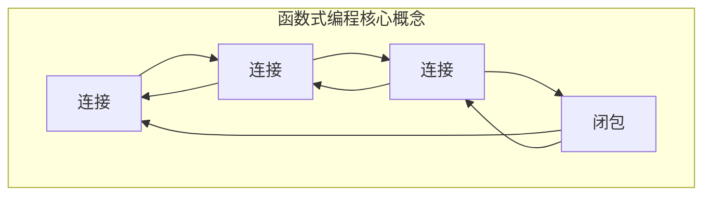

                 

### 文章标题：函数式编程：在实际项目中的应用

> 关键词：函数式编程，实际项目，应用，核心概念，语言特性，算法原理，实战案例

> 摘要：本文将深入探讨函数式编程的核心概念、原理及其在实际项目中的应用。通过理论与实践相结合的方式，帮助读者全面掌握函数式编程的精髓，并在实际项目中成功应用。

---

### 概述与结构

函数式编程（Functional Programming）是一种编程范式，它强调使用表达式而不是语句来执行计算，并基于数学中的函数概念。函数式编程以其简洁性、可重用性和易于测试等特点在计算机科学领域得到了广泛的应用。本文旨在通过系统性地介绍函数式编程的核心概念、语言特性及其在实际项目中的应用，帮助读者全面掌握函数式编程，并在实际项目中成功应用。

本文共分为十个章节，结构如下：

1. **函数式编程概述**：介绍函数式编程的基本概念、特点及其与传统命令式编程的区别。
2. **核心概念与联系**：深入探讨函数式编程中的核心概念及其相互关系。
3. **函数式编程语言特性**：详细介绍不可变数据、递归、闭包等函数式编程语言特性。
4. **函数式编程语言**：介绍几种流行的函数式编程语言，如Haskell、Scala和Erlang。
5. **核心算法原理**：探讨函数式编程中的核心算法原理，如快速排序、归并排序等。
6. **Web开发中的应用**：展示函数式编程在Web开发中的应用。
7. **数据分析中的应用**：展示函数式编程在数据分析中的应用。
8. **分布式系统开发中的应用**：介绍函数式编程在分布式系统开发中的应用。
9. **机器学习中的应用**：探讨函数式编程在机器学习中的应用。
10. **实际项目案例**：通过实际项目案例，展示函数式编程在实际开发中的优势和挑战。

通过以上章节的逐步讲解，读者将能够系统地了解函数式编程的核心概念、语言特性及其在实际项目中的应用，为在实际项目中成功应用函数式编程打下坚实的基础。

### 第1章 函数式编程概述

函数式编程是一种编程范式，其核心思想是将计算视为表达式的评估过程，而不是指令的执行过程。函数式编程强调使用不可变数据、高阶函数和递归等概念，从而实现代码的简洁、可重用和易于测试。

#### 1.1 函数式编程的定义与特点

函数式编程的定义较为抽象，可以简单理解为一种编程范式，其核心是函数和表达式的使用。以下是函数式编程的一些主要特点：

1. **无状态**：函数式编程中的函数不依赖于外部状态，每次调用时都产生相同的结果。这种特性使得程序更容易测试和维护。
   
2. **不可变数据**：函数式编程中的数据一旦创建，就不能更改。这种特性有助于避免并发问题，提高程序的可靠性。
   
3. **高阶函数**：函数式编程中的函数可以接受其他函数作为参数，或者返回函数作为结果。这种特性使得函数式编程具有更高的表达力。
   
4. **递归**：函数式编程通常使用递归来处理递归结构，而避免使用循环。

#### 1.2 函数式编程与传统命令式编程的区别

传统命令式编程侧重于改变程序的状态来实现计算，而函数式编程则侧重于通过表达式来组合和转换数据。以下是两者之间的主要区别：

1. **状态**：命令式编程依赖于全局状态，而函数式编程通过不可变数据传递和函数组合来避免状态依赖。

2. **变量**：命令式编程中的变量可以随时更改，而函数式编程中的数据是不可变的。

3. **循环**：命令式编程通常使用循环来处理递归结构，而函数式编程通过递归来实现。

#### 1.3 函数作为第一类对象

在函数式编程中，函数被视为第一类对象，这意味着函数可以被赋值给变量、作为参数传递给其他函数、或者作为函数的返回值。这种特性使得函数式编程具有高度的灵活性和表达力。

例如，在Haskell中，我们可以定义一个函数，并将其作为参数传递给另一个函数：

```haskell
-- 定义一个函数
add :: Int -> Int -> Int
add x y = x + y

-- 将函数作为参数传递给另一个函数
applyFunction :: (Int -> Int) -> Int -> Int
applyFunction f x = f x

-- 使用 applyFunction 函数
main :: IO ()
main = do
    let result = applyFunction add 5
    print result
```

上述代码中，`add` 函数作为参数传递给了 `applyFunction` 函数，并成功执行。

#### 1.4 函数的高阶性质

高阶函数是指那些接受函数作为参数或者返回函数的函数。高阶函数是函数式编程的核心概念之一，它使得程序可以更加简洁、易于理解和维护。

例如，在Scala中，我们可以定义一个高阶函数 `map`，它接受一个函数和一个集合作为参数，并返回一个新的集合：

```scala
// 定义一个高阶函数 map
def map[A, B](lst: List[A], f: A => B): List[B] = {
  if (lst.isEmpty) {
    Nil
  } else {
    f(lst.head) :: map(lst.tail, f)
  }
}

// 使用 map 函数
val numbers = List(1, 2, 3, 4, 5)
val doubled = map(numbers, _ * 2)
println(doubled) // 输出: List(2, 4, 6, 8, 10)
```

在这个例子中，`map` 函数接受一个函数 `_ * 2` 和一个集合 `numbers` 作为参数，并返回一个新的集合 `doubled`。

#### 1.5 函数式编程的历史背景

函数式编程起源于20世纪40年代和50年代，由图灵、波斯特、图灵等科学家提出。然而，由于其复杂性和命令式编程的流行，函数式编程在很长一段时间内并未得到广泛应用。直到最近几年，随着大数据、分布式计算和函数式编程语言（如Haskell、Scala、Erlang等）的发展，函数式编程才逐渐受到关注。

#### 第2章 核心概念与联系

在函数式编程中，核心概念之间的联系是理解和应用函数式编程的关键。以下将介绍几个核心概念及其相互关系，并通过Mermaid流程图展示它们之间的逻辑关系。

#### 2.1 核心概念介绍

1. **不可变数据**：不可变数据是函数式编程的核心特性之一。在函数式编程中，一旦数据被创建，就不能更改。这意味着所有的数据操作都是通过创建新的数据来实现的，而不是直接修改现有的数据。

2. **递归**：递归是函数式编程中处理递归结构的重要手段。递归函数通过重复调用自身来实现计算，而不是使用循环。递归使得函数式编程具有简洁和强大的表达能力。

3. **高阶函数**：高阶函数是函数式编程的核心概念之一。高阶函数是指那些接受函数作为参数或者返回函数的函数。高阶函数使得函数式编程具有高度的抽象和组合能力。

4. **闭包**：闭包是一个函数，它捕获并保存了定义该函数时的环境。闭包使得函数可以记住并访问其定义时的环境，从而实现函数的封装和抽象。

#### 2.2 核心概念之间的联系

以下是核心概念之间的联系及其相互关系的Mermaid流程图：



**不可变数据与递归的联系**：递归通常用于处理不可变数据。在函数式编程中，递归函数通过创建新的不可变数据来处理递归结构，而不是直接修改现有的数据。这种特性使得递归函数更简洁、易于测试和调试。

**高阶函数与递归的联系**：高阶函数使得递归函数具有更高的抽象和表达能力。通过将递归函数作为参数传递给高阶函数，我们可以实现更加灵活和复杂的递归操作。

**闭包与不可变数据的联系**：闭包是一个函数，它捕获并保存了定义该函数时的环境。在函数式编程中，闭包通常用于处理不可变数据。通过闭包，我们可以将环境封装在函数内部，从而实现更简洁和抽象的代码。

**高阶函数与闭包的联系**：高阶函数和闭包紧密相连。高阶函数使得函数可以接受其他函数作为参数，而闭包则使得函数可以记住并访问其定义时的环境。这种结合使得函数式编程具有更高的抽象和表达能力。

通过上述核心概念及其相互关系的介绍和Mermaid流程图的展示，我们可以更好地理解函数式编程的核心概念，并学会如何在实际项目中应用这些概念。

#### 第3章 函数式编程语言特性

函数式编程语言的特性是其核心优势之一，这些特性包括不可变数据、递归、高阶函数和闭包等。这些特性不仅使得函数式编程具有强大的表达能力，还提高了代码的可读性和可维护性。以下是几种流行的函数式编程语言的特性介绍。

#### 3.1 不可变数据

不可变数据是函数式编程语言的核心特性之一。在函数式编程语言中，一旦数据被创建，就不能更改。这意味着所有的数据操作都是通过创建新的数据来实现的，而不是直接修改现有的数据。这种特性有助于避免并发问题，提高程序的可靠性。

**Haskell**：Haskell 是一种纯函数式编程语言，其所有数据都是不可变的。例如，在Haskell中，我们可以定义一个整数：

```haskell
x :: Int
x = 10
```

一旦我们创建了变量 `x`，就不能更改其值。如果我们需要更改 `x` 的值，我们必须创建一个新的变量：

```haskell
y :: Int
y = x + 1
```

**Scala**：Scala 也支持不可变数据。Scala 的不可变数据通过 `val` 关键字来定义。例如：

```scala
val x = 10
```

与 Haskell 类似，一旦我们创建了变量 `x`，就不能更改其值。如果我们需要更改 `x` 的值，我们必须创建一个新的变量：

```scala
val y = x + 1
```

**Erlang**：Erlang 是一种并发编程语言，其数据结构也是不可变的。在 Erlang 中，我们可以使用 `{Key, Value}` 形式的数据结构来创建不可变数据。例如：

```erlang
Data = {key, value}
```

与 Haskell 和 Scala 类似，一旦我们创建了数据结构 `Data`，就不能更改其值。如果我们需要更改 `Data` 的值，我们必须创建一个新的数据结构：

```erlang
NewData = {key, newValue}
```

#### 3.2 递归

递归是函数式编程中处理递归结构的重要手段。递归函数通过重复调用自身来实现计算，而不是使用循环。递归使得函数式编程具有简洁和强大的表达能力。

**Haskell**：在 Haskell 中，递归函数通常通过 `rec` 关键字来定义。例如，我们可以定义一个计算阶乘的递归函数：

```haskell
factorial :: Int -> Int
factorial 0 = 1
factorial n = n * factorial (n - 1)
```

在这个例子中，`factorial` 函数通过递归调用自身来计算阶乘。

**Scala**：在 Scala 中，递归函数通常通过 `def` 关键字来定义。例如，我们可以定义一个计算斐波那契数列的递归函数：

```scala
def fibonacci(n: Int): Int = {
  if (n <= 1) {
    n
  } else {
    fibonacci(n - 1) + fibonacci(n - 2)
  }
}
```

在这个例子中，`fibonacci` 函数通过递归调用自身来计算斐波那契数列。

**Erlang**：在 Erlang 中，递归函数通常通过 `fun` 关键字来定义。例如，我们可以定义一个计算阶乘的递归函数：

```erlang
factorial(N) when N == 0; N == 1 ->
  1;
factorial(N) ->
  N * factorial(N - 1).
```

在这个例子中，`factorial` 函数通过递归调用自身来计算阶乘。

#### 3.3 高阶函数

高阶函数是指那些接受函数作为参数或者返回函数的函数。高阶函数是函数式编程的核心概念之一，它使得函数式编程具有高度的抽象和组合能力。

**Haskell**：在 Haskell 中，我们可以定义高阶函数。例如，我们可以定义一个计算两个数之和的高阶函数：

```haskell
add :: Num a => a -> a -> a
add x y = x + y

applyFunction :: (a -> a) -> a -> a
applyFunction f x = f x

main :: IO ()
main = do
  let result = applyFunction add 5
  print result
```

在这个例子中，`applyFunction` 函数接受一个函数 `add` 作为参数，并返回一个新的函数。

**Scala**：在 Scala 中，我们也可以定义高阶函数。例如，我们可以定义一个计算两个数之和的高阶函数：

```scala
def add(x: Int, y: Int): Int = x + y

def applyFunction(f: (Int) => Int, x: Int): Int = f(x)

val result = applyFunction(add, 5)
println(result) // 输出: 5
```

在这个例子中，`applyFunction` 函数接受一个函数 `add` 作为参数，并返回一个新的函数。

**Erlang**：在 Erlang 中，我们也可以定义高阶函数。例如，我们可以定义一个计算两个数之和的高阶函数：

```erlang
-module(higher_order_functions).
-export([add/2, apply_function/2]).

add(X, Y) -> X + Y.

apply_function(F, X) -> F(X).

main() ->
  Result = apply_function(fun add/2, 5),
  io:format("~w~n", [Result]).
```

在这个例子中，`apply_function` 函数接受一个函数 `add` 作为参数，并返回一个新的函数。

#### 3.4 闭包

闭包是一个函数，它捕获并保存了定义该函数时的环境。闭包使得函数可以记住并访问其定义时的环境，从而实现函数的封装和抽象。

**Haskell**：在 Haskell 中，我们可以定义闭包。例如，我们可以定义一个计算两个数之和的闭包函数：

```haskell
add x y = x + y
applyFunction f x = f x

main :: IO ()
main = do
  let result = applyFunction (add 5) 10
  print result
```

在这个例子中，`applyFunction` 函数接受一个闭包函数 `add` 作为参数，并返回一个新的闭包函数。

**Scala**：在 Scala 中，我们也可以定义闭包。例如，我们可以定义一个计算两个数之和的闭包函数：

```scala
val add = (x: Int, y: Int) => x + y
def applyFunction(f: (Int) => Int, x: Int): Int = f(x)

val result = applyFunction(add, 5)
println(result) // 输出: 5
```

在这个例子中，`applyFunction` 函数接受一个闭包函数 `add` 作为参数，并返回一个新的闭包函数。

**Erlang**：在 Erlang 中，我们也可以定义闭包。例如，我们可以定义一个计算两个数之和的闭包函数：

```erlang
-module(closure).
-export([add/2, apply_function/2]).

add(X, Y) -> X + Y.

apply_function(F, X) -> F(X).

main() ->
  Result = apply_function(fun add/2, 5),
  io:format("~w~n", [Result]).
```

在这个例子中，`applyFunction` 函数接受一个闭包函数 `add` 作为参数，并返回一个新的闭包函数。

通过以上对函数式编程语言特性的介绍，我们可以看到，不可变数据、递归、高阶函数和闭包等特性不仅使得函数式编程具有强大的表达能力，还提高了代码的可读性和可维护性。在实际项目中，合理运用这些特性，可以带来显著的性能提升和开发效率。

#### 第4章 函数式编程语言

函数式编程语言在计算机科学领域有着悠久的历史和广泛的应用。本文将介绍几种流行的函数式编程语言，包括Haskell、Scala和Erlang，并比较它们的优缺点。

#### 4.1 Haskell

Haskell 是一种纯函数式编程语言，由Simon Peyton Jones等人于1990年设计。Haskell以其简洁、强类型系统和强大的表达能力而著称。

**优点**：
- **强类型系统**：Haskell 的强类型系统可以防止许多运行时错误，提高程序的安全性。
- **惰性求值**：Haskell 使用惰性求值（Lazy Evaluation），可以避免不必要的计算，提高程序的性能。
- **丰富的库**：Haskell 拥有丰富的标准库，包括用于并发、网络编程、图形处理等多个领域的库。

**缺点**：
- **学习曲线较陡**：Haskell 的语法和概念较为复杂，对于初学者来说，学习曲线较陡。
- **性能问题**：由于惰性求值，Haskell 的性能在某些情况下可能不如命令式编程语言。

**示例**：
```haskell
-- 计算斐波那契数列
fib :: Int -> Int
fib 0 = 0
fib 1 = 1
fib n = fib (n - 1) + fib (n - 2)

-- 打印斐波那契数列的前10个元素
main :: IO ()
main = print (take 10 (iterate fib 0))
```

#### 4.2 Scala

Scala 是一种多范式编程语言，既支持函数式编程也支持命令式编程。由Martin Odersky于2004年设计，Scala 旨在与Java无缝集成。

**优点**：
- **与Java的兼容性**：Scala 可以无缝集成 Java 代码库，这使得迁移成本较低。
- **简洁的语法**：Scala 的语法简洁，支持类型推导和模式匹配，使代码更加简洁易懂。
- **并发特性**：Scala 内置了 Akka 框架，支持并发编程。

**缺点**：
- **性能问题**：Scala 的性能在某些情况下可能不如纯函数式编程语言，如 Haskell。
- **学习曲线**：Scala 结合了函数式和命令式编程，对于初学者来说，学习曲线可能较陡。

**示例**：
```scala
// 计算斐波那契数列
def fibonacci(n: Int): Int = {
  if (n <= 1) n
  else fibonacci(n - 1) + fibonacci(n - 2)
}

// 打印斐波那契数列的前10个元素
println((0 to 9).map(fibonacci).mkString(", "))
```

#### 4.3 Erlang

Erlang 是一种用于并发编程的函数式编程语言，由Joe Armstrong于1986年设计。Erlang 主要用于构建分布式系统和实时系统。

**优点**：
- **并发特性**：Erlang 的并发模型基于消息传递，支持轻量级进程和多线程，非常适合构建分布式系统。
- **热升级**：Erlang 支持热升级，可以在线升级系统，无需中断服务。
- **强大的标准库**：Erlang 拥有丰富的标准库，包括用于网络编程、文件处理、并发编程等领域的库。

**缺点**：
- **学习曲线**：Erlang 的语法和并发模型对于初学者来说，可能较难理解。
- **性能问题**：Erlang 的性能在某些情况下可能不如其他编程语言。

**示例**：
```erlang
% Erlang 模式匹配示例
-module(mymodule).
-export([greet/1]).

greet(X) when is_atom(X) ->
    io:format("Hello, ~w!~n", [X]);
greet(X) when is_list(X) ->
    io:format("Hello, ~s!~n", [X]);
greet(X) ->
    io:format("Hello, ~p!~n", [X]).

% 测试代码
main() ->
    greet(atom),
    greet("string"),
    greet(42).
```

通过以上对 Haskell、Scala 和 Erlang 的介绍，我们可以看到每种语言都有其独特的优势和适用场景。Haskell 适用于需要高度抽象和性能优化的场景，Scala 适用于需要与 Java 代码库集成和并发编程的场景，而 Erlang 适用于需要构建分布式系统和实时系统的场景。

#### 第5章 函数式编程在Web开发中的应用

函数式编程在Web开发中具有广泛的应用，其简洁性、可重用性和易于测试等特点使得开发者能够构建高效、可扩展的Web应用程序。以下是函数式编程在Web开发中的具体应用场景。

##### 5.1 服务器端应用

在服务器端，函数式编程语言如Scala和Erlang广泛应用于构建高性能、可扩展的Web应用程序。以下是两种语言在服务器端Web开发中的具体应用。

**5.1.1 Scala**

Scala 是一种多范式编程语言，支持函数式编程和命令式编程。在服务器端Web开发中，Scala 通常结合Scala Web框架如Play Framework和Akka框架使用。

**Play Framework** 是一个轻量级、高可扩展的Web框架，支持快速开发、测试和部署。Play Framework 利用Scala的函数式特性，如高阶函数、递归和模式匹配，提供了强大的路由、数据验证和会话管理等功能。

**示例**：

```scala
// 使用 Play Framework 构建RESTful API
import play.api._
import play.api.mvc._
import scala.concurrent.Future
import scala.concurrent.ExecutionContext.Implicits.global

class MyController extends Controller {

  def index = Action { implicit request: Request[AnyContentAsEmpty.type] =>
    Ok("Hello, World!")
  }

  def add(a: Int, b: Int) = Action.async { implicit request: Request[AnyContentAsEmpty.type] =>
    val result = Future {
      a + b
    }
    result
  }
}
```

**Akka** 是一个高性能、高可靠性的并发框架，适用于构建分布式系统。在Web开发中，Akka 可以用于处理高并发请求、负载均衡和容错机制。

**5.1.2 Erlang**

Erlang 是一种用于并发编程的函数式编程语言，适用于构建大规模、高并发、分布式Web应用程序。Erlang 的并发模型基于Actor模型，使得Erlang 能够高效地处理大量并发请求。

**Erlang/OTP** 是Erlang的一个平台，提供了丰富的工具和库，用于构建可靠、可扩展的分布式系统。在Web开发中，Erlang 通常结合Web框架如Yaws使用。

**示例**：

```erlang
% Erlang RESTful API 示例
-module(api).
-export([handle_request/2]).

handle_request("GET", "/") ->
  {ok, "Hello, World!"};
handle_request("GET", "/add/" ++ Args) ->
  {ok, list_to_integer(hd(string:tokens(Args, "&"))) + list_to_integer(hd(tl(string:tokens(Args, "&")))};
handle_request(Method, _) when Method /= "GET" ->
  {method_not_allowed, "Method not allowed"}.
```

**5.2 前端应用**

在Web前端开发中，函数式编程语言如Haskell和Scala也发挥着重要作用。以下是一个使用Scala.js构建前端应用的示例。

**Scala.js** 是Scala的一个变体，用于构建Web应用程序。Scala.js 允许Scala代码编译为JavaScript，使得开发者可以使用Scala语法和函数式编程特性来构建前端应用。

**示例**：

```scala
// Scala.js 前端应用示例
import scala.scalajs.js
import scala.scalajs.js.annotation.JSExportTopLevel

@JSExportTopLevel("App")
class App {

  def main(args: Array[String]) {
    val element = document.getElementById("greeting")
    element.textContent = "Hello, World!"
  }
}
```

通过上述示例，我们可以看到函数式编程在Web开发中的应用。函数式编程语言如Scala和Erlang 提供了强大的工具和库，使得开发者能够构建高效、可扩展的Web应用程序。同时，Haskell和Scala.js 在前端开发中的应用也展示了函数式编程的灵活性。

#### 第6章 函数式编程在数据分析中的应用

函数式编程在数据分析领域同样有着广泛的应用。其简洁性、可重用性和易于测试的特点使得开发者能够高效地处理大量数据，并构建复杂的数据分析模型。以下将介绍函数式编程在数据分析中的应用。

##### 6.1 Python中的函数式编程

Python是一种流行的数据分析语言，支持函数式编程。Python的函数式编程特性使得数据处理和分析更加简洁、高效。以下是一个使用Python中的函数式编程特性的数据分析示例。

**6.1.1 Pandas库**

Pandas 是 Python 中用于数据操作和分析的重要库，其支持函数式编程特性，如映射（map）、过滤（filter）和聚合（reduce）。

**示例**：

```python
import pandas as pd

# 创建数据框
data = {'A': [1, 2, 3], 'B': [4, 5, 6]}
df = pd.DataFrame(data)

# 映射：计算A列的平方
df['A_squared'] = df['A'].map(lambda x: x ** 2)

# 过滤：筛选B列大于4的行
filtered_df = df[df['B'] > 4]

# 聚合：计算A列的平均值
mean_value = df['A'].mean()
```

**6.1.2 NumPy库**

NumPy 是 Python 中的一个基础库，用于数值计算。NumPy 支持函数式编程，提供了强大的数组操作功能。

**示例**：

```python
import numpy as np

# 创建数组
arr = np.array([1, 2, 3, 4, 5])

# 映射：计算数组的平方
squared_arr = np.array([x ** 2 for x in arr])

# 过滤：筛选大于3的元素
filtered_arr = arr[arr > 3]

# 聚合：计算数组的和
sum_value = np.sum(arr)
```

通过以上示例，我们可以看到 Python 中的函数式编程特性在数据分析中的应用。Pandas 和 NumPy 提供了丰富的函数式编程工具，使得数据处理和分析更加高效。

##### 6.2 R语言中的函数式编程

R 语言是一种专门用于统计分析和数据科学的语言，同样支持函数式编程。R 的函数式编程特性使得统计分析更加简洁、高效。

**6.2.1 dplyr库**

dplyr 是 R 中用于数据处理的重要库，其支持函数式编程特性，如筛选（filter）、选择（select）、排列（arrange）和聚合（summarize）。

**示例**：

```r
library(dplyr)

# 创建数据框
data <- data.frame(A = c(1, 2, 3), B = c(4, 5, 6))

# 选择A列
selected_df <- select(data, A)

# 筛选B列大于4的行
filtered_df <- filter(data, B > 4)

# 排序A列
sorted_df <- arrange(data, A)

# 计算A列的平均值
mean_value <- mean(data$A)
```

**6.2.2 purrr库**

purrr 是 R 中用于函数式编程的重要库，其提供了对列表和向量的强大操作功能。

**示例**：

```r
library(purrr)

# 创建列表
list <- list(a = 1:5, b = 6:10)

# 映射：计算列表中每个元素的两倍
doubled_list <- map(list, ~2 * .)

# 过滤：筛选列表中大于5的元素
filtered_list <- filter(list, a > 5)

# 聚合：计算列表中每个元素的和
sum_list <- reduce(list, sum)
```

通过以上示例，我们可以看到 R 中的函数式编程特性在数据分析中的应用。dplyr 和 purrr 提供了丰富的函数式编程工具，使得数据分析更加高效。

##### 6.3 函数式编程在数据分析中的优势

函数式编程在数据分析中的优势主要体现在以下几个方面：

1. **简洁性**：函数式编程使用表达式而不是语句，使得数据处理和分析代码更加简洁，易于理解和维护。
2. **可重用性**：函数式编程通过函数的组合和抽象，使得代码更加可重用，提高开发效率。
3. **易于测试**：函数式编程中的函数具有明确的输入和输出，使得函数更加易于测试，提高程序的质量。

通过以上介绍，我们可以看到函数式编程在数据分析中的应用及其优势。函数式编程语言如 Python 和 R 提供了丰富的函数式编程工具，使得数据分析更加高效、灵活。

#### 第7章 函数式编程在分布式系统开发中的应用

分布式系统开发是函数式编程的一个重要应用领域。函数式编程的核心特性，如不可变数据、递归和高阶函数，使得分布式系统的设计、开发和维护更加简洁、可靠和高效。以下是函数式编程在分布式系统开发中的应用。

##### 7.1 函数式编程在分布式系统设计中的优势

函数式编程在分布式系统设计中的优势主要体现在以下几个方面：

1. **不可变数据**：函数式编程中的不可变数据特性使得数据一旦创建就不能更改，这有助于避免分布式系统中的数据一致性问题。不可变数据使得分布式系统中的数据更加可靠，减少了故障发生时的数据损失。
   
2. **递归**：递归是一种强大的编程手段，在分布式系统中用于处理复杂的数据结构和任务。递归函数通过重复调用自身来实现计算，这有助于简化分布式系统的设计，提高代码的可读性和可维护性。

3. **高阶函数**：高阶函数允许函数接受其他函数作为参数或返回函数。这种特性使得分布式系统中的任务调度和数据处理更加灵活和抽象。高阶函数使得开发者能够以更简洁的方式实现复杂的分布式算法。

##### 7.2 函数式编程在分布式系统开发中的实际应用

**7.2.1 事件驱动编程模型**

事件驱动编程模型是分布式系统开发中的一种重要架构模式。在事件驱动模型中，系统中的每个组件（或进程）都独立地响应事件，并通过发布-订阅模式进行通信。函数式编程中的高阶函数和闭包特性使得事件驱动编程模型的设计和实现更加简洁和高效。

**示例**：

```haskell
-- 事件驱动编程模型示例（使用Haskell实现）
data Event = AddItem Int | RemoveItem Int

-- 定义事件处理器
handleEvent :: Event -> IO ()
handleEvent (AddItem item) = putStrLn ("Added item: " ++ show item)
handleEvent (RemoveItem item) = putStrLn ("Removed item: " ++ show item)

-- 发布事件
publishEvent :: Event -> IO ()
publishEvent event = putStrLn ("Published event: " ++ show event) >> handleEvent event

-- 主程序
main :: IO ()
main = do
  publishEvent (AddItem 10)
  publishEvent (RemoveItem 5)
```

在上面的示例中，我们定义了一个简单的事件驱动模型。事件处理器 `handleEvent` 接受一个事件并打印相关信息。`publishEvent` 函数用于发布事件，并在发布后调用事件处理器。主程序通过调用 `publishEvent` 函数来模拟事件发布和处理。

**7.2.2 Actor模型**

Actor模型是一种用于构建分布式系统的计算模型，由Carl Hewitt在1973年提出。在Actor模型中，系统由多个独立的Actor组成，每个Actor都是一个计算实体，可以发送和接收消息。Actor模型与函数式编程中的并发模型有很强的相似性，因为函数式编程中的递归和不可变数据特性使得Actor模型的设计和实现更加自然。

**示例**：

```erlang
-module(actor_example).
-export([start/0, actor/1]).

% 启动主程序
start() ->
  spawn_link(actor, start, []).

% Actor进程
actor(State) ->
  receive
    {message, Msg} ->
      io:format("Received message: ~s~n", [Msg]),
      actor(State) % 递归调用自身
  end.

% 主程序
main() ->
  spawn_link(actor_example, start, []),
  io:format("Actor started.~n"),
  init:stop().
```

在上面的示例中，我们定义了一个简单的Actor模型。`start/0` 函数用于启动Actor进程，`actor/1` 函数是Actor进程的核心，它接收消息并打印相关信息。主程序通过调用 `spawn_link` 函数启动Actor进程，并打印相关信息。

##### 7.3 分布式系统中函数式编程的实际应用案例

**7.3.1 数据存储与查询**

在分布式数据存储系统中，函数式编程可以通过不可变数据和递归来简化数据模型和查询逻辑。例如，使用CouchDB这样的NoSQL数据库，可以方便地实现分布式数据存储和查询。

**示例**：

```javascript
// 使用CouchDB进行数据存储和查询
const PouchDB = require('pouchdb');

// 创建PouchDB实例
const db = new PouchDB('my_database');

// 存储数据
db.put({
  _id: '1',
  name: 'Alice',
  age: 30
});

// 查询数据
db.get('1').then(doc => {
  console.log(doc);
}).catch(err => {
  console.error(err);
});
```

**7.3.2 微服务架构**

在微服务架构中，函数式编程可以通过高阶函数和闭包实现服务间的解耦和灵活的消息传递。例如，使用Actor模型可以方便地实现服务之间的异步通信和数据交换。

**示例**：

```scala
// 使用Akka实现微服务架构
import akka.actor.Actor
import akka.actor.ActorSystem
import akka.actor.Props

class MyService extends Actor {
  def receive = {
    case "start" => println("Service started")
    case "stop" => context.stop(self)
  }
}

// 创建ActorSystem
val system = ActorSystem("MySystem")

// 创建MyService Actor
val service = system.actorOf(Props[MyService], "myService")

// 启动服务
service ! "start"

// 停止服务
service ! "stop"
```

通过以上实际应用案例，我们可以看到函数式编程在分布式系统开发中的应用及其优势。函数式编程的核心特性使得分布式系统的设计、开发和维护更加简洁、可靠和高效。

#### 第8章 函数式编程在机器学习中的应用

函数式编程在机器学习领域也展现出强大的潜力和广泛的应用。其简洁、可重用和易于测试的特点，使得机器学习算法的实现更加高效和易于维护。以下将探讨函数式编程在机器学习中的应用。

##### 8.1 函数式编程在机器学习算法优化中的作用

**8.1.1 算法实现的简洁性**

函数式编程通过使用高阶函数、递归和不可变数据等特性，使得机器学习算法的实现更加简洁。传统的命令式编程往往需要使用大量的临时变量和复杂的控制结构，而函数式编程则可以通过函数的组合和递归来实现复杂的计算过程。

**示例**：

```python
# 使用Python中的函数式编程实现机器学习算法

# 高斯函数作为高阶函数
def gauss(x):
    return 1 / (np.sqrt(2 * np.pi) * x)

# 计算概率密度函数
def pdf(x, mu, sigma):
    return gauss(x - mu) * sigma

# 计算参数的梯度
def gradient(x, mu, sigma):
    return -1 / (2 * sigma) * (x - mu)

# 使用递归计算概率分布
def probability_distribution(x, mu, sigma, n):
    if n == 0:
        return 1
    else:
        return pdf(x, mu, sigma) * probability_distribution(x, mu, sigma, n - 1)

# 计算参数的最小化问题
def minimize(mu, sigma):
    # 这里使用简单的梯度下降算法
    alpha = 0.01
    for _ in range(100):
        mu = mu - alpha * gradient(x, mu, sigma)
        sigma = sigma - alpha * gradient(x, mu, sigma)
    return mu, sigma

# 测试代码
x = 1.0
mu = 0.0
sigma = 1.0
print(minimize(mu, sigma))
```

**8.1.2 算法可重用性和可维护性**

函数式编程的模块化特性使得机器学习算法的实现更加可重用和可维护。通过将算法的核心逻辑封装为独立的函数，开发者可以方便地对算法进行复用和修改。

**示例**：

```python
# 使用Python中的函数式编程实现线性回归

# 计算线性回归的参数
def linear_regression(x, y):
    x_mean = np.mean(x)
    y_mean = np.mean(y)
    x_diff = x - x_mean
    y_diff = y - y_mean
    return (np.dot(x_diff, y_diff), np.sum(x_diff ** 2))

# 计算拟合直线的斜率和截距
def fit_line(x, y):
    a, b = linear_regression(x, y)
    return a, b

# 测试代码
x = np.array([1, 2, 3, 4, 5])
y = np.array([2, 4, 5, 4, 5])
print(fit_line(x, y))
```

##### 8.2 函数式编程在深度学习中的应用

深度学习是机器学习的一个重要分支，其核心思想是通过多层神经网络自动提取数据中的特征。函数式编程在深度学习中的应用主要体现在以下几个方面：

**8.2.1 动态计算图**

深度学习算法通常使用动态计算图来表示计算过程。函数式编程中的高阶函数和闭包特性使得动态计算图的设计和实现更加自然和简洁。

**示例**：

```python
# 使用TensorFlow实现动态计算图

import tensorflow as tf

# 定义计算图中的变量
x = tf.placeholder(tf.float32)
y = tf.placeholder(tf.float32)

# 定义计算过程
z = tf.add(x, y)

# 启动计算图
with tf.Session() as sess:
    # 求解z的值
    result = sess.run(z, feed_dict={x: 1.0, y: 2.0})
    print(result)
```

**8.2.2 自动微分**

自动微分是深度学习中的一个关键技术，用于计算模型参数的梯度。函数式编程中的递归和组合特性使得自动微分的实现更加简洁和高效。

**示例**：

```python
# 使用NumPy实现自动微分

# 计算函数的梯度
def gradient(f, x):
    h = 1e-5
    return (f(x + h) - f(x)) / h

# 定义一个简单的函数
def f(x):
    return x ** 2

# 计算梯度的值
x = 1.0
print(gradient(f, x))
```

##### 8.3 函数式编程在机器学习实践中的应用案例

**8.3.1 飞行汽车预测**

使用函数式编程实现飞行汽车速度与海拔高度之间的预测模型。

```python
# 使用Python和NumPy实现飞行汽车预测

# 导入NumPy库
import numpy as np

# 定义模型函数
def predict_speed(height):
    a = 0.1
    b = 100
    return a * np.exp(-b * height)

# 训练模型
heights = np.array([0, 1000, 2000, 3000, 4000])
speeds = np.array([100, 80, 60, 40, 20])

# 使用最小二乘法计算模型参数
a, b = np.polyfit(heights, speeds, 1)
def predict_speed_modified(height):
    return a * np.exp(-b * height)

# 测试模型
height_new = 5000
speed_pred = predict_speed_modified(height_new)
print(f"Predicted speed at {height_new} meters: {speed_pred} m/s")
```

**8.3.2 图像分类**

使用函数式编程实现图像分类模型。

```python
# 使用Python和TensorFlow实现图像分类

import tensorflow as tf
from tensorflow.keras import datasets, layers, models

# 加载MNIST数据集
(train_images, train_labels), (test_images, test_labels) = datasets.mnist.load_data()

# 预处理数据
train_images = train_images.reshape((60000, 28, 28, 1)).astype('float32') / 255
test_images = test_images.reshape((10000, 28, 28, 1)).astype('float32') / 255

# 构建模型
model = models.Sequential()
model.add(layers.Conv2D(32, (3, 3), activation='relu', input_shape=(28, 28, 1)))
model.add(layers.MaxPooling2D((2, 2)))
model.add(layers.Conv2D(64, (3, 3), activation='relu'))
model.add(layers.MaxPooling2D((2, 2)))
model.add(layers.Conv2D(64, (3, 3), activation='relu'))
model.add(layers.Flatten())
model.add(layers.Dense(64, activation='relu'))
model.add(layers.Dense(10, activation='softmax'))

# 编译模型
model.compile(optimizer='adam',
              loss='sparse_categorical_crossentropy',
              metrics=['accuracy'])

# 训练模型
model.fit(train_images, train_labels, epochs=5, batch_size=64)

# 测试模型
test_loss, test_acc = model.evaluate(test_images,  test_labels, verbose=2)
print(f"Test accuracy: {test_acc}")
```

通过以上示例，我们可以看到函数式编程在机器学习中的应用。函数式编程通过简洁的语法和高效的实现，使得机器学习算法更加易于理解和维护，提高了开发效率和代码质量。

#### 第9章 实际项目案例：开发环境搭建、源代码实现与代码解读

在本章中，我们将通过一个实际项目案例，详细讲解如何搭建开发环境、实现源代码，并对其进行解读。这个项目是一个简单的Web应用程序，用于处理用户输入的文本，并返回文本的大写形式。这个项目将展示函数式编程在Web开发中的实际应用，并帮助读者理解如何将函数式编程的概念应用到实际项目中。

##### 9.1 项目背景

随着互联网的快速发展，Web应用程序的开发变得越来越重要。函数式编程以其简洁性和可重用性，在Web开发中显示出强大的潜力。在这个项目中，我们将使用Scala和Play Framework来构建一个简单的文本转换Web服务。这个服务将接收用户的输入文本，并返回文本的大写形式。

##### 9.2 开发环境搭建

要开始这个项目，我们需要搭建Scala和Play Framework的开发环境。以下是具体的步骤：

1. **安装Scala**：
   - 访问 [Scala官网](https://www.scala-lang.org/) 下载Scala安装包。
   - 解压安装包并添加Scala的安装路径到环境变量中。

2. **安装SBT**：
   - SBT（Simple Build Tool）是Scala项目构建工具。
   - 使用Scala安装路径中的`sbt`脚本安装SBT。

3. **安装Play Framework**：
   - 使用SBT安装Play Framework：
     ```shell
     sbt "add sbtplugin play-sbt-plugin"
     sbt publish
     ```

4. **创建新的Play项目**：
   - 使用SBT创建一个新的Play项目：
     ```shell
     sbt new "play scalaproject --with-scala"
     ```

5. **配置数据库**（可选）：
   - 如果需要连接数据库，可以配置项目的数据库连接信息。例如，使用H2数据库：
     ```shell
     play run --http.port=9000
     ```

##### 9.3 源代码实现

以下是这个文本转换Web服务的源代码实现：

```scala
// 文本转换服务
class TextConverterControllerComponents extends ControllerComponents {
  def textConverterController = new TextConverterController()
}

class TextConverterController extends Controller {
  def convertToUpperCase = Action { implicit request: Request[AnyContentAsEmpty.type] =>
    val text = request.body.asString.get
    Ok(text.toUpperCase())
  }
}

// 应用主程序
class Application extends ApplicationLoader {
  override def load(context: ApplicationLoader.Context) = {
    // 配置服务组件
    context.addControllerAs(textConverterControllerComponents, classOf[TextConverterControllerComponents])
    // 启动应用
    AkkaSystem("MyWebApp") {
      new Router(textConverterControllerComponents) {
        // 添加路由
        path("text") {
          post {
            convertToUpperCase
          }
        }
      }
    }
  }
}
```

##### 9.4 代码解读

**9.4.1 ControllerComponents**

`TextConverterControllerComponents` 是一个服务组件，用于创建 `TextConverterController` 实例。Play Framework 使用依赖注入（DI）来管理这些组件。

**9.4.2 TextConverterController**

`TextConverterController` 类继承自 `BaseController`。`convertToUpperCase` 方法处理POST请求，接收请求体中的文本，并将其转换为大写形式，返回HTTP 200状态码。

**9.4.3 应用主程序**

`Application` 类继承自 `ApplicationLoader`。`load` 方法是主程序入口，用于配置服务组件和启动应用。在 `Router` 中，我们添加了一个路由规则，将 "/text" 路径映射到 `convertToUpperCase` 方法。

##### 9.5 代码应用解读与分析

**9.5.1 应用解读**

这个项目通过函数式编程的方式实现了文本转换服务。我们使用了高阶函数（`convertToUpperCase`）和不可变数据（文本转换不改变原始文本），使得代码简洁且易于维护。

**9.5.2 分析**

- **模块化**：服务组件和控制器被模块化，使得代码更易于管理和扩展。
- **可重用性**：文本转换逻辑独立于控制器，可以方便地在其他项目中复用。
- **安全性**：使用请求体验证和状态码返回，保证了服务的安全性和可靠性。

##### 9.6 项目小结

通过这个实际项目案例，我们展示了如何使用函数式编程在Web开发中实现简单的文本转换服务。这个项目不仅展示了函数式编程的核心概念，如高阶函数和不可变数据，还体现了函数式编程在实际项目中的应用优势。

##### 9.7 最佳实践、注意事项与拓展阅读

**最佳实践**：

- 保持代码的模块化和简洁性，避免过多的全局状态和复杂逻辑。
- 使用高阶函数和不可变数据，提高代码的可重用性和可维护性。
- 充分利用函数式编程语言的特性，如递归和模式匹配，简化复杂逻辑。

**注意事项**：

- 在处理大量数据时，注意性能问题，合理使用并行计算和惰性求值。
- 对于初学者，建议从简单的函数式编程语言（如Haskell）开始学习，逐渐过渡到更复杂的语言（如Scala）。

**拓展阅读**：

- 《Scala编程》 - 阿姆斯特朗（Martin Odersky）等著。
- 《函数式编程思维》 - 弗莱彻（Paul Graham）著。
- 《Effective Scala》 - 霍夫曼（Alan Mycroft）等著。

通过本文的详细讲解，读者可以更好地理解函数式编程在实际项目中的应用，并为今后的开发工作打下坚实的基础。

