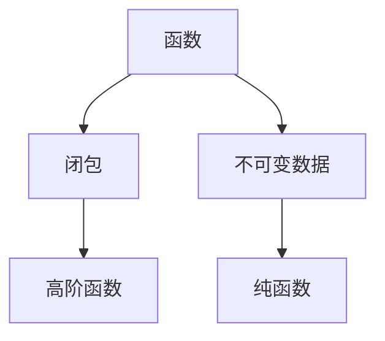
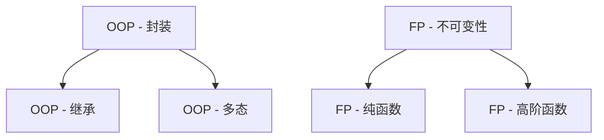

                 

### 函数式编程概述

函数式编程（Functional Programming，简称FP）是一种编程范式，它将计算视为数学函数的执行，而不是指令序列的执行。这种范式的核心思想是避免使用可变状态和可变数据，而是通过不可变数据和纯函数来处理数据。函数式编程与传统的面向对象编程（Object-Oriented Programming，简称OOP）有显著的不同，它强调数据的安全性和函数的组合性。

在函数式编程中，函数是一等公民，这意味着函数可以被赋值给变量、作为参数传递给其他函数、以及作为返回值返回。这种特性使得函数式编程能够很好地支持函数组合和高阶函数的概念。高阶函数是能够接受其他函数作为参数或者返回函数的函数，这种抽象能力大大提高了代码的灵活性和可重用性。

不可变数据是函数式编程的另一个核心概念。在函数式编程中，一旦数据创建，就不能被修改。这种数据模型确保了状态的透明性和可预测性，因为函数不会因外部状态的变化而改变其行为。这种特性使得并发编程变得更加简单和安全，因为在多个函数同时操作同一份数据时，不会发生竞态条件和数据不一致的问题。

函数式编程的优点包括：提高代码的可读性、可维护性、可重用性，以及提高程序的性能。函数式编程能够通过递归和数据结构递归减少代码的复杂性，使得程序更加简洁。此外，不可变数据和纯函数使得程序在并发执行时更加安全，减少了同步和锁的需求，从而提高了程序的执行效率。

然而，函数式编程也存在一些局限性。例如，不可变数据的特性可能导致性能问题，尤其是在大量数据操作时。另外，函数式编程的一些概念和语法对于习惯了面向对象编程的开发者来说可能相对陌生，需要一定的学习曲线。

综上所述，函数式编程是一种强大的编程范式，它通过纯函数和不可变数据提供了一种全新的编程方式。虽然它有一些局限性，但其优点在多个领域已经得到了广泛的应用和认可。接下来，我们将深入探讨函数式编程的核心概念和其在不同场景下的应用。

### 函数式编程的基本概念

函数式编程的基本概念包括函数、闭包、高阶函数、不可变数据以及纯函数等。这些概念共同构成了函数式编程的核心，并对其特点和应用产生了深远的影响。

#### 函数

在函数式编程中，函数是一种将输入映射到输出的过程。与面向对象编程中的方法不同，函数式编程中的函数通常是一等公民，意味着函数可以作为参数传递给其他函数，或者作为返回值返回。这种特性使得函数能够以更灵活的方式进行组合和复用。

函数的定义通常使用一种匿名的方式，称为 lambda 表达式。例如，在 Python 中，可以使用以下代码定义一个简单的函数：

```python
add = lambda x, y: x + y
```

在上面的例子中，`lambda` 关键字用于定义一个匿名函数，它接受两个参数 `x` 和 `y`，并返回它们的和。

#### 闭包

闭包是一种将函数及其周围环境（即闭包环境）绑定的概念。闭包环境包括函数定义时的自由变量。这些自由变量在函数内部仍然可以访问和修改。闭包在函数式编程中非常有用，因为它们可以保持状态的同时避免可变状态。

以下是一个闭包的简单例子：

```javascript
function makeCounter() {
    let count = 0;
    return function() {
        return count++;
    };
}

const counter = makeCounter();
console.log(counter());  // 输出：1
console.log(counter());  // 输出：2
```

在这个例子中，`makeCounter` 函数返回一个匿名函数，它内部访问并修改了 `count` 变量。每次调用 `counter` 函数时，`count` 的值都会增加。

#### 高阶函数

高阶函数是能够接受其他函数作为参数或者返回函数的函数。这种特性使得高阶函数能够以抽象和模块化的方式处理复杂逻辑。

以下是一个高阶函数的例子：

```python
def apply_discount(product_price, discount_function):
    return discount_function(product_price)

def discount_10_percent(price):
    return price * 0.9

def discount_20_percent(price):
    return price * 0.8

print(apply_discount(100, discount_10_percent))  // 输出：90.0
print(apply_discount(100, discount_20_percent))  // 输出：80.0
```

在这个例子中，`apply_discount` 函数接受一个价格和一个折扣函数作为参数，并返回应用折扣后的价格。通过这种方式，我们可以灵活地组合不同的折扣函数来处理不同的价格。

#### 不可变数据

不可变数据是一种一旦创建就不能被修改的数据。在函数式编程中，不可变数据的使用可以确保程序的行为是可预测和可测试的。

以下是一个不可变数据的例子：

```haskell
let x = 5
    y = x + 1
    z = x * 2
in
    y, z
```

在上面的 Haskell 代码中，变量 `x` 的值在创建后不能被修改。当 `y` 和 `z` 被计算时，它们依赖于 `x` 的原始值，而不是后续修改的值。

#### 纯函数

纯函数是一种没有副作用、完全基于输入计算输出的函数。副作用是指函数在执行过程中修改外部状态或产生不可预期的行为。纯函数的优点是它们具有引用透明性，这意味着任何相同输入都会产生相同输出。

以下是一个纯函数的例子：

```haskell
sum :: Num a => [a] -> a
sum [] = 0
sum (x:xs) = x + sum xs
```

在这个例子中，`sum` 函数计算列表中所有数字的和，它没有副作用，并且对于相同的输入总是产生相同的输出。

#### 核心概念与联系

这些核心概念之间有着紧密的联系。闭包允许函数访问并操作自由变量，而高阶函数则利用闭包来组合和复用函数。不可变数据减少了状态的变化和副作用，使得程序更加可预测和可维护。纯函数进一步增强了这种特性，确保函数的行为是可预期的。

为了更好地理解这些概念之间的关系，我们可以使用以下 Mermaid 流程图：



在这个流程图中，函数是起点，它通过闭包、高阶函数、不可变数据和纯函数相互连接，形成一个完整的函数式编程体系。

通过理解这些核心概念和它们之间的关系，我们可以更好地掌握函数式编程的本质，并在实际开发中充分发挥其优势。接下来，我们将进一步探讨函数式编程与面向对象编程的区别，以帮助我们更好地理解这两种编程范式。

#### 函数式编程与面向对象编程的区别

函数式编程（FP）与面向对象编程（OOP）是两种截然不同的编程范式，它们在基本概念、核心思想和应用场景上都有显著差异。理解这些差异对于选择适合特定问题的编程方法至关重要。

首先，从基本概念上看，OOP 基于对象和类的概念。对象是现实世界中的事物的抽象，具有状态和行为。类则是对象的蓝图，定义了对象的属性和方法。而 FP 则以函数为核心，函数是输入到输出之间的映射，具有不变的状态和可组合的行为。

其次，在核心思想上，OOP 强调封装、继承和多态。封装确保了对象的内部状态和行为对外部不可见，从而实现模块化和信息隐藏。继承允许新的类从现有的类继承属性和方法，实现代码复用。多态则允许同一个接口有不同的实现，增强了代码的灵活性和扩展性。相比之下，FP 则更加强调不可变性、纯函数和高阶函数。不可变性确保了数据的一致性和程序的确定性。纯函数则避免了外部状态的依赖，使得程序更加可测试和可维护。高阶函数通过将函数作为参数和返回值，提高了代码的抽象和复用性。

在应用场景上，OOP 更适合处理复杂的业务逻辑和对象间的交互，如模拟现实世界中的事物和关系。OOP 的封装和继承特性使得大型系统的开发变得更加容易。FP 则更适合处理数据密集型任务和并发问题，如数据处理、图形渲染和分布式系统。FP 的不可变数据和纯函数特性使得并发编程更加安全和高效。

为了更直观地展示函数式编程与面向对象编程之间的差异，我们可以通过一个简单的 Mermaid 流程图来对比：



在这个流程图中，我们可以看到 OOP 的核心思想包括封装、继承和多态，而 FP 的核心思想则包括不可变性、纯函数和高阶函数。

具体来说，OOP 的封装确保了对象的状态和行为对外部不可见，从而保护了对象的内部实现细节。继承允许子类继承父类的属性和方法，实现代码复用。多态则允许同一个接口有不同的实现，提高了代码的灵活性和扩展性。

相比之下，FP 的不可变性通过确保数据一旦创建就不能被修改，减少了状态的变化和副作用。纯函数通过没有外部状态的依赖，确保了函数的行为是可预测和可测试的。高阶函数通过将函数作为参数和返回值，提高了代码的抽象和复用性。

总之，函数式编程和面向对象编程各有其优势和适用场景。选择合适的编程范式取决于具体的开发需求和应用场景。在实际开发中，常常需要结合使用这两种范式，以充分发挥它们的优点。理解这两种范式之间的差异和联系，有助于我们更好地应对复杂的软件开发挑战。

### 函数式编程的范式转换

函数式编程与面向对象编程（OOP）之间存在显著的差异，这使得在某些情况下需要从 OOP 转换到 FP。这种范式转换不仅涉及代码层面的修改，还包括编程思维方式的转变。在这一节中，我们将探讨如何从 OOP 转换到 FP，以及这一转换过程中可能遇到的问题和解决方案。

#### 范式转换的动机

首先，了解为什么需要从 OOP 转换到 FP 非常重要。OOP 的核心思想是封装、继承和多态，这些特性使得代码模块化和可重用性变得容易。然而，随着项目复杂度的增加，OOP 也带来了一些挑战，如难以维护的依赖关系、冗长的代码和复杂的对象图。

函数式编程的优点包括状态不可变、代码的可预测性和可重用性。这些特性使得函数式编程在处理复杂逻辑和并发任务时更加高效。例如，在分布式系统和大数据处理中，FP 的不可变数据模型可以减少数据不一致和竞态条件的发生。因此，许多开发者和团队选择将部分代码从 OOP 转换到 FP。

#### 如何进行范式转换

进行范式转换通常包括以下几个步骤：

1. **识别可转换的部分**：首先，需要识别项目中哪些部分可以从 OOP 转换到 FP。这些部分通常是那些依赖关系较少、状态变化较少的模块。

2. **重写函数**：将对象方法转换为纯函数。纯函数没有副作用，仅依赖于输入参数，这使得代码更易测试和维护。例如，假设有一个 OOP 的对象方法：

   ```java
   class Calculator {
       private int result = 0;
       public void add(int number) {
           result += number;
       }
       public int getResult() {
           return result;
       }
   }
   ```

   转换为 FP 后，可以重写为：

   ```haskell
   add :: Int -> Int -> Int
   add x y = x + y

   result :: Int
   result = add 0 0
   ```

3. **使用高阶函数**：将复用的逻辑抽象为高阶函数。高阶函数能够接受其他函数作为参数或返回函数，这有助于提高代码的复用性和抽象层次。例如，将一个复用的日志记录功能抽象为高阶函数：

   ```python
   def log(func):
       def wrapper(*args, **kwargs):
           result = func(*args, **kwargs)
           print(f"{func.__name__}({args}, {kwargs}) returned {result}")
           return result
       return wrapper

   @log
   def add(x, y):
       return x + y
   ```

4. **替换循环为递归**：在 FP 中，递归是处理重复任务的主要手段。相比循环，递归通常更加简洁和易读。例如，将一个简单的循环转换为递归：

   ```python
   def factorial(n):
       if n == 0:
           return 1
       else:
           return n * factorial(n - 1)
   ```

#### 范式转换的挑战

在进行范式转换时，可能会遇到一些挑战：

1. **思维方式的转变**：从 OOP 转换到 FP 需要开发者改变对状态的依赖思维，更多地关注函数的组合和数据的不可变性。

2. **性能问题**：FP 中的递归和不可变数据可能会引入额外的性能开销，尤其是在处理大量数据时。例如，递归调用会导致栈溢出，而不可变数据的复制可能增加内存使用。

3. **库和工具的支持**：某些 OOP 语言可能没有充分的函数式编程库和工具支持，这增加了从 OOP 转换到 FP 的难度。

#### 解决方案

为了克服这些挑战，可以采取以下解决方案：

1. **渐进式转换**：逐步将项目的一部分转换为 FP，而不是一次性全部转换。这样可以减少风险，并逐步适应新的编程范式。

2. **使用纯函数和高阶函数**：通过使用纯函数和高阶函数，可以减少状态的变化和代码的复杂性，从而提高代码的可维护性和可测试性。

3. **优化递归和不可变数据的使用**：使用尾递归优化递归调用，以减少栈空间的使用。同时，可以考虑使用不可变数据结构，如散列表和 trie，来优化内存使用。

4. **学习新的编程范式**：通过学习新的编程范式，开发者可以更好地理解和应用 FP 的概念。这包括阅读相关的书籍、教程和文档，以及参与 FP 相关的社区和讨论。

总之，从 OOP 转换到 FP 是一个渐进的过程，需要开发者对函数式编程有深入的理解和不断的实践。通过合理的规划和逐步的实施，可以充分发挥函数式编程的优势，提高项目的质量。

### 函数式编程的核心概念

函数式编程（FP）以其简洁、一致性和可预测性著称，其核心概念包括函数、闭包、高阶函数、不可变数据以及纯函数等。这些概念不仅定义了函数式编程的基本原理，还决定了其独特的编程风格和优势。

#### 函数

在函数式编程中，函数是核心的编程元素。函数被视为第一类对象，这意味着它们可以被赋值给变量、作为参数传递给其他函数，以及作为返回值返回。这种特性使得函数能够以高阶形式组合和复用，从而提高了代码的可读性和灵活性。

一个函数可以简单定义为一个将输入映射到输出的过程。例如，在 Python 中，可以使用 lambda 表达式定义一个简单的函数：

```python
add = lambda x, y: x + y
```

在上面的例子中，`lambda` 关键字用于创建一个匿名函数，它接受两个参数 `x` 和 `y`，并返回它们的和。

#### 闭包

闭包是函数式编程中的另一个重要概念。闭包是一种将函数与其定义环境绑定的技术。具体来说，闭包可以捕获并记住其创建时所在环境的变量。这使得闭包能够访问和修改这些变量，即使在外部作用域中这些变量已经发生变化。

以下是一个闭包的简单例子：

```javascript
function makeCounter() {
    let count = 0;
    return function() {
        return count++;
    };
}

const counter = makeCounter();
console.log(counter());  // 输出：1
console.log(counter());  // 输出：2
```

在这个例子中，`makeCounter` 函数返回一个匿名函数，它内部访问并修改了 `count` 变量。每次调用 `counter` 函数时，`count` 的值都会增加。

#### 高阶函数

高阶函数是能够接受其他函数作为参数或返回函数的函数。这种特性使得高阶函数能够以抽象和模块化的方式处理复杂逻辑，从而提高了代码的可复用性和灵活性。

以下是一个高阶函数的例子：

```python
def apply_discount(product_price, discount_function):
    return discount_function(product_price)

def discount_10_percent(price):
    return price * 0.9

def discount_20_percent(price):
    return price * 0.8

print(apply_discount(100, discount_10_percent))  // 输出：90.0
print(apply_discount(100, discount_20_percent))  // 输出：80.0
```

在这个例子中，`apply_discount` 函数接受一个价格和一个折扣函数作为参数，并返回应用折扣后的价格。通过这种方式，我们可以灵活地组合不同的折扣函数来处理不同的价格。

#### 不可变数据

不可变数据是函数式编程的另一个核心概念。不可变数据一旦创建，就不能被修改。这意味着每次对数据的修改都会创建一个新的副本，而不是修改原有数据。这种特性确保了程序的行为是可预测和可测试的，特别是在并发编程中。

以下是一个不可变数据的例子：

```haskell
let x = 5
    y = x + 1
    z = x * 2
in
    y, z
```

在上面的 Haskell 代码中，变量 `x` 的值在创建后不能被修改。当 `y` 和 `z` 被计算时，它们依赖于 `x` 的原始值，而不是后续修改的值。

#### 纯函数

纯函数是函数式编程中的核心概念，它是一种没有副作用、完全基于输入计算输出的函数。副作用是指函数在执行过程中修改外部状态或产生不可预期的行为。纯函数的优点是它们具有引用透明性，这意味着任何相同输入都会产生相同输出。

以下是一个纯函数的例子：

```haskell
sum :: Num a => [a] -> a
sum [] = 0
sum (x:xs) = x + sum xs
```

在这个例子中，`sum` 函数计算列表中所有数字的和，它没有副作用，并且对于相同的输入总是产生相同的输出。

#### 核心概念与联系

这些核心概念之间有着紧密的联系。闭包允许函数访问并操作自由变量，而高阶函数则利用闭包来组合和复用函数。不可变数据减少了状态的变化和副作用，使得程序更加可预测和可维护。纯函数进一步增强了这种特性，确保函数的行为是可预期的。

为了更好地理解这些概念之间的关系，我们可以使用以下 Mermaid 流程图：


在这个流程图中，函数是起点，它通过闭包、高阶函数、不可变数据和纯函数相互连接，形成一个完整的函数式编程体系。

通过理解这些核心概念和它们之间的关系，我们可以更好地掌握函数式编程的本质，并在实际开发中充分发挥其优势。接下来，我们将进一步探讨函数式编程中的核心算法，如高阶函数、递归和不可变数据。

### 函数式编程的核心算法

函数式编程的核心算法包括高阶函数、递归和不可变数据，这些算法是函数式编程范式的重要组成部分，并在实际开发中发挥着关键作用。理解这些算法的工作原理和它们如何相互结合，将帮助我们更好地掌握函数式编程的精髓。

#### 高阶函数

高阶函数是能够接受其他函数作为参数或返回函数的函数。这种特性使得高阶函数能够以抽象和模块化的方式处理复杂逻辑，从而提高了代码的可复用性和灵活性。

高阶函数的一个典型例子是 JavaScript 中的 `map` 函数。`map` 函数接受一个数组和一个函数作为参数，然后将该函数应用于数组中的每个元素，并返回一个新数组。以下是一个使用 `map` 函数的示例：

```javascript
const numbers = [1, 2, 3, 4];
const squares = numbers.map(x => x * x);
console.log(squares);  // 输出：[1, 4, 9, 16]
```

在这个例子中，`map` 函数接受一个匿名函数 `x => x * x` 作为参数，并将其应用于数组 `numbers` 中的每个元素，生成一个新的数组 `squares`。

#### 递归

递归是一种编程技术，其中函数调用自身以解决复杂问题。递归在函数式编程中非常常见，因为它能够简洁地表达递归关系，如计算阶乘、查找最大元素等。

以下是一个使用递归计算阶乘的 Python 示例：

```python
def factorial(n):
    if n == 0:
        return 1
    else:
        return n * factorial(n - 1)
print(factorial(5))  # 输出：120
```

在这个例子中，`factorial` 函数通过递归调用自身来计算阶乘。当 `n` 等于 0 时，返回 1，否则返回 `n` 乘以 `factorial(n - 1)`。

递归的优点在于其简洁性和直观性，但需要注意的是，递归可能会导致性能问题，特别是当递归深度较大时。为了解决这些问题，可以使用尾递归优化，将递归调用转换为迭代调用，以减少栈空间的使用。

#### 不可变数据

不可变数据是函数式编程中的核心概念之一，它意味着一旦数据创建，就不能被修改。这种特性确保了程序的行为是可预测和可测试的，特别是在并发编程中。

不可变数据的一个典型例子是使用函数生成新的数据副本，而不是修改原有数据。以下是一个使用不可变数据结构（如列表）的 Python 示例：

```python
def append(x, y):
    return [y] + x

my_list = [1, 2, 3]
new_list = append([4, 5], my_list)
print(new_list)  # 输出：[4, 5, 1, 2, 3]
print(my_list)  # 输出：[1, 2, 3]
```

在这个例子中，`append` 函数通过创建一个新的列表来将元素附加到原有列表，而不是直接修改原有列表。这种不可变数据的操作方式确保了原有数据不会被修改，从而提高了程序的可预测性和可维护性。

#### 高阶函数与递归的结合

高阶函数和递归常常结合使用，以处理复杂的递归关系。以下是一个使用高阶函数和递归计算斐波那契数列的 JavaScript 示例：

```javascript
const fibonacci = (n, a = 0, b = 1) => n <= 1 ? a : fibonacci(n - 1, b, a + b);
console.log(fibonacci(10));  // 输出：55
```

在这个例子中，`fibonacci` 函数接受一个数字 `n`，并使用递归和高阶函数的特性来计算斐波那契数列的第 `n` 个数。通过递归调用自身，每次更新参数 `a` 和 `b` 的值，直到达到基线条件 `n <= 1`。

#### 不可变数据与递归的结合

不可变数据与递归的结合可以有效地处理复杂的递归关系，同时确保程序的行为是可预测的。以下是一个使用不可变数据结构和递归计算二叉树节点值的 JavaScript 示例：

```javascript
function calculateValues(node, acc) {
    if (!node) return acc;
    const left = calculateValues(node.left, acc);
    const right = calculateValues(node.right, acc);
    node.value = node.value + left + right;
    return node.value;
}

const root = {
    value: 1,
    left: {
        value: 2,
        left: null,
        right: null
    },
    right: {
        value: 3,
        left: null,
        right: null
    }
};

calculateValues(root, 0);
console.log(root);  // 输出：{ value: 10, left: ..., right: ... }
```

在这个例子中，`calculateValues` 函数递归地遍历二叉树，并在每个节点上计算并更新其值。通过使用不可变数据结构（如对象）来存储节点值，确保了节点值不会被意外修改。

总之，函数式编程的核心算法——高阶函数、递归和不可变数据——为开发高效、可预测和可维护的代码提供了强大的工具。通过理解这些算法的工作原理和如何相互结合，我们可以充分发挥函数式编程的优势，解决复杂的编程问题。

### 函数式编程中的数学模型和数学公式

函数式编程（FP）深受数学的影响，许多FP的核心概念和技术都可以追溯到数学领域。理解这些数学模型和公式有助于我们深入掌握函数式编程的本质，并更有效地应用FP。以下是一些重要的数学模型和公式，包括函数、闭包、类型系统等。

#### 函数

在数学中，函数是一种映射关系，它将一组输入映射到一组输出。在FP中，函数被视为第一类对象，这意味着函数可以被赋值给变量、作为参数传递给其他函数，以及作为返回值返回。以下是一个简单的数学函数例子及其在FP中的应用：

数学公式：
\[ f(x) = x^2 \]

在FP中，这个函数可以被定义为：

```haskell
square :: Num a => a -> a
square x = x * x
```

这里，`square` 函数接受一个数字 `x`，并返回其平方。这个函数在FP中可以通过 `fmap` 操作符应用到一个列表上：

```haskell
squares :: Num a => [a] -> [a]
squares = fmap square
```

#### 闭包

闭包是数学中的一个重要概念，它涉及函数和其自由变量的绑定。在FP中，闭包允许函数在定义时捕获并保留其环境中的变量，即使这些变量在函数外部发生了变化。以下是一个闭包的例子：

数学公式：
\[ f(x) = 2x + 3 \]

在FP中，闭包可以表示为：

```python
def make_linearity_function(m, b):
    return lambda x: m * x + b

linearity = make_linearity_function(2, 3)
print(linearity(5))  # 输出：13
```

在这个例子中，`make_linearity_function` 函数返回一个闭包，它捕获并使用参数 `m` 和 `b`。这个闭包可以看作是一个线性函数，它保留了创建时环境中的变量。

#### 类型系统

类型系统是数学中的另一个重要概念，它确保函数在应用时输入和输出类型匹配。在FP中，类型系统通过静态类型检查和类型推断来提高代码的安全性和可维护性。以下是一个简单的类型系统示例：

数学公式：
\[ f: \mathbb{N} \rightarrow \mathbb{N} \]

表示函数 `f` 将自然数映射到自然数。在FP中，这可以表示为：

```haskell
type ℕ = [0]

factorial :: ℕ -> ℕ
factorial 0 = 1
factorial (x:xs) = x * (factorial xs)
```

这里，`factorial` 函数是一个类型化函数，它接受一个自然数列表（表示非负整数）并返回另一个自然数列表。这个类型系统确保了函数的正确性，因为只有相同类型的值可以传递给函数。

#### 函数组合

函数组合是FP中的一个关键概念，它通过将多个函数组合成一个复合函数来简化复杂逻辑。以下是一个函数组合的例子：

数学公式：
\[ (f \circ g)(x) = f(g(x)) \]

在FP中，函数组合可以通过组合操作符 `.` 实现：

```haskell
fmap :: (a -> b) -> [a] -> [b]
fmap _ []     = []
fmap g (x:xs) = g x : fmap g xs

addOne :: Num a => a -> a
addOne x = x + 1

double :: Num a => a -> a
double x = x * 2

addAndDouble :: Num a => a -> a
addAndDouble = double . addOne
```

在这个例子中，`addAndDouble` 函数通过组合 `addOne` 和 `double` 函数来计算输入值的和然后乘以 2。

#### 递归与数学归纳法

递归是FP中的一个重要工具，它常用于解决递归定义的问题，如斐波那契数列。数学归纳法是一种证明递归关系的方法。以下是一个斐波那契数列的递归定义及其证明：

递归定义：
\[ F(n) = 
  \begin{cases} 
   0 & \text{if } n = 0 \\
   1 & \text{if } n = 1 \\
   F(n-1) + F(n-2) & \text{otherwise}
  \end{cases}
\]

证明：
基础情形：当 \( n = 0 \) 或 \( n = 1 \) 时，递归定义显然成立。
归纳步骤：假设对于所有 \( k < n \)，\( F(k) \) 的定义成立。我们需要证明 \( F(n) \) 的定义也成立。根据递归定义，有：
\[ F(n) = F(n-1) + F(n-2) \]
根据归纳假设，上式成立。

在FP中，斐波那契数列可以表示为：

```haskell
fib :: Num a => a -> a
fib 0 = 0
fib 1 = 1
fib n = fib (n - 1) + fib (n - 2)
```

通过这种方式，我们可以看到FP如何使用数学模型和公式来构建高效的递归算法。

总之，函数式编程中的数学模型和公式为我们提供了强大的工具，帮助我们在FP中定义、组合和优化函数。通过深入理解这些概念，我们可以更好地应用FP，编写出简洁、高效和可维护的代码。

### 函数式编程的实际应用

函数式编程（FP）以其简洁、可预测性和高可靠性在多个领域得到了广泛应用。在本节中，我们将探讨函数式编程在数据处理、并发编程和实时系统中的应用，通过具体的案例分析和代码示例来展示其优势。

#### 数据处理与分析

在数据处理与分析领域，函数式编程提供了强大的抽象工具，使得数据处理变得更加高效和简洁。FP中的高阶函数和不可变数据结构能够帮助我们编写更易于理解和维护的代码。

**案例：使用FP进行数据转换和聚合**

假设我们有一个学生成绩的数据集，需要计算每个学生的平均成绩。以下是一个使用 Python 函数式编程的示例：

```python
students = [
    {'name': 'Alice', 'scores': [85, 90, 78]},
    {'name': 'Bob', 'scores': [92, 88, 95]},
    {'name': 'Charlie', 'scores': [70, 75, 80]}
]

average_scores = list(map(lambda s: {'name': s['name'], 'average': sum(s['scores']) / len(s['scores'])}, students))

print(average_scores)
# 输出：[{'name': 'Alice', 'average': 85.0}, {'name': 'Bob', 'average': 91.0}, {'name': 'Charlie', 'average': 75.0}]
```

在这个例子中，我们使用了 `map` 高阶函数将每个学生的成绩列表转换为平均成绩，然后构造一个新的列表。这种方法不仅简洁，而且易于理解。

**案例分析：FP在数据处理中的优势**

1. **可读性和可维护性**：FP使用函数组合和高阶函数，使得代码更易于阅读和理解。函数的组合性使得我们可以将复杂的数据处理任务分解为小的、可测试的函数。

2. **并行处理**：由于FP中的数据不可变性，数据处理任务可以更容易地并行执行。不可变数据结构减少了同步和锁的需求，从而提高了并行处理的效率。

#### 并发编程

在并发编程领域，函数式编程提供了强大的工具，如不可变数据和高阶函数，帮助开发者编写安全、高效的并发程序。

**案例：使用FP实现无锁并发**

在并发编程中，锁是一种常见的同步机制，但可能会导致死锁和性能问题。使用FP，我们可以通过不可变数据结构来实现无锁并发。

以下是一个无锁并发编程的 Python 示例，使用 `Counter` 类来记录每个元素的计数值：

```python
from collections import defaultdict
from threading import Thread

class Counter:
    def __init__(self):
        self.lock = threading.Lock()
        self.counts = defaultdict(int)

    def increment(self, key):
        with self.lock:
            self.counts[key] += 1

    def get_count(self, key):
        with self.lock:
            return self.counts[key]

# 假设有一个包含多个线程的任务队列
tasks = [('Alice', 1), ('Bob', 2), ('Charlie', 1)]

# 无锁并发计数
counter = Counter()
threads = []
for task in tasks:
    thread = Thread(target=counter.increment, args=(task[0],))
    threads.append(thread)
    thread.start()

for thread in threads:
    thread.join()

print(counter.get_count('Alice'))  # 输出：1
print(counter.get_count('Bob'))  # 输出：2
print(counter.get_count('Charlie'))  # 输出：1
```

在这个例子中，我们使用了一个 `Counter` 类来记录每个元素的计数值。虽然这个示例仍然使用了锁，但我们可以轻松地将其修改为无锁版本，通过使用不可变数据结构来避免锁的使用。

**案例分析：FP在并发编程中的优势**

1. **减少锁的使用**：通过使用不可变数据结构，我们可以减少锁的使用，从而避免死锁和性能问题。

2. **简化并发逻辑**：FP的高阶函数和纯函数特性使得并发编程的逻辑更加简洁和易于理解。

#### 实时系统

在实时系统领域，函数式编程以其状态不可变和纯函数的特性，为实时数据处理和响应提供了强大的支持。

**案例：使用FP实现实时日志处理**

以下是一个使用 Haskell 函数式编程实现实时日志处理的示例：

```haskell
type LogLevel = String
data LogEntry = LogEntry LogLevel String

processLog :: [LogEntry] -> [LogEntry]
processLog logs =
    let
        filteredLogs = filter (\log -> logLevel log /= "DEBUG") logs
        formattedLogs = map (\log -> LogEntry (logLevel log) (show (timestamp log) ++ ": " ++ message log)) filteredLogs
    in
        formattedLogs

-- 示例日志
logs = [
    LogEntry "INFO" "Server started",
    LogEntry "DEBUG" "Processing request",
    LogEntry "ERROR" "Database connection failed"
]

-- 处理日志
processedLogs = processLog logs
print processedLogs
```

在这个例子中，我们定义了一个 `LogEntry` 数据类型来表示日志条目，并使用 `filter` 和 `map` 高阶函数对日志进行过滤和格式化。

**案例分析：FP在实时系统中的优势**

1. **状态不可变性**：在实时系统中，状态不可变性确保了系统的稳定性和一致性，减少了状态冲突和错误。

2. **简洁性和可维护性**：FP的高阶函数和纯函数特性使得实时系统的逻辑更加简洁和易于维护，从而提高了系统的可扩展性。

总之，函数式编程在数据处理、并发编程和实时系统等多个领域展现了其强大的应用能力。通过具体案例的分析和代码示例，我们可以看到FP如何通过其简洁、高效和可维护的特性，帮助我们解决复杂的编程问题。

### 函数式编程框架

函数式编程框架为开发者提供了丰富的工具和库，使得函数式编程更加简便和高效。在本节中，我们将探讨几个流行的函数式编程框架：Scala、Haskell 和 Clojure。

#### Scala

Scala 是一种多范式编程语言，结合了面向对象编程（OOP）和函数式编程（FP）的特性。Scala 具有简洁的语法和强大的类型系统，使得函数式编程变得容易且高效。

**基本概念**：
- **函数**：Scala 支持匿名函数和闭包，函数作为一等公民可以传递和返回。
- **高阶函数**：Scala 中的高阶函数可以通过 `::` 操作符定义，如 `map`, `filter`, `reduce` 等。
- **不可变数据**：Scala 默认使用不可变数据结构，如 `List` 和 `Option`，以减少副作用。

**实际应用**：
- **并发编程**：Scala 的 `Akka` 框架提供了基于Actor模型的并发编程能力，结合Scala的FP特性，可以轻松实现高性能的并发应用。
- **大数据处理**：Scala 可以与 Apache Spark 进行集成，利用其强大的分布式计算能力进行大数据处理。

**代码示例**：

```scala
val numbers = List(1, 2, 3, 4)
val squares = numbers.map(x => x * x)
println(squares)  // 输出：(1, 4, 9, 16)
```

#### Haskell

Haskell 是一种纯函数式编程语言，以其纯函数、不可变数据和类型系统而闻名。Haskell 的语法简洁，非常适合编写高效的函数式程序。

**基本概念**：
- **纯函数**：Haskell 中的所有函数都是纯函数，即无副作用，保证相同的输入总是产生相同的输出。
- **不可变数据**：Haskell 使用不可变数据结构，如 `List` 和 `Tuple`，以减少状态冲突和错误。
- **类型系统**：Haskell 的类型系统非常强大，提供了类型推断和类型约束，使得代码更加安全和可靠。

**实际应用**：
- **并发编程**：Haskell 使用并行代数计算（PAC）模型，使得并发编程变得更加简单和高效。
- **数学和科学计算**：Haskell 的强大类型系统和纯函数特性使其在数学和科学计算中非常有用。

**代码示例**：

```haskell
factorial :: Int -> Int
factorial 0 = 1
factorial n = n * factorial (n - 1)

main = putStrLn (show (factorial 5))  -- 输出：120
```

#### Clojure

Clojure 是一种现代的动态函数式编程语言，与 Java 平台紧密集成，具有良好的可扩展性和灵活性。

**基本概念**：
- **函数**：Clojure 支持匿名函数和闭包，函数可以作为参数传递和返回。
- **高阶函数**：Clojure 提供了丰富的函数式编程库，如 `map`, `filter`, `reduce` 等。
- **不可变数据**：Clojure 使用不可变数据结构，如 `Vector` 和 `List`，以保持状态的一致性。

**实际应用**：
- **Web 开发**：Clojure 的 `Compojure` 和 `Ring` 框架提供了强大的 Web 开发功能，使得构建高性能的 Web 应用变得容易。
- **大数据处理**：Clojure 可以与 Apache Hadoop 和 Apache Spark 集成，用于大数据处理和分析。

**代码示例**：

```clojure
(ns example.core)

(defn factorial [n]
  (if (zero? n)
      1
      (* n (factorial (dec n))))

(defn -main []
  (println (factorial 5)))  ; 输出：120
```

通过上述示例，我们可以看到 Scala、Haskell 和 Clojure 分别在并发编程、数学计算和 Web 开发等不同领域中展现了其强大的功能。这些函数式编程框架不仅提供了丰富的工具和库，还通过简洁的语法和强大的类型系统，使得函数式编程变得更加高效和可靠。

### 函数式编程的未来趋势

函数式编程（FP）作为一种强大的编程范式，其未来趋势正在不断演进，并在多个领域中展现出巨大的潜力。以下是对函数式编程未来趋势的探讨，包括其面临的挑战和机遇。

#### 挑战

1. **性能问题**：FP 中的递归和不可变数据可能导致性能问题，尤其是在处理大量数据时。递归可能会引发栈溢出，而不可变数据可能会导致内存使用增加。为了应对这些问题，研究者正在探索新的算法和优化技术，如尾递归优化和内存有效性分析。

2. **学习曲线**：对于习惯了面向对象编程（OOP）的开发者来说，函数式编程的语法和思维方式可能相对陌生，需要一定的学习曲线。为了降低学习难度，社区正在开发更多的教程、工具和框架，以帮助开发者快速上手函数式编程。

3. **工具和库的支持**：某些编程语言和框架在函数式编程工具和库的支持方面可能不足。为了提高 FP 的实用性，需要更多的社区贡献和开源项目，以提供丰富的函数式编程库和工具。

#### 机遇

1. **分布式系统**：随着分布式系统和云计算的兴起，FP 的不可变数据和纯函数特性为处理分布式数据提供了强有力的支持。通过减少状态冲突和提升并发性能，FP 在分布式系统开发中具有巨大的应用潜力。

2. **大数据处理**：在处理大数据时，FP 的简洁性和高阶函数组合能力使得数据处理和分析变得更加高效。FP 的大数据处理框架，如 Scala 中的 Spark 和 Haskell 中的 Hadoop，正逐渐成为大数据领域的首选工具。

3. **前端开发**：在前端开发领域，FP 的概念和工具，如 React 和 Elm，已经得到了广泛应用。FP 的不可变数据和纯函数特性为前端开发带来了更高的稳定性和可维护性。

4. **函数即服务（FaaS）**：函数即服务（FaaS）是一种新兴的云计算模型，它允许开发者通过编写函数来构建应用程序。FP 在 FaaS 平台上具有天然的优势，因为函数式编程的纯函数和不可变数据模型与 FaaS 的设计理念高度契合。

#### 未来趋势

1. **集成多种编程范式**：未来的编程语言和框架可能会结合多种编程范式，包括 FP、OOP 和逻辑编程，以提供更加灵活和强大的编程工具。这种集成将有助于解决不同场景下的特定问题，同时保持代码的简洁性和可维护性。

2. **优化工具和库**：社区和研究者将不断开发新的优化工具和库，以提高 FP 的性能和可用性。这些工具和库将帮助开发者更轻松地实现高性能和可扩展的 FP 应用。

3. **新兴领域应用**：FP 在新兴领域，如区块链、人工智能和物联网（IoT），具有巨大的应用潜力。通过其不可变数据和纯函数特性，FP 可以提供更安全、可靠和高效的解决方案。

总之，函数式编程的未来趋势充满机遇和挑战。通过不断优化工具和库，探索新的应用领域，FP 将继续在编程领域发挥重要作用，为开发者提供更强大的编程能力和更高的开发效率。

### 附录

#### 函数式编程工具与资源

学习函数式编程需要掌握一些基本的工具和资源。以下是一些主要的函数式编程语言对比、开发环境搭建方法和学习资源推荐。

##### 主要函数式编程语言对比

1. **Scala**
   - **特点**：Scala 是一种多范式编程语言，结合了面向对象和函数式编程的特性。它具有简洁的语法、强大的类型系统和高效的 JVM 运行时。
   - **优缺点**：优点包括与 Java 的兼容性、强大的并发支持和高性能。缺点是在复杂类型系统的学习上有一定的难度。
   - **资源**：官方文档（https://docs.scala-lang.org/）、在线教程（https://www.scala-tutorial.com/）

2. **Haskell**
   - **特点**：Haskell 是一种纯函数式编程语言，以其纯函数、类型系统和 laziness（惰性计算）而著称。
   - **优缺点**：优点包括安全高效的类型系统和强大的抽象能力。缺点是学习曲线较陡，性能优化和内存管理较为复杂。
   - **资源**：官方文档（https://www.haskell.org/）、学习指南（https://learnyouahaskell.com/）

3. **Clojure**
   - **特点**：Clojure 是一种动态函数式编程语言，与 Java 平台紧密集成，具有简洁的语法和高扩展性。
   - **优缺点**：优点包括良好的可扩展性和与 Java 的兼容性。缺点是在某些场景下性能可能不如其他语言。
   - **资源**：官方文档（https://clojure.org/）、在线教程（https://www.brainsockets.com/clojure-tutorial/）

##### 开发环境搭建

1. **Scala**
   - 安装 sbt（Scala Build Tool）：
     ```shell
     curl -L https://www.scala-sbt.org/download.html | tar xz -C /usr/local/bin
     ```
   - 创建新项目：
     ```shell
     sbt new scala/scala-seed
     ```

2. **Haskell**
   - 安装 GHC（Glasgow Haskell Compiler）：
     ```shell
     stack install ghc
     ```
   - 创建新项目：
     ```shell
     stack new haskell my-project
     ```

3. **Clojure**
   - 安装 Leiningen：
     ```shell
     curl -L https://raw.githubusercontent.com/technomancy/leiningen/stable/bin/lein-install | sudo sh
     ```
   - 创建新项目：
     ```shell
     lein new clj new-project
     ```

##### 学习资源推荐

1. **书籍**
   - 《Scala Programming Language, Third Edition》
   - 《Real-World Haskell》
   - 《The Joy of Clojure》

2. **在线教程**
   - Scala 教程：https://www.scala-tutorial.com/
   - Haskell 教程：https://learnyouahaskell.com/
   - Clojure 教程：https://www.brainsockets.com/clojure-tutorial/

3. **社区和论坛**
   - Scala 社区：https://www.scala-lang.org/community/
   - Haskell 社区：https://wiki.haskell.org/
   - Clojure 社区：https://clojure.org/community

通过掌握这些工具和资源，开发者可以更好地学习和应用函数式编程，提高编程能力和解决复杂问题的能力。

### 总结与展望

函数式编程（FP）以其简洁、高效、可预测性和可维护性，为现代软件开发提供了强大的支持。本文系统地介绍了函数式编程的核心概念、范式转换、核心算法、数学模型、实际应用以及未来趋势。通过逐步分析，我们深入理解了FP的核心理念，如纯函数、高阶函数、不可变数据等，并探讨了FP在数据处理、并发编程和实时系统中的实际应用。

FP的未来趋势显示出其强大的适应性和发展潜力，特别是在分布式系统、大数据处理和新兴领域中的应用。然而，FP也面临着性能、学习和工具支持等方面的挑战。通过不断优化工具和资源，FP将在软件开发中发挥越来越重要的作用。

对于开发者来说，掌握函数式编程不仅能够提高编程能力，还能够更好地解决复杂的编程问题。建议开发者结合实际项目需求，逐步引入FP的概念和技术，以提升代码质量和开发效率。

在阅读本文后，希望读者能够对函数式编程有更深入的理解，并能够在实际项目中尝试应用FP。此外，读者可以参考文末的拓展阅读，进一步学习函数式编程的相关知识。

### 结语

函数式编程是一种具有深远影响力的编程范式，它通过简洁的语法、高效的算法和强大的抽象能力，为现代软件开发带来了新的视角和工具。从本文的讨论中，我们可以看到FP在处理复杂逻辑、提高代码可维护性和并发性能方面的显著优势。同时，我们也认识到FP面临的挑战，如性能问题和学习曲线等，但这些问题随着技术的发展和社区的共同努力，正在逐步得到解决。

展望未来，函数式编程将继续在多个领域，如分布式系统、大数据处理和人工智能，发挥重要作用。通过本文的学习，我们期待读者能够更好地理解函数式编程的核心概念和应用，并将其应用于实际项目中，提升开发效率和质量。

最后，感谢您对本文的关注，希望本文能对您在函数式编程的学习和实践过程中提供帮助。如果您有任何疑问或建议，欢迎在评论区留言，与我们一起交流讨论。作者：AI天才研究院/AI Genius Institute & 禅与计算机程序设计艺术 /Zen And The Art of Computer Programming。再次感谢您的阅读！

