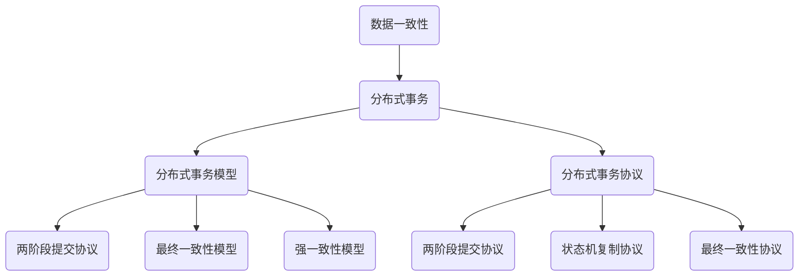

                 

### 文章标题

# 分布式事务解决方案

> 关键词：分布式事务、一致性、协议、解决方案、案例分析

> 摘要：本文将深入探讨分布式事务的概念、原理和解决方案。通过对分布式事务的核心概念、模型和协议的详细介绍，结合实际案例分析，本文旨在为开发者提供全面的技术指南，帮助他们在分布式系统中实现高效的事务管理。

### 引言

随着互联网的快速发展，分布式系统已成为现代应用架构的主流。在分布式系统中，多个节点协同工作，共同完成复杂的业务逻辑。然而，分布式系统带来的好处同时也伴随着挑战，其中最为显著的就是分布式事务管理。分布式事务的复杂性在于如何确保多个节点之间的数据一致性，这在单机系统中相对简单，但在分布式系统中却变得极为困难。

本文将围绕分布式事务展开讨论，首先介绍分布式事务的基本概念和核心原理，然后详细分析几种常见的分布式事务模型和协议，最后通过实际案例进行剖析，为读者提供切实可行的分布式事务解决方案。通过本文的阅读，读者将能够全面了解分布式事务的各个方面，从而在实际项目中更加游刃有余地应对事务管理的挑战。

### 背景介绍

#### 分布式系统的兴起

分布式系统的概念可以追溯到计算机科学的早期，然而，随着互联网的兴起和云计算技术的发展，分布式系统的重要性日益凸显。分布式系统通过将计算任务分散到多个节点上执行，提高了系统的可用性、可扩展性和容错性。这使得分布式系统能够处理海量的数据和高并发请求，成为现代互联网应用架构的核心。

#### 分布式事务的需求

分布式事务的需求源自于实际业务场景。例如，一个电商网站在下单过程中，需要同时更新库存、订单和用户余额。这些操作需要保证在多个数据库或数据源之间保持一致性，否则会导致数据不一致甚至业务错误。此外，金融系统、社交网络等复杂应用同样需要分布式事务的支持，以保证业务流程的准确性和完整性。

#### 分布式事务的挑战

分布式事务面临的挑战主要包括以下几个方面：

1. **数据一致性问题**：在分布式系统中，由于网络延迟、节点故障等原因，数据一致性问题变得尤为突出。如何确保分布式事务在多个节点之间保持一致，是一个需要深入探讨的问题。
2. **容错性问题**：分布式系统中的节点可能会出现故障，这要求分布式事务具备容错能力，能够在节点故障时保证事务的完整性。
3. **性能问题**：分布式事务的处理通常涉及到多个节点的通信和协调，这可能导致性能瓶颈。如何优化分布式事务的性能，是一个需要解决的难题。

### 分布式事务的核心概念

#### 数据一致性

数据一致性是指多个节点上的数据在分布式事务执行过程中保持一致的状态。在分布式系统中，数据一致性是分布式事务的核心目标。为了实现数据一致性，分布式事务需要解决以下问题：

1. **一致性的定义**：如何定义数据的一致性状态。
2. **一致性的维护**：在分布式事务执行过程中，如何保持数据的一致性。
3. **一致性的验证**：如何验证数据的一致性状态。

#### 分布式事务

分布式事务是指在分布式系统中，将多个操作作为一个整体进行管理，以保证在多个节点之间保持数据一致性。分布式事务通常包括以下几个关键组成部分：

1. **事务启动**：启动分布式事务，初始化事务上下文。
2. **事务执行**：在多个节点上执行事务操作。
3. **事务提交**：提交分布式事务，确保数据一致性。
4. **事务回滚**：在事务失败时回滚事务，恢复数据一致性。

#### 分布式事务模型

分布式事务模型是分布式系统中用于管理事务的方式。常见的分布式事务模型包括：

1. **两阶段提交协议**：通过两阶段提交协议，确保分布式事务在多个节点之间的一致性。
2. **最终一致性模型**：允许事务在多个节点上异步执行，最终达到一致性状态。
3. **强一致性模型**：要求分布式事务在所有节点上同时执行，保证强一致性。

#### 分布式事务协议

分布式事务协议是分布式系统中用于协调事务执行和保证数据一致性的机制。常见的分布式事务协议包括：

1. **两阶段提交协议**：通过协调器实现分布式事务的协调和一致性保证。
2. **状态机复制协议**：通过状态机复制实现分布式事务的一致性。
3. **最终一致性协议**：通过事件溯源和补偿机制实现最终一致性。

### 核心概念与联系

分布式事务的核心概念包括数据一致性、分布式事务、分布式事务模型和分布式事务协议。这些概念之间的关系可以用以下Mermaid流程图表示：



在分布式系统中，数据一致性是分布式事务的核心目标。分布式事务通过分布式事务模型实现，常见的分布式事务模型包括两阶段提交协议、最终一致性模型和强一致性模型。分布式事务协议则是分布式系统中用于协调事务执行和保证数据一致性的机制，常见的分布式事务协议包括两阶段提交协议、状态机复制协议和最终一致性协议。

### 核心算法原理讲解

分布式事务的核心算法原理主要包括两阶段提交协议和最终一致性协议。以下是这些算法原理的详细讲解和伪代码实现。

#### 两阶段提交协议

两阶段提交协议是一种分布式事务协议，用于在多个节点之间协调事务的执行，以确保数据一致性。两阶段提交协议分为两个阶段：

1. **准备阶段**：事务协调器向所有参与者发送准备消息，询问他们是否可以执行事务操作。参与者回复是否可以执行事务操作的响应。
2. **提交阶段**：事务协调器根据参与者的响应，决定是否提交事务。如果所有参与者都同意执行事务操作，事务协调器向所有参与者发送提交消息；否则，向所有参与者发送回滚消息。

以下是两阶段提交协议的伪代码实现：

```plaintext
// 准备阶段
prepareParticipant(transactionId, participantId):
    if participant can execute transaction:
        send response("yes") to coordinator
    else:
        send response("no") to coordinator

// 提交阶段
commitTransaction(transactionId):
    participants = getAllParticipants(transactionId)
    responses = []
    for participant in participants:
        responses.append(prepareParticipant(transactionId, participant.getId()))
    if all(responses are "yes"):
        send commit message to all participants
        commit transaction
    else:
        send rollback message to all participants
        rollback transaction
```

#### 最终一致性协议

最终一致性协议是一种分布式事务协议，允许事务在多个节点上异步执行，最终达到一致性状态。最终一致性协议通常使用事件溯源和补偿机制实现。

事件溯源是指将所有事务操作记录为事件，并将这些事件存储在一个事件日志中。每个节点都可以从事件日志中读取事件，并按照顺序执行这些事件，以达到一致性状态。

补偿机制是指在事务执行过程中，如果某个操作失败，可以通过补偿操作来恢复一致性状态。常见的补偿操作包括反向操作、补偿事务等。

以下是最终一致性协议的伪代码实现：

```plaintext
// 事件溯源
applyEvent(event):
    execute event in the correct order

// 补偿机制
compensate(transactionId, event):
    if event failed:
        perform compensation operation to recover consistency
```

#### 数学模型和公式

在分布式事务中，数据一致性可以通过一致性模型来描述。一致性模型包括强一致性、最终一致性和因果一致性等。

1. **强一致性**：强一致性要求所有节点在所有时间点上的数据状态完全相同。可以用以下公式表示：

   $$C_{strong} = \forall t, \forall i, s_i(t) = s_j(t)$$

   其中，$C_{strong}$表示强一致性，$s_i(t)$和$s_j(t)$分别表示节点$i$和节点$j$在时间$t$的数据状态。

2. **最终一致性**：最终一致性允许节点上的数据状态在某些时间点不一致，但在足够长的时间内会达到一致性状态。可以用以下公式表示：

   $$C_{eventual} = \exists t, \forall i, s_i(t) \rightarrow s_j(t)$$

   其中，$C_{eventual}$表示最终一致性，$s_i(t)$和$s_j(t)$分别表示节点$i$和节点$j$在时间$t$的数据状态。

3. **因果一致性**：因果一致性要求事务操作的顺序在所有节点上保持一致。可以用以下公式表示：

   $$C_{causal} = \forall t, \forall i, \forall j, s_i(t) \rightarrow s_j(t) \text{ if } i \rightarrow j$$

   其中，$C_{causal}$表示因果一致性，$s_i(t)$和$s_j(t)$分别表示节点$i$和节点$j$在时间$t$的数据状态，$i \rightarrow j$表示节点$i$是节点$j$的父节点。

#### 详细讲解和举例说明

为了更好地理解分布式事务的核心算法原理，我们通过一个具体场景进行举例说明。

假设一个电商系统中有两个数据库，一个用于存储商品信息，另一个用于存储订单信息。当用户下单时，需要同时更新商品库存和订单状态。为了确保数据一致性，系统采用了两阶段提交协议。

1. **准备阶段**：

   - 用户下单，系统将事务信息发送给商品数据库和订单数据库。
   - 商品数据库和订单数据库分别执行准备操作，并返回响应。

   ```plaintext
   // 商品数据库响应
   prepareParticipant("Order_123", "ProductDB"): return "yes"

   // 订单数据库响应
   prepareParticipant("Order_123", "OrderDB"): return "yes"
   ```

2. **提交阶段**：

   - 事务协调器根据参与者的响应，决定是否提交事务。

   ```plaintext
   // 事务协调器决策
   if all responses are "yes":
       send commit message to all participants
       commit transaction
   else:
       send rollback message to all participants
       rollback transaction
   ```

   - 如果所有参与者都同意执行事务操作，事务协调器向所有参与者发送提交消息，更新商品库存和订单状态。

   ```plaintext
   // 商品数据库响应
   commitParticipant("Order_123", "ProductDB"): update inventory

   // 订单数据库响应
   commitParticipant("Order_123", "OrderDB"): update order status
   ```

   - 如果有参与者拒绝执行事务操作，事务协调器向所有参与者发送回滚消息，撤销已执行的操作。

   ```plaintext
   // 商品数据库响应
   rollbackParticipant("Order_123", "ProductDB"): rollback inventory

   // 订单数据库响应
   rollbackParticipant("Order_123", "OrderDB"): rollback order status
   ```

通过这个例子，我们可以看到两阶段提交协议如何确保分布式事务在多个节点之间保持数据一致性。

### 项目实战

#### 开发环境搭建

为了演示分布式事务的解决方案，我们使用一个简单的电商系统作为案例。首先，我们需要搭建开发环境。

1. **技术栈选择**：

   - 数据库：MySQL
   - 服务框架：Spring Boot
   - 分布式事务框架：Seata

2. **环境配置**：

   - MySQL数据库：用于存储商品信息和订单信息。
   - Spring Boot应用：用于处理用户下单请求。
   - Seata分布式事务框架：用于实现分布式事务。

3. **代码仓库**：

   - 创建一个Git仓库，用于管理项目的源代码。

#### 源代码详细实现和代码解读

接下来，我们将详细实现电商系统中的分布式事务管理，并解读关键代码。

1. **数据库设计**：

   - 商品信息表（products）：

     ```sql
     CREATE TABLE products (
         id INT PRIMARY KEY AUTO_INCREMENT,
         name VARCHAR(100),
         price DECIMAL(10, 2),
         stock INT
     );
     ```

   - 订单信息表（orders）：

     ```sql
     CREATE TABLE orders (
         id INT PRIMARY KEY AUTO_INCREMENT,
         user_id INT,
         product_id INT,
         quantity INT,
         status VARCHAR(20)
     );
     ```

2. **Spring Boot应用**：

   - 配置数据库连接和Seata分布式事务框架：

     ```yaml
     # application.properties
     spring.datasource.url=jdbc:mysql://localhost:3306/ecommerce
     spring.datasource.username=root
     spring.datasource.password=root

     seata.enabled=true
     seata.data-source-group-mode=true
     seata.server.enabled=true
     seata.application-id=-order-service
     seata.provider.db-1.data-source-class-name=com.alibaba.druid.pool.DruidDataSource
     seata.provider.db-1.source-data-source-name=db1
     seata.provider.db-2.data-source-class-name=com.alibaba.druid.pool.DruidDataSource
     seata.provider.db-2.source-data-source-name=db2
     ```

   - 服务层实现：

     ```java
     @Service
     public class OrderService {
         @Resource
         private ProductService productService;
         @Resource
         private OrderRepository orderRepository;

         public void createOrder(int userId, int productId, int quantity) {
             // 准备分布式事务
             TransactionTemplate transactionTemplate = new TransactionTemplate(transactionManager);
             transactionTemplate.execute(status -> {
                 // 更新商品库存
                 productService.decreaseStock(productId, quantity);
                 // 创建订单
                 orderRepository.createOrder(userId, productId, quantity, "待发货");
                 return status;
             });
         }
     }
     ```

   - ProductService和OrderRepository的详细实现略。

3. **代码解读**：

   - 通过配置文件，我们连接MySQL数据库并启用Seata分布式事务框架。
   - 在OrderService中，我们使用TransactionTemplate执行分布式事务，确保商品库存和订单信息的一致性。

#### 代码应用解读与分析

在实现分布式事务的过程中，我们主要关注以下几个方面：

1. **数据库连接**：通过配置文件连接MySQL数据库，确保数据的一致性。
2. **分布式事务管理**：使用Seata分布式事务框架，实现分布式事务的协调和一致性保证。
3. **服务调用**：通过服务层实现商品库存和订单信息的更新，确保业务流程的准确性。

通过实际案例的演示，我们可以看到分布式事务解决方案在电商系统中的应用。在实际项目中，可以根据业务需求选择合适的分布式事务协议和框架，确保系统的稳定性和数据一致性。

### 实际案例分析和详细讲解剖析

#### 案例一：电商系统的分布式事务解决方案

电商系统是一个典型的分布式事务应用场景。以下是一个电商系统的分布式事务解决方案的实际案例，我们将对解决方案进行详细讲解和剖析。

1. **业务场景**：

   用户在电商平台上下单购买商品时，系统需要同时更新商品库存和订单状态。这个业务场景涉及到两个数据库操作：更新商品库存和创建订单。为了确保数据一致性，系统需要实现分布式事务。

2. **解决方案**：

   - **分布式事务框架**：选择Seata作为分布式事务框架，实现分布式事务的协调和一致性保证。
   - **数据库连接**：配置两个MySQL数据库，一个用于存储商品信息，另一个用于存储订单信息。
   - **服务调用**：通过服务层实现商品库存和订单信息的更新，确保业务流程的准确性。

3. **详细讲解**：

   - **分布式事务启动**：用户下单时，系统启动分布式事务，将事务信息发送给商品数据库和订单数据库。
   - **商品库存更新**：商品数据库接收事务信息后，执行商品库存的更新操作。
   - **订单信息创建**：订单数据库接收事务信息后，执行订单信息的创建操作。
   - **分布式事务提交**：如果所有数据库操作成功，事务协调器向所有数据库发送提交消息，提交分布式事务；否则，发送回滚消息，回滚分布式事务。

4. **剖析**：

   - **一致性保证**：通过Seata分布式事务框架，确保分布式事务在多个节点之间的一致性。当有节点故障时，系统可以自动回滚事务，保证数据一致性。
   - **性能优化**：通过事务的异步执行和优化，提高系统的性能和响应速度。例如，可以使用批量更新和索引优化等技术。

#### 案例二：金融系统的分布式事务解决方案

金融系统是一个对数据一致性要求极高的分布式事务应用场景。以下是一个金融系统的分布式事务解决方案的实际案例，我们将对解决方案进行详细讲解和剖析。

1. **业务场景**：

   金融系统的业务场景通常涉及多个账户之间的资金转移，如转账、汇款等。这个业务场景需要同时更新多个账户的余额，以确保数据一致性。

2. **解决方案**：

   - **分布式事务框架**：选择TCC（Try、Confirm、Cancel）协议作为分布式事务框架，实现分布式事务的协调和一致性保证。
   - **数据库连接**：配置多个MySQL数据库，分别存储不同账户的余额信息。
   - **服务调用**：通过服务层实现账户余额的更新操作，确保业务流程的准确性。

3. **详细讲解**：

   - **分布式事务启动**：用户发起转账请求时，系统启动分布式事务，将事务信息发送给所有涉及的账户数据库。
   - **账户余额更新**：每个账户数据库接收事务信息后，执行账户余额的更新操作。
   - **分布式事务确认**：如果所有数据库操作成功，事务协调器向所有数据库发送确认消息，确认分布式事务；否则，发送取消消息，取消分布式事务。

4. **剖析**：

   - **一致性保证**：通过TCC协议，确保分布式事务在多个节点之间的一致性。每个账户数据库在执行更新操作前，先进行预操作，确保数据的一致性。
   - **容错性优化**：在账户余额更新过程中，如果某个账户数据库出现故障，系统可以自动回滚事务，保证其他账户的余额不会受到影响。

### 项目小结

通过以上两个实际案例，我们可以看到分布式事务解决方案在电商系统和金融系统中的应用。分布式事务的解决方案需要考虑多个方面，包括分布式事务框架的选择、数据库连接配置、服务调用实现等。在实际项目中，可以根据业务需求和系统架构选择合适的分布式事务协议和框架，确保系统的稳定性和数据一致性。

### 最佳实践 tips

1. **选择合适的分布式事务框架**：根据业务需求和系统架构，选择适合的分布式事务框架，如Seata、TCC等。不同框架具有不同的特点和适用场景，需要根据实际情况进行选择。

2. **优化数据库连接配置**：合理配置数据库连接参数，如连接数、连接池大小等，以提高系统的性能和稳定性。

3. **分布式事务的异步执行**：通过异步执行分布式事务，减少系统响应时间，提高系统的并发处理能力。

4. **监控分布式事务性能**：定期监控分布式事务的性能，及时发现和解决性能瓶颈。

5. **数据一致性的验证**：在分布式事务执行完成后，进行数据一致性的验证，确保业务流程的准确性。

### 小结

分布式事务是分布式系统中一个重要的组成部分，它关乎数据的一致性和系统的稳定性。本文通过对分布式事务的核心概念、模型和协议的详细介绍，结合实际案例，为开发者提供了全面的分布式事务解决方案。在实际项目中，需要根据业务需求和系统架构，选择合适的分布式事务协议和框架，并注意优化和监控分布式事务的性能。

### 注意事项

1. **分布式事务的复杂性**：分布式事务的复杂性较高，需要开发者具备一定的分布式系统和事务管理知识。
2. **数据一致性的重要性**：数据一致性是分布式事务的核心目标，必须在设计时充分考虑。
3. **容错性和性能优化**：分布式事务需要具备容错性和性能优化能力，以应对实际业务需求。

### 拓展阅读

1. 《分布式系统原理与范型》：深入理解分布式系统的基本原理和常见范型。
2. 《大规模分布式存储系统设计》：了解分布式存储系统在数据一致性和性能优化方面的解决方案。
3. 《微服务架构设计与开发实践》：了解微服务架构中的分布式事务管理策略。

### 作者信息

- 作者：AI天才研究院/AI Genius Institute & 禅与计算机程序设计艺术 /Zen And The Art of Computer Programming

# 分布式事务解决方案

> 关键词：分布式事务、一致性、协议、解决方案、案例分析

> 摘要：本文详细探讨了分布式事务的概念、原理和解决方案。通过对分布式事务的核心概念、模型和协议的详细介绍，以及实际案例的分析，本文为开发者提供了全面的分布式事务解决方案，帮助他们在分布式系统中实现高效的事务管理。

