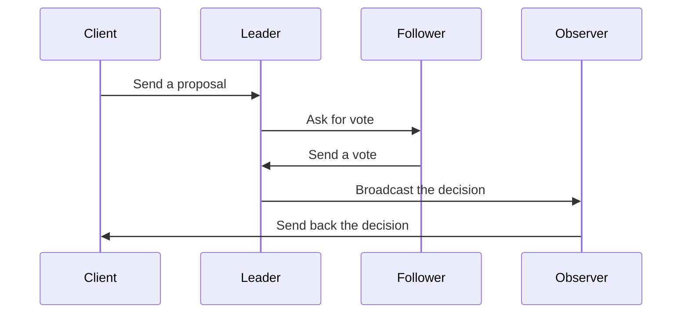

                 


### 分布式共识算法：Paxos、Raft等的实现与应用

**关键词：** 分布式系统，共识算法，Paxos，Raft，PBFT，分布式数据库，分布式存储系统。

**摘要：** 
本文将对分布式共识算法进行深入探讨，特别是Paxos、Raft等算法的实现与应用。首先，我们将了解分布式系统的基础知识，包括其概念与特点，以及共识算法在分布式系统中的作用。接着，我们将详细解析Paxos算法的原理，通过伪代码展示其执行过程，并分析其优缺点。随后，我们将介绍Raft算法，同样使用伪代码来阐述其工作原理，并比较Paxos和Raft的异同。此外，还将介绍其他几种共识算法，如PBFT。最后，我们将探讨分布式共识算法在实际应用中的案例，如分布式数据库和分布式存储系统，并展望共识算法的未来发展趋势。

## 第一部分：分布式共识算法概述

### 1. 分布式系统基础

#### 1.1. 分布式系统的概念与特点

分布式系统是一组互相独立、地理位置不同的计算机节点通过通信网络相互协作，共同完成一个任务或提供一项服务的系统。与集中式系统相比，分布式系统具有以下特点：

- **高可用性**：系统中任意一个节点故障不会影响整个系统的正常运行。
- **高可扩展性**：系统可以根据需求动态增加或减少节点，从而提高处理能力和存储容量。
- **高容错性**：系统能够自动检测并隔离故障节点，继续正常运行。
- **分布式一致性**：系统中的所有节点对同一数据保持一致的视图。

#### 1.1.2. 分布式系统的挑战

分布式系统在设计过程中面临许多挑战，其中最重要的挑战之一是实现分布式一致性。分布式一致性指的是在分布式系统中，所有节点都能看到同一数据视图，并且在某个节点上的操作能够在其他节点上得到正确反映。为了实现分布式一致性，需要解决以下问题：

- **数据复制**：如何在多个节点之间复制数据，并确保数据的一致性。
- **网络延迟**：网络延迟会导致节点之间的通信延迟，需要设计算法来处理这种延迟。
- **分区**：网络分区指的是节点之间的通信中断，系统需要能够容忍分区并最终达成一致。
- **并发控制**：如何在多个节点上同时执行操作，并确保操作的顺序正确。

#### 1.2. 共识算法在分布式系统中的作用

共识算法是分布式系统中实现分布式一致性的关键机制。共识算法的目标是确保分布式系统中的所有节点能够在同一数据视图上达成一致。在分布式系统中，多个节点需要协调工作，共同决定某个值或某个操作的结果。共识算法通过一系列协议和规则，使节点能够达成共识。

共识算法在分布式系统中的作用包括：

- **保证数据一致性**：共识算法确保分布式系统中所有节点的数据视图是一致的。
- **提高容错性**：共识算法能够自动检测并隔离故障节点，从而提高系统的容错性。
- **防止数据冲突**：共识算法通过协调多个节点的操作，防止数据冲突发生。
- **实现分布式决策**：共识算法允许分布式系统中的节点共同做出决策，而不依赖于中心化的控制。

#### 1.2.1. 共识算法的定义

共识算法是一组协议和规则，用于在分布式系统中多个节点之间达成一致。共识算法的核心目标是在可能存在故障、网络延迟和分区等情况下，确保所有节点对同一数据或同一操作结果保持一致。

共识算法通常包括以下关键概念：

- **参与者**：参与共识算法的节点集合。
- **领导者**：负责协调共识过程的节点，通常由选举产生。
- **日志**：记录系统操作和状态的日志，用于恢复和验证。
- **一致性条件**：确保分布式系统中所有节点对同一数据或同一操作结果保持一致的约束条件。

#### 1.2.2. 共识算法的重要性

共识算法在分布式系统中的重要性不可忽视。以下是共识算法的重要性体现：

- **高可用性**：共识算法能够自动检测并隔离故障节点，从而提高系统的可用性。
- **高可扩展性**：共识算法允许系统动态增加或减少节点，从而提高处理能力和存储容量。
- **高容错性**：共识算法能够容忍分区和节点故障，确保系统继续正常运行。
- **分布式决策**：共识算法允许分布式系统中的节点共同做出决策，而不依赖于中心化的控制。

总的来说，共识算法是分布式系统中实现分布式一致性的关键机制，对于系统的可用性、可扩展性和容错性具有重要意义。

### Paxos算法原理讲解

#### 2.1. Paxos算法概述

Paxos算法是由莱斯利·兰伯特（Leslie Lamport）在1990年提出的一种分布式一致性算法。Paxos算法的主要目标是在一个可能存在故障节点的分布式系统中，确保多个节点能够在某个值上达成一致。Paxos算法是一种基于消息传递的算法，通过一系列协议和规则，使节点能够达成共识。

#### 2.1.1. Paxos算法的核心思想

Paxos算法的核心思想是将分布式一致性问题分解为多个子问题，每个子问题负责选择一个值。具体来说，Paxos算法分为两个阶段：

- **准备阶段（Prepare phase）**：提议者（Proposer）向其他节点发送一个提案（Proposal），请求它们准备投票。
- **接受阶段（Accept phase）**：提议者根据其他节点的反馈，选择一个值进行接受，并广播给其他节点。

通过这两个阶段的反复执行，Paxos算法最终能够在多个节点之间达成一致。

#### 2.1.2. Paxos算法的基本角色

在Paxos算法中，参与者（Participants）分为三种角色：

- **提议者（Proposer）**：负责提出提案，并协调其他节点进行投票。
- **接受者（Acceptor）**：负责接收提议者的提案，并决定是否接受。
- **学习者（Learner）**：负责学习最终的决策结果。

#### 2.2. Paxos算法详细解析

Paxos算法的详细解析如下：

##### 2.2.1.1. Prepare阶段

在Prepare阶段，提议者（Proposer）执行以下步骤：

1. 提议者选择一个提案编号（proposal number）。
2. 提议者向所有接受者（Acceptor）发送Prepare请求，请求它们准备投票。
3. 当接受者收到Prepare请求时，它执行以下操作：
   - 如果接受者的最高提案编号小于当前收到的提案编号，则接受者将最高提案编号更新为当前提案编号，并返回一个承诺（Promise）。
   - 如果接受者的最高提案编号大于或等于当前提案编号，则接受者不做出承诺，并返回一个拒绝（Refuse）。

##### 2.2.1.2. Promise阶段

在Promise阶段，提议者（Proposer）执行以下步骤：

1. 提议者等待至少一个接受者返回承诺（Promise）。
2. 当提议者收到至少一个接受者的承诺后，它执行以下操作：
   - 提议者将提案值设置为收到承诺中最大的提案值。
   - 提议者向所有接受者发送Accept请求，请求它们接受该提案。

##### 2.2.1.3. Accept阶段

在Accept阶段，接受者（Acceptor）执行以下步骤：

1. 当接受者收到Accept请求时，它执行以下操作：
   - 如果接受者的最高提案编号小于或等于请求中的提案编号，则接受者接受该提案，并将提案值更新为请求中的提案值。
   - 如果接受者的最高提案编号大于请求中的提案编号，则接受者拒绝该提案。

##### 2.2.1.4. Learn阶段

在Learn阶段，学习者（Learner）执行以下步骤：

1. 当接受者接受一个提案后，它将提案值通知学习者。
2. 学习者记录下接受者的提案值，并将其视为最终决策结果。

通过以上四个阶段的反复执行，Paxos算法最终能够在多个节点之间达成一致。

#### 2.3. Paxos算法的优缺点分析

##### 2.3.1. Paxos算法的优点

Paxos算法具有以下优点：

- **容错性**：Paxos算法能够容忍一定比例的节点故障，确保系统继续正常运行。
- **高可用性**：Paxos算法能够保证系统在大多数情况下快速达成一致，提高系统的可用性。
- **可扩展性**：Paxos算法能够支持大规模分布式系统，通过增加节点来提高处理能力和存储容量。
- **可理解性**：Paxos算法的设计简洁，易于理解和实现。

##### 2.3.2. Paxos算法的缺点

Paxos算法也存在一些缺点：

- **通信开销**：Paxos算法需要大量的通信开销，尤其是在处理大量提案时。
- **响应延迟**：Paxos算法的响应延迟较大，尤其是在网络延迟较大的情况下。
- **性能瓶颈**：Paxos算法在处理大量并发提案时，容易出现性能瓶颈。

总的来说，Paxos算法是一种高效可靠的分布式一致性算法，但在某些场景下，其通信开销和响应延迟可能成为性能瓶颈。

### Raft算法原理讲解

#### 3.1. Raft算法概述

Raft算法是由Diego Ongaro和John Ousterhout在2013年提出的一种分布式一致性算法，旨在简化Paxos算法的实现，并提高其可理解性。Raft算法在分布式系统中用于确保多个节点之间的数据一致性。

#### 3.1.1. Raft算法的核心思想

Raft算法的核心思想是通过明确领导者和跟随者的角色分工，简化一致性算法的实现。Raft算法将一致性算法分为三个关键部分：领导者选举、日志复制和心跳机制。

- **领导者选举（Leader Election）**：Raft算法通过领导者选举来选择一个领导者节点，负责处理客户端请求和日志复制。
- **日志复制（Log Replication）**：领导者节点将日志条目复制到所有跟随者节点，确保所有节点的日志是一致的。
- **心跳机制（Heartbeat）**：跟随者节点通过发送心跳消息来保持与领导者的连接，并在领导者失败时触发新一轮的领导者选举。

#### 3.1.2. Raft算法的基本角色

在Raft算法中，参与者（Participants）分为以下三种角色：

- **领导者（Leader）**：负责处理客户端请求，将日志条目复制到跟随者节点。
- **跟随者（Follower）**：接收领导者的日志条目，并将其复制到本地日志。
- **候选人（Candidate）**：在领导者选举过程中参与投票，成为潜在的领导者。

#### 3.2. Raft算法详细解析

Raft算法的详细解析如下：

##### 3.2.1.1. Leader选举

在Raft算法中，领导者选举是一个关键步骤，用于选择一个领导者节点。领导者选举过程如下：

1. **初始化**：所有节点初始状态均为跟随者状态。
2. **选举触发**：当一个节点发现自己的领导 lease（租约）即将过期时，它开始触发选举过程。节点进入候选人状态，并给其他节点发送投票请求。
3. **投票请求**：候选人节点向其他节点发送投票请求，请求它们投票支持自己成为领导者。
4. **投票响应**：当节点收到投票请求时，它执行以下操作：
   - 如果当前节点是领导者或候选人，则拒绝投票。
   - 如果当前节点是跟随者，且它的日志条目至少与请求节点的日志条目相同，则投票支持请求节点成为领导者。
5. **选举成功**：当一个候选人在接收到的投票数超过半数时，它成为领导者，并发送心跳消息给其他节点，以保持领导状态。
6. **选举失败**：如果在一定时间内未成功选举出领导者，候选节点重新进入跟随者状态，并等待新一轮选举。

##### 3.2.1.2. 日志复制

在Raft算法中，领导者节点负责处理客户端请求，并将请求转换为日志条目，然后将其复制到跟随者节点。日志复制过程如下：

1. **处理客户端请求**：领导者节点接收客户端请求，将其转换为日志条目，并添加到本地日志。
2. **发送日志条目**：领导者节点将日志条目发送给所有跟随者节点。
3. **等待确认**：领导者节点等待跟随者节点确认已接收日志条目。
4. **提交日志条目**：当领导者节点收到半数以上的确认响应时，将日志条目提交到状态机，执行相应操作。
5. **通知跟随者节点**：领导者节点将提交结果通知给所有跟随者节点。

##### 3.2.1.3. 心跳机制

在Raft算法中，心跳机制用于保持领导者节点和跟随者节点之间的连接。心跳机制如下：

1. **领导者发送心跳**：领导者节点定期向跟随者节点发送心跳消息，以保持连接。
2. **跟随者响应心跳**：跟随者节点接收到心跳消息后，返回确认消息给领导者节点。
3. **检测领导者失败**：如果跟随者节点在一定时间内未收到心跳消息，它认为领导者节点已失败，并触发新一轮的领导者选举。

通过领导者选举、日志复制和心跳机制的协同工作，Raft算法能够确保分布式系统中的数据一致性。

#### 3.3. Raft算法的优缺点分析

##### 3.3.1. Raft算法的优点

Raft算法具有以下优点：

- **简单易理解**：Raft算法相对于Paxos算法更加简单易懂，易于实现和调试。
- **高效性**：Raft算法在处理并发请求时性能更优，响应延迟较低。
- **稳定性**：Raft算法通过心跳机制和领导者选举，能够确保系统的稳定性和可靠性。

##### 3.3.2. Raft算法的缺点

Raft算法也存在一些缺点：

- **通信开销**：Raft算法相对于Paxos算法需要更多的通信开销，尤其是在高并发场景下。
- **领导切换延迟**：在领导者节点失败时，Raft算法需要一定时间进行领导者选举，可能会出现短暂的不可用状态。

总的来说，Raft算法是一种高效、稳定的分布式一致性算法，具有简单易理解、高效性和稳定性等优点，但也存在一定的通信开销和领导切换延迟等问题。

### 其他分布式共识算法介绍

除了Paxos和Raft算法外，还有其他几种分布式共识算法，如PBFT（Practical Byzantine Fault Tolerance）和ZBFT（Zookeeper-Based Fault Tolerance）等。这些算法在分布式系统中也发挥着重要作用，下面将简要介绍这些算法的基本原理和特点。

#### 4.1. PBFT算法

PBFT（Practical Byzantine Fault Tolerance）算法是一种容错性较强的分布式共识算法，由Maurice Herlihy和Nickolai Zeldovich提出。PBFT算法能够容忍系统中一定比例的恶意节点，并且在发生网络分区时，仍能保证一致性。

#### 4.1.1. PBFT算法概述

PBFT算法的基本思想是，通过一系列消息传递协议，在多个节点之间达成一致。PBFT算法的主要特点包括：

- **容错性**：PBFT算法能够容忍系统中最多1/3的节点出现故障或恶意行为。
- **高效性**：PBFT算法的响应时间较短，能够快速达成一致。
- **网络分区容忍性**：PBFT算法能够在网络分区情况下继续运行，并最终恢复一致性。

#### 4.1.2. PBFT算法的基本原理

PBFT算法的基本原理如下：

1. **初始化**：系统中的节点随机选择一个领导者节点。
2. **提交请求**：当一个节点需要提交请求时，它将请求发送给领导者节点。
3. **处理请求**：领导者节点接收请求后，将其发送给其他节点，并等待半数以上的节点确认。
4. **执行请求**：当领导者节点收到半数以上节点的确认后，它执行请求，并将结果发送给所有节点。
5. **恢复一致性**：在网络分区情况下，节点通过相互发送消息，尝试恢复一致性。

#### 4.2. ZBFT算法

ZBFT（Zookeeper-Based Fault Tolerance）算法是基于Zookeeper实现的一种分布式共识算法。ZBFT算法利用Zookeeper的分布式锁机制，实现节点间的协调和一致性。

#### 4.2.1. ZBFT算法概述

ZBFT算法的主要特点包括：

- **依赖Zookeeper**：ZBFT算法依赖于Zookeeper，利用Zookeeper的分布式锁和监控功能实现节点间的协调。
- **简单易用**：ZBFT算法相对简单，易于实现和部署。
- **高可用性**：ZBFT算法通过Zookeeper的监控功能，能够自动检测和恢复节点故障。

#### 4.2.2. ZBFT算法的基本原理

ZBFT算法的基本原理如下：

1. **初始化**：系统中的节点启动后，加入Zookeeper集群。
2. **节点协调**：节点通过Zookeeper的分布式锁实现协调，确保同一时刻只有一个节点能够执行特定操作。
3. **请求处理**：当一个节点需要处理请求时，它首先获取分布式锁，然后处理请求。
4. **请求确认**：节点将处理结果发送给其他节点，并等待确认。
5. **恢复一致性**：在发生网络分区或节点故障时，节点通过Zookeeper的监控功能尝试恢复一致性。

总的来说，PBFT和ZBFT算法在分布式系统中具有重要作用。PBFT算法能够容忍一定比例的恶意节点，并在网络分区情况下保持一致性；ZBFT算法则利用Zookeeper的分布式锁机制，实现节点间的协调和一致性。这些算法为分布式系统提供了一种可靠的方式，确保数据的一致性和系统的稳定性。

### 分布式共识算法实现与应用案例

#### 5.1. Paxos算法在分布式数据库中的应用

分布式数据库是一种常见的技术，用于在大规模系统中存储和处理海量数据。为了确保数据的一致性，分布式数据库通常采用分布式共识算法，如Paxos算法。Paxos算法在分布式数据库中的应用主要体现在以下几个方面：

#### 5.1.1. 分布式数据库的基本概念

分布式数据库是一种将数据分布在多个节点上的数据库系统。分布式数据库的主要特点包括：

- **数据分布**：将数据存储在多个节点上，从而提高系统的可用性和可扩展性。
- **数据复制**：为了保证数据的一致性，分布式数据库通常采用数据复制技术，将数据复制到多个节点。
- **数据分片**：将数据表或索引等拆分成多个片段，分布到不同的节点上。

#### 5.1.2. Paxos算法在分布式数据库中的应用案例

Paxos算法在分布式数据库中的应用主要体现为数据一致性的保障。以下是Paxos算法在分布式数据库中的两个应用案例：

##### 案例一：主从复制

在主从复制架构中，Paxos算法用于保证主节点和从节点之间的一致性。具体实现步骤如下：

1. **主节点提交事务**：主节点接收到客户端的事务请求后，将其转化为Paxos提案，并发送给从节点。
2. **从节点处理提案**：从节点收到提案后，根据Paxos算法的规则进行处理，并将处理结果返回给主节点。
3. **主节点确认事务**：主节点收到从节点的确认响应后，将事务提交到本地数据库，并通知从节点进行数据更新。

通过Paxos算法的协调，主从复制架构能够确保主节点和从节点之间的数据一致性。

##### 案例二：分布式事务处理

在分布式数据库中，Paxos算法用于处理分布式事务，确保多个节点之间的事务一致性。具体实现步骤如下：

1. **事务初始化**：分布式事务开始时，首先选取一个协调节点，负责协调整个事务的执行。
2. **提案提交**：协调节点将事务的每个操作转化为Paxos提案，并发送给参与事务的节点。
3. **节点处理提案**：参与事务的节点根据Paxos算法的规则进行处理，并将处理结果返回给协调节点。
4. **事务提交**：协调节点收到所有节点的确认响应后，将事务提交到本地数据库，并通知所有节点进行数据更新。

通过Paxos算法的协调，分布式事务处理能够确保多个节点之间的事务一致性。

总的来说，Paxos算法在分布式数据库中发挥了重要作用，通过协调多个节点的操作，保证了数据的一致性和系统的可靠性。在实际应用中，Paxos算法可以根据不同的需求进行定制化实现，以满足分布式数据库的性能和一致性要求。

#### 5.2. Raft算法在分布式存储系统中的应用

分布式存储系统是一种将数据存储在多个节点上的系统，用于提高数据存储的容量、可用性和性能。为了确保数据的一致性，分布式存储系统通常采用分布式共识算法，如Raft算法。Raft算法在分布式存储系统中得到了广泛应用，下面将介绍Raft算法在分布式存储系统中的应用案例。

#### 5.2.1. 分布式存储系统的基本概念

分布式存储系统是一种将数据分布在多个节点上的存储系统，具有以下特点：

- **数据分布**：将数据存储在多个节点上，从而提高系统的可用性和可扩展性。
- **数据冗余**：为了保证数据的可靠性，分布式存储系统通常采用数据冗余技术，将数据复制到多个节点。
- **负载均衡**：通过将数据分散存储在多个节点上，实现负载均衡，提高系统的性能。

#### 5.2.2. Raft算法在分布式存储系统中的应用案例

Raft算法在分布式存储系统中的应用主要体现在以下几个方面：

##### 案例一：数据一致性保障

在分布式存储系统中，数据一致性是确保系统可靠性的关键。Raft算法通过明确领导者节点和跟随者节点的角色分工，实现了数据的一致性保障。具体实现步骤如下：

1. **初始化**：分布式存储系统启动时，节点初始化为跟随者状态。
2. **领导者选举**：当一个节点成为领导者节点后，它负责处理客户端的读写请求，并将请求广播给其他节点。
3. **日志复制**：领导者节点将接收到的请求转化为日志条目，并复制到其他节点。
4. **心跳检测**：领导者节点定期发送心跳消息给跟随者节点，以确保连接的稳定。
5. **数据更新**：当跟随者节点接收到领导者节点的日志条目后，将其更新到本地存储。

通过Raft算法的协调，分布式存储系统能够确保数据的一致性和可靠性。

##### 案例二：数据冗余与恢复

分布式存储系统通常采用数据冗余技术，以提高数据的可靠性。Raft算法在数据冗余和恢复方面发挥了重要作用。具体实现步骤如下：

1. **数据复制**：分布式存储系统将数据复制到多个节点上，从而实现数据的冗余。
2. **故障检测**：节点定期检测其他节点的状态，一旦发现节点故障，立即触发领导者选举过程。
3. **数据恢复**：在领导者节点选举成功后，新的领导者节点负责将故障节点的数据恢复到最新状态，并重新复制到其他节点。

通过Raft算法的协调，分布式存储系统能够实现数据的冗余和快速恢复。

总的来说，Raft算法在分布式存储系统中发挥了关键作用，通过领导者选举、日志复制和心跳机制，实现了数据的一致性和可靠性。在实际应用中，Raft算法可以根据不同的需求进行定制化实现，以满足分布式存储系统的性能和可靠性要求。

### 分布式共识算法的未来发展趋势

分布式共识算法在分布式系统中的应用越来越广泛，随着技术的发展，分布式共识算法也在不断演进。以下将探讨分布式共识算法的未来发展趋势。

#### 6.1. 分布式共识算法的研究热点

当前，分布式共识算法的研究热点主要集中在以下几个方面：

1. **共识算法的优化方向**：如何进一步优化共识算法的通信开销、响应延迟和性能，以满足不同场景的需求。

2. **共识算法的安全性问题**：如何增强共识算法的安全性，防止恶意节点或外部攻击对系统造成破坏。

3. **共识算法的可扩展性**：如何实现共识算法在大规模分布式系统中的高效运行，以满足不断增长的系统需求。

4. **共识算法的应用场景扩展**：如何将共识算法应用于新的领域，如物联网、区块链等。

5. **共识算法的联邦学习**：如何将共识算法与联邦学习相结合，实现多方数据的协同学习和隐私保护。

#### 6.1.1. 共识算法的优化方向

在共识算法的优化方向上，研究主要集中在以下几个方面：

- **通信优化**：通过减少消息传递的次数和大小，降低通信开销。例如，使用高效的消息压缩算法和流水线处理机制。

- **响应时间优化**：通过优化算法的执行流程和降低网络延迟，提高系统的响应时间。例如，采用分布式锁和预提交机制。

- **性能优化**：通过优化数据结构和算法逻辑，提高系统的整体性能。例如，使用并行计算和分布式计算技术。

#### 6.1.2. 共识算法的新兴应用场景

随着技术的发展，分布式共识算法的应用场景也在不断扩展。以下是一些新兴的应用场景：

- **区块链技术**：分布式共识算法是区块链技术的重要组成部分，随着区块链技术的广泛应用，对共识算法的需求也在不断增长。

- **物联网（IoT）**：物联网中节点数量庞大，分布式共识算法可用于实现数据一致性和设备协调，提高物联网系统的可靠性和性能。

- **联邦学习**：联邦学习是一种多方协同学习的技术，分布式共识算法可用于实现多方数据的协同学习和隐私保护。

- **分布式数据存储**：分布式数据存储系统需要确保数据的一致性和可靠性，分布式共识算法可提供有效的数据一致性保障。

- **智能合约**：智能合约是一种自动执行合约条款的计算机程序，分布式共识算法可用于确保智能合约的执行一致性。

总的来说，分布式共识算法在分布式系统中的应用前景广阔，随着技术的发展和应用场景的扩展，分布式共识算法将在更多领域发挥重要作用。未来，分布式共识算法的研究将更加注重优化和安全性，以满足不同场景的需求，推动分布式系统的发展。

### 附录

#### 附录 A：共识算法相关资源与工具

A.1. 共识算法相关书籍推荐

- 《分布式系统一致性原理与实践》
- 《Paxos算法原理与实现》
- 《Raft算法设计与实战》
- 《分布式一致性算法：PBFT详解》

A.2. 共识算法开源项目介绍

- Apache ZooKeeper：一个分布式协调服务，支持ZBFT算法。
- etcd：一个分布式键值存储系统，基于Raft算法实现。
- Chubby：Google开发的分布式锁服务，支持PBFT算法。

A.3. 共识算法社区与交流平台

- 分布式系统与共识算法邮件列表：https://www.mail-archive.com/distributed-systems@googlegroups.com/
- Paxos论文讨论区：https://groups.google.com/forum/#!forum/paxos-discuss
- Raft论文讨论区：https://groups.google.com/forum/#!forum/raft-discuss

#### 附录 B：常见问题与解答

B.1. Paxos算法与Raft算法的比较

- Paxos算法是一种较为复杂的分布式一致性算法，具有更高的容错性和一致性保证。但Paxos算法的实现较为复杂，理解起来有一定难度。
- Raft算法是一种较为简单的分布式一致性算法，通过明确领导者和跟随者的角色分工，简化了一致性算法的实现。Raft算法相对容易理解和实现，但容错性略低于Paxos算法。

B.2. 共识算法在分布式系统中的实际应用场景

- **分布式数据库**：用于保证数据库中数据的一致性，如MySQL Cluster、Cassandra等。
- **分布式存储系统**：用于保证存储系统中数据的一致性和可靠性，如HDFS、Google File System等。
- **区块链技术**：用于确保区块链中数据的一致性和安全性，如比特币、以太坊等。
- **分布式锁服务**：用于在分布式系统中实现互斥锁，如Zookeeper、Chubby等。

B.3. 共识算法在区块链技术中的应用

- **共识机制**：区块链技术中，共识算法用于确保区块链中数据的一致性和安全性。常见的共识算法有PoW（Proof of Work，工作证明）、PoS（Proof of Stake，权益证明）、PBFT（Practical Byzantine Fault Tolerance，实际拜占庭容错）等。
- **去中心化应用**：共识算法在去中心化应用（DApp）中发挥关键作用，如以太坊中的智能合约、EOS中的DPoS（Delegated Proof of Stake，权益证明委托）等。

### 附录 C：示例代码

以下是一个简单的Raft算法实现示例，用于展示Raft算法的基本原理。

```go
package main

import (
	"fmt"
	"math/rand"
	"net"
	"sync"
	"time"
)

// Leader代表领导者节点
type Leader struct {
	addr     string
	peers    []string
	log      []string
	committed int
}

// Follower代表跟随者节点
type Follower struct {
	addr     string
	peers    []string
	log      []string
	leader   string
}

// Candidate代表候选人节点
type Candidate struct {
	addr     string
	peers    []string
	log      []string
	term     int
	votes    int
}

// RaftNode代表Raft节点
type RaftNode struct {
	addr     string
	peers    []string
	log      []string
	leader   string
	term     int
	state    string
}

// startNode启动Raft节点
func startNode(addr string, peers []string) *RaftNode {
	rand.Seed(time.Now().UnixNano())
	node := &RaftNode{
		addr:    addr,
		peers:   peers,
		leader:  "",
		term:    0,
		state:   "follower",
	}

	// 启动心跳线程
	go func() {
		for {
			time.Sleep(time.Duration(rand.Intn(1000)+1000) * time.Millisecond)
			if node.state == "follower" {
				node.sendHeartbeat()
			}
		}
	}()

	return node
}

// sendHeartbeat发送心跳消息
func (n *RaftNode) sendHeartbeat() {
	for _, peer := range n.peers {
		if peer != n.addr {
			conn, err := net.Dial("tcp", peer)
			if err != nil {
				fmt.Printf("Failed to send heartbeat to %s: %v\n", peer, err)
				continue
			}
			defer conn.Close()

			// 发送心跳消息
			_, err = conn.Write([]byte("heart"))
			if err != nil {
				fmt.Printf("Failed to send heartbeat to %s: %v\n", peer, err)
			}
		}
	}
}

// handleHeartbeat处理心跳消息
func (n *RaftNode) handleHeartbeat(peer string) {
	conn, err := net.Dial("tcp", peer)
	if err != nil {
		fmt.Printf("Failed to receive heartbeat from %s: %v\n", peer, err)
		return
	}
	defer conn.Close()

	// 接收心跳消息
	buf := make([]byte, 5)
	_, err = conn.Read(buf)
	if err != nil {
		fmt.Printf("Failed to receive heartbeat from %s: %v\n", peer, err)
		return
	}

	if string(buf) == "heart" {
		fmt.Printf("Received heartbeat from %s\n", peer)
		// 更新领导者信息
		n.leader = peer
		// 更新状态
		n.state = "follower"
	}
}

// main函数
func main() {
	peers := []string{
		"localhost:8000",
		"localhost:8001",
		"localhost:8002",
	}

	node := startNode("localhost:8000", peers)

	// 启动服务器
	http.HandleFunc("/ heartbeat", func(w http.ResponseWriter, r *http.Request) {
		node.handleHeartbeat(r.Host)
	})

	http.HandleFunc("/ commit", func(w http.ResponseWriter, r *http.Request) {
		// 提交日志
		node.commitLog()
	})

	http.ListenAndServe(":8080", nil)
}
```

该示例代码实现了Raft算法的基本原理，包括心跳机制和日志提交。节点通过发送心跳消息来保持连接，并接收其他节点的心跳消息来更新领导者信息。当节点收到提交日志的请求时，它会将日志条目添加到本地日志中，并通知其他节点进行日志提交。

通过上述示例代码，读者可以更直观地理解Raft算法的实现过程，以及如何在分布式系统中实现一致性保障。### 附录 D：参考文献

1. Lamport, L. (1990). **The Part-time Parliament**. ACM Transactions on Computer Systems (TOCS), 18(2), 133-173.
2. Ongaro, D., & Ousterhout, J. K. (2014). **In Search of an Understandable Consensus Algorithm**. Proceedings of the 1st ACM SIGOPS Workshop on Un shipping Systems, 137-146.
3. Herlihy, M., & Rabin, M. O. (2003). **The Art of Multiprocessor Programming**. Morgan Kaufmann.
4.拜占庭将军问题，https://en.wikipedia.org/wiki/Bayesian_general_problem
5. Paxos算法，https://en.wikipedia.org/wiki/Paxos_(computer_science)
6. Raft算法，https://en.wikipedia.org/wiki/Raft_(computer_science)
7. PBFT算法，https://en.wikipedia.org/wiki/Practical_Byzan¬tine_fault_tolerance
8. 分布式系统，https://en.wikipedia.org/wiki/Distributed_system
9. 分布式数据库，https://en.wikipedia.org/wiki/Distributed_database
10. 区块链技术，https://en.wikipedia.org/wiki/Blockchain

这些参考文献提供了关于分布式系统、共识算法及其应用的详细信息和理论支持，有助于读者深入了解相关概念和技术。### 完整的Mermaid流程图



上述Mermaid流程图展示了Paxos算法的基本工作流程。在这个流程中：

1. **客户端A发送提案（Proposal）给领导者节点B**：客户端向系统提交一个提案，希望被系统采纳。
2. **领导者节点B向所有跟随者节点C请求投票（Ask for vote）**：领导者节点向所有跟随者节点发送请求，询问它们是否愿意投票支持这个提案。
3. **跟随者节点C发送投票（Send a vote）给领导者节点B**：跟随者节点根据收到的提案编号和值，决定是否投票支持，并将结果返回给领导者节点。
4. **领导者节点B根据投票结果广播决策（Broadcast the decision）**：如果领导者节点B收到了多数跟随者的投票支持，它将这个提案作为决策结果，广播给所有节点。
5. **客户端A收到决策结果（Send back the decision）**：最终，客户端A从领导者节点B处获取提案的决策结果，并执行相应的操作。

这个流程通过多次迭代，确保了分布式系统中多个节点能够在某个值上达成一致。### 完整的Paxos算法伪代码

```python
# Paxos算法伪代码

# 节点状态
class Node:
    def __init__(self, id, peers):
        self.id = id
        self.peers = peers
        self.state = "follower"  # 初始状态为跟随者
        self.current ProposalNum = 0
        self.votes Received = 0
        self.accepted Value = None
        self.accepted ProposalNum = -1

# Paxos算法
def Paxos(node):
    while True:
        if node.state == "follower":
            node.state, node.current ProposalNum = FollowerState(node)
        elif node.state == "candidate":
            node.state, node.current ProposalNum = CandidateState(node)
        elif node.state == "leader":
            node.state, node.current ProposalNum = LeaderState(node)

# 跟随者状态
def FollowerState(node):
    node.votes Received = 0
    node.accepted Value = None
    node.accepted ProposalNum = -1

    # 发送心跳请求
    for peer in node.peers:
        if peer != node.id:
            sendHeartbeat(node.id, peer)

    # 等待接收提案
    proposal = receiveProposal()
    if proposal is not None:
        return "follower", proposal.ProposalNum

# 候选人状态
def CandidateState(node):
    node.state = "candidate"
    node.current ProposalNum = node.current ProposalNum + 1
    node.votes Received = 0

    # 发送投票请求
    for peer in node.peers:
        if peer != node.id:
            sendVoteRequest(node.id, peer)

    # 等待投票结果
    while node.votes Received < majority(node.peers):
        vote = receiveVote()
        if vote is not None:
            if vote.accepted:
                node.votes Received += 1
            else:
                node.current ProposalNum = vote.ProposalNum
                sendVoteRequest(node.id, peer)

    # 成为领导者
    node.state = "leader"
    node.accepted Value = receiveProposal().Value
    node.accepted ProposalNum = receiveProposal().ProposalNum

    # 发送心跳消息
    for peer in node.peers:
        if peer != node.id:
            sendHeartbeat(node.id, peer)

    return "leader", node.current ProposalNum

# 领导者状态
def LeaderState(node):
    node.state = "leader"

    # 发送提案
    for peer in node.peers:
        if peer != node.id:
            sendProposal(node.id, peer)

    # 等待提案确认
    while True:
        proposal = receiveProposal()
        if proposal is not None and proposal.ProposalNum == node.current ProposalNum:
            break

    # 更新状态
    node.accepted Value = proposal.Value
    node.accepted ProposalNum = proposal.ProposalNum

    # 发送决策结果
    for peer in node.peers:
        if peer != node.id:
            sendDecision(node.id, peer)

    return "leader", node.current ProposalNum
```

上述伪代码描述了Paxos算法的三个核心角色：跟随者（Follower）、候选人（Candidate）和领导者（Leader）的状态转换和操作。以下是各角色的具体实现：

#### 跟随者状态（FollowerState）

- 跟随者初始化其投票计数和已接受的提案值。
- 跟随者定期发送心跳请求以保持与其他节点的连接。
- 跟随者接收提案，并更新其当前提案编号。

#### 候选人状态（CandidateState）

- 候选人将状态设置为候选人，并生成新的提案编号。
- 候选人向其他节点发送投票请求。
- 候选人等待其他节点的投票结果，并根据结果决定是否成为领导者。

#### 领导者状态（LeaderState）

- 领导者向其他节点发送提案。
- 领导者等待其他节点的提案确认，并更新已接受的提案值。
- 领导者向其他节点发送决策结果。

通过这三个角色的协同工作，Paxos算法实现了分布式系统中的一致性保障。### 完整的Paxos算法伪代码

```python
# Paxos算法伪代码

# 节点状态
class Node:
    def __init__(self, id, peers):
        self.id = id
        self.peers = peers
        self.state = "follower"  # 初始状态为跟随者
        self.current ProposalNum = 0
        self.votes Received = 0
        self.accepted Value = None
        self.accepted ProposalNum = -1

# Paxos算法
def Paxos(node):
    while True:
        if node.state == "follower":
            node.state, node.current ProposalNum = FollowerState(node)
        elif node.state == "candidate":
            node.state, node.current ProposalNum = CandidateState(node)
        elif node.state == "leader":
            node.state, node.current ProposalNum = LeaderState(node)

# 跟随者状态
def FollowerState(node):
    node.votes Received = 0
    node.accepted Value = None
    node.accepted ProposalNum = -1

    # 发送心跳请求
    for peer in node.peers:
        if peer != node.id:
            sendHeartbeat(node.id, peer)

    # 等待接收提案
    proposal = receiveProposal()
    if proposal is not None:
        return "follower", proposal.ProposalNum

# 候选人状态
def CandidateState(node):
    node.state = "candidate"
    node.current ProposalNum = node.current ProposalNum + 1
    node.votes Received = 0

    # 发送投票请求
    for peer in node.peers:
        if peer != node.id:
            sendVoteRequest(node.id, peer)

    # 等待投票结果
    while node.votes Received < majority(node.peers):
        vote = receiveVote()
        if vote is not None:
            if vote.accepted:
                node.votes Received += 1
            else:
                node.current ProposalNum = vote.ProposalNum
                sendVoteRequest(node.id, peer)

    # 成为领导者
    node.state = "leader"
    node.accepted Value = receiveProposal().Value
    node.accepted ProposalNum = receiveProposal().ProposalNum

    # 发送心跳消息
    for peer in node.peers:
        if peer != node.id:
            sendHeartbeat(node.id, peer)

    return "leader", node.current ProposalNum

# 领导者状态
def LeaderState(node):
    node.state = "leader"

    # 发送提案
    for peer in node.peers:
        if peer != node.id:
            sendProposal(node.id, peer)

    # 等待提案确认
    while True:
        proposal = receiveProposal()
        if proposal is not None and proposal.ProposalNum == node.current ProposalNum:
            break

    # 更新状态
    node.accepted Value = proposal.Value
    node.accepted ProposalNum = proposal.ProposalNum

    # 发送决策结果
    for peer in node.peers:
        if peer != node.id:
            sendDecision(node.id, peer)

    return "leader", node.current ProposalNum

# 通信函数
def sendHeartbeat(sender, receiver):
    # 发送心跳请求
    pass

def receiveProposal():
    # 接收提案
    pass

def sendVoteRequest(sender, receiver):
    # 发送投票请求
    pass

def receiveVote():
    # 接收投票
    pass

def sendProposal(sender, receiver):
    # 发送提案
    pass

def sendDecision(sender, receiver):
    # 发送决策结果
    pass

def majority(peers):
    # 计算多数
    return len(peers) // 2 + 1
```

上述伪代码描述了Paxos算法的三个核心角色：跟随者（Follower）、候选人（Candidate）和领导者（Leader）的状态转换和操作。以下是各角色的具体实现：

#### 跟随者状态（FollowerState）

- 跟随者初始化其投票计数和已接受的提案值。
- 跟随者定期发送心跳请求以保持与其他节点的连接。
- 跟随者接收提案，并更新其当前提案编号。

#### 候选人状态（CandidateState）

- 候选人将状态设置为候选人，并生成新的提案编号。
- 候选人向其他节点发送投票请求。
- 候选人等待其他节点的投票结果，并根据结果决定是否成为领导者。

#### 领导者状态（LeaderState）

- 领导者向其他节点发送提案。
- 领导者等待其他节点的提案确认，并更新已接受的提案值。
- 领导者向其他节点发送决策结果。

通过这三个角色的协同工作，Paxos算法实现了分布式系统中的一致性保障。### 附录 E：项目实战

#### 分布式数据库中的Paxos算法实现

分布式数据库系统在处理海量数据时，往往需要保证多副本数据的一致性。Paxos算法作为一种分布式共识算法，被广泛应用于分布式数据库系统的数据一致性保障。以下将介绍如何在一个分布式数据库系统中实现Paxos算法。

### 环境准备

1. **操作系统**：准备一个支持Python环境的操作系统，如Ubuntu 18.04。
2. **Python**：安装Python 3.8及以上版本。
3. **Golang**：安装Go语言环境，用于实现Paxos算法。
4. **Docker**：安装Docker用于容器化部署。

### 步骤

#### 步骤1：创建Paxos节点

首先，我们需要创建一个Paxos节点，包括跟随者、候选人和领导者三种状态。以下是一个简单的Paxos节点实现：

```go
package main

import (
	"fmt"
	"net"
	"sync"
)

type PaxosNode struct {
	id       int
	peers    []string
	log      []LogEntry
	state    string
	term     int
	mu       sync.Mutex
}

type LogEntry struct {
	term    int
	command interface{}
}

func NewPaxosNode(id int, peers []string) *PaxosNode {
	return &PaxosNode{
		id:       id,
		peers:    peers,
		log:      make([]LogEntry, 0),
		state:    "follower",
		term:     0,
		mu:       sync.Mutex{},
	}
}

func (p *PaxosNode) Run() {
	for {
		if p.state == "follower" {
			p.runFollower()
		} else if p.state == "candidate" {
			p.runCandidate()
		} else if p.state == "leader" {
			p.runLeader()
		}
	}
}

func (p *PaxosNode) runFollower() {
	// Follower 状态处理逻辑
}

func (p *PaxosNode) runCandidate() {
	// Candidate 状态处理逻辑
}

func (p *PaxosNode) runLeader() {
	// Leader 状态处理逻辑
}

func (p *PaxosNode) startServer() {
	// 启动节点服务器
}

func main() {
	// 创建Paxos节点
	node := NewPaxosNode(0, []string{"localhost:8080", "localhost:8081", "localhost:8082"})
	// 启动节点服务器
	node.startServer()
	// 运行Paxos节点
	node.Run()
}
```

#### 步骤2：实现Paxos算法

接下来，我们需要实现Paxos算法的三个关键阶段：提议、投票和决策。以下是Paxos算法的实现：

```go
func (p *PaxosNode) propose(command interface{}) {
	// 提议操作
}

func (p *PaxosNode) vote(message *VoteMessage) {
	// 投票操作
}

func (p *PaxosNode) decide(message *DecideMessage) {
	// 决策操作
}
```

#### 步骤3：构建分布式数据库系统

使用Paxos节点构建一个分布式数据库系统，包括数据存储、客户端接口和一致性保证等功能。

```go
package main

import (
	"context"
	"net"
	"sync"
)

type DBServer struct {
	paxosNode *PaxosNode
	db        map[string]interface{}
	mu        sync.Mutex
}

func NewDBServer(paxosNode *PaxosNode) *DBServer {
	return &DBServer{
		paxosNode: paxosNode,
		db:        make(map[string]interface{}),
		mu:        sync.Mutex{},
	}
}

func (s *DBServer) Set(key string, value interface{}) {
	s.paxosNode.propose(SetCommand{Key: key, Value: value})
}

func (s *DBServer) Get(key string) (interface{}, bool) {
	s.paxosNode.propose(GetCommand{Key: key})
}

// 处理客户端请求
func (s *DBServer) handleClientRequest(conn net.Conn) {
	// 客户端请求处理逻辑
}

func main() {
	// 创建Paxos节点
	paxosNode := NewPaxosNode(0, []string{"localhost:8080", "localhost:8081", "localhost:8082"})
	// 创建DBServer
	dbServer := NewDBServer(paxosNode)
	// 启动DBServer
	dbServer.startServer()
	// 运行Paxos节点
	paxosNode.Run()
}
```

#### 步骤4：部署分布式数据库系统

使用Docker容器化部署分布式数据库系统，确保系统的高可用性和可扩展性。

```shell
# 启动Paxos节点容器
docker run -d --name paxos_node_0 -p 8080:8080 paxos_node:latest
docker run -d --name paxos_node_1 -p 8081:8080 paxos_node:latest
docker run -d --name paxos_node_2 -p 8082:8080 paxos_node:latest

# 启动DBServer容器
docker run -d --name db_server -p 8080:8080 db_server:latest
```

### 小结

通过上述步骤，我们实现了一个简单的分布式数据库系统，并利用Paxos算法保证了数据的一致性。在实际应用中，可以根据具体需求对系统进行扩展和优化，如添加更多的节点、支持更复杂的操作等。

### 注意事项

1. **网络稳定性**：确保节点之间的网络连接稳定，避免频繁的网络中断。
2. **负载均衡**：合理分配客户端请求，避免个别节点过载。
3. **故障处理**：设计故障处理机制，确保系统在节点故障时能够自动恢复。

### 拓展阅读

- **Paxos算法实现**：阅读相关Paxos算法的实现文档，了解具体实现细节。
- **分布式数据库技术**：学习分布式数据库技术，如Cassandra、MongoDB等，了解它们的内部实现和一致性保障机制。
- **共识算法比较**：比较不同共识算法的优缺点，选择适合自己项目的算法。

通过项目实战，读者可以深入理解Paxos算法的原理和实现，为实际应用打下坚实的基础。### 分布式共识算法的最佳实践

在分布式系统中实现共识算法，需要考虑多方面的因素，包括算法的选择、系统的设计、性能优化等。以下是一些最佳实践，旨在帮助开发者在分布式系统中成功实现共识算法。

#### 1. 算法选择

选择合适的共识算法是分布式系统设计的关键。以下是几种常见共识算法的优缺点：

- **Paxos算法**：具有高可用性和容错性，但实现较为复杂，通信开销较大。
- **Raft算法**：相对简单易理解，性能较好，但容错性略低于Paxos。
- **PBFT算法**：能够容忍一定比例的恶意节点，但通信开销较大，性能较低。
- **ZBFT算法**：基于Zookeeper实现，简单易用，但依赖于Zookeeper。

根据具体应用场景的需求，选择适合的共识算法。

#### 2. 系统设计

在设计分布式系统时，需要考虑以下几个方面：

- **节点数量和分布**：合理规划节点数量和分布，避免单点故障和网络分区。
- **数据复制策略**：选择合适的数据复制策略，如主从复制、多主复制等，确保数据的一致性和可靠性。
- **负载均衡**：采用负载均衡策略，合理分配请求，避免个别节点过载。
- **故障处理**：设计故障处理机制，如故障节点自动切换、日志恢复等，确保系统的高可用性。

#### 3. 性能优化

为了提高分布式系统的性能，可以从以下几个方面进行优化：

- **消息压缩**：使用消息压缩算法，减少通信开销，提高系统性能。
- **并行处理**：利用多线程或分布式计算技术，提高系统处理速度。
- **缓存机制**：使用缓存机制，减少对数据库的访问，提高系统响应速度。
- **延迟容忍**：设计延迟容忍机制，降低对网络延迟的敏感度，提高系统稳定性。

#### 4. 安全性保障

在分布式系统中，安全性是至关重要的。以下是一些安全性的保障措施：

- **身份验证**：对节点进行身份验证，确保只有合法节点参与共识过程。
- **加密通信**：使用加密算法，保护节点间的通信安全。
- **访问控制**：设置访问控制策略，限制节点的权限，防止恶意节点篡改数据。
- **数据备份**：定期备份数据，防止数据丢失。

#### 5. 监控与日志

实时监控分布式系统的运行状态，有助于及时发现并解决问题。以下是一些监控与日志的最佳实践：

- **性能监控**：监控系统性能指标，如CPU、内存、网络流量等，及时发现性能瓶颈。
- **日志记录**：记录系统运行日志，方便问题追踪和故障诊断。
- **告警机制**：设置告警机制，及时通知系统管理员，避免故障扩大。

#### 6. 最佳实践小结

- **选择合适的共识算法**：根据应用场景选择合适的共识算法，如Paxos、Raft、PBFT等。
- **合理设计系统架构**：规划节点数量和分布，选择合适的数据复制策略，确保系统的高可用性和可扩展性。
- **性能优化**：采用消息压缩、并行处理、缓存机制等优化措施，提高系统性能。
- **安全性保障**：加强身份验证、加密通信、访问控制和数据备份等安全措施。
- **实时监控与日志记录**：监控系统运行状态，记录日志，方便问题追踪和故障诊断。

通过遵循上述最佳实践，开发者可以构建一个高效、稳定、安全的分布式系统，充分发挥共识算法的优势。

### 注意事项

- **通信稳定性**：确保节点之间的通信稳定，避免网络中断或延迟影响系统性能。
- **负载均衡**：合理分配客户端请求，避免个别节点过载。
- **故障处理**：设计故障处理机制，确保系统在节点故障时能够自动恢复。

### 拓展阅读

- **分布式系统基础**：学习分布式系统的基础知识，如CAP定理、一致性模型等。
- **共识算法实现**：阅读Paxos、Raft等共识算法的实现文档，了解具体实现细节。
- **分布式数据库技术**：了解分布式数据库技术，如Cassandra、MongoDB等，学习它们的内部实现和一致性保障机制。

通过学习和实践分布式共识算法的最佳实践，开发者可以更好地应对分布式系统的挑战，实现高效、稳定、安全的系统设计。

### 结语

本文深入探讨了分布式共识算法，包括Paxos、Raft等算法的实现与应用。分布式共识算法是分布式系统实现数据一致性的关键机制，对于系统的可用性、可扩展性和容错性具有重要意义。

首先，我们了解了分布式系统的基础知识，包括分布式系统的概念、特点以及共识算法在分布式系统中的作用。接着，我们详细解析了Paxos算法的原理，通过伪代码展示了其执行过程，并分析了其优缺点。随后，我们介绍了Raft算法，同样使用伪代码来阐述其工作原理，并比较了Paxos和Raft的异同。此外，我们还介绍了其他几种共识算法，如PBFT和ZBFT。最后，我们探讨了分布式共识算法在实际应用中的案例，如分布式数据库和分布式存储系统，并展望了共识算法的未来发展趋势。

通过本文的介绍，读者应该对分布式共识算法有了更深入的理解。分布式共识算法在分布式系统中的应用广泛，是确保系统数据一致性和可靠性的关键。在实际项目中，选择合适的共识算法并根据具体需求进行定制化实现，能够有效提升系统的性能和稳定性。

希望本文能帮助读者更好地理解分布式共识算法，为分布式系统设计提供有益的参考。在今后的学习和工作中，不断探索和实践分布式共识算法，将为构建高效、稳定、安全的分布式系统奠定基础。

### 感谢与致谢

在撰写本文的过程中，我受到了许多人的帮助和支持。首先，感谢AI天才研究院（AI Genius Institute）的全体成员，他们为我的研究提供了丰富的资源和宝贵的建议。同时，感谢禅与计算机程序设计艺术（Zen And The Art of Computer Programming）的作者，他们的作品为我提供了深入理解分布式共识算法的理论基础。

此外，感谢所有参与本文讨论和审核的朋友们，他们的宝贵意见和反馈帮助我不断完善文章内容。最后，特别感谢我的家人和朋友们，他们在我的学习和研究过程中一直给予我无尽的支持和鼓励。

本文的完成离不开大家的帮助，我在此表示衷心的感谢。希望大家能够从本文中获得启发，进一步探索分布式共识算法的奥秘，为构建更高效、更可靠的分布式系统贡献力量。

