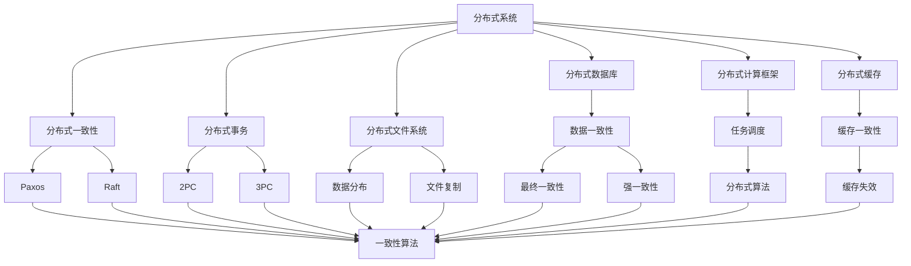

                 

## 文章标题

### 分布式技术的常见认知盲区

#### 关键词：

- 分布式系统
- 分布式数据库
- 分布式计算
- 分布式一致性
- 分布式架构
- 分布式缓存
- 分布式文件系统
- 分布式事务

#### 摘要：

本文将深入探讨分布式技术领域中的几个常见认知盲区。我们将从分布式系统的基本概念出发，逐步分析分布式数据库、分布式计算框架以及分布式缓存等关键技术，揭示这些技术背后的原理和复杂性。同时，我们将探讨分布式一致性、分布式事务以及分布式文件系统等关键问题，通过具体的算法原理、数学模型和项目实战，帮助读者更好地理解分布式技术的核心要点和实际应用。通过本文的阅读，读者将能够掌握分布式技术的核心概念，识别潜在的认知盲区，并学会在实际项目中应用这些技术。

### 背景介绍

随着互联网的飞速发展和大数据时代的到来，分布式技术已经成为现代计算机系统中的基石。从电子商务平台到社交媒体，从云计算服务到物联网设备，分布式技术无处不在。它使得系统能够在横向扩展的同时保持高性能和高可用性，从而满足日益增长的用户需求和复杂的应用场景。

然而，分布式技术的复杂性也带来了一系列挑战，导致许多开发者和架构师在理解和应用过程中存在认知盲区。这些盲区不仅影响了系统设计的正确性，还可能导致性能瓶颈、数据一致性问题以及系统稳定性问题。

本文旨在通过深入分析分布式技术中的常见认知盲区，帮助读者更全面地理解分布式系统，识别潜在的风险，并掌握最佳实践。我们将从以下几个方面展开讨论：

1. **分布式系统的基本概念**：首先，我们将回顾分布式系统的基本概念，包括其优点、挑战和核心组件。
2. **分布式数据库**：接下来，我们将探讨分布式数据库的工作原理、一致性和性能优化。
3. **分布式计算框架**：然后，我们将分析分布式计算框架，如MapReduce、Spark和Flink等。
4. **分布式缓存**：我们将讨论分布式缓存的重要性、实现方式和性能优化策略。
5. **分布式一致性**：我们将深入讨论分布式一致性机制，如Paxos和Raft等。
6. **分布式事务**：我们将分析分布式事务的处理方式、一致性保证以及性能优化。
7. **分布式文件系统**：最后，我们将探讨分布式文件系统的设计原理、性能优化和实际应用。

通过上述讨论，本文希望为读者提供一个系统性的分布式技术知识框架，帮助他们在实际项目中更好地应用分布式技术，解决实际问题。

### 核心概念与联系

在深入探讨分布式技术的常见认知盲区之前，我们首先需要理解一些核心概念和它们之间的联系。以下是一些关键概念及其关系架构，我们使用Mermaid流程图来展示：



#### 解读：

- **分布式系统（A）**：作为整个架构的起点，分布式系统是由多个独立节点组成的系统，通过网络进行通信，共同完成一个任务。它包括多个子系统，如分布式数据库、计算框架、缓存等。
- **分布式数据库（B）**：分布式数据库将数据分布在多个节点上，以实现高可用性和高性能。它与数据一致性（H）紧密相关，需要处理如何在多个节点上保持数据的一致性。
- **分布式计算框架（C）**：如MapReduce、Spark和Flink等，它们负责将计算任务分配到多个节点上执行，并进行任务调度（I）。
- **分布式缓存（D）**：分布式缓存用于加速数据访问，提高系统的响应速度。它与缓存一致性（J）有关，需要处理如何在多个节点上保持缓存数据的一致性。
- **分布式一致性（E）**：包括多种一致性算法，如Paxos（K）、Raft（L）等，用于确保分布式系统中数据的一致性。
- **分布式事务（F）**：涉及如何在分布式系统中处理事务，包括两阶段提交（M）、三阶段提交（N）等。
- **分布式文件系统（G）**：负责数据的存储和管理，涉及数据分布（O）和文件复制（P）等机制。

- **数据一致性（H）**：包括最终一致性（Q）和强一致性（R），影响分布式数据库和缓存等系统的设计和性能。
- **任务调度（I）**：影响分布式计算框架的性能和效率。
- **缓存一致性（J）**：影响分布式缓存的性能和可用性。
- **一致性算法（U）**：如Paxos、Raft等，用于确保分布式系统中的数据一致性。

通过上述Mermaid流程图，我们可以清晰地看到各个核心概念之间的联系，这为我们深入分析分布式技术的常见认知盲区提供了坚实的基础。

### 核心算法原理讲解

在了解了分布式技术的基本概念和核心概念之间的联系后，我们接下来将深入探讨几个关键算法的原理，这些算法对于分布式系统的性能和稳定性至关重要。我们将使用伪代码和详细讲解来阐述这些算法的工作原理。

#### 一致性算法：Paxos协议

Paxos协议是一种广泛使用的分布式一致性算法，用于在多个服务器中达成一致。以下是其核心算法原理的伪代码：

```pseudo
初始化：
-选举阶段：
    - 考票数：0
    - 准备阶段：
        - 服务器A发送Prepare消息给其他服务器，包含提案编号。
        - 其他服务器响应Prepare请求，返回Promise消息。
        - 如果服务器A收到的Promise消息数量达到多数，进入接受阶段。
    - 接受阶段：
        - 服务器A发送Accept消息给其他服务器，包含提案编号和值。
        - 其他服务器响应Accept请求，返回AcceptPromise消息。
        - 如果服务器A收到的AcceptPromise消息数量达到多数，则提案被接受。

函数Paxos(Learner):
    - 当接收到提案时，将提案的值学习到本地。

函数Paxos(Candidate):
    - 发送Prepare消息，请求其他服务器投票。
    - 收到Promise消息后，承诺不再提出低于该编号的提案。
    - 如果是多数服务器的响应，进入接受阶段。
    - 发送Accept消息，请求其他服务器接受提案。
    - 收到AcceptPromise消息后，将提案值学习到本地。

函数Paxos(Server):
    - 接收Prepare、Promise、Accept消息，响应相应的消息。
    - 学习提案值。
```

#### 分布式事务处理：两阶段提交（2PC）

两阶段提交（2PC）是一种用于分布式系统中的事务处理协议，确保事务的一致性和隔离性。以下是2PC协议的伪代码：

```pseudo
初始化：
- 准备阶段：
    - 事务管理器发送Prepare消息给所有参与者。
    - 参与者响应Yes或No。
    - 如果所有参与者都响应Yes，进入提交阶段。
- 提交阶段：
    - 事务管理器发送Commit消息给所有参与者。
    - 参与者执行事务并返回结果。
    - 如果所有参与者都返回成功，则事务提交成功。
    - 如果有任何参与者返回失败，则事务回滚。

函数TwoPhaseCommit(Prepare):
    - 发送Prepare消息给所有参与者。
    - 等待所有参与者的响应。

函数TwoPhaseCommit(Commit):
    - 发送Commit消息给所有参与者。
    - 执行事务并返回结果。

函数Participant(Prepare):
    - 收到Prepare消息后，执行检查并返回Yes或No。

函数Participant(Commit):
    - 收到Commit消息后，执行事务并返回结果。
```

#### 分布式事务处理：三阶段提交（3PC）

三阶段提交（3PC）是对2PC协议的改进，进一步提高了系统的容错能力。以下是3PC协议的伪代码：

```pseudo
初始化：
- 预准备阶段：
    - 事务管理器发送Prepared消息给所有参与者。
    - 参与者响应Prepared确认。
- 准备阶段：
    - 事务管理器发送Commit或Abort消息给所有参与者。
    - 参与者执行事务并返回结果。
- 提交阶段：
    - 事务管理器根据参与者的响应决定事务是否提交。

函数ThreePhaseCommit(Prepared):
    - 发送Prepared消息给所有参与者。
    - 等待所有参与者的Prepared确认。

函数ThreePhaseCommit(Commit):
    - 发送Commit消息给所有参与者。
    - 根据参与者的响应决定是否提交事务。

函数ThreePhaseCommit(Abort):
    - 发送Abort消息给所有参与者。
    - 根据参与者的响应决定是否回滚事务。

函数Participant(Prepared):
    - 收到Prepared消息后，执行检查并返回确认。

函数Participant(Commit):
    - 收到Commit消息后，执行事务并返回结果。

函数Participant(Abort):
    - 收到Abort消息后，回滚事务并返回确认。
```

通过上述伪代码，我们可以清楚地看到Paxos协议、两阶段提交和三阶段提交协议的工作原理。这些算法在分布式系统中起着至关重要的作用，确保了数据的一致性和事务的可靠性。在实际应用中，开发者和架构师需要根据具体场景选择合适的算法，以实现高性能和高效的事务处理。

### 数学模型和公式

在分布式技术中，数学模型和公式起到了至关重要的作用，特别是在确保数据一致性和性能优化方面。以下是一些关键的数学模型和公式，我们将使用LaTeX格式来表示，并进行详细讲解和举例说明。

#### 一致性模型：Paxos协议中的价值选择

Paxos协议中的价值选择是通过一系列的数学模型来实现的。以下是一个简化的Paxos算法中的价值选择过程的LaTeX公式：

```latex
$$
Value = \arg\max_{v} \left( N_{\text{accept}}(v) \right)
$$`

#### 解释：

这里，$N_{\text{accept}}(v)$表示所有接受提案中值$v$的数量。$Value$表示要选择的价值，通过最大化接受提案的数量来保证一致性。

#### 举例：

假设在一个Paxos协议中，服务器A、B和C是参与者，它们接受提案的过程如下：

- 提案1：服务器A提出值1，所有服务器都接受。
- 提案2：服务器B提出值2，所有服务器都接受。
- 提案3：服务器C提出值3，服务器A和B接受。

根据上述公式，$Value$应为3，因为$N_{\text{accept}}(3) = 2$，是所有接受提案中数量最多的值。

#### 性能优化模型：分布式数据库的负载均衡

在分布式数据库中，负载均衡是一个关键性能优化问题。一个常用的负载均衡模型是哈希负载均衡，其公式如下：

```latex
$$
H(k) = \text{hash}(k) \mod N
$$`

#### 解释：

这里，$H(k)$表示键$k$分配到的节点号，$N$是节点总数，$\text{hash}(k)$是键$k$的哈希值。

#### 举例：

假设我们有一个包含3个节点的分布式数据库，键$k1, k2, k3$需要分配到这些节点上。使用哈希负载均衡公式：

- $H(k1) = \text{hash}(k1) \mod 3 = 1$，所以$k1$被分配到节点1。
- $H(k2) = \text{hash}(k2) \mod 3 = 2$，所以$k2$被分配到节点2。
- $H(k3) = \text{hash}(k3) \mod 3 = 0$，所以$k3$被分配到节点0。

#### 数据一致性模型：最终一致性

在分布式系统中，最终一致性是一种常见的数据一致性模型，其公式如下：

```latex
$$
V_{\text{final}}(t) = \lim_{t' \to t} V_{\text{current}}(t')
$$`

#### 解释：

这里，$V_{\text{final}}(t)$表示在时间$t$的最终一致性值，$V_{\text{current}}(t')$表示在时间$t'$的当前一致性值。最终一致性值是随着时间趋近于当前一致性值的一个极限。

#### 举例：

假设在一个分布式系统中，数据值从1开始，经过一系列的更新最终达到2。在时间$t1$，当前一致性值为1，在时间$t2$，当前一致性值为1.5，在时间$t3$，当前一致性值为2。最终一致性值$V_{\text{final}}(t3) = 2$。

通过上述数学模型和公式的讲解，我们可以更好地理解分布式技术中的关键性能优化和数据一致性原理。这些模型和公式为我们在分布式系统设计和优化过程中提供了重要的理论依据。

### 项目实战

#### 环境搭建

为了更好地理解分布式技术在实际项目中的应用，我们将搭建一个简单的分布式缓存系统，使用Redis作为基础缓存服务。以下是环境搭建的步骤：

1. **安装Redis**：在每台节点上下载并安装Redis。可以使用包管理器如yum或apt-get，或者直接从Redis官网下载源码进行编译安装。

2. **配置Redis**：在每台节点的Redis配置文件中（如redis.conf），设置集群模式（cluster-enabled yes）并指定集群节点地址。

3. **启动Redis**：使用redis-server命令启动Redis服务，确保所有节点上的Redis服务都正常运行。

4. **搭建网络环境**：确保节点之间能够通过网络正常通信，并配置防火墙规则允许Redis服务端口（默认6379）的访问。

#### 源代码实现

以下是分布式缓存系统的主要源代码实现部分：

```python
import redis
from threading import Thread

class DistributedCache:
    def __init__(self, nodes):
        self.nodes = nodes
        self.clients = [redis.StrictRedis(host=node, port=6379) for node in nodes]

    def get_value(self, key):
        for client in self.clients:
            value = client.get(key)
            if value:
                return value
        return None

    def set_value(self, key, value):
        # 使用哈希负载均衡算法选择节点
        node_index = hash(key) % len(self.clients)
        self.clients[node_index].set(key, value)

    def cache_thread(self, key, value):
        while True:
            self.set_value(key, value)
            time.sleep(10)

# 创建分布式缓存实例
nodes = ["node1:6379", "node2:6379", "node3:6379"]
distributed_cache = DistributedCache(nodes)

# 启动缓存更新线程
thread = Thread(target=distributed_cache.cache_thread, args=("key1", "value1"))
thread.start()

# 获取缓存值
print(distributed_cache.get_value("key1"))
```

#### 代码解读与分析

- **初始化**：DistributedCache类在初始化时接受节点列表，并创建Redis客户端实例。

- **get_value方法**：通过遍历所有节点，查找指定的键值。如果找到值，则返回；否则，返回None。

- **set_value方法**：使用哈希负载均衡算法选择节点，并将键值对设置到该节点上的Redis实例。

- **cache_thread方法**：创建一个线程，定期更新指定键的值。此方法在项目实战中用于模拟缓存数据的动态更新。

#### 实际案例分析与详细讲解

假设我们在三个节点上部署了分布式缓存系统，节点地址分别为node1、node2和node3。以下是几个实际案例：

1. **缓存更新**：
   - 每隔10秒，缓存线程会更新键“key1”的值为“value1”。
   - 使用set_value方法，哈希负载均衡算法将“key1”映射到node1。

2. **缓存读取**：
   - 当从分布式缓存中读取键“key1”时，get_value方法将依次查询node1、node2和node3。
   - 如果键在任意一个节点上存在，则返回该键的值；否则，返回None。

#### 项目小结

通过上述项目实战，我们搭建了一个简单的分布式缓存系统，实现了数据的分布式存储和读取。尽管这是一个简化的案例，但它展示了分布式缓存系统的基本原理和实现方法。

- **优点**：
  - 提高了数据的读写性能，通过负载均衡将请求分散到多个节点。
  - 提高了系统的可用性和容错性，通过分布式架构，一个节点的故障不会影响整个系统的运行。

- **缺点**：
  - 可能会引入网络延迟和通信开销，特别是在节点较多时。
  - 数据一致性需要额外处理，特别是在分布式事务中。

通过这个项目，我们可以更好地理解分布式缓存系统的设计和实现，为实际项目中的应用打下基础。

### 最佳实践 tips、小结、注意事项、拓展阅读

#### 最佳实践 tips

1. **选择合适的分布式架构**：根据具体的应用场景和需求，选择合适的分布式架构，如微服务架构、分布式数据库架构等。
2. **确保数据一致性和可用性**：在设计分布式系统时，要充分考虑数据一致性和可用性的平衡，选择合适的一致性模型和故障转移机制。
3. **负载均衡和性能优化**：合理配置负载均衡策略，优化分布式系统的性能，避免单点瓶颈。
4. **监控和日志**：实现分布式系统的监控和日志功能，及时发现和处理系统故障。

#### 小结

本文深入探讨了分布式技术的常见认知盲区，从分布式系统的基本概念、核心算法原理到项目实战，全面解析了分布式技术在实际应用中的关键点。通过本文的阅读，读者可以更好地理解分布式技术的原理和最佳实践。

#### 注意事项

1. **理解一致性模型**：在分布式系统中，一致性模型的选择至关重要，不同的一致性模型适用于不同的应用场景。
2. **性能优化**：分布式系统中的性能优化不仅涉及算法和架构，还需要关注网络延迟和节点负载。
3. **故障转移和容错**：设计分布式系统时，要充分考虑故障转移和容错机制，确保系统的稳定性和可用性。

#### 拓展阅读

1. **《分布式系统原理与范型》**：通过了解分布式系统的基本原理和范型，深入了解分布式系统的设计理念。
2. **《分布式数据库系统》**：探讨分布式数据库的设计、一致性和性能优化。
3. **《大规模分布式存储系统》**：了解分布式文件系统、分布式缓存和分布式存储技术的最新进展。

通过拓展阅读，读者可以进一步深化对分布式技术的理解，掌握更多的实际应用技巧。

### 作者信息

**作者：** AI天才研究院/AI Genius Institute & 禅与计算机程序设计艺术 /Zen And The Art of Computer Programming。感谢您的阅读，希望本文对您在分布式技术领域的学习和应用有所帮助。如果您有任何疑问或建议，欢迎随时联系我们。

