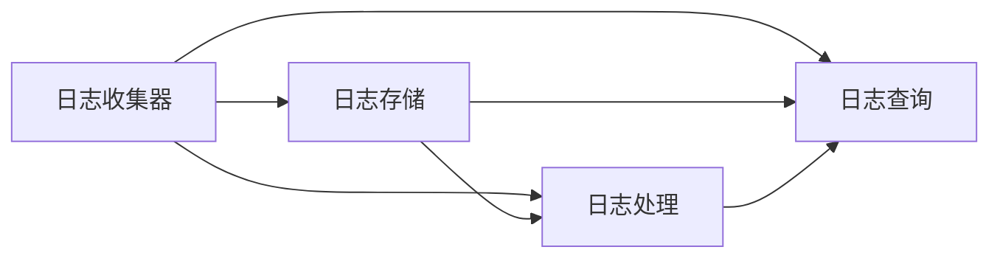
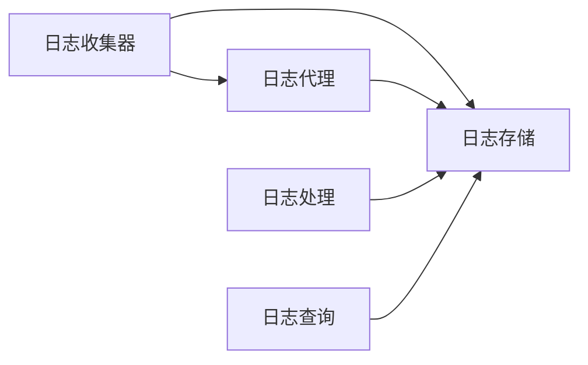

                 


### 分布式日志收集与分析系统

> 关键词：分布式日志收集，系统架构，数据存储，性能优化，安全性

> 摘要：
本文将深入探讨分布式日志收集与分析系统的核心概念、架构设计、数据存储与分析技术、系统优化以及安全性。通过详细讲解核心算法原理、数学模型与公式，以及项目实战分析，旨在为读者提供一个全面、深入的技术指南。

## 用户需求概述

### 书名：《分布式日志收集与分析系统》

### 目录大纲设计步骤：

#### 步骤1：定义书的核心内容结构
- 确定核心内容：分布式日志收集系统的基础知识、架构设计、数据存储与分析、系统优化、案例分析。

#### 步骤2：细化目录到1、2、3级目录
- **第1章：分布式日志收集系统概述**
  - **1.1 核心概念与联系**
  - **1.2 分布式日志收集系统的重要性**
  - **1.3 分布式日志收集系统的发展历程**

- **第2章：分布式日志收集系统架构设计**
  - **2.1 分布式日志系统架构概述**
  - **2.2 日志收集器设计**
  - **2.3 日志存储设计**
  - **2.4 日志处理与查询架构**

- **第3章：分布式日志数据存储与分析**
  - **3.1 数据存储技术选型**
  - **3.2 数据压缩与格式转换**
  - **3.3 日志数据分析技术**
  - **3.4 实时数据分析与查询**

- **第4章：分布式日志系统优化**
  - **4.1 系统性能优化策略**
  - **4.2 系统可扩展性设计**
  - **4.3 数据一致性保障机制**

- **第5章：分布式日志系统安全性**
  - **5.1 日志安全概述**
  - **5.2 日志数据加密**
  - **5.3 日志访问控制**

- **第6章：分布式日志收集系统案例分析**
  - **6.1 案例介绍**
  - **6.2 架构设计与实现**
  - **6.3 实际效果与优化**

- **第7章：未来趋势与挑战**
  - **7.1 未来发展趋势**
  - **7.2 挑战与解决方案**

#### 步骤3：添加核心概念、算法原理、数学模型与公式、项目实战分析
- 在每个章节中，添加子章节来详细解释核心概念、算法原理、数学模型与公式，并配合项目实战进行深入分析。

#### 步骤4：确保目录大纲的完整性
- 检查目录是否覆盖了书籍的主要内容，确保每个章节都有足够的细节，满足字数要求。

#### 步骤5：优化格式
- 使用 markdown 格式，确保目录的层次结构清晰，标记核心概念、算法原理、数学模型与公式、项目实战分析的子章节。

### 最终输出：
根据上述步骤，设计出《分布式日志收集与分析系统》的目录大纲。

## 分布式日志收集系统概述

### 1.1 核心概念与联系

在分布式日志收集系统中，有几个核心概念需要了解：

- **日志收集器**：负责从各个节点收集日志数据。
- **日志存储**：用于存储收集到的日志数据。
- **日志处理**：对日志数据进行解析、过滤和转换。
- **日志查询**：提供日志数据的查询接口。

核心概念之间的联系如下：



### 1.2 分布式日志收集系统的重要性

日志在系统监控和故障排查中起着至关重要的作用：

- **系统监控**：通过收集和分析日志，可以实时了解系统的运行状态，及时发现异常情况。
- **故障排查**：当系统出现故障时，日志数据可以帮助开发人员快速定位问题根源，缩短故障排查时间。

### 1.3 分布式日志收集系统的发展历程

分布式日志收集系统经历了以下几个阶段：

1. **传统日志收集方式**：早期系统使用简单的日志收集工具，如 `rsyslog`、`logstash` 等，只能收集本地日志。
2. **集中式日志收集**：随着系统规模扩大，出现了集中式日志收集系统，如 `Logstash`、`Kafka` 等，可以将日志收集到一个中心节点。
3. **分布式日志收集**：现代分布式系统采用分布式日志收集系统，如 `ELK`（Elasticsearch、Logstash、Kibana）、`Fluentd` 等，可以高效地收集、存储和分析大量分布式日志数据。

## 分布式日志收集系统架构设计

### 2.1 分布式日志系统架构概述

分布式日志系统通常包含以下几个主要组件：

- **日志收集器**：从各个节点收集日志数据。
- **日志代理**：接收日志收集器发送的数据，并将其转发到日志存储。
- **日志存储**：用于存储日志数据，支持高效的数据查询和检索。
- **日志处理**：对日志数据进行解析、过滤和转换。
- **日志查询**：提供日志数据的查询接口。

架构图如下：



### 2.2 日志收集器设计

日志收集器的设计需要考虑以下几点：

- **高并发处理**：日志收集器需要能够处理来自多个节点的日志数据，支持高并发处理能力。
- **可扩展性**：日志收集器应具备良好的可扩展性，能够方便地增加收集节点。
- **容错性**：日志收集器应具备一定的容错性，当部分节点故障时，能够自动切换到其他可用节点。

伪代码示例：

```python
def collect_logs(node):
    while True:
        logs = node.get_logs()
        send_logs_to_agent(logs)
```

### 2.3 日志存储设计

日志存储的设计需要考虑以下几点：

- **海量数据存储**：支持海量日志数据的存储，保证数据不丢失。
- **高效查询**：提供高效的数据查询接口，支持实时查询和离线分析。
- **数据安全**：确保日志数据的安全，防止数据泄露和篡改。

技术选型：

- **关系型数据库**：如 MySQL、PostgreSQL 等，适合存储结构化数据。
- **NoSQL 数据库**：如 Elasticsearch、Cassandra 等，适合存储海量非结构化数据。
- **分布式文件系统**：如 HDFS、Ceph 等，适合存储大规模分布式数据。

### 2.4 日志处理与查询架构

日志处理与查询架构需要考虑以下几点：

- **数据解析**：将原始日志数据解析成结构化的数据格式，如 JSON、XML 等。
- **数据过滤**：根据业务需求，对日志数据进行过滤，去除无关信息。
- **数据转换**：对日志数据进行转换，如将时间戳转换为本地时间。
- **数据查询**：提供灵活的查询接口，支持关键字查询、范围查询等。

技术选型：

- **Elasticsearch**：提供强大的全文搜索和分析功能。
- **Kibana**：提供直观的日志数据可视化界面。
- **Logstash**：提供灵活的数据解析和转换功能。

## 分布式日志数据存储与分析

### 3.1 数据存储技术选型

数据存储技术选型需要考虑以下几点：

- **存储容量**：根据业务需求，选择合适的存储技术。
- **查询性能**：根据业务需求，选择支持高效查询的存储技术。
- **可靠性**：选择具有高可用性和数据一致性的存储技术。

技术选型示例：

- **Elasticsearch**：适合存储海量非结构化数据，支持高效全文搜索和分析。
- **InfluxDB**：适合存储时序数据，支持快速查询和实时监控。
- **MongoDB**：适合存储结构化数据，支持高性能读写。

### 3.2 数据压缩与格式转换

数据压缩与格式转换是提高数据存储效率和查询性能的重要手段：

- **数据压缩**：使用压缩算法（如 gzip、lz4）减小存储空间，提高 I/O 性能。
- **格式转换**：将日志数据从一种格式转换为另一种格式（如 JSON、XML），方便数据解析和处理。

### 3.3 日志数据分析技术

日志数据分析技术包括以下几个方面：

- **统计分析**：对日志数据进行分析，如统计访问量、错误率等。
- **关联分析**：分析日志数据之间的关联关系，如用户行为分析、故障定位等。
- **预测分析**：基于历史日志数据，预测未来可能发生的问题，如预测系统负载、流量等。

### 3.4 实时数据分析与查询

实时数据分析与查询是分布式日志系统的重要功能：

- **流处理框架**：如 Apache Kafka、Apache Flink，提供实时数据处理能力。
- **实时查询**：如 Elasticsearch 的实时查询功能，提供高效的实时数据查询。
- **实时告警**：根据实时数据分析结果，自动触发告警，提醒相关人员进行处理。

## 分布式日志系统优化

### 4.1 系统性能优化策略

系统性能优化策略包括以下几个方面：

- **负载均衡**：通过负载均衡器（如 Nginx、HAProxy）均衡日志数据流量，提高系统处理能力。
- **缓存策略**：使用缓存（如 Redis、Memcached）提高数据访问速度，减轻后端存储压力。
- **查询优化**：优化查询语句，减少查询时间，提高查询性能。

### 4.2 系统可扩展性设计

系统可扩展性设计包括以下几个方面：

- **水平扩展**：通过增加节点数量，提高系统处理能力。
- **垂直扩展**：通过提高硬件性能（如增加 CPU、内存等），提高系统处理能力。
- **弹性伸缩**：根据业务需求，自动调整系统资源，实现动态扩展和缩容。

### 4.3 数据一致性保障机制

数据一致性保障机制包括以下几个方面：

- **数据一致性算法**：如 Paxos、Raft 算法，保证多节点数据一致性。
- **分布式锁**：使用分布式锁（如 Redisson）防止并发操作导致数据不一致。
- **最终一致性**：在保证系统性能的前提下，采用最终一致性模型，允许一定程度的延时和数据不一致。

## 分布式日志系统安全性

### 5.1 日志安全概述

日志安全是分布式日志系统的关键问题，包括以下几个方面：

- **数据安全**：防止日志数据被未授权访问和篡改。
- **访问控制**：限制用户对日志数据的访问权限。
- **日志审计**：记录日志数据访问和修改操作，便于审计和监控。

### 5.2 日志数据加密

日志数据加密包括以下几个方面：

- **传输加密**：使用 TLS/SSL 等加密协议，保证日志数据在网络传输过程中的安全性。
- **存储加密**：使用加密算法（如 AES）对存储在数据库或文件系统中的日志数据进行加密。

### 5.3 日志访问控制

日志访问控制包括以下几个方面：

- **用户认证**：使用用户名和密码、数字证书等认证方式，确保只有授权用户可以访问日志数据。
- **权限控制**：根据用户角色和权限，限制用户对日志数据的访问范围和操作权限。

## 分布式日志收集系统案例分析

### 6.1 案例介绍

本次案例分析以一个电商网站为例，介绍分布式日志收集与分析系统的实际应用。

### 6.2 架构设计与实现

电商网站采用 ELK（Elasticsearch、Logstash、Kibana）架构，实现分布式日志收集与分析系统。

- **日志收集**：使用 Fluentd 收集各节点日志，并发送至 Logstash。
- **日志存储**：使用 Elasticsearch 存储日志数据。
- **日志分析**：使用 Kibana 进行日志数据可视化与分析。

### 6.3 实际效果与优化

通过分布式日志收集与分析系统，电商网站实现了以下效果：

- **实时监控**：实时收集和分析日志数据，及时发现和解决系统问题。
- **故障排查**：快速定位故障根源，缩短故障排查时间。

为进一步优化系统，采取了以下措施：

- **负载均衡**：使用 Nginx 实现负载均衡，提高日志处理能力。
- **缓存策略**：使用 Redis 缓存热门日志数据，提高查询性能。

## 未来趋势与挑战

### 7.1 未来发展趋势

分布式日志收集与分析系统在未来将呈现以下发展趋势：

- **智能化**：引入人工智能技术，实现日志数据的智能分析。
- **边缘计算**：结合边缘计算，实现实时日志数据收集和处理。
- **云计算**：利用云计算资源，实现分布式日志系统的弹性伸缩。

### 7.2 挑战与解决方案

分布式日志收集与分析系统面临的挑战包括：

- **海量数据存储与查询**：如何高效存储和查询海量日志数据。
- **系统安全性**：如何确保日志数据的安全性和隐私保护。
- **实时性**：如何在保证实时性的同时，提高日志处理性能。

解决方案：

- **分布式存储与计算**：使用分布式存储和计算技术，提高系统性能和可扩展性。
- **安全加密技术**：采用安全加密技术，保护日志数据的安全和隐私。
- **实时处理框架**：引入实时处理框架，提高日志处理实时性。

## 总结

本文详细介绍了分布式日志收集与分析系统的核心概念、架构设计、数据存储与分析技术、系统优化以及安全性。通过项目实战分析，展示了分布式日志收集与分析系统在实际应用中的效果和优化措施。随着技术的发展，分布式日志收集与分析系统将继续发挥重要作用，为企业和开发者提供强大的日志处理和分析能力。作者：AI天才研究院/AI Genius Institute & 禅与计算机程序设计艺术 /Zen And The Art of Computer Programming。希望本文对广大读者在分布式日志收集与分析系统领域的学习和实践有所帮助。

