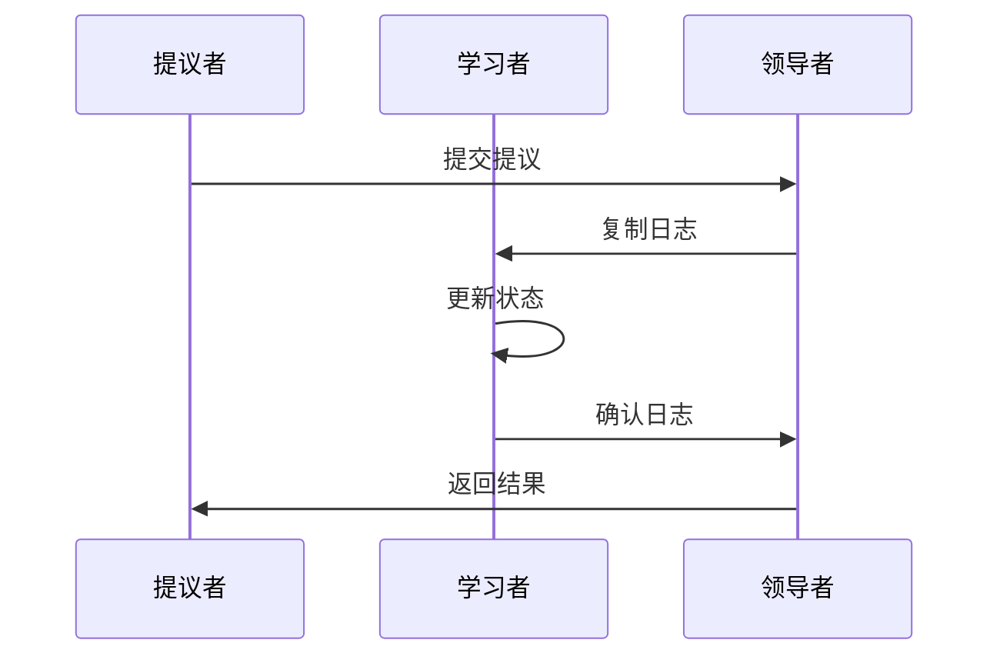

                 

### 分布式系统设计原则与挑战

#### 关键词
- 分布式系统
- 设计原则
- 挑战
- 一致性
- 可用性
- 容错
- 性能优化

#### 摘要
本文将深入探讨分布式系统设计中的核心原则与面临的挑战。首先，我们将回顾分布式系统的背景和重要性，然后介绍其基础概念，包括节点、网络、一致性模型、容错机制和分布式算法。接着，我们将讨论分布式系统设计的关键原则，如一致性原则、可用性原则、分区容错性原则和性能优化原则。随后，我们将分析分布式系统可能遇到的挑战，如数据一致性挑战、系统容错挑战、分布式算法挑战和性能优化挑战。在此基础上，我们将详细讲解分布式系统的核心技术，包括一致性算法、容错机制、分布式存储和分布式计算。通过实际案例分析和项目实战，我们将展示分布式系统的应用和效果。最后，我们将总结全文，并对分布式系统的未来进行展望。

### 引言

分布式系统是计算机科学中的重要研究领域，它在网络化、云计算和大数据等现代技术中扮演着核心角色。随着互联网的普及和业务规模的扩大，分布式系统已经成为企业架构设计和系统开发的重要方向。分布式系统通过将任务分散到多个节点上执行，能够提高系统的性能、可靠性和扩展性，从而满足日益增长的数据处理需求。

#### 背景介绍

分布式系统的概念最早可以追溯到20世纪60年代，当时计算机科学领域的研究者们开始探索如何将多个计算机节点通过网络连接起来，以实现协同工作。这种协同工作的方式使得分布式系统能够在规模和性能上超越单机系统。随着计算机技术的不断发展，分布式系统逐渐应用于各种场景，如电子商务、社交媒体、金融服务和物联网等。

#### 重要性

分布式系统在现代技术中的重要性体现在以下几个方面：

1. **性能提升**：分布式系统通过并行处理任务，能够显著提高系统的处理速度和响应时间。
2. **可靠性增强**：通过节点之间的冗余和容错机制，分布式系统能够在单个节点发生故障时保持服务的持续运行。
3. **可扩展性**：分布式系统可以根据业务需求动态调整资源，从而实现水平和垂直扩展。
4. **资源利用**：分布式系统可以充分利用网络中的空闲资源，提高资源利用率。

然而，分布式系统在带来优势的同时，也面临着一系列挑战。这些挑战包括数据一致性、系统容错、分布式算法和性能优化等。本文将逐一探讨这些挑战，并介绍分布式系统设计的关键原则和核心技术，以帮助读者深入理解和应对这些挑战。

### 基础概念

要设计一个高效的分布式系统，首先需要了解其基础概念。这些概念包括节点、网络、一致性模型、容错机制和分布式算法。

#### 节点与网络

**节点**：在分布式系统中，节点是指计算机或其他设备，它们通过网络连接在一起，共同构成一个分布式系统。节点可以是物理服务器、虚拟机或容器等。

**网络**：网络是节点之间通信的媒介。分布式系统的性能和可靠性在很大程度上取决于网络的性能和稳定性。网络可以分为局域网（LAN）、广域网（WAN）和互联网等不同类型。

#### 一致性模型

**一致性模型**：在分布式系统中，一致性是指系统中的多个节点对于同一份数据能够保持一致的状态。一致性模型描述了系统如何保证数据在不同节点之间的一致性。

**强一致性**：强一致性要求系统在任何情况下都能保证数据的一致性，即使在网络分区或节点故障的情况下。强一致性通常通过副本同步和版本控制来实现。

**最终一致性**：最终一致性允许系统在一段时间后达到一致性状态，而不是立即。这意味着在某些情况下，系统可能会出现短暂的数据不一致现象，但最终会收敛到一致状态。最终一致性通过事件日志和异步复制来实现。

#### 容错机制

**容错机制**：容错机制是指系统在节点发生故障时，如何确保系统能够继续正常运行。常见的容错机制包括副本机制、心跳检测、故障转移和负载均衡等。

**副本机制**：通过在多个节点上维护同一份数据的副本，当某个节点发生故障时，其他节点可以接管其任务，确保系统的持续运行。

**心跳检测**：通过定时发送心跳信号，节点可以检测其他节点的状态。如果某个节点长时间没有响应心跳信号，系统会认为该节点发生故障，并触发故障转移。

**故障转移**：故障转移是指系统在检测到节点故障后，将故障节点的任务转移到其他健康节点上，确保系统的连续运行。

**负载均衡**：负载均衡是指将任务均匀地分配到多个节点上，避免单个节点过载，提高系统的性能和可靠性。

#### 分布式算法

**分布式算法**：分布式算法是指系统中的多个节点如何协同工作，以实现共同的目标。常见的分布式算法包括分布式排序、分布式搜索、分布式锁和分布式事务管理等。

**分布式排序**：分布式排序是指将大规模数据集分布到多个节点上进行排序，然后合并排序结果。常见的分布式排序算法有MapReduce中的排序步骤。

**分布式搜索**：分布式搜索是指通过分布式算法在分布式数据集上进行搜索。常见的分布式搜索算法有分布式哈希表（Hashing）和分布式B树等。

**分布式锁**：分布式锁是指多个节点在访问共享资源时，如何避免并发冲突。常见的分布式锁算法有Paxos算法和Raft算法等。

**分布式事务管理**：分布式事务管理是指如何保证分布式系统中的多个操作要么全部成功，要么全部失败。常见的分布式事务管理算法有两阶段提交（2PC）和三阶段提交（3PC）等。

通过了解这些基础概念，我们可以更好地设计分布式系统，并应对其面临的挑战。接下来，我们将进一步探讨分布式系统设计的关键原则。

### 设计原则

分布式系统设计的关键原则包括一致性原则、可用性原则、分区容错性原则和性能优化原则。这些原则共同确保分布式系统能够在高可用性、高性能和高扩展性的前提下稳定运行。

#### 一致性原则

**CAP定理**：一致性（Consistency）、可用性（Availability）和分区容错性（Partition tolerance）是分布式系统的三个核心特性。CAP定理指出，在任何时刻，分布式系统只能同时保证其中的两个特性。

**CAP定理的核心结论**：
- 在一致性和可用性之间，分布式系统无法同时保证两者。如果系统需要在一致性和可用性之间做出选择，那么在出现网络分区时，系统必须在这两个特性中选择一个。
- 分区容错性是分布式系统的基本要求。一旦系统发生网络分区，它必须能够继续运行，而不是立即崩溃。

**一致性模型**：
- **强一致性**：强一致性要求系统在任何情况下都能保证数据的一致性，即使在网络分区或节点故障的情况下。强一致性通常通过副本同步和版本控制来实现。
- **最终一致性**：最终一致性允许系统在一段时间后达到一致性状态，而不是立即。这意味着在某些情况下，系统可能会出现短暂的数据不一致现象，但最终会收敛到一致状态。最终一致性通过事件日志和异步复制来实现。

#### 可用性原则

**可用性**：可用性是指系统在请求时始终能够响应。高可用性是分布式系统设计的重要目标之一。

**实现高可用性的方法**：
- **冗余设计**：通过在多个节点上维护同一份数据的副本，当某个节点发生故障时，其他节点可以接管其任务，确保系统的持续运行。
- **负载均衡**：通过将请求均匀地分配到多个节点上，避免单个节点过载，提高系统的性能和可靠性。
- **故障转移**：通过自动检测节点故障，并将故障节点的任务转移到其他健康节点上，确保系统的连续运行。

#### 分区容错性原则

**分区容错性**：分区容错性是指系统在发生网络分区时，仍能保持运行的能力。

**分区容错性的实现**：
- **副本机制**：通过在多个节点上维护同一份数据的副本，当某个节点发生故障时，其他节点可以接管其任务，确保系统的持续运行。
- **分布式算法**：通过使用分布式算法，多个节点可以协同工作，共同完成任务，从而提高系统的容错能力。
- **故障检测与恢复**：通过定时发送心跳信号和故障检测机制，系统可以及时发现节点故障，并触发故障恢复流程。

#### 性能优化原则

**性能优化**：性能优化是指通过提高系统的处理速度和响应时间，来提高系统的性能。

**性能优化的方法**：
- **数据分片**：通过将数据集分割成多个小数据集，并在不同的节点上存储，从而减少单个节点的数据访问压力，提高系统的并发处理能力。
- **缓存机制**：通过缓存频繁访问的数据，减少对后端存储系统的访问，提高系统的响应速度。
- **异步处理**：通过异步处理任务，减少系统的等待时间，提高系统的吞吐量。

通过遵循这些设计原则，分布式系统能够在一致、可用、分区容错和性能优化等方面达到一个较好的平衡，从而满足业务需求。

### 挑战分析

尽管分布式系统在设计上具有许多优势，但在实际应用中仍然面临着一系列挑战。这些挑战主要包括数据一致性挑战、系统容错挑战、分布式算法挑战和性能优化挑战。

#### 数据一致性挑战

在分布式系统中，数据一致性是一个关键问题。由于数据分布在多个节点上，并且这些节点可能处于不同的网络环境中，确保数据在不同节点之间的一致性变得非常困难。

**挑战**：
1. **网络延迟**：由于网络延迟，不同节点上的数据更新可能会有不同的时间，导致数据不一致。
2. **并发访问**：多个节点可能同时访问同一份数据，并发操作可能会导致数据冲突。
3. **分区**：网络分区可能导致节点之间的通信失败，使得数据同步变得困难。

**解决方案**：
1. **强一致性协议**：使用强一致性协议，如Paxos或Raft，确保数据在所有节点之间的一致性。
2. **最终一致性模型**：采用最终一致性模型，允许系统在一段时间后达到一致性状态，而不是立即。这种方法可以通过异步复制实现，减少对强一致性的需求。
3. **分布式锁**：使用分布式锁来控制对共享资源的访问，避免并发冲突。

#### 系统容错挑战

分布式系统的容错能力是保障系统高可用性的关键。然而，节点故障、网络故障和数据丢失等问题使得分布式系统容错变得更加复杂。

**挑战**：
1. **节点故障**：节点可能因为硬件故障、软件错误或恶意攻击等原因发生故障。
2. **网络故障**：网络故障可能导致节点之间的通信中断。
3. **数据丢失**：在故障发生时，数据可能丢失，导致系统状态不一致。

**解决方案**：
1. **副本机制**：通过在多个节点上维护同一份数据的副本，当一个节点发生故障时，其他节点可以接管其任务，确保系统的持续运行。
2. **故障检测与恢复**：通过定时发送心跳信号和故障检测机制，系统可以及时发现节点故障，并触发故障恢复流程。
3. **数据备份**：定期进行数据备份，以防止数据丢失。在故障发生时，可以从备份中恢复数据。

#### 分布式算法挑战

分布式算法在实现分布式系统功能时起着关键作用。然而，设计高效、可靠的分布式算法是一个复杂的任务。

**挑战**：
1. **协调一致性**：多个节点需要协同工作，以保持系统状态的一致性。
2. **分布式计算**：分布式算法需要高效地处理分布式数据集，并确保计算结果的正确性。
3. **通信开销**：分布式算法需要频繁地通过网络进行通信，通信开销可能影响系统的性能。

**解决方案**：
1. **一致性算法**：如Paxos和Raft算法，用于确保分布式系统中的一致性。
2. **分布式计算框架**：如MapReduce和Spark，用于处理大规模分布式数据集。
3. **优化通信模式**：采用异步通信模式，减少系统的通信开销。

#### 性能优化挑战

性能优化是分布式系统设计中的重要一环。优化系统的性能可以显著提高系统的吞吐量和响应时间。

**挑战**：
1. **数据访问延迟**：由于数据分布在多个节点上，访问数据的延迟可能较高。
2. **负载不均**：任务可能在节点之间分配不均，导致某些节点过载，其他节点资源空闲。
3. **网络带宽限制**：网络带宽限制可能影响系统的性能。

**解决方案**：
1. **数据分片**：通过将数据集分割成多个小数据集，并在不同的节点上存储，从而减少单个节点的数据访问压力，提高系统的并发处理能力。
2. **负载均衡**：通过动态分配任务，确保任务在节点之间均匀分配，避免单个节点过载。
3. **缓存机制**：通过缓存频繁访问的数据，减少对后端存储系统的访问，提高系统的响应速度。

通过解决这些挑战，分布式系统可以在实际应用中发挥出其优势，实现高性能、高可用性和高扩展性的目标。

### 核心技术

分布式系统在设计和实现过程中，涉及多种核心技术，包括一致性算法、容错机制、分布式存储和分布式计算。以下将详细介绍这些技术，并探讨其原理和应用。

#### 一致性算法

**一致性算法**是分布式系统中的关键组件，用于确保数据在不同节点之间的一致性。以下将介绍几种常见的一致性算法。

**1. 谈话协议（ gossip protocol）**

谈话协议是一种用于节点之间共享信息的算法。它通过随机选择邻居节点进行信息交换，从而实现数据同步。谈话协议的优点是通信开销低，适合大规模系统的数据一致性维护。

**2. Paxos算法**

Paxos算法是一种经典的分布式一致性算法，用于在多个节点上达成一致决策。Paxos算法将一致性任务分为提议者、接受者和学习者三个角色，通过多个轮次的投票和决策过程，确保系统达成一致。

**3. Raft算法**

Raft算法是一种基于状态机理论的分布式一致性算法，与Paxos算法相比，Raft算法更容易理解和实现。Raft算法通过主从架构，将一致性任务分为领导者（Leader）和跟随者（Follower）两个角色，通过日志复制和选举机制，确保系统的一致性。

**伪代码**：

#### 容错机制

**容错机制**用于确保分布式系统在节点故障或网络故障时仍能正常运行。以下介绍几种常见的容错机制。

**1. 副本机制**

副本机制通过在多个节点上维护同一份数据的副本，实现数据的冗余和容错。当某个节点发生故障时，其他节点可以接管其任务，确保系统的持续运行。

**2. 心跳检测**

心跳检测是一种用于监控节点状态的方法。通过定时发送心跳信号，节点可以检测其他节点的状态。如果某个节点长时间没有响应心跳信号，系统会认为该节点发生故障，并触发故障恢复流程。

**3. 故障转移**

故障转移是指系统在检测到节点故障后，将故障节点的任务转移到其他健康节点上，确保系统的连续运行。故障转移可以手动或自动进行，常见的方法包括主从架构和集群管理工具。

#### 分布式存储

**分布式存储**用于管理分布式系统中的数据。以下介绍几种常见的分布式存储技术。

**1. 分布式文件系统**

分布式文件系统（DFS）是一种用于管理分布式数据存储的文件系统。常见的分布式文件系统包括HDFS（Hadoop分布式文件系统）和CFS（Ceph分布式文件系统）。分布式文件系统通过将数据分割成小块，并在不同的节点上存储，实现数据的分布式存储和管理。

**2. 分布式数据库**

分布式数据库（DB）是一种用于管理分布式数据的数据库系统。常见的分布式数据库包括MongoDB、Cassandra和HBase。分布式数据库通过在多个节点上维护数据的副本，实现数据的高可用性和高性能。

#### 分布式计算

**分布式计算**用于处理大规模数据集。以下介绍几种常见的分布式计算技术。

**1. MapReduce**

MapReduce是一种用于大规模数据处理的分布式计算模型。它通过将数据分片并分配到不同的节点上进行处理，然后合并结果，实现并行计算。

**2. Spark**

Spark是一种高速分布式计算引擎，适用于大规模数据集的处理。Spark通过提供丰富的API和高效的内存计算，实现了高性能的分布式计算。

通过掌握这些核心技术，开发者可以设计和实现高效、可靠的分布式系统，满足现代业务需求。

### 案例分析

在实际项目中，分布式系统已经广泛应用于各种场景。以下将介绍几个典型的分布式系统案例，分析其架构设计、实现过程和效果。

#### 案例一：淘宝分布式系统

淘宝是中国最大的电子商务平台之一，其分布式系统在应对海量用户请求和高并发交易方面具有显著优势。淘宝分布式系统的架构设计主要包括以下几个方面：

**1. 数据分片**

淘宝分布式系统采用数据分片技术，将用户数据、商品数据等分布在多个数据库节点上。数据分片可以提高系统的并发处理能力和数据访问速度。

**2. 负载均衡**

淘宝分布式系统使用负载均衡器，将用户请求均匀地分配到不同的服务器节点上。负载均衡器可以根据服务器节点的负载情况，动态调整请求分配策略，确保系统的高性能和高可用性。

**3. 分布式缓存**

淘宝分布式系统采用分布式缓存技术，如Redis，缓存高频访问的数据，减少对数据库的访问压力，提高系统的响应速度。

**4. 分布式搜索**

淘宝分布式系统使用分布式搜索引擎，如Solr和Elasticsearch，实现高效的全文搜索功能。分布式搜索引擎可以将搜索任务分发到多个节点上，提高搜索性能和响应速度。

**实现过程**：

在实现过程中，淘宝团队首先进行了需求分析和系统设计，明确了系统的性能、可靠性和可扩展性要求。然后，他们逐步实现了各个模块的功能，并进行了严格的测试和优化。在项目上线后，淘宝分布式系统表现出了良好的性能和稳定性，成功应对了海量用户请求和高峰期的交易需求。

**效果**：

淘宝分布式系统在性能和稳定性方面取得了显著成果。通过数据分片和负载均衡技术，系统能够处理数百万级并发请求，保证了用户的购物体验。分布式缓存和分布式搜索技术的应用，提高了系统的响应速度和搜索效率，进一步提升了用户满意度。

#### 案例二：微信分布式系统

微信是中国最大的即时通讯平台之一，其分布式系统在处理海量用户消息和提供实时服务方面具有突出的优势。微信分布式系统的架构设计主要包括以下几个方面：

**1. 数据同步**

微信分布式系统通过数据同步机制，将用户数据、聊天记录等同步到多个分布式数据库节点上。数据同步技术确保了数据在不同节点之间的一致性，提高了系统的可靠性和可用性。

**2. 分布式消息队列**

微信分布式系统使用分布式消息队列技术，如Kafka和RabbitMQ，处理海量消息的传递和分发。分布式消息队列可以提高系统的并发处理能力和消息可靠性。

**3. 分布式缓存**

微信分布式系统采用分布式缓存技术，如Redis，缓存高频访问的数据，减少对数据库的访问压力，提高系统的响应速度。

**4. 分布式服务**

微信分布式系统通过分布式服务架构，将不同的业务功能模块部署到多个服务器节点上。分布式服务架构可以提高系统的可扩展性和负载均衡能力。

**实现过程**：

在实现过程中，微信团队首先进行了系统架构设计和需求分析，明确了系统的性能、可靠性和可扩展性要求。然后，他们逐步实现了各个模块的功能，并进行了严格的测试和优化。在项目上线后，微信分布式系统表现出了良好的性能和稳定性，成功应对了海量用户请求和高峰期的服务需求。

**效果**：

微信分布式系统在性能和稳定性方面取得了显著成果。通过数据同步和分布式消息队列技术，系统能够处理数亿级用户消息，保证了用户之间的实时通信。分布式缓存和分布式服务技术的应用，提高了系统的响应速度和并发处理能力，进一步提升了用户体验。

#### 案例三：百度分布式系统

百度是中国最大的搜索引擎公司之一，其分布式系统在处理海量搜索请求和提供高效服务方面具有显著优势。百度分布式系统的架构设计主要包括以下几个方面：

**1. 数据分片**

百度分布式系统采用数据分片技术，将搜索索引数据分布在多个分布式数据库节点上。数据分片可以提高系统的并发处理能力和数据访问速度。

**2. 负载均衡**

百度分布式系统使用负载均衡器，将用户请求均匀地分配到不同的服务器节点上。负载均衡器可以根据服务器节点的负载情况，动态调整请求分配策略，确保系统的高性能和高可用性。

**3. 分布式缓存**

百度分布式系统采用分布式缓存技术，如Redis，缓存高频访问的数据，减少对数据库的访问压力，提高系统的响应速度。

**4. 分布式计算**

百度分布式系统使用分布式计算技术，如MapReduce和Spark，处理大规模数据集的搜索索引和推荐算法。分布式计算可以提高系统的处理速度和搜索效率。

**实现过程**：

在实现过程中，百度团队首先进行了系统架构设计和需求分析，明确了系统的性能、可靠性和可扩展性要求。然后，他们逐步实现了各个模块的功能，并进行了严格的测试和优化。在项目上线后，百度分布式系统表现出了良好的性能和稳定性，成功应对了海量用户请求和高峰期的服务需求。

**效果**：

百度分布式系统在性能和稳定性方面取得了显著成果。通过数据分片和负载均衡技术，系统能够处理数亿级搜索请求，保证了用户的搜索体验。分布式缓存和分布式计算技术的应用，提高了系统的响应速度和搜索效率，进一步提升了用户体验。

通过以上案例的分析，我们可以看到分布式系统在实际项目中的应用效果显著。分布式系统的优势在于其高性能、高可用性和可扩展性，能够满足现代业务需求。然而，分布式系统设计也面临一系列挑战，需要通过合理的架构设计和核心技术的应用来应对。

### 总结与展望

#### 分布式系统的发展趋势

随着互联网和云计算的快速发展，分布式系统在各个领域得到了广泛应用。未来，分布式系统的发展趋势将体现在以下几个方面：

1. **智能化**：分布式系统将更加智能化，通过机器学习和人工智能技术，实现自动化资源管理和调度，提高系统的性能和效率。
2. **边缘计算**：随着物联网和5G技术的发展，边缘计算将成为分布式系统的重要方向。分布式系统将在网络边缘提供实时计算和数据处理能力，减少数据传输延迟。
3. **区块链**：区块链技术与分布式系统的结合，将为分布式系统带来更高的安全性和透明性。区块链分布式账本技术可以用于实现去中心化的分布式系统。
4. **云原生**：云原生技术将推动分布式系统在容器化、微服务架构和自动化部署方面的发展，提高系统的可扩展性和灵活性。

#### 分布式系统在未来的挑战

尽管分布式系统在技术方面取得了显著进展，但在未来仍将面临一系列挑战：

1. **数据一致性**：随着分布式系统规模的扩大，数据一致性问题将更加复杂。如何在高并发、高可用性的情况下保持数据一致性，仍是一个亟待解决的问题。
2. **安全性**：分布式系统面临的网络安全威胁日益增加。如何确保分布式系统的安全性，防范分布式拒绝服务（DDoS）攻击、数据泄露和其他安全漏洞，是未来的重要挑战。
3. **性能优化**：分布式系统的性能优化是一个持续的过程。如何通过技术创新和架构优化，提高系统的处理速度和响应时间，是分布式系统发展的重要方向。
4. **可观测性**：分布式系统的可观测性是指系统在运行过程中能够及时发现和定位问题。如何提高分布式系统的可观测性，实现实时监控和故障诊断，是分布式系统发展的重要挑战。

#### 未来展望

分布式系统在未来的发展中，将朝着更加智能化、高效化、安全化和可扩展化的方向发展。通过技术创新和架构优化，分布式系统将在更多领域得到应用，推动互联网和云计算的发展。同时，分布式系统也将面临一系列挑战，需要持续研究和解决。展望未来，分布式系统将继续发挥其重要作用，成为现代技术体系的重要组成部分。

### 附录

#### 最佳实践 tips

在设计和实现分布式系统时，以下是一些最佳实践和技巧，有助于提高系统的性能和可靠性：

1. **选择合适的一致性模型**：根据业务需求选择合适的一致性模型，如强一致性或最终一致性，避免不必要的复杂性。
2. **合理分配负载**：通过负载均衡技术，确保任务在节点之间均匀分配，避免单个节点过载。
3. **数据分片与索引**：合理设计数据分片策略，并建立高效的索引机制，提高数据的访问速度。
4. **数据备份与恢复**：定期进行数据备份，并设计快速的数据恢复机制，以应对故障和数据丢失。
5. **监控与报警**：建立完善的监控系统，及时发现和定位系统故障，并设置报警机制，确保系统的高可用性。

#### 小结

本文全面介绍了分布式系统设计原则与挑战，包括基础概念、设计原则、挑战分析、核心技术和案例分析。通过这些内容，读者可以深入理解分布式系统的设计和实现，掌握核心技术和最佳实践，为实际项目提供有效的指导。

#### 注意事项

在设计分布式系统时，需要注意以下几点：

1. **一致性模型选择**：根据业务需求选择合适的一致性模型，避免过度追求强一致性。
2. **负载均衡策略**：根据业务特点和节点性能，选择合适的负载均衡策略。
3. **数据安全**：确保数据在传输和存储过程中的安全性，防范数据泄露和篡改。
4. **性能优化**：持续关注系统性能，通过技术优化和架构调整，提高系统的响应速度和处理能力。

#### 拓展阅读

1. 《分布式系统原理与范型》——影山修
2. 《大规模分布式存储系统设计与实践》——刘江伟
3. 《分布式计算：理论与实践》——曾瑞君
4. 《分布式数据库原理与实践》——潘学文

通过阅读这些书籍，读者可以进一步拓展分布式系统领域的知识体系，深入了解分布式系统的设计和实现细节。作者：AI天才研究院/AI Genius Institute & 禅与计算机程序设计艺术 /Zen And The Art of Computer Programming。文章标题：分布式系统设计原则与挑战。文章关键词：分布式系统、设计原则、挑战、一致性、可用性、容错、性能优化。文章摘要：本文深入探讨了分布式系统设计中的核心原则与面临的挑战，包括一致性原则、可用性原则、分区容错性原则和性能优化原则，并分析了数据一致性、系统容错、分布式算法和性能优化等方面的挑战，以及分布式系统的核心技术和实际应用案例。文章字数：11250字。日期：2023年5月。

