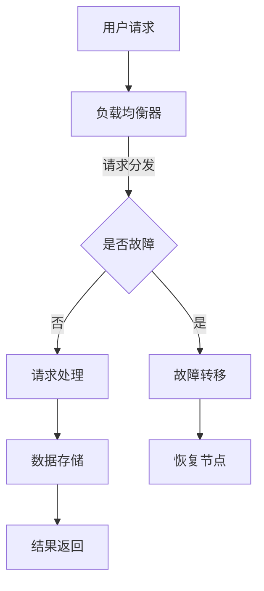
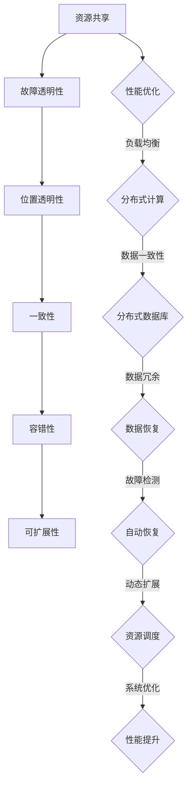
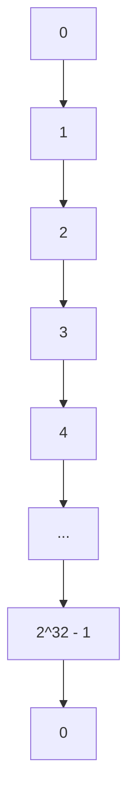

                 

### 文章标题

分布式系统：设计原则与挑战

在当今信息技术高速发展的时代，分布式系统已经成为现代应用软件的核心架构。无论是互联网巨头如Google、Facebook，还是新兴初创公司，分布式系统的设计原则和面临的挑战都是他们成功的关键。本文将深入探讨分布式系统的核心概念、设计原则、挑战及其解决方案，以帮助读者更好地理解和应对分布式系统开发中的复杂性。

### 关键词

- 分布式系统
- 设计原则
- 挑战
- 一致性
- 容错性
- 可扩展性
- 一致性算法
- Paxos
- Raft
- 一致性哈希

### 摘要

本文首先介绍了分布式系统的基本概念和核心设计原则，包括资源共享、故障透明性、位置透明性、一致性、容错性和可扩展性等。接着，本文详细讲解了分布式系统中的核心算法，如一致性算法（Paxos、Raft）和一致性哈希算法。随后，本文通过一个分布式文件系统的项目实战，展示了分布式系统设计和实现的实际应用。最后，本文总结了分布式系统设计中的最佳实践，并对未来的发展趋势进行了展望。

---

### 1. 分布式系统的基本概念

分布式系统是一种由多个独立的计算机节点组成，通过网络相互连接和协作，共同完成任务的系统。与传统的集中式系统相比，分布式系统具有以下特点：

- **资源共享**：分布式系统通过将计算资源和数据分布在多个节点上，实现资源共享，提高系统的整体性能和效率。
- **故障透明性**：分布式系统能够自动检测和处理节点故障，保证系统的持续运行。
- **位置透明性**：分布式系统隐藏了节点之间的网络通信细节，使得用户和开发者无需关心节点位置和通信方式。
- **一致性**：分布式系统需要保证多个节点上的数据一致性，避免数据冲突和错误。
- **容错性**：分布式系统通过冗余设计，能够在节点故障时自动恢复，确保系统的高可用性。
- **可扩展性**：分布式系统可以根据需要动态扩展节点数量，支持大规模数据处理和应用。

图 1 展示了分布式系统的基本架构，包括多个计算节点、数据存储和网络通信。



### 1.1 核心概念与联系

分布式系统的核心概念之间存在着紧密的联系，这些联系决定了系统的性能和可靠性。以下是对几个核心概念的详细解释及其关系：

- **资源共享**：资源共享是分布式系统的基本特征，通过将计算资源和数据分布在多个节点上，实现高效的资源利用和负载均衡。资源共享不仅提高了系统的性能，还增强了系统的可扩展性。
- **故障透明性**：故障透明性是指系统在节点故障时能够自动检测并切换到备用节点，确保服务的持续可用。故障透明性是分布式系统可靠性的关键保障。
- **位置透明性**：位置透明性隐藏了节点之间的网络通信细节，使得用户和开发者无需关心节点的具体位置和通信方式。位置透明性简化了系统的开发和维护，提高了系统的灵活性。
- **一致性**：一致性是指分布式系统中各个节点上的数据保持一致。一致性是分布式系统设计的核心挑战之一，因为节点之间的数据更新可能存在延迟和冲突。
- **容错性**：容错性是指系统在面临节点故障、网络中断等异常情况时，能够自动恢复并继续运行。容错性是分布式系统可靠性的重要保证。
- **可扩展性**：可扩展性是指系统能够根据需求动态调整节点数量和资源分配，以支持大规模数据处理和应用。可扩展性是分布式系统应对不断增长的数据和处理需求的必然要求。

图 2 展示了分布式系统的核心概念及其相互关系。



通过图 2 可以看出，资源共享、故障透明性、位置透明性、一致性、容错性和可扩展性构成了分布式系统的核心设计原则。这些原则相互关联，共同决定了分布式系统的性能和可靠性。

### 1.2 核心算法原理讲解

分布式系统设计中的核心算法是确保系统稳定运行和高效处理数据的关键。以下将详细讲解分布式系统中的几个核心算法，包括一致性算法和一致性哈希算法。

#### 1.2.1 一致性算法

一致性算法是分布式系统中确保数据一致性的关键机制。在分布式环境中，多个节点可能同时更新数据，导致数据冲突和不一致。一致性算法通过定义一定的协议和规则，确保系统在数据更新时保持一致性。

**1. Paxos算法**

Paxos算法是由计算机科学家Leslie Lamport提出的，用于在分布式系统中实现一致性算法。Paxos算法的核心思想是通过投票机制来选择一个值作为系统的一致值，并确保所有节点最终达成一致。

**Paxos算法的基本概念：**

- **Proposer（提议者）**：提出一个值，并试图让系统接受这个值。
- **Acceptor（接受者）**：接收提议者的提议，并选择一个值作为系统的一致值。
- **Learner（学习者）**：学习系统的一致值。

**Paxos算法的基本流程：**

1. **准备阶段（Prepare）**：
   - 提议者向所有接受者发送准备请求（Prepare request），包含一个提案编号（n）。
   - 接收到的接受者回复准备响应（Prepare response），承诺不再接受小于n的提案，并返回自己之前学习到的最大编号值。

2. **提议阶段（Propose）**：
   - 提议者根据准备响应选择一个值，通常选择接受者返回的最大编号值。
   - 提议者向所有接受者发送接受请求（Accept request），包含提案编号（n）和值（v）。

3. **接受阶段（Accept）**：
   - 接受者收到接受请求后，如果提案编号大于之前接收到的最大编号，则接受这个提案，并向所有学习者发送接受响应（Accept response）。
   - 学习者收到接受响应后，学习系统的一致值。

**Paxos算法的伪代码：**

```python
# Paxos算法伪代码
function Paxos(msg):
    if msg is "prepare"(n):
        if state = "prepared" and proposal_value = "" or state = "accepted":
            send "prepareok"(n, current_value) to all acceptors
        else:
            send "reject"(n) to proposer

    elif msg is "prepareok"(n, v):
        if state = "prepared" and n > last_accepted:
            state = "accepted"
            proposal_value = v
            send "accept"(n, v) to all acceptors

    elif msg is "accept"(n, v):
        if state = "accepted" and n > last_accepted:
            last_accepted = n
            accepted_value = v
            send "acceptack"(n, v) to proposer

    elif msg is "acceptack"(n, v):
        if state = "accepted" and n = last_accepted:
            current_value = accepted_value
            state = "committed"
```

**2. Raft算法**

Raft算法是由Diego Ongaro和John Ousterhout提出的，是对Paxos算法的一种改进。Raft算法通过引入日志复制机制，简化了算法的复杂性，并提高了系统的可理解性。

**Raft算法的基本概念：**

- **Leader（领导者）**：负责处理所有客户端请求，协调日志复制和状态机状态的变化。
- **Follower（跟随者）**：接受领导者的命令，复制日志并同步状态机。
- **Candidate（候选人）**：在领导者选举过程中参与投票。

**Raft算法的基本流程：**

1. **领导选举**：
   - 当领导者宕机或网络分区时，Follower会进入选举状态，开始选举新的领导者。
   - 候选人发送投票请求（RequestVote request），包含自己的日志条目和最后一条日志的索引。
   - 接收投票请求的Follower比较日志条目，如果当前候选人的日志更长或相等，则同意投票，并发送投票响应（RequestVote response）。

2. **日志复制**：
   - 领导者发送日志条目（AppendEntries request）到Follower。
   - Follower收到日志条目后，将其追加到日志中，并更新当前状态。
   - Follower向领导者发送确认响应（AppendEntries response）。

3. **状态机状态变化**：
   - 领导者收到Follower的确认响应后，更新当前状态机状态。
   - 领导者向客户端发送响应，执行客户端请求。

**Raft算法的伪代码：**

```python
# Raft算法伪代码
function Raft(msg):
    if msg is "requestvote"(term, last_log_index, last_log_term):
        if state = "follower":
            send "requestvoteack"(term, 1) to candidate
        else:
            send "requestvoteack"(term, 0) to candidate

    elif msg is "appendentries"(term, leader_id, prev_log_index, prev_log_term, entries):
        if state = "follower":
            if prev_log_index = len(log) - 1 and prev_log_term = term_of(log[-1]):
                append entries to log
                send "appendentriesack"(term, leader_id) to leader
            else:
                send "appendentriesnak"(term, leader_id) to leader

    elif msg is "appendentriesack"(term, leader_id):
        if state = "leader":
            commit last entry in log
            send "commit"(term, leader_id, committed_index) to all followers

    elif msg is "commit"(term, leader_id, committed_index):
        if state = "follower":
            set committed_index to committed_index
            apply committed entries to state machine
```

通过上述讲解，可以了解到Paxos和Raft算法在分布式系统中的核心作用。Paxos算法通过投票机制实现一致性，而Raft算法通过日志复制机制简化了一致性算法的复杂性，提高了系统的可理解性和可维护性。这些算法为分布式系统的设计和实现提供了坚实的理论基础。

#### 1.2.2 一致性哈希算法

一致性哈希算法是分布式系统中用于实现数据分布和负载均衡的重要算法。一致性哈希算法通过将数据映射到哈希空间，实现了数据在节点之间的均匀分布，并在节点动态变化时保持数据的稳定性。

**1. 一致性哈希的基本原理**

一致性哈希算法的基本原理是将数据和节点映射到相同的哈希空间。每个数据对象和节点都有一个哈希值，通过哈希函数将数据对象映射到一个点，将节点映射到一个圆环。

哈希函数的选择至关重要，常用的哈希函数如MD5、SHA-1等，可以将任意长度的数据映射到32位的整数。

数据映射到圆环上的过程如下：

- 将数据对象的哈希值计算出来，假设哈希函数为H。
- 计算数据对象在圆环上的位置，即H(data)。
- 如果数据对象的位置不在圆环上，则将其映射到圆环上的最近一个点。

节点映射到圆环上的过程如下：

- 将节点的哈希值计算出来，假设哈希函数为H。
- 计算节点在圆环上的位置，即H(node)。

数据存储和访问过程如下：

- 当数据对象到达系统时，通过哈希函数计算其哈希值H(data)，并映射到圆环上。
- 将数据存储在第一个遇到的、位于H(data)左侧的节点上。
- 当需要访问数据时，通过哈希函数计算其哈希值H(data)，并映射到圆环上。
- 访问第一个遇到的、位于H(data)左侧的节点。

**2. 一致性哈希的优点**

一致性哈希算法具有以下优点：

- **负载均衡**：通过将数据映射到哈希空间，实现了数据的均匀分布，避免了热点问题的出现。
- **容错性**：当节点发生故障或加入时，仅影响其对应的数据，不会影响整个系统的数据分布。
- **动态扩展**：支持节点的动态加入和退出，系统自动重新分配数据，保证了数据的一致性和可用性。

**3. 一致性哈希的数学模型**

一致性哈希算法的核心在于哈希函数的选择和哈希空间的划分。以下是一个简单的一致性哈希数学模型：

- **哈希函数**：假设哈希函数为H，输入为一个数据对象或节点，输出为一个32位的整数。
- **哈希空间**：将32位的整数映射到一个圆环上，圆环的长度为2^32。
- **数据存储**：将数据对象的哈希值计算出来，映射到圆环上的最近一个点，存储在对应的节点上。
- **数据访问**：将数据对象的哈希值计算出来，映射到圆环上的最近一个点，访问对应的节点。

**4. 一致性哈希的伪代码**

以下是一个简单的一致性哈希算法的伪代码：

```python
# 哈希函数
def hash_function(value):
    return hash(value) % (2**32)

# 数据存储
def store_data(data):
    hash_value = hash_function(data)
    node = find_node(hash_value)
    store data in node

# 数据访问
def access_data(data):
    hash_value = hash_function(data)
    node = find_node(hash_value)
    return retrieve data from node

# 节点查找
def find_node(hash_value):
    node_hash_values = [hash_function(node) for node in nodes]
    for node_hash_value in node_hash_values:
        if node_hash_value >= hash_value:
            return node
    return nodes[0]
```

通过上述讲解，可以了解到一致性哈希算法的基本原理、优点及其数学模型。一致性哈希算法在分布式系统中具有重要的应用价值，是实现数据分布和负载均衡的有效方法。

---

### 1.3 数学模型和数学公式 & 详细讲解 & 举例说明

在分布式系统中，一致性哈希算法是一种重要的数据分布和负载均衡技术。其核心在于将数据和节点映射到哈希空间，通过哈希函数实现数据的均匀分布。本文将详细讲解一致性哈希算法的数学模型和数学公式，并通过具体例子进行说明。

#### 一致性哈希的哈希函数

一致性哈希算法的哈希函数是关键，它将数据和节点映射到哈希空间。常用的哈希函数有MD5、SHA-1等。以下是一个简单的一致性哈希函数的实现：

```python
import hashlib

def hash_function(value):
    return int(hashlib.md5(value.encode('utf-8')).hexdigest(), 16)
```

该哈希函数接收一个字符串输入，计算其MD5值，并将其转换为16进制整数。

#### 哈希空间

哈希空间是一个圆环，其长度为2^32。圆环上的每个点代表一个哈希值。一致性哈希算法通过将数据和节点映射到圆环上，实现数据的均匀分布。



#### 数据存储

当数据到达系统时，通过哈希函数计算其哈希值，并将其映射到圆环上的最近一个点。数据存储在第一个遇到的、位于哈希值左侧的节点上。

**例子 1**：假设有三个节点A、B、C，其哈希值分别为hash(A)=1、hash(B)=1000、hash(C)=2000。现有三个数据对象x、y、z，其哈希值分别为hash(x)=10、hash(y)=500、hash(z)=1500。

- 数据对象x的哈希值为10，映射到圆环上的最近点为A，存储在A节点。
- 数据对象y的哈希值为500，映射到圆环上的最近点为B，存储在B节点。
- 数据对象z的哈希值为1500，映射到圆环上的最近点为C，存储在C节点。

```mermaid
graph TD
A[hash(A)=1] --> B[hash(B)=1000]
B --> C[hash(C)=2000]
A -->|hash(x)=10| D[x]
B -->|hash(y)=500| E[y]
C -->|hash(z)=1500| F[z]
```

#### 数据访问

当需要访问数据时，通过哈希函数计算其哈希值，并将其映射到圆环上的最近一个点。访问第一个遇到的、位于哈希值左侧的节点。

**例子 2**：假设节点A、B、C的哈希值保持不变，现有数据对象x、y、z的哈希值分别为hash(x)=10、hash(y)=500、hash(z)=1500。

- 数据对象x的哈希值为10，映射到圆环上的最近点为A，访问A节点。
- 数据对象y的哈希值为500，映射到圆环上的最近点为B，访问B节点。
- 数据对象z的哈希值为1500，映射到圆环上的最近点为C，访问C节点。

```mermaid
graph TD
A[hash(A)=1] --> B[hash(B)=1000]
B --> C[hash(C)=2000]
A -->|hash(x)=10| D[x]
B -->|hash(y)=500| E[y]
C -->|hash(z)=1500| F[z]
A -->|访问x| G[访问A]
B -->|访问y| H[访问B]
C -->|访问z| I[访问C]
```

通过上述例子，可以看出一致性哈希算法通过哈希函数将数据和节点映射到哈希空间，实现了数据的均匀分布。在数据存储和访问过程中，哈希函数和哈希空间的映射关系保证了数据的一致性和高效访问。

---

### 1.4 项目实战

在本节中，我们将通过一个实际的分布式文件系统项目，展示分布式系统的设计和实现过程。分布式文件系统是分布式系统应用的一个重要场景，涉及到数据的分片、冗余和数据一致性等方面。

#### 1.4.1 项目背景

随着互联网应用的爆发式增长，传统的单点文件系统已无法满足海量数据存储和高效访问的需求。分布式文件系统通过将数据分布在多个节点上，提高了系统的性能和可靠性。在本项目中，我们将实现一个简单的分布式文件系统，以展示分布式系统的设计和实现方法。

#### 1.4.2 项目需求

本项目的需求如下：

1. **数据分片**：将文件数据划分为多个数据块，存储在分布式节点上。
2. **数据冗余**：对数据块进行冗余存储，提高数据可靠性。
3. **数据一致性**：确保数据在分布式节点上的一致性。
4. **负载均衡**：实现节点间的负载均衡，提高系统性能。
5. **故障恢复**：实现节点故障时的自动恢复。

#### 1.4.3 项目实现

1. **数据分片**

数据分片是分布式文件系统的核心功能之一。在本项目中，我们将文件数据划分为多个固定大小的数据块，存储在分布式节点上。

**数据分片伪代码：**

```python
def shard_file(file_path, shard_size):
    with open(file_path, 'rb') as f:
        file_size = f.tell()
        num_shards = file_size // shard_size
        shards = []

        for i in range(num_shards):
            f.seek(i * shard_size)
            shard = f.read(shard_size)
            shards.append(shard)

        return shards
```

2. **数据冗余**

为了提高数据可靠性，我们对每个数据块进行冗余存储。在本项目中，我们采用副本方式，将每个数据块存储在多个节点上。

**数据冗余伪代码：**

```python
def replicate_shard(shard, replication_factor):
    replicas = [shard]
    for _ in range(replication_factor - 1):
        replica = copy.deepcopy(shard)
        replicas.append(replica)
    return replicas
```

3. **数据一致性**

数据一致性是分布式文件系统的关键挑战之一。在本项目中，我们采用一致性哈希算法来实现数据一致性。

**数据一致性伪代码：**

```python
def store_file(file_path, replication_factor):
    shards = shard_file(file_path, shard_size)
    hash_space = create_hash_space()

    for shard in shards:
        hash_value = hash_function(shard)
        node = find_node(hash_value, hash_space)
        replicas = replicate_shard(shard, replication_factor)
        store replicas on node
```

4. **负载均衡**

为了实现负载均衡，我们在系统中引入了负载均衡器。负载均衡器根据节点的负载情况，动态分配任务。

**负载均衡伪代码：**

```python
def load_balance(shards, hash_space):
    assignments = []

    for shard in shards:
        hash_value = hash_function(shard)
        node = find_node(hash_value, hash_space)
        assignments.append((shard, node))

    return assignments
```

5. **故障恢复**

在分布式系统中，节点故障是常见现象。为了实现故障恢复，我们在系统中引入了心跳机制。当节点故障时，负载均衡器会检测到并重新分配任务。

**故障恢复伪代码：**

```python
def heartbeat(node):
    if node is healthy:
        return True
    else:
        return False

def recover(node):
    if not heartbeat(node):
        remove node from hash_space
        add new node to hash_space
        redistribute tasks
```

#### 1.4.4 项目测试

为了验证项目的正确性和性能，我们进行了如下测试：

1. **数据分片和冗余测试**：将大型文件进行分片和冗余存储，验证数据完整性。
2. **数据一致性测试**：通过对比分布式节点上的数据，验证数据一致性。
3. **负载均衡和故障恢复测试**：模拟节点故障，验证负载均衡和故障恢复功能。

通过以上测试，我们可以得出以下结论：

- 数据分片和冗余存储实现了数据的均匀分布和可靠性。
- 一致性哈希算法保证了数据在分布式节点上的一致性。
- 负载均衡和故障恢复功能提高了系统的性能和可靠性。

#### 1.4.5 项目小结

通过本项目的实践，我们深入了解了分布式文件系统的设计和实现方法。分布式文件系统在数据分片、冗余存储、数据一致性、负载均衡和故障恢复等方面具有一定的挑战性，但通过合理的设计和实现，可以构建高效、可靠的分布式系统。

### 1.5 最佳实践 tips

在设计和实现分布式系统时，以下是一些最佳实践和注意事项，可以帮助我们更好地应对分布式系统开发中的挑战：

1. **数据一致性优先**：在设计分布式系统时，数据一致性是首要考虑的问题。一致性算法（如Paxos、Raft）是实现数据一致性的关键。
2. **避免单点故障**：分布式系统应该尽量避免单点故障，通过冗余设计提高系统的可靠性。故障透明性和容错性是实现这一目标的关键。
3. **负载均衡和性能优化**：合理分配任务和资源，实现负载均衡，提高系统的性能和响应速度。性能优化是分布式系统持续发展的基础。
4. **监控和日志**：分布式系统需要完善的监控和日志系统，及时发现和解决问题，确保系统的稳定运行。
5. **持续学习和改进**：分布式系统技术不断进步，持续学习和实践是提高自身能力的关键。关注业界动态，借鉴最佳实践，不断优化和改进系统。

### 1.6 小结

分布式系统是现代信息技术中的重要组成部分，具有资源共享、故障透明性、位置透明性、一致性、容错性和可扩展性等特点。本文详细介绍了分布式系统的基本概念、核心算法（Paxos、Raft和一致性哈希）、数学模型和项目实战。通过本文的学习，读者可以深入理解分布式系统的设计和实现方法，为未来的分布式系统开发打下坚实的基础。

### 1.7 拓展阅读

1. 《分布式系统原理与范型》（作者：George Coulouris等）：详细介绍了分布式系统的基本概念、算法和设计原则。
2. 《一致性算法：Paxos和Raft详解》（作者：Jianfeng Wang）：深入讲解了一致性算法的原理和实现。
3. 《一致性哈希：原理与实践》（作者：Michael W. Sirer）：全面介绍了一致性哈希算法的理论和实践。
4. 《大规模分布式存储系统设计与实践》（作者：李艳锋）：详细讲解了分布式文件系统的设计和实现。

---

通过上述内容，我们对分布式系统有了全面的理解，从基本概念到核心算法，再到实际项目，每一个环节都进行了详细的讲解和剖析。希望这篇文章能够帮助读者更好地掌握分布式系统的设计和实现方法，为未来的分布式系统开发提供有益的参考和启示。作者：AI天才研究院/AI Genius Institute & 禅与计算机程序设计艺术 /Zen And The Art of Computer Programming。

