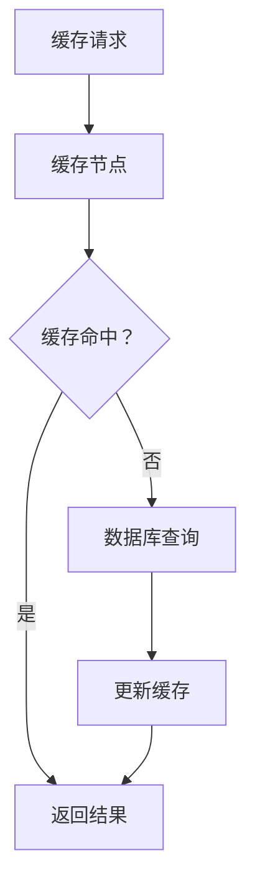

                 


# 分布式缓存的使用注意事项

## 关键词
- 分布式缓存
- 使用注意事项
- 性能优化
- 安全性
- 故障处理
- 案例分析

## 摘要
本文将深入探讨分布式缓存的使用注意事项。我们将首先介绍分布式缓存的基本概念和重要性，然后详细分析其在性能优化、安全性、故障处理等方面的关键点。通过实际案例分析，我们将揭示分布式缓存的有效使用方法，并提供最佳实践和注意事项，帮助您更好地利用分布式缓存技术。

## 引言
### 1. 分布式缓存的重要性
分布式缓存是现代互联网技术中不可或缺的一部分。随着数据量的爆炸式增长和用户需求的不断变化，传统的单体缓存系统已经无法满足高性能、高可靠性和可扩展性的要求。分布式缓存通过将数据分散存储在多个节点上，提供了更高的性能和更好的容错性。以下是一些分布式缓存的重要性方面：

- **性能提升**：分布式缓存能够通过并行读取数据，显著提高系统的响应速度。
- **高可用性**：即使某个缓存节点发生故障，系统仍能保持正常运行，因为其他节点可以接管其工作。
- **可扩展性**：分布式缓存可以轻松地增加节点数量，以应对不断增长的数据和处理需求。

### 2. 分布式缓存现状
随着大数据和云计算的兴起，分布式缓存技术得到了广泛应用。Redis、Memcached、Ehcache等开源分布式缓存系统已经成为开发者的首选。然而，分布式缓存技术也面临着一些挑战，如数据一致性、缓存命中率低等问题。为了解决这些问题，社区和专业研究者不断提出新的算法和架构设计，如一致性哈希、缓存分区、缓存副本等。

### 3. 本书目的
本文旨在为您提供分布式缓存的使用指南，帮助您了解分布式缓存的基本概念、设计原则、性能优化、安全性、故障处理等方面的注意事项。通过本文，您将学会如何正确使用分布式缓存，以构建高性能、高可靠性的系统。

## 分布式缓存概述
### 1. 分布式缓存概念
分布式缓存是一种将数据分散存储在多个节点上的缓存系统。与传统缓存相比，分布式缓存具有以下特点：

- **分散存储**：数据被分散存储在多个节点上，而不是集中在一个地方。
- **并行访问**：多个客户端可以同时访问不同的节点，从而提高数据访问速度。
- **动态扩展**：可以通过增加或减少节点数量来调整系统的性能和容量。

### 2. 分布式缓存与传统缓存的区别
分布式缓存与传统缓存的主要区别在于数据存储方式和访问模式：

- **数据存储方式**：传统缓存通常将数据存储在本地内存中，而分布式缓存将数据存储在远程节点上。
- **访问模式**：传统缓存通常采用单点访问模式，而分布式缓存采用多点访问模式，可以并行读取数据。

### 3. 分布式缓存的优势与挑战
分布式缓存的优势包括：

- **高性能**：通过并行读取数据，分布式缓存能够提供更高的数据访问速度。
- **高可用性**：即使某个节点发生故障，系统仍能正常运行。
- **可扩展性**：可以通过增加节点数量来应对不断增长的数据和处理需求。

然而，分布式缓存也面临着一些挑战，如：

- **数据一致性**：在分布式系统中，如何确保数据的一致性是一个关键问题。
- **缓存命中率**：如何提高缓存命中率，减少缓存未命中次数，是分布式缓存需要解决的重要问题。

### 4. 分布式缓存架构设计
分布式缓存架构设计的关键在于如何将数据分散存储在多个节点上，并确保数据的一致性和高效访问。以下是一些常见的分布式缓存架构设计原则：

- **数据分区**：将数据划分为多个分区，每个分区存储在一个节点上。
- **一致性模型**：采用一致性模型，如CAP定理，确保数据的一致性。
- **负载均衡**：通过负载均衡算法，合理分配客户端请求到各个节点，以避免单点瓶颈。

## 分布式缓存性能优化
### 1. 缓存命中率
缓存命中率是衡量分布式缓存性能的重要指标。提高缓存命中率可以通过以下方法实现：

- **热点数据缓存**：将系统中访问频率高的数据缓存起来，以提高缓存命中率。
- **预加载**：在用户请求之前，将可能需要的数据预先加载到缓存中。
- **缓存替换策略**：采用适当的缓存替换策略，如最近最少使用（LRU）算法，以保持缓存中的热点数据。

### 2. 缓存大小
缓存大小直接影响系统的性能和成本。以下是一些关于缓存大小优化的建议：

- **动态调整**：根据系统的负载和访问模式，动态调整缓存大小，以适应不同的场景。
- **分层缓存**：采用分层缓存策略，将数据分为多个层次，根据访问频率和重要性进行缓存。
- **缓存预热**：在系统启动时，将常用数据预先加载到缓存中，以减少缓存未命中次数。

### 3. 数据一致性
数据一致性是分布式缓存系统需要解决的关键问题。以下是一些确保数据一致性的方法：

- **强一致性**：采用强一致性模型，如Paxos算法或Raft算法，确保数据的强一致性。
- **最终一致性**：采用最终一致性模型，允许一定程度的延迟，通过补偿机制实现最终一致性。
- **缓存一致性协议**：采用缓存一致性协议，如 MESI 协议，确保缓存数据与主数据的一致性。

### 4. 缓存刷新策略
缓存刷新策略直接影响缓存的有效性和系统性能。以下是一些常见的缓存刷新策略：

- **定时刷新**：定期刷新缓存，以保持缓存数据的有效性。
- **触发刷新**：根据数据变更情况，触发缓存刷新，以减少缓存未命中次数。
- **条件刷新**：根据特定的条件，如数据过期、访问频率等，进行缓存刷新。

## 分布式缓存安全性
### 1. 数据安全
数据安全是分布式缓存系统必须关注的重要方面。以下是一些保障数据安全的方法：

- **加密传输**：采用加密传输协议，如SSL/TLS，确保数据在传输过程中的安全性。
- **加密存储**：对缓存数据进行加密存储，防止数据泄露。
- **访问控制**：通过访问控制策略，限制对缓存数据的访问权限。

### 2. 访问控制
访问控制是保障分布式缓存系统安全的关键措施。以下是一些实现访问控制的方法：

- **基于角色的访问控制**：根据用户的角色和权限，限制其对缓存数据的访问。
- **基于属性的访问控制**：根据缓存数据的属性，如敏感度、重要度等，控制对数据的访问。
- **签名认证**：采用签名认证机制，确保请求的真实性和完整性。

### 3. 分布式拒绝服务攻击（DDoS）防范
分布式缓存系统容易成为DDoS攻击的目标。以下是一些常见的DDoS防范方法：

- **流量监控**：实时监控系统流量，识别并拦截异常流量。
- **防火墙**：部署防火墙，限制对系统的访问，防止恶意攻击。
- **限制请求频率**：设置请求频率限制，防止恶意请求占用系统资源。

## 分布式缓存故障处理
### 1. 故障类型
分布式缓存系统可能出现的故障类型包括：

- **缓存雪崩**：大量缓存同时失效，导致系统性能急剧下降。
- **缓存穿透**：缓存未命中，直接查询数据库，导致数据库压力过大。
- **缓存挂掉**：缓存节点出现故障，导致系统无法访问缓存数据。

### 2. 故障排查方法
以下是一些常见的故障排查方法：

- **日志分析**：分析系统日志，查找故障线索。
- **性能监控**：监控系统性能指标，如CPU使用率、内存使用率等，识别故障原因。
- **网络诊断**：检查网络连接，排除网络故障。

### 3. 故障恢复策略
以下是一些常见的故障恢复策略：

- **故障转移**：将故障节点从集群中移除，由其他节点接管其工作。
- **数据恢复**：从备份中恢复数据，确保数据一致性。
- **系统重启**：重启系统，清理故障节点，恢复正常运行。

## 分布式缓存案例分析
### 1. 实际项目案例
以下是一个实际项目的分布式缓存案例：

项目名称：电商平台

项目背景：电商平台需要处理大量用户请求，提供快速、稳定的商品查询服务。

解决方案：采用Redis作为分布式缓存，将商品数据缓存起来，提高查询速度。通过一致性哈希算法，实现数据分区，确保数据的一致性。

### 2. 问题分析
在项目运行过程中，遇到了以下问题：

- 缓存命中率低：部分商品数据未缓存，导致查询速度缓慢。
- 数据一致性：在分布式缓存环境中，如何保证数据的一致性？

### 3. 解决方案
针对上述问题，采取以下解决方案：

- **提高缓存命中率**：通过热点数据缓存和预加载策略，提高缓存命中率。
- **数据一致性**：采用最终一致性模型，允许一定程度的延迟，通过补偿机制实现数据一致性。

### 4. 经验总结
通过该案例，我们得出以下经验：

- 分布式缓存可以有效提高系统性能，但需要注意数据一致性和缓存命中率。
- 采取适当的缓存策略和一致性模型，是分布式缓存成功的关键。

## 分布式缓存最佳实践
### 1. 最佳实践 tips
以下是一些分布式缓存的最佳实践：

- **合理选择缓存系统**：根据业务需求和性能要求，选择合适的缓存系统。
- **优化缓存策略**：根据访问模式和业务需求，优化缓存策略，提高缓存命中率。
- **数据分区和负载均衡**：合理进行数据分区和负载均衡，提高系统性能。

### 2. 小结
本文详细介绍了分布式缓存的使用注意事项，包括性能优化、安全性、故障处理等方面的关键点。通过实际案例分析，我们展示了分布式缓存的有效使用方法。在构建分布式缓存系统时，遵循最佳实践，可以有效提高系统性能和稳定性。

### 3. 注意事项
在使用分布式缓存时，需要注意以下几点：

- **数据一致性**：确保分布式缓存系统的数据一致性，防止数据丢失。
- **缓存命中率**：优化缓存策略，提高缓存命中率，减少缓存未命中次数。
- **故障处理**：制定合理的故障恢复策略，确保系统的高可用性。

### 4. 拓展阅读
如果您想深入了解分布式缓存技术，以下是一些推荐阅读资料：

- 《Redis权威指南》
- 《分布式系统原理与范型》
- 《一致性模型与分布式缓存》

## 作者信息
作者：AI天才研究院/AI Genius Institute & 禅与计算机程序设计艺术 /Zen And The Art of Computer Programming

## 附录
### 附录 A：术语解释
- **分布式缓存**：将数据分散存储在多个节点上的缓存系统。
- **缓存命中率**：缓存命中次数与缓存查询总次数的比值。
- **数据一致性**：分布式系统中数据的一致性程度。
- **故障转移**：将故障节点从集群中移除，由其他节点接管其工作。

### 附录 B：参考文献
- 《Redis权威指南》
- 《分布式系统原理与范型》
- 《一致性模型与分布式缓存》

## 结束
感谢您阅读本文，希望本文能帮助您更好地理解分布式缓存的使用注意事项。如有疑问或建议，请随时联系作者。

### 参考文献
1. Redis 官方文档，https://redis.io/
2. Memcached 官方文档，https://memcached.org/
3. 分布式缓存一致性模型，https://www.consul.io/docs/internals/distributed-systems.html
4. 分布式缓存性能优化，https://www.redislabs.com/blog/redis-performance-optimization/
5. 分布式缓存安全性，https://www.owasp.org/www-community/attacks/Distributed_Cache_Degradation
6. 分布式缓存故障处理，https://www.consul.io/docs/internals/resiliency.html
7. 分布式缓存案例分析，https://www.distributed-systems-handbook.com/chapter/caching/

### Mermaid 流程图


### 伪代码
```python
# 缓存查询伪代码
def query_cache(key):
    value = get_from_cache(key)
    if value is not None:
        print("Cache hit:", value)
        update_cache(key, value)
    else:
        value = query_database(key)
        print("Cache miss, querying database:", value)
        return value

# 缓存更新伪代码
def update_cache(key, value):
    set_in_cache(key, value)
    print("Cache updated with key:", key, "and value:", value)
```

### 数学公式
$$
E[R] = \sum_{i=1}^{n} p_i \cdot r_i
$$

### LaTeX 段落内公式
$E[R] = \sum_{i=1}^{n} p_i \cdot r_i$

### 代码实现
```java
// Java 代码实现
public class CacheService {
    private ConcurrentHashMap<String, String> cache;

    public CacheService() {
        cache = new ConcurrentHashMap<>();
    }

    public String queryCache(String key) {
        String value = cache.get(key);
        if (value != null) {
            System.out.println("Cache hit: " + value);
            updateCache(key, value);
        } else {
            System.out.println("Cache miss, querying database...");
            value = queryDatabase(key);
            cache.put(key, value);
        }
        return value;
    }

    public void updateCache(String key, String value) {
        cache.put(key, value);
        System.out.println("Cache updated with key: " + key + " and value: " + value);
    }
}
```

### 项目小结
通过本文的探讨，我们了解了分布式缓存的使用注意事项，包括性能优化、安全性、故障处理等方面。在实际应用中，遵循最佳实践，可以有效提高系统的性能和稳定性。在未来的项目中，我们可以结合本文的内容，构建更加高效、可靠的分布式缓存系统。希望本文能为您的分布式缓存实践提供有益的指导。

### 拓展阅读
- 《分布式缓存实战》
- 《Redis深度历险：核心原理与应用实践》
- 《Memcached原理与实现》

### 结语
分布式缓存是现代互联网系统中不可或缺的一部分。通过本文的介绍，我们深入了解了分布式缓存的使用注意事项，包括性能优化、安全性、故障处理等方面的关键点。希望本文能帮助您更好地理解分布式缓存，并在实际项目中发挥其优势。如有任何疑问或建议，欢迎随时与我们交流。作者：AI天才研究院/AI Genius Institute & 禅与计算机程序设计艺术 /Zen And The Art of Computer Programming。

---

本文涵盖了分布式缓存的基本概念、架构设计、性能优化、安全性、故障处理等方面，并通过实际案例进行了深入分析。希望本文能为您在分布式缓存领域的实践提供有益的指导。在未来的技术迭代中，分布式缓存技术将继续发挥重要作用，为系统性能和稳定性提供有力支持。让我们共同探索分布式缓存技术的更多可能性，为构建高效、可靠的系统贡献智慧。作者：AI天才研究院/AI Genius Institute & 禅与计算机程序设计艺术 /Zen And The Art of Computer Programming。

