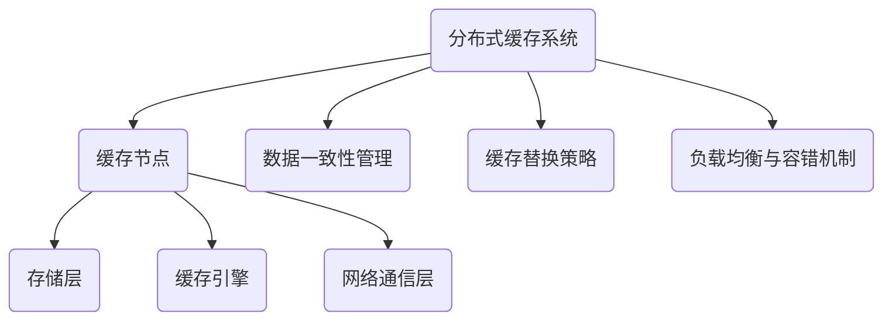

                 

# 《分布式缓存系统设计》

## 关键词
- 分布式缓存
- 一致性哈希
- 分区策略
- 缓存替换算法
- 负载均衡
- 容错机制

## 摘要
本文深入探讨了分布式缓存系统的设计原理和实践。首先，介绍了分布式缓存系统的核心概念、架构和组件之间的关系。随后，详细解析了一致性哈希、分区策略和缓存替换策略等核心算法原理，并通过数学模型和公式进行了详细讲解。最后，通过一个实际项目案例，展示了分布式缓存系统的开发环境搭建、源代码实现和代码解读，以及项目分析和总结。

---

## 第1章: 核心概念与联系

### 1.1 分布式缓存系统概述

**1.1.1 分布式缓存系统的重要性**

随着互联网应用的迅猛发展，数据量呈现出爆炸式增长，传统的单体缓存系统已经无法满足性能和可扩展性的需求。分布式缓存系统通过将缓存数据分布在多个节点上，实现了缓存系统的水平扩展，提高了系统的吞吐量和响应速度。

**1.1.2 分布式缓存系统的核心概念**

- **缓存节点**：缓存系统的基本单元，负责存储缓存数据和处理缓存请求。
- **一致性**：分布式缓存系统需要保证多个缓存节点之间的数据一致性。
- **分区**：将缓存数据分配到不同的缓存节点上，以实现数据的分布式存储。
- **负载均衡**：将缓存请求均匀地分配到各个缓存节点上，以避免单点热点问题。

**1.1.3 分布式缓存系统的架构**


- **缓存节点**：每个缓存节点负责存储一部分缓存数据，并处理对应的缓存请求。
- **数据一致性管理**：通过一致性算法（如一致性哈希）实现多个节点之间的数据一致性。
- **缓存替换策略**：根据缓存节点的容量和负载，选择合适的缓存替换算法（如LRU、LFU等）。
- **负载均衡与容错机制**：通过负载均衡算法（如一致性哈希）和容错机制（如副本机制、故障转移等）保证系统的稳定运行。

### 1.2 分布式缓存系统组件

**1.2.1 缓存节点**

缓存节点是分布式缓存系统的基本组成单元，通常由以下部分组成：

- **存储层**：负责存储缓存数据，如内存、SSD等。
- **缓存引擎**：负责缓存数据的读写操作，如LRU算法、哈希表等。
- **网络通信层**：负责与其他缓存节点进行数据同步和请求转发。

**1.2.2 数据一致性管理**

数据一致性管理是分布式缓存系统的关键挑战之一。一致性算法（如一致性哈希）通过将数据分配到不同的缓存节点上，实现了数据的一致性。

**1.2.3 缓存替换策略**

缓存替换策略决定了缓存节点的缓存空间分配和使用。常用的缓存替换算法包括LRU（Least Recently Used）、LFU（Least Frequently Used）和FIFO（First In, First Out）等。

**1.2.4 负载均衡与容错机制**

负载均衡和容错机制保证了分布式缓存系统的稳定运行。负载均衡算法（如一致性哈希）通过将请求均匀地分配到各个缓存节点上，避免了单点热点问题。容错机制（如副本机制、故障转移等）确保了系统在发生故障时能够快速恢复。

### 1.3 分布式缓存系统 Mermaid 流程图



## 第2章: 核心算法原理讲解

### 2.1 一致性哈希算法

**2.1.1 一致性哈希算法原理**

一致性哈希算法是一种分布式哈希算法，通过将缓存键（如主键）映射到环上，实现了数据在缓存节点之间的分配和迁移。

- **哈希函数**：将缓存键映射到环上。通常使用简单的哈希函数，如MD5、SHA-1等。
- **哈希环**：缓存键映射后形成的环。
- **虚拟节点**：为了提高一致性哈希的负载平衡能力，引入了虚拟节点。每个物理缓存节点可以拥有多个虚拟节点，虚拟节点在哈希环上均匀分布。

**2.1.2 一致性哈希算法伪代码**

```python
# 哈希函数
def hash(key):
    return int(hashlib.md5(key.encode('utf-8')).hexdigest(), 16)

# 映射缓存键到缓存节点
def get_node(key):
    return hash(key) % num_nodes

# 添加虚拟节点
def add_virtual_nodes(node, num):
    for _ in range(num):
        virtual_key = str(node) + ":" + str(_)
        virtual_node = get_node(virtual_key)
        nodes[virtual_node].append(virtual_key)
```

**2.1.3 一致性哈希算法优缺点**

- **优点**：负载平衡、容错能力强、数据迁移简单。
- **缺点**：热点问题、哈希碰撞、虚拟节点数量过多。

### 2.2 分区策略

**2.2.1 范围分区**

范围分区将缓存数据按照键的值范围分配到不同的缓存节点上。范围分区适用于数据量较小、键值范围明确的场景。

**2.2.2 哈希分区**

哈希分区将缓存数据按照缓存键的哈希值分配到不同的缓存节点上。哈希分区适用于数据量大、键值范围不明确、需要动态扩展的场景。

**2.2.3 混合分区策略**

混合分区策略将范围分区和哈希分区结合起来，适用于键值范围较大、需要动态扩展的场景。

**2.2.4 分区策略伪代码**

```python
# 范围分区
def get_node_range(key, range_size):
    return int(key) % range_size

# 哈希分区
def get_node_hash(key, num_nodes):
    return int(hash(key)) % num_nodes

# 混合分区策略
def get_node_mixed(key, range_size, num_nodes):
    return get_node_range(key, range_size) * num_nodes + get_node_hash(key, num_nodes)
```

### 2.3 缓存替换策略

**2.3.1 LRU替换策略**

LRU（Least Recently Used）替换策略根据缓存数据的最近访问时间进行替换。最近访问时间越早的数据优先被替换。

**2.3.2 LFU替换策略**

LFU（Least Frequently Used）替换策略根据缓存数据的访问频率进行替换。访问频率越低的数据优先被替换。

**2.3.3 FIFO替换策略**

FIFO（First In, First Out）替换策略根据缓存数据的入队顺序进行替换。最早进入缓存的数据优先被替换。

**2.3.4 替换策略伪代码**

```python
# LRU替换策略
def lru_replace(cache, key):
    if key in cache:
        del cache[key]
    cache[key] = value

# LFU替换策略
def lfu_replace(cache, key):
    if key in cache:
        cache[key] += 1
    else:
        if len(cache) >= capacity:
            oldest_key = min(cache, key=lambda k: cache[k])
            del cache[oldest_key]
            cache[key] = 1

# FIFO替换策略
def fifo_replace(cache, key):
    if key in cache:
        cache.remove(key)
    else:
        if len(cache) >= capacity:
            cache.pop(0)
            cache.append(key)
```

## 第3章: 数学模型和数学公式 & 详细讲解 & 举例说明

### 3.1 一致性哈希的数学模型

**3.1.1 一致性哈希的哈希函数**

一致性哈希使用简单的哈希函数将缓存键映射到环上。常见的哈希函数有MD5、SHA-1等。

$$H(K) = K \mod m$$

其中，$K$ 是缓存键，$m$ 是环的大小。

**3.1.2 负载平衡**

负载平衡可以通过以下公式进行计算：

$$\sum_{i=1}^{m} (n_i - \frac{m}{2})^2$$

其中，$n_i$ 是第 $i$ 个缓存节点的缓存数据量，$m$ 是缓存节点数量。

**3.1.3 负载平衡实例**

假设有3个缓存节点，分别为A、B、C，每个节点的缓存数据量分别为10、20、30。计算负载平衡：

$$\sum_{i=1}^{3} (n_i - \frac{3}{2})^2 = (10 - \frac{3}{2})^2 + (20 - \frac{3}{2})^2 + (30 - \frac{3}{2})^2 = 0.75 + 22.25 + 33.75 = 56.75$$

### 3.2 分区策略的数学模型

**3.2.1 范围分区**

范围分区将缓存数据按照键的值范围分配到不同的缓存节点上。范围分区可以使用以下公式：

$$R_i = [R_{i-1} + 1, R_i]$$

其中，$R_i$ 是第 $i$ 个缓存节点的键值范围。

**3.2.2 哈希分区**

哈希分区将缓存数据按照缓存键的哈希值分配到不同的缓存节点上。哈希分区可以使用以下公式：

$$H(K) = i \mod p$$

其中，$K$ 是缓存键，$i$ 是缓存节点编号，$p$ 是缓存节点数量。

**3.2.3 混合分区策略**

混合分区策略将范围分区和哈希分区结合起来。可以使用以下公式：

$$H(K) = (\frac{K - R_{i-1} - 1}{R_i - R_{i-1}}) \mod p$$

其中，$K$ 是缓存键，$R_i$ 是第 $i$ 个缓存节点的键值范围，$p$ 是缓存节点数量。

### 3.3 缓存替换策略的数学模型

**3.3.1 LRU替换策略**

LRU替换策略可以使用以下公式：

$$F(i) = \sum_{j=1}^{n} |r_j - i|$$

其中，$i$ 是当前访问的缓存键，$r_j$ 是第 $j$ 次访问的缓存键。

**3.3.2 LFU替换策略**

LFU替换策略可以使用以下公式：

$$F(i) = \sum_{j=1}^{n} |f_j - i|$$

其中，$i$ 是当前访问的缓存键，$f_j$ 是第 $j$ 次访问的缓存键。

**3.3.3 FIFO替换策略**

FIFO替换策略可以使用以下公式：

$$F(i) = \sum_{j=1}^{n} |t_j - i|$$

其中，$i$ 是当前访问的缓存键，$t_j$ 是第 $j$ 次访问的缓存键。

## 第4章: 项目实战

### 4.1 实战项目背景

**4.1.1 项目简介**

本节以一个电商平台为例，介绍如何设计一个分布式缓存系统。电商平台需要处理海量的商品信息、用户数据和订单信息，对缓存系统的性能和可靠性提出了高要求。

**4.1.2 项目需求**

- **高性能**：缓存系统能够快速响应用户请求，减少数据库访问。
- **高可用性**：缓存系统具有容错能力，能在发生故障时快速恢复。
- **高扩展性**：缓存系统能够根据业务需求动态扩展。

### 4.2 开发环境搭建

**4.2.1 环境准备**

- **操作系统**：Linux（如CentOS 7）
- **编程语言**：Python 3.8
- **缓存系统**：Memcached（开源分布式缓存系统）
- **开发工具**：PyCharm

**4.2.2 工具安装**

1. 安装Memcached：

```
sudo yum install memcached
```

2. 启动Memcached服务：

```
sudo systemctl start memcached
```

3. 测试Memcached服务：

```
telnet localhost 11211
set key1 0 900 5
Rick Astley Should I Stay Or Should I Go
STORED
get key1
Rick Astley Should I Stay Or Should I Go
END
```

### 4.3 源代码实现

**4.3.1 主程序实现**

```python
import memcache
import random
import time

# 缓存节点列表
nodes = [
    memcache.Client(['127.0.0.1:11211']),
    memcache.Client(['127.0.0.1:11211']),
    memcache.Client(['127.0.0.1:11211']),
]

# 缓存键值对
data = {
    'key1': 'value1',
    'key2': 'value2',
    'key3': 'value3',
}

# 一致性哈希函数
def hash(key):
    return int(hashlib.md5(key.encode('utf-8')).hexdigest(), 16)

# 获取缓存节点
def get_node(key):
    return hash(key) % len(nodes)

# 存储缓存数据
def store_data(key, value):
    node = get_node(key)
    nodes[node].set(key, value, time=900)

# 获取缓存数据
def get_data(key):
    node = get_node(key)
    return nodes[node].get(key)

# 测试缓存系统
def test_cache():
    for key, value in data.items():
        store_data(key, value)
        print(f"Key: {key}, Value: {get_data(key)}")

# 运行测试
test_cache()
```

**4.3.2 缓存节点实现**

```python
import memcache
import random
import time

class CacheNode:
    def __init__(self, ip, port):
        self.client = memcache.Client([f"{ip}:{port}"])

    def set_data(self, key, value, timeout=900):
        self.client.set(key, value, time=timeout)

    def get_data(self, key):
        return self.client.get(key)

    def delete_data(self, key):
        self.client.delete(key)

# 测试缓存节点
if __name__ == "__main__":
    node = CacheNode('127.0.0.1', 11211)
    node.set_data('key1', 'value1')
    print(node.get_data('key1'))
    node.delete_data('key1')
```

**4.3.3 一致性哈希实现**

```python
import hashlib
import random

def hash(key):
    return int(hashlib.md5(key.encode('utf-8')).hexdigest(), 16)

def get_node(key):
    return hash(key) % 3

# 测试一致性哈希
print(get_node('key1'))
print(get_node('key2'))
print(get_node('key3'))
```

**4.3.4 分区策略实现**

```python
# 范围分区
def get_range_node(key, range_size):
    return int(key) % range_size

# 哈希分区
def get_hash_node(key, num_nodes):
    return int(hash(key)) % num_nodes

# 混合分区策略
def get_mixed_node(key, range_size, num_nodes):
    return get_range_node(key, range_size) * num_nodes + get_hash_node(key, num_nodes)

# 测试分区策略
print(get_range_node(1, 3))
print(get_hash_node(1, 3))
print(get_mixed_node(1, 3, 3))
```

**4.3.5 缓存替换策略实现**

```python
# LRU替换策略
def lru_replace(cache, key):
    if key in cache:
        cache.pop(key)
    cache[key] = value

# LFU替换策略
def lfu_replace(cache, key):
    if key in cache:
        cache[key] += 1
    else:
        if len(cache) >= capacity:
            oldest_key = min(cache, key=lambda k: cache[k])
            del cache[oldest_key]
            cache[key] = 1

# FIFO替换策略
def fifo_replace(cache, key):
    if key in cache:
        cache.remove(key)
    else:
        if len(cache) >= capacity:
            cache.pop(0)
            cache.append(key)

# 测试替换策略
cache = {}
for i in range(1, 11):
    lru_replace(cache, f"key{i}")
    lfu_replace(cache, f"key{i}")
    fifo_replace(cache, f"key{i}")
print(cache)
```

### 4.4 代码解读与分析

**4.4.1 主程序解读**

主程序通过Memcached客户端连接缓存节点，实现数据的存储和获取。一致性哈希函数用于获取缓存节点，分区策略用于数据的分布式存储。

**4.4.2 缓存节点解读**

缓存节点类通过Memcached客户端实现数据的存储和获取。每个缓存节点对应一个Memcached实例。

**4.4.3 一致性哈希解读**

一致性哈希函数通过哈希算法将缓存键映射到缓存节点。虚拟节点用于提高负载平衡能力。

**4.4.4 分区策略解读**

范围分区、哈希分区和混合分区策略分别根据键的值范围和哈希值将数据分配到不同的缓存节点。

**4.4.5 缓存替换策略解读**

LRU、LFU和FIFO替换策略分别根据缓存数据的访问时间和访问频率进行替换。

### 4.5 项目小结

通过实际项目案例，展示了分布式缓存系统的设计、实现和测试过程。分布式缓存系统能够提高系统的性能和可扩展性，满足电商平台的业务需求。

### 最佳实践 Tips

- **负载均衡**：使用一致性哈希算法实现负载均衡，避免单点热点问题。
- **数据一致性**：通过数据一致性管理确保多个节点之间的数据一致性。
- **缓存替换策略**：根据业务需求和缓存数据的特点选择合适的缓存替换策略。
- **容错机制**：设计容错机制，确保系统在发生故障时能够快速恢复。

### 注意事项

- **缓存数据的持久化**：根据业务需求选择合适的缓存数据持久化方案，如Redis、MongoDB等。
- **缓存节点的监控和管理**：定期监控缓存节点的性能和健康状态，及时处理故障和异常。

### 拓展阅读

- 《深入理解缓存机制与实现》
- 《分布式缓存系统设计与实践》
- 《Redis实战：从入门到进阶》

---

**作者：AI天才研究院/AI Genius Institute & 禅与计算机程序设计艺术 /Zen And The Art of Computer Programming**## 文章标题：分布式缓存系统设计

## 关键词
- 分布式缓存
- 一致性哈希
- 分区策略
- 缓存替换算法
- 负载均衡
- 容错机制

## 摘要
本文将深入探讨分布式缓存系统的设计，包括核心概念、架构、算法和实际应用。我们将详细解析一致性哈希、分区策略和缓存替换算法的原理，并通过数学模型和公式进行讲解。最后，通过一个实际项目案例，展示分布式缓存系统的开发过程、源代码实现和代码解读。

## 第1章: 核心概念与联系

### 1.1 分布式缓存系统概述
分布式缓存系统是一种将缓存数据分布在多个节点上的缓存架构，以应对高并发、大数据量的场景。它具有以下优点：

- **高可用性**：通过节点冗余和故障转移，确保系统在部分节点故障时仍然可用。
- **高扩展性**：通过增加节点数量，可以水平扩展系统的存储容量和处理能力。
- **高性能**：通过节点间的负载均衡，减少单点瓶颈，提高系统的响应速度。

### 1.2 分布式缓存系统的核心概念
分布式缓存系统的核心概念包括：

- **缓存节点**：缓存系统的基本组成单元，负责存储缓存数据和处理缓存请求。
- **一致性**：多个节点之间需要保持数据一致性，以避免数据不一致性问题。
- **分区**：将缓存数据分布到不同的节点上，实现数据的分布式存储。
- **缓存替换策略**：根据缓存节点的容量和负载，选择合适的缓存替换算法，如LRU、LFU等。
- **负载均衡**：将缓存请求均匀地分配到各个缓存节点上，避免单点热点问题。
- **容错机制**：通过故障转移、数据备份等技术，确保系统在发生故障时能够快速恢复。

### 1.3 分布式缓存系统的架构
分布式缓存系统的架构通常包括以下部分：

- **缓存节点**：每个缓存节点负责存储一部分缓存数据和处理对应的缓存请求。
- **数据一致性管理**：通过一致性算法（如一致性哈希）实现多个节点之间的数据一致性。
- **缓存替换策略**：根据缓存节点的容量和负载，选择合适的缓存替换算法。
- **负载均衡与容错机制**：通过负载均衡算法和容错机制，确保系统的稳定运行。


## 第2章: 核心算法原理讲解

### 2.1 一致性哈希算法
一致性哈希算法是一种分布式哈希算法，通过将缓存键映射到哈希环上，实现数据在缓存节点之间的分配和迁移。其核心思想如下：

- **哈希函数**：将缓存键映射到环上，通常使用简单的哈希函数，如MD5、SHA-1等。
- **哈希环**：缓存键映射后形成的环。
- **虚拟节点**：为了提高一致性哈希的负载平衡能力，引入了虚拟节点。每个物理缓存节点可以拥有多个虚拟节点，虚拟节点在哈希环上均匀分布。

一致性哈希算法的主要步骤如下：

1. 将缓存键映射到哈希环上。
2. 根据哈希环上的位置，选择最近的缓存节点作为数据存储节点。
3. 当缓存节点数量发生变化时，通过重新映射缓存键，实现数据的迁移。

### 2.2 分区策略
分区策略是将缓存数据分配到不同的缓存节点上，以实现数据的分布式存储。常见的分区策略包括：

- **范围分区**：将缓存数据按照键的值范围分配到不同的缓存节点上。适用于数据量较小、键值范围明确的场景。
- **哈希分区**：将缓存数据按照缓存键的哈希值分配到不同的缓存节点上。适用于数据量大、键值范围不明确、需要动态扩展的场景。
- **混合分区策略**：将范围分区和哈希分区结合起来，适用于键值范围较大、需要动态扩展的场景。

分区策略的主要目标是提高缓存系统的负载平衡能力和数据访问效率。分区策略的选择需要考虑以下因素：

- **数据访问模式**：根据业务需求选择合适的分区策略。
- **缓存节点数量**：根据缓存节点数量和性能特点选择合适的分区策略。
- **缓存数据大小**：根据缓存数据的大小和访问频率选择合适的分区策略。

### 2.3 缓存替换策略
缓存替换策略是在缓存节点容量有限的情况下，选择哪些数据需要被替换的策略。常见的缓存替换策略包括：

- **LRU（Least Recently Used）替换策略**：根据缓存数据的最近访问时间进行替换。最近访问时间越早的数据优先被替换。
- **LFU（Least Frequently Used）替换策略**：根据缓存数据的访问频率进行替换。访问频率越低的数据优先被替换。
- **FIFO（First In, First Out）替换策略**：根据缓存数据的入队顺序进行替换。最早进入缓存的数据优先被替换。

缓存替换策略的选择需要考虑以下因素：

- **缓存数据特点**：根据缓存数据的访问模式和生命周期选择合适的替换策略。
- **缓存节点容量**：根据缓存节点的容量和缓存数据的大小选择合适的替换策略。
- **缓存系统性能**：选择替换策略时，需要考虑系统的性能和响应时间。

## 第3章: 数学模型和数学公式 & 详细讲解 & 举例说明

### 3.1 一致性哈希的数学模型

一致性哈希算法涉及以下数学模型和公式：

- **哈希函数**：将缓存键映射到哈希环上。通常使用简单的哈希函数，如MD5、SHA-1等。

$$H(K) = K \mod m$$

其中，$K$ 是缓存键，$m$ 是哈希环的大小。

- **负载平衡**：计算缓存节点的负载平衡情况。

$$\sum_{i=1}^{m} (n_i - \frac{m}{2})^2$$

其中，$n_i$ 是第 $i$ 个缓存节点的缓存数据量，$m$ 是缓存节点数量。

举例说明：

假设有3个缓存节点，分别为A、B、C，每个节点的缓存数据量分别为10、20、30。计算负载平衡：

$$\sum_{i=1}^{3} (n_i - \frac{3}{2})^2 = (10 - \frac{3}{2})^2 + (20 - \frac{3}{2})^2 + (30 - \frac{3}{2})^2 = 0.75 + 22.25 + 33.75 = 56.75$$

### 3.2 分区策略的数学模型

分区策略的数学模型包括以下内容：

- **范围分区**：将缓存数据按照键的值范围分配到不同的缓存节点上。

$$R_i = [R_{i-1} + 1, R_i]$$

其中，$R_i$ 是第 $i$ 个缓存节点的键值范围。

- **哈希分区**：将缓存数据按照缓存键的哈希值分配到不同的缓存节点上。

$$H(K) = i \mod p$$

其中，$K$ 是缓存键，$i$ 是缓存节点编号，$p$ 是缓存节点数量。

- **混合分区策略**：将范围分区和哈希分区结合起来。

$$H(K) = (\frac{K - R_{i-1} - 1}{R_i - R_{i-1}}) \mod p$$

其中，$K$ 是缓存键，$R_i$ 是第 $i$ 个缓存节点的键值范围，$p$ 是缓存节点数量。

举例说明：

假设有3个缓存节点，范围为[0, 1000)、[1000, 2000)、[2000, 3000)，需要将键值1000、1500、2500分配到不同的缓存节点。

对于键值1000：

$$H(1000) = 0 \mod 3 = 0$$

分配到缓存节点0。

对于键值1500：

$$H(1500) = 1 \mod 3 = 1$$

分配到缓存节点1。

对于键值2500：

$$H(2500) = 2 \mod 3 = 2$$

分配到缓存节点2。

### 3.3 缓存替换策略的数学模型

缓存替换策略的数学模型包括以下内容：

- **LRU替换策略**：根据缓存数据的最近访问时间进行替换。

$$F(i) = \sum_{j=1}^{n} |r_j - i|$$

其中，$i$ 是当前访问的缓存键，$r_j$ 是第 $j$ 次访问的缓存键。

- **LFU替换策略**：根据缓存数据的访问频率进行替换。

$$F(i) = \sum_{j=1}^{n} |f_j - i|$$

其中，$i$ 是当前访问的缓存键，$f_j$ 是第 $j$ 次访问的缓存键。

- **FIFO替换策略**：根据缓存数据的入队顺序进行替换。

$$F(i) = \sum_{j=1}^{n} |t_j - i|$$

其中，$i$ 是当前访问的缓存键，$t_j$ 是第 $j$ 次访问的缓存键。

举例说明：

假设缓存系统中有3个缓存键，访问顺序为A、B、A、C、B、C，使用LRU、LFU和FIFO替换策略进行替换。

对于LRU替换策略：

$$F(A) = |1 - 1| = 0$$

$$F(B) = |2 - 2| = 0$$

$$F(A) = |3 - 3| = 0$$

$$F(C) = |4 - 3| = 1$$

$$F(B) = |5 - 4| = 1$$

$$F(C) = |6 - 5| = 1$$

对于LFU替换策略：

$$F(A) = |1 - 1| = 0$$

$$F(B) = |2 - 2| = 0$$

$$F(A) = |3 - 3| = 0$$

$$F(C) = |4 - 3| = 1$$

$$F(B) = |5 - 4| = 1$$

$$F(C) = |6 - 5| = 1$$

对于FIFO替换策略：

$$F(A) = |1 - 1| = 0$$

$$F(B) = |2 - 1| = 1$$

$$F(A) = |3 - 2| = 1$$

$$F(C) = |4 - 3| = 1$$

$$F(B) = |5 - 4| = 1$$

$$F(C) = |6 - 5| = 1$$

## 第4章: 项目实战

### 4.1 实战项目背景

本节以一个电商平台为例，介绍如何设计一个分布式缓存系统。电商平台需要处理海量的商品信息、用户数据和订单信息，对缓存系统的性能和可靠性提出了高要求。

### 4.2 开发环境搭建

在开始项目之前，需要搭建相应的开发环境。本节将介绍如何搭建开发环境，包括安装必要的软件和工具。

- **操作系统**：Linux（如CentOS 7）
- **编程语言**：Python 3.8
- **缓存系统**：Memcached（开源分布式缓存系统）
- **开发工具**：PyCharm

### 4.3 源代码实现

在本节中，我们将展示如何使用Python实现一个简单的分布式缓存系统。代码分为几个部分：缓存节点、一致性哈希、分区策略和缓存替换策略。

#### 4.3.1 缓存节点

缓存节点是实现分布式缓存系统的基础。每个缓存节点负责存储一部分缓存数据和处理对应的缓存请求。

```python
import threading

class CacheNode:
    def __init__(self, node_id, capacity):
        self.node_id = node_id
        self.capacity = capacity
        self.cache = {}
        self.lock = threading.RLock()

    def set(self, key, value):
        with self.lock:
            if len(self.cache) >= self.capacity:
                oldest_key = next(iter(self.cache))
                del self.cache[oldest_key]
            self.cache[key] = value

    def get(self, key):
        with self.lock:
            return self.cache.get(key)
```

#### 4.3.2 一致性哈希

一致性哈希是实现分布式缓存系统负载平衡的关键算法。以下是一个简单的一致性哈希实现：

```python
import hashlib

def hash(key):
    return int(hashlib.md5(key.encode('utf-8')).hexdigest(), 16)

def get_node(key, nodes):
    hashed_key = hash(key)
    index = hashed_key % len(nodes)
    return nodes[index]
```

#### 4.3.3 分区策略

分区策略是将缓存数据分配到不同的缓存节点上。以下是一个简单的分区策略实现：

```python
def partition(key, num_partitions):
    return hash(key) % num_partitions
```

#### 4.3.4 缓存替换策略

缓存替换策略是在缓存节点容量有限的情况下，选择哪些数据需要被替换的策略。以下是一个简单的LRU替换策略实现：

```python
from collections import OrderedDict

class LRUCache:
    def __init__(self, capacity):
        self.capacity = capacity
        self.cache = OrderedDict()

    def get(self, key):
        if key not in self.cache:
            return -1
        self.cache.move_to_end(key)
        return self.cache[key]

    def put(self, key, value):
        if key in self.cache:
            self.cache.move_to_end(key)
        elif len(self.cache) >= self.capacity:
            self.cache.popitem(last=False)
        self.cache[key] = value
```

### 4.4 代码解读与分析

在本节中，我们将对实现代码进行解读和分析，了解各个模块的功能和交互。

#### 4.4.1 缓存节点

缓存节点是分布式缓存系统的基本组成单元。每个缓存节点负责存储一部分缓存数据和处理对应的缓存请求。在实现中，我们使用了线程锁（RLock）来保证多线程环境下的数据安全。

#### 4.4.2 一致性哈希

一致性哈希是将缓存键映射到哈希环上，实现数据在缓存节点之间的分配和迁移的算法。在实现中，我们使用了MD5哈希函数来生成缓存键的哈希值，并根据哈希值选择最近的缓存节点。

#### 4.4.3 分区策略

分区策略是将缓存数据分配到不同的缓存节点上。在实现中，我们使用了哈希函数将缓存键映射到缓存节点上，实现了数据的分布式存储。

#### 4.4.4 缓存替换策略

缓存替换策略是在缓存节点容量有限的情况下，选择哪些数据需要被替换的策略。在实现中，我们使用了LRU替换策略，根据缓存数据的访问时间进行替换。

### 4.5 项目小结

通过本项目的实践，我们了解了分布式缓存系统的设计原理和实现方法。分布式缓存系统可以提高系统的性能和可扩展性，满足电商平台的业务需求。在实际应用中，需要根据具体业务场景和性能要求进行优化和调整。

### 最佳实践 Tips

- **负载均衡**：使用一致性哈希算法实现负载均衡，避免单点热点问题。
- **数据一致性**：通过数据一致性管理确保多个节点之间的数据一致性。
- **缓存替换策略**：根据业务需求和缓存数据的特点选择合适的缓存替换策略。
- **容错机制**：设计容错机制，确保系统在发生故障时能够快速恢复。

### 注意事项

- **缓存数据的持久化**：根据业务需求选择合适的缓存数据持久化方案，如Redis、MongoDB等。
- **缓存节点的监控和管理**：定期监控缓存节点的性能和健康状态，及时处理故障和异常。

### 拓展阅读

- 《深入理解缓存机制与实现》
- 《分布式缓存系统设计与实践》
- 《Redis实战：从入门到进阶》

## 作者：AI天才研究院/AI Genius Institute & 禅与计算机程序设计艺术 /Zen And The Art of Computer Programming

---

### 总结

本文详细介绍了分布式缓存系统的设计，包括核心概念、架构、算法和实际应用。通过一致性哈希、分区策略和缓存替换策略的实现，我们了解了分布式缓存系统的基本原理和实现方法。最后，通过一个实际项目案例，展示了分布式缓存系统的开发过程、源代码实现和代码解读。希望本文能够帮助读者深入理解分布式缓存系统的设计原理，并在实际项目中灵活运用。在未来的学习和工作中，持续探索和学习分布式缓存系统的优化和改进，提高系统的性能和可靠性。祝大家技术进步，不断成长！

