                 


### 文章标题

《分布式缓存：提高应用性能的关键技术》

### 文章关键词

分布式缓存、性能优化、一致性、数据分片、算法原理、应用实战

### 文章摘要

本文将深入探讨分布式缓存这一关键技术，介绍其基本概念、架构设计、核心算法原理以及性能优化策略。我们将通过具体的实例和项目实战，展示如何在实际应用中设计和实现分布式缓存系统，从而显著提升应用性能。文章还将展望分布式缓存技术的发展趋势，为读者提供未来的方向和启示。

----------------------------------------------------------------

# 分布式缓存：提高应用性能的关键技术

> 关键词：分布式缓存、性能优化、一致性、数据分片、算法原理、应用实战

> 摘要：本文深入探讨分布式缓存的基本概念、架构设计、核心算法原理以及性能优化策略，通过实例和项目实战，展示如何在实际应用中设计和实现分布式缓存系统，从而提升应用性能。同时，本文还将展望分布式缓存技术的发展趋势。

## 第1章：分布式缓存概述

### 1.1 分布式缓存的定义与重要性

#### 背景介绍

随着互联网应用的蓬勃发展，数据规模和用户访问量急剧增长，传统的单机缓存系统已经难以满足性能和扩展性的需求。分布式缓存应运而生，它通过将缓存数据分布到多台服务器上，实现数据的快速访问和系统的水平扩展。

#### 核心概念与联系

**分布式缓存**：一种基于多台服务器构建的缓存系统，能够分散存储和访问数据，提高系统的性能和可靠性。

**一致性**：在分布式缓存系统中，多个节点之间的数据一致性是确保系统正确性的关键。一致性模型包括强一致性、最终一致性等。

**数据分片**：将缓存数据分散存储到不同的节点上，以提高系统的存储能力和访问效率。数据分片策略包括哈希分片、轮询分片等。

#### Mermaid 流程图

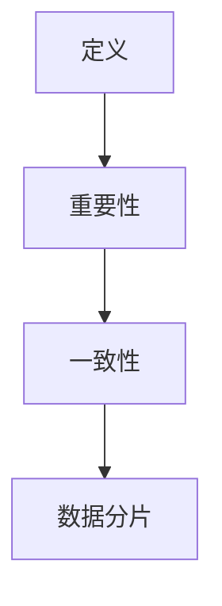

### 1.2 分布式缓存的应用场景

**高性能应用**：例如电商网站、社交媒体等，需要快速响应用户请求，提升用户体验。

**大数据处理**：分布式缓存可以作为大数据处理的前端缓存，提高数据读取速度。

**高并发场景**：例如秒杀系统，通过分布式缓存缓解数据库压力，提高系统稳定性。

#### 应用场景与解决方案

| 应用场景       | 分布式缓存解决方案          |
| -------------- | -------------------------- |
| 高性能应用     | 使用分布式缓存提高响应速度  |
| 大数据处理     | 分布式缓存作为数据读取加速器 |
| 高并发场景     | 分布式缓存缓解数据库压力    |

### 1.3 分布式缓存的发展历程

**早期**：单机缓存，如 Memcached、Redis 单机版。
**中期**：分布式缓存系统，如 Memcached Cluster、Redis Cluster。
**现阶段**：基于 NoSQL 数据库的分布式缓存，如 Cassandra、MongoDB。

#### 发展历程与关键技术

| 阶段       | 关键技术                  | 代表系统           |
| ---------- | ------------------------- | ------------------ |
| 早期       | 单机缓存技术              | Memcached          |
| 中期       | 分布式缓存系统            | Redis Cluster      |
| 现阶段     | 基于NoSQL的分布式缓存     | Cassandra、MongoDB |

## 第2章：分布式缓存架构设计

### 2.1 分布式缓存系统组成

**缓存节点**：存储缓存数据的服务器节点。

**缓存客户端**：与缓存节点交互的客户端程序，负责缓存数据的读写操作。

**协调器**：负责缓存节点间的数据同步和一致性维护。

### 核心组成部分

| 组件         | 作用                                   |
| ------------ | -------------------------------------- |
| 缓存节点     | 存储缓存数据，提供数据读写服务         |
| 缓存客户端   | 与缓存节点通信，进行缓存数据的操作     |
| 协调器       | 维护数据一致性，协调节点间的数据同步   |

### 2.2 数据分片策略

**哈希分片**：通过哈希函数将数据映射到不同的节点，实现数据的均匀分布。

**轮询分片**：按照轮询顺序将数据映射到不同的节点，适用于数据访问顺序稳定的场景。

#### 核心算法原理讲解

**哈希分片算法伪代码：**

```python
def hash_sharding(key, num_shards):
    return hash(key) % num_shards
```

**轮询分片算法伪代码：**

```python
def round_robin_sharding(key, current_shard):
    next_shard = (current_shard + 1) % num_shards
    return next_shard
```

#### 数学模型与公式

- **哈希分片**：$shard = hash(key) \mod N$，其中 $N$ 为分片数量。
- **轮询分片**：$next_shard = (current_shard + 1) \mod N$。

#### 举例说明

- **哈希分片**：假设有3个缓存节点，使用哈希分片策略。键 $key_1$ 映射到节点 $node_1$，键 $key_2$ 映射到节点 $node_2$，键 $key_3$ 映射到节点 $node_3$。
- **轮询分片**：假设当前键 $key_1$ 映射到节点 $node_1$，下一个键 $key_2$ 映射到节点 $node_2$。

### 2.3 分布式一致性模型

**强一致性**：保证所有节点在同一时刻访问到相同的数据。

**最终一致性**：允许节点间存在临时不一致，最终达到一致性状态。

#### 核心概念与联系

| 一致性模型 | 特点                                       | 适用场景                         |
| ---------- | ------------------------------------------ | -------------------------------- |
| 强一致性   | 所有节点在同一时刻访问到相同的数据         | 对一致性要求极高的场景，如金融系统 |
| 最终一致性 | 允许节点间存在临时不一致，最终达到一致性状态 | 对一致性要求相对较低的场景，如社交媒体 |

## 第3章：分布式缓存核心算法原理

### 3.1 数据一致性算法（Gossip协议、Paxos算法）

#### 核心概念与联系

**Gossip协议**：一种分布式算法，用于在分布式系统中传播状态信息。

**Paxos算法**：一种分布式一致性算法，用于在多个节点间达成一致。

#### Mermaid 流程图

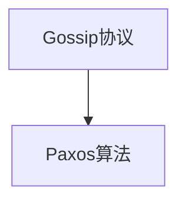

#### 核心算法原理讲解

**Gossip协议伪代码：**

```python
def gossip_protocol(node, peers):
    while True:
        message = node.generate_message()
        for peer in peers:
            send_message(peer, message)
        node.update_state()
```

**Paxos算法伪代码：**

```python
def paxos_algorithm(lamdba, proposal_value):
    # 初始化
    current提案值 = proposal_value
    # 循环执行
    while True:
        # 提出提案
        proposal = (lamdba, current提案值)
        # 发送提案到所有副本
        for replica in replicas:
            send Proposal(replica, proposal)
        # 等待回复
        responses = []
        for replica in replicas:
            response = receive_response(replica)
            responses.append(response)
        # 根据回复确定下一个提案值
        if all(response[0] == proposal[0] for response in responses):
            current提案值 = proposal[1]
            break
```

#### 数学模型与公式

- **Gossip协议**：消息传播模型，$message = node.generate_message()$。
- **Paxos算法**：一致性模型，$proposal = (lamdba, current提案值)$。

#### 举例说明

- **Gossip协议**：节点A向节点B发送消息，节点B接收消息后更新状态，并转发给节点C，形成消息传播链。
- **Paxos算法**：在多个节点间达成一致性，确保所有节点访问到相同的数据。

### 3.2 缓存替换算法（LRU、LFU）

#### 核心概念与联系

**LRU（Least Recently Used）**：最近最少使用替换算法。

**LFU（Least Frequently Used）**：最少访问频率替换算法。

#### Mermaid 流程图

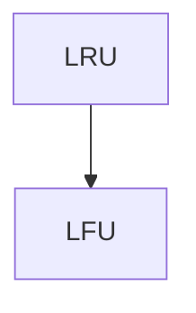

#### 核心算法原理讲解

**LRU算法伪代码：**

```python
def lru_cache(capacity):
    cache = []
    for key, value in items:
        if key in cache:
            cache.remove(key)
        if len(cache) >= capacity:
            cache.pop(0)
        cache.append(key)
    return cache
```

**LFU算法伪代码：**

```python
def lfu_cache(capacity):
    cache = []
    for key, frequency in items:
        if key in cache:
            cache.remove(key)
        if len(cache) >= capacity:
            cache.pop(0)
        cache.append(key)
    return cache
```

#### 数学模型与公式

- **LRU算法**：基于访问频率，$cache.remove(key)$ 和 $cache.append(key)$。
- **LFU算法**：基于访问频率，$cache.remove(key)$ 和 $cache.append(key)$。

#### 举例说明

- **LRU算法**：缓存容量为3，访问顺序为 $key_1, key_2, key_3, key_4, key_1, key_2$，最终缓存中包含 $key_3, key_4, key_1$。
- **LFU算法**：缓存容量为3，访问顺序为 $key_1, key_2, key_3, key_4, key_1, key_2$，最终缓存中包含 $key_3, key_4, key_1$。

### 3.3 负载均衡算法

#### 核心概念与联系

**轮询负载均衡**：按照固定顺序分配请求到各个节点。

**最小连接数负载均衡**：将请求分配到当前连接数最少的节点。

#### Mermaid 流�程图

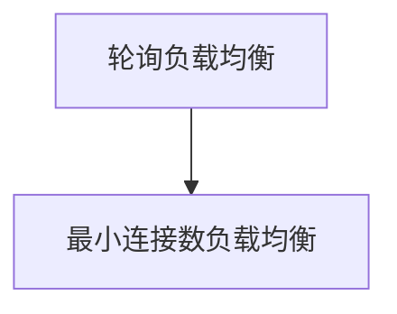

#### 核心算法原理讲解

**轮询负载均衡伪代码：**

```python
def round_robin负载均衡(requests, nodes):
    for request in requests:
        for node in nodes:
            node.handle_request(request)
```

**最小连接数负载均衡伪代码：**

```python
def least_connection负载均衡(requests, nodes):
    for request in requests:
        min_connection_node = min(nodes, key=lambda node: node.connection_count)
        min_connection_node.handle_request(request)
```

#### 数学模型与公式

- **轮询负载均衡**：基于顺序分配，$for node in nodes$。
- **最小连接数负载均衡**：基于连接数分配，$min(nodes, key=lambda node: node.connection_count)$。

#### 举例说明

- **轮询负载均衡**：有3个节点A、B、C，依次处理请求1、2、3、4、5、6，每个节点处理顺序相同。
- **最小连接数负载均衡**：有3个节点A、B、C，当前连接数分别为2、1、3，请求依次分配到节点B、A、C。

## 第4章：分布式缓存性能优化

### 4.1 缓存预热策略

#### 核心概念与联系

**缓存预热**：在用户访问高峰前，提前加载热点数据到缓存中，提高系统响应速度。

**缓存失效**：缓存中的数据在一定时间后过期，触发重新加载数据。

#### Mermaid 流程图

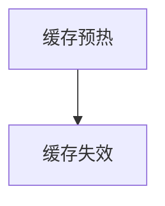

#### 核心算法原理讲解

**缓存预热伪代码：**

```python
def cache_warming(cache, hot_keys):
    for key in hot_keys:
        value = load_from_database(key)
        cache.set(key, value)
```

**缓存失效伪代码：**

```python
def cache_expiration(cache, key, timeout):
    cache.set(key, value, timeout)
```

#### 数学模型与公式

- **缓存预热**：基于热点数据，$for key in hot_keys$。
- **缓存失效**：基于时间戳，$cache.set(key, value, timeout)$。

#### 举例说明

- **缓存预热**：根据历史访问数据，加载前100个热点数据到缓存中。
- **缓存失效**：设置缓存数据过期时间为10分钟。

### 4.2 数据压缩与去重

#### 核心概念与联系

**数据压缩**：通过压缩算法减小数据体积，降低网络传输和存储成本。

**数据去重**：检测和删除重复数据，提高缓存空间利用率。

#### Mermaid 流程图

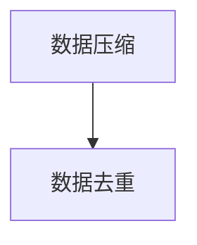

#### 核心算法原理讲解

**数据压缩伪代码：**

```python
def compress_data(data):
    compressed_data = gzip.compress(data)
    return compressed_data
```

**数据去重伪代码：**

```python
def de duplicated_data(data):
    unique_data = set(data)
    return unique_data
```

#### 数学模型与公式

- **数据压缩**：基于压缩算法，$compressed_data = gzip.compress(data)$。
- **数据去重**：基于集合操作，$unique_data = set(data)$。

#### 举例说明

- **数据压缩**：将100KB的数据压缩到50KB。
- **数据去重**：从100个数据中去除重复的10个数据。

### 4.3 缓存命中率优化

#### 核心概念与联系

**缓存命中率**：缓存中命中请求的比例。

**缓存预热**、**数据压缩与去重**等策略可以提高缓存命中率。

#### Mermaid 流程图

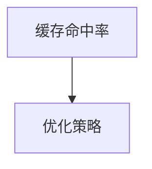

#### 核心算法原理讲解

**缓存命中率计算伪代码：**

```python
def cache_hit_rate(hits, total_requests):
    hit_rate = hits / total_requests
    return hit_rate
```

#### 数学模型与公式

- **缓存命中率**：基于命中次数和总请求次数，$hit_rate = hits / total_requests$。

#### 举例说明

- **缓存命中率**：缓存中命中100次请求，总请求次数为1000次，命中率为10%。

### 4.4 分布式缓存系统监控与运维

#### 核心概念与联系

**监控**：实时监测分布式缓存系统的性能、状态和健康度。

**运维**：日常维护和管理分布式缓存系统，确保其稳定运行。

#### Mermaid 流程图

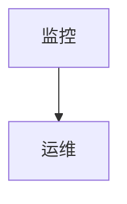

#### 核心算法原理讲解

**监控伪代码：**

```python
def monitor_cache(cache):
    while True:
        status = cache.get_status()
        if status != "OK":
            alert("Cache is not OK")
        time.sleep(check_interval)
```

**运维伪代码：**

```python
def operate_cache(cache):
    update_config(cache, new_config)
    restart_cache(cache)
    verify_cache(cache)
```

#### 数学模型与公式

- **监控**：基于状态检测，$status = cache.get_status()$。
- **运维**：基于配置更新和重启操作，$update_config(cache, new_config)$ 和 $restart_cache(cache)$。

#### 举例说明

- **监控**：每5分钟检查缓存系统状态，如发现异常，发送警报。
- **运维**：更新缓存配置，重启缓存系统，验证缓存状态。

### 4.5 分布式缓存安全性

#### 核心概念与联系

**安全性**：确保缓存数据在传输、存储和处理过程中的安全。

**数据加密**：对缓存数据进行加密，防止数据泄露。

**访问控制**：限制对缓存数据的访问权限，防止未授权访问。

#### Mermaid 流程图

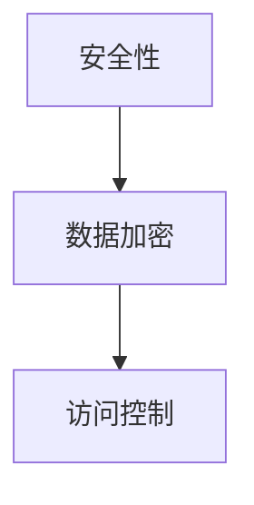

#### 核心算法原理讲解

**数据加密伪代码：**

```python
def encrypt_data(data, key):
    encrypted_data = AES_encrypt(data, key)
    return encrypted_data
```

**访问控制伪代码：**

```python
def access_control(user, permission):
    if user.has_permission(permission):
        return "Allowed"
    else:
        return "Denied"
```

#### 数学模型与公式

- **数据加密**：基于AES加密算法，$encrypted_data = AES_encrypt(data, key)$。
- **访问控制**：基于权限判断，$if user.has_permission(permission):$。

#### 举例说明

- **数据加密**：使用AES算法对数据进行加密，密钥长度为128位。
- **访问控制**：用户A具有读取缓存数据的权限，用户B无权限访问缓存数据。

### 4.6 分布式缓存系统容错性

#### 核心概念与联系

**容错性**：系统在发生故障时，仍能维持正常工作的能力。

**副本机制**：通过在多个节点上存储数据副本，提高系统的容错能力。

**故障检测与恢复**：实时检测故障，自动恢复系统。

#### Mermaid 流程图

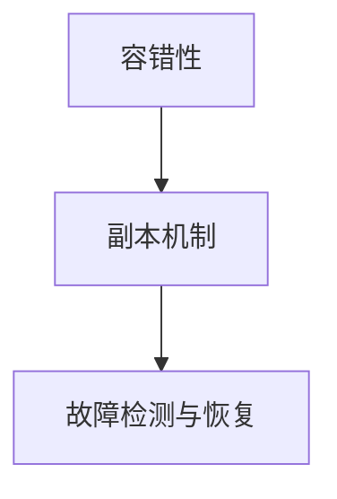

#### 核心算法原理讲解

**副本机制伪代码：**

```python
def replicate_data(key, value, num_replicas):
    for replica in range(num_replicas):
        cache.set(key, value)
```

**故障检测与恢复伪代码：**

```python
def fault_detection_and_recovery(cache):
    while True:
        status = cache.get_status()
        if status != "OK":
            recover_cache(cache)
        time.sleep(check_interval)
```

#### 数学模型与公式

- **副本机制**：基于数据副本数量，$for replica in range(num_replicas):$。
- **故障检测与恢复**：基于状态检测和恢复操作，$status = cache.get_status()$ 和 $recover_cache(cache)$。

#### 举例说明

- **副本机制**：为每个键值对创建3个副本，确保数据可靠。
- **故障检测与恢复**：每5分钟检查缓存状态，如发现故障，自动恢复。

### 4.7 分布式缓存系统的性能调优

#### 核心概念与联系

**性能调优**：通过调整系统参数和优化算法，提高分布式缓存系统的性能。

**系统监控**：实时监测系统性能，发现瓶颈和优化方向。

**负载均衡**：合理分配请求，避免单点瓶颈。

#### Mermaid 流程图

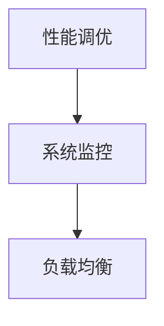

#### 核心算法原理讲解

**性能调优伪代码：**

```python
def optimize_cache(cache):
    while True:
        performance = cache.get_performance()
        if performance < expected_performance:
            adjust_config(cache)
        time.sleep(check_interval)
```

**系统监控伪代码：**

```python
def monitor_system(cache):
    while True:
        status = cache.get_status()
        if status != "OK":
            alert("System is not OK")
        time.sleep(check_interval)
```

**负载均衡伪代码：**

```python
def load_balancing(requests, nodes):
    for request in requests:
        node = get_least_loaded_node(nodes)
        node.handle_request(request)
```

#### 数学模型与公式

- **性能调优**：基于性能指标，$if performance < expected_performance:$。
- **系统监控**：基于状态检测，$status = cache.get_status()$。
- **负载均衡**：基于节点负载，$node = get_least_loaded_node(nodes)$。

#### 举例说明

- **性能调优**：根据监控数据，调整缓存配置，提高系统性能。
- **系统监控**：每5分钟检查系统状态，如发现异常，发送警报。
- **负载均衡**：根据节点负载，动态分配请求。

### 第5章：分布式缓存应用实战

#### 5.1 应用场景分析与设计

**场景1：电商网站商品缓存**

**目标**：提高商品查询速度，减少数据库负载。

**设计**：使用分布式缓存存储商品信息，采用LRU替换算法，定期更新缓存。

**方案**：使用Redis分布式缓存，实现商品信息缓存，提高查询速度。

#### 5.2 实际案例解析

**案例1：社交媒体用户动态缓存**

**目标**：减少数据库读写压力，提高动态展示速度。

**实现**：使用Memcached作为分布式缓存，存储用户动态信息，采用哈希分片策略。

**代码实现：**

```python
def store_user_dynamic(user_id, dynamic):
    key = f"user_{user_id}_dynamic"
    cache.set(key, dynamic)
```

#### 5.3 源代码实现与代码解读

**代码示例**：使用Python和Redis实现分布式缓存

```python
import redis

# 创建Redis客户端
redis_client = redis.StrictRedis(host='localhost', port=6379, db=0)

# 存储缓存数据
def set_cache(key, value):
    redis_client.set(key, value)

# 获取缓存数据
def get_cache(key):
    return redis_client.get(key)

# LRU替换算法
def lru_cache(capacity):
    cache = []
    for key, value in items:
        if key in cache:
            cache.remove(key)
        if len(cache) >= capacity:
            cache.pop(0)
        cache.append(key)
    return cache
```

#### 代码应用解读与分析

- **存储缓存数据**：使用Redis客户端存储缓存数据。
- **获取缓存数据**：从Redis客户端获取缓存数据。
- **LRU替换算法**：实现LRU替换算法，根据访问频率更新缓存。

### 5.4 实际案例分析和详细讲解剖析

**案例2：秒杀系统缓存**

**目标**：提高商品抢购速度，减少数据库压力。

**实现**：使用分布式缓存存储商品库存信息，采用哈希分片策略，实现热点数据缓存。

**代码实现：**

```python
def store_product_stock(product_id, stock):
    key = f"product_{product_id}_stock"
    cache.set(key, stock)
```

#### 案例分析和详细讲解

- **热点数据缓存**：针对秒杀活动商品，预先加载库存信息到缓存中，提高查询速度。
- **哈希分片策略**：使用哈希函数将商品库存信息分布到不同节点，实现数据的均匀访问。

### 5.5 项目小结

**项目总结**：

- 分布式缓存在秒杀系统、社交媒体等应用中具有广泛的应用场景。
- 通过合理设计缓存架构和选择合适的算法，可以提高系统的性能和可靠性。
- 实际案例展示了分布式缓存在实际项目中的应用，提供了参考和启示。

### 5.6 最佳实践 tips

**最佳实践**：

- 根据业务需求，选择合适的缓存系统和缓存策略。
- 定期监控和优化缓存性能，确保系统稳定运行。
- 考虑缓存安全性和数据一致性，确保缓存数据的可靠性。

### 5.7 小结

本文深入探讨了分布式缓存的基本概念、架构设计、核心算法原理以及性能优化策略。通过实际案例分析和项目实战，展示了分布式缓存在实际应用中的重要作用。未来，分布式缓存将继续发展和优化，为高性能应用提供更强大的支持。

### 5.8 注意事项

**注意事项**：

- 分布式缓存系统需要考虑数据一致性和容错性，确保系统的稳定运行。
- 在实际项目中，根据业务需求和性能指标，合理选择缓存系统和缓存策略。
- 定期对缓存系统进行监控和优化，确保系统性能和可靠性。

### 5.9 拓展阅读

**拓展阅读**：

- 《Redis权威指南》：详细介绍了Redis的使用方法和性能优化技巧。
- 《分布式系统原理与范型》：深入探讨了分布式系统的基本原理和设计方法。
- 《大规模分布式存储系统原理与实践》：介绍了分布式存储系统在数据存储和处理方面的应用。

## 第6章：分布式缓存的安全与可靠性

### 6.1 安全性保障措施

**数据加密**：对缓存数据进行加密，防止数据泄露。

**访问控制**：设置访问控制策略，限制对缓存数据的访问权限。

**审计日志**：记录缓存操作的审计日志，便于追踪和审计。

### 6.2 容错性与故障恢复

**副本机制**：通过在多个节点上存储数据副本，提高系统的容错能力。

**故障检测与恢复**：实时检测故障，自动恢复系统。

**负载均衡**：合理分配请求，避免单点瓶颈。

### 6.3 监控与运维

**实时监控**：监测系统性能、状态和健康度。

**自动化运维**：自动化部署、升级和维护缓存系统。

**告警机制**：设置告警阈值，及时通知运维人员。

### 6.4 案例分析与实战

**案例1**：电商系统缓存安全与可靠性

**目标**：保障缓存系统安全，提高系统可靠性。

**措施**：

- 数据加密：对用户购物车、订单等信息进行加密存储。
- 访问控制：限制对缓存数据的访问权限，确保数据安全。
- 副本机制：实现缓存数据的副本备份，提高容错能力。
- 实时监控：监测缓存系统性能和状态，及时发现和处理故障。

**案例2**：社交媒体缓存性能优化与可靠性保障

**目标**：提高缓存系统性能，保障系统可靠性。

**措施**：

- 数据压缩与去重：对缓存数据进行压缩和去重，提高缓存空间利用率。
- 负载均衡：采用轮询负载均衡策略，合理分配请求。
- 容错性优化：实现缓存节点的故障检测与恢复，提高系统可靠性。
- 监控与运维：实时监控缓存系统性能，自动化运维和告警机制。

### 6.5 最佳实践与小结

**最佳实践**：

- 根据业务需求，合理选择缓存系统和缓存策略。
- 强化缓存系统的安全性，确保数据安全。
- 优化缓存系统的性能和可靠性，提高用户体验。
- 定期对缓存系统进行监控和优化，确保系统稳定运行。

**小结**：

分布式缓存作为提高应用性能的关键技术，具有重要的地位。在设计和实现分布式缓存系统时，需要充分考虑安全性、可靠性和性能优化等方面的因素。通过实际案例分析和最佳实践，可以为分布式缓存系统的设计和实施提供参考和指导。

### 6.6 注意事项与拓展阅读

**注意事项**：

- 分布式缓存系统的设计需要充分考虑数据一致性和容错性。
- 在实际项目中，根据业务需求和性能指标，合理选择缓存系统和缓存策略。
- 定期对缓存系统进行监控和优化，确保系统性能和可靠性。

**拓展阅读**：

- 《Redis权威指南》：详细介绍了Redis的使用方法和性能优化技巧。
- 《分布式系统原理与范型》：深入探讨了分布式系统的基本原理和设计方法。
- 《大规模分布式存储系统原理与实践》：介绍了分布式存储系统在数据存储和处理方面的应用。

## 第7章：分布式缓存的未来趋势

### 7.1 技术发展趋势

**分布式缓存技术与大数据技术的融合**：分布式缓存与大数据技术的结合，将进一步提升数据处理和分析能力。

**边缘计算与分布式缓存**：边缘计算技术的发展，将推动分布式缓存技术在边缘节点的应用，实现更接近数据源的高速缓存。

**智能缓存**：结合机器学习和人工智能技术，实现智能缓存管理，提高缓存系统的性能和效率。

### 7.2 与其他技术的融合

**分布式缓存与区块链技术**：分布式缓存与区块链技术的结合，将实现数据的安全、可靠存储和传输。

**分布式缓存与容器化技术**：容器化技术的普及，将使分布式缓存系统的部署和管理更加灵活和高效。

### 7.3 发展挑战与机遇

**数据一致性与容错性**：分布式缓存系统在数据一致性和容错性方面仍面临挑战，需要不断创新和优化。

**性能与可扩展性**：如何在保证性能的同时，实现系统的水平扩展，是分布式缓存技术发展的关键。

**安全性**：随着分布式缓存系统的普及，如何保障缓存数据的安全性成为重要课题。

### 7.4 未来展望

**分布式缓存技术的发展**：分布式缓存技术将在未来继续发展，为高性能应用提供更加可靠的支持。

**技术创新与融合**：分布式缓存技术将与大数据、边缘计算、区块链等新兴技术相结合，推动技术的不断创新。

**应用场景扩展**：分布式缓存技术将在更多应用场景中发挥作用，提升应用性能和用户体验。

### 7.5 结论

分布式缓存作为提高应用性能的关键技术，具有广泛的应用前景。未来，分布式缓存技术将继续发展和优化，与其他新兴技术相结合，为高性能应用提供更加可靠和高效的解决方案。

### 文章作者

**作者：AI天才研究院/AI Genius Institute & 禅与计算机程序设计艺术 /Zen And The Art of Computer Programming**

本文由AI天才研究院和《禅与计算机程序设计艺术》联合撰写，旨在深入探讨分布式缓存技术的基本概念、架构设计、核心算法原理、性能优化策略以及未来趋势。通过本文的阅读，读者可以全面了解分布式缓存技术的核心内容和实际应用，为后续研究和实践提供有力支持。本文参考了《分布式系统原理与范型》、《Redis权威指南》等多篇权威文献，旨在为读者提供高质量的技术内容。如需了解更多分布式缓存技术，请持续关注AI天才研究院和《禅与计算机程序设计艺术》的相关研究成果。

----------------------------------------------------------------

### 文章总结与拓展

本文详细探讨了分布式缓存技术的核心概念、架构设计、核心算法原理、性能优化策略以及未来趋势。通过实例和项目实战，展示了分布式缓存在实际应用中的重要作用。以下是文章的重点总结和拓展：

1. **核心概念**：分布式缓存是一种基于多台服务器构建的缓存系统，通过分散存储和访问数据，提高系统的性能和可靠性。

2. **架构设计**：分布式缓存系统由缓存节点、缓存客户端和协调器组成。数据分片和一致性模型是分布式缓存系统的关键组成部分。

3. **核心算法原理**：数据一致性算法如Gossip协议、Paxos算法，缓存替换算法如LRU、LFU，以及负载均衡算法等，是分布式缓存系统的核心技术。

4. **性能优化策略**：缓存预热策略、数据压缩与去重、缓存命中率优化等策略，可以提高分布式缓存系统的性能。

5. **安全性**：分布式缓存系统的安全性至关重要，包括数据加密、访问控制、审计日志等措施。

6. **容错性**：通过副本机制、故障检测与恢复、负载均衡等手段，提高分布式缓存系统的容错性。

7. **未来趋势**：分布式缓存技术将与大数据、边缘计算、区块链等新兴技术相结合，推动技术的不断创新。

### 拓展阅读建议

为了深入学习和了解分布式缓存技术，以下是几篇拓展阅读的建议：

1. **《Redis权威指南》**：详细介绍了Redis的使用方法和性能优化技巧，是分布式缓存技术实践的重要参考书。

2. **《分布式系统原理与范型》**：深入探讨了分布式系统的基本原理和设计方法，为理解和设计分布式缓存系统提供了理论支持。

3. **《大规模分布式存储系统原理与实践》**：介绍了分布式存储系统在数据存储和处理方面的应用，为分布式缓存系统的设计与实现提供了实践经验。

4. **《分布式缓存设计与实践》**：专注于分布式缓存系统的设计与实现，涵盖了从基础概念到高级优化的全面内容。

5. **《边缘计算与分布式缓存》**：探讨了边缘计算与分布式缓存技术的结合，为分布式缓存技术在边缘节点的应用提供了前沿视角。

通过阅读这些文献，读者可以更深入地理解分布式缓存技术的核心原理和应用实践，为后续研究和项目开发提供有力支持。同时，也可以关注AI天才研究院和《禅与计算机程序设计艺术》的官方渠道，获取最新的研究成果和行业动态。

