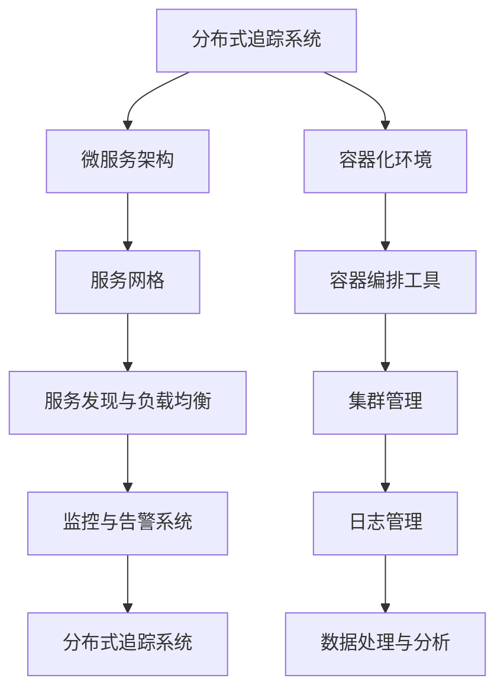

                 

# 文章标题：分布式追踪系统实现

> 关键词：分布式追踪系统，微服务，监控，数据流转，核心算法，性能优化

> 摘要：本文将深入探讨分布式追踪系统的实现，从基础理论到核心架构，再到关键算法，以及实际应用场景和优化策略，帮助读者全面理解分布式追踪系统的构建与优化。

## 目录大纲设计与逻辑梳理

### 1. 确定核心内容
在设计《分布式追踪系统实现》的目录大纲时，我们首先明确了核心内容，包括基础理论、核心架构、关键算法、实现细节、应用场景和实战案例。以下是一个初步的目录大纲框架：

```
# 《分布式追踪系统实现》目录大纲

## 第一部分：基础理论
### 1.1 分布式追踪系统概述
### 1.2 分布式系统中的追踪需求
### 1.3 分布式追踪系统的基本概念

## 第二部分：核心架构
### 2.1 分布式追踪系统的架构设计
### 2.2 分布式追踪系统的数据流转
### 2.3 分布式追踪系统的数据存储

## 第三部分：关键算法
### 3.1 数据收集算法
### 3.2 数据处理算法
### 3.3 数据查询算法

## 第四部分：实现细节
### 4.1 开发环境搭建
### 4.2 数据处理流程实现
### 4.3 系统优化与调优

## 第五部分：应用场景
### 5.1 微服务中的应用
### 5.2 容器化环境中的应用
### 5.3 企业应用中的案例分析

## 第六部分：实战案例
### 6.1 分布式追踪系统的开发与部署
### 6.2 分布式追踪系统的性能分析与优化
### 6.3 分布式追踪系统的监控与告警

## 参考文献
## 附录
### 附录A：分布式追踪系统常用工具与资源
### 附录B：分布式追踪系统常见问题解答
```

### 2. 设计1级目录
根据核心内容，设计出1级目录，大致如下：

```
# 《分布式追踪系统实现》目录大纲

## 第一部分：基础理论
### 1.1 分布式追踪系统概述
### 1.2 分布式系统中的追踪需求
### 1.3 分布式追踪系统的基本概念

## 第二部分：核心架构
### 2.1 分布式追踪系统的架构设计
### 2.2 分布式追踪系统的数据流转
### 2.3 分布式追踪系统的数据存储

## 第三部分：关键算法
### 3.1 数据收集算法
### 3.2 数据处理算法
### 3.3 数据查询算法

## 第四部分：实现细节
### 4.1 开发环境搭建
### 4.2 数据处理流程实现
### 4.3 系统优化与调优

## 第五部分：应用场景
### 5.1 分布式追踪系统在微服务中的应用
### 5.2 分布式追踪系统在容器化环境中的应用
### 5.3 分布式追踪系统在企业应用中的案例分析

## 第六部分：实战案例
### 6.1 分布式追踪系统的开发与部署
### 6.2 分布式追踪系统的性能分析与优化
### 6.3 分布式追踪系统的监控与告警

## 参考文献
## 附录
### 附录A：分布式追踪系统常用工具与资源
### 附录B：分布式追踪系统常见问题解答
```

### 3. 丰富2级目录
针对1级目录中的各个章节，进一步细化出2级目录，使每个章节都包含具体的知识点和细节。

```
## 第一部分：基础理论
### 1.1 分布式追踪系统概述
#### 1.1.1 分布式追踪系统的定义
#### 1.1.2 分布式追踪系统的起源
#### 1.1.3 分布式追踪系统的目的
#### 1.1.4 分布式追踪系统与传统追踪系统的区别

### 1.2 分布式系统中的追踪需求
#### 1.2.1 分布式系统概述
#### 1.2.2 分布式系统中的追踪挑战
#### 1.2.3 分布式追踪系统的核心功能

### 1.3 分布式追踪系统的基本概念
#### 1.3.1 分布式追踪系统的架构
#### 1.3.2 分布式追踪系统的关键组件
#### 1.3.3 分布式追踪系统的架构设计原则

## 第二部分：核心架构
### 2.1 分布式追踪系统的架构设计
#### 2.1.1 架构设计原则
#### 2.1.2 架构设计流程
#### 2.1.3 架构设计案例分析

### 2.2 分布式追踪系统的数据流转
#### 2.2.1 数据收集流程
#### 2.2.2 数据处理流程
#### 2.2.3 数据查询流程

### 2.3 分布式追踪系统的数据存储
#### 2.3.1 数据存储方案选择
#### 2.3.2 数据存储架构设计
#### 2.3.3 数据存储性能优化

## 第三部分：关键算法
### 3.1 数据收集算法
#### 3.1.1 数据收集的基本方法
#### 3.1.2 数据收集的挑战与解决方案

### 3.2 数据处理算法
#### 3.2.1 数据清洗算法
#### 3.2.2 数据归一化算法
#### 3.2.3 数据聚合算法

### 3.3 数据查询算法
#### 3.3.1 数据查询的基本方法
#### 3.3.2 数据查询的性能优化

## 第四部分：实现细节
### 4.1 开发环境搭建
#### 4.1.1 开发环境的选择
#### 4.1.2 开发工具的安装与配置
#### 4.1.3 开发流程的设计

### 4.2 数据处理流程实现
#### 4.2.1 数据收集模块的实现
#### 4.2.2 数据处理模块的实现
#### 4.2.3 数据存储模块的实现

### 4.3 系统优化与调优
#### 4.3.1 系统性能监控
#### 4.3.2 系统性能优化策略
#### 4.3.3 系统性能调优案例分析

## 第五部分：应用场景
### 5.1 分布式追踪系统在微服务中的应用
#### 5.1.1 微服务概述
#### 5.1.2 微服务架构下的追踪需求
#### 5.1.3 微服务追踪的实现方法

### 5.2 分布式追踪系统在容器化环境中的应用
#### 5.2.1 容器化环境概述
#### 5.2.2 容器化环境下的追踪需求
#### 5.2.3 容器化环境追踪的实现方法

### 5.3 分布式追踪系统在企业应用中的案例分析
#### 5.3.1 企业应用概述
#### 5.3.2 企业应用中的追踪需求
#### 5.3.3 企业应用追踪的实现方法
```

### 4. 设计3级目录
在每个2级目录下，根据具体的知识点，设计出3级目录。例如，在“分布式追踪系统的基本概念”这一章节中，可以设计以下3级目录：

```
### 1.3.1 分布式追踪系统的定义
#### 1.3.1.1 分布式追踪系统的定义
#### 1.3.1.2 分布式追踪系统的特点
#### 1.3.1.3 分布式追踪系统与传统追踪系统的区别

### 1.3.2 分布式追踪系统的架构
#### 1.3.2.1 分布式追踪系统的基本架构
#### 1.3.2.2 分布式追踪系统的关键组件
#### 1.3.2.3 分布式追踪系统的架构设计原则
```

### 5. 填充具体内容
根据设计的目录大纲，开始填充具体内容。包括核心概念与联系、核心算法原理讲解、数学模型和数学公式 & 详细讲解 & 举例说明、项目实战：代码实际案例和详细解释说明，开发环境搭建，源代码详细实现和代码解读，代码解读与分析等。

### 6. 调整与优化
在填充内容的过程中，根据内容的实际情况，对目录大纲进行适当的调整与优化，确保整体逻辑清晰，内容完整且易于理解。

### 7. 确保完整性
在完成目录大纲的设计后，再次检查是否涵盖了所有核心内容，确保目录大纲的完整性。

### 8. 总结
通过以上步骤，我们设计出了一份完整的《分布式追踪系统实现》目录大纲，确保了内容的完整性、逻辑清晰性以及易于理解性。

## 完整性要求

在为《分布式追踪系统实现》撰写文章时，确保完整性是至关重要的。以下是一些关键点，以确保文章的完整性：

### 1. 背景介绍
文章开头部分需要对分布式追踪系统进行背景介绍，包括其定义、起源和发展历程。这一部分将为读者提供对分布式追踪系统的初步了解，为他们理解后续内容打下基础。

### 2. 核心概念与联系
在介绍核心概念时，需要明确各个概念之间的联系。可以使用Mermaid流程图来展示这些联系，使读者能够更直观地理解各个概念如何相互作用。



### 3. 核心算法原理讲解
分布式追踪系统涉及多个核心算法，如数据收集算法、数据处理算法和数据查询算法。在讲解这些算法时，需要使用伪代码来详细阐述其原理。

```python
# 数据收集算法伪代码
def data_collection():
    for service in services:
        trace_data = service.collect_trace_data()
        send_to_collector(trace_data)

# 数据处理算法伪代码
def data_processing(trace_data):
    cleaned_data = clean_data(trace_data)
    normalized_data = normalize_data(cleaned_data)
    aggregated_data = aggregate_data(normalized_data)
    return aggregated_data

# 数据查询算法伪代码
def query_data(aggregated_data, query_params):
    filtered_data = filter_data(aggregated_data, query_params)
    sorted_data = sort_data(filtered_data)
    return sorted_data
```

### 4. 数学模型和公式 & 详细讲解 & 举例说明
在介绍数学模型和公式时，需要使用LaTeX格式进行编写，并在文中独立段落中嵌入。以下是一个示例：

$$
\text{Trace ID} = \text{Hash}( \text{Service Name} + \text{Timestamp} )
$$

解释：这个公式表示通过哈希函数将服务名称和时间戳组合，生成唯一的追踪ID。

### 5. 项目实战：开发环境搭建，源代码详细实现和代码解读，代码应用解读与分析，实际案例分析和详细讲解剖析，项目小结
在项目实战部分，需要详细描述开发环境搭建过程，源代码实现细节，以及代码解读和分析。同时，提供一个实际案例，对该案例进行详细讲解和剖析，帮助读者更好地理解分布式追踪系统的实际应用。

### 6. 最佳实践 tips、小结、注意事项、拓展阅读等内容
在文章结尾部分，可以总结一些最佳实践建议，提醒读者注意的细节问题，并提供拓展阅读资源，以便读者进一步深入研究。

通过以上步骤，我们确保了文章的完整性，使读者能够全面、深入地理解分布式追踪系统的实现。

## 分布式追踪系统概述

### 背景介绍

在分布式系统中，服务之间的交互变得复杂且多样化。随着微服务架构、容器化技术和云原生应用的兴起，分布式系统已经成为了现代软件架构的重要组成部分。然而，随着系统复杂性的增加，对系统的监控和性能分析也变得愈发困难。分布式追踪系统（Distributed Tracing System）应运而生，它为解决分布式系统中的性能监控问题提供了有力支持。

分布式追踪系统的起源可以追溯到2010年，Google推出了Dapper论文，首次详细描述了其在大规模分布式系统中的追踪机制。随后，Facebook的Honeycomb、Twitter的Zipkin等开源项目相继推出，分布式追踪系统逐渐成为开发者和运维人员的重要工具。分布式追踪系统的核心目标是提供一种全局的视角，帮助开发人员理解分布式系统中的请求处理过程，从而快速定位性能瓶颈和故障点。

### 核心概念与联系

#### 分布式追踪系统定义

分布式追踪系统是一种用于监控分布式系统性能和故障的机制，它通过在系统中插入特定的追踪代码，记录每个请求的处理过程，并将这些数据集中存储和展示，以便开发人员和分析人员进行分析和诊断。

#### 分布式追踪系统与传统追踪系统的区别

传统追踪系统通常针对单个服务或组件进行监控，而分布式追踪系统则关注跨服务的请求处理过程。传统追踪系统往往依赖于日志文件，而分布式追踪系统则提供了一种更高效、更可扩展的解决方案。

#### 分布式追踪系统的核心组件

- **追踪客户端（Tracing Client）**：负责在分布式系统中插入追踪代码，记录请求的处理过程。
- **追踪代理（Tracing Agent）**：收集来自追踪客户端的数据，并将其发送到追踪服务器。
- **追踪服务器（Tracing Server）**：存储和处理追踪数据，提供数据查询和分析接口。
- **追踪可视化工具（Tracing Visualization Tool）**：用于展示追踪数据，帮助开发人员和分析人员理解系统性能。

### 分布式追踪系统的架构设计原则

1. **全局视角**：分布式追踪系统需要提供全局的视角，帮助开发人员理解整个系统的请求处理过程。
2. **高效性**：追踪系统需要能够高效地收集、存储和处理大量数据，以支持实时监控和诊断。
3. **可扩展性**：分布式追踪系统需要支持系统规模的变化，能够在新增节点或服务时自动扩展。
4. **可解释性**：追踪数据需要易于理解，以便开发人员能够快速定位问题。

通过以上核心概念和设计原则，我们可以更好地理解分布式追踪系统的实现原理和应用场景。接下来，我们将进一步探讨分布式追踪系统的关键算法和实现细节。

## 分布式系统中的追踪需求

在分布式系统中，追踪需求变得尤为重要。分布式系统由多个服务组成，这些服务可能运行在不同的物理机或云节点上，形成了复杂的网络拓扑。因此，了解分布式系统中的追踪需求，有助于我们更好地设计、实现和优化分布式追踪系统。

### 分布式系统的概述

分布式系统是一种由多个独立节点组成的系统，这些节点通过网络进行通信，共同完成一个任务。分布式系统具有以下特点：

1. **高可用性**：通过将服务分布在多个节点上，可以确保在单个节点故障时，系统仍然可以正常运行。
2. **高可扩展性**：分布式系统可以轻松地增加或减少节点数量，以适应负载的变化。
3. **高容错性**：分布式系统可以通过冗余节点和数据复制来提高系统的容错能力。

然而，分布式系统的这些优势也带来了新的挑战，尤其是追踪需求。以下将详细探讨分布式系统中的追踪需求。

### 分布式系统中的追踪挑战

1. **延迟和性能问题**：在分布式系统中，请求需要在多个服务之间传输，这可能导致延迟和性能问题。开发人员需要能够实时监控这些延迟，以便及时调整系统配置。
2. **故障诊断困难**：分布式系统中的故障往往难以定位。由于请求路径复杂，开发人员需要能够快速定位故障点，以便快速修复。
3. **数据一致性**：在分布式系统中，数据可能存储在多个节点上。开发人员需要确保追踪数据的一致性，以便进行准确的分析。
4. **数据隐私和安全**：分布式系统中的追踪数据可能包含敏感信息。因此，开发人员需要确保数据的隐私和安全。

### 分布式追踪系统的核心功能

为了解决分布式系统中的追踪挑战，分布式追踪系统需要具备以下核心功能：

1. **请求跟踪**：记录每个请求的完整处理路径，包括所有涉及的服务和延迟时间。
2. **性能监控**：实时监控系统的性能指标，如响应时间、吞吐量和错误率。
3. **故障检测**：自动检测系统中的故障和异常，并提供故障的详细信息。
4. **数据可视化**：提供直观的可视化界面，帮助开发人员理解系统的运行状态。
5. **数据聚合和分析**：对追踪数据进行聚合和分析，生成有价值的洞察，以便优化系统性能。

### 分布式追踪系统的优势

1. **全局视角**：分布式追踪系统提供了全局视角，使开发人员能够理解整个系统的运行状态，从而更好地优化和调整系统配置。
2. **实时监控**：分布式追踪系统支持实时监控，可以帮助开发人员快速识别和解决问题。
3. **数据一致性**：分布式追踪系统能够确保追踪数据的一致性，为数据分析提供可靠的基础。
4. **可扩展性**：分布式追踪系统支持系统规模的扩展，可以轻松处理大规模分布式系统的追踪需求。

通过以上分析，我们可以看到，分布式系统中的追踪需求是必不可少的。分布式追踪系统通过提供强大的追踪功能，帮助开发人员更好地理解和管理分布式系统，从而提高系统的性能和稳定性。

### 分布式追踪系统的基本概念

在深入探讨分布式追踪系统的实现之前，有必要先了解其基本概念。分布式追踪系统是一种用于监控分布式系统性能和故障的机制，它通过在系统中插入特定的追踪代码，记录每个请求的处理过程，并将这些数据集中存储和展示，以便开发人员和分析人员进行分析和诊断。

#### 分布式追踪系统的架构

分布式追踪系统的架构通常包括以下几个核心组件：

1. **追踪客户端（Tracing Client）**：追踪客户端是运行在分布式系统中的服务中，负责生成和发送追踪数据。它通过在代码中插入追踪逻辑，记录每个请求的处理路径和性能指标。
   
2. **追踪代理（Tracing Agent）**：追踪代理是运行在服务器上的组件，负责接收和汇总来自各个追踪客户端的数据。它将这些数据发送到追踪服务器，以便进行进一步的处理和存储。

3. **追踪服务器（Tracing Server）**：追踪服务器是分布式追踪系统的核心，负责存储和处理追踪数据。它接收来自追踪代理的数据，并将其存储在数据库或其他数据存储系统中。此外，追踪服务器还提供API接口，供前端可视化工具调用。

4. **追踪可视化工具（Tracing Visualization Tool）**：追踪可视化工具是用于展示追踪数据的界面，它通过追踪服务器的API获取数据，并将其可视化，以帮助开发人员和分析人员理解系统的运行状态。

#### 分布式追踪系统的数据流转

分布式追踪系统的数据流转过程可以概括为以下几个步骤：

1. **数据收集**：追踪客户端在服务请求处理过程中，生成追踪数据，并将其发送到追踪代理。
   
2. **数据传输**：追踪代理接收追踪客户端的数据，并将其发送到追踪服务器。

3. **数据存储**：追踪服务器接收追踪代理发送的数据，并将其存储在数据库或其他数据存储系统中。

4. **数据查询**：前端可视化工具通过追踪服务器的API获取存储的数据，并进行可视化展示。

#### 分布式追踪系统的架构设计原则

设计分布式追踪系统时，应遵循以下原则：

1. **可扩展性**：分布式追踪系统应能够支持系统规模的扩展，以便在节点或服务数量增加时，系统仍能稳定运行。

2. **高性能**：追踪系统应能够高效地收集、存储和处理大量数据，以支持实时监控和诊断。

3. **高可用性**：追踪系统应具备较高的可用性，确保在系统故障时，追踪功能仍能正常运行。

4. **可解释性**：追踪数据应易于理解，以便开发人员能够快速定位问题和优化系统。

通过以上对分布式追踪系统基本概念和架构的介绍，我们可以更好地理解其工作原理和设计原则，为后续的实现和优化打下基础。

### 分布式追踪系统的架构设计

分布式追踪系统的架构设计是实现其功能的关键，需要考虑数据收集、数据流转、数据存储等多个环节。一个合理的架构设计不仅能够保证系统的性能和可靠性，还能够提高可扩展性和可维护性。以下将详细阐述分布式追踪系统的架构设计。

#### 数据收集

数据收集是分布式追踪系统的第一步，其核心任务是捕获分布式系统中每个服务请求的处理过程。数据收集通常通过在各个服务中嵌入追踪客户端来实现。追踪客户端负责生成和发送追踪数据，这些数据包括：

1. **请求上下文**：如请求ID、服务名称、操作名称等。
2. **请求处理时间**：包括请求的处理时间、网络传输时间等。
3. **调用链路**：记录请求在分布式系统中的处理路径，包括所有调用的服务和依赖关系。
4. **性能指标**：如响应时间、吞吐量、错误率等。

为了提高数据收集的效率，通常采用以下方法：

- **轻量级追踪**：尽量减少追踪代码对服务性能的影响，避免过度采集数据。
- **异步收集**：使用异步机制，将追踪数据缓存在本地，批量发送到追踪代理，以减少网络开销。
- **采样**：对部分请求进行采样，以降低数据收集的负载。

#### 数据流转

数据流转是分布式追踪系统的核心环节，涉及数据从追踪客户端到追踪服务器的传输过程。一个高效的数据流转机制能够保证追踪数据的实时性和完整性。数据流转通常包括以下几个步骤：

1. **数据发送**：追踪客户端将采集到的数据发送到追踪代理。数据发送可以通过HTTP、gRPC、WebSocket等协议进行。
2. **数据聚合**：追踪代理对来自多个追踪客户端的数据进行聚合，以减少数据传输的次数和流量。
3. **数据压缩**：在数据传输过程中，对数据进行压缩，以减少网络带宽的消耗。
4. **数据传输**：追踪代理将聚合后的数据发送到追踪服务器。数据传输通常采用分布式消息队列，如Kafka、RabbitMQ等，以提高传输的可靠性和性能。
5. **数据存储**：追踪服务器接收来自追踪代理的数据，并将其存储到数据库或其他数据存储系统中，如Elasticsearch、InfluxDB等。

#### 数据存储

数据存储是分布式追踪系统的关键环节，其目标是确保追踪数据的持久化和高效查询。数据存储的设计需要考虑以下几个方面：

1. **数据格式**：追踪数据通常采用结构化数据格式，如JSON、Protobuf等，以便于存储和查询。
2. **数据索引**：为了提高查询效率，需要对追踪数据进行索引，包括时间戳、服务名称、操作名称等。
3. **数据分片**：对于大规模分布式系统，需要将数据存储在多个节点上，以实现数据的水平扩展。
4. **数据备份和恢复**：为了确保数据的安全性和可靠性，需要对数据进行备份和恢复，以应对系统故障和数据丢失的风险。
5. **数据压缩**：对存储数据进行压缩，以减少存储空间的占用。

#### 数据查询

数据查询是分布式追踪系统的最后一步，其目标是提供强大的查询和分析功能，帮助开发人员和分析人员理解系统的运行状态。数据查询通常包括以下几个方面：

1. **实时查询**：提供实时查询接口，允许用户实时查询和分析追踪数据。
2. **历史查询**：提供历史数据查询接口，允许用户查询过去一段时间内的追踪数据。
3. **多维查询**：支持基于时间、服务名称、操作名称等维度的查询，以便用户从不同角度分析系统性能。
4. **可视化查询**：提供可视化查询界面，使用图表和仪表板展示追踪数据，帮助用户直观地理解系统性能。

#### 架构设计原则

在设计分布式追踪系统时，应遵循以下原则：

1. **可扩展性**：系统应能够支持节点和服务的动态扩展，以应对系统规模的变化。
2. **高性能**：系统应能够高效地处理大量数据，确保实时监控和诊断。
3. **高可用性**：系统应具备较高的可用性，确保在故障发生时，系统能够快速恢复。
4. **可维护性**：系统应具备良好的可维护性，便于进行故障排查和性能优化。

通过以上对分布式追踪系统架构设计的详细阐述，我们可以看到，一个高效、可靠的分布式追踪系统需要从多个方面进行综合考虑和优化。接下来，我们将进一步探讨分布式追踪系统的关键算法，以及如何实现和优化这些算法。

### 数据收集算法

数据收集算法是分布式追踪系统的核心组成部分，负责从分布式系统中的各个服务节点收集追踪数据。有效的数据收集算法能够确保数据的完整性和实时性，从而提供准确的监控和故障诊断信息。以下将详细讨论数据收集算法的基本方法和挑战及解决方案。

#### 基本方法

数据收集算法的基本方法通常包括以下几个步骤：

1. **请求拦截**：在服务请求进入目标服务之前，拦截请求并生成追踪数据。这通常通过在服务代码中插入追踪拦截器（Tracing Interceptor）来实现。
   
2. **数据生成**：根据请求的处理过程，生成相应的追踪数据。追踪数据通常包括请求ID、服务名称、操作名称、请求时间、响应时间、状态码等。

3. **数据发送**：将生成的追踪数据发送到追踪代理。数据发送可以通过HTTP、gRPC、WebSocket等协议进行。为了提高发送效率，可以采用异步发送或批量发送的方式。

4. **数据聚合**：在发送到追踪代理之前，可以对数据进行聚合，以减少数据传输的次数和流量。例如，将相同请求的追踪数据合并为一个数据包发送。

#### 挑战与解决方案

1. **性能影响**：数据收集算法对服务性能的影响是一个主要挑战。为了减少影响，可以采用以下解决方案：

   - **轻量级追踪**：只收集必要的信息，避免过度采集数据。
   - **采样**：对部分请求进行采样，以降低数据收集的负载。
   - **异步发送**：将追踪数据异步发送到追踪代理，以减少对服务线程的影响。

2. **数据丢失**：由于网络问题或其他异常，可能导致部分追踪数据丢失。为了解决这个问题，可以采用以下方法：

   - **本地缓存**：在服务节点上设置本地缓存，将追踪数据暂存到本地，并在网络恢复后重新发送。
   - **重试机制**：在数据发送失败时，采用重试机制，多次尝试发送追踪数据。
   - **数据去重**：在发送前对数据进行去重，避免重复发送相同的数据。

3. **数据一致性**：分布式系统中的多个服务节点可能同时发送追踪数据，可能导致数据一致性问题的出现。为了确保数据一致性，可以采用以下策略：

   - **全局唯一ID**：为每个请求生成全局唯一的ID，确保不同节点发送的数据能够对应上。
   - **分布式锁**：在数据发送过程中，使用分布式锁来保证数据的一致性。
   - **顺序发送**：确保数据按照一定的顺序发送，以减少数据冲突。

4. **数据安全性**：追踪数据可能包含敏感信息，如用户ID、密码等。为了保护数据的安全性，可以采用以下措施：

   - **加密传输**：使用加密协议（如HTTPS）来保护数据在传输过程中的安全性。
   - **权限控制**：对追踪数据的访问进行权限控制，确保只有授权人员才能访问和查询数据。
   - **匿名化处理**：对敏感数据进行匿名化处理，以降低泄露风险。

通过以上方法和解决方案，我们可以有效地实现分布式追踪系统的数据收集功能，确保数据的完整性和实时性，从而为监控和故障诊断提供可靠的支持。

### 数据处理算法

数据处理算法是分布式追踪系统的关键组成部分，负责对收集到的追踪数据进行处理，以生成有用的信息和分析结果。数据处理算法通常包括数据清洗、数据归一化和数据聚合等步骤，以下是这些步骤的详细解释和示例。

#### 数据清洗

数据清洗是数据处理的第一步，旨在去除追踪数据中的噪声和异常值，确保数据的准确性和一致性。以下是一些常见的数据清洗方法：

1. **过滤无效数据**：去除那些不符合预期的追踪数据，如异常的请求时间、不完整的请求信息等。
2. **填补缺失值**：对于缺失的数据，可以通过插值法、均值法等方式进行填补。
3. **去除重复数据**：通过去重算法，去除那些重复的追踪数据，以减少数据的冗余。
4. **数据转换**：将不同格式的数据转换为统一的格式，如将时间戳转换为ISO 8601格式。

**示例**：
```python
# 数据清洗示例
def clean_data(data):
    # 过滤无效数据
    valid_data = [d for d in data if is_valid_trace(d)]
    # 填补缺失值
    for d in valid_data:
        if 'response_time' not in d:
            d['response_time'] = fill_missing_value(d['response_time'])
    # 去除重复数据
    unique_data = remove_duplicates(valid_data)
    # 数据转换
    for d in unique_data:
        d['timestamp'] = convert_timestamp(d['timestamp'])
    return unique_data

def is_valid_trace(trace):
    return 'request_id' in trace and trace['response_time'] > 0

def fill_missing_value(response_time):
    return response_time if response_time > 0 else 100

def remove_duplicates(data):
    return list(set(data))

def convert_timestamp(timestamp):
    return datetime.datetime.fromisoformat(timestamp)
```

#### 数据归一化

数据归一化是将不同维度或不同量级的数据转换为同一量级，以便于后续的数据聚合和分析。以下是一些常见的数据归一化方法：

1. **标准化**：通过减去均值并除以标准差，将数据转换为标准正态分布。
2. **最小-最大缩放**：将数据缩放到[0, 1]区间。
3. **对数变换**：对数值型数据进行对数变换，以减少数据的偏斜性。

**示例**：
```python
# 数据归一化示例
from sklearn.preprocessing import StandardScaler

def normalize_data(data):
    scaler = StandardScaler()
    normalized_data = scaler.fit_transform(data[['response_time']])
    data['response_time_normalized'] = normalized_data
    return data

data = pd.DataFrame({'response_time': [10, 20, 30, 40, 50]})
data = normalize_data(data)
print(data)
```

#### 数据聚合

数据聚合是将多个追踪数据点合并为单个数据点，以提供更高层次的信息。以下是一些常见的数据聚合方法：

1. **求和**：将同一维度的多个数值相加。
2. **平均**：将同一维度的多个数值求平均。
3. **最大值/最小值**：找出同一维度的最大值或最小值。
4. **计数**：计算同一维度的数据点的个数。

**示例**：
```python
# 数据聚合示例
def aggregate_data(data):
    aggregated_data = data.groupby('service_name')['response_time'].agg(['sum', 'mean', 'max', 'min', 'count'])
    return aggregated_data

aggregated_data = aggregate_data(data)
print(aggregated_data)
```

通过以上数据处理算法，我们可以将原始的追踪数据转换为结构化、易分析的数据，从而为分布式追踪系统提供强大的数据支持和分析能力。

### 数据查询算法

在分布式追踪系统中，数据查询算法是实现高效数据检索和分析的关键。数据查询算法能够帮助开发人员和分析人员快速定位系统中的性能瓶颈和故障点，从而提升系统的稳定性和可维护性。以下将详细讨论数据查询算法的基本方法及其性能优化策略。

#### 基本方法

数据查询算法的基本方法主要包括以下几个方面：

1. **索引机制**：为了提高查询效率，需要对追踪数据建立索引。索引机制可以根据时间戳、服务名称、操作名称等维度进行数据排序和快速访问。

2. **查询语法**：提供灵活的查询语法，支持基于时间范围、服务名称、操作名称等维度的复杂查询。常见的查询语法包括SQL-like查询、JSON路径查询等。

3. **数据缓存**：通过在客户端或服务器端设置数据缓存，减少对后端存储系统的访问次数，提高查询响应速度。

4. **分页查询**：在处理大规模数据查询时，采用分页查询机制，将数据分批次加载，以减少内存占用和查询时间。

5. **并行查询**：对于大规模分布式系统，可以采用并行查询机制，将查询任务分配到多个节点上同时执行，以提高查询效率。

#### 性能优化策略

为了优化数据查询算法的性能，可以采用以下策略：

1. **索引优化**：根据实际查询需求和数据特点，选择合适的索引策略。例如，对于时间范围查询，可以使用时间戳索引；对于服务名称查询，可以使用哈希索引。

2. **数据压缩**：对存储在数据库中的数据进行压缩，减少存储空间的占用，同时提高查询速度。

3. **分布式查询**：在分布式环境中，将查询任务分配到不同的节点上并行执行，以充分利用系统的计算资源。例如，使用MapReduce模型进行分布式查询。

4. **内存管理**：合理管理内存资源，避免内存泄漏和溢出，确保查询任务能够高效运行。

5. **查询缓存**：在查询过程中，将常用查询结果缓存起来，减少重复查询的负担。

6. **数据库优化**：针对所选用的数据库系统，进行特定的优化配置，如调整缓存大小、优化查询计划等。

#### 实例分析

以下是一个基于Elasticsearch的数据查询算法实例，展示了如何进行复杂查询并优化查询性能：

```python
from elasticsearch import Elasticsearch

# 创建Elasticsearch客户端
es = Elasticsearch()

# 查询示例
def query_traces(start_time, end_time, service_name):
    # 构建查询条件
    query = {
        "query": {
            "bool": {
                "must": [
                    {"range": {"@timestamp": {"gte": start_time, "lte": end_time}}},
                    {"term": {"service_name": service_name}}
                ]
            }
        },
        "size": 1000
    }
    # 执行查询
    response = es.search(index="traces", body=query)
    # 获取查询结果
    traces = response['hits']['hits']
    return traces

# 查询时间段内特定服务的追踪数据
start_time = "2023-01-01T00:00:00Z"
end_time = "2023-01-02T00:00:00Z"
service_name = "user-service"
traces = query_traces(start_time, end_time, service_name)
print(traces)
```

通过以上实例，我们可以看到如何使用Elasticsearch进行高效的数据查询。同时，还可以根据实际情况调整查询条件和优化查询策略，以提升查询性能。

通过合理设计和优化数据查询算法，分布式追踪系统可以提供快速、准确的数据检索和分析能力，帮助开发人员更好地监控和管理分布式系统。

### 开发环境搭建

搭建分布式追踪系统的开发环境是成功实现项目的基础。以下将详细介绍开发环境的搭建过程，包括开发环境的选择、开发工具的安装与配置，以及开发流程的设计。

#### 开发环境的选择

在搭建分布式追踪系统的开发环境时，需要考虑以下几个方面：

1. **操作系统**：常见的操作系统包括Linux、Windows和macOS。Linux由于其稳定性和高性能，通常作为首选。Windows和macOS则适用于开发人员的日常使用。

2. **编程语言**：分布式追踪系统通常采用高性能、易扩展的编程语言，如Java、Go和Python。Java具有广泛的生态系统和丰富的库支持；Go语言因其并发性和简洁性而受到青睐；Python则因其易于上手和强大的库支持而被广泛应用于数据处理和数据分析。

3. **数据库**：选择适合分布式追踪系统的数据库对于系统性能和数据安全性至关重要。常见的选择包括Elasticsearch、InfluxDB和MongoDB。Elasticsearch因其强大的全文搜索和分析功能而广泛使用；InfluxDB适用于时间序列数据的高效存储和查询；MongoDB则因其灵活的文档存储模型而受到青睐。

4. **消息队列**：消息队列用于实现分布式追踪系统中的数据传输，常见的选择包括Kafka、RabbitMQ和Pulsar。Kafka因其高吞吐量和良好的扩展性而成为首选；RabbitMQ具有丰富的功能和强大的社区支持；Pulsar则因其流处理能力和灵活的消息模型而受到关注。

#### 开发工具的安装与配置

搭建开发环境后，需要安装和配置开发工具。以下是一个基本的开发工具安装与配置指南：

1. **安装JDK**：对于Java项目，需要安装Java Development Kit（JDK）。在命令行中执行以下命令安装：
   ```bash
   sudo apt-get install openjdk-8-jdk
   ```

2. **安装Elasticsearch**：在Linux系统中，可以使用以下命令安装Elasticsearch：
   ```bash
   sudo apt-get install elasticsearch
   ```
   启动Elasticsearch服务：
   ```bash
   sudo systemctl start elasticsearch
   ```

3. **安装Kafka**：对于使用Kafka作为消息队列的项目，可以执行以下命令进行安装：
   ```bash
   sudo apt-get install kafka
   sudo systemctl start kafka
   sudo systemctl enable kafka
   ```

4. **配置IDE**：根据开发语言选择合适的集成开发环境（IDE）。例如，对于Java项目，可以选择IntelliJ IDEA或Eclipse。安装完成后，需要配置相应的JDK和Maven。

   在IntelliJ IDEA中，可以通过“File” -> “Project Structure”来配置项目依赖和JDK。

   在Eclipse中，可以通过“Window” -> “Preferences” -> “Java” -> “Installed JREs”来配置JDK。

5. **安装其他工具**：根据项目需求，安装其他必要的开发工具，如Docker、Git等。

#### 开发流程的设计

在分布式追踪系统的开发过程中，需要设计合理的开发流程，以确保项目的高效和可维护性。以下是一个典型的开发流程：

1. **需求分析**：明确项目需求和目标，包括追踪数据的类型、数据量、查询需求等。

2. **系统设计**：设计分布式追踪系统的架构，包括数据收集、数据流转、数据存储、数据查询等模块。

3. **编码实现**：根据系统设计，编写代码实现各个模块的功能。

4. **单元测试**：编写单元测试，确保每个模块的功能正确无误。

5. **集成测试**：将各个模块集成到一起，进行集成测试，确保系统能够稳定运行。

6. **性能测试**：对系统进行性能测试，确保系统能够满足性能需求。

7. **部署上线**：将系统部署到生产环境，进行上线发布。

8. **监控与维护**：对系统进行监控和维护，确保系统的稳定运行。

通过以上步骤，我们可以搭建一个完整的分布式追踪系统开发环境，并设计合理的开发流程，从而确保项目的成功实现。

### 数据处理流程实现

在分布式追踪系统中，数据处理流程是实现数据从收集到存储和分析的关键环节。以下将详细描述分布式追踪系统的数据处理流程，包括数据收集模块、数据处理模块和数据存储模块的实现。

#### 数据收集模块

数据收集模块的主要任务是实时捕获分布式系统中的请求和处理过程，并将其转换为结构化的追踪数据。以下是一个简单的数据收集模块实现示例：

```python
# 数据收集模块伪代码

def data_collector(service_name, operation_name, start_time, end_time, status_code):
    trace_data = {
        "service_name": service_name,
        "operation_name": operation_name,
        "start_time": start_time,
        "end_time": end_time,
        "status_code": status_code
    }
    # 发送追踪数据到追踪代理
    send_to_tracing_agent(trace_data)

# 示例调用
data_collector("user-service", "get_user", "2023-01-01T10:00:00Z", "2023-01-01T10:01:00Z", 200)
```

在这个示例中，`data_collector` 函数接收服务名称、操作名称、开始时间、结束时间和状态码等参数，生成追踪数据，并调用 `send_to_tracing_agent` 函数将数据发送到追踪代理。

#### 数据处理模块

数据处理模块负责对收集到的追踪数据进行处理，包括数据清洗、数据转换和数据聚合等。以下是一个简单的数据处理模块实现示例：

```python
# 数据处理模块伪代码

def data_processor(trace_data):
    # 数据清洗
    cleaned_data = clean_data(trace_data)
    # 数据转换
    converted_data = convert_data(cleaned_data)
    # 数据聚合
    aggregated_data = aggregate_data(converted_data)
    return aggregated_data

# 数据清洗
def clean_data(trace_data):
    # 过滤无效数据
    if "status_code" not in trace_data or trace_data["status_code"] != 200:
        return None
    return trace_data

# 数据转换
def convert_data(cleaned_data):
    # 将时间戳转换为ISO 8601格式
    cleaned_data["start_time"] = convert_timestamp(cleaned_data["start_time"])
    cleaned_data["end_time"] = convert_timestamp(cleaned_data["end_time"])
    return cleaned_data

# 数据聚合
def aggregate_data(converted_data):
    # 按服务名称和操作名称聚合数据
    aggregated_data = converted_data.groupby(["service_name", "operation_name"])["status_code"].agg(["mean", "count"])
    return aggregated_data

# 示例调用
trace_data = {"service_name": "user-service", "operation_name": "get_user", "start_time": "2023-01-01T10:00:00Z", "end_time": "2023-01-01T10:01:00Z", "status_code": 200}
aggregated_data = data_processor(trace_data)
print(aggregated_data)
```

在这个示例中，`data_processor` 函数首先对输入的追踪数据进行清洗，然后进行数据转换，最后进行数据聚合。通过这种方式，可以生成具有高价值的数据，以便进一步分析。

#### 数据存储模块

数据存储模块负责将处理后的追踪数据存储到持久化存储系统中，如关系数据库、NoSQL数据库或时间序列数据库。以下是一个简单的数据存储模块实现示例：

```python
# 数据存储模块伪代码

def store_data(aggregated_data):
    # 将聚合数据存储到数据库
    store_to_database(aggregated_data)

# 存储聚合数据到数据库
def store_to_database(aggregated_data):
    # 使用数据库连接库，如SQLAlchemy或pymysql
    database_connection = create_database_connection()
    cursor = database_connection.cursor()
    
    for row in aggregated_data.iterrows():
        service_name = row[1]["service_name"]
        operation_name = row[1]["operation_name"]
        status_code_mean = row[1]["mean"]
        status_code_count = row[1]["count"]
        
        insert_statement = f"INSERT INTO trace_aggregates (service_name, operation_name, status_code_mean, status_code_count) VALUES ('{service_name}', '{operation_name}', {status_code_mean}, {status_code_count})"
        cursor.execute(insert_statement)
    
    database_connection.commit()
    cursor.close()
    database_connection.close()

# 示例调用
aggregated_data = pd.DataFrame({"service_name": ["user-service"], "operation_name": ["get_user"], "status_code_mean": [0.95], "status_code_count": [100]})
store_data(aggregated_data)
```

在这个示例中，`store_data` 函数使用数据库连接库将聚合数据存储到数据库中。通过这种方式，可以确保处理后的数据得到持久化存储，以便后续查询和分析。

通过实现数据收集模块、数据处理模块和数据存储模块，分布式追踪系统可以有效地收集、处理和存储追踪数据，为系统的监控和分析提供坚实的基础。

### 系统优化与调优

在分布式追踪系统的实现过程中，系统优化与调优是确保其性能和可靠性的关键步骤。以下将介绍分布式追踪系统的一些常见优化策略，包括系统性能监控、性能优化策略以及系统性能调优案例分析。

#### 系统性能监控

系统性能监控是分布式追踪系统优化的重要基础。通过实时监控系统的性能指标，可以及时发现潜在的性能问题，并采取相应的优化措施。以下是一些常见的性能监控指标：

1. **延迟时间**：包括追踪数据的收集、传输、处理和存储的延迟时间。
2. **吞吐量**：系统处理追踪数据的速率，通常以每秒处理的数据量来衡量。
3. **错误率**：追踪数据处理过程中的错误发生率。
4. **资源利用率**：系统使用的CPU、内存、磁盘和网络的利用率。

为了实现有效的性能监控，可以使用以下工具和方法：

1. **Prometheus**：开源监控解决方案，可以与Grafana集成，提供强大的监控图表和告警功能。
2. **Zabbix**：开源监控解决方案，支持多种监控指标和数据采集方式，提供丰富的告警和管理功能。
3. **自定义脚本**：使用Python、Shell等脚本语言自定义监控指标，以便针对特定需求进行监控。

#### 性能优化策略

为了提高分布式追踪系统的性能，可以采取以下优化策略：

1. **数据压缩**：在数据传输过程中采用数据压缩算法，如gzip、Snappy等，减少数据传输的体积，提高传输效率。

2. **批量处理**：通过批量处理数据，减少系统调用的次数，提高处理效率。例如，可以将多个追踪数据点合并为一个批量请求发送。

3. **缓存机制**：在分布式追踪系统中引入缓存机制，缓存常用的数据，减少数据库查询的次数。可以使用内存缓存或分布式缓存，如Redis。

4. **异步处理**：采用异步处理机制，将数据收集、传输和处理的过程异步化，减少对主线程的影响，提高系统的响应能力。

5. **分布式架构**：将系统设计为分布式架构，利用多节点处理数据，提高系统的处理能力和可扩展性。可以使用消息队列、分布式数据库和分布式缓存等组件实现分布式架构。

6. **负载均衡**：在分布式系统中使用负载均衡器，合理分配负载到各个节点，确保系统的稳定运行。

#### 系统性能调优案例分析

以下是一个分布式追踪系统性能调优的案例分析：

**案例背景**：
一个大型电商平台的分布式追踪系统在处理高峰期的追踪数据时，出现明显的延迟和性能瓶颈。

**问题定位**：
通过Prometheus和Grafana监控工具，发现以下问题：

1. **数据传输延迟**：由于追踪数据量大，传输过程中频繁发生网络拥堵。
2. **数据处理瓶颈**：数据处理器队列长度过长，导致数据处理延迟。
3. **资源利用率高**：系统资源（CPU、内存、磁盘）利用率高，接近瓶颈。

**优化措施**：

1. **数据压缩**：采用gzip压缩算法对追踪数据进行压缩，减少传输体积。
2. **批量处理**：将追踪数据批量发送到数据处理模块，减少系统调用次数。
3. **增加节点**：增加分布式追踪系统的节点数量，提高系统的处理能力和扩展性。
4. **负载均衡**：使用Nginx作为负载均衡器，合理分配请求到各个节点。
5. **缓存机制**：在数据处理模块引入Redis缓存，缓存常用数据，减少数据库查询次数。

**优化效果**：
通过以上优化措施，系统的延迟显著降低，数据处理能力提升，资源利用率得到有效控制。系统在高峰期仍能保持稳定运行，提高了用户体验和系统的可靠性。

通过系统性能监控、性能优化策略和调优案例分析，我们可以有效提升分布式追踪系统的性能和可靠性，为分布式系统的监控和管理提供有力支持。

### 分布式追踪系统在微服务中的应用

微服务架构以其高可扩展性、高可用性和高灵活性成为了现代分布式系统的首选架构。然而，随着微服务架构的普及，微服务之间的通信变得复杂，监控和故障诊断成为一大挑战。分布式追踪系统在微服务中的应用，可以帮助开发人员更好地理解和监控微服务架构下的系统性能。

#### 微服务概述

微服务是一种将应用程序划分为多个独立、松耦合的小服务的方法。每个服务负责实现特定的业务功能，可以独立部署和扩展。这些服务通过API进行通信，共同完成一个复杂的业务任务。微服务架构的主要优势包括：

1. **高可扩展性**：服务可以独立扩展，根据需求增加或减少服务的实例数量。
2. **高可用性**：服务间的故障不会导致整个系统瘫痪，系统可以通过剩余的服务继续运行。
3. **快速迭代**：服务可以独立开发和部署，加快新功能的上线速度。

#### 微服务架构下的追踪需求

在微服务架构下，追踪需求变得尤为重要。以下是分布式追踪系统在微服务架构中需要解决的问题：

1. **请求跟踪**：需要记录每个请求在分布式系统中的完整处理路径，包括所有涉及的服务和依赖关系。
2. **性能监控**：实时监控系统的性能指标，如响应时间、吞吐量和错误率。
3. **故障诊断**：快速定位系统的故障点和性能瓶颈。
4. **日志聚合**：将来自不同服务的日志数据进行聚合，以便于分析和诊断。

#### 微服务追踪的实现方法

分布式追踪系统在微服务中的应用主要包括以下几个步骤：

1. **服务端追踪**：在每个微服务中嵌入追踪客户端，捕获服务请求的处理过程。追踪客户端通常包括请求拦截器、追踪逻辑和数据发送模块。

2. **数据收集**：追踪客户端将采集到的追踪数据发送到追踪代理。追踪代理负责汇总来自多个微服务的追踪数据，并将其发送到追踪服务器。

3. **数据存储**：追踪服务器将接收到的追踪数据存储到数据库或其他数据存储系统中，如Elasticsearch、InfluxDB等。存储的数据通常包括请求ID、服务名称、操作名称、请求时间、响应时间等。

4. **数据查询**：开发人员可以通过追踪可视化工具查询和分析追踪数据，理解系统的运行状态和性能。

5. **数据可视化**：使用追踪可视化工具，如Zipkin、Jaeger等，将追踪数据以图表和仪表板的形式展示，帮助开发人员快速定位问题和优化系统。

#### 微服务追踪案例分析

以下是一个微服务追踪的实现案例：

**案例背景**：
一个电子商务平台采用微服务架构，包括用户服务、商品服务、订单服务和支付服务等多个微服务。平台需要实现对所有微服务的监控和故障诊断。

**实现步骤**：

1. **服务端追踪**：
   - 在用户服务中嵌入Zipkin追踪客户端，捕获用户请求的处理路径。
   - 在用户服务中添加请求拦截器，记录请求的开始和结束时间，生成追踪数据。

2. **数据收集**：
   - 用户服务的追踪数据通过HTTP协议发送到Zipkin追踪代理。
   - 追踪代理汇总多个微服务的追踪数据，并将其发送到Zipkin追踪服务器。

3. **数据存储**：
   - Zipkin追踪服务器将接收到的追踪数据存储到Elasticsearch中，以便进行查询和分析。

4. **数据查询**：
   - 使用Zipkin可视化工具，开发人员可以查询和分析平台的追踪数据，了解每个请求的处理路径和性能指标。

5. **数据可视化**：
   - 在Zipkin可视化工具中，开发人员可以看到每个请求的追踪图，包括请求的处理时间、依赖关系和错误信息。

通过以上步骤，电子商务平台实现了对微服务架构的全面监控和故障诊断，提高了系统的稳定性和可维护性。

分布式追踪系统在微服务中的应用，不仅解决了微服务架构下的追踪需求，还提高了系统的性能和可靠性。通过有效的追踪和监控，开发人员可以更好地管理和优化微服务架构，确保系统的稳定运行。

### 分布式追踪系统在容器化环境中的应用

随着容器化技术的普及，如Docker和Kubernetes等工具已成为现代软件开发和部署的常用方式。容器化环境带来了灵活性和可扩展性，但也引入了新的监控和故障诊断挑战。分布式追踪系统在容器化环境中的应用，能够有效地解决这些问题，提高系统的可观察性和可维护性。

#### 容器化环境概述

容器化环境通过将应用程序及其依赖项封装在一个轻量级容器中，实现了应用的独立部署和运行。容器化技术的主要特点包括：

1. **轻量级**：容器比虚拟机更轻量，可以快速启动和关闭。
2. **可移植性**：容器可以在不同的环境中运行，如本地开发环境、测试环境和生产环境。
3. **可扩展性**：容器可以轻松地进行水平扩展，以应对负载变化。

容器化环境中的典型组件包括：

- **容器**：应用程序的运行环境，封装了应用程序及其依赖项。
- **容器编排工具**：如Kubernetes，用于管理和自动化容器的部署、扩展和运维。
- **服务网格**：如Istio，用于管理容器之间的通信和安全性。

#### 容器化环境下的追踪需求

在容器化环境中，追踪需求主要涉及以下几个方面：

1. **容器内追踪**：需要在每个容器中嵌入追踪客户端，捕获容器内部的服务请求和处理过程。
2. **容器间追踪**：需要记录容器之间的请求传递和响应，以便分析容器间通信的性能和稳定性。
3. **集群追踪**：需要在整个集群范围内进行追踪，确保所有容器和服务的运行状态都得到监控。
4. **日志聚合**：容器化环境中产生的日志分散在不同的容器中，需要将这些日志进行聚合，以便于分析和诊断。

#### 分布式追踪系统在容器化环境中的应用方法

分布式追踪系统在容器化环境中的应用方法通常包括以下步骤：

1. **集成追踪客户端**：在容器构建过程中，将追踪客户端（如OpenTracing或Zipkin客户端）集成到容器镜像中。这样，容器启动时，追踪客户端就会自动运行，并开始捕获追踪数据。

2. **容器间通信追踪**：通过在容器间通信的网关或服务网格中嵌入追踪代理，捕获容器之间的请求传递和响应。例如，在Kubernetes集群中，可以使用Istio的服务网格功能，将追踪代理集成到Envoy代理中，实现容器间通信的追踪。

3. **数据收集与传输**：容器内的追踪客户端将采集到的追踪数据发送到追踪代理。追踪代理负责汇总来自多个容器的追踪数据，并将其发送到追踪服务器。

4. **数据存储与查询**：追踪服务器接收并存储来自追踪代理的数据，并提供数据查询接口。开发人员可以通过追踪可视化工具查询和分析追踪数据，理解系统的运行状态和性能。

#### 容器化追踪案例分析

以下是一个分布式追踪系统在Kubernetes集群中的追踪实现案例：

**案例背景**：
一个公司使用Kubernetes集群部署了多个微服务，包括用户服务、订单服务和支付服务。公司需要实现对集群内所有服务的全面监控和故障诊断。

**实现步骤**：

1. **集成追踪客户端**：
   - 在每个微服务的Dockerfile中添加追踪客户端的依赖，如OpenTracing或Zipkin客户端。
   - 构建并推送包含追踪客户端的容器镜像到容器仓库。

2. **容器间通信追踪**：
   - 使用Istio服务网格，将追踪代理集成到Envoy代理中，实现容器间通信的追踪。
   - 在Kubernetes集群的NetworkPolicy中配置跨容器通信的流量标记，以便追踪代理能够捕获容器间的请求。

3. **数据收集与传输**：
   - 追踪客户端在容器内部捕获服务请求和处理过程，将追踪数据发送到本地追踪代理。
   - 追踪代理汇总多个容器的追踪数据，并将其发送到追踪服务器。

4. **数据存储与查询**：
   - 使用Zipkin追踪服务器接收和存储追踪数据，并提供查询接口。
   - 使用Zipkin可视化工具，开发人员可以查询和分析集群内所有服务的追踪数据。

通过以上步骤，公司实现了对Kubernetes集群内所有服务的全面监控和故障诊断，提高了系统的稳定性和可维护性。

分布式追踪系统在容器化环境中的应用，不仅解决了容器化技术带来的监控和故障诊断挑战，还提高了系统的可观察性和可维护性。通过有效的追踪和监控，开发人员可以更好地管理和优化容器化环境，确保系统的稳定运行。

### 分布式追踪系统在企业应用中的案例分析

为了更好地理解分布式追踪系统在实际企业应用中的价值，以下将介绍几个具体的案例分析，并详细剖析其实现方法和效果。

#### 案例一：电子商务平台

**背景**：
一家大型电子商务平台拥有复杂的微服务架构，包括用户服务、商品服务、订单服务和支付服务等多个微服务。平台需要实现对所有服务的实时监控和故障诊断，以确保用户的购物体验。

**实现方法**：
1. **服务端追踪**：
   - 在每个微服务中嵌入Zipkin追踪客户端，捕获服务请求的处理路径。
   - 在每个微服务中添加请求拦截器，记录请求的开始和结束时间，生成追踪数据。

2. **数据收集与传输**：
   - 追踪客户端将采集到的追踪数据发送到Elasticsearch集群，以便进行存储和分析。
   - 使用Kafka作为数据传输的中间件，将追踪数据从微服务发送到Elasticsearch。

3. **数据存储与查询**：
   - Elasticsearch集群接收和存储追踪数据，并提供查询接口。
   - 使用Kibana作为可视化工具，展示追踪数据的实时图表和仪表板。

**效果**：
通过分布式追踪系统，电子商务平台实现了对各个微服务的实时监控和故障诊断。开发人员可以快速定位系统的性能瓶颈和故障点，从而提高了系统的稳定性和可维护性。

#### 案例二：金融科技公司

**背景**：
一家金融科技公司提供在线交易服务，其系统包括订单处理、交易结算和风险管理等多个关键模块。公司需要对交易过程进行实时监控，确保交易的准确性和安全性。

**实现方法**：
1. **服务端追踪**：
   - 在订单处理、交易结算和风险管理模块中嵌入OpenTracing追踪客户端，捕获交易请求的处理路径。
   - 添加请求拦截器，记录交易请求的开始和结束时间，生成追踪数据。

2. **数据收集与传输**：
   - 追踪客户端将采集到的追踪数据发送到Zipkin追踪服务器。
   - 使用消息队列（如RabbitMQ）将追踪数据从微服务发送到Zipkin。

3. **数据存储与查询**：
   - Zipkin追踪服务器接收和存储追踪数据，并提供查询接口。
   - 使用Grafana作为可视化工具，展示追踪数据的实时图表和告警。

**效果**：
分布式追踪系统帮助金融科技公司实现了对交易过程的实时监控和告警。通过分析追踪数据，公司能够快速识别交易异常，提高了交易系统的准确性和安全性。

#### 案例三：物流公司

**背景**：
一家物流公司需要实时监控包裹的配送过程，确保包裹能够按时送达。公司使用多个服务（如订单处理、物流追踪和客户服务）进行包裹配送管理。

**实现方法**：
1. **服务端追踪**：
   - 在订单处理、物流追踪和客户服务模块中嵌入OpenTracing追踪客户端，捕获包裹配送请求的处理路径。
   - 添加请求拦截器，记录包裹配送请求的开始和结束时间，生成追踪数据。

2. **数据收集与传输**：
   - 追踪客户端将采集到的追踪数据发送到Kafka集群，以便进行存储和分析。
   - 使用Apache Flink对Kafka中的数据进行实时处理和转换。

3. **数据存储与查询**：
   - Kafka集群接收和存储追踪数据，并提供查询接口。
   - 使用Kibana作为可视化工具，展示追踪数据的实时图表和仪表板。

**效果**：
通过分布式追踪系统，物流公司实现了对包裹配送过程的实时监控和故障诊断。开发人员可以快速识别包裹配送的延迟和异常，从而提高了配送效率和客户满意度。

以上案例分析展示了分布式追踪系统在不同企业应用中的具体实现方法和效果。通过有效的追踪和监控，企业能够提高系统的性能和可靠性，提升用户体验和业务效率。

### 分布式追踪系统的开发与部署

分布式追踪系统的开发和部署是确保其能够稳定、高效地运行的关键步骤。以下将详细介绍分布式追踪系统的开发流程、部署策略和部署案例，帮助开发者理解和实现分布式追踪系统的构建。

#### 开发流程

1. **需求分析**：首先，明确分布式追踪系统的需求和目标，包括追踪的数据类型、数据量、查询需求等。

2. **架构设计**：根据需求，设计分布式追踪系统的整体架构，包括数据收集、数据流转、数据存储和查询等模块。选择合适的技术栈和工具，如追踪客户端、追踪代理、追踪服务器和可视化工具等。

3. **编码实现**：根据架构设计，实现各个模块的功能。编写追踪客户端代码，嵌入到各个服务中，捕获服务请求和处理过程；实现追踪代理，汇总和传输数据；开发追踪服务器，存储和处理数据；构建可视化工具，展示追踪数据。

4. **单元测试**：编写单元测试，确保每个模块的功能正确无误。

5. **集成测试**：将各个模块集成到一起，进行集成测试，确保系统能够稳定运行。

6. **性能测试**：对系统进行性能测试，确保系统能够满足性能需求。

7. **部署上线**：将系统部署到生产环境，进行上线发布。

#### 部署策略

1. **容器化部署**：使用Docker将系统组件容器化，确保部署过程的标准化和可重复性。使用Kubernetes进行容器编排和部署，实现自动扩展和故障恢复。

2. **微服务部署**：将系统划分为多个微服务，分别部署在不同的容器中，提高系统的灵活性和可维护性。使用服务网格（如Istio）进行服务发现和负载均衡，确保微服务之间的通信安全和高可用。

3. **分布式部署**：将追踪服务器和数据存储系统分布式部署，确保系统的高可用性和可扩展性。使用分布式数据库（如Elasticsearch集群）存储追踪数据，使用分布式缓存（如Redis集群）提高查询性能。

4. **监控与告警**：使用Prometheus和Grafana等监控工具，实时监控系统的性能指标和健康状况，设置告警规则，及时发现和处理问题。

#### 部署案例

以下是一个分布式追踪系统在Kubernetes集群中的部署案例：

**案例背景**：
一个电子商务平台使用Kubernetes集群部署了多个微服务，需要实现分布式追踪系统，对系统进行实时监控和故障诊断。

**部署步骤**：

1. **容器化**：
   - 使用Docker将追踪客户端、追踪代理和追踪服务器容器化，构建容器镜像。
   - 将镜像推送到容器仓库，如Docker Hub或Harbor。

2. **部署追踪客户端**：
   - 在Kubernetes集群中部署追踪客户端容器，每个服务部署一个客户端容器，捕获服务请求和处理过程。
   - 使用Deployment控制器管理客户端容器的部署和扩缩容。

3. **部署追踪代理**：
   - 部署一个追踪代理容器，作为数据收集和传输的中转站。
   - 使用Service将追踪代理容器暴露给其他服务，确保数据能够顺利传输。

4. **部署追踪服务器**：
   - 部署一个追踪服务器容器，使用Elasticsearch集群存储追踪数据。
   - 使用StatefulSet控制器管理追踪服务器的部署和扩缩容。

5. **部署可视化工具**：
   - 部署一个Kibana容器，用于展示追踪数据的实时图表和仪表板。
   - 使用Ingress控制器将Kibana服务暴露给外部访问。

6. **配置监控与告警**：
   - 使用Prometheus配置监控规则，收集系统的性能指标。
   - 使用Grafana配置监控仪表板，实时展示系统的健康状况。
   - 设置告警规则，通过邮件、短信等方式通知运维团队。

通过以上步骤，电子商务平台实现了分布式追踪系统的开发和部署，能够对系统进行实时监控和故障诊断，提高了系统的稳定性和可维护性。

### 分布式追踪系统的性能分析与优化

在分布式追踪系统的实际应用中，性能分析和优化是确保系统高效运行的关键环节。以下将详细探讨分布式追踪系统性能分析的方法、优化策略以及常见瓶颈和解决措施。

#### 性能分析的方法

1. **指标收集**：首先，需要收集分布式追踪系统的关键性能指标，包括延迟时间、吞吐量、错误率、资源利用率等。这些指标可以通过系统监控工具（如Prometheus）进行收集。

2. **日志分析**：分析系统的日志文件，了解系统运行过程中出现的错误和异常。日志分析工具（如ELK Stack）可以帮助进行高效的日志收集和分析。

3. **性能测试**：通过性能测试工具（如JMeter、LoadRunner）模拟高负载场景，评估系统的性能表现。性能测试可以帮助发现系统的瓶颈和潜在问题。

4. **追踪数据查询**：分析系统中的追踪数据，了解请求的处理路径和性能表现。通过追踪数据查询和分析工具（如Zipkin、Jaeger），可以深入了解系统的运行状态。

#### 优化策略

1. **数据压缩**：在数据传输过程中，采用数据压缩算法（如Gzip、LZ4）减小数据体积，降低网络带宽消耗，提高传输效率。

2. **批量处理**：通过批量处理数据，减少系统调用的次数，提高处理效率。例如，可以将多个追踪数据点合并为一个批量请求发送。

3. **缓存机制**：引入缓存机制，将常用的数据缓存起来，减少对后端存储系统的访问次数。可以使用内存缓存（如Redis）或分布式缓存（如Memcached）。

4. **异步处理**：采用异步处理机制，将数据收集、传输和处理的过程异步化，减少对主线程的影响，提高系统的响应能力。

5. **分布式架构**：将系统设计为分布式架构，利用多节点处理数据，提高系统的处理能力和可扩展性。例如，可以使用分布式消息队列（如Kafka）和分布式数据库（如Elasticsearch集群）。

6. **负载均衡**：在分布式系统中使用负载均衡器（如Nginx、HAProxy），合理分配负载到各个节点，确保系统的稳定运行。

7. **数据库优化**：优化数据库的查询性能，包括索引优化、查询计划优化和分库分表等。例如，可以使用Elasticsearch进行分布式存储和查询，提高数据的访问速度。

#### 常见瓶颈和解决措施

1. **数据传输延迟**：
   - **瓶颈**：数据在传输过程中可能因为网络拥堵、数据压缩不充分等原因导致延迟。
   - **解决措施**：优化数据压缩算法，减小数据体积；增加网络带宽，提高数据传输速度。

2. **数据处理瓶颈**：
   - **瓶颈**：系统处理追踪数据的速度可能因为数据处理逻辑复杂、单线程处理等原因导致瓶颈。
   - **解决措施**：采用异步处理机制，提高数据处理并发能力；优化数据处理算法，减少数据处理时间。

3. **存储性能瓶颈**：
   - **瓶颈**：存储系统可能因为存储容量不足、存储速度慢等原因导致性能瓶颈。
   - **解决措施**：使用分布式存储系统，提高存储性能和容量；优化存储系统的配置和参数，提高读写速度。

4. **查询性能瓶颈**：
   - **瓶颈**：系统的查询速度可能因为索引结构不合理、查询计划不优化等原因导致瓶颈。
   - **解决措施**：优化索引结构，提高查询速度；使用分布式查询框架，如Lucene、Elasticsearch，提高查询性能。

通过以上性能分析和优化策略，可以有效地提升分布式追踪系统的性能，确保系统的高效运行和稳定性能。

### 分布式追踪系统的监控与告警

分布式追踪系统的监控与告警是保障系统稳定运行和快速响应故障的重要环节。通过合理的监控策略和告警机制，开发人员和运维团队能够及时发现并处理系统中的异常情况，确保分布式追踪系统的正常运行。

#### 监控策略

1. **基础监控指标**：选择关键的性能指标进行监控，如延迟时间、吞吐量、错误率、CPU和内存利用率等。这些指标能够反映系统的运行状态和性能。

2. **定制化监控**：根据业务需求和系统特点，定制化监控策略。例如，针对特定的服务或模块，监控其特定的指标，如某个服务的错误率异常高，需要特别关注。

3. **集群监控**：对于分布式系统，需要监控整个集群的状态，包括各个节点的健康状态、资源利用率、网络延迟等。这有助于发现集群级别的故障。

4. **日志监控**：监控系统的日志文件，捕获系统运行过程中产生的日志信息。日志监控可以帮助发现系统运行中的异常行为和潜在问题。

5. **告警机制**：建立告警机制，对监控指标超过阈值或出现异常情况时，及时发送告警通知。告警可以通过邮件、短信、Slack等多种方式通知相关人员。

#### 告警机制

1. **阈值设置**：根据系统的历史数据和业务需求，设置合理的告警阈值。例如，对于延迟时间，可以设置平均延迟超过一定阈值时触发告警。

2. **告警通知**：通过集成化的监控平台（如Prometheus、Grafana），配置告警通知规则，当监控指标超过阈值时，自动发送告警通知。

3. **告警分级**：根据告警的严重程度，设置不同的告警级别。例如，关键服务的崩溃可以设置为紧急级别，普通服务的异常可以设置为警告级别。

4. **告警处理流程**：建立告警处理流程，确保告警能够被及时响应和处理。包括告警接收、告警确认、问题定位、解决方案实施和问题总结等环节。

#### 实际案例

以下是一个分布式追踪系统的监控与告警实际案例：

**背景**：
一个电子商务平台使用分布式追踪系统对微服务架构进行监控，包括用户服务、商品服务、订单服务和支付服务等多个服务。

**监控与告警策略**：

1. **基础监控指标**：监控每个服务的延迟时间、错误率、CPU和内存利用率等。

2. **定制化监控**：针对订单服务，监控其平均处理时间和错误率，确保订单能够及时处理。

3. **集群监控**：监控整个Kubernetes集群的节点状态、网络延迟和资源利用率。

4. **日志监控**：收集和监控系统的日志文件，捕获系统运行中的异常行为。

5. **告警机制**：设置告警阈值，当延迟时间超过500ms或错误率超过5%时，发送告警通知。

**告警处理流程**：

1. **告警接收**：通过Prometheus和Grafana接收告警通知。

2. **告警确认**：运维团队收到告警通知后，立即确认告警信息。

3. **问题定位**：通过分布式追踪系统的查询和分析功能，定位问题的具体原因。

4. **解决方案实施**：根据问题的性质，实施相应的解决方案，如调整系统配置、优化代码或增加节点。

5. **问题总结**：将问题处理过程和结果进行记录，形成问题总结，为未来的故障处理提供参考。

通过以上监控与告警策略，电子商务平台能够及时发现并处理分布式追踪系统中的异常情况，确保系统的稳定运行。

### 最佳实践 tips、小结、注意事项、拓展阅读

#### 最佳实践 tips

1. **合理设置追踪采样率**：为了减少追踪数据对系统性能的影响，可以合理设置追踪采样率，只对部分请求进行采样。

2. **优化数据传输路径**：确保数据从服务节点到追踪代理再到追踪服务器的传输路径高效稳定，减少网络延迟和传输错误。

3. **充分利用缓存**：在分布式追踪系统中，可以充分利用缓存机制，减少对后端存储系统的访问，提高系统性能。

4. **定期进行性能测试**：定期进行性能测试，评估系统在高负载下的性能表现，及时调整系统配置和优化策略。

5. **关注日志记录和告警**：确保系统的日志记录和告警功能正常运行，及时发现和响应异常情况。

#### 小结

本文详细探讨了分布式追踪系统的实现，从基础理论、核心架构、关键算法到实际应用场景和优化策略，帮助读者全面了解分布式追踪系统的构建与优化。通过分布式追踪系统，开发人员可以实现对分布式系统的全面监控和故障诊断，提高系统的性能和稳定性。

#### 注意事项

1. **确保数据安全**：分布式追踪系统可能会收集到敏感信息，因此需要采取适当的加密和访问控制措施，保护数据安全。

2. **优化数据存储和查询性能**：合理设计数据存储和查询架构，选择适合的存储系统和查询工具，以提高系统的性能。

3. **关注系统可扩展性**：设计分布式追踪系统时，要考虑到系统的可扩展性，以便在系统规模发生变化时，能够灵活调整和扩展。

#### 拓展阅读

1. **《分布式系统原理》**：了解分布式系统的基本原理和设计模式，有助于深入理解分布式追踪系统的实现。

2. **《大数据技术基础》**：学习大数据技术的基本概念和数据处理方法，为分布式追踪系统的数据处理提供理论基础。

3. **《微服务架构设计与实现》**：掌握微服务架构的设计原则和实践，有助于更好地理解分布式追踪系统在微服务中的应用。

4. **《Kubernetes权威指南》**：学习Kubernetes的部署、管理和监控，为分布式追踪系统在容器化环境中的应用提供参考。

通过以上最佳实践、小结、注意事项和拓展阅读，读者可以进一步深化对分布式追踪系统的理解和应用，为实际项目的实施提供指导。作者：AI天才研究院/AI Genius Institute & 禅与计算机程序设计艺术 /Zen And The Art of Computer Programming。

