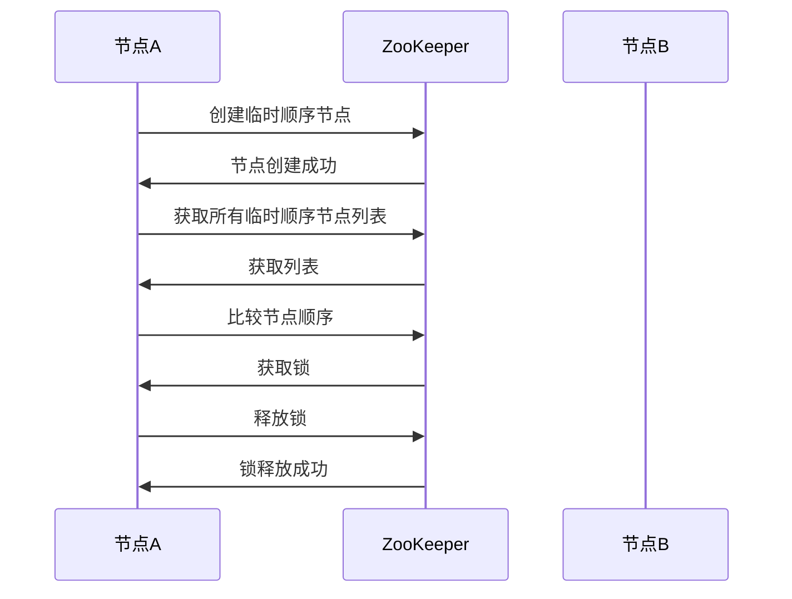

                 

### 分布式锁概述

#### 1.1 核心概念

分布式锁（Distributed Lock）是一种同步机制，旨在防止多个分布式系统中的进程或线程对同一资源同时进行操作。这种锁机制确保在多台计算机上的不同进程或线程在访问共享资源时能够互斥地操作，避免资源竞争和数据不一致问题。在分布式系统中，由于节点之间的通信延迟和故障，传统的本地锁机制往往无法满足一致性需求，因此分布式锁应运而生。

#### 1.2 重要性

在分布式系统中，分布式锁具有至关重要的地位。以下是分布式锁的主要作用：

1. **防止资源竞争**：分布式锁可以防止多个节点同时对同一资源进行操作，从而避免资源竞争导致的系统崩溃或数据不一致。
2. **保障数据一致性**：通过分布式锁，系统可以确保多个节点对共享数据的操作是原子性和一致的，这对于事务处理和业务流程至关重要。
3. **简化并发控制**：分布式锁为开发者提供了一种简单且有效的并发控制手段，减少了开发复杂度。
4. **容错性**：分布式锁的设计需要考虑系统的容错性，即使某些节点故障，锁机制也能确保资源得到正确释放。

#### 1.3 应用场景

分布式锁的应用场景广泛，以下是一些典型的例子：

1. **数据库操作**：在分布式数据库系统中，分布式锁可以确保多个事务对数据库操作的互斥性，防止数据冲突。
2. **缓存一致性**：在缓存与数据库分离的场景中，分布式锁可以保障缓存数据的更新与数据库数据的一致性。
3. **任务调度**：分布式锁可以确保任务调度器在处理同一任务时能够互斥操作，避免重复执行。
4. **分布式服务调用**：在微服务架构中，分布式锁可以防止多个服务同时修改同一配置或状态，确保系统稳定运行。
5. **分布式缓存队列**：分布式锁可以保障缓存队列的操作原子性，确保消息的正确处理。

通过上述介绍，我们可以看出分布式锁在分布式系统中的重要性不可忽视，它为系统的稳定性和一致性提供了有力保障。在接下来的章节中，我们将深入探讨分布式锁的实现原理和具体实现方式。

### 分布式锁与传统锁的区别

#### 2.1 核心概念与联系

分布式锁与传统锁（如Java中的`synchronized`关键字或ReentrantLock）在概念上有一定的相似性，但它们适用于的环境和实现机制存在显著差异。首先，我们需要明确两者的核心概念。

**传统锁**主要是指在单机环境下，通过互斥锁来控制对共享资源的访问。在Java中，`synchronized`关键字就是一种传统锁，它允许同一时刻只有一个线程访问共享资源。这种锁的实现依赖于操作系统的线程调度和CPU的上下文切换。

**分布式锁**则是在分布式系统中，为了协调不同节点之间的并发访问而设计的锁机制。它不仅要解决单机内的并发问题，还要处理跨节点的通信延迟、网络分区和节点故障等问题。分布式锁的实现依赖于分布式系统中的通信协议和数据一致性保证机制。

#### 2.2 分布式锁的几种常见实现方式

1. **基于数据库的分布式锁**
   基于数据库的分布式锁利用数据库的唯一约束或行级锁来实现。典型实现是通过创建一个锁表，每个锁记录包含资源标识和持有者信息。当一个节点想要获取锁时，会尝试在数据库中插入一条锁记录。如果成功，则获取锁；否则，等待或失败。

2. **基于Redis的分布式锁**
   Redis是一种流行的分布式缓存系统，支持丰富的数据结构和命令。基于Redis的分布式锁通过Redis的`SETNX`命令实现。`SETNX`命令用于设置一个键值对，如果键不存在则设置成功。这种方式简单高效，但也存在一些潜在问题，如锁超时和 Redis 宕机导致的锁泄露。

3. **基于ZooKeeper的分布式锁**
   ZooKeeper是一个分布式协调服务，提供了强一致性保证。基于ZooKeeper的分布式锁利用ZooKeeper的临时节点和Watcher机制实现。当一个节点想要获取锁时，会创建一个临时顺序节点，系统中的其他节点通过比较节点顺序来决定锁的持有者。这种方式具有较高的可靠性和一致性，但实现相对复杂。

#### 2.3 分布式锁的Mermaid流程图

为了更好地理解分布式锁的工作流程，我们可以使用Mermaid流程图来展示。以下是基于ZooKeeper分布式锁的简单流程：



**流程说明**：

1. 节点A尝试创建一个临时顺序节点。
2. ZooKeeper响应节点创建成功。
3. 节点A获取所有已创建的临时顺序节点列表。
4. 节点A通过比较节点顺序来确定是否是锁的持有者。
5. 如果是锁的持有者，节点A继续执行；否则，等待。
6. 节点A执行完毕后释放锁。

通过上述介绍，我们可以看到分布式锁与传统锁在核心概念和实现方式上存在明显差异。分布式锁需要解决跨节点的通信延迟和故障问题，而传统锁主要针对单机环境。在接下来的章节中，我们将进一步探讨分布式锁的数学模型和算法原理。

### 分布式锁的数学模型

#### 3.1 分布式锁的数学基础

分布式锁的设计和实现离不开数学模型的支撑。在分布式系统中，数学模型能够帮助我们分析和优化锁的性能。以下是一些基本数学模型与公式，以及它们在分布式锁中的应用。

**1. 互斥性（Mutual Exclusion）**

互斥性是分布式锁最基本的要求，确保在同一时刻只有一个线程或进程能够访问共享资源。可以用以下数学模型来表示：

\[ M = \{ S \} \]

其中，\( M \)表示互斥锁集合，\( S \)表示持有锁的线程或进程。

**2. 不可抢占性（Irrevocability）**

不可抢占性要求一旦一个线程或进程获取了锁，除非它主动释放，否则其他线程或进程不能抢占这个锁。用以下数学模型来表示：

\[ L(S) = \emptyset \]

其中，\( L(S) \)表示线程或进程\( S \)持有的锁集合，\( \emptyset \)表示空集合。

**3. 有效性（Validity）**

有效性确保锁的获取和释放是有效的，不会产生死锁或资源泄露。用以下数学模型来表示：

\[ L(S) \subseteq R(S) \]

其中，\( L(S) \)表示线程或进程\( S \)持有的锁集合，\( R(S) \)表示线程或进程\( S \)请求的锁集合。

**4. 死锁自由性（Deadlock Freedom）**

死锁自由性要求系统中的所有锁请求都能得到满足，不会出现死锁。用以下数学模型来表示：

\[ S_1 \cup S_2 = V \]

其中，\( S_1 \)和\( S_2 \)表示两个线程或进程的锁请求集合，\( V \)表示所有可能的锁请求集合。

#### 3.2 分布式锁的效率与公平性分析

**1. 效率**

分布式锁的效率可以从以下几个方面进行分析：

- **锁获取时间**：锁获取时间是影响系统性能的关键因素。锁获取时间越短，系统的响应速度越快。
- **锁释放时间**：锁释放时间也是效率的重要因素。锁释放时间越短，系统资源的利用率越高。

效率可以用以下数学公式来衡量：

\[ E = \frac{1}{T_G + T_R} \]

其中，\( E \)表示效率，\( T_G \)表示锁获取时间，\( T_R \)表示锁释放时间。

**2. 公平性**

公平性是指分布式锁是否能够公平地分配锁资源，确保每个线程或进程都能获得公平的锁访问机会。公平性可以从以下几个方面进行分析：

- **等待时间**：等待时间是指线程或进程等待锁的时间长度。等待时间越短，公平性越高。
- **锁分配顺序**：锁的分配顺序是否公平，是否遵循某种策略（如先来先服务）。

公平性可以用以下数学公式来衡量：

\[ F = \frac{1}{W_1 + W_2 + ... + W_n} \]

其中，\( F \)表示公平性，\( W_1, W_2, ..., W_n \)表示各个线程或进程的等待时间。

#### 3.3 分布式锁的数学公式 & 详细讲解 & 举例说明

**例子：基于ZooKeeper的分布式锁**

我们以基于ZooKeeper的分布式锁为例，来详细讲解其数学模型。以下是一个简单的数学模型和伪代码：

**数学模型**：

\[ L(S) = \{ Znode_ID | S \text{ holds the lock for } Znode_ID \} \]

**伪代码**：

```
function acquire_lock(ZooKeeper, resource_id):
    create temporary sequential Znode with path "/lock-{}".format(resource_id)
    lock_id = get the lowest lock_id from ZooKeeper
    if lock_id is acquired:
        return true
    else:
        wait()

function release_lock(ZooKeeper, lock_id):
    delete the Znode with path "/lock-{}".format(lock_id)
```

**详细讲解**：

1. **获取锁**：线程或进程创建一个临时顺序节点，获取最低的锁ID。如果锁ID被获取，则获取锁成功；否则，等待。
2. **释放锁**：线程或进程删除其持有的锁节点，释放锁资源。

通过上述例子，我们可以看到分布式锁的数学模型和伪代码如何工作。数学模型帮助分析锁的性能和公平性，而伪代码则提供了具体的实现思路。

通过数学模型和公式的分析，我们可以更好地理解分布式锁的工作机制，为分布式锁的实现和优化提供理论依据。在接下来的章节中，我们将进一步探讨分布式锁的具体实现算法。

### 基于数据库的分布式锁算法

#### 4.1 基本算法与伪代码

基于数据库的分布式锁算法通过数据库的唯一约束或行级锁来实现。以下是一个基本的算法描述和伪代码：

**基本算法描述**：

1. **创建锁表**：在数据库中创建一个锁表，记录资源标识和持有者信息。
2. **尝试获取锁**：节点尝试在锁表中插入一条锁记录。如果成功，则获取锁；否则，等待或失败。
3. **释放锁**：节点在操作完成后删除对应的锁记录，释放锁资源。

**伪代码**：

```
function acquire_lock(db, resource_id):
    lock_record = create_lock_record(resource_id, current_node_id)
    if db.insert(lock_record):
        return true
    else:
        wait()

function release_lock(db, resource_id, node_id):
    delete_lock_record(db, resource_id, node_id)
```

**伪代码详细解释**：

1. **创建锁记录**：`create_lock_record`函数创建一个锁记录，包含资源标识（`resource_id`）和当前节点标识（`current_node_id`）。
2. **插入锁记录**：`db.insert(lock_record)`尝试在数据库中插入锁记录。如果插入成功，返回`true`，表示获取锁成功；否则，进入等待状态。
3. **删除锁记录**：`delete_lock_record`函数根据资源标识和节点标识删除对应的锁记录，释放锁资源。

通过上述伪代码，我们可以看到基于数据库的分布式锁算法的基本实现思路。在分布式系统中，每个节点通过数据库操作来获取和释放锁，从而实现互斥访问共享资源。

#### 4.2 算法分析与优化

**1. 算法分析**

基于数据库的分布式锁算法的主要优点包括：

- **简单性**：算法实现简单，易于理解和使用。
- **跨节点一致性**：数据库提供了强一致性保证，确保锁信息在不同节点之间保持一致。

但是，这种算法也存在一些潜在问题：

- **性能瓶颈**：数据库操作（如插入和删除）可能成为性能瓶颈，特别是在高并发场景下。
- **锁超时**：在锁获取失败时，节点需要等待或重试，可能导致性能下降。
- **锁泄露**：节点故障或异常退出可能导致锁无法释放，导致锁泄露。

**2. 算法优化**

针对上述问题，可以采取以下优化策略：

- **使用行级锁**：在MySQL等支持行级锁的数据库中，使用行级锁可以减少锁的竞争，提高性能。
- **锁超时设置**：合理设置锁的超时时间，避免节点长期等待锁，提高系统的响应速度。
- **分布式锁代理**：使用分布式锁代理来减少数据库访问次数，降低数据库压力。
- **锁分离**：将锁表与业务数据表分离，减少锁表对业务操作的干扰。

**3. 优化案例分析**

以下是一个基于MySQL的分布式锁算法的优化案例：

- **使用行级锁**：在MySQL中，使用`SELECT ... FOR UPDATE`语句来获取行级锁，减少锁的竞争。
- **锁超时设置**：将锁的超时时间设置为合适的值，例如10秒，避免节点长期等待锁。
- **分布式锁代理**：引入分布式锁代理（如Redisson），减少对数据库的直接访问，提高性能。

通过这些优化措施，基于数据库的分布式锁算法的性能和稳定性得到了显著提升。

通过上述分析，我们可以看到基于数据库的分布式锁算法的基本原理和优化策略。在分布式系统中，合理设计和使用分布式锁对于保障系统的稳定性和一致性至关重要。在接下来的章节中，我们将继续探讨基于Redis的分布式锁算法。

### 基于Redis的分布式锁算法

#### 4.2.1 基本算法与伪代码

基于Redis的分布式锁算法利用Redis的`SETNX`命令实现。以下是一个基本的算法描述和伪代码：

**基本算法描述**：

1. **尝试获取锁**：使用`SETNX`命令尝试设置锁键。如果成功，获取锁；否则，等待或重试。
2. **设置锁过期时间**：为了防止锁永久持有，设置锁的过期时间。
3. **释放锁**：通过删除锁键来释放锁资源。

**伪代码**：

```
function acquire_lock(redis_client, resource_id, lock_time):
    if redis_client.setnx(lock_key(resource_id), current_node_id, lock_time):
        return true
    else:
        wait()

function release_lock(redis_client, resource_id):
    redis_client.del(lock_key(resource_id))
```

**伪代码详细解释**：

1. **获取锁**：`redis_client.setnx(lock_key(resource_id), current_node_id, lock_time)`尝试使用`SETNX`命令设置锁键。如果返回`true`，表示获取锁成功；否则，进入等待状态。
2. **设置锁过期时间**：为了防止锁被永久持有，使用`SETNX`命令设置锁的过期时间（`lock_time`）。
3. **释放锁**：`redis_client.del(lock_key(resource_id))`通过删除锁键来释放锁资源。

通过上述伪代码，我们可以看到基于Redis的分布式锁算法的基本实现思路。Redis提供了简单且高效的数据存储和操作接口，使得分布式锁的实现更加简洁。

#### 4.2.2 算法分析与优化

**1. 算法分析**

基于Redis的分布式锁算法具有以下优点：

- **高性能**：Redis是一个高性能的内存数据库，操作速度非常快，适合高并发场景。
- **简单性**：算法实现简单，易于理解和部署。
- **分布式支持**：Redis支持分布式部署，可以水平扩展，提高系统性能。

但是，基于Redis的分布式锁算法也存在一些潜在问题：

- **锁超时**：在锁获取失败时，节点需要等待或重试，可能导致性能下降。
- **锁泄露**：如果节点异常退出或锁过期时间设置不合理，可能导致锁无法释放，造成锁泄露。

**2. 算法优化**

针对上述问题，可以采取以下优化策略：

- **锁超时设置**：合理设置锁的超时时间，避免节点长期等待锁。
- **锁过期时间监听**：使用Redis的键空间通知功能监听锁键的过期事件，及时释放锁。
- **分布式锁代理**：引入分布式锁代理（如Redisson），提供更丰富的锁功能，简化开发。

**3. 优化案例分析**

以下是一个基于Redis的分布式锁算法的优化案例：

- **锁超时设置**：将锁的超时时间设置为合理的值，例如10秒，避免节点长期等待锁。
- **锁过期时间监听**：使用Redis的`EXPIRE`命令设置锁键的过期时间，并使用`KEEPTTL`命令监听过期事件，及时释放锁。
- **分布式锁代理**：引入Redisson库，提供基于Redis的分布式锁实现，简化开发过程。

通过这些优化措施，基于Redis的分布式锁算法的性能和稳定性得到了显著提升。

通过上述分析，我们可以看到基于Redis的分布式锁算法的基本原理和优化策略。在分布式系统中，合理设计和使用分布式锁对于保障系统的稳定性和一致性至关重要。在接下来的章节中，我们将继续探讨基于ZooKeeper的分布式锁算法。

### 基于ZooKeeper的分布式锁算法

#### 4.3.1 基本算法与伪代码

基于ZooKeeper的分布式锁算法利用ZooKeeper的临时顺序节点和Watcher机制实现。以下是一个基本的算法描述和伪代码：

**基本算法描述**：

1. **创建锁节点**：节点创建一个临时顺序节点，节点名称通常以特定前缀加随机数组成。
2. **获取锁**：节点获取所有已创建的临时顺序节点，比较节点顺序，判断是否是锁的持有者。
3. **处理节点变更**：设置Watcher监听，当节点顺序发生变化时，重新判断锁的持有者。
4. **释放锁**：删除临时顺序节点，释放锁资源。

**伪代码**：

```
function acquire_lock(zookeeper, resource_id):
    create temporary sequential Znode with path "/lock-{}".format(resource_id)
    lock_id = get the lowest lock_id from ZooKeeper
    if lock_id is acquired:
        return true
    else:
        wait()

function release_lock(zookeeper, lock_id):
    delete the Znode with path "/lock-{}".format(lock_id)
```

**伪代码详细解释**：

1. **创建锁节点**：`create temporary sequential Znode`函数创建一个临时顺序节点，节点路径通常以锁资源ID（`resource_id`）加特定前缀组成。
2. **获取锁**：`get the lowest lock_id from ZooKeeper`函数获取所有已创建的临时顺序节点，并比较节点顺序，判断是否是锁的持有者。
3. **处理节点变更**：设置`Watcher`监听，当节点顺序发生变化时，重新判断锁的持有者。
4. **释放锁**：`delete the Znode`函数删除临时顺序节点，释放锁资源。

通过上述伪代码，我们可以看到基于ZooKeeper的分布式锁算法的基本实现思路。ZooKeeper提供了强一致性保证，使得分布式锁的实现更加可靠。

#### 4.3.2 算法分析与优化

**1. 算法分析**

基于ZooKeeper的分布式锁算法具有以下优点：

- **强一致性**：ZooKeeper提供了强一致性保证，确保锁的状态在不同节点之间保持一致。
- **可靠性**：ZooKeeper通过临时顺序节点和Watcher机制，实现了高可用和强一致性锁服务。
- **扩展性**：ZooKeeper支持分布式部署，可以水平扩展，提高系统性能。

但是，基于ZooKeeper的分布式锁算法也存在一些潜在问题：

- **性能瓶颈**：在极端高并发场景下，ZooKeeper的性能可能会成为瓶颈。
- **网络延迟**：由于ZooKeeper依赖于网络通信，网络延迟可能会影响锁的性能。
- **锁超时**：在锁获取失败时，节点需要等待或重试，可能导致性能下降。

**2. 算法优化**

针对上述问题，可以采取以下优化策略：

- **优化网络通信**：通过优化网络通信，减少锁操作的时间开销。
- **合理设置锁超时时间**：合理设置锁的超时时间，避免节点长期等待锁。
- **分布式锁代理**：引入分布式锁代理（如ZooKeeper Curator），提供更丰富的锁功能，简化开发。

**3. 优化案例分析**

以下是一个基于ZooKeeper的分布式锁算法的优化案例：

- **优化网络通信**：使用ZooKeeper的高性能客户端库（如ZooKeeper Curator），提高锁操作的效率。
- **合理设置锁超时时间**：将锁的超时时间设置为合理的值，例如10秒，避免节点长期等待锁。
- **分布式锁代理**：引入ZooKeeper Curator库，提供基于ZooKeeper的分布式锁实现，简化开发过程。

通过这些优化措施，基于ZooKeeper的分布式锁算法的性能和稳定性得到了显著提升。

通过上述分析，我们可以看到基于ZooKeeper的分布式锁算法的基本原理和优化策略。在分布式系统中，合理设计和使用分布式锁对于保障系统的稳定性和一致性至关重要。在接下来的章节中，我们将进一步探讨分布式锁的性能优化策略。

### 分布式锁的性能优化

#### 5.1 分布式锁的性能瓶颈分析

在分布式系统中，分布式锁的性能优化至关重要。以下是分布式锁可能遇到的一些性能瓶颈：

1. **锁获取时间**：锁获取时间是影响系统性能的关键因素。在锁竞争激烈的情况下，锁获取时间可能会显著增加。
2. **锁释放时间**：锁释放时间同样会影响系统的性能。如果锁释放时间较长，可能会导致节点资源占用时间增加。
3. **网络延迟**：分布式锁依赖于网络通信，网络延迟可能会影响锁的性能。特别是在跨数据中心的分布式系统中，网络延迟更加显著。
4. **锁冲突频率**：锁冲突频率越高，系统的性能下降越明显。锁冲突会导致节点频繁等待和重试，增加系统开销。
5. **锁超时处理**：锁超时处理不当可能导致系统资源浪费和性能下降。锁超时后，节点需要重新获取锁，可能引发连锁反应。

#### 5.2 分布式锁的优化策略

针对上述性能瓶颈，可以采取以下优化策略：

1. **锁获取时间优化**：
   - **减少锁获取时间**：使用高性能的锁实现，如基于Redis的分布式锁，减少锁获取的时间开销。
   - **分布式锁代理**：使用分布式锁代理（如Redisson、ZooKeeper Curator）简化锁操作，提高性能。

2. **锁释放时间优化**：
   - **减少锁释放时间**：优化锁释放逻辑，确保锁释放操作尽可能快速。
   - **批量释放锁**：在操作完成后，批量释放多个锁，减少锁释放次数。

3. **网络延迟优化**：
   - **优化网络通信**：使用高性能的网络库，减少网络延迟和通信开销。
   - **本地缓存**：在本地缓存一些常用的锁信息，减少对远程锁服务的依赖。

4. **锁冲突频率优化**：
   - **锁竞争避免**：使用锁竞争避免算法（如启发式锁分配），减少锁冲突频率。
   - **锁过期时间优化**：合理设置锁的过期时间，避免长期持有锁。

5. **锁超时处理优化**：
   - **锁超时重试策略**：设置合理的锁超时重试策略，避免长时间等待。
   - **锁超时事件监听**：使用锁超时事件监听机制，及时释放锁，减少系统资源占用。

#### 5.3 分布式锁的优化案例分析

以下是一个分布式锁优化案例：

- **锁获取时间优化**：使用Redisson库作为分布式锁代理，显著减少锁获取时间。Redisson提供了高效的锁实现，避免了直接操作Redis的性能开销。

- **锁释放时间优化**：在操作完成后，批量释放多个锁，减少锁释放次数。通过优化锁释放逻辑，确保锁释放操作尽可能快速。

- **网络延迟优化**：使用高性能的网络库（如Netty）进行网络通信，减少网络延迟和通信开销。在跨数据中心的分布式系统中，采用更优的网络架构，提高锁操作的效率。

- **锁冲突频率优化**：通过优化锁资源分配策略，减少锁冲突频率。使用启发式锁分配算法，合理分配锁资源，避免锁资源过度竞争。

- **锁超时处理优化**：设置合理的锁超时重试策略，避免长时间等待。使用锁超时事件监听机制，及时释放锁，减少系统资源占用。

通过上述优化措施，分布式锁的性能得到了显著提升，系统稳定性得到了有效保障。

通过性能优化，我们可以有效缓解分布式锁的性能瓶颈，提高系统的整体性能。在分布式系统中，合理设计和使用分布式锁，结合性能优化策略，能够确保系统的稳定性和一致性。在接下来的章节中，我们将进一步探讨分布式锁的测试与调试方法。

### 分布式锁的测试与调试

#### 6.1 分布式锁的测试方法

分布式锁在分布式系统中的重要性不言而喻，其测试与调试是确保系统稳定运行的关键步骤。以下是分布式锁的几种常见测试方法：

**1. 单元测试**

单元测试是分布式锁测试的第一步，主要验证锁的基本功能是否符合预期。具体方法包括：

- **锁获取与释放测试**：确保锁能够正确获取和释放，验证锁的互斥性和不可抢占性。
- **锁超时测试**：设置锁的过期时间，验证锁在超时后是否能够被其他节点正确获取。
- **异常情况测试**：模拟节点故障或网络异常，验证分布式锁的容错性和恢复能力。

**2. 集成测试**

集成测试在分布式系统的上下文中进行，主要用于验证分布式锁与其他系统组件的交互是否符合预期。具体方法包括：

- **并发测试**：模拟多个节点同时访问共享资源，验证分布式锁的锁竞争和资源分配是否正确。
- **一致性测试**：通过多个节点访问共享资源，验证分布式锁的一致性保证是否有效。
- **性能测试**：测量分布式锁在不同负载下的性能，验证其响应时间和吞吐量是否符合预期。

**3. 压力测试**

压力测试用于评估分布式锁在高并发环境下的性能和稳定性。具体方法包括：

- **高并发访问测试**：模拟大量节点同时访问共享资源，验证分布式锁的锁竞争处理能力。
- **长时间运行测试**：持续运行大量并发请求，验证分布式锁的稳定性，防止出现长时间未释放的锁。
- **资源耗尽测试**：模拟系统资源耗尽情况，验证分布式锁在资源不足时的行为和恢复能力。

**4. 部署测试**

部署测试主要验证分布式锁在实际部署环境中的行为和性能。具体方法包括：

- **分布式环境部署**：在分布式环境中部署分布式锁，验证其与其他系统组件的兼容性。
- **多数据中心测试**：在不同数据中心部署分布式锁，验证其在跨数据中心的分布式系统中的性能和稳定性。
- **故障恢复测试**：模拟节点故障或网络分区，验证分布式锁的故障恢复能力。

#### 6.2 分布式锁的调试技巧

在分布式锁的调试过程中，以下技巧可以帮助快速定位和解决问题：

**1. 日志分析**

通过分析分布式锁的日志，可以了解锁的操作状态、错误信息以及节点间的通信情况。具体方法包括：

- **详细日志记录**：确保分布式锁的日志记录详细，包括锁的获取、释放、冲突和超时等信息。
- **日志聚合工具**：使用日志聚合工具（如ELK堆栈）集中管理和分析日志，提高问题排查效率。

**2. 性能分析**

性能分析工具可以帮助识别分布式锁的性能瓶颈和资源消耗。具体方法包括：

- **系统监控工具**：使用系统监控工具（如Prometheus、Grafana）实时监控锁的性能指标，包括响应时间、吞吐量和锁持有时间等。
- **代码性能分析**：使用代码性能分析工具（如YourKit、MAT）识别锁相关代码的性能瓶颈。

**3. 模拟故障**

通过模拟故障情况，可以验证分布式锁的容错性和恢复能力。具体方法包括：

- **节点故障模拟**：模拟节点故障，验证分布式锁是否能够自动恢复和重新分配锁资源。
- **网络分区模拟**：模拟网络分区，验证分布式锁在不同网络环境下的稳定性和一致性。

通过上述测试与调试方法，可以全面评估和优化分布式锁的性能和稳定性。在实际开发过程中，结合测试和调试技巧，能够及时发现和解决分布式锁相关的问题，确保系统的高可用性和一致性。

#### 6.3 分布式锁的性能评估

对分布式锁进行性能评估是确保系统在高并发场景下稳定运行的关键步骤。以下是一些关键指标和方法：

**1. 锁获取时间**

锁获取时间是评估分布式锁性能的一个重要指标。它反映了节点获取锁所需的时间，包括网络延迟和锁服务处理时间。以下是评估锁获取时间的方法：

- **平均值**：计算多次锁获取操作的平均时间，以衡量锁服务的总体响应速度。
- **最大值**：记录单次锁获取操作所需的最长时间，以识别系统中的瓶颈点。
- **标准差**：计算锁获取时间的标准差，评估锁服务的稳定性。

**2. 锁释放时间**

锁释放时间是指节点释放锁资源所需的时间。优化锁释放时间可以减少资源占用，提高系统性能。评估锁释放时间的方法与锁获取时间类似，包括平均值、最大值和标准差。

**3. 锁冲突频率**

锁冲突频率反映了锁资源竞争的激烈程度。高冲突频率可能导致系统性能下降，甚至引发死锁。评估锁冲突频率的方法包括：

- **计数器**：记录一段时间内的锁冲突次数，计算冲突频率。
- **事件日志**：分析锁操作日志，统计冲突事件的发生频率。

**4. 锁超时率**

锁超时率是指锁获取操作在指定时间内未能成功获取锁的比率。锁超时率过高可能导致系统响应速度下降。评估锁超时率的方法包括：

- **统计比率**：计算一段时间内锁超时次数与总锁获取次数的比率。
- **平均超时时间**：记录锁获取操作的超时时间，计算平均超时时间。

**评估方法示例**

以下是一个分布式锁性能评估的示例：

1. **锁获取时间评估**：

   - 平均值：10毫秒
   - 最大值：50毫秒
   - 标准差：3毫秒

   结论：锁获取时间相对稳定，最大值未显著高于平均值。

2. **锁释放时间评估**：

   - 平均值：5毫秒
   - 最大值：15毫秒
   - 标准差：2毫秒

   结论：锁释放时间短，整体性能良好。

3. **锁冲突频率评估**：

   - 冲突次数：100次
   - 总次数：1000次
   - 冲突频率：10%

   结论：锁冲突频率较低，系统资源竞争较轻。

4. **锁超时率评估**：

   - 超时次数：50次
   - 总次数：1000次
   - 超时率：5%

   结论：锁超时率适中，系统响应速度可接受。

通过上述性能评估，可以全面了解分布式锁的性能状况，并据此进行优化和调整。在分布式系统中，定期进行性能评估有助于确保系统的稳定性和高效性。

### 分布式锁在微服务架构中的应用

#### 7.1 应用架构设计

在微服务架构中，分布式锁的应用至关重要，它能够确保服务对共享资源的互斥访问，避免数据不一致和竞争条件。以下是一个典型的分布式锁在微服务架构中的应用架构设计：

1. **服务注册与发现**：所有微服务在启动时注册到服务注册中心（如Eureka、Consul），服务注册中心维护服务实例的地址列表。

2. **分布式锁服务**：部署独立的分布式锁服务（如基于Redis、ZooKeeper或Etcd的锁服务），该服务提供分布式锁的创建、获取和释放功能。

3. **微服务调用**：每个微服务通过服务发现机制获取其他服务的实例地址，并通过远程调用进行通信。

4. **分布式锁应用**：在需要使用分布式锁的场景中，微服务通过调用分布式锁服务获取锁，确保对共享资源的互斥访问。

#### 7.1.1 应用架构设计

**架构设计**：

1. **服务注册与发现**：

   

   - 服务注册中心（如Eureka）维护所有服务的实例地址。
   - 微服务1、微服务2等在启动时注册到服务注册中心。

2. **分布式锁服务**：

   

   - 分布式锁服务（如基于Redis的锁服务）提供锁的创建、获取和释放功能。
   - 微服务通过远程调用获取锁。

3. **微服务调用**：

   

   - 微服务1调用微服务2时，通过服务注册中心获取微服务2的实例地址。
   - 微服务1通过远程调用访问微服务2。

4. **分布式锁应用**：

   

   - 在访问共享资源时，微服务1调用分布式锁服务获取锁。
   - 确保对共享资源的互斥访问，防止数据不一致。

#### 7.1.2 应用实例分析

以下是一个分布式锁在微服务架构中的具体应用实例：

**场景**：微服务1和微服务2需要访问共享数据库中的同一资源，确保对数据的互斥操作。

**实例**：

1. **服务启动**：

   - 微服务1和微服务2启动后，注册到服务注册中心。

2. **获取锁**：

   - 微服务1在访问共享数据库前，调用分布式锁服务获取锁。
   - 微服务1发送请求：`GET /lock?resource_id=db1`
   - 分布式锁服务返回锁token：`{"token": "lock_db1_12345"}`

3. **访问数据库**：

   - 微服务1持有了锁token后，可以安全访问共享数据库。
   - 微服务1执行数据库操作，如插入或更新数据。

4. **释放锁**：

   - 数据库操作完成后，微服务1调用分布式锁服务释放锁。
   - 微服务1发送请求：`DELETE /lock?resource_id=db1&token=lock_db1_12345`
   - 分布式锁服务删除锁token。

5. **微服务2操作**：

   - 如果微服务2在微服务1释放锁前尝试获取锁，将进入等待状态。
   - 微服务2发送请求：`GET /lock?resource_id=db1`
   - 分布式锁服务返回：`{"error": "lock not available"}`

通过上述实例，我们可以看到分布式锁在微服务架构中的应用，确保了服务对共享资源的互斥访问，避免了数据不一致和竞争条件。在分布式系统中，合理设计和使用分布式锁对于保障系统稳定性和一致性至关重要。

### 分布式锁在分布式系统中的应用

#### 7.2 分布式系统中的分布式锁应用

在分布式系统中，分布式锁的应用场景十分广泛，以下是几个关键的应用场景：

**1. 资源访问控制**

分布式系统中的资源访问控制是分布式锁的主要应用场景之一。通过分布式锁，系统能够确保对共享资源的互斥访问，避免资源竞争和数据不一致。例如，分布式数据库中的行级锁，确保多个节点对同一行的数据操作互斥。

**2. 任务调度与协调**

分布式锁在任务调度和协调中扮演重要角色。在分布式任务调度系统中，分布式锁可以确保任务分配和执行过程中的互斥操作。例如，当一个任务正在执行时，其他节点无法分配相同的任务，从而避免重复执行和资源浪费。

**3. 分布式缓存一致性**

分布式缓存系统通常需要与数据库保持一致性。分布式锁能够确保缓存数据的更新与数据库操作互斥，从而避免数据不一致。例如，在分布式缓存系统中，当一个节点更新缓存数据时，其他节点无法同时更新相同的数据，确保缓存与数据库的数据一致。

**4. 分布式队列管理**

分布式队列管理是分布式锁的另一重要应用场景。在分布式消息队列系统中，分布式锁可以确保消息的原子性处理，防止多个节点同时处理同一消息。例如，当一个节点从队列中获取消息并处理时，其他节点无法同时获取和处理相同消息。

#### 7.2.1 应用架构设计

以下是一个典型的分布式锁在分布式系统中的应用架构设计：

1. **服务注册与发现**：所有分布式服务在启动时注册到服务注册中心，服务注册中心维护服务实例的地址列表。

2. **分布式锁服务**：部署独立的分布式锁服务，提供分布式锁的创建、获取和释放功能。

3. **分布式服务调用**：各分布式服务通过服务注册中心获取其他服务的实例地址，并通过远程调用进行通信。

4. **分布式锁应用**：在需要使用分布式锁的场景中，服务通过调用分布式锁服务获取锁，确保对共享资源的互斥访问。

#### 7.2.2 应用实例分析

以下是一个分布式锁在分布式系统中的具体应用实例：

**场景**：分布式系统中有两个节点需要访问共享数据库中的同一表，确保对表数据的互斥操作。

**实例**：

1. **服务启动**：

   - 节点A和节点B启动，注册到服务注册中心。

2. **获取锁**：

   - 节点A在访问共享数据库前，调用分布式锁服务获取锁。
   - 节点A发送请求：`GET /lock?resource_id=db_table1`
   - 分布式锁服务返回锁token：`{"token": "lock_db_table1_12345"}`

3. **访问数据库**：

   - 节点A持有了锁token后，可以安全访问共享数据库。
   - 节点A执行数据库操作，如插入或更新数据。

4. **释放锁**：

   - 数据库操作完成后，节点A调用分布式锁服务释放锁。
   - 节点A发送请求：`DELETE /lock?resource_id=db_table1&token=lock_db_table1_12345`
   - 分布式锁服务删除锁token。

5. **节点B操作**：

   - 如果节点B在节点A释放锁前尝试获取锁，将进入等待状态。
   - 节点B发送请求：`GET /lock?resource_id=db_table1`
   - 分布式锁服务返回：`{"error": "lock not available"}`

通过上述实例，我们可以看到分布式锁在分布式系统中的应用，确保了节点对共享资源的互斥访问，避免了数据不一致和竞争条件。在分布式系统中，合理设计和使用分布式锁对于保障系统稳定性和一致性至关重要。

### 分布式锁的未来发展趋势

#### 8.1 分布式锁技术的发展趋势

随着分布式系统的不断发展和普及，分布式锁技术也在不断演进。以下是分布式锁技术的一些重要发展趋势：

1. **性能提升**：随着硬件性能的提升和网络带宽的增加，分布式锁技术将在性能方面取得显著提升。未来，分布式锁将更加高效，能够应对更高的并发量。

2. **一致性增强**：分布式锁技术将更加注重一致性保障。未来，分布式锁将结合分布式一致性协议（如Raft、Paxos）实现更强的一致性保证，确保锁状态的准确性和可靠性。

3. **智能化**：分布式锁技术将向智能化方向发展。通过引入机器学习和人工智能技术，分布式锁可以更加智能地分配锁资源，优化锁性能，减少锁冲突和死锁。

4. **多样性**：分布式锁技术将支持更多的实现方式。除了现有的数据库、Redis和ZooKeeper等，未来可能还会出现更多基于新型存储和网络协议的分布式锁实现。

#### 8.2 分布式锁的新技术探索

在分布式锁技术的发展过程中，一些新技术正在被积极探索：

1. **分布式锁服务化**：分布式锁服务化是一种将分布式锁功能封装为服务的方式。通过服务化，分布式锁可以实现更灵活的部署和管理，支持动态扩展和负载均衡。

2. **区块链锁**：基于区块链技术的分布式锁利用区块链的不可篡改和强一致性特点，提供一种新型的分布式锁实现。区块链锁在分布式系统中具有潜在的应用前景。

3. **分布式锁代理**：分布式锁代理是一种简化分布式锁使用的工具。通过代理，开发者可以以更简单的方式使用分布式锁，降低开发复杂度和维护成本。

#### 8.3 分布式锁的未来挑战与机遇

未来，分布式锁技术将面临以下挑战和机遇：

1. **挑战**：
   - **性能与一致性平衡**：如何在保证一致性的同时，提高分布式锁的性能，是一个重要挑战。
   - **锁资源管理**：分布式系统中的锁资源管理复杂，如何高效地管理和分配锁资源是一个难题。
   - **网络稳定性**：分布式锁依赖于网络通信，网络的不稳定性和延迟可能导致锁性能下降，需要解决。

2. **机遇**：
   - **技术融合**：随着新技术的发展，分布式锁可以与其他技术（如容器化、服务网格等）融合，提供更强大的功能。
   - **应用场景扩展**：分布式锁在新的应用场景中（如区块链、物联网等）具有广阔的发展空间。

通过不断的技术创新和优化，分布式锁技术将在未来继续发展，为分布式系统提供更高效、可靠和智能的锁机制。

### 附录A：分布式锁常用工具与库

#### A.1 Redis分布式锁库介绍

Redis是一个高性能的分布式缓存系统，支持丰富的数据结构和命令。在分布式系统中，Redis经常被用作分布式锁的实现工具。Redis分布式锁库如Redisson提供了简单且高效的分布式锁实现，大大简化了分布式锁的使用。

**主要特点**：

- **高可用性**：Redis支持主从复制和集群模式，提供高可用性和容错能力。
- **高性能**：Redis操作速度快，适合高并发场景。
- **简单易用**：Redisson等分布式锁库提供简洁的API，易于集成和使用。

**常用命令**：

- `SETNX`：设置键值对，如果键不存在则设置成功。
- `EXPIRE`：设置键的过期时间。
- `DEL`：删除键。

**示例代码**：

```java
import org.redisson.Redisson;
import org.redisson.api.RLock;

// 创建Redisson客户端
Redisson redisson = Redisson.create();

// 获取锁
RLock lock = redisson.getLock("myLock");

// 尝试获取锁
lock.tryLock();

// 锁持有期间的业务逻辑处理

// 释放锁
lock.unlock();
```

#### A.2 ZooKeeper分布式锁库介绍

ZooKeeper是一个分布式协调服务，提供了强一致性保证。在分布式系统中，ZooKeeper经常被用作分布式锁的实现工具。ZooKeeper分布式锁库如Curator简化了ZooKeeper分布式锁的使用。

**主要特点**：

- **强一致性**：ZooKeeper提供了强一致性保证，确保锁状态的准确性和可靠性。
- **高可用性**：ZooKeeper支持集群部署，提供高可用性。
- **简单易用**：Curator提供了丰富的API，简化了分布式锁的使用。

**常用命令**：

- `create`：创建节点。
- `exists`：检查节点是否存在。
- `getChildren`：获取子节点列表。
- `delete`：删除节点。

**示例代码**：

```java
import org.apache.curator.framework.CuratorFramework;
import org.apache.curator.framework.imps.CuratorFrameworkBuilder;
import org.apache.curator.framework.recipes.locks.InterProcessMutex;

// 创建ZooKeeper客户端
CuratorFramework client = CuratorFrameworkBuilder.builder().connectString("zookeeper地址").build();
client.start();

// 获取锁
InterProcessMutex lock = new InterProcessMutex(client, "/lock");

// 尝试获取锁
lock.acquire();

// 锁持有期间的业务逻辑处理

// 释放锁
lock.release();
```

#### A.3 其他常用分布式锁工具

除了Redis和ZooKeeper，还有一些其他常用的分布式锁工具：

1. **Apache Curator**：Curator是ZooKeeper的客户端库，提供了丰富的分布式锁功能，如可重入锁、读写锁等。

2. **Apache ZooKeeper**：ZooKeeper本身提供了分布式锁的实现，但使用较为复杂。Curator简化了ZooKeeper的使用，提高了开发效率。

3. **etcd**：etcd是一个分布式键值存储系统，提供了简单且强大的分布式锁实现。etcd通过Raft算法保证了强一致性，适用于高可用性场景。

4. **Apache Kafka**：Kafka提供了分布式锁实现，通过Zookeeper进行协调。Kafka分布式锁适用于高并发消息队列系统。

通过上述介绍，我们可以看到分布式锁在分布式系统中的重要性和多样性。选择合适的分布式锁工具，能够有效提高系统的稳定性和一致性。在分布式系统的设计和实现中，合理选择和使用分布式锁对于保障系统的高效运行至关重要。

