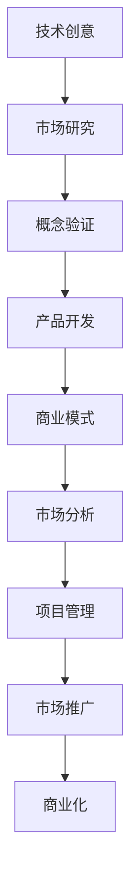

                 

### 文章标题: <创新项目孵化：从技术创意到商业化的全过程>

### 关键词: 创新项目孵化、技术创意、商业模式、项目管理和商业化

### 摘要:
本文旨在全面探讨创新项目的孵化过程，从技术创意的产生、验证和开发，到商业模式的构建、市场分析和战略制定，再到项目管理和市场推广，最终实现商业化的全过程。文章通过详细的步骤和案例分析，为读者提供了一个系统的创新项目孵化指南。

---

## 1. 引言

在当今快速变化的技术时代，创新已经成为推动企业发展和经济增长的关键驱动力。然而，从技术创意到商业化，这一过程并非易事。本文将引导读者了解这一全过程，从背景介绍到具体实施步骤，旨在为创业者、项目经理和技术人员提供宝贵的指导。

### 背景介绍

创新项目的孵化是一个复杂且多变的过程，涉及到多个关键环节。首先，技术创意的产生需要源自对市场和用户需求的深刻理解。其次，通过市场研究和概念验证，确认创意的可行性和潜在商业价值。接着，开发原型并进行迭代优化，逐步完善产品功能。同时，构建合适的商业模式，进行市场分析和战略制定，以确保项目能够在市场中获得成功。最后，通过有效的项目管理和市场推广，将产品推向市场，实现商业化。

### 核心概念与联系

为了更好地理解创新项目的孵化过程，我们可以用Mermaid流程图来展示各个关键环节及其之间的联系：

### 目标读者

本文的目标读者包括但不限于以下群体：

1. 创业者：寻求理解和掌握创新项目孵化全过程的实践者。
2. 项目经理：负责创新项目管理的专业人士，希望提高项目成功的可能性。
3. 技术人员：对技术创新感兴趣，希望将技术创意转化为实际产品的开发者。
4. 学者和研究者：对创新理论和实践有兴趣，希望深入了解相关领域的专业人士。

---

在接下来的章节中，我们将逐步深入探讨每个关键环节，通过详细的步骤和分析，为读者提供实用的指导和建议。无论是初出茅庐的创业者，还是经验丰富的项目经理，本文都希望成为你们在创新道路上的一份可靠指南。现在，让我们正式开始这段旅程，共同探索创新项目的孵化之路。

