                 

### 第1章 引言

#### 1.1 长期技术战略的重要性

在当今快速发展的科技时代，技术作为推动企业创新和业务增长的核心动力，其战略规划的重要性不言而喻。长期技术战略是指企业在未来一段时间内，通过对技术趋势、市场需求、企业现状等进行分析和预测，制定出具有前瞻性的技术发展路线和目标，以确保企业在竞争激烈的市场中保持领先地位。制定长期技术战略不仅有助于企业更好地把握技术发展的方向，还能够提升企业的创新能力，促进业务的可持续发展。

首先，长期技术战略能够为企业提供明确的发展方向。在科技日新月异的今天，技术更新换代速度加快，企业如果不能紧跟技术趋势，就可能被市场淘汰。通过制定长期技术战略，企业能够明确自己在技术领域的发展方向，从而有针对性地进行技术储备和研发投入，避免盲目跟风和资源浪费。

其次，长期技术战略有助于提升企业的创新能力。创新是企业发展的重要驱动力，而技术战略的制定可以为创新提供良好的环境和资源保障。通过明确技术发展方向和目标，企业可以更有针对性地进行技术创新，加速新产品的开发进程，提高市场竞争力。

再者，长期技术战略能够增强企业的风险抵御能力。在技术快速变革的背景下，企业面临的技术风险和不确定性增加。通过制定长期技术战略，企业可以提前识别和评估潜在的技术风险，制定相应的应对策略，降低风险对企业发展的影响。

总之，长期技术战略在企业发展中扮演着至关重要的角色。它不仅能够为企业提供明确的发展方向和创新能力，还能够提高企业的风险抵御能力，确保企业在竞争激烈的市场中立于不败之地。

#### 1.2 长期技术战略与业务发展的关系

长期技术战略不仅是技术部门的任务，更是与企业整体业务发展密切相关的重要策略。技术战略的制定和实施直接影响到企业的产品创新、市场竞争力、运营效率以及长期生存和发展。以下是长期技术战略与业务发展之间的几个关键关系：

首先，技术战略驱动产品创新。在快速变化的市场环境中，产品创新是企业在竞争中保持领先的关键。通过制定长期技术战略，企业能够预见技术发展的趋势，提前布局相关技术，推动新产品开发。例如，苹果公司通过持续投资于硬件和软件创新，不断推出具有颠覆性的产品，如iPhone、iPad和MacBook，从而在市场上保持了强大的竞争力。

其次，技术战略提升市场竞争力。市场竞争力取决于企业能否提供独特的产品和服务，满足客户需求。通过长期技术战略，企业可以开发出具有竞争力的产品，提升市场份额。例如，特斯拉通过其在电动汽车和能源储存技术方面的创新，不仅在电动汽车市场中占据领先地位，还在能源领域获得了重要突破。

再者，技术战略优化运营效率。技术能够优化业务流程，提高生产效率，降低成本。通过制定长期技术战略，企业可以引入先进的生产和管理技术，提高运营效率。例如，亚马逊通过其高度自动化的物流系统和先进的数据分析技术，大幅提高了运营效率，降低了成本，从而在电子商务市场中取得了巨大的成功。

此外，技术战略促进业务扩展。企业可以通过技术战略实现业务的国际化、多元化，开拓新的市场。例如，阿里巴巴通过其在电子商务、云计算和数字支付等领域的创新，成功实现了全球业务扩展，成为全球最大的电子商务公司之一。

最后，技术战略影响企业的长期生存和发展。在科技驱动的时代，企业如果不能持续进行技术创新，就可能被市场淘汰。通过制定长期技术战略，企业能够确保在技术变革中不被落下，保持长期的竞争力，实现可持续发展。

总之，长期技术战略与业务发展密切相关，它不仅是技术部门的任务，更是企业整体战略的重要组成部分。通过合理制定和实施技术战略，企业能够提升产品创新力、市场竞争力、运营效率和业务扩展能力，从而实现长期可持续发展。

## 第2章 战略规划方法论

#### 2.1 战略规划的基本框架

战略规划是企业根据其使命、愿景和目标，通过系统的分析、制定和实施一系列策略，以实现长远发展目标的过程。一个有效的战略规划需要涵盖以下关键步骤：

首先，明确企业使命和愿景。企业使命是指企业存在的根本目的和意义，而愿景则描述了企业未来希望实现的状态。这一步骤是战略规划的基础，有助于确保企业的发展方向与核心价值一致。

其次，进行内外部环境分析。这一步骤包括对企业的外部环境（如市场、竞争对手、政策法规等）和内部环境（如资源、能力、文化等）进行深入分析，识别出企业所面临的机会和挑战。

第三，设定目标和策略。在明确了内外部环境后，企业需要设定明确的发展目标，并制定实现这些目标的策略。这些策略应包括市场拓展、产品创新、技术升级、成本控制等方面。

第四，制定行动计划和资源分配。在策略确定后，企业需要制定具体的行动计划，明确每个行动的具体目标、时间表和责任人，并合理分配资源，确保计划的顺利实施。

第五，监控与评估。战略规划的实施需要持续监控和评估，通过定期检查和反馈，及时调整和优化策略，确保企业能够按照既定目标发展。

以下是一个简化的战略规划基本框架：

```
企业使命和愿景
|
内外部环境分析
|
设定目标和策略
|
制定行动计划和资源分配
|
监控与评估
```

#### 2.2 内外部环境分析

外部环境分析是战略规划过程中的关键环节，它涉及到对市场、竞争对手、政策法规等方面的全面了解。通过外部环境分析，企业可以识别出外部环境中的机会和威胁，为制定有效的战略提供依据。

**市场分析**：市场分析主要包括市场规模、增长趋势、客户需求、市场分布等方面的研究。通过市场分析，企业可以了解市场的整体状况，找到市场中的机会和潜在威胁。具体方法包括市场调研、行业报告分析、客户访谈等。

**竞争对手分析**：竞争对手分析是了解企业在市场中竞争地位的重要手段。企业需要识别主要竞争对手，分析他们的战略、产品、市场份额、财务状况等。通过竞争对手分析，企业可以找到自身的优势和劣势，制定相应的应对策略。

**政策法规分析**：政策法规分析包括对企业所在行业的相关政策、法规、标准等的深入研究。政策法规不仅影响企业的经营活动，还可能直接影响企业的战略选择。因此，企业需要密切关注政策法规的变化，确保其战略规划与政策法规保持一致。

**SWOT分析**：SWOT分析是一种常用的外部环境分析方法，它通过识别企业的优势（Strengths）、劣势（Weaknesses）、机会（Opportunities）和威胁（Threats），帮助企业在战略规划中明确自身的优劣势，抓住市场机会，规避潜在风险。

以下是一个简化的SWOT分析流程：

```
1. 识别优势：内部资源和能力分析
2. 识别劣势：内部资源和能力分析
3. 识别机会：外部环境分析
4. 识别威胁：外部环境分析
5. 整合分析结果，制定战略
```

#### 2.3 目标设定与策略制定

目标设定是战略规划的核心环节，它决定了企业未来一段时间内的努力方向和目标成果。一个明确且可行的目标，不仅能够激励员工努力奋斗，还能够为策略的制定提供明确的方向。

**目标设定原则**：

- **明确性**：目标应当具体、明确，避免模糊不清。
- **可行性**：目标应当是可实现的，避免过于理想化。
- **挑战性**：目标应当具有一定的挑战性，以激发员工的潜能。
- **一致性**：目标应当与企业使命和愿景保持一致。

**策略制定**：

在目标设定后，企业需要制定一系列策略来实现这些目标。策略制定包括以下关键步骤：

1. **分析目标**：对设定的目标进行详细分析，明确目标的实现所需的关键因素和资源。
2. **确定策略**：根据目标分析结果，制定具体的策略。策略应包括市场拓展、产品创新、技术升级、成本控制等方面。
3. **分解目标**：将大目标分解为小目标，明确每个小目标的具体内容和实现步骤。
4. **制定行动计划**：为每个策略制定详细的行动计划，包括具体的目标、时间表、责任人等。

以下是一个简化的目标设定和策略制定流程：

```
1. 明确企业使命和愿景
2. 进行内外部环境分析
3. 设定明确的目标
4. 分析目标，确定关键因素和资源
5. 制定具体的策略
6. 分解目标，明确实现步骤
7. 制定行动计划
8. 实施与监控
```

#### 2.4 风险评估与应对策略

在制定和实施长期技术战略的过程中，风险评估是至关重要的一环。技术战略的实施可能会面临各种潜在风险，如市场风险、技术风险、财务风险等。通过风险评估，企业可以提前识别和评估这些风险，并制定相应的应对策略，降低风险对企业发展的负面影响。

**风险评估方法**：

1. **定性分析**：通过专家评估、头脑风暴等方法，对潜在风险进行定性分析，识别出主要风险因素。
2. **定量分析**：运用数学模型和统计方法，对潜在风险进行定量分析，评估其可能的影响程度。
3. **情景分析**：通过构建不同情景，模拟未来可能发生的事件，分析风险对企业的影响。

**应对策略制定**：

在识别和评估风险后，企业需要制定相应的应对策略。应对策略应包括以下几个方面：

1. **风险规避**：通过改变战略规划，避免潜在风险的发生。例如，放弃高风险项目，选择低风险的市场进入策略。
2. **风险控制**：通过加强管理和监控，降低风险发生的概率和影响。例如，加强技术研发，提高技术储备，提高产品质量。
3. **风险转移**：通过保险、外包等方式，将部分风险转移给第三方。例如，购买技术保险，将技术风险转移给保险公司。
4. **风险接受**：对于无法规避或控制的风险，企业需要做好应对准备，减少风险带来的负面影响。

以下是一个简化的风险评估与应对策略制定流程：

```
1. 识别潜在风险
2. 定性分析风险因素
3. 定量分析风险影响
4. 构建情景分析模型
5. 评估风险
6. 制定应对策略
7. 实施与监控
```

### 2.4.1 风险识别与分类

风险识别是风险评估的第一步，它涉及到识别企业可能面临的所有潜在风险。有效的风险识别需要全面、深入地了解企业内外部的环境，并利用多种方法进行风险识别。

**风险识别方法**：

1. **头脑风暴**：通过组织内部专家、团队成员进行讨论，收集潜在风险信息。
2. **历史数据分析**：通过分析企业以往的经历和案例，识别出常见风险。
3. **行业研究**：通过研究行业报告、竞争对手的案例等，了解行业内的典型风险。
4. **专家咨询**：邀请行业专家、顾问进行咨询，获取专业意见。

在识别出所有潜在风险后，需要对风险进行分类。风险分类有助于企业更好地理解和管理风险，常见的分类方法包括：

1. **按风险类型分类**：如市场风险、技术风险、财务风险、运营风险等。
2. **按风险影响程度分类**：如高风险、中风险、低风险等。
3. **按风险发生概率分类**：如高概率风险、中概率风险、低概率风险等。

以下是一个简化的风险识别与分类流程：

```
1. 头脑风暴，收集潜在风险
2. 历史数据分析和行业研究
3. 识别出所有潜在风险
4. 分类风险，确定风险类型和影响程度
5. 确定优先处理的风险
```

### 2.4.2 风险评估方法

在风险识别和分类完成后，下一步是进行风险评估。风险评估旨在量化风险的影响程度和发生概率，以便企业能够制定有效的应对策略。

**定量评估方法**：

1. **概率-影响矩阵**：通过将风险的发生概率和影响程度进行量化，构建概率-影响矩阵，帮助识别出高风险。
2. **蒙特卡罗模拟**：通过模拟不同情景，计算风险发生的概率和影响，为决策提供数据支持。
3. **风险价值（VaR）**：通过计算在一定置信水平下，风险可能带来的最大损失，帮助管理者了解风险。

**定性评估方法**：

1. **专家评估**：通过邀请专家对风险进行评估，获取专业意见。
2. **风险矩阵**：通过构建风险矩阵，将风险的发生概率和影响程度进行综合评估，为决策提供参考。

以下是一个简化的风险评估方法流程：

```
1. 确定评估方法
2. 收集风险评估所需数据
3. 定量评估风险（使用概率-影响矩阵、蒙特卡罗模拟等）
4. 定性评估风险（使用专家评估、风险矩阵等）
5. 综合评估结果，确定风险优先级
```

### 2.4.3 应对策略制定

在完成风险评估后，企业需要根据风险评估结果，制定相应的应对策略，以降低风险对企业发展的负面影响。应对策略包括风险规避、风险控制、风险转移和风险接受等多种方式。

**风险规避**：

1. **避免策略**：通过调整战略规划，避免高风险项目的实施。
2. **替代策略**：通过寻找其他低风险的方法或项目，替代高风险项目。

**风险控制**：

1. **预防措施**：通过加强管理、提高技术储备等手段，降低风险发生的概率。
2. **应急计划**：制定应急预案，以应对可能发生的风险事件。

**风险转移**：

1. **保险**：通过购买保险，将部分风险转移给保险公司。
2. **外包**：将高风险的业务外包给第三方，以降低企业的风险承担。

**风险接受**：

1. **风险预警**：建立风险预警机制，及时识别和报告风险事件。
2. **损失控制**：在风险事件发生后，采取有效的措施减少损失。

以下是一个简化的应对策略制定流程：

```
1. 评估风险优先级
2. 确定应对策略类型
3. 制定具体应对措施
4. 实施应对策略
5. 监控与调整
```

## 第3章 技术选择与优化

#### 3.1 技术选择的准则

在制定长期技术战略的过程中，技术选择是关键的一环。一个合适的技术选择能够确保企业的发展方向与市场需求相匹配，提高产品和服务的竞争力。以下是一些技术选择的准则：

**1. 技术的先进性**：选择的技术应该具备一定的先进性，能够引领行业发展潮流，为企业带来竞争优势。例如，在云计算、大数据、人工智能等前沿技术领域进行投入。

**2. 技术的适用性**：技术选择应考虑其与企业现有业务和系统的兼容性，确保技术能够顺利集成和运行。同时，技术应能够满足当前和未来业务需求。

**3. 技术的可维护性**：技术选择应考虑其可维护性，确保在技术更新换代时能够轻松进行升级和维护。例如，选择具有开放性、标准化和社区支持的技术。

**4. 技术的经济性**：技术选择应考虑其经济性，包括初期投入成本、运营成本和长期投资回报。在预算有限的情况下，优先选择性价比高的技术。

**5. 技术的可持续性**：技术选择应考虑其对环境的影响，选择可持续发展的技术，以符合企业社会责任和市场需求。

**6. 技术的可靠性**：技术选择应考虑其可靠性，确保技术能够在实际应用中稳定运行，避免频繁故障和停机。

#### 3.2 技术发展趋势分析

了解技术发展趋势对于企业制定长期技术战略至关重要。以下是一些当前技术发展的主要趋势：

**1. 云计算**：云计算作为新兴技术，正在改变企业IT基础设施的构建方式。云计算提供了弹性、高效、安全的基础设施服务，使企业能够更加灵活地管理和扩展其IT资源。

**2. 大数据和人工智能**：大数据和人工智能技术正在深刻改变各行各业的运营方式。通过数据分析和机器学习，企业能够更好地理解和预测市场趋势，优化业务流程，提升用户体验。

**3. 物联网（IoT）**：物联网技术通过连接各种设备和传感器，实现数据的实时采集和分析。物联网技术在智能城市、智能交通、智能家居等领域具有广泛的应用前景。

**4. 区块链**：区块链技术以其去中心化、不可篡改的特性，在金融、供应链管理等领域引起了广泛关注。区块链技术能够提高交易透明度和安全性，降低运营成本。

**5. 5G技术**：5G技术作为下一代移动通信技术，具有高速、低延迟、大连接的特点。5G技术的普及将推动智能驾驶、远程医疗、虚拟现实等新兴应用的发展。

通过分析这些技术发展趋势，企业可以提前布局相关技术，抓住市场机遇，提升自身竞争力。

#### 3.3 技术优化策略

技术优化是确保企业技术战略有效实施的关键环节。以下是一些技术优化策略：

**1. 技术评估与选型**：

- **技术评估**：对现有技术进行评估，识别出需要优化的技术领域。
- **技术选型**：根据评估结果，选择适合企业需求的技术方案。

**2. 技术整合与创新**：

- **技术整合**：通过整合现有技术资源，提高技术使用效率。
- **技术创新**：鼓励技术创新，推动新技术的研究和应用。

**3. 技术标准化和规范化**：

- **技术标准化**：制定技术标准，确保技术规范和一致。
- **技术规范化**：通过规范化管理，提高技术实施的可维护性和可靠性。

**4. 技术培训与人才发展**：

- **技术培训**：为员工提供技术培训，提高其技术水平。
- **人才发展**：培养技术人才，确保企业技术能力的持续提升。

**5. 技术监控与反馈**：

- **技术监控**：建立技术监控体系，实时跟踪技术运行状态。
- **反馈机制**：通过反馈机制，及时调整和优化技术策略。

通过这些技术优化策略，企业可以不断提升技术实力，确保技术战略的有效实施。

### 3.3.1 技术评估与选型

在制定长期技术战略时，技术评估与选型是一个关键环节。它不仅关系到当前项目的成功与否，更对企业的长远发展产生深远影响。以下是技术评估与选型的方法和步骤。

**技术评估方法**：

1. **技术性能评估**：对技术的性能进行量化评估，包括计算速度、存储能力、网络传输速度等。例如，可以使用基准测试工具来评估数据库的性能。

2. **可靠性评估**：评估技术的稳定性和可靠性，包括故障率、恢复时间等。可以使用历史数据和分析工具来评估。

3. **成本效益评估**：评估技术的成本效益，包括初始投资、运营成本、维护成本等。可以使用成本效益分析（CBA）模型来量化。

4. **安全性与合规性评估**：评估技术是否满足安全标准和合规要求，包括数据加密、访问控制等。

5. **可持续性评估**：评估技术对环境的影响，包括能耗、碳排放等。可持续发展是企业长期战略的重要组成部分。

**技术选型步骤**：

1. **需求分析**：明确项目的具体需求，包括功能需求、性能需求、安全需求等。

2. **技术筛选**：根据需求分析结果，从市场上筛选出可能适用的技术。可以使用技术库或行业报告来帮助筛选。

3. **技术评估**：对筛选出的技术进行详细的评估，包括性能评估、可靠性评估、成本效益评估等。

4. **比较与决策**：将评估结果进行对比，选择最适合的技术。决策应综合考虑各项评估指标，同时考虑企业的长期战略和资源情况。

5. **方案验证**：在决策后，进行技术方案的验证，包括模拟运行、试点测试等，以确保技术方案的实际可行性和效果。

以下是一个简化的技术评估与选型流程：

```
1. 需求分析
2. 技术筛选
3. 技术评估
4. 比较与决策
5. 方案验证
```

**实例分析**：

假设某企业需要选择一种大数据处理技术，以下是技术评估与选型的过程：

- **需求分析**：企业需要处理海量数据，要求快速、稳定，并支持多种数据源接入。
- **技术筛选**：筛选出Hadoop、Spark、Flink等主流大数据处理技术。
- **技术评估**：
  - **性能评估**：通过基准测试，比较各技术的数据处理速度和并发能力。
  - **可靠性评估**：分析各技术的故障率和恢复能力，查看用户评价和案例。
  - **成本效益评估**：计算各技术的初始投资和运营成本，考虑开源与商业解决方案。
  - **安全性与合规性评估**：检查各技术是否符合数据安全和合规要求。
- **比较与决策**：综合考虑各项评估指标，选择适合企业需求的技术。

- **方案验证**：在试点环境中部署所选技术，进行实际运行测试，验证其性能、可靠性和成本效益。

通过这样的技术评估与选型过程，企业可以确保所选技术能够满足业务需求，并为企业长期发展提供支持。

### 3.3.2 技术整合与创新

技术整合与创新是提升企业技术实力和竞争力的重要策略。技术整合旨在将现有的技术资源进行优化和集成，以实现更高的效率和效果。技术创新则是通过引入和开发新技术，推动企业的持续发展和市场竞争力。

**技术整合的策略**：

1. **技术标准化**：通过制定统一的技术标准，确保不同技术之间的兼容性和互操作性，降低系统复杂性。
2. **平台化**：建立技术平台，提供标准化接口和组件，方便不同技术模块的集成和扩展。
3. **模块化**：将技术分解为模块，实现模块间的独立开发和部署，提高系统的灵活性和可维护性。
4. **共享资源**：通过共享计算资源、存储资源等，提高资源利用率，降低运营成本。

**技术创新的策略**：

1. **研发投入**：加大研发投入，鼓励技术创新，推动新产品和技术的开发。
2. **开放合作**：与外部机构、高校和合作伙伴建立合作关系，共同进行技术研发。
3. **跨界融合**：将不同领域的先进技术进行融合，创造出新的商业模式和产品。
4. **人才引进**：吸引和培养具备前沿技术和创新思维的高端人才，推动技术创新。

**技术整合与创新的实施步骤**：

1. **需求分析**：明确技术整合与创新的需求，包括现有技术的不足、业务发展的需求等。
2. **技术评估**：对现有技术和潜在的新技术进行评估，确定最优的技术整合方案和创新方向。
3. **方案设计**：设计技术整合与创新的详细方案，包括技术架构、实施步骤、资源需求等。
4. **实施与监控**：按照设计方案，逐步实施技术整合与创新，并进行实时监控和调整。
5. **评估与优化**：在实施过程中，定期评估技术整合与创新的效果，进行优化和改进。

**实例分析**：

某企业希望通过技术整合与创新，提升其数据分析能力。以下是其实施步骤：

- **需求分析**：企业发现现有的数据分析工具功能有限，难以满足快速增长的数据处理需求。
- **技术评估**：评估现有的数据处理技术和新兴的大数据处理技术，如Hadoop、Spark等。
- **方案设计**：设计一个基于Hadoop的大数据平台，包括数据采集、存储、处理和分析等模块。
- **实施与监控**：逐步部署大数据平台，进行数据采集和处理的测试，确保系统的稳定性和性能。
- **评估与优化**：通过实际运行数据，评估大数据平台的性能和效果，进行优化和调整。

通过这样的技术整合与创新，企业能够大幅提升数据分析能力，满足业务发展的需求，并在市场竞争中保持领先地位。

## 第4章 创新管理

#### 4.1 创新的类型与模式

创新是推动企业持续发展和市场竞争力的关键因素。根据创新的内容和形式，创新可以分为不同类型和模式。以下是几种常见的创新类型和模式：

**1. 产品创新**：产品创新是指开发新的产品或改进现有产品，以更好地满足市场需求。例如，苹果公司通过不断推出新的iPhone和iPad，引领消费电子市场。

**2. 过程创新**：过程创新是指通过改进业务流程、提高效率来提升企业的竞争力。例如，亚马逊通过其高度自动化的物流系统，大幅提高了运营效率和客户满意度。

**3. 系统创新**：系统创新是指对整个业务系统进行重新设计，以实现新的商业模式或服务模式。例如，共享经济模式通过整合闲置资源，创造了新的市场机会。

**4. 技术创新**：技术创新是指通过引入新技术或改进现有技术来提升产品的性能或降低成本。例如，特斯拉通过其自主研发的电池技术和电动车技术，引领了电动汽车行业。

**5. 管理创新**：管理创新是指通过改进管理方法、组织结构和企业文化来提高企业的运营效率。例如，谷歌的“20%时间”政策，鼓励员工自主探索新的项目，促进了公司内部创新。

在创新模式方面，企业可以采取以下几种策略：

**1. 基于市场需求的创新**：通过市场调研和用户反馈，了解市场需求，开发符合市场趋势的创新产品或服务。

**2. 基于技术的创新**：通过技术研发，引入新技术或改进现有技术，实现产品性能的提升或成本的降低。

**3. 开放式创新**：通过建立合作关系、收购其他公司或引入外部专家，吸收外部创新资源，促进内部创新。

**4. 供应链创新**：通过优化供应链管理，降低成本、提高效率，推动整个产业链的创新。

**5. 社会化创新**：通过建立开放的创新平台，鼓励外部用户和合作伙伴参与创新，共同开发新产品或服务。

#### 4.2 创新文化的培养

创新文化的培养是企业实现持续创新的关键。以下是一些培养创新文化的策略：

**1. 领导者示范**：领导者应带头支持创新，鼓励员工提出新想法，并对创新成果给予认可和奖励。

**2. 鼓励试错**：在创新过程中，允许员工尝试新方法，即使失败也要给予包容和支持，以降低员工的创新风险。

**3. 激励机制**：建立合理的激励机制，鼓励员工积极参与创新项目，并通过奖金、晋升等方式奖励创新成果。

**4. 跨部门合作**：促进不同部门之间的合作，打破信息孤岛，激发创新思维。

**5. 持续培训**：为员工提供创新培训，提高其创新能力和技术水平，激发创新潜力。

**6. 开放式沟通**：建立开放的沟通渠道，鼓励员工分享创新想法和经验，促进内部知识共享。

**7. 创新氛围**：营造一个鼓励创新、包容失败的工作氛围，让员工感受到创新的重要性和乐趣。

通过这些策略，企业可以培养出浓厚的创新文化，激发员工的创新热情，推动企业持续发展。

#### 4.3 创新项目管理与评估

创新项目管理是确保创新项目顺利实施和达到预期目标的关键环节。以下是一些创新项目管理的步骤和评估方法：

**1. 项目规划**：

- **项目目标设定**：明确创新项目的具体目标和预期成果。
- **资源分配**：确定项目所需的人力、资金、技术等资源，并合理分配。
- **时间表制定**：制定项目的时间表，包括关键节点和里程碑。
- **风险管理**：识别项目可能面临的风险，并制定相应的风险应对策略。

**2. 项目执行**：

- **团队组建**：组建项目管理团队和执行团队，明确各自职责和任务。
- **任务分解**：将项目任务分解为具体的工作包，明确每个工作包的责任人和完成时间。
- **进度监控**：定期检查项目进度，确保项目按照计划进行。
- **质量控制**：对项目成果进行质量检查，确保符合预期标准。

**3. 项目监控与评估**：

- **关键绩效指标（KPI）**：制定关键绩效指标，用于评估项目的进度、质量和效果。
- **定期评估**：定期对项目进行评估，包括项目进度、成果和风险情况。
- **反馈与调整**：根据评估结果，及时反馈问题并调整项目计划和策略。
- **项目总结**：项目完成后，进行总结评估，分析成功经验和不足之处，为未来项目提供参考。

以下是一个简化的创新项目管理与评估流程：

```
1. 项目规划
2. 项目执行
3. 定期评估
4. 反馈与调整
5. 项目总结
```

通过有效的创新项目管理与评估，企业可以确保创新项目顺利进行，提高项目成功率，推动企业持续创新。

#### 4.3.1 创新项目规划

创新项目规划是确保创新项目能够成功实施和达到预期目标的关键步骤。在项目规划阶段，需要明确项目的目标、范围、资源需求和风险管理策略。以下是一个简化的创新项目规划流程：

**1. 明确项目目标**：首先，明确创新项目的具体目标。这些目标应具体、可衡量，并具有挑战性。例如，开发一款具有颠覆性的智能家居产品。

**2. 确定项目范围**：界定项目的范围，包括项目所需解决的问题、涉及的功能模块、预期的成果等。明确项目的边界，避免项目范围蔓延。

**3. 资源需求分析**：分析项目所需的人力、资金、技术等资源。制定详细的资源需求计划，确保项目在资源上的充足和合理分配。

**4. 制定时间表**：根据项目目标和资源需求，制定项目的时间表。包括关键节点、里程碑和项目的总体进度。确保项目按计划进行。

**5. 风险管理策略**：识别项目可能面临的风险，并制定相应的风险管理策略。包括风险识别、风险评估、风险应对策略和风险监控。

以下是一个简化的创新项目规划流程图：

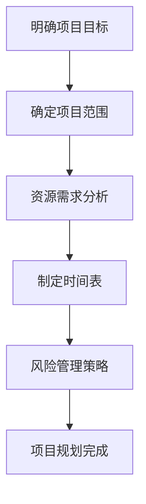

**实例分析**：

假设某企业计划开发一款智能家居监控系统，以下是项目规划的具体步骤：

- **明确项目目标**：开发一款集监控、远程控制和安全报警于一体的智能家居监控系统。
- **确定项目范围**：包括传感器安装、数据传输、数据分析、用户界面设计等功能模块。
- **资源需求分析**：预计需要5名开发人员、2名测试人员，总预算为50万元。
- **制定时间表**：项目计划分为需求分析、设计、开发、测试和上线五个阶段，预计项目周期为12个月。
- **风险管理策略**：识别出技术难题、资金不足、市场需求变化等风险，制定相应的应对措施。

通过这样的项目规划，企业可以确保创新项目有序进行，降低风险，提高项目成功率。

#### 4.3.2 创新项目执行

在创新项目规划完成后，接下来是项目执行阶段。项目执行是确保项目目标和计划得以实现的关键环节。以下是创新项目执行的具体步骤和注意事项：

**1. 团队组建**：根据项目规划和资源需求，组建项目管理团队和执行团队。明确团队成员的职责和任务，确保团队高效协作。

**2. 任务分解**：将项目任务分解为具体的工作包，明确每个工作包的责任人和完成时间。制定详细的工作计划，确保每个任务有条不紊地推进。

**3. 进度监控**：定期检查项目进度，确保项目按照计划进行。使用项目管理工具（如JIRA、Trello等）跟踪任务进度，及时发现和解决问题。

**4. 质量控制**：对项目成果进行质量检查，确保符合预期标准和用户需求。制定质量控制流程，包括代码审查、功能测试、性能测试等。

**5. 沟通协作**：保持团队内部的高效沟通和协作，确保信息畅通。定期召开项目会议，讨论项目进展、解决问题和调整计划。

**6. 资源管理**：合理利用项目资源，确保项目在人力、资金、技术等方面的需求得到满足。根据实际情况调整资源分配，确保项目高效运行。

**7. 风险管理**：持续监控项目风险，及时识别和应对潜在问题。定期进行风险评估，调整风险管理策略，确保项目风险在可控范围内。

**注意事项**：

- **明确职责**：确保每个团队成员职责明确，避免职责重叠和冲突。
- **灵活调整**：根据项目实际情况，灵活调整计划和策略，确保项目能够适应变化。
- **持续改进**：鼓励团队成员在项目执行过程中不断提出改进建议，优化项目流程和成果。
- **激励机制**：建立合理的激励机制，鼓励团队成员积极参与项目，提高项目执行力。

以下是一个简化的创新项目执行流程图：

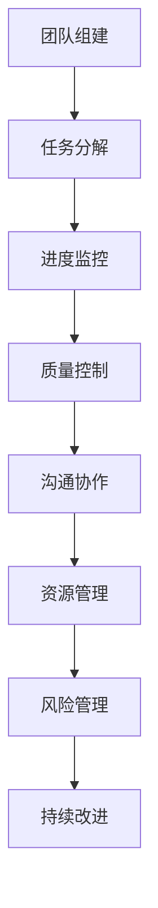

**实例分析**：

假设某企业正在开发一款智能家居监控系统，以下是项目执行的具体步骤：

- **团队组建**：组建项目管理团队和执行团队，明确团队成员的职责和任务。
- **任务分解**：将项目任务分解为需求分析、设计、开发、测试和上线等阶段，明确每个阶段的责任人和完成时间。
- **进度监控**：使用项目管理工具跟踪任务进度，定期召开项目会议，讨论项目进展和问题。
- **质量控制**：进行代码审查、功能测试和性能测试，确保系统符合预期标准和用户需求。
- **沟通协作**：保持团队内部的高效沟通和协作，确保信息畅通。
- **资源管理**：合理利用项目资源，确保项目在人力、资金、技术等方面的需求得到满足。
- **风险管理**：识别和应对潜在问题，定期进行风险评估，调整风险管理策略。

通过这样的项目执行，企业可以确保创新项目顺利推进，提高项目成功率。

#### 4.3.3 创新项目监控与评估

创新项目监控与评估是确保创新项目按计划推进并达到预期目标的关键环节。通过有效的监控与评估，企业可以及时发现和解决问题，调整项目策略，提高项目成功率。以下是创新项目监控与评估的具体方法：

**1. 制定关键绩效指标（KPI）**：根据项目目标和计划，制定具体的关键绩效指标，用于衡量项目的进度、质量和效果。例如，项目进度完成率、功能模块完成率、用户满意度等。

**2. 定期汇报**：制定定期汇报制度，要求项目经理定期向高层管理层汇报项目进展、遇到的问题和解决方案。汇报内容应包括项目进度、KPI指标、风险评估和下一步计划等。

**3. 项目审计**：定期进行项目审计，检查项目执行的合规性和效率。项目审计可以由内部审计团队或外部顾问进行，确保审计过程的客观性和公正性。

**4. 用户反馈**：收集用户对项目的反馈，了解用户对项目成果的满意度，及时发现问题和改进方向。用户反馈可以通过在线调查、用户访谈、焦点小组讨论等方式进行。

**5. 里程碑评估**：在项目的重要里程碑节点，进行评估和审查，确保项目按计划推进，达到预期目标。里程碑评估可以包括项目进度、质量、风险等方面的评估。

**6. 建立反馈机制**：建立项目反馈机制，及时将评估结果和用户反馈传递给项目团队和相关人员，促进项目改进。反馈机制可以包括定期的项目评审会议、项目报告和改进计划等。

以下是一个简化的创新项目监控与评估流程图：

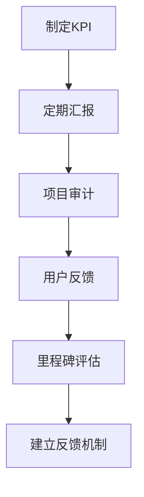

**实例分析**：

假设某企业正在开发一款智能家居监控系统，以下是项目监控与评估的具体方法：

- **制定KPI**：根据项目目标和计划，制定关键绩效指标，如项目进度完成率、功能模块完成率、用户满意度等。
- **定期汇报**：每月召开一次项目进展汇报会议，项目经理向高层管理层汇报项目进展、遇到的问题和解决方案。
- **项目审计**：每季度进行一次项目审计，检查项目执行的合规性和效率。
- **用户反馈**：通过在线调查和用户访谈，收集用户对系统的满意度反馈，了解用户需求和使用体验。
- **里程碑评估**：在每个里程碑节点，进行项目评估，确保项目按计划推进，达到预期目标。
- **建立反馈机制**：建立项目反馈机制，及时将评估结果和用户反馈传递给项目团队和相关人员，促进项目改进。

通过这样的监控与评估，企业可以确保创新项目按计划推进，及时发现和解决问题，提高项目成功率。

### 4.3.4 项目总结与反思

在创新项目完成后，进行项目总结与反思是确保项目经验和教训得到有效利用的重要环节。以下是项目总结与反思的步骤和方法：

**1. 收集项目数据**：收集项目过程中产生的数据，包括项目进度、质量、成本、用户反馈等。确保数据完整、准确，为后续分析提供基础。

**2. 分析项目成果**：对项目的成果进行详细分析，包括项目目标达成情况、功能模块的实现程度、用户满意度等。评估项目是否达到预期目标，并找出成功的经验和不足之处。

**3. 总结项目经验**：总结项目过程中的成功经验，包括项目管理、团队协作、技术实现等方面的优点。这些经验可以为未来的项目提供宝贵的参考。

**4. 反思项目不足**：反思项目过程中遇到的问题和挑战，分析原因，并探讨改进措施。例如，如果项目进度延误，需要分析是计划不合理、资源不足还是团队协作不畅等问题。

**5. 制定改进计划**：根据项目总结与反思的结果，制定具体的改进计划，包括项目管理流程的优化、团队成员技能的提升、技术方案的改进等。

**6. 编写项目报告**：编写详细的项目报告，包括项目背景、目标、过程、成果、经验、反思和改进计划等。项目报告应清晰、简洁，便于团队成员和相关人员阅读和理解。

以下是一个简化的项目总结与反思流程图：

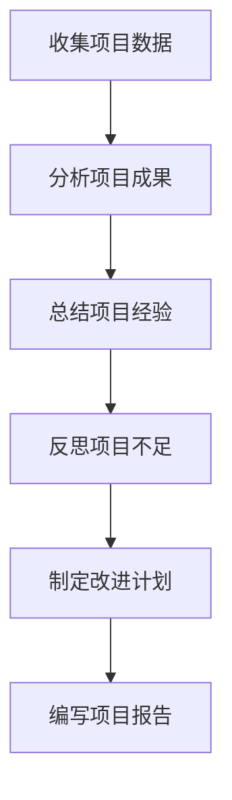

**实例分析**：

假设某企业开发了一款智能家居监控系统，以下是项目总结与反思的具体步骤：

- **收集项目数据**：收集项目进度、质量、成本、用户反馈等数据，确保数据完整准确。
- **分析项目成果**：评估项目是否达到预期目标，如功能模块的实现程度、用户满意度等。
- **总结项目经验**：总结项目中的成功经验，如高效的项目管理、团队成员的协同作战等。
- **反思项目不足**：分析项目过程中遇到的问题，如进度延误、技术难题等，探讨原因和改进措施。
- **制定改进计划**：制定具体的改进计划，如优化项目管理流程、加强团队成员培训等。
- **编写项目报告**：编写详细的项目报告，包括项目背景、目标、过程、成果、经验、反思和改进计划等，便于团队成员和相关人员参考。

通过项目总结与反思，企业可以不断完善项目管理流程，提升项目成功率，为未来的创新项目奠定坚实基础。

## 第5章 技术投资与预算管理

#### 5.1 技术投资的评估方法

技术投资是推动企业技术创新和业务发展的关键环节。为了确保技术投资的合理性和有效性，企业需要采用科学、系统的评估方法。以下是几种常见的技术投资评估方法：

**1. 成本效益分析（CBA）**：成本效益分析是一种常用的技术投资评估方法，通过计算投资项目的成本与预期收益，评估项目的经济性。其基本公式为：

\[ \text{成本效益比} = \frac{\text{预期收益}}{\text{投资成本}} \]

成本效益比越高，说明投资项目的经济效益越好。

**2. 净现值（NPV）**：净现值是一种将未来收益折现到现在的评估方法，通过计算未来现金流的现值与投资成本之间的差额，评估项目的价值。其基本公式为：

\[ \text{NPV} = \sum_{t=1}^{n} \frac{CF_t}{(1 + r)^t} - C \]

其中，\( CF_t \) 是第 \( t \) 年的现金流，\( r \) 是折现率，\( n \) 是现金流持续年数，\( C \) 是初始投资成本。

**3. 内部收益率（IRR）**：内部收益率是使净现值为零的折现率，用于评估投资项目的盈利能力。其基本公式为：

\[ \text{IRR} = \frac{\text{投资成本}}{\sum_{t=1}^{n} \frac{CF_t}{(1 + r)^t}} \]

内部收益率越高，说明投资项目的盈利能力越强。

**4. 盈亏平衡分析**：盈亏平衡分析是一种简单但实用的评估方法，通过计算项目达到盈亏平衡点的产量或销售额，评估项目的可行性。其基本公式为：

\[ \text{盈亏平衡点} = \frac{\text{固定成本}}{\text{单位贡献边际}} \]

**5. 技术评估**：除了经济性评估，技术投资还需考虑技术的可行性、可靠性、可维护性等。可以通过技术评审、专家评估等方法，对技术的可行性和风险进行评估。

**实例分析**：

假设某企业计划投资一个大数据处理项目，以下是投资评估的方法和步骤：

- **成本效益分析**：计算项目的投资成本和预期收益，确定成本效益比。
- **净现值计算**：预测未来现金流，计算项目的净现值，判断项目是否值得投资。
- **内部收益率计算**：计算项目的内部收益率，评估项目的盈利能力。
- **盈亏平衡分析**：预测项目达到盈亏平衡点的产量或销售额，评估项目的可行性。
- **技术评估**：对大数据处理技术进行可行性、可靠性、可维护性评估，确保技术的实施风险较低。

通过这些方法，企业可以全面评估技术投资的可行性和经济性，为投资决策提供依据。

### 5.2 技术预算的制定与调整

技术预算的制定与调整是企业技术投资管理的重要组成部分。合理的预算管理可以确保技术投资的有效性，提高资金利用率，同时避免资源浪费。以下是技术预算制定与调整的步骤和方法：

**1. 制定预算初步方案**：

- **需求分析**：根据企业的发展规划和项目需求，分析所需的技术投资。包括研发项目、技术升级、新技术的引进等。
- **历史数据参考**：参考以往的技术投资预算数据，结合市场和技术发展趋势，制定初步预算方案。

**2. 拆分预算项目**：

- **项目分类**：将预算项目按类型分类，如研发项目、技术升级、运维费用等。
- **分配预算**：根据项目的重要性和紧急程度，分配预算。对于关键项目和高优先级项目，应给予充足的预算支持。

**3. 预算调整**：

- **定期审查**：定期审查预算执行情况，评估实际支出与预算的差异。
- **调整策略**：根据预算执行情况，及时调整预算。对于超支项目，分析原因，制定应对措施；对于预算不足的项目，考虑增加预算或调整资源分配。

**4. 资金调配**：

- **优化资源配置**：通过资金调配，确保关键项目和紧急项目能够获得足够的资金支持。
- **预算预留**：在预算制定过程中，预留一定比例的资金用于应对突发事件和不确定因素。

**5. 预算执行与监控**：

- **设立监控指标**：制定明确的监控指标，如项目完成率、成本控制率等，确保预算执行的透明度和可控性。
- **定期汇报**：要求项目经理定期汇报预算执行情况，及时调整预算和资源配置。

以下是一个简化的技术预算制定与调整流程：

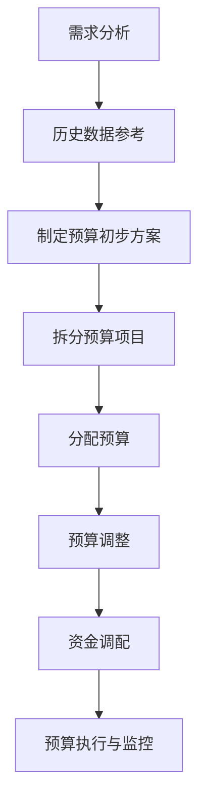

**实例分析**：

假设某企业需要制定下一年的技术预算，以下是具体步骤：

- **需求分析**：分析企业未来一年的技术需求，包括研发新产品的资金需求、现有系统的升级维护费用、新技术引进的费用等。
- **历史数据参考**：参考过去三年的技术投资预算，了解各项开支的分布和变化趋势。
- **制定预算初步方案**：根据需求分析和历史数据参考，制定初步的预算方案。
- **拆分预算项目**：将预算项目分类，如研发项目、系统升级、运维费用等，并分配预算。
- **预算调整**：在预算执行过程中，根据项目进展和实际情况，及时调整预算，确保关键项目得到充足支持。
- **资金调配**：根据项目进展和资金需求，优化资源配置，确保关键项目和紧急项目得到优先支持。
- **预算执行与监控**：设立监控指标，定期审查预算执行情况，及时调整预算和资源配置，确保预算执行的有效性和透明度。

通过这样的技术预算制定与调整，企业可以确保技术投资的有效性和资金利用的高效性，推动企业技术创新和业务发展。

### 5.3 技术投资的风险管理

技术投资在带来潜在收益的同时，也伴随着各种风险。有效的风险管理是确保技术投资顺利实施和实现预期目标的关键。以下是技术投资风险管理的方法和策略：

**1. 风险识别**：

- **历史数据分析**：通过分析以往技术投资项目的成功和失败案例，识别出常见风险因素，如技术风险、市场风险、财务风险等。
- **专家咨询**：邀请行业专家和顾问进行风险识别，获取专业意见。
- **风险评估**：对识别出的风险进行定量和定性评估，确定其可能的影响程度和发生概率。

**2. 风险评估方法**：

- **定性分析**：通过专家评估、头脑风暴等方法，对风险进行定性分析，识别出主要风险因素。
- **定量分析**：使用数学模型和统计方法，对风险进行定量分析，评估其可能的影响程度。例如，可以使用概率-影响矩阵进行风险优先级排序。

**3. 风险应对策略**：

- **风险规避**：通过调整投资策略，避免高风险项目的实施。例如，放弃高技术风险的项目，选择低风险的技术方向。
- **风险控制**：通过加强管理和监控，降低风险发生的概率和影响。例如，加强技术研发，提高技术储备，提高产品质量。
- **风险转移**：通过购买保险、外包等方式，将部分风险转移给第三方。例如，购买技术保险，将技术风险转移给保险公司。
- **风险接受**：对于无法规避或控制的风险，企业需要做好应对准备，减少风险带来的负面影响。例如，制定应急预案，提高危机管理能力。

**4. 风险管理流程**：

- **风险评估与监控**：定期进行风险评估，监控风险的变化，及时调整风险管理策略。
- **风险报告**：建立风险报告制度，定期向管理层报告风险情况，确保风险管理的透明度和及时性。
- **风险管理培训**：为员工提供风险管理培训，提高其风险管理意识和能力。

以下是一个简化的技术投资风险管理流程：

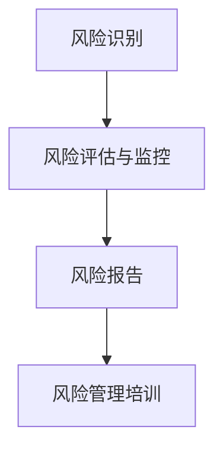

**实例分析**：

假设某企业计划投资一个人工智能项目，以下是风险管理的具体步骤：

- **风险识别**：分析人工智能项目的风险因素，如技术风险、数据风险、市场风险等。
- **风险评估**：通过定量和定性分析，评估每个风险的可能影响程度和发生概率。
- **风险规避**：由于技术风险较高，企业决定调整投资策略，减少对高风险技术的投资。
- **风险控制**：加强技术研发，提高技术储备，确保项目的成功实施。
- **风险转移**：购买技术保险，将部分技术风险转移给保险公司。
- **风险接受**：制定应急预案，提高危机管理能力，减少风险带来的负面影响。

通过这样的风险管理，企业可以降低技术投资的风险，确保投资项目的顺利实施。

### 5.3.1 投资风险识别

投资风险识别是技术投资风险管理的基础环节。通过对潜在风险的识别和分类，企业可以提前了解并评估可能的风险，从而采取有效的应对措施。以下是投资风险识别的方法和步骤：

**1. 历史数据回顾**：

- **成功案例分析**：通过回顾以往成功的技术投资项目，分析其成功的原因和潜在风险，为当前项目提供借鉴。
- **失败案例学习**：分析以往失败的技术投资项目，识别失败的原因和关键风险因素，避免在当前项目中重蹈覆辙。

**2. 专家咨询**：

- **行业专家**：邀请行业专家和顾问，利用他们的专业知识和经验，识别出项目可能面临的风险。
- **内部专家**：组织内部专家进行头脑风暴，收集项目成员对风险的意见和看法，提高风险识别的全面性。

**3. 风险因素分析**：

- **技术风险**：评估项目所需技术的成熟度、研发周期和成本，识别可能的技术难题和研发风险。
- **市场风险**：分析市场需求、竞争态势和用户反馈，识别市场变化带来的风险。
- **财务风险**：评估项目成本、投资回报和财务稳定性，识别可能出现的财务风险。
- **运营风险**：分析项目运营过程中的管理风险、供应链风险和运营效率风险。

**4. 风险分类**：

- **按风险性质分类**：将风险分为技术风险、市场风险、财务风险和运营风险等，以便于分类管理和应对。
- **按风险影响程度分类**：将风险分为高风险、中风险和低风险，根据风险程度制定相应的应对策略。

以下是一个简化的风险识别流程：

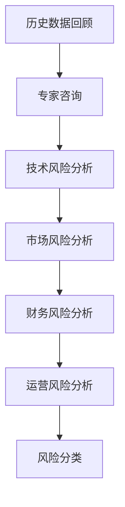

**实例分析**：

假设某企业计划投资一个基于人工智能的智能制造项目，以下是风险识别的具体步骤：

- **历史数据回顾**：分析以往成功和失败的人工智能项目，识别出常见的风险因素，如技术成熟度不足、市场需求不确定等。
- **专家咨询**：邀请行业专家和顾问，进行风险识别和评估。
- **技术风险分析**：评估项目所需的人工智能技术的成熟度和研发周期，识别可能的技术难题，如算法稳定性、数据处理能力等。
- **市场风险分析**：分析市场需求和竞争态势，识别潜在的市场变化和竞争压力。
- **财务风险分析**：评估项目成本、投资回报和财务稳定性，识别可能出现的财务风险，如资金不足、投资回报周期过长等。
- **运营风险分析**：分析项目运营过程中的管理风险、供应链风险和运营效率风险，如项目管理不善、供应链中断、运营效率低下等。
- **风险分类**：将识别出的风险按性质和影响程度进行分类，制定相应的应对策略。

通过这样的风险识别，企业可以全面了解项目可能面临的风险，为后续的风险评估和应对策略提供依据。

### 5.3.2 风险评估与应对策略

在识别出潜在风险后，进行风险评估是确保技术投资有效管理的重要步骤。风险评估旨在量化风险的可能性和影响，从而帮助企业制定合理的应对策略。以下是风险评估的具体方法和应对策略：

**1. 定量评估方法**：

- **概率-影响矩阵**：通过评估风险的发生概率和影响程度，构建概率-影响矩阵，为风险优先级排序。例如，可以使用5x5的矩阵，将风险分为低、中、高三个等级。
- **蒙特卡罗模拟**：通过模拟不同情景，计算风险发生的概率和影响，为决策提供数据支持。例如，可以使用蒙特卡罗模拟方法评估项目的技术成功率和财务回报。

**2. 定性评估方法**：

- **专家评估**：通过邀请行业专家和顾问，对风险进行定性分析，评估其可能性和影响。例如，可以通过专家访谈和风险评估会议，获取专家意见。
- **风险矩阵**：通过构建风险矩阵，将风险的发生概率和影响程度进行综合评估。例如，可以使用3x3的风险矩阵，将风险分为低、中、高三个等级。

**3. 应对策略**：

- **风险规避**：通过调整投资策略，避免高风险项目的实施。例如，选择技术较为成熟、市场需求明确的项目，减少技术风险和市场风险。
- **风险控制**：通过加强管理和监控，降低风险发生的概率和影响。例如，建立完善的技术研发管理体系，确保项目的技术可行性和稳定性。
- **风险转移**：通过购买保险、外包等方式，将部分风险转移给第三方。例如，购买技术保险，将技术风险转移给保险公司；将部分研发任务外包，降低内部管理风险。
- **风险接受**：对于无法规避或控制的风险，企业需要做好应对准备，减少风险带来的负面影响。例如，制定应急预案，提高危机管理能力；建立风险储备金，应对可能的财务风险。

以下是一个简化的风险评估与应对策略流程：

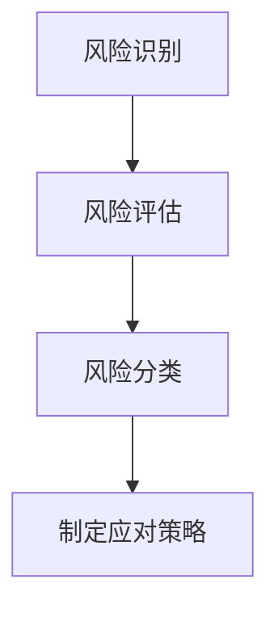

**实例分析**：

假设某企业计划投资一个基于区块链的供应链管理项目，以下是风险评估与应对策略的具体步骤：

- **风险识别**：识别出潜在的风险因素，如技术风险（区块链技术的成熟度和稳定性）、市场风险（市场需求和竞争态势）、财务风险（项目成本和投资回报周期）等。
- **定量评估**：使用概率-影响矩阵评估风险的可能性和影响程度。例如，将技术风险评估为高可能性、高影响程度；市场风险评估为中可能性、高影响程度；财务风险评估为低可能性、中影响程度。
- **定性评估**：通过专家评估和风险矩阵，进一步确认风险分类和优先级。
- **制定应对策略**：针对不同风险，制定相应的应对策略。例如，对技术风险，加强技术研发和稳定性测试；对市场风险，进行市场调研和竞争分析，调整市场策略；对财务风险，制定详细的财务计划和投资回报分析，确保项目财务可行性。

通过这样的风险评估与应对策略，企业可以降低技术投资的风险，提高项目成功率。

## 第6章 人才战略

#### 6.1 技术人才的需求分析

技术人才是企业实现技术创新和业务发展的关键资源。准确分析技术人才的需求，有助于企业制定合理的人才引进、培养和激励策略。以下是技术人才需求分析的方法和步骤：

**1. 技术发展趋势分析**：

- **行业趋势**：分析技术行业的发展趋势，了解当前热门技术和未来可能的发展方向。例如，人工智能、云计算、物联网等技术的快速发展，对相关技术人才的需求将持续增加。
- **市场需求**：通过市场调研和行业报告，了解企业对技术人才的具体需求。包括所需的技能、专业背景、工作经验等。

**2. 企业现状分析**：

- **现有人才结构**：分析企业现有技术人才的数量、质量和分布情况。识别出当前人才结构中的短板和不足，确定需要补充的技术领域和人才类型。
- **业务发展需求**：结合企业的业务发展规划，分析未来对技术人才的需求。例如，新业务拓展、技术创新项目等，可能需要引进具备特定技能的人才。

**3. 技能需求分析**：

- **核心技能**：识别企业核心技术领域所需的核心技能，如编程能力、系统架构设计、数据分析等。
- **辅助技能**：分析企业业务发展所需的辅助技能，如项目管理、沟通协调、团队协作等。

**4. 市场供需分析**：

- **人才供应情况**：了解技术人才市场的供需情况，分析人才市场的饱和度、竞争态势等。
- **人才流动趋势**：通过分析人才流动趋势，预测未来技术人才的供需变化，为企业人才引进策略提供参考。

**5. 制定人才需求计划**：

- **需求预测**：基于上述分析结果，预测企业未来一段时间内对技术人才的需求，包括数量、质量和类型等。
- **制定计划**：根据需求预测，制定详细的人才引进、培养和激励计划，确保企业技术人才队伍的持续优化和提升。

以下是一个简化的技术人才需求分析流程：

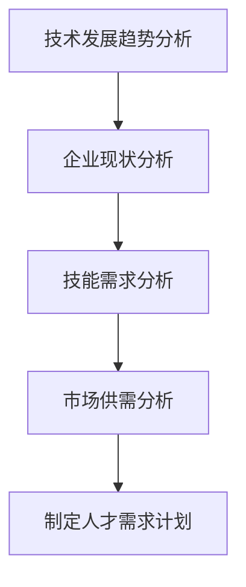

**实例分析**：

假设某企业计划在未来两年内进行业务拓展和技术创新，以下是技术人才需求分析的具体步骤：

- **技术发展趋势分析**：分析人工智能、大数据、云计算等技术的发展趋势，确定企业未来需要重点引进的相关技术人才。
- **企业现状分析**：评估企业现有技术人才的数量、质量和分布情况，识别出当前人才结构中的短板和不足。
- **技能需求分析**：确定企业业务发展所需的核心技能和辅助技能，如人工智能算法工程师、大数据分析师、云计算架构师等。
- **市场供需分析**：通过市场调研和行业报告，了解技术人才市场的供需情况，预测未来人才流动趋势。
- **制定人才需求计划**：根据分析结果，预测未来对技术人才的需求，制定详细的人才引进、培养和激励计划，包括招聘策略、培训计划、激励措施等。

通过这样的技术人才需求分析，企业可以确保人才引进策略的合理性和有效性，为企业的技术创新和业务发展提供有力支持。

### 6.2 人才引进与培养策略

技术人才是企业实现技术创新和业务发展的核心动力。为了确保企业拥有足够的技术人才储备，并不断提升其能力，企业需要制定科学合理的人才引进与培养策略。以下是人才引进与培养的具体方法和步骤：

**1. 人才引进策略**：

- **内部晋升**：优先考虑内部员工晋升，激发员工的积极性和潜力。通过内部晋升，不仅可以提高员工的职业发展机会，还可以确保企业的文化传承和价值观的一致性。

- **外部招聘**：对于关键岗位和紧缺人才，通过外部招聘引进优秀人才。外部招聘可以带来新的思维和经验，有助于企业创新和突破。

- **校企合作**：与高校建立合作关系，开展实习、联合培养项目，吸引优秀毕业生加入企业。校企合作不仅有助于企业引进新鲜血液，还可以提升企业的社会声誉。

- **人才市场招聘**：利用人才市场招聘渠道，发布招聘信息，吸引符合条件的应聘者。通过人才市场招聘，可以快速补充企业所需人才。

- **人才猎头**：对于高端人才和技术专家，可以通过人才猎头服务，确保招聘过程的保密性和高效性。

**2. 人才培养策略**：

- **系统培训**：制定系统化的培训计划，包括技能培训、知识更新和职业发展培训等。通过培训，提升员工的专业技能和管理能力。

- **导师制度**：建立导师制度，为新员工配备经验丰富的导师，帮助其快速适应企业文化和工作环境，提高工作效率。

- **岗位轮换**：定期安排员工在不同岗位之间轮换，拓宽员工的知识面和经验，提升其综合素质。

- **专业认证**：鼓励员工参加专业认证考试，如PMP、CISSP等，提高其职业竞争力。

- **创新实验室**：建立创新实验室，鼓励员工进行技术创新和项目实践。创新实验室不仅提供了一个实践平台，还可以激发员工的创新思维和创造力。

**3. 人才激励策略**：

- **绩效激励**：建立科学的绩效考核体系，对表现优秀的员工给予奖励，包括奖金、晋升等。

- **股权激励**：对于关键岗位和核心人才，可以实施股权激励，绑定员工的利益，提升员工的归属感和忠诚度。

- **福利保障**：提供良好的福利保障，包括健康保险、住房补贴、带薪休假等，提升员工的生活质量。

- **职业发展**：为员工提供明确的职业发展路径和晋升机会，激励员工不断提升自己。

**4. 实施步骤**：

- **需求分析**：分析企业对人才的需求，确定人才引进和培养的重点方向。

- **策略制定**：根据需求分析结果，制定具体的人才引进与培养策略。

- **计划实施**：按照制定的人才引进与培养计划，逐步实施，确保各项措施落地。

- **效果评估**：定期评估人才引进与培养的效果，根据评估结果进行调整和优化。

以下是一个简化的人才引进与培养策略实施流程：

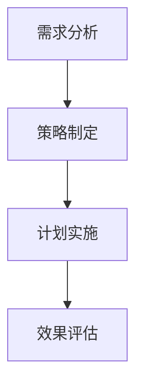

**实例分析**：

假设某企业计划在未来一年内提升其技术团队的能力，以下是人才引进与培养策略的具体步骤：

- **需求分析**：分析企业当前技术团队的结构和能力，确定需要引进的技术岗位和紧缺人才类型，如人工智能算法工程师、大数据分析师等。

- **策略制定**：制定人才引进与培养策略，包括内部晋升、外部招聘、校企合作、人才市场招聘等，同时制定系统培训、导师制度、岗位轮换、专业认证等培养计划。

- **计划实施**：按照制定的人才引进与培养计划，逐步实施，如开展招聘活动、组织培训课程、建立导师制度等。

- **效果评估**：定期评估人才引进与培养的效果，通过员工绩效、项目进展、员工满意度等指标，评估人才引进与培养策略的有效性，并根据评估结果进行调整和优化。

通过这样的人才引进与培养策略，企业可以不断提升技术团队的能力，为企业的技术创新和业务发展提供坚实的人才保障。

### 6.3 人才培养与激励机制

人才培养与激励机制是确保企业拥有持续创新能力的关键。一个科学合理的人才培养与激励机制，不仅能够激发员工的工作热情和创造力，还能够提升企业的整体竞争力。以下是人才培养与激励机制的具体策略和步骤：

**1. 能力提升**：

- **培训与发展**：为员工提供系统化的培训计划，包括专业技能培训、领导力培训、跨部门培训等。通过培训，提升员工的专业能力和综合素质。

- **职业规划**：为员工制定明确的职业规划，帮助其明确个人发展目标和路径，提供职业发展指导和支持。

- **岗位轮换**：定期安排员工在不同岗位之间轮换，拓宽员工的知识面和经验，提升其综合素质和适应能力。

- **专业认证**：鼓励员工参加专业认证考试，如PMP、CISSP、SCA等，提高其职业竞争力。

**2. 激励机制**：

- **绩效激励**：建立科学的绩效考核体系，对表现优秀的员工给予奖励，包括奖金、晋升、荣誉等。通过绩效激励，激发员工的积极性和主动性。

- **股权激励**：对于关键岗位和核心人才，可以实施股权激励，绑定员工的利益，提升员工的归属感和忠诚度。

- **福利保障**：提供良好的福利保障，包括健康保险、住房补贴、带薪休假、员工活动等，提升员工的工作满意度和生活质量。

- **奖励制度**：设立创新奖励制度，对提出有效创新建议或在项目中取得显著成果的员工给予奖励，激励员工积极参与创新项目。

**3. 反馈与沟通**：

- **定期反馈**：建立定期反馈机制，让员工了解自己的工作表现和公司对他们的期望，及时调整和改进。

- **开放式沟通**：鼓励员工提出意见和建议，建立开放的沟通渠道，让员工感受到企业的关爱和尊重。

- **领导激励**：通过领导力培训和实践，提升领导者的管理水平，激发团队活力。

**4. 实施步骤**：

- **需求分析**：分析企业对人才的能力需求和激励需求，确定人才培养和激励的重点方向。

- **策略制定**：根据需求分析结果，制定具体的人才培养与激励机制，包括培训计划、绩效激励、股权激励、福利保障等。

- **计划实施**：按照制定的人才培养与激励机制，逐步实施，确保各项措施落地。

- **效果评估**：定期评估人才培养与激励机制的效果，通过员工满意度、绩效指标、创新成果等指标，评估激励机制的有效性，并根据评估结果进行调整和优化。

以下是一个简化的人才培养与激励机制实施流程：


**实例分析**：

假设某企业计划在未来一年内提升员工的能力和激励，以下是人才培养与激励机制的具体步骤：

- **需求分析**：分析企业当前员工的能力水平和激励需求，确定需要提升的技能领域和激励方式。

- **策略制定**：制定具体的人才培养与激励机制，包括专业技能培训、绩效激励、股权激励、福利保障等。

- **计划实施**：按照制定的计划，组织员工培训、绩效评估、股权激励等，确保措施落地。

- **效果评估**：定期评估人才培养与激励机制的效果，通过员工满意度调查、绩效指标、创新成果等，评估激励机制的有效性，并根据评估结果进行调整和优化。

通过这样的人才培养与激励机制，企业可以不断提升员工的能力，激发创新热情，提高整体竞争力。

### 6.3.1 人才培养计划

人才培养计划是确保企业拥有持续竞争力的关键。一个科学合理的人才培养计划能够全面提升员工的能力，推动企业技术创新和业务发展。以下是人才培养计划的具体步骤和实施方法：

**1. 制定培养目标**：

- **明确培养目标**：根据企业战略目标和业务需求，明确人才培养的具体目标，如提升专业技能、增强创新能力、提升领导力等。

- **设定培养路径**：为每个员工设定明确的职业发展路径，包括初级、中级、高级等不同阶段的培养目标。

**2. 设计培训内容**：

- **技能培训**：根据员工岗位职责和技能需求，设计专业技能培训课程，如编程、数据分析、项目管理等。

- **知识更新**：定期更新员工的业务知识和行业动态，确保其掌握最新的技术和趋势。

- **软技能培训**：提高员工的沟通协作、团队管理、领导力等软技能，提升其综合素质。

**3. 制定培训计划**：

- **年度培训计划**：根据培养目标和培训内容，制定年度培训计划，明确培训的时间、地点、责任人等。

- **个性化培训计划**：为每位员工制定个性化的培训计划，根据其职业发展路径和需求，提供针对性的培训。

**4. 实施培训计划**：

- **内部培训**：组织内部培训，由资深员工或外部专家进行授课，分享实战经验和最佳实践。

- **外部培训**：鼓励员工参加外部培训，如行业会议、专业认证等，扩大其视野和知识面。

- **线上培训**：利用线上培训平台，提供灵活的学习资源，方便员工随时学习。

**5. 培训效果评估**：

- **考核评估**：对培训效果进行考核评估，包括知识测试、项目实战、员工反馈等。

- **持续改进**：根据培训效果评估结果，不断优化培训计划，提升培训效果。

以下是一个简化的人才培养计划实施流程：

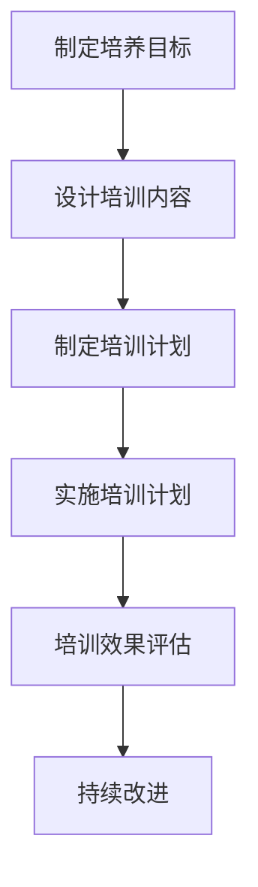

**实例分析**：

假设某企业计划在未来一年内提升其技术团队的能力，以下是人才培养计划的具体步骤：

- **制定培养目标**：明确技术团队需要提升的专业技能，如编程、系统架构设计、云计算等。

- **设计培训内容**：根据培养目标，设计相关的培训课程，包括编程语言、数据库管理、云计算平台等。

- **制定培训计划**：制定年度培训计划，包括培训的时间、地点、责任人等，确保培训计划的顺利实施。

- **实施培训计划**：组织内部培训和外部培训，邀请资深员工和外部专家进行授课。

- **培训效果评估**：对培训效果进行考核评估，通过知识测试和项目实战，评估员工的培训成果。

- **持续改进**：根据培训效果评估结果，优化培训计划，提升培训效果，确保技术团队能力持续提升。

通过这样的人才培养计划，企业可以不断提升技术团队的能力，为企业的技术创新和业务发展提供坚实的人才保障。

### 6.3.2 激励机制设计

激励机制设计是确保员工持续发挥潜力、提高工作效率和创新能力的重要手段。一个科学合理的激励机制能够激发员工的积极性和创造力，提升企业的整体竞争力。以下是激励机制设计的关键要素和实施方法：

**1. 绩效考核**：

- **设定绩效目标**：根据企业的战略目标和部门职责，设定具体的绩效目标，确保每个员工都明确自己的工作目标。

- **绩效指标**：制定科学的绩效指标体系，包括量化的工作成果指标、质量指标、团队合作指标等，确保绩效考核的客观性和公正性。

- **绩效评估**：定期对员工的工作绩效进行评估，确保评估过程的透明和公正，并根据评估结果给予相应的奖励或惩罚。

**2. 薪酬激励**：

- **基本薪酬**：根据员工的工作岗位、技能水平和工作经验，设定合理的基本薪酬水平，确保员工的薪资竞争力。

- **奖金制度**：设立奖金制度，对表现优秀的员工给予额外的奖励，激励员工追求卓越。

- **长期激励**：实施股权激励、期权激励等长期激励措施，绑定员工的利益，提高其归属感和忠诚度。

**3. 培训与发展**：

- **职业发展**：为员工提供明确的职业发展路径，包括晋升通道、培训机会等，激励员工不断提升自己的能力和价值。

- **技能培训**：定期为员工提供专业技能培训，提高其业务能力和职业素养。

**4. 工作环境**：

- **工作氛围**：营造积极、开放、包容的工作氛围，鼓励员工之间的交流和合作，提高团队凝聚力。

- **工作条件**：提供舒适、安全的工作环境，确保员工能够专注工作。

**5. 激励措施实施**：

- **反馈机制**：建立有效的反馈机制，让员工了解自己的工作表现和公司的期望，及时调整和改进。

- **个性化激励**：根据员工的个人特点和需求，设计个性化的激励措施，提高激励效果。

以下是一个简化的激励机制设计流程：

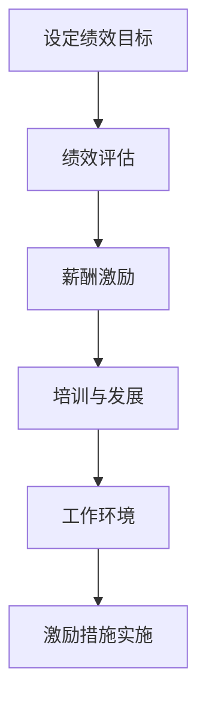

**实例分析**：

假设某企业计划设计一套激励机制，以下是激励机制设计的具体步骤：

- **设定绩效目标**：根据企业的战略目标和各部门的职责，设定具体的绩效目标，如销售额、项目完成率、客户满意度等。

- **绩效评估**：建立科学的绩效评估体系，包括量化的工作成果指标、质量指标、团队合作指标等，确保评估的客观性和公正性。

- **薪酬激励**：设立奖金制度，对表现优秀的员工给予额外的奖励，如季度奖金、年终奖等。同时，根据市场水平调整基本薪酬，确保员工的薪资竞争力。

- **培训与发展**：为员工提供明确的职业发展路径，包括晋升通道、培训机会等，激励员工不断提升自己的能力和价值。

- **工作环境**：营造积极、开放、包容的工作氛围，鼓励员工之间的交流和合作，提高团队凝聚力。

- **激励措施实施**：建立有效的反馈机制，定期向员工反馈绩效评估结果，并根据评估结果调整激励措施，确保激励措施的有效性和公平性。

通过这样的激励机制设计，企业可以激发员工的积极性和创造力，提升整体竞争力，推动企业的持续发展。

## 第7章 实施与监控

#### 7.1 战略实施的步骤

战略实施是将战略规划转化为实际行动的过程，它关系到战略目标能否顺利实现。以下是战略实施的详细步骤：

**1. 制定实施计划**：

- **明确战略目标**：根据战略规划，明确具体的战略目标，确保实施计划有明确的方向。
- **分解目标**：将大目标分解为小目标，制定具体的实施步骤和时间表。
- **资源分配**：确定实现目标所需的资源，包括人力、资金、技术等，并进行合理分配。

**2. 建立执行团队**：

- **组建团队**：根据实施计划，组建项目管理团队和执行团队，明确团队成员的职责和任务。
- **分工协作**：确保团队成员之间分工明确，各司其职，协同合作，提高执行效率。

**3. 实施行动**：

- **启动项目**：按照实施计划，正式启动项目，执行各项任务和活动。
- **定期检查**：定期检查项目进度，确保各项工作按计划进行，及时解决出现的问题。

**4. 风险管理**：

- **识别风险**：在项目实施过程中，持续监控潜在风险，识别可能影响项目目标实现的风险。
- **风险评估**：对识别出的风险进行评估，确定其可能性和影响程度。
- **风险应对**：制定相应的风险应对策略，降低风险的发生概率和影响。

**5. 调整与优化**：

- **定期评估**：在项目执行过程中，定期评估项目进展和效果，根据评估结果调整实施计划。
- **优化流程**：根据评估结果，优化项目流程和管理方法，提高项目执行力。

**6. 持续改进**：

- **反馈机制**：建立有效的反馈机制，收集项目执行过程中的反馈信息，用于改进项目管理和执行策略。
- **持续优化**：根据反馈信息，不断优化项目实施过程，提高项目成功率。

以下是一个简化的战略实施步骤流程图：

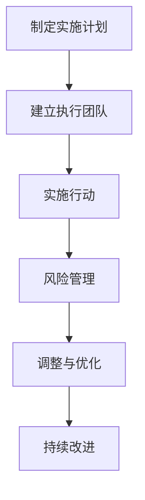

#### 7.2 战略监控与评估

战略监控与评估是确保战略实施效果的重要环节。通过有效的监控与评估，企业可以及时发现战略实施中的问题，进行调整和优化，确保战略目标的实现。以下是战略监控与评估的具体方法和步骤：

**1. 制定监控指标**：

- **关键绩效指标（KPI）**：根据战略目标和实施计划，制定具体的监控指标，如项目完成率、成本控制率、客户满意度等。
- **指标权重**：为每个监控指标设定权重，确保指标之间的平衡和重点突出。

**2. 数据收集与分析**：

- **数据收集**：通过定量和定性方法，收集与监控指标相关的数据，如项目进度、财务数据、客户反馈等。
- **数据分析**：对收集的数据进行统计和分析，评估战略实施的效果和进展。

**3. 定期评估**：

- **评估会议**：定期召开战略评估会议，分析战略实施的效果，讨论存在的问题和改进措施。
- **报告编制**：编制战略评估报告，详细记录战略实施情况、监控指标数据、问题分析和改进计划。

**4. 反馈与调整**：

- **反馈机制**：建立反馈机制，将评估结果及时传达给项目管理团队和执行团队，确保信息畅通。
- **调整与优化**：根据评估结果和反馈信息，调整战略实施计划和管理方法，优化项目执行流程。

**5. 持续改进**：

- **持续监控**：在战略实施过程中，持续监控关键绩效指标，及时发现和解决问题。
- **优化策略**：根据监控结果和反馈信息，不断优化战略实施策略，提高项目执行效率。

以下是一个简化的战略监控与评估流程图：

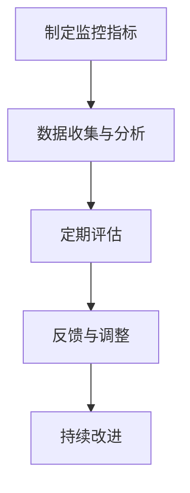

#### 7.3 战略调整与持续优化

战略调整与持续优化是确保企业战略持续有效的重要环节。在战略实施过程中，市场环境、技术趋势、竞争态势等可能会发生变化，企业需要根据实际情况进行调整和优化，以保持战略的灵活性和适应性。以下是战略调整与持续优化的具体方法和步骤：

**1. 持续监控与评估**：

- **关键绩效指标（KPI）**：定期监控关键绩效指标，评估战略实施的效果和进展，确保战略目标逐步实现。
- **数据驱动的决策**：根据监控数据和评估结果，做出数据驱动的决策，及时调整战略方向和实施方法。

**2. 风险管理与应对**：

- **风险识别与评估**：在战略实施过程中，持续识别和评估潜在风险，确保风险在可控范围内。
- **风险应对策略**：制定有效的风险应对策略，降低风险对企业的影响，确保战略的稳定性和持续性。

**3. 持续改进与优化**：

- **流程优化**：根据战略实施过程中的反馈和评估结果，不断优化项目管理和执行流程，提高效率和质量。
- **技术创新**：鼓励技术创新，引入新技术和先进方法，提高企业的竞争力。

**4. 文化建设**：

- **创新文化**：培养企业的创新文化，鼓励员工提出新想法和建议，形成积极向上的创新氛围。
- **协作文化**：营造良好的协作文化，促进团队之间的沟通与协作，提高整体执行力。

**5. 调整战略方向**：

- **市场分析**：根据市场环境和竞争态势的变化，定期分析市场趋势，调整战略方向和目标。
- **客户需求**：关注客户需求的变化，调整产品和服务策略，确保战略与市场需求保持一致。

**6. 定期回顾与总结**：

- **回顾与总结**：定期回顾战略实施情况，总结成功经验和不足之处，为下一步的战略调整提供参考。
- **持续优化**：根据回顾和总结的结果，不断优化战略规划和实施方法，提高企业的战略执行力。

以下是一个简化的战略调整与持续优化流程图：

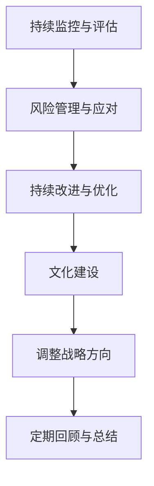

通过这样的战略调整与持续优化流程，企业可以确保战略的灵活性和适应性，及时应对市场变化，保持持续竞争优势。

### 7.3.1 实施效果评估

评估战略实施效果是确保企业战略规划得到有效执行的关键步骤。通过全面、科学的评估，企业可以了解战略实施的实际成果，发现问题并采取改进措施，从而优化战略方案，提高执行力。以下是实施效果评估的步骤和方法：

**1. 制定评估指标**：

- **关键绩效指标（KPI）**：根据战略目标和实施计划，制定具体的评估指标，如项目完成率、成本控制率、客户满意度、市场份额等。
- **量化指标**：确保评估指标可以量化，便于进行数据分析和比较。
- **定性指标**：结合定性指标，如员工满意度、市场反馈等，全面评估战略实施效果。

**2. 收集数据**：

- **数据来源**：从多个渠道收集数据，包括财务报表、市场调研、客户反馈、内部报告等。
- **数据真实性**：确保数据真实可靠，避免人为干扰和误差。

**3. 数据分析**：

- **定量分析**：对收集的数据进行统计分析，如计算平均值、中位数、标准差等，评估指标的变化趋势。
- **定性分析**：对定性指标进行文本分析，识别出潜在的问题和趋势。

**4. 效果评估**：

- **评估会议**：定期召开评估会议，讨论评估结果，识别出战略实施中的成功经验和不足之处。
- **比较基准**：将当前评估结果与预期目标、历史数据或行业标准进行比较，确定实际效果。

**5. 评估报告**：

- **编写报告**：根据评估结果，编写详细的评估报告，包括评估方法、数据结果、问题分析、改进建议等。
- **分享与反馈**：将评估报告分享给管理层和执行团队，收集反馈意见，为后续战略调整提供依据。

**6. 改进措施**：

- **问题识别**：根据评估报告，识别出战略实施中的问题，如进度延误、成本超支、执行力不足等。
- **改进计划**：制定具体的改进计划，包括改进措施、责任人和时间表。
- **实施与监控**：确保改进计划得到有效执行，并持续监控改进效果。

以下是一个简化的实施效果评估流程：

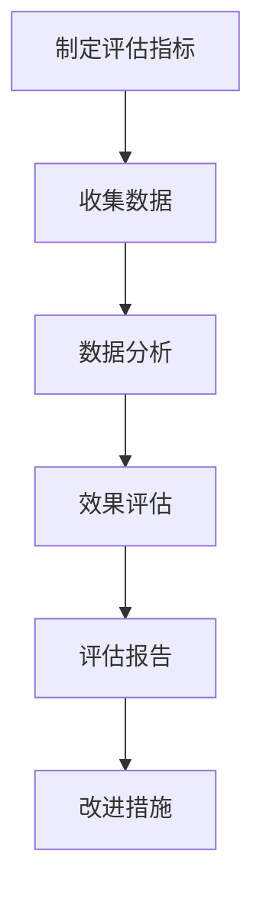

**实例分析**：

假设某企业实施了一项新的市场营销战略，以下是其实施效果评估的具体步骤：

- **制定评估指标**：确定关键绩效指标，如销售额增长率、客户满意度、市场占有率等。
- **收集数据**：从销售报表、客户反馈、市场调研报告中收集相关数据。
- **数据分析**：对收集的数据进行定量和定性分析，计算各项指标的完成情况。
- **效果评估**：召开评估会议，讨论评估结果，识别出战略实施中的问题和成功经验。
- **评估报告**：编写详细的评估报告，包括各项指标的数据分析、问题识别和改进建议。
- **改进措施**：根据评估结果，制定具体的改进计划，如优化广告投放策略、提升客户服务质量等。
- **实施与监控**：确保改进计划得到有效执行，并持续监控改进效果，定期评估改进措施的成效。

通过这样的实施效果评估，企业可以及时发现和解决问题，持续优化战略实施过程，提高整体竞争力。

### 7.3.2 调整策略制定

在实施效果评估完成后，根据评估结果，企业需要及时调整策略，以确保战略目标的实现。以下是调整策略制定的具体步骤和方法：

**1. 问题识别**：

- **评估结果分析**：对评估结果进行详细分析，识别出战略实施中存在的问题，如进度延误、成本超支、执行力不足等。
- **问题分类**：将识别出的问题进行分类，如技术问题、管理问题、市场问题等，便于制定针对性的解决方案。

**2. 原因分析**：

- **根本原因分析**：通过鱼骨图、5W1H等方法，深入分析每个问题的根本原因，确定问题的根源。
- **影响分析**：评估每个问题可能带来的影响，如成本增加、项目延误、市场竞争力下降等。

**3. 制定解决方案**：

- **方案设计**：根据问题识别和原因分析的结果，设计具体的解决方案，包括技术改进、管理优化、流程调整等。
- **优先级排序**：对解决方案进行优先级排序，确保优先解决影响最大、最紧迫的问题。

**4. 制定调整计划**：

- **目标设定**：为每个解决方案设定明确的调整目标，如缩短项目周期、降低成本、提升客户满意度等。
- **实施步骤**：制定详细的实施步骤，包括责任人、时间表、关键节点等。
- **资源分配**：确保调整计划所需的资源，包括人力、资金、技术等，进行合理分配。

**5. 风险评估**：

- **风险评估**：对调整计划进行风险评估，识别出可能的负面影响和风险，并制定相应的风险应对策略。
- **风险管理**：制定风险管理计划，降低调整过程中的风险，确保调整计划的顺利实施。

**6. 沟通与反馈**：

- **内部沟通**：将调整计划传达给项目团队和管理层，确保各方了解调整内容，形成共识。
- **反馈机制**：建立反馈机制，定期收集团队成员的意见和建议，及时调整和优化调整计划。

以下是一个简化的调整策略制定流程：

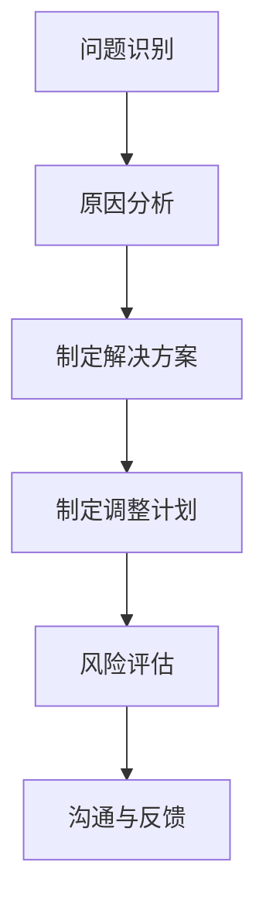

**实例分析**：

假设某企业在实施新市场战略过程中发现市场占有率未达到预期目标，以下是调整策略制定的具体步骤：

- **问题识别**：通过市场调研和销售数据分析，识别出市场推广策略效果不佳、竞争对手反应快等问题。
- **原因分析**：分析问题根源，如市场调研不充分、广告投放策略不当等。
- **制定解决方案**：设计具体的解决方案，如优化广告投放策略、加强市场调研、调整产品定价等。
- **制定调整计划**：设定明确的目标，如提高市场占有率、提升品牌知名度等，制定详细的实施步骤和时间表。
- **风险评估**：评估调整计划可能带来的风险，如市场变化、竞争对手反应等，制定相应的风险应对策略。
- **沟通与反馈**：将调整计划传达给管理层和项目团队，收集各方反馈，确保调整计划的有效实施。

通过这样的调整策略制定，企业可以及时纠正战略实施中的偏差，优化战略方案，提高实施效果，实现战略目标。

## 第8章 案例分析

#### 8.1 成功案例分析

在本节中，我们将深入分析一些企业在制定长期技术战略方面的成功案例，从中提取关键经验和教训，以期为其他企业提供借鉴。

**案例1：谷歌的技术战略**

**背景**：谷歌作为全球领先的技术公司，始终注重技术创新和长期技术战略的制定。其成功不仅源于卓越的产品和服务，还得益于持续的技术投资和前瞻性的战略规划。

**关键点**：

- **投资前沿技术**：谷歌在人工智能、机器学习、自动驾驶等领域进行了大量投资，保持了技术领先地位。通过收购初创公司，谷歌能够快速获取新技术和人才。

- **开放式创新**：谷歌通过开源项目（如Android、TensorFlow等），鼓励全球开发者共同参与创新，形成了强大的生态系统。

- **人才培养**：谷歌实施了一系列人才吸引和培养策略，包括提供丰富的培训机会、实施20%时间政策等，激发了员工的创新潜力。

**经验**：

- 投资前沿技术是企业保持竞争力的关键。
- 开放式创新能够加速技术创新和产品开发。
- 人才培养是持续创新的基石。

**教训**：

- 投资应注重长期回报，而非短期利润。
- 开源项目需确保技术质量和安全性。

**案例2：特斯拉的电动汽车战略**

**背景**：特斯拉通过其独特的电动汽车战略，成功颠覆了传统的汽车行业，成为全球电动汽车市场的领导者。

**关键点**：

- **技术创新**：特斯拉不断推出具有颠覆性的产品，如Model S、Model 3和Model X等，通过技术创新提高产品性能和用户体验。

- **产业链整合**：特斯拉通过自建电池工厂和超级充电站，实现了产业链的整合和优化，降低了生产成本。

- **品牌建设**：特斯拉通过强大的品牌建设和市场推广，树立了电动汽车的标杆形象。

**经验**：

- 技术创新是赢得市场竞争的关键。
- 整合产业链可以提高生产效率和降低成本。
- 强大的品牌建设有助于提升市场竞争力。

**教训**：

- 技术创新需保持持续性和前瞻性。
- 产业链整合面临较高的管理和运营风险。

#### 8.2 失败案例分析

在成功的背后，总有一些企业在技术战略制定和执行过程中遭遇失败。以下是我们分析的一些失败案例及其教训。

**案例1：诺基亚的移动技术战略**

**背景**：诺基亚曾是全球领先的移动通信设备制造商，但在智能手机时代的到来中，诺基亚未能及时调整其技术战略，最终被市场淘汰。

**关键点**：

- **技术保守**：诺基亚在智能手机领域的技术创新不足，未能及时采用新的操作系统和硬件架构。

- **市场反应迟缓**：诺基亚对市场变化的反应迟缓，未能抓住智能手机市场的机遇。

- **战略调整失误**：诺基亚在战略调整过程中，未能及时放弃传统的功能手机业务，错失了转型良机。

**教训**：

- 技术创新不足可能导致企业失去市场竞争力。
- 对市场变化的反应速度直接影响企业战略的成败。
- 战略调整需要果断和及时，避免错失转型机遇。

**案例2：柯达的数码相机战略**

**背景**：柯达曾是全球领先的胶片相机制造商，但在数码相机兴起的时代，柯达未能及时转型，最终破产。

**关键点**：

- **缺乏前瞻性**：柯达在数码相机技术发展的初期，未能认识到其潜在的市场机会。

- **业务依赖性**：柯达过度依赖胶片业务，缺乏对数码相机市场的投入和研发。

- **战略执行不力**：柯达在战略转型过程中，执行不力，未能迅速抢占市场先机。

**教训**：

- 企业需具备前瞻性，及时把握市场趋势。
- 避免对现有业务的过度依赖，积极开拓新市场。
- 战略执行需确保高效和有力，避免错失市场机会。

#### 8.3 案例启示

通过对成功和失败案例的分析，我们可以总结出以下启示：

**1. 技术创新至关重要**：无论是成功还是失败，技术创新都是企业保持市场竞争力的重要手段。企业应积极投资于前沿技术，保持技术领先地位。

**2. 市场反应速度决定成败**：及时响应市场变化是确保战略成功的关键。企业应建立灵活的战略规划和执行体系，快速调整战略方向。

**3. 人才培养是持续创新的基础**：优秀的人才是企业持续创新的基石。企业应注重人才培养和激励，激发员工的创新潜力。

**4. 风险管理不可或缺**：在技术战略的制定和执行过程中，风险管理至关重要。企业应提前识别和评估潜在风险，制定有效的应对策略。

**5. 持续优化是成功的关键**：成功的企业不仅要有前瞻性的战略规划，还要不断优化战略执行过程。通过定期评估和调整，确保战略的持续有效。

通过借鉴这些案例的经验和教训，企业可以更好地制定和执行长期技术战略，提高市场竞争力，实现可持续发展。## 参考文献

1. **Hammer, M., & Champy, J. (1993).** **Reengineering the Corporation: A Manifesto for Business Revolution**. Harper Business.

2. **Martin, J. (2016).** **Digital Transformation: surviving in the age of the customer**. John Wiley & Sons.

3. **Magretta, J. (2011).** **The New Competition: How to Innovate for Growth, Profit, and Self-Reliance**. Harvard Business Review Press.

4. **Pinilla, F., & O'Toole, J. (2017).** **Winning with Analytics: Transforming Decision Making and Performance Using Data**. John Wiley & Sons.

5. **HBR. (2016).** **The AI-Driven Organization**. Harvard Business Review.

6. **Westerman, G., Bonnet, D., & McAfee, A. (2014).** **Leading Digital: Turning Technology into Business Transformation**. Harvard Business Review Press.

7. **Mearian, L. (2018).** **CIOs: How to lead your organization through digital transformation**. Computerworld.

8. **Davenport, T. H. (1998).** **Knowledge Management: An Introduction and Perspective**. Knowledge Management Research & Practice.

9. **Marquet, R. A., & Heald, S. A. (2011).** **The Fundamental Principles of Lean Leadership**. Lean Enterprise Institute.

10. **Anders, E. (2016).** **It's Time to Rethink IT Strategy**. MIT Sloan Management Review.

11. **Rigby, D., Sutherland, J., & Costa, J. (2015).** **Blue Ocean Strategy: How to Create Uncontested Market Space and Make the Competition Irrelevant**. Harvard Business Review Press.

12. **Kotter, J. P. (2014).** **Winning the Future: Transforming Education, From Kindergarten to College**. Harvard Business Review Press.

13. **Nonaka, I., & Takeuchi, H. (1995).** **The knowledge-creating company: How Japanese companies create the dynamics of innovation**. Oxford University Press.

14. **Chesbrough, H. (2006).** **Open Business Models: How to Thrive in the New Innovation Landscape**. Harvard Business Press.

15. **Bock, G. (2015).** **Employee Engagement 2.0: How to Create Resilient Organizations Through Loyalty and Engagement**. McGraw Hill Education.

16. **Gandomi, A., & Hameed, S. (2014).** **Beyond the Hype: How Blockchain Can Revolutionize the Financial Services Industry**. International Journal of Financial Research.

17. **Johnson, G., & Dubois, D. (2016).** **Competitive strategy: techniques for analyzing industries and competitors**. McGraw-Hill Education.

18. **Kaplan, R. S., & Norton, D. P. (1996).** **The Balanced Scorecard: Translating Strategy into Action**. Harvard Business Review.

19. **Lacity, M. C., & Hiltz, S. R. (1998).** **Virtual teams around the world: A multi-country investigation**. Journal of Management Information Systems.

20. **Lacity, M. C., Willcocks, L. P., & Feeny, D. F. (2002).** **IT outsourcing: an evolving success story**. Information Systems Frontiers.

