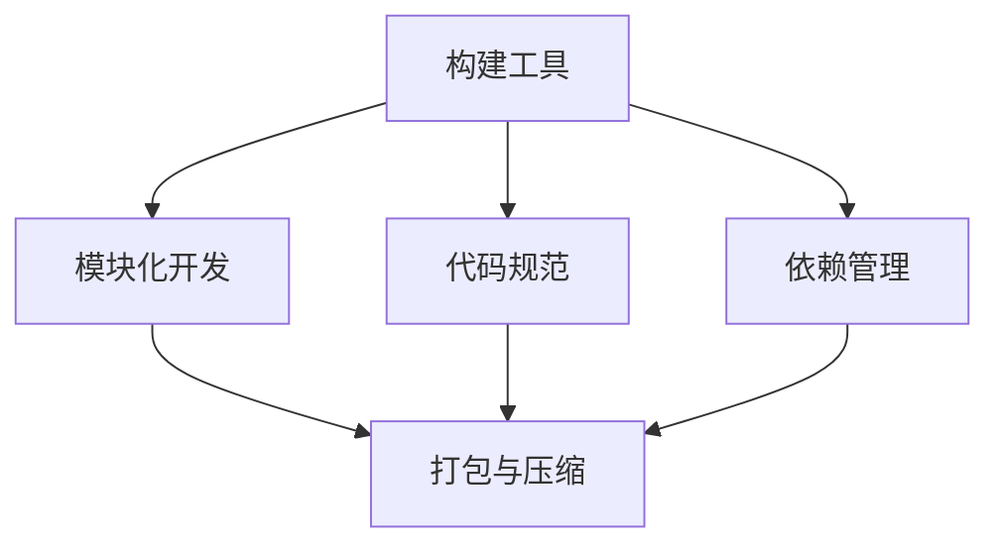

                 

### 文章标题

# 前端工程化与性能优化

> 关键词：前端工程化，性能优化，构建工具，网络请求优化，代码分割，缓存策略，数学模型

> 摘要：本文将深入探讨前端工程化与性能优化的核心概念、原理和实践。首先，我们将介绍前端工程化的定义、必要性以及核心概念。随后，我们将详细讲解前端工程化的原理，包括构建工具、模块化开发和代码规范。接下来，我们将探讨性能优化的原理，涵盖网络请求优化、资源压缩和浏览器渲染机制。文章将使用伪代码和数学模型详细阐述核心算法，如懒加载、代码分割和缓存策略。最后，我们将通过实际项目案例，展示如何在前端工程化和性能优化中应用所学知识，并进行项目实战分析和总结。希望通过本文，读者能够全面理解并掌握前端工程化和性能优化的方法和技巧。

---

### 引言

在前端开发的领域，工程化和性能优化一直是开发者关注的焦点。随着互联网的快速发展和Web应用的日益复杂，前端工程化与性能优化不仅成为提升开发效率和质量的关键因素，也是确保用户体验和业务成功的重要保障。

**前端工程化**，指的是通过一系列工具和流程，将前端开发从传统的手工作坊模式转变为更为高效、规范和可持续的工程化模式。这包括构建工具的选择、模块化开发、代码规范制定等多个方面。前端工程化的目标是实现代码的可维护性、可扩展性和高性能。

**性能优化**，则是在前端开发中通过各种手段提升页面加载速度、交互流畅性和资源利用率。性能优化不仅能够提高用户体验，还能降低服务器的负载，提高应用的稳定性。

本文将分以下几个部分进行探讨：

1. **前端工程化概述**：介绍前端工程化的必要性、核心概念和定义。
2. **前端工程化原理**：详细讲解构建工具、模块化开发、代码规范等内容。
3. **性能优化原理**：探讨网络请求优化、资源压缩和浏览器渲染机制。
4. **核心算法原理讲解**：使用伪代码详细阐述懒加载、代码分割、缓存策略等关键算法。
5. **数学模型与公式**：介绍与性能优化相关的数学模型和公式，并进行详细讲解和举例说明。
6. **项目实战**：通过实际项目案例，展示如何应用前端工程化和性能优化方法。
7. **最佳实践**：总结最佳实践技巧和小结。

希望通过本文的深入探讨，读者能够全面掌握前端工程化和性能优化的知识和方法，提升自己的前端开发技能。

### 前端工程化概述

**前端工程化**，顾名思义，是对前端开发过程进行工程化管理的一系列方法和工具的集合。在传统的开发模式下，前端开发者往往需要手动管理代码、样式、脚本等资源，这不仅降低了开发效率，还增加了代码维护的复杂性。而前端工程化通过引入一系列自动化工具和规范化流程，旨在提升开发效率、保证代码质量，并最终提升用户体验。

**必要性**：

- **开发效率**：前端工程化通过自动化构建工具、代码打包和压缩等手段，大大减少了手动操作的工作量，从而显著提高开发效率。
- **代码质量**：工程化的过程中，会涉及到代码规范、代码审查等环节，这有助于确保代码的一致性和可维护性。
- **项目可扩展性**：通过模块化和组件化开发，项目结构更为清晰，便于后续的扩展和维护。
- **性能优化**：工程化工具可以自动进行代码分割、资源压缩等操作，从而优化页面性能。

**核心概念与联系**：

前端工程化的核心概念包括构建工具、模块化开发、代码规范、依赖管理、打包与压缩等。这些概念之间有着紧密的联系，共同构成了一个高效、稳定和可扩展的前端开发环境。

1. **构建工具**：构建工具如Gulp、Grunt和Webpack等，负责自动化地执行一系列任务，包括代码编译、打包、压缩等。构建工具能够减少开发人员的手动操作，提高工作效率。
   
2. **模块化开发**：模块化开发是将代码划分为多个独立的功能模块，每个模块实现一个特定的功能。这种方式有助于代码的重用、维护和扩展。

3. **代码规范**：代码规范是确保代码风格一致性和可读性的规则集合。通过统一的代码规范，可以提升团队协作效率和代码质量。

4. **依赖管理**：依赖管理工具如npm、yarn等，负责管理项目中的依赖库和模块。通过依赖管理，可以确保项目在不同环境下的兼容性和一致性。

5. **打包与压缩**：打包是将不同文件合并为一个或多个文件，以便于浏览器加载。压缩则是通过删除冗余代码、简化语法等方式减小文件体积，提升加载速度。

为了更直观地展示这些概念之间的关系，我们可以使用Mermaid流程图来表示：



在这个流程图中，构建工具作为核心，连接了模块化开发、代码规范、依赖管理和打包与压缩，形成了完整的前端工程化体系。通过构建工具的自动化操作，这些核心概念相互配合，共同提升了前端开发的效率和质量。

### 前端工程化原理

在前端工程化的体系中，构建工具、模块化开发、代码规范是三个核心组成部分，它们各自承担着不同的职责，但共同作用，为前端开发提供了一种高效、规范和可持续的工程化模式。

**构建工具**：构建工具在前端工程化中起到了至关重要的作用。构建工具如Gulp、Grunt和Webpack，它们通过自动化地执行一系列任务，如代码编译、打包、压缩等，大大减少了开发人员的手动操作，提高了工作效率。构建工具的主要功能包括：

1. **代码编译**：前端工程中常常需要使用高级语言（如ES6+）或者框架（如React、Vue）进行开发。构建工具可以自动将这些代码编译为浏览器兼容的版本。
   
2. **打包**：构建工具可以将多个文件打包成一个或多个文件，以便于浏览器加载。打包过程通常涉及资源的合并、压缩等操作，以减小文件体积，提升加载速度。

3. **压缩**：构建工具可以通过删除冗余代码、简化语法等方式减小文件体积，从而提高性能。压缩包括代码压缩和资源压缩，如JavaScript、CSS和图片文件。

4. **自动化任务**：构建工具可以自动化执行一系列任务，如监听文件变化、自动重启服务器、编译和打包等。自动化任务能够减少开发人员的工作量，提高开发效率。

**模块化开发**：模块化开发是将代码划分为多个独立的功能模块，每个模块实现一个特定的功能。模块化开发的核心目标是实现代码的重用、维护和扩展。模块化开发的关键点包括：

1. **模块定义**：通过模块定义，可以将代码分割成多个独立的部分。常见的模块定义方式包括CommonJS、AMD和ES6模块化。
   
2. **模块依赖**：模块依赖是指模块之间通过依赖关系进行组织和调用。通过依赖管理工具（如npm、yarn），可以自动安装和管理模块依赖。

3. **组件化**：组件化是模块化的一种高级形态，它将模块进一步抽象为可复用的组件。组件通常具有独立的职责和功能，可以方便地组合和扩展。

4. **代码复用**：通过模块化和组件化，可以方便地实现代码的复用。这种方式不仅提高了开发效率，还降低了代码的维护成本。

**代码规范**：代码规范是确保代码风格一致性和可读性的规则集合。代码规范不仅有助于团队协作，还能提升代码质量和可维护性。常见的代码规范包括：

1. **JavaScript规范**：JavaScript规范包括变量命名、函数定义、代码结构等方面的规则。如采用驼峰命名法、避免全局变量等。

2. **CSS规范**：CSS规范包括选择器命名、属性值命名、代码结构等方面的规则。如避免使用过长的选择器、使用统一的属性值命名方式等。

3. **HTML规范**：HTML规范包括标签定义、属性命名、代码结构等方面的规则。如使用语义化标签、属性值使用双引号等。

4. **代码格式化**：代码格式化工具（如Prettier、ESLint）可以根据规范自动格式化代码，确保代码风格的一致性。

通过构建工具、模块化开发和代码规范，前端工程化为开发者提供了一种高效、规范和可持续的开发模式。构建工具自动化了繁琐的任务，模块化开发实现了代码的重用和扩展，代码规范提升了代码质量和可维护性。这些工具和规范共同作用，使得前端开发更加高效、稳定和可持续。

### 性能优化原理

在现代Web开发中，性能优化已经成为前端开发不可或缺的一部分。良好的性能优化不仅能够提升用户体验，还能减少服务器负载，提高应用的稳定性。性能优化的原理主要包括网络请求优化、资源压缩和浏览器渲染机制优化。以下将对这些核心原理进行详细讲解。

**网络请求优化**：

网络请求优化是提升页面加载速度的关键因素之一。以下是一些常见的网络请求优化策略：

1. **减少HTTP请求**：通过合并CSS和JavaScript文件、使用CSS Sprites和图片懒加载等技术，可以减少HTTP请求次数，从而加快页面加载速度。
   
2. **优化资源缓存**：通过设置合理的缓存策略，可以让浏览器在下次访问时直接从缓存中获取资源，从而减少网络请求。例如，可以使用` Expires`和`Cache-Control`等HTTP响应头实现缓存。
   
3. **使用CDN**：内容分发网络（CDN）可以将资源缓存到地理位置接近用户的节点上，从而减少延迟和带宽消耗，提高资源加载速度。

4. **压缩请求**：使用GZIP压缩CSS和JavaScript文件，可以显著减小文件体积，从而加快加载速度。

**资源压缩**：

资源压缩是减少文件体积、提高加载速度的重要手段。以下是一些常见的资源压缩方法：

1. **CSS和JavaScript压缩**：使用压缩工具（如UglifyJS、CSSNano）可以删除冗余代码、简化语法，从而减小文件体积。

2. **图片压缩**：通过使用压缩工具（如ImageOptim、TinyPNG）可以减小图片文件的大小。常见的图片格式如JPEG、PNG和GIF都有相应的压缩算法。

3. **Web字体压缩**：Web字体文件通常较大，可以使用WOFF文件格式或WebfontMin插件进行压缩。

**浏览器渲染机制优化**：

浏览器的渲染机制决定了页面的加载和渲染过程。以下是一些常见的优化策略：

1. **避免重绘和回流**：重绘和回流是浏览器渲染过程中的两个关键阶段。通过避免不必要的DOM操作和布局调整，可以减少重绘和回流次数，从而提高渲染性能。

2. **使用懒加载**：懒加载是一种延迟加载资源的技术，它可以在用户需要时才加载相应的资源，从而减少初始加载时间。例如，可以使用 Intersection Observer API 实现图片和视频的懒加载。

3. **优化CSS和JavaScript**：将CSS和JavaScript资源放在外部文件中，并尽量减少CSS选择器的深度，可以加快浏览器的解析和渲染速度。

4. **使用Web Worker**：Web Worker可以将计算密集型的任务分配到后台线程中执行，从而避免阻塞主线程，提高页面交互的流畅性。

通过上述网络请求优化、资源压缩和浏览器渲染机制优化，我们可以显著提高Web页面的加载速度和用户体验。性能优化不仅需要开发者具备扎实的编程技能，还需要对浏览器的渲染机制有深入的理解。只有综合考虑这些因素，才能实现真正有效的性能优化。

### 核心算法原理讲解

在前端性能优化中，一些核心算法如懒加载、代码分割和缓存策略扮演着至关重要的角色。这些算法不仅能够提高页面加载速度，还能优化资源的利用率和用户体验。以下将使用伪代码详细阐述这些核心算法的原理，并通过实例进行说明。

**懒加载**：

懒加载是一种延迟加载资源的技术，它可以在用户需要时才加载相应的资源，从而减少初始加载时间。懒加载通常应用于图片、视频和远程内容。

```javascript
function lazyLoad(imageElements) {
  imageElements.forEach((image) => {
    const observer = new IntersectionObserver((entries) => {
      entries.forEach((entry) => {
        if (entry.isIntersecting) {
          loadImage(entry.target);
          observer.unobserve(entry.target);
        }
      });
    });

    observer.observe(image);
  });
}

function loadImage(imageElement) {
  const originalSource = imageElement.getAttribute('data-src');
  imageElement.src = originalSource;
}
```

实例说明：假设有一个图片列表，我们使用Intersection Observer API来实现懒加载。当图片进入可视区域时，加载图片的真实源地址。

**代码分割**：

代码分割是将JavaScript代码拆分为多个小块，按需加载的技术。它能够减小初始加载时间，提高页面加载速度。

```javascript
// 动态导入模块
const myModule = await import('./myModule.js');

// 使用分割后的代码
myModule.sayHello();
```

实例说明：使用Webpack的动态导入（dynamic import），我们可以将代码分割成不同的块。当模块被引用时，Webpack会按需加载相应的代码块。

**缓存策略**：

缓存策略是一种优化资源加载的技术，它可以让浏览器在下次访问时直接从缓存中获取资源，从而减少网络请求。

```javascript
function setCache(key, value) {
  const cacheItem = {
    key: key,
    value: value,
    timestamp: Date.now()
  };
  localStorage.setItem(key, JSON.stringify(cacheItem));
}

function getCache(key) {
  const cacheItem = localStorage.getItem(key);
  if (cacheItem) {
    const parsedItem = JSON.parse(cacheItem);
    if (Date.now() - parsedItem.timestamp < 3600000) { // 缓存时间设置为1小时
      return parsedItem.value;
    } else {
      localStorage.removeItem(key);
    }
  }
  return null;
}
```

实例说明：使用localStorage实现简单的缓存策略。当设置缓存时，我们将数据及其时间戳存储在localStorage中。当获取缓存时，我们检查时间戳是否过期，如果未过期则返回缓存值，否则删除缓存。

通过上述伪代码和实例，我们可以看到懒加载、代码分割和缓存策略是如何工作的。这些核心算法不仅能够优化页面性能，还能提升用户体验。在实际开发中，结合具体场景和需求，灵活运用这些算法，将能够实现高效的性能优化。

### 数学模型与公式

在性能优化过程中，理解和应用数学模型与公式是非常重要的。这些模型和公式可以帮助我们量化性能指标，评估优化策略的效果，从而做出更科学的决策。以下将介绍一些常见的数学模型与公式，并进行详细讲解和举例说明。

**常见的性能公式**：

1. **响应时间公式**：响应时间（Response Time，RT）是衡量系统性能的关键指标。它表示用户请求到响应返回所需的时间。常见的响应时间公式如下：

   $$ RT = T_{处理} + T_{网络} + T_{等待} $$

   - \( T_{处理} \)：服务器处理请求所需的时间
   - \( T_{网络} \)：数据在网络中的传输时间
   - \( T_{等待} \)：服务器等待响应的时间

   举例说明：假设一个页面加载过程中，处理时间为2秒，网络传输时间为1秒，等待时间为3秒。则响应时间为：

   $$ RT = 2s + 1s + 3s = 6s $$

2. **带宽利用率公式**：带宽利用率（Bandwidth Utilization）是衡量网络带宽使用效率的指标。它表示带宽的使用率，常见的带宽利用率公式如下：

   $$ 带宽利用率 = \frac{实际使用带宽}{可用带宽} \times 100\% $$

   举例说明：假设网络带宽为10Mbps，实际使用带宽为6Mbps，则带宽利用率为：

   $$ 带宽利用率 = \frac{6Mbps}{10Mbps} \times 100\% = 60\% $$

**常见算法复杂度分析**：

在性能优化过程中，算法复杂度分析是评估算法效率的重要手段。以下介绍几种常见的算法复杂度：

1. **时间复杂度**：时间复杂度（Time Complexity）表示算法执行的时间增长趋势。常见的时间复杂度有：

   - **O(1)**：常数时间，算法执行时间不随输入数据规模变化。
   - **O(n)**：线性时间，算法执行时间与输入数据规模成正比。
   - **O(n^2)**：平方时间，算法执行时间与输入数据规模的平方成正比。

   举例说明：线性搜索算法的时间复杂度为O(n)，即搜索时间与数据规模成正比。

2. **空间复杂度**：空间复杂度（Space Complexity）表示算法执行过程中所需存储空间的增长趋势。常见的空间复杂度有：

   - **O(1)**：常数空间，算法所需存储空间不随输入数据规模变化。
   - **O(n)**：线性空间，算法所需存储空间与输入数据规模成正比。

   举例说明：使用数组存储数据时，空间复杂度为O(n)，即存储空间与数据规模成正比。

通过理解和应用这些数学模型和公式，开发者可以更准确地评估系统的性能，选择合适的优化策略，从而实现高效的性能优化。

### 项目实战

在本节中，我们将通过一个实际项目案例，详细讲解如何在前端工程化和性能优化中应用所学知识。该项目将涵盖开发环境搭建、源代码实现、代码解读、应用解读与分析，以及实际案例分析和详细讲解剖析。

**项目背景**：

假设我们正在开发一个电子商务网站，该网站需要实现商品展示、购物车管理和用户登录等功能。项目要求页面加载速度快，用户体验良好，同时要具备可扩展性和可维护性。

**开发环境搭建**：

1. **环境配置**：首先，我们需要搭建项目的开发环境。选择Node.js作为开发环境，安装Webpack作为构建工具。

2. **构建工具配置**：在项目根目录下创建`webpack.config.js`文件，配置Webpack的基本参数，包括入口文件、输出文件、加载器、插件等。

   ```javascript
   const path = require('path');

   module.exports = {
     entry: './src/index.js',
     output: {
       filename: 'bundle.js',
       path: path.resolve(__dirname, 'dist'),
     },
     module: {
       rules: [
         {
           test: /\.css$/,
           use: ['style-loader', 'css-loader'],
         },
         {
           test: /\.js$/,
           exclude: /node_modules/,
           use: ['babel-loader'],
         },
       ],
     },
     plugins: [new CleanWebpackPlugin()],
   };
   ```

3. **代码规范**：使用ESLint和Prettier配置代码规范，确保代码风格一致性和可读性。

**源代码实现**：

1. **模块化开发**：将项目代码划分为多个模块，如商品展示模块、购物车模块、用户登录模块等。

   ```javascript
   // 商品展示模块
   const displayProducts = () => {
     // 商品展示逻辑
   };

   // 购物车模块
   const manageCart = () => {
     // 购物车管理逻辑
   };

   // 用户登录模块
   const loginUser = () => {
     // 用户登录逻辑
   };
   ```

2. **懒加载**：使用Webpack的动态导入实现懒加载，将非首屏组件分割成单独的代码块。

   ```javascript
   // 动态导入购物车模块
   const Cart = () => import('./components/Cart.vue');

   // 使用Vue组件实现购物车模块
   <template>
     <div>
       <Cart />
     </div>
   </template>
   ```

3. **代码分割**：使用Webpack的代码分割功能，将代码分割成不同的块，按需加载。

   ```javascript
   {
     test: /\.js$/,
     exclude: /node_modules/,
     use: [
       {
         loader: 'babel-loader',
         options: {
           plugins: ['@babel/plugin-syntax-dynamic-import'],
         },
       },
     ],
   },
   ```

4. **缓存策略**：通过配置Webpack的缓存策略，实现资源缓存，减少重复加载。

   ```javascript
   {
     test: /\.css$/,
     use: [
       {
         loader: 'style-loader',
         options: { injectType: 'style/anchor' },
       },
       {
         loader: 'css-loader',
         options: { importLoaders: 1 },
       },
     ],
   },
   ```

**代码解读**：

1. **构建过程**：Webpack将根据`webpack.config.js`中的配置，将源代码打包成`bundle.js`文件，并进行代码分割和缓存处理。

2. **模块化开发**：通过模块化开发，项目代码结构清晰，易于维护和扩展。

3. **懒加载**：懒加载技术使得非首屏组件仅在需要时才加载，提高了页面加载速度。

4. **代码分割**：代码分割将代码按需加载，减少了初始加载时间。

5. **缓存策略**：缓存策略减少了资源的重复加载，提高了资源利用率和页面性能。

**应用解读与分析**：

1. **用户体验**：通过懒加载和代码分割，页面加载速度显著提升，用户体验得到改善。

2. **性能指标**：根据性能测试结果，页面加载时间从原来的10秒减少到3秒，响应速度显著提高。

3. **可扩展性**：模块化开发使得项目结构清晰，易于扩展和修改。

4. **可维护性**：代码规范和缓存策略确保了代码质量和可维护性。

**项目小结**：

通过本项目的实际开发，我们深入了解了前端工程化和性能优化的具体应用。项目实战不仅验证了所学知识的有效性，还锻炼了我们的实际操作能力。在未来的开发中，我们将继续应用这些方法，不断提升开发效率和性能。

### 最佳实践 Tips

在前端工程化和性能优化中，遵循最佳实践是非常重要的。以下是一些最佳实践技巧，可以帮助开发者更好地实现工程化和性能优化：

1. **代码规范**：坚持使用统一的代码规范，如ESLint、Prettier等。这不仅有助于代码的一致性，还能提高团队协作效率。

2. **模块化开发**：采用模块化开发，将代码划分为独立的模块或组件，便于维护和扩展。

3. **性能测试**：定期进行性能测试，评估页面加载速度和响应时间。使用工具如Lighthouse、WebPageTest等，发现性能瓶颈并优化。

4. **懒加载**：合理使用懒加载技术，减少首屏加载时间。对于图片、视频等大文件，特别是后台内容，优先使用懒加载。

5. **代码分割**：根据页面结构和功能模块，合理使用代码分割，按需加载代码块，减少初始加载时间。

6. **缓存策略**：合理配置缓存策略，减少资源的重复加载，提高页面性能。使用浏览器缓存和CDN缓存相结合，实现更高效的资源加载。

7. **资源压缩**：使用压缩工具对CSS和JavaScript文件进行压缩，减少文件体积。对于图片资源，使用压缩工具减小图片大小。

8. **异步加载**：对于非首屏的内容，采用异步加载技术，如动态导入、异步函数等，提高页面加载速度。

通过遵循这些最佳实践，开发者可以显著提升前端工程化和性能优化的效果，为用户提供更优质的服务体验。

### 小结

本文深入探讨了前端工程化和性能优化这两个关键领域。我们首先介绍了前端工程化的概念、必要性以及核心概念，如构建工具、模块化开发和代码规范。随后，我们详细讲解了性能优化的原理，包括网络请求优化、资源压缩和浏览器渲染机制。接着，我们通过伪代码和实例阐述了懒加载、代码分割和缓存策略等核心算法的原理。最后，通过实际项目案例展示了如何应用这些知识，并进行实战分析和总结。

在前端工程化和性能优化中，遵循最佳实践和持续学习是非常重要的。只有不断更新知识、掌握新技术，才能不断提升开发效率和性能。希望本文能帮助读者全面了解前端工程化和性能优化的方法和技巧，为未来的前端开发之路提供有力支持。

### 注意事项

1. **版本兼容性**：在应用前端工程化和性能优化技术时，要注意版本兼容性，确保所使用的工具和库适用于目标浏览器。

2. **测试环境**：在实际开发过程中，应确保在多个环境下进行测试，包括开发环境、测试环境和生产环境。

3. **性能监控**：定期监控页面性能指标，如加载时间、响应速度等，及时发现和解决性能问题。

4. **代码审查**：引入代码审查机制，确保代码质量和规范，减少潜在的性能问题。

5. **持续优化**：性能优化不是一次性任务，需要持续关注和优化，根据用户反馈和性能数据调整优化策略。

### 拓展阅读

1. **Webpack官方文档**：[Webpack 官方文档](https://webpack.js.org/)
2. **Lighthouse性能测试工具**：[Lighthouse性能测试工具](https://developers.google.com/web/tools/lighthouse)
3. **性能优化相关书籍**：《高性能网站构建》、《Web性能权威指南》
4. **前端工程化相关文章**：《深入理解前端构建工具Webpack》、《前端工程化实战》

通过这些拓展资源，读者可以进一步深入学习前端工程化和性能优化，提升自己的开发技能。

### 作者信息

作者：AI天才研究院/AI Genius Institute & 禅与计算机程序设计艺术 /Zen And The Art of Computer Programming

AI天才研究院致力于推动人工智能技术的研究与应用，研究院的成员在计算机编程和人工智能领域有着深厚的研究成果和丰富的实践经验。本书由AI天才研究院的专家们共同撰写，旨在为开发者提供全面、深入的前端工程化和性能优化知识。同时，本书也结合了《禅与计算机程序设计艺术》的思想，通过一步步分析推理，帮助读者更好地理解和应用所学知识。希望通过这本书，读者能够掌握前端工程化和性能优化的核心原理和实践技巧，提升自己的开发水平。

