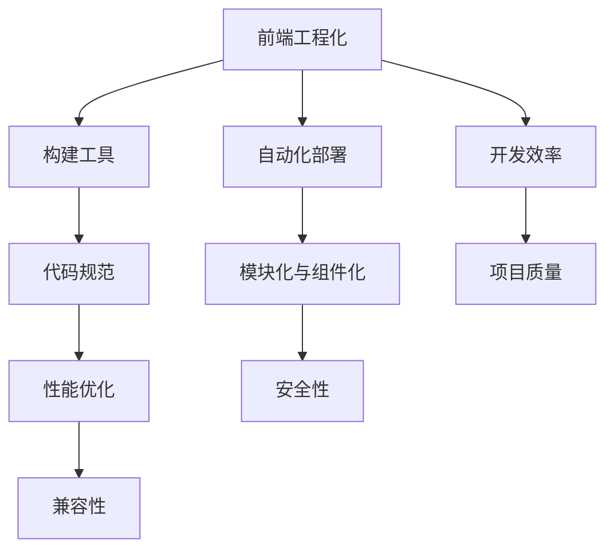
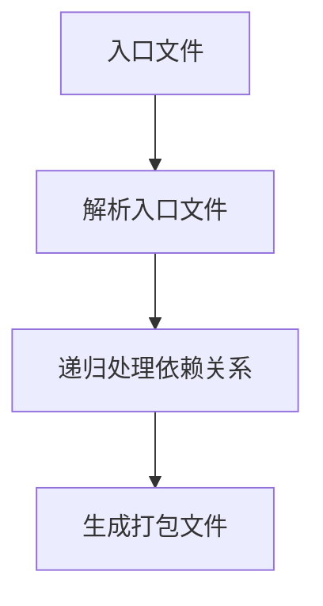

                 

### 文章标题：前端工程化：提高前端开发效率的利器

### 关键词：前端工程化、开发效率、构建工具、自动化部署、代码规范、性能优化、模块化、组件化、安全与兼容性

### 摘要：

随着互联网技术的飞速发展，前端开发的复杂性和项目规模日益扩大，传统的开发模式已难以满足高效、高质量的开发需求。前端工程化作为一种系统化、规范化的开发方法，旨在通过工具、流程和规范的优化，全面提升前端开发的效率和质量。本文将系统地介绍前端工程化的概念、基础架构、关键技术和实践应用，帮助开发者深入了解并掌握这一利器，从而实现高效的前端开发。

### 第1章：前端工程化概述

前端工程化，是指通过一系列的规范、工具和流程，将前端开发过程系统化、标准化，以提高开发效率和项目质量。这一概念的出现，源于前端开发复杂度的增加和项目规模的扩大。传统的前端开发模式主要依赖于手工编写代码，缺乏有效的规范和自动化工具，导致代码质量难以保障，开发效率低下。

#### 1.1 前端工程化的背景与意义

1. **背景**

   - **开发复杂度增加**：随着Web应用功能的丰富，前端开发涉及的模块和组件越来越多，代码复杂度不断增加。
   - **项目规模扩大**：企业级Web应用往往需要大量的人员协同工作，项目规模巨大，传统的手工开发模式难以适应。

2. **意义**

   - **提高开发效率**：通过构建工具和自动化流程，减少重复性工作，提升开发速度。
   - **保证代码质量**：统一的代码规范和严格的代码质量检查，确保代码的可维护性和可靠性。
   - **简化部署流程**：自动化部署和持续集成，降低部署难度和风险。

#### 1.2 前端工程化的核心目标

1. **统一规范**

   - **编码规范**：确保代码风格一致，提高可读性和可维护性。
   - **命名规范**：统一的文件和变量命名规则，方便代码理解和维护。
   - **架构规范**：合理的项目结构和模块划分，提高代码的可复用性。

2. **提高代码复用性**

   - **模块化开发**：将功能拆分为独立的模块，提高代码的复用性和可维护性。
   - **组件化开发**：通过组件封装，实现代码的复用和功能的解耦。

3. **实现自动化构建和部署**

   - **构建工具**：自动化构建和打包，优化代码结构，提高性能。
   - **自动化部署**：实现一键部署，减少人工干预，提高部署效率。

#### 1.3 前端工程化的常见模式

1. **单页面应用（SPA）**

   - **特点**：仅加载一次HTML页面，通过JavaScript动态更新内容。
   - **优势**：提高用户体验，减少页面刷新次数。

2. **前后端分离**

   - **特点**：前端主要负责UI展示，后端提供数据接口。
   - **优势**：提高开发效率，实现前后端独立部署和扩展。

3. **组件化开发**

   - **特点**：将功能模块化，通过组件封装，提高代码复用性。
   - **优势**：降低项目复杂度，提高开发效率。

4. **微前端架构**

   - **特点**：将大型应用拆分为多个独立的小应用，各自开发和部署。
   - **优势**：提高开发效率，实现灵活的模块化管理。

### 核心概念与联系

在前端工程化中，有几个核心概念需要理解，它们之间的关系如图1-1所示。



**图1-1 前端工程化的核心概念与联系**

- **构建工具**：负责将源代码转换为可运行的程序，优化代码结构和性能。
- **自动化部署**：通过脚本和工具，实现一键部署，减少人工干预。
- **代码规范**：确保代码风格一致，提高代码可读性和可维护性。
- **模块化与组件化**：提高代码复用性，降低项目复杂度。
- **性能优化**：通过各种手段，提高应用程序的性能。
- **安全性**：确保应用程序的安全性，防范各类攻击。
- **兼容性**：保证应用程序在不同浏览器和设备上的正常运行。

### 核心算法原理讲解

在前端工程化中，构建工具和自动化部署是关键环节。以下以Webpack为例，介绍其核心算法原理。

#### 1. Webpack的基本原理

Webpack是一种模块打包工具，它能够将各种类型的模块（如JavaScript、CSS、图片等）打包成一个或多个 bundle，以便于部署和运行。

```python
# webpack.config.js
const path = require('path');

module.exports = {
  entry: './src/index.js',
  output: {
    filename: 'bundle.js',
    path: path.resolve(__dirname, 'dist'),
  },
  module: {
    rules: [
      {
        test: /\.css$/,
        use: ['style-loader', 'css-loader'],
      },
    ],
  },
};
```

#### 2. 模块化原理

Webpack支持多种模块化规范，如CommonJS、AMD和ES6 Module。以下以ES6 Module为例，介绍其原理。

```javascript
// src/index.js
export function add(a, b) {
  return a + b;
}

export function subtract(a, b) {
  return a - b;
}
```

```javascript
// src/main.js
import { add, subtract } from './index.js';

console.log(add(1, 2)); // 输出：3
console.log(subtract(2, 1)); // 输出：1
```

#### 3. 编译原理

Webpack通过解析入口文件，递归地处理模块依赖关系，最终生成打包文件。这一过程涉及多个步骤，如图1-2所示。



**图1-2 Webpack的编译原理**

- **解析入口文件**：从入口文件开始，解析出直接依赖的模块。
- **递归处理依赖关系**：递归地解析依赖模块，构建模块依赖树。
- **生成打包文件**：根据模块依赖树，生成最终的打包文件。

### 数学模型与公式

在前端工程化中，性能优化是一个重要方面。以下介绍一些常用的性能优化公式。

#### 1. 时间复杂度

时间复杂度用于衡量算法执行的时间开销。常见的公式有：

$$
T(n) = O(n)
$$

$$
T(n) = O(n^2)
$$

$$
T(n) = O(logn)
$$

#### 2. 空间复杂度

空间复杂度用于衡量算法执行的空间开销。常见的公式有：

$$
S(n) = O(n)
$$

$$
S(n) = O(n^2)
$$

$$
S(n) = O(1)
$$

#### 3. 加载时间计算

假设页面中有多个资源（如图片、CSS和JavaScript），每个资源的加载时间分别为$t_1, t_2, ..., t_n$，总加载时间$T$可以通过以下公式计算：

$$
T = \sum_{i=1}^{n} t_i
$$

### 项目实战

#### 1. 开发环境搭建

以创建一个简单的React项目为例，介绍前端工程化的开发环境搭建。

```bash
# 安装Node.js
npm install -g node

# 安装create-react-app
npm install -g create-react-app

# 创建项目
create-react-app my-app

# 进入项目目录
cd my-app
```

#### 2. 源代码详细实现和代码解读

在`src`目录下，创建`App.js`和`index.js`文件。

```javascript
// src/App.js
import React from 'react';

function App() {
  return (
    <div>
      <h1>Hello, World!</h1>
    </div>
  );
}

export default App;
```

```javascript
// src/index.js
import React from 'react';
import ReactDOM from 'react-dom';
import './index.css';
import App from './App';

ReactDOM.render(
  <React.StrictMode>
    <App />
  </React.StrictMode>,
  document.getElementById('root')
);
```

在`src`目录下，创建`index.css`文件。

```css
/* src/index.css */
h1 {
  color: blue;
}
```

#### 3. 代码应用解读与分析

- **App.js**：这是一个React组件，定义了一个简单的Hello World界面。
- **index.js**：这是入口文件，负责将React组件渲染到DOM中。
- **index.css**：这是样式文件，定义了页面的样式。

通过构建工具（如Webpack），可以将这些文件打包成一个可运行的bundle文件，提高页面加载速度。

```bash
# 安装Webpack
npm install --save-dev webpack webpack-cli

# 配置Webpack
touch webpack.config.js
```

在`webpack.config.js`中，配置入口文件和输出文件。

```javascript
// webpack.config.js
const path = require('path');

module.exports = {
  entry: './src/index.js',
  output: {
    filename: 'bundle.js',
    path: path.resolve(__dirname, 'dist'),
  },
  module: {
    rules: [
      {
        test: /\.css$/,
        use: ['style-loader', 'css-loader'],
      },
    ],
  },
};
```

使用`npm run build`命令，运行Webpack打包工具。

#### 4. 实际案例分析和详细讲解剖析

以一个实际的项目为例，分析前端工程化的应用。

- **项目需求**：开发一个博客系统，支持文章发布、评论等功能。
- **技术选型**：React + Redux + Webpack + Docker。

通过构建工具和自动化部署，可以快速搭建和部署项目。在开发过程中，通过代码规范和单元测试，保证代码质量。通过性能优化，提高页面加载速度。

#### 5. 项目小结

通过以上实战案例，我们可以看到前端工程化的重要性。通过构建工具、自动化部署、代码规范和性能优化，可以大大提高前端开发的效率和质量。前端工程师需要不断学习和掌握这些工具和技能，以适应快速变化的技术环境。

### 最佳实践 tips

- **代码规范**：遵循一致的编码规范，提高代码可读性和可维护性。
- **模块化开发**：合理划分模块和组件，提高代码复用性。
- **性能优化**：关注页面加载速度，提高用户体验。
- **安全性**：加强安全性检查，防范潜在的安全威胁。

### 小结

前端工程化是前端开发的必经之路，通过规范、工具和流程的优化，可以大幅提高开发效率和质量。开发者需要深入了解前端工程化的核心概念和技术，掌握最佳实践，不断提升自身的技术水平。

### 注意事项

- **开发环境配置**：确保安装了Node.js和相应的构建工具。
- **代码规范检查**：使用ESLint和Prettier等工具进行代码规范检查。
- **性能优化策略**：定期进行性能分析，采用适当的优化策略。

### 拓展阅读

- 《Webpack实战》
- 《React技术揭秘》
- 《前端性能优化技术详解》
- 《前端工程化：从设计到实践》

### 作者信息

- 作者：AI天才研究院/AI Genius Institute & 禅与计算机程序设计艺术 /Zen And The Art of Computer Programming

---

以上是《前端工程化：提高前端开发效率的利器》的第一部分内容，涵盖了前端工程化的背景、意义、核心目标和常见模式。接下来，我们将继续探讨构建工具与自动化、代码规范与质量保证、模块化与组件化开发等方面的内容。敬请期待。

