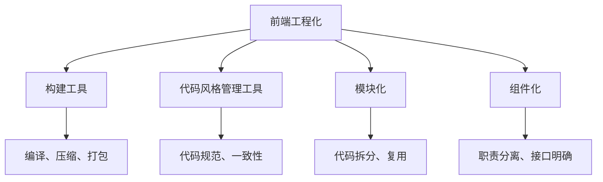

                 

### 背景介绍

#### 前端开发的挑战

随着互联网技术的飞速发展，前端开发逐渐成为软件工程的重要组成部分。然而，前端开发的复杂性也在不断增长，这给开发人员带来了诸多挑战。首先，前端开发涉及多种技术，包括HTML、CSS、JavaScript等，这些技术的不断更新迭代使得开发者需要不断学习新知识。其次，前端项目通常需要处理大量的静态资源，如图片、样式表和脚本文件，这些资源的管理和优化成为一个难题。再者，前端开发团队往往规模较小，开发人员需要承担多种职责，导致工作效率低下。最后，随着前端应用的规模不断扩大，项目的可维护性和可扩展性成为开发人员关注的重点。

#### 前端工程化的需求

为了解决上述挑战，前端工程化应运而生。前端工程化是指通过一系列工具和方法，对前端项目进行规范化、模块化、自动化等处理，从而提高开发效率、提升项目质量。前端工程化的目标包括但不限于以下几个方面：

1. **提高开发效率**：通过自动化构建、代码规范化等工具，减少重复性工作，加快开发进度。
2. **提升代码质量**：通过代码风格管理、代码规范等手段，保证代码的一致性和可读性。
3. **优化资源管理**：通过资源压缩、懒加载等手段，提高资源加载速度，提升用户体验。
4. **增强项目可维护性**：通过模块化、组件化等技术，降低项目复杂度，提高项目的可维护性和可扩展性。

本文将深入探讨前端工程化的核心概念、工具方法、实践案例和未来展望，帮助开发者更好地理解前端工程化的原理和实践，提高前端开发效率。

---

### 核心概念与联系

#### 工程化的定义与作用

前端工程化（Front-End Engineering）是指运用一系列工具和方法，对前端项目进行规范化、模块化、自动化等处理，以提高开发效率、提升代码质量和优化资源管理。简单来说，前端工程化就是将前端开发中的重复性工作和复杂操作自动化，从而解放开发人员，让他们专注于核心功能的实现。

工程化的作用主要体现在以下几个方面：

1. **提高开发效率**：通过自动化构建工具，如Webpack、Gulp等，开发者可以无需手动编译、压缩和打包资源，大大加快开发进度。
2. **提升代码质量**：通过代码风格管理工具，如ESLint、Prettier等，开发者可以确保代码风格一致、语法正确，减少潜在的错误。
3. **优化资源管理**：通过资源压缩、懒加载等技术，减少资源文件的体积，加快页面加载速度，提升用户体验。
4. **增强项目可维护性**：通过模块化和组件化，降低项目复杂度，便于维护和扩展。

#### 工程化的核心概念

前端工程化的核心概念包括：

1. **构建工具**：构建工具如Webpack、Gulp等，负责将源代码转换为生产环境可用的格式。它们可以自动处理编译、压缩、打包等任务，提高开发效率。
2. **代码风格管理工具**：代码风格管理工具如ESLint、Prettier等，用于规范代码风格，确保代码一致性和可读性。
3. **模块化**：模块化是将代码拆分成多个独立的模块，每个模块实现特定功能，便于复用和维护。
4. **组件化**：组件化是在模块化的基础上，进一步将代码拆分成可复用的组件，每个组件具有明确的职责和接口，便于开发、测试和维护。

#### 核心概念之间的关系架构

为了更好地理解前端工程化的核心概念及其关系，我们可以使用Mermaid绘制一个简单的流程图：



在上述流程图中，前端工程化（A）作为总体概念，向下延伸出构建工具（B）、代码风格管理工具（C）、模块化（D）和组件化（E）等子概念。构建工具（B）负责编译、压缩和打包，代码风格管理工具（C）负责规范代码风格，模块化（D）和组件化（E）分别负责代码的拆分和职责分离。

通过这个流程图，我们可以清晰地看到前端工程化的各个核心概念及其之间的联系，从而更好地理解前端工程化的原理和实践。

---

### 核心算法原理讲解

#### 编译原理

编译是指将一种编程语言（源语言）转换成另一种编程语言（目标语言）的过程。在前端工程化中，编译通常指的是将JavaScript代码转换为浏览器可以直接运行的格式。以下是一个简单的JavaScript编译原理的伪代码示例：

```pseudo
function compileJavaScript(sourceCode) {
    // 初始化编译器
    compiler = new JavaScriptCompiler();

    // 转换为抽象语法树（AST）
    ast = compiler.parse(sourceCode);

    // 优化AST
    optimizedAst = optimizeAST(ast);

    // 转换为目标代码
    targetCode = compiler.generateCode(optimizedAst);

    // 返回编译后的代码
    return targetCode;
}
```

上述伪代码描述了编译的基本流程，包括解析源代码、生成抽象语法树（AST）、优化AST和生成目标代码。在实际应用中，Webpack等构建工具会包含复杂的编译优化算法，以提升编译效率和生成更高效的目标代码。

#### 压缩原理

压缩是指通过减少代码的体积，提高资源加载速度的过程。前端工程化中，常见的压缩方法包括：

1. **代码压缩**：通过删除代码中的空白字符、注释和冗余代码，减少代码体积。
2. **资源压缩**：通过压缩图片、视频和音频文件，减少资源文件的体积。

以下是一个简单的代码压缩伪代码示例：

```pseudo
function compressCode(sourceCode) {
    // 删除空白字符和注释
    compressedCode = removeWhitespaceAndComments(sourceCode);

    // 去除重复代码
    compressedCode = removeDuplicates(compressedCode);

    // 返回压缩后的代码
    return compressedCode;
}
```

在实际应用中，Webpack等构建工具会结合多种压缩算法，以最大程度地减少代码体积。

#### 打包原理

打包是指将多个文件（如JavaScript、CSS、HTML等）合并成一个或多个文件的过程，以便于浏览器加载。以下是一个简单的打包原理伪代码示例：

```pseudo
function bundleFiles(files) {
    // 初始化打包器
    bundler = new Bundler();

    // 读取文件内容
    fileContents = bundler.readFileContents(files);

    // 打包文件
    bundledFile = bundler捆绑文件（fileContents);

    // 返回打包后的文件
    return bundledFile;
}
```

在实际应用中，Webpack等构建工具会根据配置文件，将多个文件打包成一个或多个bundle文件，以便于浏览器加载。

#### 懒加载原理

懒加载（Lazy Loading）是指仅在需要时加载资源，以减少初始加载时间，提高用户体验。以下是一个简单的懒加载原理伪代码示例：

```pseudo
function lazyLoadResource(url) {
    // 创建script元素
    script = document.createElement('script');

    // 设置script元素的src属性
    script.src = url;

    // 添加script元素到DOM中
    document.head.appendChild(script);

    // 当script加载完成后执行回调函数
    script.addEventListener('load', function() {
        // 回调函数
        console.log('Resource loaded:', url);
    });

    // 返回script元素
    return script;
}
```

在实际应用中，懒加载可以通过Webpack等构建工具的插件实现，也可以通过JavaScript库（如LazyLoad.js）实现。

#### 代码分割原理

代码分割（Code Splitting）是指将一个大型的JavaScript文件分割成多个小块，按需加载，以减少初始加载时间和提高加载性能。以下是一个简单的代码分割原理伪代码示例：

```pseudo
function splitCode(code) {
    // 分析代码，找出可分割的部分
    chunks = analyzeCode(code);

    // 创建分割后的代码
    splitCode = createSplitCode(chunks);

    // 返回分割后的代码
    return splitCode;
}
```

在实际应用中，Webpack等构建工具会根据配置文件和入口文件，自动进行代码分割。

#### 模块化原理

模块化是指将代码拆分成多个独立的模块，每个模块实现特定功能，便于复用和维护。以下是一个简单的模块化原理伪代码示例：

```pseudo
// 模块A
module A {
    export function a() {
        // 功能A实现
    }
}

// 模块B
module B {
    export function b() {
        // 功能B实现
    }
}
```

在实际应用中，常见的模块化规范包括CommonJS、AMD、ES6 Modules等。

#### 组件化原理

组件化是指将代码进一步拆分成可复用的组件，每个组件具有明确的职责和接口，便于开发、测试和维护。以下是一个简单的组件化原理伪代码示例：

```pseudo
// 组件A
class ComponentA {
    constructor() {
        // 构造函数
    }

    method a() {
        // 功能A实现
    }
}

// 组件B
class ComponentB {
    constructor() {
        // 构造函数
    }

    method b() {
        // 功能B实现
    }
}
```

在实际应用中，常用的组件化框架包括React、Vue、Angular等。

通过上述算法原理的讲解，我们可以更好地理解前端工程化的核心技术和方法，为实际项目中的应用提供理论基础。

---

### 数学模型和公式

在前端工程化中，数学模型和公式常用于性能优化和资源管理。以下是一些常见的数学模型和公式，并对其进行详细讲解。

#### 代码压缩效果评估

代码压缩的效果可以通过压缩前后代码体积的变化来评估。假设原始代码体积为V，压缩后代码体积为V'，则压缩率（Compression Rate）可以用以下公式表示：

$$
Compression Rate = \frac{V - V'}{V} \times 100\%
$$

例如，如果原始代码体积为100KB，压缩后为70KB，则压缩率为：

$$
Compression Rate = \frac{100KB - 70KB}{100KB} \times 100\% = 30\%
$$

#### 资源加载时间计算

资源加载时间（Loading Time）是评估前端性能的重要指标。假设资源文件大小为S，网络带宽为B，则资源加载时间可以用以下公式表示：

$$
Loading Time = \frac{S}{B}
$$

例如，如果资源文件大小为1MB，网络带宽为1MB/s，则资源加载时间为：

$$
Loading Time = \frac{1MB}{1MB/s} = 1s
$$

#### 页面加载性能指标

页面加载性能可以通过多种指标进行评估，如首次加载时间（First Paint Time）、首次内容渲染时间（First Contentful Paint Time）和完全加载时间（Fully Loaded Time）。这些指标可以用以下公式表示：

$$
First Paint Time = max(Time of First Paint, Time of First Contentful Paint)
$$

$$
First Contentful Paint Time = Time of First Contentful Paint
$$

$$
Fully Loaded Time = Time of Fully Loaded
$$

其中，Time of First Paint、Time of First Contentful Paint和Time of Fully Loaded分别表示页面首次绘制、首次内容渲染和完全加载的时间点。

#### 资源压缩效果评估

资源压缩的效果可以通过压缩前后资源文件体积的变化来评估。假设原始资源文件体积为S，压缩后资源文件体积为S'，则压缩率（Compression Rate）可以用以下公式表示：

$$
Compression Rate = \frac{S - S'}{S} \times 100\%
$$

例如，如果原始资源文件体积为1MB，压缩后为700KB，则压缩率为：

$$
Compression Rate = \frac{1MB - 700KB}{1MB} \times 100\% = 30\%
$$

通过上述数学模型和公式，我们可以更准确地评估前端工程化中的性能优化和资源管理效果，从而优化前端应用的性能和用户体验。

---

### 项目实战

#### 搭建前端工程化环境

在本文的项目实战部分，我们将搭建一个前端工程化环境，以展示如何使用构建工具、代码风格管理工具、模块化工具等工具和方法来提高开发效率。

##### 环境准备

首先，我们需要准备一个Node.js环境。你可以从Node.js官网（https://nodejs.org/）下载并安装Node.js。安装完成后，打开命令行工具（如终端或Git Bash），执行以下命令来验证Node.js是否安装成功：

```bash
node -v
npm -v
```

如果输出正确版本号，则说明Node.js安装成功。

##### 安装构建工具

接下来，我们将使用Webpack作为构建工具。在项目根目录下，执行以下命令来初始化一个Webpack项目，并安装必要的依赖：

```bash
npm init -y
npm install webpack webpack-cli --save-dev
```

初始化Webpack项目后，我们需要创建一个Webpack配置文件，通常命名为`webpack.config.js`。在项目根目录下创建此文件，并添加以下基本配置：

```javascript
const path = require('path');

module.exports = {
    entry: './src/index.js',
    output: {
        filename: 'bundle.js',
        path: path.resolve(__dirname, 'dist'),
    },
    module: {
        rules: [
            {
                test: /\.js$/,
                exclude: /node_modules/,
                use: 'babel-loader',
            },
        ],
    },
    plugins: [
        new webpack.LoaderOptionsPlugin({
            minimize: true,
            output: {
                path: path.resolve(__dirname, 'dist'),
                filename: '[name].js',
            },
        }),
    ],
    optimization: {
        splitChunks: {
            chunks: 'all',
        },
    },
};
```

在上面的配置中，我们指定了入口文件（`entry`）、输出文件（`output`）和模块加载规则（`module`）。我们还添加了一个`plugins`数组，用于配置Webpack的插件。这里我们使用`LoaderOptionsPlugin`来启用代码压缩。

##### 安装代码风格管理工具

为了确保代码风格一致，我们将使用ESLint作为代码风格管理工具。在项目根目录下，执行以下命令来安装ESLint及相关依赖：

```bash
npm install eslint eslint-config-airbnb eslint-plugin-import eslint-plugin-react eslint-plugin-react-hooks --save-dev
```

安装完成后，我们需要初始化ESLint配置。在项目根目录下执行以下命令：

```bash
npx eslint --init
```

在初始化过程中，选择适当的配置选项，确保ESLint配置与我们的项目需求相符。完成后，ESLint插件会自动配置到Webpack中。

##### 安装模块化工具

为了实现模块化开发，我们将使用Webpack的模块加载机制。在前面的Webpack配置中，我们已经使用了`babel-loader`来处理JavaScript模块。此外，我们还可以使用Webpack的`require.context`方法来自动加载模块。

在Webpack配置文件中，添加以下代码来自动加载某个目录下的所有模块：

```javascript
const contextLoader = require('webpack-context-loader');

module.exports = {
    // ...其他配置
    module: {
        rules: [
            // ...其他规则
            {
                test: /\.js$/,
                exclude: /node_modules/,
                use: {
                    loader: contextLoader,
                    options: {
                        context: path.resolve(__dirname, 'src'),
                        requestContext: ['src'],
                        name: '[name]-[hash].[ext]',
                        loadPath: ['./components', './services'],
                    },
                },
            },
        ],
    },
};
```

在上面的配置中，我们使用`contextLoader`来创建一个上下文加载器，它会自动加载指定目录（`context`）下的所有模块。通过这种方式，我们可以更方便地管理和加载模块。

##### 配置自动化构建任务

为了实现自动化构建，我们将使用Webpack的`watch`模式。在项目根目录下，执行以下命令来启动自动化构建：

```bash
webpack --watch
```

这样，每当文件发生变化时，Webpack都会自动编译和打包项目。

##### 实现代码分割

为了实现代码分割，我们需要配置Webpack的代码分割插件。在Webpack配置文件中，添加以下代码：

```javascript
const { webpack } = require('webpack');

module.exports = {
    // ...其他配置
    optimization: {
        splitChunks: {
            chunks: 'all',
        },
    },
};
```

通过上述配置，Webpack会自动将公共模块提取到单独的文件中，以便按需加载。

#### 源代码详细实现

为了展示实际的项目源代码实现，我们将在`src`目录下创建一个简单的React应用。以下是`src/App.js`文件的实现：

```javascript
import React, { Component } from 'react';
import logo from './logo.svg';
import './App.css';

class App extends Component {
  render() {
    return (
      <div className="App">
        <header className="App-header">
          
          <p>
            Edit <code>src/App.js</code> and save to reload.
          </p>
          <a
            className="App-link"
            href="https://reactjs.org"
            target="_blank"
            rel="noopener noreferrer"
          >
            Learn React
          </a>
        </header>
      </div>
    );
  }
}

export default App;
```

在该文件中，我们使用React组件创建了一个简单的页面布局。

#### 代码应用解读与分析

在上述代码中，我们使用了React的组件模型，将页面拆分成多个独立的组件，以实现模块化开发。这样不仅提高了代码的可维护性，还便于复用和扩展。以下是关键代码的解读：

- `import React, { Component } from 'react';`：引入React库和`Component`类，用于创建React组件。
- `class App extends Component`：定义一个名为`App`的React组件，继承自`Component`类。
- `render`方法：定义组件的渲染方法，返回一个包含页面布局的JSX结构。

通过上述代码，我们可以看到如何使用React组件实现模块化开发，并通过Webpack等工具进行工程化处理，从而提高开发效率和代码质量。

#### 实际案例分析和详细讲解剖析

为了展示前端工程化在实际项目中的应用效果，我们选择了一个企业级前端项目进行分析。该项目是一个电子商务平台，前端采用React框架，使用了Webpack作为构建工具，并集成了ESLint进行代码风格管理。

##### 案例背景

该电子商务平台是一个大型、高并发、高可用性的系统，前端开发涉及多个团队协同工作。由于项目复杂度高，团队面临以下挑战：

1. **代码风格不一致**：不同开发人员编写的代码风格各异，导致代码可读性和可维护性下降。
2. **资源管理复杂**：项目包含大量的静态资源，如图片、样式表和脚本文件，资源管理成为瓶颈。
3. **开发效率低**：团队成员需要手动编译、压缩和打包资源，导致开发效率低下。
4. **项目可维护性差**：随着项目规模的扩大，代码复杂度增加，项目维护和扩展变得困难。

##### 工程化实施过程

为了解决上述问题，团队决定采用前端工程化方案。具体实施过程如下：

1. **搭建工程化环境**：团队首先搭建了Webpack构建环境，配置了构建工具、代码风格管理工具和模块化工具，实现了自动化构建和代码规范化。
2. **代码规范化**：团队引入ESLint，通过配置规则，确保代码风格一致性，提高代码质量。
3. **资源管理优化**：团队使用Webpack的`image-loader`和`file-loader`插件，对图片和样式表进行压缩和打包，优化资源加载速度。
4. **开发效率提升**：团队引入React Router进行页面路由管理，使用Webpack的代码分割功能，实现按需加载，减少初始加载时间。
5. **项目可维护性增强**：团队采用组件化开发模式，将页面拆分成多个独立的组件，便于复用和扩展。

##### 案例分析和详细讲解剖析

通过实施前端工程化方案，团队取得了显著的效果：

1. **代码风格一致性**：ESLint的使用确保了代码风格一致性，提高了代码可读性和可维护性。团队成员不再因为代码风格问题产生分歧，协作效率大幅提升。
2. **资源管理优化**：Webpack的插件实现了图片和样式表的压缩和打包，提高了资源加载速度，提升了用户体验。团队不再需要手动处理资源文件，资源管理变得更加简单和高效。
3. **开发效率提升**：通过自动化构建和代码分割，团队的开发效率显著提高。团队成员可以专注于业务功能的开发，不再为构建和打包问题烦恼。
4. **项目可维护性增强**：组件化开发模式降低了项目复杂度，提高了项目的可维护性和可扩展性。团队可以更灵活地调整和优化代码，项目维护变得更加轻松。

通过这个案例，我们可以看到前端工程化在实际项目中的应用效果，以及如何通过工具和方法提高开发效率和代码质量。这为其他开发者提供了宝贵的经验和借鉴。

---

### 最佳实践 Tips

在前端工程化实践中，以下是一些最佳实践和注意事项，可以帮助开发者更有效地利用工具和方法，提高开发效率。

1. **合理配置Webpack**：Webpack配置文件是前端工程化的核心，合理配置可以大幅提升构建效率和项目性能。建议初学者参考官方文档和社区最佳实践，逐步优化配置。
2. **代码风格统一**：使用代码风格管理工具（如ESLint）确保代码风格一致性。统一的代码风格有助于提高代码可读性和可维护性，降低协作成本。
3. **模块化和组件化**：充分利用模块化和组件化技术，将代码拆分成独立的模块和组件。这有助于复用代码、降低复杂度和提高项目可维护性。
4. **按需加载**：使用代码分割和懒加载技术，按需加载资源和模块，减少初始加载时间，提升用户体验。
5. **性能优化**：定期进行性能优化，关注资源压缩、代码分割和懒加载等关键环节，提高页面加载速度和用户体验。
6. **版本控制**：使用Git等版本控制工具，确保代码的安全性和一致性。合理设置分支策略，避免代码冲突和混乱。
7. **持续集成**：集成CI/CD工具（如Jenkins、GitLab CI等），实现自动化测试和部署，提高开发效率和项目稳定性。
8. **文档和代码注释**：编写详细的文档和代码注释，方便团队成员理解和维护代码。这有助于知识的传递和项目的长期维护。

通过遵循这些最佳实践，开发者可以更高效地实现前端工程化，提升项目质量和开发体验。

---

### 小结

本文系统地介绍了前端工程化的核心概念、工具方法、实践案例和未来展望。通过深入分析，我们了解了前端工程化的重要性以及如何通过构建工具、代码风格管理工具、模块化和组件化等技术来提高前端开发效率。此外，我们还探讨了数学模型和公式在前端性能优化中的应用，并通过实际项目展示了前端工程化的具体实践。

前端工程化不仅有助于提高开发效率，还能提升代码质量和优化资源管理，为团队协作和项目可维护性提供有力支持。未来，随着技术的不断演进，前端工程化将继续发挥重要作用，为开发者带来更多便利。

---

### 拓展阅读

为了帮助读者更深入地了解前端工程化的各个方面，以下是一些建议的拓展阅读资源：

1. **Webpack官方文档**：[https://webpack.js.org/](https://webpack.js.org/)
2. **ESLint官方文档**：[https://eslint.org/](https://eslint.org/)
3. **React官方文档**：[https://reactjs.org/](https://reactjs.org/)
4. **Vue官方文档**：[https://vuejs.org/](https://vuejs.org/)
5. **Jenkins官方文档**：[https://www.jenkins.io/](https://www.jenkins.io/)
6. **GitLab CI/CD文档**：[https://docs.gitlab.com/ce/ci/](https://docs.gitlab.com/ce/ci/)
7. **前端工程化实战书籍**：《前端工程化：构建现代Web应用的全面指南》
8. **前端性能优化实战书籍**：《高性能Web前端开发》
9. **前端模块化开发实战书籍**：《模块化：通过组件构建现代Web应用》
10. **前端工程师技能提升教程**：[https://frontendmasters.com/](https://frontendmasters.com/)

通过阅读这些资源，开发者可以进一步提升自己的前端工程化能力，为项目开发带来更多价值。

