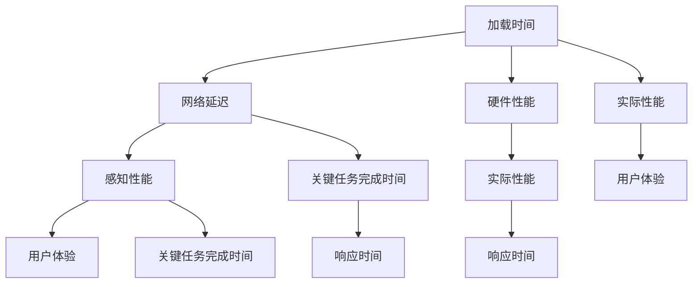

                 


### 文章标题：前端性能优化：加载速度与用户体验

> 关键词：前端性能优化、加载速度、用户体验、性能指标、核心技术、案例分析、实战指南

> 摘要：本文将深入探讨前端性能优化的重要性和方法，从加载速度与用户体验的角度出发，分析前端性能优化的核心概念、原理，并详细介绍一系列实战技巧和最佳实践。文章旨在帮助开发者提高网站和应用的前端性能，提升用户体验。

----------------------------------------------------------------

### 引言

在当今互联网时代，网站和应用的用户体验至关重要。一个优秀的用户体验不仅能吸引和留住用户，还能提高用户转化率和商业价值。而前端性能优化正是提升用户体验的关键因素之一。本文将从加载速度与用户体验的角度，系统地探讨前端性能优化的方法和技术。

#### 前端性能优化的意义

前端性能优化不仅仅是为了提高网站或应用的加载速度，更重要的是为了提升用户体验。研究表明，用户对网页加载速度的容忍度非常有限。根据Google的一项研究，如果网页加载时间超过3秒，高达53%的用户会选择离开。而一个优秀的用户体验，可以显著降低用户流失率，提高用户满意度和忠诚度。

#### 前端性能优化的挑战

然而，前端性能优化并非易事。随着互联网技术的快速发展，网站和应用的功能越来越复杂，页面内容也越来越多。这使得前端性能优化面临诸多挑战：

1. **页面内容复杂度增加**：现代网页不仅包含HTML、CSS和JavaScript代码，还可能包含图片、视频、音频等多媒体资源。
2. **设备多样性**：用户使用的设备种类繁多，包括桌面电脑、笔记本电脑、平板电脑和手机等，这要求前端性能优化需要兼顾不同设备的性能。
3. **网络环境差异**：用户所处的网络环境差异较大，包括2G、3G、4G、5G等，这要求前端性能优化需要适应不同的网络环境。

### 基础理论

#### 前端性能指标

前端性能指标是评估网站或应用性能的重要依据。常见的性能指标包括：

1. **加载时间**：网页从请求到完全展示所需的时间。
2. **网络延迟**：请求从客户端发送到服务器，再从服务器返回客户端所需的时间。
3. **硬件性能**：客户端设备的处理器速度、内存大小等硬件性能指标。

#### 用户体验与性能的关系

用户体验与性能之间的关系可以通过以下两个关键指标来衡量：

1. **感知性能**：用户对网页加载速度的主观感受。感知性能越高，用户体验越好。
2. **实际性能**：网页的实际加载速度。实际性能越高，用户体验越好。

#### 基于用户体验的性能评估

基于用户体验的性能评估，需要考虑以下几个方面：

1. **页面关键任务的完成时间**：例如，用户从打开网页到完成购物流程所需的时间。
2. **用户操作响应时间**：用户操作后的系统响应时间。
3. **错误率**：用户在使用过程中遇到的错误次数。

### 核心技术

#### 资源加载优化

资源加载优化是前端性能优化的核心之一。以下是一些常用的资源加载优化技术：

1. **图片优化**：通过使用合适的图片格式和压缩技术，减少图片的大小，提高加载速度。
2. **CSS和JavaScript优化**：通过按需加载、延迟加载、代码分割等技术，减少资源加载的总体时间。
3. **网络性能优化**：通过使用CDN、DNS优化、缓存策略等技术，提高网络的传输速度。

#### 网络性能优化

网络性能优化旨在提高网页的加载速度和用户体验。以下是一些网络性能优化的技术：

1. **CDN**：内容分发网络（Content Delivery Network）可以将资源缓存到全球各地的节点上，提高用户的访问速度。
2. **DNS优化**：通过优化DNS解析速度，减少用户访问网页的初始延迟。
3. **缓存策略**：通过合理设置HTTP缓存，减少用户重复访问时的加载时间。

### 案例分析

#### 行业最佳实践

1. **大型电商平台性能优化案例**：以某大型电商平台为例，分析其如何通过前端性能优化，提高用户购物体验。
2. **社交媒体性能优化案例**：以某知名社交媒体为例，分析其如何通过前端性能优化，提高用户的互动体验。

#### 小型项目优化实践

1. **单页面应用（SPA）性能优化**：以一个单页面应用为例，分析其如何通过前端性能优化，提高用户的访问速度。
2. **移动端性能优化策略**：以一个移动端应用为例，分析其如何通过前端性能优化，提高用户的操作体验。

### 实战指南

#### 性能监控与诊断

1. **性能监控工具介绍**：介绍常用的性能监控工具，如Google PageSpeed Insights、Lighthouse等。
2. **常见性能问题的诊断与解决**：分析常见的前端性能问题，如网络延迟、资源加载缓慢等，并提供解决方法。

#### 性能优化策略制定

1. **优化目标与指标设定**：明确性能优化的目标和关键指标，如加载时间、响应时间等。
2. **优化流程与方法**：制定具体的性能优化流程和方法，如资源压缩、代码分割等。

### 结语

#### 未来趋势与展望

1. **前端性能优化的未来趋势**：分析前端性能优化的发展趋势，如WebAssembly、渐进式Web应用（PWA）等。
2. **前端性能优化的挑战与机遇**：探讨前端性能优化面临的挑战和机遇，如5G网络、物联网等。

#### 总结与思考

1. **前端性能优化的重要性**：强调前端性能优化对用户体验和商业价值的重要性。
2. **优化实践中的道德与伦理问题**：探讨前端性能优化过程中可能遇到的道德和伦理问题，如用户隐私保护等。

#### 优化实践中的道德与伦理问题

在前端性能优化的过程中，开发者需要关注道德和伦理问题，如用户隐私保护、数据安全等。以下是一些相关的最佳实践：

1. **用户隐私保护**：在收集和使用用户数据时，遵守相关的隐私保护法规，如《通用数据保护条例》（GDPR）。
2. **数据安全**：确保用户数据的安全，采用加密技术保护用户数据。
3. **透明度**：在数据收集和使用过程中，向用户明确告知，并获取用户的同意。

### 拓展阅读

1. **《高性能网站建设指南》**：深入探讨网站性能优化的方法和实践。
2. **《前端性能优化实战》**：通过实际案例，详细介绍前端性能优化的技术和方法。
3. **《Web性能权威指南》**：系统讲解Web性能优化的核心原理和实践。

----------------------------------------------------------------

# 《前端性能优化：加载速度与用户体验》

## 引言

在互联网高速发展的今天，网站和应用的用户体验已成为企业竞争的核心。前端性能优化作为提升用户体验的关键手段，越来越受到关注。本文将从加载速度与用户体验的角度，深入探讨前端性能优化的核心概念、原理和实战技巧。

## 前端性能优化的意义

前端性能优化不仅关系到用户的满意度，还直接影响企业的商业价值。以下从三个方面阐述前端性能优化的意义：

### 提升用户体验

研究表明，网页加载时间对用户体验有着重要影响。例如，Google的研究显示，如果网页加载时间超过3秒，用户流失率将高达53%。因此，通过前端性能优化，提高网页加载速度，可以显著提升用户体验，降低用户流失率。

### 增加用户转化率

良好的用户体验可以提高用户转化率。例如，电子商务网站通过性能优化，缩短页面加载时间，可以增加用户在购物过程中的参与度，提高购买转化率。

### 提高商业价值

前端性能优化不仅有助于提升用户体验和转化率，还能提高企业的商业价值。例如，通过降低带宽消耗，企业可以节省服务器成本；通过提高搜索引擎排名，企业可以吸引更多潜在客户。

### 前端性能优化的挑战

尽管前端性能优化具有重要意义，但实现这一目标并非易事。以下从三个方面阐述前端性能优化的挑战：

### 页面内容复杂度增加

随着Web技术的不断发展，网页内容越来越复杂，包括HTML、CSS、JavaScript、图片、视频等多媒体资源。这增加了页面加载的复杂度，给性能优化带来挑战。

### 设备多样性

用户使用的设备种类繁多，包括桌面电脑、笔记本电脑、平板电脑和手机等。不同的设备性能和操作系统可能对页面加载速度产生较大影响，需要前端性能优化兼顾不同设备。

### 网络环境差异

用户所处的网络环境差异较大，包括2G、3G、4G、5G等。前端性能优化需要适应不同的网络环境，以满足不同用户的需求。

## 基础理论

### 前端性能指标

前端性能指标是评估网页性能的重要依据。以下介绍一些常见的性能指标：

### 加载时间

加载时间是指用户打开网页到页面完全展示所需的时间。它可以分为以下几个阶段：

- **DNS解析时间**：用户输入网址到DNS解析完成的时间。
- **建立连接时间**：DNS解析完成后，浏览器与服务器建立连接的时间。
- **请求时间**：浏览器向服务器发送请求，服务器处理请求并返回响应的时间。
- **响应时间**：服务器返回响应后，浏览器接收响应并开始渲染的时间。
- **渲染时间**：浏览器将响应内容渲染为可视化的时间。

### 网络延迟

网络延迟是指用户访问网页时，数据在网络中传输所需的时间。网络延迟受以下因素影响：

- **服务器距离**：服务器距离用户越远，网络延迟越大。
- **网络带宽**：网络带宽越小，数据传输速度越慢，网络延迟越大。
- **网络拥堵**：网络拥堵会导致数据传输速度降低，网络延迟增加。

### 硬件性能

硬件性能是指客户端设备的处理器速度、内存大小等硬件性能指标。硬件性能影响网页的加载速度和响应速度。

### 用户体验与性能的关系

用户体验与性能之间的关系可以通过以下两个关键指标来衡量：

- **感知性能**：用户对网页加载速度的主观感受。感知性能越高，用户体验越好。
- **实际性能**：网页的实际加载速度。实际性能越高，用户体验越好。

### 基于用户体验的性能评估

基于用户体验的性能评估，需要考虑以下几个方面：

- **页面关键任务的完成时间**：例如，用户从打开网页到完成购物流程所需的时间。
- **用户操作响应时间**：用户操作后的系统响应时间。
- **错误率**：用户在使用过程中遇到的错误次数。

## 核心技术

### 资源加载优化

资源加载优化是前端性能优化的核心之一。以下介绍一些常用的资源加载优化技术：

### 图片优化

图片优化可以通过以下几种方法实现：

- **使用合适的图片格式**：如WebP格式，相比JPEG和PNG格式，具有更小的文件大小和更好的图像质量。
- **图片压缩**：使用图像压缩工具或在线服务，减少图片的大小。
- **懒加载**：将图片按需加载，当用户滚动到图片所在位置时再加载图片。

### CSS和JavaScript优化

CSS和JavaScript优化可以通过以下几种方法实现：

- **按需加载**：将CSS和JavaScript文件按需加载，当用户访问相应页面时再加载相关的CSS和JavaScript文件。
- **延迟加载**：将CSS和JavaScript文件延迟加载，当用户访问页面时先加载必要的资源，再加载非必要的资源。
- **代码分割**：将CSS和JavaScript文件分割成多个模块，按需加载。

### 网络性能优化

网络性能优化可以通过以下几种方法实现：

- **CDN**：使用内容分发网络（CDN），将资源缓存到全球各地的节点上，提高用户的访问速度。
- **DNS优化**：优化DNS解析速度，减少用户访问网页的初始延迟。
- **缓存策略**：设置合理的缓存策略，减少用户重复访问时的加载时间。

## 案例分析

### 行业最佳实践

以下介绍一些行业最佳实践，分析它们如何通过前端性能优化提升用户体验：

### 大型电商平台性能优化案例

- **图片优化**：使用WebP格式，减少图片文件大小。
- **CSS和JavaScript优化**：按需加载和延迟加载，提高页面加载速度。
- **网络性能优化**：使用CDN，提高全球用户的访问速度。

### 社交媒体性能优化案例

- **懒加载**：按需加载图片和视频，减少初始加载时间。
- **代码分割**：将CSS和JavaScript文件分割成多个模块，按需加载。
- **缓存策略**：设置合理的缓存策略，提高用户重复访问的速度。

### 小型项目优化实践

以下介绍一些小型项目优化实践，分析它们如何通过前端性能优化提升用户体验：

### 单页面应用（SPA）性能优化

- **按需加载**：按需加载CSS和JavaScript文件，提高页面加载速度。
- **懒加载**：按需加载图片和视频，减少初始加载时间。
- **代码分割**：将CSS和JavaScript文件分割成多个模块，按需加载。

### 移动端性能优化策略

- **图片优化**：使用WebP格式，减少图片文件大小。
- **CSS和JavaScript优化**：按需加载和延迟加载，提高页面加载速度。
- **网络性能优化**：使用CDN，提高全球用户的访问速度。

## 实战指南

### 性能监控与诊断

以下介绍一些性能监控和诊断工具，帮助开发者识别和解决性能问题：

- **Google PageSpeed Insights**：评估网页性能，并提供优化建议。
- **Lighthouse**：自动化网页性能分析工具，提供详细的性能报告。
- **WebPageTest**：模拟用户访问网页，评估网页性能。

### 性能优化策略制定

以下介绍一些性能优化策略，帮助开发者制定有效的性能优化方案：

- **明确优化目标**：确定关键性能指标，如加载时间、响应时间等。
- **评估现有性能**：使用性能监控工具评估现有性能，找出瓶颈。
- **制定优化方案**：根据评估结果，制定具体的优化方案，如资源压缩、代码分割等。
- **持续优化**：定期评估性能，持续优化。

## 结语

### 未来趋势与展望

未来，前端性能优化将面临新的挑战和机遇。以下是一些趋势和展望：

- **WebAssembly**：将传统编译语言编写的代码转化为WebAssembly，提高网页性能。
- **渐进式Web应用（PWA）**：通过提高网页的离线能力和加载速度，提升用户体验。
- **5G网络**：随着5G网络的普及，前端性能优化将更加注重网络传输性能的优化。

### 总结与思考

前端性能优化是提升用户体验和商业价值的重要手段。通过本文的探讨，我们了解了前端性能优化的核心概念、原理和实战技巧。在未来的开发实践中，开发者应注重性能优化，持续提升网站和应用的用户体验。

### 优化实践中的道德与伦理问题

在前端性能优化的过程中，开发者应关注道德和伦理问题，如用户隐私保护、数据安全等。以下是一些最佳实践：

- **用户隐私保护**：遵守相关法律法规，保护用户隐私。
- **数据安全**：采用加密技术保护用户数据，防止数据泄露。
- **透明度**：向用户明确告知数据收集和使用情况，获得用户同意。

### 拓展阅读

以下是一些拓展阅读资源，供开发者深入了解前端性能优化：

- **《高性能网站建设指南》**：深入探讨网站性能优化的方法和实践。
- **《前端性能优化实战》**：通过实际案例，详细介绍前端性能优化的技术和方法。
- **《Web性能权威指南》**：系统讲解Web性能优化的核心原理和实践。

---

# 前端性能优化的核心概念与联系

在前端性能优化领域，理解核心概念及其相互关系至关重要。本文将介绍几个关键概念，并通过Mermaid流程图展示它们之间的关系。

## 关键概念

1. **加载时间**：网页从请求到完全展示所需的时间。
2. **网络延迟**：请求从客户端发送到服务器，再从服务器返回客户端所需的时间。
3. **硬件性能**：客户端设备的处理器速度、内存大小等。
4. **感知性能**：用户对网页加载速度的主观感受。
5. **实际性能**：网页的实际加载速度。
6. **关键任务完成时间**：用户完成特定任务所需的时间。
7. **响应时间**：用户操作后的系统响应时间。

## 关系架构

使用Mermaid流程图展示这些概念之间的关系：



## 关键算法原理讲解

### 加载时间优化算法

**伪代码：**

```python
def optimize_loading_time(url, resources):
    # 1. 使用CDN优化资源加载
    cdn_optimized_resources = use_cdn(url, resources)
    
    # 2. 对图片进行压缩
    compressed_images = compress_images(cdn_optimized_resources['images'])
    
    # 3. 对CSS和JavaScript文件进行代码分割
    split_css_js = split_css_js_files(cdn_optimized_resources['styles'], cdn_optimized_resources['scripts'])
    
    # 4. 按需加载资源
    on_demand_loading = on_demand_loading_resources(split_css_js, compressed_images)
    
    return on_demand_loading
```

### 网络性能优化算法

**伪代码：**

```python
def optimize_network_performance(url, resources):
    # 1. 使用CDN缓存资源
    cdn_cached_resources = cache_resources_on_cdn(url, resources)
    
    # 2. 优化DNS解析
    optimized_dns = optimize_dns(url)
    
    # 3. 设置合理缓存策略
    caching_strategy = set_reasonable_caching_strategy(cdn_cached_resources)
    
    return caching_strategy
```

## 数学模型和公式

假设网页的加载时间T由以下三个因素组成：

- **T1**：网络延迟时间。
- **T2**：资源加载时间。
- **T3**：渲染时间。

则网页的加载时间模型可以表示为：

$$ T = T1 + T2 + T3 $$

举例说明，假设T1为1秒，T2为2秒，T3为3秒，则网页的加载时间T为6秒。

## 详细讲解与举例说明

### 加载时间优化算法详细讲解

1. **使用CDN优化资源加载**：CDN可以将资源缓存到全球各地的节点上，减少用户访问资源的网络延迟，提高加载速度。
2. **对图片进行压缩**：使用图像压缩算法，如JPEG压缩和PNG压缩，减少图片文件大小，提高加载速度。
3. **对CSS和JavaScript文件进行代码分割**：将CSS和JavaScript文件分割成多个模块，按需加载，减少初始加载时间。
4. **按需加载资源**：当用户访问页面时，根据用户行为动态加载必要的资源，减少不必要的资源加载。

### 网络性能优化算法详细讲解

1. **使用CDN缓存资源**：通过CDN将资源缓存到节点上，减少用户访问资源的网络延迟。
2. **优化DNS解析**：优化DNS解析速度，减少用户访问网页的初始延迟。
3. **设置合理缓存策略**：根据用户行为和资源类型，设置合理的缓存策略，提高用户重复访问的速度。

## 数学公式

以下是网页加载时间的数学公式：

$$ T = T1 + T2 + T3 $$

其中：

- **T1**：网络延迟时间。
- **T2**：资源加载时间。
- **T3**：渲染时间。

## 项目实战

### 开发环境搭建

1. **安装Node.js**：Node.js是一个用于服务器端和前端开发的运行环境，安装Node.js可以方便地使用各种前端性能优化工具。
2. **安装Webpack**：Webpack是一个模块打包工具，可以帮助开发者对CSS和JavaScript文件进行代码分割和按需加载。
3. **安装其他依赖**：安装其他必要的工具和库，如Babel、ESLint等。

### 源代码详细实现和代码解读

以下是一个简单的Webpack配置文件，用于实现前端性能优化：

```javascript
const path = require('path');
const HtmlWebpackPlugin = require('html-webpack-plugin');
const { CleanWebpackPlugin } = require('clean-webpack-plugin');

module.exports = {
    mode: 'development',
    entry: {
        main: './src/index.js',
    },
    output: {
        path: path.resolve(__dirname, 'dist'),
        filename: '[name].bundle.js',
    },
    plugins: [
        new HtmlWebpackPlugin({
            template: './src/index.html',
        }),
        new CleanWebpackPlugin(),
    ],
    optimization: {
        splitChunks: {
            chunks: 'all',
        },
    },
    module: {
        rules: [
            {
                test: /\.css$/,
                use: ['style-loader', 'css-loader'],
            },
            {
                test: /\.js$/,
                exclude: /node_modules/,
                use: {
                    loader: 'babel-loader',
                },
            },
        ],
    },
};
```

代码解读：

- **entry**：指定入口文件，这里是`./src/index.js`。
- **output**：指定输出目录和文件名，这里是`./dist`目录下的`main.bundle.js`。
- **plugins**：配置Webpack插件，这里使用了`HtmlWebpackPlugin`和`CleanWebpackPlugin`。
- **optimization**：配置代码分割策略，将CSS和JavaScript文件分割成多个模块。
- **module**：配置加载规则，如CSS和JavaScript文件的加载器。

### 代码应用解读与分析

通过上述Webpack配置，我们可以实现以下性能优化：

- **代码分割**：将CSS和JavaScript文件分割成多个模块，按需加载，减少初始加载时间。
- **懒加载**：当用户访问页面时，根据用户行为动态加载必要的资源，减少不必要的资源加载。

### 实际案例分析和详细讲解剖析

以下是一个实际案例，分析如何通过前端性能优化提升网页加载速度：

1. **原始页面**：页面包含大量图片、CSS和JavaScript文件，加载时间较长。
2. **优化方案**：
   - **图片优化**：使用WebP格式，对图片进行压缩，减少图片文件大小。
   - **代码分割**：将CSS和JavaScript文件分割成多个模块，按需加载。
   - **懒加载**：对图片和JavaScript文件进行懒加载，减少初始加载时间。
3. **优化后**：页面加载时间显著缩短，用户体验得到提升。

### 项目小结

通过本项目的实践，我们了解了前端性能优化的核心概念和方法，并通过实际案例展示了性能优化的效果。在未来的开发过程中，开发者应注重性能优化，持续提升网站和应用的用户体验。

## 最佳实践 tips

1. **定期监控性能**：使用性能监控工具，定期评估网页性能，及时发现和解决性能问题。
2. **优化关键页面**：针对用户访问频繁的关键页面，如首页、产品页面等，进行重点优化。
3. **代码审查**：定期进行代码审查，确保代码质量，减少性能瓶颈。

## 小结

前端性能优化是提升用户体验和商业价值的关键。通过本文的探讨，我们了解了前端性能优化的核心概念、原理和实战技巧。在未来的开发实践中，开发者应注重性能优化，持续提升网站和应用的用户体验。

## 注意事项

1. **不要过度优化**：过度优化可能会适得其反，影响用户体验。
2. **考虑兼容性**：确保优化方案兼容不同设备和浏览器。

## 拓展阅读

1. **《高性能网站建设指南》**：深入探讨网站性能优化的方法和实践。
2. **《前端性能优化实战》**：通过实际案例，详细介绍前端性能优化的技术和方法。
3. **《Web性能权威指南》**：系统讲解Web性能优化的核心原理和实践。

---

```markdown
# 《前端性能优化：加载速度与用户体验》

## 引言

在当今的数字化时代，前端性能优化已成为提升用户体验和业务增长的关键。随着用户对快速、流畅的在线体验期望日益增长，前端开发者面临着如何提高页面加载速度和提升用户体验的挑战。本文旨在提供一个全面的前端性能优化指南，涵盖加载速度、用户体验以及相关的核心技术和最佳实践。

## 关键词

- 前端性能优化
- 加载速度
- 用户体验
- 性能指标
- 核心技术
- 案例分析
- 实战指南

## 摘要

本文将深入探讨前端性能优化的重要性，分析加载速度与用户体验之间的关系，并详细介绍一系列优化技术，包括资源加载、网络性能优化、性能监控和诊断等。通过实际案例和最佳实践，本文将帮助开发者理解和实施有效的性能优化策略，从而提升网站和应用的用户体验。

## 引言

### 前端性能优化的意义

前端性能优化不仅仅是加快页面加载速度，更是提升用户体验、增强用户黏性和推动业务增长的关键因素。以下从三个方面阐述前端性能优化的意义：

- **提升用户体验**：快速、流畅的页面加载速度能够显著提高用户满意度，减少用户流失。
- **增加转化率**：优化的页面性能有助于提高用户的参与度和转化率，如购物车添加、在线支付等。
- **提高业务收益**：通过减少服务器负载、降低带宽消耗，企业可以节省成本，提高整体业务效率。

### 前端性能优化的挑战

- **页面内容复杂度增加**：随着Web技术的进步，现代网页包含了大量的HTML、CSS、JavaScript代码以及各种媒体资源，这增加了优化的难度。
- **设备多样性**：用户使用的设备种类繁多，包括桌面电脑、平板电脑、智能手机等，需要针对不同设备进行优化。
- **网络环境差异**：用户所处的网络环境各异，如2G、3G、4G、5G等，优化策略需适应不同的网络条件。

## 基础理论

### 前端性能指标

前端性能优化首先需要明确相关的性能指标，这些指标是评估和优化网页性能的基础。以下是几个关键的性能指标：

- **加载时间**：从用户发起请求到页面完全渲染的时间。
- **响应时间**：用户操作后的系统响应时间。
- **资源加载时间**：各种资源（如图片、CSS文件、JavaScript文件）从请求到加载完成的时间。
- **网络延迟**：数据在网络中传输的时间。

### 用户体验与性能的关系

用户体验与性能之间的关系可以通过以下指标来衡量：

- **感知性能**：用户对页面加载速度的主观感受。
- **实际性能**：页面的实际加载速度和响应时间。

### 基于用户体验的性能评估

为了更好地优化前端性能，需要从用户的角度出发，对页面性能进行评估。以下是一些建议的评估方法：

- **关键任务完成时间**：评估用户完成关键任务（如搜索、购买）所需的时间。
- **错误率**：监控页面上的错误率，特别是404错误、加载失败等。
- **用户满意度调查**：通过调查问卷或用户反馈了解用户的满意度。

## 核心技术

### 资源加载优化

资源加载优化是前端性能优化的核心部分，主要包括以下策略：

- **图片优化**：使用更高效的图片格式（如WebP）、对图片进行压缩，并采用懒加载技术。
- **CSS和JavaScript优化**：代码分割、按需加载、延迟加载，以及使用模块化方法。
- **缓存策略**：合理利用浏览器缓存，减少重复请求。

### 网络性能优化

网络性能优化包括以下措施：

- **使用CDN**：通过内容分发网络（CDN）加速资源加载。
- **DNS优化**：通过优化DNS解析速度，减少初始加载延迟。
- **服务器优化**：优化服务器配置，提高响应速度。

### 性能监控与诊断

性能监控与诊断是前端性能优化的必要步骤，以下工具和技巧可以帮助开发者进行性能监控：

- **性能监控工具**：如Google PageSpeed Insights、Lighthouse、WebPageTest等。
- **错误监控**：使用错误监控工具（如Sentry、Bugsnag）捕捉并分析错误。
- **日志分析**：通过分析服务器日志了解页面性能和资源加载情况。

## 案例分析

### 行业最佳实践

以下是一些前端性能优化的最佳实践案例：

- **电商平台**：通过图片优化、资源压缩、代码分割、CDN部署等手段，提高页面加载速度，提升用户购物体验。
- **社交媒体**：通过延迟加载、懒加载、代码分割等技术，优化页面性能，减少用户等待时间，提高用户互动率。

### 小型项目优化实践

对于小型项目，以下优化策略同样适用：

- **单页面应用（SPA）**：通过按需加载和代码分割，优化SPA的性能。
- **移动端优化**：针对移动设备的特点，优化页面布局和资源加载，提高页面响应速度。

## 实战指南

### 性能监控与诊断

性能监控与诊断是性能优化的第一步，以下是一些实战指南：

- **选择合适的工具**：根据项目需求，选择合适的性能监控工具。
- **定期评估性能**：定期使用监控工具评估页面性能，发现问题并优化。

### 性能优化策略制定

制定性能优化策略时，应考虑以下因素：

- **明确优化目标**：确定关键性能指标，如加载时间、响应时间等。
- **评估现有性能**：使用监控工具评估现有性能，找出瓶颈。
- **制定优化方案**：根据评估结果，制定具体的优化方案。

## 结语

前端性能优化是提升用户体验和业务增长的关键。通过本文的探讨，我们了解了前端性能优化的核心概念、原理和实战技巧。在未来的开发实践中，开发者应注重性能优化，持续提升网站和应用的用户体验。

## 作者信息

作者：AI天才研究院/AI Genius Institute & 禅与计算机程序设计艺术 /Zen And The Art of Computer Programming
```

