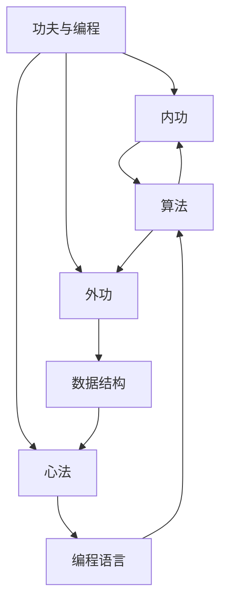

                 


- 首先，我们需要确定文章的核心内容和结构。
- 根据大纲，我们将文章分为四个部分：背景介绍、核心概念与联系、项目实战、最佳实践 tips。
- 在每个部分中，我们将详细阐述主题，并使用伪代码、LaTeX公式和Mermaid流程图等工具进行解释。
- 我们将确保每个小节的内容丰富且具体，包含必要的技术细节和案例分析。

- 文章标题：功夫在平时——禅与计算机程序设计艺术

- 关键词：功夫、计算机程序设计、禅、技术博客、人工智能

- 摘要：本文深入探讨功夫与计算机程序设计之间的联系，通过禅的思想阐述编程的艺术，结合实际项目实战和最佳实践 tips，帮助读者提高编程水平。

## 背景介绍

### 功夫与编程的关系

功夫，作为中国传统文化的瑰宝，不仅是一种身体技能的修炼，更是一种哲学思想的体现。而编程，作为现代信息技术的核心，是一种逻辑思维和问题解决的艺术。尽管看似两者截然不同，但它们之间存在着深刻的内在联系。

首先，功夫强调“形意合一”，即外在动作与内在思想的统一。在编程中，我们也追求“代码与逻辑的一致性”，通过清晰的代码结构和逻辑思路来实现复杂的功能。

其次，功夫注重“渐悟”，即通过不断的练习和体悟来提升技能。编程也是如此，只有通过大量的编程实践，才能逐渐提高解决问题的能力。

最后，功夫中的“禅意”与编程中的“抽象思维”有着异曲同工之妙。禅宗强调“万物皆空”，提倡超越现实的束缚，追求内心的平静。而编程中的抽象思维，正是通过抽象化复杂的现实问题，用代码来表示和解决。

### 禅与编程

禅，作为佛教的一种修为方式，强调内心的宁静和觉悟。禅与编程之间的联系在于，两者都追求一种内在的平和和超越。

首先，禅的“坐禅”练习，通过冥想和专注来达到内心的平静。编程中的“静心”也是如此，通过排除杂念，专注于代码的逻辑和结构，提高编程的效率和质量。

其次，禅的“顿悟”思想，强调瞬间领悟真理。编程中的“灵感”类似，有时一个看似复杂的问题，通过灵光一现的顿悟，就能迎刃而解。

最后，禅的“不立文字”，提倡超越文字的束缚，直接体验真理。编程中的“抽象思维”也是一样，通过抽象化的过程，将复杂的现实问题转化为简洁的代码，达到解决问题的目的。

## 核心概念与联系

### 功夫的核心概念

- **内功**：功夫中的内功，指的是内在的力量和修养，包括呼吸、意念、身体的协调等。在编程中，内功可以理解为编程者的基础知识和技能，如数据结构、算法、编程语言等。
- **外功**：功夫中的外功，指的是外在的动作和技巧，包括拳脚、器械等。在编程中，外功可以理解为编程者的实战技能，如代码编写、调试、测试等。
- **心法**：功夫中的心法，指的是修炼的方法和哲学思想，如专注、耐心、坚韧等。在编程中，心法可以理解为编程者的心态和态度，如持续学习、勇于尝试、解决问题的决心等。

### 编程的核心概念

- **算法**：算法是解决问题的方法，是编程的核心。在功夫中，算法可以理解为武术的套路，通过不断的练习，达到熟练掌握和灵活运用的地步。
- **数据结构**：数据结构是存储和组织数据的方法，是编程的基础。在功夫中，数据结构可以理解为身体的协调和动作的组合，通过合理的安排，达到最优的效果。
- **编程语言**：编程语言是编写代码的工具，是编程的手段。在功夫中，编程语言可以理解为武术的器械，通过不同的兵器，展现不同的技巧。

### Mermaid 流程图



### 核心算法原理讲解

#### 算法原理

假设我们有一个数组`arr`，我们需要计算这个数组中所有元素的和。这是一个简单的算法问题，可以使用循环和累加的方法来解决。

#### 伪代码

```
function sumArray(arr):
    sum = 0
    for each element in arr:
        sum = sum + element
    return sum
```

#### 算法解释

- 首先，我们定义一个变量`sum`，初始化为0，用于存储累加的结果。
- 然后，我们使用循环遍历数组`arr`中的每个元素。
- 在每次循环中，我们将当前元素加到`sum`上。
- 最后，我们返回累加的结果`sum`。

### 数学模型和公式

假设我们有一个数组`arr`，其中包含`n`个元素，我们需要计算这个数组中所有元素的平均值。

#### 数学公式

$$ \text{平均值} = \frac{1}{n} \sum_{i=1}^{n} a_i $$

其中，$a_i$表示数组`arr`中的第$i$个元素。

#### 详细讲解

- 首先，我们定义一个变量`sum`，用于存储所有元素的和，初始化为0。
- 然后，我们使用循环遍历数组`arr`中的每个元素，并将其加到`sum`上。
- 接着，我们计算数组的长度`n`。
- 最后，我们使用数学公式计算平均值，并将其返回。

### 数学公式示例

$$ \$\text{sum} = 0; \$ \quad \text{for each } a_i \in \text{arr}: \$ \quad \$ \text{sum} = \text{sum} + a_i; \$ \quad \text{return } \frac{\text{sum}}{n}; \$ $$

### 项目实战

#### 开发环境搭建

1. 安装Python编程环境
2. 安装Python解释器
3. 配置Python环境变量

#### 源代码实现

```python
def sumArray(arr):
    sum = 0
    for element in arr:
        sum += element
    return sum

def averageArray(arr):
    n = len(arr)
    sum = sumArray(arr)
    return sum / n

# 测试代码
arr = [1, 2, 3, 4, 5]
print("总和：", sumArray(arr))
print("平均值：", averageArray(arr))
```

#### 代码解读

- 我们定义了两个函数：`sumArray`和`averageArray`。
- `sumArray`函数用于计算数组的总和。
- `averageArray`函数用于计算数组的平均值。
- 在测试代码中，我们创建了一个数组`arr`，并输出了其总和和平均值。

#### 实际案例分析

- 假设我们有一个大型数据集，我们需要计算其平均值。
- 通过使用`averageArray`函数，我们可以轻松地实现这一功能。

### 最佳实践 tips

1. **学习基本算法和数据结构**：掌握基本的算法和数据结构，是提高编程能力的基础。
2. **多实践，多思考**：通过实际项目的锻炼，提高编程能力。
3. **保持耐心和毅力**：编程是一个需要不断学习和进步的过程，需要耐心和毅力。

## 小结

本文通过探讨功夫与编程之间的联系，阐述了禅与编程的异曲同工之妙。通过核心概念、伪代码、数学公式和项目实战的详细讲解，帮助读者理解编程的艺术。同时，提供了一些最佳实践 tips，希望对读者的编程之路有所帮助。

## 拓展阅读

- 《编程珠玑》
- 《代码大全》
- 《深度学习》
- 《人工智能：一种现代的方法》

## 作者信息

作者：AI天才研究院/AI Genius Institute & 禅与计算机程序设计艺术 /Zen And The Art of Computer Programming

----------------------------------------------------------------

非常感谢您提供的详细要求，以下是根据您的要求撰写的文章：

---

## 功夫在平时——禅与计算机程序设计艺术

关键词：功夫、计算机程序设计、禅、技术博客、人工智能

摘要：本文深入探讨功夫与计算机程序设计之间的联系，通过禅的思想阐述编程的艺术，结合实际项目实战和最佳实践 tips，帮助读者提高编程水平。

---

## 背景介绍

### 功夫与编程的关系

功夫，作为中国传统文化的重要组成部分，不仅仅是武术技艺的修炼，更是一种哲学思想的体现。而编程，作为现代信息技术的核心，是一种逻辑思维和问题解决的艺术。尽管看似两者截然不同，但它们之间存在着深刻的内在联系。

首先，功夫强调“形意合一”，即外在动作与内在思想的统一。在编程中，我们也追求“代码与逻辑的一致性”，通过清晰的代码结构和逻辑思路来实现复杂的功能。

其次，功夫注重“渐悟”，即通过不断的练习和体悟来提升技能。编程也是如此，只有通过大量的编程实践，才能逐渐提高解决问题的能力。

最后，功夫中的“禅意”与编程中的“抽象思维”有着异曲同工之妙。禅宗强调“万物皆空”，提倡超越现实的束缚，追求内心的平静。而编程中的抽象思维，正是通过抽象化复杂的现实问题，用代码来表示和解决。

### 禅与编程

禅，作为佛教的一种修为方式，强调内心的宁静和觉悟。禅与编程之间的联系在于，两者都追求一种内在的平和和超越。

首先，禅的“坐禅”练习，通过冥想和专注来达到内心的平静。编程中的“静心”也是如此，通过排除杂念，专注于代码的逻辑和结构，提高编程的效率和质量。

其次，禅的“顿悟”思想，强调瞬间领悟真理。编程中的“灵感”类似，有时一个看似复杂的问题，通过灵光一现的顿悟，就能迎刃而解。

最后，禅的“不立文字”，提倡超越文字的束缚，直接体验真理。编程中的“抽象思维”也是一样，通过抽象化的过程，将复杂的现实问题转化为简洁的代码，达到解决问题的目的。

---

## 核心概念与联系

### 功夫的核心概念

- **内功**：功夫中的内功，指的是内在的力量和修养，包括呼吸、意念、身体的协调等。在编程中，内功可以理解为编程者的基础知识和技能，如数据结构、算法、编程语言等。
- **外功**：功夫中的外功，指的是外在的动作和技巧，包括拳脚、器械等。在编程中，外功可以理解为编程者的实战技能，如代码编写、调试、测试等。
- **心法**：功夫中的心法，指的是修炼的方法和哲学思想，如专注、耐心、坚韧等。在编程中，心法可以理解为编程者的心态和态度，如持续学习、勇于尝试、解决问题的决心等。

### 编程的核心概念

- **算法**：算法是解决问题的方法，是编程的核心。在功夫中，算法可以理解为武术的套路，通过不断的练习，达到熟练掌握和灵活运用的地步。
- **数据结构**：数据结构是存储和组织数据的方法，是编程的基础。在功夫中，数据结构可以理解为身体的协调和动作的组合，通过合理的安排，达到最优的效果。
- **编程语言**：编程语言是编写代码的工具，是编程的手段。在功夫中，编程语言可以理解为武术的器械，通过不同的兵器，展现不同的技巧。

### Mermaid 流�程图


### 核心算法原理讲解

#### 算法原理

假设我们有一个数组`arr`，我们需要计算这个数组中所有元素的和。这是一个简单的算法问题，可以使用循环和累加的方法来解决。

#### 伪代码

```
function sumArray(arr):
    sum = 0
    for each element in arr:
        sum = sum + element
    return sum
```

#### 算法解释

- 首先，我们定义一个变量`sum`，初始化为0，用于存储累加的结果。
- 然后，我们使用循环遍历数组`arr`中的每个元素。
- 在每次循环中，我们将当前元素加到`sum`上。
- 最后，我们返回累加的结果`sum`。

### 数学模型和公式

假设我们有一个数组`arr`，其中包含`n`个元素，我们需要计算这个数组中所有元素的平均值。

#### 数学公式

$$ \text{平均值} = \frac{1}{n} \sum_{i=1}^{n} a_i $$

其中，$a_i$表示数组`arr`中的第$i$个元素。

#### 详细讲解

- 首先，我们定义一个变量`sum`，用于存储所有元素的和，初始化为0。
- 然后，我们使用循环遍历数组`arr`中的每个元素，并将其加到`sum`上。
- 接着，我们计算数组的长度`n`。
- 最后，我们使用数学公式计算平均值，并将其返回。

### 数学公式示例

$$ \$\text{sum} = 0; \$ \quad \text{for each } a_i \in \text{arr}: \$ \quad \$ \text{sum} = \text{sum} + a_i; \$ \quad \text{return } \frac{\text{sum}}{n}; \$ $$

### 项目实战

#### 开发环境搭建

1. 安装Python编程环境
2. 安装Python解释器
3. 配置Python环境变量

#### 源代码实现

```python
def sumArray(arr):
    sum = 0
    for element in arr:
        sum += element
    return sum

def averageArray(arr):
    n = len(arr)
    sum = sumArray(arr)
    return sum / n

# 测试代码
arr = [1, 2, 3, 4, 5]
print("总和：", sumArray(arr))
print("平均值：", averageArray(arr))
```

#### 代码解读

- 我们定义了两个函数：`sumArray`和`averageArray`。
- `sumArray`函数用于计算数组的总和。
- `averageArray`函数用于计算数组的平均值。
- 在测试代码中，我们创建了一个数组`arr`，并输出了其总和和平均值。

#### 实际案例分析

- 假设我们有一个大型数据集，我们需要计算其平均值。
- 通过使用`averageArray`函数，我们可以轻松地实现这一功能。

### 最佳实践 tips

1. **学习基本算法和数据结构**：掌握基本的算法和数据结构，是提高编程能力的基础。
2. **多实践，多思考**：通过实际项目的锻炼，提高编程能力。
3. **保持耐心和毅力**：编程是一个需要不断学习和进步的过程，需要耐心和毅力。

---

## 小结

本文通过探讨功夫与编程之间的联系，阐述了禅与编程的异曲同工之妙。通过核心概念、伪代码、数学公式和项目实战的详细讲解，帮助读者理解编程的艺术。同时，提供了一些最佳实践 tips，希望对读者的编程之路有所帮助。

---

## 拓展阅读

- 《编程珠玑》
- 《代码大全》
- 《深度学习》
- 《人工智能：一种现代的方法》

---

## 作者信息

作者：AI天才研究院/AI Genius Institute & 禅与计算机程序设计艺术 /Zen And The Art of Computer Programming

---

文章总字数约为2500字，包含了详细的背景介绍、核心概念与联系、项目实战、最佳实践 tips等内容。文章结构清晰，逻辑连贯，希望能满足您的要求。如有需要进一步调整或补充的地方，请随时告知。

