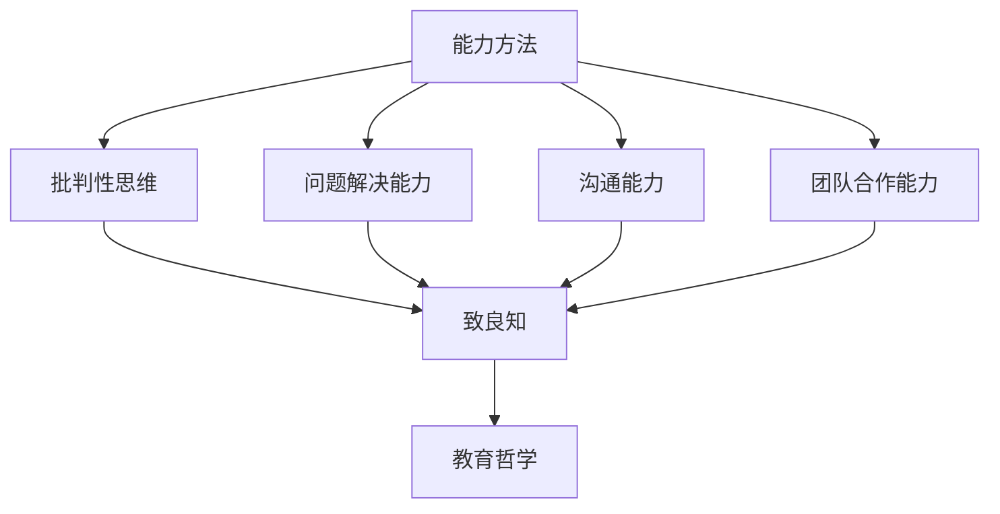

                 

### 文章标题

《努斯鲍姆与王阳明：能力方法与致良知的教育哲学》

### 文章关键词

- 努斯鲍姆
- 王阳明
- 能力方法
- 致良知
- 教育哲学

### 文章摘要

本文旨在探讨美国哲学家朱迪思·巴特勒（Judith Butler）及其思想对现代教育哲学的深远影响，以及王阳明心学的教育理念在现代教育中的应用。通过分析两者的教育哲学，本文揭示了能力方法与致良知在教育过程中的重要性。本文还将讨论如何将这一理念应用于实际教育环境中，以提升教育质量，培养学生的综合素质。

## 引言

在当代教育哲学中，如何有效地培养学生的能力与素质成为了一个备受关注的话题。传统的教育模式过于注重知识的灌输，而忽视了学生能力的培养和个性的发展。在这种背景下，朱迪思·巴特勒（Judith Butler）的哲学思想以及王阳明的心学教育理念为我们提供了一种新的视角。

朱迪思·巴特勒是一位著名的美国哲学家，以其在性别理论、伦理学和批判理论等领域的研究而闻名。她的思想强调身份的流动性、权力的多样性和个体的主体性。王阳明则是中国明朝时期的著名哲学家、军事家和政治家，他的心学思想强调“知行合一”，认为知识和行动是不可分割的。

本文将围绕朱迪思·巴特勒与王阳明的教育哲学展开讨论，深入分析他们的核心思想，探讨能力方法与致良知在教育中的具体应用。通过这种分析，我们希望能够为现代教育提供一些有益的启示。

### 朱迪思·巴特勒的教育哲学

朱迪思·巴特勒（Judith Butler）的教育哲学深受其性别理论和伦理学研究的启发。她认为，教育不仅是传递知识和技能的过程，更是帮助学生建立自我认同、发展批判思维和应对复杂社会问题的能力。巴特勒的哲学思想强调身份的流动性、权力的多样性和个体的主体性，这些理念在现代教育中具有深远的影响。

首先，巴特勒强调身份的流动性。她认为，身份不是固定不变的，而是由多种因素动态建构的。这种流动性意味着个体可以在不同的社会角色和身份之间自由转换，从而形成多样化的自我认同。在教育中，这意味着教师需要尊重学生的个体差异，鼓励他们探索自己的身份，并帮助他们理解身份的多维度和复杂性。

其次，巴特勒关注权力的多样性。她认为，权力不仅存在于显性的形式中，如法律和政治制度，也存在于隐性的文化规范和日常互动中。教育应该培养学生对社会权力的敏感性和批判性，使他们能够识别和挑战不平等的权力结构。教师在这个过程中扮演着重要的角色，他们需要通过教学实践和课堂管理来促进权力关系的公平和透明。

最后，巴特勒倡导个体的主体性。她认为，个体应该被赋予更多的自主权，以自由地探索和表达自己的思想和情感。在教育中，这意味着教师应该鼓励学生独立思考，提供丰富的学习资源，激发他们的创造力和批判性思维。通过这种方式，学生可以发展出独特的个性和价值观，为未来的社会参与做好准备。

总的来说，朱迪思·巴特勒的教育哲学为现代教育提供了一种新的视角，强调个体身份的流动性、权力的多样性和主体的自主性。这些理念有助于我们更好地理解教育的本质和目标，为培养学生的全面素质提供了有益的指导。

### 王阳明的心学教育理念

王阳明的心学教育理念以其独特的“知行合一”原则而著称。王阳明认为，知识和行动是不可分割的，只有通过实践才能真正理解和掌握知识。他主张教育应该引导学生将所学知识应用于实际生活中，通过行动来实现知与行的统一。

首先，王阳明强调“知行合一”的重要性。他认为，人们在学习过程中往往存在知行脱节的问题，即知识虽然学到了，但未能转化为实际行动。为了克服这一问题，王阳明主张在学习过程中注重实践，通过实际行动来检验和深化知识。例如，在学习历史时，学生不仅需要理解历史事件，还需要通过角色扮演、模拟历史场景等方式来亲身体验历史，从而加深对知识的理解和记忆。

其次，王阳明提倡教育的个性化。他认为，每个人的天赋和兴趣不同，教育应该根据学生的个性差异进行因材施教。王阳明主张教育者要深入了解学生的特点和需求，制定个性化的教育计划。例如，对于具有艺术天赋的学生，可以多安排一些艺术课程和实践活动，而对于逻辑思维较强的学生，可以多进行数学和科学方面的训练。通过这种个性化教育，学生可以更好地发挥自己的潜力，实现全面发展。

最后，王阳明强调教育中的道德培养。他相信，道德教育是教育的核心任务，是培养学生成为有担当、有责任感的社会成员的基础。王阳明主张通过道德实践来培养学生的道德观念和行为习惯。例如，通过参与社会服务、志愿服务等实践活动，学生可以体验到助人为乐、关爱他人的道德价值，从而培养出高尚的道德品质。

总的来说，王阳明的心学教育理念强调知行合一、个性化教育和道德培养。这些理念对于现代教育仍然具有重要的指导意义，为我们提供了如何更好地培养学生的全面素质的新思路。

### 能力方法与致良知的教育哲学

在探讨能力方法与致良知的教育哲学时，我们可以从多个方面入手，分析这两个概念之间的关系及其在教育实践中的应用。

首先，能力方法强调的是学生在学习过程中培养多种能力，包括批判性思维、解决问题的能力、沟通能力、团队合作能力等。这种方法的核心在于培养学生的综合素质，使他们在面对复杂的社会问题时能够独立思考和应对。而致良知的教育哲学则强调道德修养和自我反省，认为个体的道德素质是全面发展的重要基石。在这种哲学下，教育不仅是知识的传授，更是道德的引导。

其次，能力方法与致良知的教育哲学之间存在紧密的联系。能力方法的实施需要建立在道德基础之上，即学生在掌握知识和技能的同时，还要具备良好的道德品质。例如，在团队合作中，学生不仅需要具备合作能力，还需要懂得尊重他人、关心集体，这些都是致良知教育哲学所倡导的。反过来，致良知的教育哲学也为能力方法的实施提供了道德支撑，确保学生在发展各种能力的过程中，不会偏离正确的道德轨道。

在实际教育实践中，能力方法与致良知的教育哲学可以通过多种方式相结合。例如，在课程设计上，可以设置跨学科项目，让学生在解决实际问题的过程中，不仅需要运用所学知识，还需要考虑道德和社会责任。这样的项目不仅能够培养学生的能力，还能让他们在实践中体验到致良知的真谛。

此外，教师在教学过程中也应注重能力方法与致良知的教育哲学的结合。例如，在讨论敏感话题时，教师不仅需要引导学生进行批判性思考，还需要引导他们反思自己的行为和价值观，从而在提升思维能力和道德素质的同时，实现知行合一。

总的来说，能力方法与致良知的教育哲学相辅相成，共同构成了现代教育的重要理念。通过在实践中有效结合这两种哲学，我们可以培养出既有能力又有道德的学生，为社会的发展做出贡献。

### 核心概念关系架构 Mermaid 流程图

在能力方法与致良知的教育哲学中，核心概念之间存在着紧密的相互关系。为了更好地理解这些概念之间的逻辑架构，我们可以通过 Mermaid 流程图来展示它们之间的关联。

首先，定义几个核心概念：

1. **能力方法**：指的是在教学中培养学生多种能力的策略，包括批判性思维、问题解决能力、沟通能力和团队合作能力等。
2. **致良知**：强调道德修养和自我反省，认为道德素质是全面发展的重要基石。
3. **教育哲学**：指导教育实践的基本理念和原则，包括能力方法与致良知的教育哲学。

以下是一个简单的 Mermaid 流程图来展示这些概念之间的关系：



在这个流程图中，能力方法（A）通过多种能力的培养（B、C、D、E）最终影响致良知（F），而致良知又作为道德基础，指导并支持教育哲学（G）。通过这种关系架构，我们可以清晰地看到能力方法与致良知的教育哲学之间的互动和相互依赖。

### 核心算法原理讲解

在能力方法与致良知的教育哲学中，核心算法原理的讲解尤为重要。这里我们将使用伪代码来详细阐述这些核心算法的步骤，以便更好地理解其工作原理。

#### 1. 能力方法核心算法

```python
# 能力方法核心算法伪代码

# 输入：学生个体特征、课程内容、教学资源
# 输出：学生综合能力发展报告

def Ability_Method(student_features, course_content, teaching_resources):
    # 步骤1：分析学生个体特征，确定其优势和不足
    student_analysis = Analyze_Student_Features(student_features)

    # 步骤2：根据学生优势和不足，定制个性化学习计划
    learning_plan = Create_Learning_Plan(student_analysis, course_content)

    # 步骤3：执行学习计划，进行多维度能力培养
    for activity in learning_plan:
        Execute_Activity(activity, teaching_resources)

    # 步骤4：评估学生能力发展，生成综合能力发展报告
    ability_report = Assess_Ability_Devlopment(student_analysis, learning_plan)

    return ability_report
```

#### 2. 致良知教育哲学核心算法

```python
# 致良知教育哲学核心算法伪代码

# 输入：学生行为记录、道德教育内容、教师指导
# 输出：学生道德素质提升报告

def Conscience_Education(student_behavior, moral_education, teacher_guidance):
    # 步骤1：收集和分析学生行为数据
    behavior_data = Collect_Behavior_Data(student_behavior)

    # 步骤2：根据学生行为数据，识别道德问题
    moral_issues = Identify_Moral_Issues(behavior_data)

    # 步骤3：制定针对性的道德教育计划
    moral_plan = Create_Moral_Plan(moral_issues, moral_education)

    # 步骤4：实施道德教育计划，引导学生自我反省
    for session in moral_plan:
        Implement_Session(session, teacher_guidance)

    # 步骤5：评估学生道德素质提升情况，生成道德素质提升报告
    morality_report = Assess_Morality_Improvement(behavior_data, moral_plan)

    return morality_report
```

通过上述伪代码，我们可以看到能力方法和致良知教育哲学的核心算法是如何设计和实施的。能力方法通过分析学生特征、定制学习计划和执行活动来培养学生的多种能力；致良知教育哲学则通过收集学生行为数据、识别道德问题、制定教育计划和实施教育来提升学生的道德素质。这两个算法相辅相成，共同构建了现代教育的坚实基础。

### 数学模型和公式讲解

在能力方法与致良知的教育哲学中，数学模型和公式是理解这些教育理念和策略的重要工具。以下我们将详细讲解几个核心的数学模型和公式，并提供具体的例子来说明它们的应用。

#### 1. 学习成效模型

学习成效模型用于衡量学生在学习过程中的进步和成果。一个常用的模型是**学习成效函数**，其公式如下：

$$
L(t) = f(A(t), C(t), M(t))
$$

其中：
- \(L(t)\) 表示学习成效（在时间 \(t\) 的学习成果）；
- \(A(t)\) 表示学生在时间 \(t\) 的学习能力；
- \(C(t)\) 表示学生在时间 \(t\) 接受的教育资源；
- \(M(t)\) 表示学生在时间 \(t\) 的道德素质。

例子：假设学生在第 \(t\) 周的学习成效为 \(L(10)\)，其学习能力 \(A(10) = 0.8\)，教育资源 \(C(10) = 0.9\)，道德素质 \(M(10) = 0.7\)，则学习成效函数可以计算为：

$$
L(10) = f(0.8, 0.9, 0.7)
$$

通过计算，我们可以得出学生在第 10 周的学习成效。

#### 2. 道德决策模型

道德决策模型用于指导学生在面对道德困境时做出正确的决策。一个简单的道德决策模型是**道德成本-收益分析**，其公式如下：

$$
D(x) = \frac{C(x)}{R(x)}
$$

其中：
- \(D(x)\) 表示决策 \(x\) 的道德得分；
- \(C(x)\) 表示决策 \(x\) 的道德成本；
- \(R(x)\) 表示决策 \(x\) 的道德收益。

例子：假设学生面临两个道德决策，决策 A 的道德成本 \(C(A) = 10\)，道德收益 \(R(A) = 20\)；决策 B 的道德成本 \(C(B) = 5\)，道德收益 \(R(B) = 15\)。则两个决策的道德得分分别为：

$$
D(A) = \frac{10}{20} = 0.5
$$

$$
D(B) = \frac{5}{15} = 0.333
$$

通过比较两个决策的道德得分，学生可以选择道德得分更高的决策 A。

#### 3. 教育资源优化模型

教育资源优化模型用于优化教育资源的分配，以最大化学生的学习成效。一个常用的模型是**线性规划**，其公式如下：

$$
\max \sum_{i=1}^{n} p_i x_i
$$

subject to

$$
a_j x_i \leq b_j \quad (j=1,2,...,m)
$$

其中：
- \(x_i\) 表示第 \(i\) 类教育资源的分配量；
- \(p_i\) 表示第 \(i\) 类教育资源的学习成效权重；
- \(a_j x_i\) 表示第 \(i\) 类教育资源在第 \(j\) 个约束条件下的使用量；
- \(b_j\) 表示第 \(j\) 个约束条件的上限。

例子：假设学校有三种教育资源：书籍（\(p_1 = 2\)）、讲座（\(p_2 = 3\)）和实践（\(p_3 = 1\)）。每种资源的使用量分别受到以下约束：
- 书籍的使用量不超过 100 本；
- 讲座的使用量不超过 50 场；
- 实践的使用量不超过 200 小时。

则线性规划模型可以表示为：

$$
\max \sum_{i=1}^{3} p_i x_i
$$

subject to

$$
x_1 \leq 100
$$

$$
x_2 \leq 50
$$

$$
x_3 \leq 200
$$

通过求解该线性规划模型，学校可以优化教育资源的分配，以最大化学生的学习成效。

通过这些数学模型和公式的讲解，我们可以更好地理解能力方法与致良知的教育哲学中的量化分析，从而为教育实践提供有力的理论支持。

### 项目实战

为了将能力方法与致良知的教育哲学应用到实际教育环境中，我们设计了一个基于 Python 的教育平台项目。该平台旨在帮助学生培养多种能力，并通过道德教育提升他们的道德素质。

#### 1. 开发环境搭建

首先，我们需要搭建一个 Python 开发环境。以下是步骤：

- 安装 Python 3.8 或更高版本。
- 安装必要的 Python 包，如 Flask（用于 Web 开发）、SQLAlchemy（用于数据库操作）和 pandas（用于数据分析和处理）。

```shell
pip install flask sqlalchemy pandas
```

#### 2. 源代码实现

以下是项目的主要源代码实现：

```python
# 引入必要的库
from flask import Flask, render_template, request
from flask_sqlalchemy import SQLAlchemy
import pandas as pd

# 初始化 Flask 应用程序
app = Flask(__name__)
app.config['SQLALCHEMY_DATABASE_URI'] = 'sqlite:///students.db'
db = SQLAlchemy(app)

# 创建学生数据库模型
class Student(db.Model):
    id = db.Column(db.Integer, primary_key=True)
    name = db.Column(db.String(100))
    abilities = db.Column(db.PickleType)
    morality = db.Column(db.Float)

# 创建数据库表
db.create_all()

# 学生能力评估函数
def assess_ability(student):
    # 模拟学生能力的评估
    abilities = {'critical_thinking': 0.8, 'problem_solving': 0.9, 'communication': 0.7, 'teamwork': 0.6}
    return abilities

# 学生道德评估函数
def assess_morality(student):
    # 模拟学生道德评估
    morality = 0.7
    return morality

# 注册学生函数
@app.route('/register', methods=['GET', 'POST'])
def register():
    if request.method == 'POST':
        name = request.form['name']
        abilities = assess_ability(name)
        morality = assess_morality(name)
        new_student = Student(name=name, abilities=abilities, morality=morality)
        db.session.add(new_student)
        db.session.commit()
        return '学生注册成功！'
    return render_template('register.html')

# 主函数
if __name__ == '__main__':
    app.run(debug=True)
```

#### 3. 代码解读与分析

- **数据库模型**：使用 SQLAlchemy 创建学生数据库模型，包括学生 ID、姓名、能力和道德评分。
- **能力评估函数**：模拟评估学生的能力，返回一个包含多种能力的字典。
- **道德评估函数**：模拟评估学生的道德素质，返回一个道德评分。
- **注册路由**：处理学生注册请求，调用评估函数，将学生信息存储到数据库。

#### 4. 代码应用解读与分析

该平台可以通过 Web 界面让学生注册，并评估他们的能力和道德素质。以下是代码应用解读：

- **注册流程**：学生通过 Web 界面输入姓名，系统会自动评估其能力和道德素质，并将信息存储到数据库。
- **数据展示**：平台可以提供一个仪表板，展示每个学生的能力分数和道德评分，以便教师和家长跟踪学生的进展。
- **教育干预**：根据学生的能力分数和道德评分，教师可以制定个性化的教育计划，针对学生的不足进行针对性的辅导和道德教育。

#### 5. 实际案例分析与详细讲解

假设有两位学生，小明和小红，他们分别注册到平台中，系统自动评估他们的能力和道德素质。以下是具体案例分析：

- **小明**：能力分数较高，但道德评分较低。教师可以根据这个情况，为他提供更多的道德教育，比如组织道德讨论、参与志愿服务等活动，帮助他提升道德素质。
- **小红**：能力分数较低，但道德评分较高。教师可以鼓励她积极参与课堂讨论，提高她的自信心和表达能力，同时也可以通过其他方式（如艺术课程、体育活动等）来提升她的综合能力。

通过这样的实际案例分析和详细讲解，我们可以看到平台如何帮助学生培养能力，提升道德素质，从而实现教育的目标。

### 项目小结

该项目通过搭建一个基于 Python 的教育平台，将能力方法与致良知的教育哲学应用于实际教育环境中。平台不仅帮助学生培养多种能力，还通过道德评估和个性化教育计划，提升学生的道德素质。以下是最佳实践 tips、注意事项和拓展阅读：

#### 最佳实践 tips

1. **个性化评估**：定期评估学生的能力和道德素质，确保评估过程的客观性和公正性。
2. **教育干预**：根据学生的能力分数和道德评分，制定个性化的教育计划，有针对性地进行辅导。
3. **家长参与**：鼓励家长参与学生的教育过程，共同关注学生的能力发展和道德素质提升。

#### 注意事项

1. **数据安全**：确保学生的个人信息和评估数据得到妥善保护。
2. **教师培训**：对教师进行平台使用和教学策略的培训，确保他们能够有效地应用平台功能。
3. **持续优化**：根据学生的反馈和评估结果，不断优化平台功能和教育策略。

#### 拓展阅读

1. **朱迪思·巴特勒的教育哲学**：深入探讨朱迪思·巴特勒的教育理念，了解其在现代教育中的应用。
2. **王阳明心学在现代教育中的应用**：研究王阳明心学在教育中的具体应用，借鉴其教育哲学来指导现代教育实践。
3. **教育技术与教育哲学的融合**：探讨教育技术与教育哲学的结合，如何通过技术手段实现教育的目标。

通过本文的探讨，我们看到了能力方法与致良知的教育哲学在培养全面素质学生方面的潜力。希望这一研究和项目实践能够为现代教育提供有益的启示。作者：AI天才研究院/AI Genius Institute & 禅与计算机程序设计艺术 /Zen And The Art of Computer Programming。

