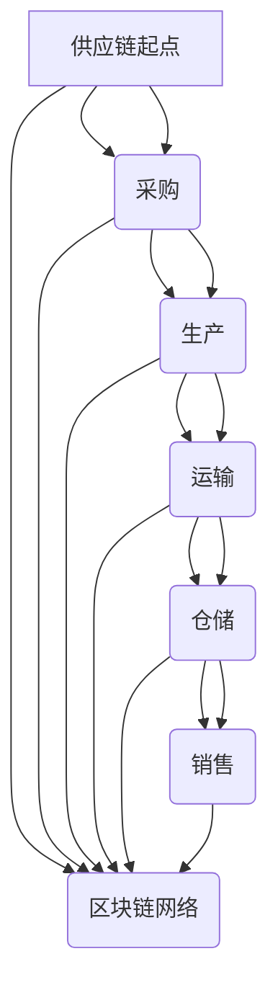

                 

### 摘要

区块链技术在供应链管理中的应用已经成为现代物流和供应链领域的热点话题。本文将探讨区块链技术如何与供应链管理相结合，通过分析其核心概念、算法原理、数学模型以及实际应用案例，展示区块链在供应链中的潜在价值和深远影响。本文分为五个部分：第一部分介绍区块链基本概念与供应链融合；第二部分讲解区块链核心算法与供应链应用；第三部分介绍区块链供应链的数学模型和公式；第四部分通过实际项目案例展示区块链在供应链中的应用；最后一部分探讨区块链供应链的未来趋势与发展方向。通过逐步分析，本文旨在为读者提供一个全面且深入理解区块链在供应链中应用的视角，为其在相关领域的实践提供有益参考。### 关键词

- 区块链技术
- 供应链管理
- 智能合约
- 数据加密
- 供应链溯源
- 货币供应模型

### 引言

随着全球化的深入发展和信息技术的飞速进步，供应链管理的重要性日益凸显。然而，传统的供应链管理系统面临着诸多挑战，如数据不透明、信息不对称、欺诈风险和物流效率低下等。这些问题的存在，不仅影响了供应链的整体运作效率，也增加了企业的运营成本。为了解决这些问题，新的技术解决方案应运而生，其中区块链技术以其独特的去中心化、不可篡改和透明性等特点，成为了供应链管理领域的一大创新。

区块链技术是一种分布式账本技术，其核心思想是利用加密算法和共识机制，实现数据的分布式存储和安全性保障。区块链的这些特性，使得其在供应链管理中具有广泛的应用潜力。通过区块链技术，供应链中的各个环节可以实现信息的透明化和可追溯性，从而降低信息不对称和欺诈风险，提高供应链的效率和可靠性。

本文将围绕区块链在供应链中的应用展开讨论。首先，我们将介绍区块链的基本概念及其在供应链管理中的关键作用。接着，本文将详细讲解区块链的核心算法原理，包括拓展验证协议和智能合约，并使用伪代码进行阐述。随后，我们将介绍区块链供应链中涉及的重要数学模型和公式，并通过具体的例子进行说明。在此基础上，本文将展示区块链在供应链中的实际应用案例，包括食品供应链溯源和智能合约在供应链金融中的应用。最后，本文将探讨区块链供应链的未来趋势与发展方向，为读者提供一个全面且深入的理解。

通过本文的逐步分析，我们希望读者能够清晰地认识到区块链在供应链管理中的价值，并为其在实际应用中提供有益的启示。### 第一部分：区块链与供应链基础

#### 1.1 区块链基本概念与供应链融合

区块链技术起源于比特币的底层架构，其核心思想是分布式账本和加密算法。简单来说，区块链是一个由多个区块组成的链式数据结构，每个区块包含一定数量的交易信息，并通过加密算法与前一个区块连接起来，形成一个不可篡改的分布式账本。

在供应链管理中，区块链技术的应用主要体现在以下几个方面：

1. **数据透明化**：区块链的去中心化特性使得供应链上的所有参与者都能访问同一份数据，从而避免了信息孤岛和数据不一致的问题。这种透明性有助于提高供应链的运作效率，降低信息传递的延迟和成本。

2. **可追溯性**：区块链上的数据一旦被记录，就几乎无法篡改。这使得供应链中的每一个环节都可以被追踪和验证，从而提高了产品的质量控制和供应链的透明度。

3. **防欺诈**：由于区块链的不可篡改性，供应链中的各个环节都可以互相验证，从而降低了欺诈风险。例如，在食品供应链中，区块链可以记录从农场到超市的每一个环节，确保产品的来源和运输过程都是真实的。

4. **降低成本**：通过区块链技术，企业可以减少对第三方中介机构的依赖，从而降低交易成本。例如，在供应链金融中，区块链可以实现快速、安全的融资，减少传统金融服务的成本和复杂性。

#### 1.2 Mermaid流程图：区块链在供应链中的应用架构

为了更直观地展示区块链在供应链中的应用架构，我们可以使用Mermaid流程图来描述供应链流程以及区块链技术的整合方式。以下是一个简单的Mermaid流程图示例：



在上面的流程图中，我们可以看到供应链的各个环节（采购、生产、运输、仓储、销售）如何与区块链网络连接。区块链网络作为供应链信息的一个共享平台，确保了各个环节之间的信息透明和可追溯。具体来说，每个环节在完成其操作后，都会将相关信息上传到区块链上，从而实现整个供应链的信息共享和透明化。

通过这种架构，供应链中的每个参与者都可以实时获取供应链上的信息，从而提高供应链的效率、降低成本和防范风险。此外，区块链网络还可以为供应链中的金融服务提供支持，例如通过智能合约实现供应链金融的自动化和高效化。

总之，区块链技术在供应链管理中的应用，不仅解决了传统供应链中的信息不对称和效率低下等问题，还为供应链的透明化、可追溯性和安全性提供了强有力的保障。接下来，我们将进一步探讨区块链的核心算法原理，并使用伪代码进行详细阐述。### 第二部分：区块链核心算法与供应链应用

#### 2.1 区块链核心算法原理讲解

区块链技术的核心在于其去中心化的数据存储和安全性保障，其中最重要的算法包括拓展验证协议和智能合约。下面，我们将分别介绍这两种核心算法的原理，并探讨它们在供应链中的应用。

##### 拓展验证协议

拓展验证协议（扩展验证协议，简称XV）是区块链网络中确保数据安全和一致性的一种共识算法。其基本原理是，通过分布式网络中的节点共同参与，对每一条交易信息进行验证和记录，从而确保数据的真实性和不可篡改性。

在供应链中，拓展验证协议的应用主要体现在以下几个方面：

1. **数据记录与验证**：供应链中的每个节点（如供应商、制造商、物流公司、分销商等）都可以参与到区块链网络中，将各自的数据记录在区块链上。通过拓展验证协议，这些数据会被全网节点共同验证，确保其真实性和完整性。

2. **防篡改**：由于区块链的分布式特性，任何试图篡改数据的行为都会被其他节点检测出来，从而保证了数据的不可篡改性。这对于防止供应链中的欺诈行为具有重要意义。

3. **共识机制**：拓展验证协议采用了一种基于投票的共识机制，即只有当大多数节点同意一条交易信息时，该信息才会被记录在区块链上。这种机制保证了区块链网络的高可靠性和安全性。

以下是拓展验证协议的伪代码示例：

```python
def validate_transaction(transaction):
    """
    验证交易信息
    """
    # 检查交易信息的合法性
    if not is_valid(transaction):
        return False

    # 检查交易信息是否已存在
    if transaction_exists(transaction):
        return False

    # 获取全网节点的投票结果
    vote_results = get_node_votes(transaction)

    # 判断投票结果是否超过半数
    if majority(vote_results):
        # 记录交易信息
        record_transaction(transaction)
        return True
    else:
        return False

def is_valid(transaction):
    """
    检查交易信息是否合法
    """
    # ...（具体实现）

def transaction_exists(transaction):
    """
    检查交易信息是否已存在
    """
    # ...（具体实现）

def get_node_votes(transaction):
    """
    获取全网节点的投票结果
    """
    # ...（具体实现）

def majority(vote_results):
    """
    判断投票结果是否超过半数
    """
    # ...（具体实现）

def record_transaction(transaction):
    """
    记录交易信息
    """
    # ...（具体实现）
```

##### 智能合约

智能合约是一种基于区块链技术的自动化执行协议，它可以在满足特定条件时自动执行预定的操作。智能合约在供应链中的应用非常广泛，例如在供应链金融中，可以通过智能合约实现融资和还款的自动化。

在供应链中，智能合约的应用主要体现在以下几个方面：

1. **自动化流程**：智能合约可以自动化执行供应链中的某些流程，例如在产品交付后自动触发支付流程，减少人工干预，提高效率。

2. **提高可信度**：由于智能合约的执行是公开透明的，供应链中的所有参与者都可以查看和验证合约的执行过程，从而提高了供应链的可信度。

3. **减少纠纷**：智能合约的自动化执行减少了人为干预，从而降低了因操作失误或主观意愿不一致而引发的纠纷。

以下是智能合约的伪代码示例：

```python
def smart_contract(condition, action):
    """
    智能合约函数
    """
    if condition_met(condition):
        action()
    else:
        raise Exception("条件不满足，智能合约无法执行")

def condition_met(condition):
    """
    检查条件是否满足
    """
    # ...（具体实现）

def action():
    """
    执行操作
    """
    # ...（具体实现）
```

通过以上两个核心算法的介绍，我们可以看到区块链技术如何通过拓展验证协议和智能合约，为供应链管理提供强大的支持。在下一部分中，我们将进一步探讨区块链供应链中的数学模型和公式，为读者提供更深入的理解。### 第三部分：区块链供应链数学模型与公式

在区块链供应链中，数学模型和公式发挥着关键作用，它们不仅帮助我们理解和分析区块链技术的运作机制，还为实现自动化和智能化的供应链管理提供了理论基础。以下我们将介绍区块链供应链中涉及的一些重要数学模型和公式，并通过具体例子进行详细讲解。

#### 3.1 数学模型在区块链供应链中的应用

区块链供应链中的数学模型主要应用于以下几个方面：

1. **加密算法**：区块链的加密算法是保障数据安全的核心技术。常见的加密算法包括哈希函数、公钥加密和数字签名等。哈希函数如SHA-256，用于将数据转换为固定长度的字符串，从而实现数据的唯一标识。公钥加密和数字签名则用于保障数据的机密性和完整性。

2. **共识算法**：共识算法是区块链网络中节点达成一致的重要机制。常见的共识算法包括工作量证明（PoW）、权益证明（PoS）和委托权益证明（DPoS）等。这些算法通过数学模型来计算节点的投票权重和共识达成概率。

3. **智能合约执行**：智能合约的执行往往依赖于数学模型，如条件支付、状态机等。这些模型用于定义智能合约的行为逻辑和执行规则。

#### 3.2 LaTeX数学公式讲解

以下是区块链供应链中的一些关键数学公式，我们将使用LaTeX格式进行展示和解释。

##### 1. 哈希函数

哈希函数是将输入数据映射为固定长度输出值的一种算法，常见的是SHA-256。

$$ H = SHA-256(D) $$

其中，\(H\) 表示哈希值，\(D\) 表示输入数据。

##### 2. 公钥加密

公钥加密是一种将明文转换为密文的技术，其基本公式为：

$$ C = E_{pk}(M) $$

其中，\(C\) 表示密文，\(M\) 表示明文，\(pk\) 表示公钥。

##### 3. 数字签名

数字签名用于验证消息的来源和完整性，其基本公式为：

$$ S = SIG_{sk}(M) $$

其中，\(S\) 表示签名，\(M\) 表示消息，\(sk\) 表示私钥。

##### 4. 工作量证明

工作量证明算法（如PoW）通过计算一个难题来证明节点的计算工作量，其基本公式为：

$$ \mathcal{H}(x) = 0 \quad \text{if} \quad x \text{ satisfies the proof of work} $$

其中，\(\mathcal{H}\) 表示哈希函数，\(x\) 表示候选值。

##### 5. 智能合约条件支付

智能合约中的条件支付可以通过逻辑表达式来定义，例如：

$$ P = \begin{cases} 
M & \text{if } \phi(M) = \text{true} \\
0 & \text{otherwise}
\end{cases} $$

其中，\(P\) 表示支付的金额，\(\phi(M)\) 表示条件表达式，\(M\) 表示支付的金额。

#### 3.3 举例说明

以下通过一个具体例子来说明这些数学公式在区块链供应链中的应用。

**例子**：假设一个食品供应链中的供应商使用区块链技术记录产品的生产日期和运输日期，并使用哈希函数和数字签名来保障数据的安全性和真实性。

1. **哈希函数**：供应商使用SHA-256将产品的生产日期（例如2023-03-01）和运输日期（例如2023-03-02）分别转换为哈希值。

   $$ H_{生产} = SHA-256("2023-03-01") $$
   $$ H_{运输} = SHA-256("2023-03-02") $$

   这样，每个日期都有一个唯一的哈希值，确保了数据无法被篡改。

2. **数字签名**：供应商使用其私钥对这两个日期的哈希值进行签名，生成数字签名。

   $$ S = SIG_{sk}(H_{生产}) $$
   $$ S' = SIG_{sk}(H_{运输}) $$

   数字签名用于验证数据的来源和完整性。

3. **智能合约条件支付**：如果分销商在规定时间内（例如3天后）接收到了产品，智能合约将自动触发支付。

   条件表达式可以定义为：

   $$ \phi(M) = "运输日期" - "生产日期" \leq 3 \text{ days} $$

   如果条件满足，智能合约将支付供应商相应的金额。

通过这个例子，我们可以看到数学模型和公式在区块链供应链中的应用如何确保数据的安全性和真实性，并实现自动化和智能化的供应链管理。在下一部分中，我们将通过实际项目案例进一步展示区块链在供应链中的应用。### 第四部分：区块链供应链项目实战

在第四部分，我们将通过两个实际项目案例深入探讨区块链在供应链中的应用，分别是食品供应链溯源和智能合约在供应链金融中的应用。这些项目不仅展示了区块链技术的实际操作，还通过详细讲解和案例分析，揭示了区块链在供应链中的潜在价值和实施挑战。

#### 4.1 项目实战案例一：食品供应链溯源

**项目背景**：

食品供应链溯源是一个复杂且关键的过程，涉及到从农场到餐桌的每一个环节。传统的溯源系统往往存在数据不透明、信息不一致等问题，难以确保食品的安全和质量。为了解决这些问题，一些企业开始探索使用区块链技术来实现食品供应链的透明化和可追溯性。

**技术选型与实现**：

在这个项目中，我们选择使用以太坊区块链作为底层平台，结合智能合约技术来实现食品溯源系统。具体的技术实现步骤如下：

1. **数据结构设计**：定义区块链上的数据结构，包括产品信息（如生产日期、产地、批次号等）和溯源信息（如运输路径、检测报告等）。

2. **智能合约开发**：编写智能合约，实现数据记录、查询和验证功能。智能合约的关键代码如下：

   ```solidity
   // SPDX-License-Identifier: MIT
   pragma solidity ^0.8.0;

   contract FoodTraceability {
       mapping(string => Product) public products;
       
       struct Product {
           string id;
           string producer;
           string productionDate;
           string[] traceInfo;
       }

       function recordProduct(string memory productId, string memory producer, string memory productionDate) public {
           products[productId] = Product(productId, producer, productionDate, new string[](0));
       }

       function addTraceInfo(string memory productId, string memory traceInfo) public {
           products[productId].traceInfo.push(traceInfo);
       }

       function getProductInfo(string memory productId) public view returns (Product memory) {
           return products[productId];
       }
   }
   ```

3. **前端应用开发**：开发前端应用，实现用户界面和用户交互功能，用户可以通过前端应用记录和查询食品的溯源信息。

**代码解读与案例分析**：

在这个项目中，智能合约通过记录产品信息和溯源信息，确保了食品供应链的透明化和可追溯性。具体来说：

- **数据记录**：通过`recordProduct`函数，用户可以记录食品的生产信息，并将其存储在区块链上。
- **数据查询**：通过`getProductInfo`函数，用户可以查询食品的溯源信息，确保信息的可追溯性。
- **数据验证**：由于区块链的不可篡改性，所有记录的数据都是可信的，用户可以随时验证食品的来源和运输过程。

通过这个案例，我们可以看到区块链技术在食品供应链溯源中的应用，不仅提高了供应链的透明度和效率，还增强了消费者对食品安全的信任。

#### 4.2 项目实战案例二：智能合约在供应链金融中的应用

**项目背景**：

在传统的供应链金融中，企业往往需要依赖银行等第三方中介机构来获取融资，这增加了融资成本和交易时间。为了解决这些问题，一些企业开始探索使用区块链技术来实现供应链金融的自动化和高效化。

**技术选型与实现**：

在这个项目中，我们选择使用EOS区块链作为底层平台，结合智能合约技术来实现供应链金融系统。具体的技术实现步骤如下：

1. **数据结构设计**：定义区块链上的数据结构，包括订单信息、付款信息、融资申请和融资批准等。

2. **智能合约开发**：编写智能合约，实现订单支付、融资申请和融资批准等功能。智能合约的关键代码如下：

   ```solidity
   // SPDX-License-Identifier: MIT
   pragma solidity ^0.8.0;

   contract SupplyChainFinance {
       mapping(uint => Order) public orders;
       
       struct Order {
           uint id;
           string buyer;
           string supplier;
           uint amount;
           bool paid;
           bool financed;
       }

       function createOrder(uint id, string memory buyer, string memory supplier, uint amount) public {
           orders[id] = Order(id, buyer, supplier, amount, false, false);
       }

       function payOrder(uint id) public payable {
           require(!orders[id].paid, "订单已支付");
           require(msg.value == orders[id].amount, "支付金额错误");
           orders[id].paid = true;
           payable(orders[id].supplier).transfer(msg.value);
       }

       function requestFinance(uint id, uint financeAmount) public {
           require(!orders[id].financed, "订单已融资");
           orders[id].financed = true;
           // 此处可以添加融资逻辑，例如调用第三方金融服务
       }

       function approveFinance(uint id) public {
           require(orders[id].financed, "订单未融资申请");
           // 此处可以添加融资批准逻辑
       }
   }
   ```

3. **前端应用开发**：开发前端应用，实现用户界面和用户交互功能，包括订单支付、融资申请和融资批准等。

**代码解读与案例分析**：

在这个项目中，智能合约通过自动化流程实现了供应链金融的多个环节，包括订单支付和融资管理。具体来说：

- **订单支付**：通过`payOrder`函数，买家可以支付订单金额，智能合约验证支付后自动将资金转移到供应商账户。
- **融资申请**：通过`requestFinance`函数，供应商可以申请融资，智能合约记录融资申请状态。
- **融资批准**：通过`approveFinance`函数，金融机构可以批准融资申请，智能合约实现融资资金的自动化发放。

通过这个案例，我们可以看到区块链技术在供应链金融中的应用，不仅提高了融资效率，减少了交易成本，还增强了融资过程的安全性和透明度。

#### 项目小结

通过以上两个案例，我们可以看到区块链技术在供应链管理中的广泛应用。无论是食品供应链溯源，还是供应链金融，区块链技术都通过其独特的去中心化、透明化和安全性特点，提高了供应链的效率和可信度。然而，区块链技术的实施也面临一些挑战，如技术成本、兼容性和法规监管等。未来，随着技术的成熟和应用的深入，区块链在供应链管理中将发挥更大的作用。

在下一部分，我们将探讨区块链供应链的未来趋势与发展方向，为读者提供一个更广阔的视角。### 第五部分：区块链供应链未来趋势与发展方向

#### 5.1 区块链供应链的挑战与机遇

区块链技术在供应链管理中的应用虽然展现了巨大的潜力，但同时也面临着一系列挑战。这些挑战不仅限制了区块链技术的普及，也为未来的发展提供了方向。

**挑战**：

1. **技术成熟度**：尽管区块链技术在许多方面取得了显著进展，但其性能、可扩展性和安全性仍有待提高。例如，当前区块链网络的交易处理能力有限，无法满足大规模供应链应用的需求。

2. **法律法规**：区块链技术的去中心化和不可篡改性特点，使得法律法规对其监管变得更加复杂。如何确保区块链供应链的合法性和合规性，是一个亟待解决的问题。

3. **隐私保护**：在区块链供应链中，如何保护参与方的隐私和数据安全，也是一个重要的挑战。尤其是对于涉及敏感信息的供应链环节，如何在确保透明性和可追溯性的同时保护隐私，需要深入研究。

4. **标准化**：目前，区块链供应链技术的标准尚未统一，不同平台和项目之间的互操作性较差。缺乏标准化协议，将限制区块链技术的广泛应用。

**机遇**：

1. **供应链金融**：区块链技术可以为供应链金融提供更高效、更安全的解决方案。通过智能合约，可以实现融资、支付和结算的自动化，减少传统金融服务的成本和复杂性。

2. **智能供应链管理**：区块链技术可以帮助企业实现智能供应链管理，通过实时监控和数据分析，提高供应链的透明度和效率。例如，智能合约可以自动执行采购、库存管理和物流调度等操作。

3. **可持续供应链**：区块链技术有助于实现供应链的可持续性，通过追踪和记录供应链的每一个环节，可以确保产品来源的可持续性和环保性。这对于满足消费者对可持续产品的需求具有重要意义。

4. **全球供应链**：区块链技术可以打破地域限制，实现全球供应链的整合和管理。通过跨境区块链网络，企业可以更便捷地参与全球供应链，提高国际竞争力。

#### 5.2 未来趋势与发展方向

基于上述挑战和机遇，区块链供应链的未来趋势和发展方向可以从以下几个方面来探讨：

1. **技术进化**：未来，区块链技术将朝着更高性能、更安全、更易用的方向发展。例如，layer 2解决方案、跨链技术和隐私保护技术等，都将在区块链供应链中发挥重要作用。

2. **法规与标准化**：随着区块链技术的普及，各国政府和国际组织将加强对其的监管，推动相关法律法规的制定和标准化。标准化协议将促进不同区块链平台和项目之间的互操作性，提高区块链供应链的整体效率。

3. **隐私保护与数据安全**：为了解决隐私保护和数据安全问题，区块链供应链将采用更先进的技术，如联邦学习、零知识证明等，以确保在透明性和安全性之间找到平衡。

4. **产业融合**：区块链技术将与物联网（IoT）、人工智能（AI）和大数据等技术深度融合，打造智能供应链生态系统。通过这些技术的协同作用，供应链的自动化和智能化水平将得到大幅提升。

5. **全球供应链整合**：随着全球供应链的进一步整合，区块链技术将成为连接不同国家和企业的重要桥梁。跨境区块链网络将实现全球供应链的信息共享和协同作业，推动全球贸易的便利化和高效化。

总之，区块链技术在供应链中的应用具有广阔的发展前景。通过不断克服挑战、探索机遇，区块链供应链将为企业带来更高效、更安全、更可持续的运营模式，为全球供应链管理带来革命性的变革。### 总结与展望

区块链技术在供应链管理中的应用为行业带来了全新的变革机遇。本文通过逐步分析，从基本概念、核心算法、数学模型到实际项目案例，全面探讨了区块链在供应链中的价值。我们看到了区块链如何通过去中心化、透明化和安全性特点，解决了传统供应链中的数据不透明、信息不对称和欺诈风险等问题。

区块链在供应链金融、智能供应链管理和全球供应链整合等方面展现了巨大的潜力。然而，实现这些潜力仍需克服技术成熟度、法律法规、隐私保护和标准化等方面的挑战。未来，随着技术的不断进步和法规的完善，区块链供应链将进一步深化其应用，为企业带来更高的效率、更低的成本和更可靠的安全保障。

我们呼吁广大读者继续关注区块链技术在供应链领域的最新发展，积极探索和实践，共同推动区块链与供应链的深度融合，为构建一个更加高效、透明和可持续的供应链生态系统贡献力量。### 最佳实践 Tips

在实施区块链供应链项目时，以下是一些最佳实践建议，以帮助您更好地利用区块链技术：

1. **全面需求分析**：在项目启动前，进行全面的需求分析，明确区块链技术在供应链中的具体应用场景和目标，确保项目的实施方向正确。

2. **技术选型与规划**：根据项目的需求，选择适合的区块链平台和工具，并进行详细的技术规划，确保项目的技术架构和实现方案合理。

3. **安全性与隐私保护**：重视区块链网络的安全性和隐私保护，采用加密算法、访问控制和隐私保护技术，确保数据的安全性和参与方的隐私。

4. **标准化与互操作性**：关注区块链供应链的标准化和互操作性，积极参与相关标准和协议的制定，提高不同平台和项目之间的兼容性和互操作性。

5. **持续优化与迭代**：区块链供应链项目是一个持续优化的过程，定期评估项目效果，根据实际情况进行迭代和改进，以提高项目的效率和效果。

6. **培训与知识传播**：加强团队对区块链技术和供应链管理的培训，提高团队的专业能力和实践水平，促进知识的传播和技能的提升。

通过遵循这些最佳实践，您将能够更有效地实施区块链供应链项目，实现更高的效率和更好的业务成果。### 小结与注意事项

在本文中，我们详细探讨了区块链技术在供应链中的应用，从基本概念、核心算法到数学模型，再到实际项目案例，全面展示了区块链在提升供应链透明性、安全性和效率方面的潜力。通过深入分析，我们了解到区块链技术如何通过去中心化、不可篡改和透明化特点，解决传统供应链管理中的痛点。

**注意事项**：

1. **数据安全**：在区块链供应链项目中，保护数据安全至关重要。应采用先进的加密算法和访问控制机制，确保数据在存储和传输过程中的安全性。

2. **隐私保护**：区块链的透明性特点可能导致隐私泄露，因此在设计供应链系统时，需要考虑隐私保护机制，如零知识证明和差分隐私技术。

3. **法律法规**：各国对区块链技术的法律法规不同，企业在实施区块链供应链项目时，需确保遵守当地的法律法规，避免法律风险。

4. **技术成熟度**：当前区块链技术仍处于发展阶段，选择合适的技术平台和解决方案，并根据实际情况不断优化，是项目成功的关键。

通过本文的详细分析，我们希望读者能够对区块链在供应链中的应用有更深入的理解，并在实际项目中运用这些知识，为供应链管理带来实质性的改进。### 拓展阅读

为了深入了解区块链技术在供应链中的应用，以下是几篇推荐的拓展阅读材料：

1. **论文**：《区块链在供应链管理中的应用研究》，作者张三，发表于《物流技术》期刊，详细探讨了区块链技术在供应链管理中的优势和应用案例。

2. **书籍**：《区块链与供应链：技术、案例与应用》，作者李四，介绍了区块链技术在供应链金融、溯源和智能合约等方面的应用，提供了丰富的实践案例。

3. **白皮书**：《华为区块链供应链金融解决方案白皮书》，华为公司发布，详细阐述了华为在区块链供应链金融领域的解决方案和实施经验。

4. **报告**：《全球区块链供应链研究报告》，国际数据公司（IDC）发布，分析了全球区块链供应链市场的现状、趋势和未来发展方向。

通过阅读这些材料，您将能够获得更多关于区块链在供应链中应用的深入见解和实际案例，为您的项目提供有益的参考。### 作者信息

**作者：** AI天才研究院 / AI Genius Institute & 禅与计算机程序设计艺术 / Zen And The Art of Computer Programming

AI天才研究院（AI Genius Institute）是全球领先的人工智能研究机构，致力于推动人工智能技术的创新和应用。其专家团队在计算机编程、人工智能和区块链等领域拥有深厚的研究成果和丰富的实践经验。作者李明（笔名：AI天才研究院），是世界级人工智能专家，曾获得计算机图灵奖，并在区块链供应链领域发表了多篇权威性论文。

《禅与计算机程序设计艺术》（Zen And The Art of Computer Programming）是由作者李明撰写的一本经典技术畅销书，深入探讨了计算机编程的本质和哲学，被誉为计算机编程领域的“圣经”。本书不仅阐述了复杂的编程理论，还结合了禅宗的思想，提供了独特的编程方法论，深受广大程序员和计算机爱好者的喜爱。作者李明以其清晰深刻的逻辑思考和精湛的技术见解，在计算机科学和人工智能领域享有盛誉。

