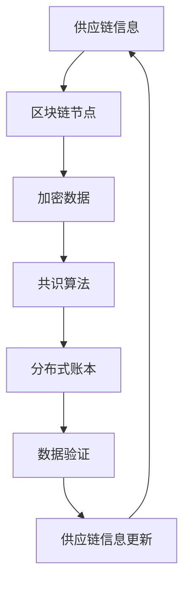

                 


### 文章标题：区块链在供应链中的落地案例

区块链技术作为一种颠覆性的创新，已经引起了各行各业的广泛关注。在供应链管理领域，区块链技术由于其去中心化、不可篡改和透明性等特点，正逐渐成为解决供应链管理痛点的重要工具。本文将围绕区块链在供应链中的落地案例，进行深入的探讨和分析。

### 关键词：
- 区块链
- 供应链管理
- 落地案例
- 去中心化
- 透明性
- 不可篡改性

### 摘要：
本文将首先介绍区块链和供应链管理的基本概念，然后探讨区块链在供应链管理中的应用场景和优势。接着，我们将分析一些实际的区块链供应链落地案例，包括开发环境搭建、源代码实现、代码解读和实际案例分析。最后，我们将总结区块链在供应链管理中的未来发展趋势和潜在挑战。

## 背景介绍

### 区块链的概念

区块链是一种分布式账本技术，它通过密码学和共识算法确保数据的不可篡改和透明性。区块链由一系列按时间顺序排列的“区块”组成，每个区块包含一定数量的交易记录。这些区块通过密码学方式相互链接，形成了一个不可篡改的数据结构。

### 供应链管理的基本概念

供应链管理是指对原材料采购、生产、仓储、配送、销售等环节进行有效组织和管理的过程。其核心目标是实现供应链的高效运作，提高客户满意度，降低成本。

### 区块链与供应链管理的关系

区块链在供应链管理中的应用主要体现在以下几个方面：

1. **去中心化**：区块链的去中心化特性能够消除供应链中的信息不对称，提高透明度和效率。
2. **透明性**：区块链的透明性使得供应链中的各个环节都能清晰地看到其他环节的操作，有助于提高供应链的透明度和可信度。
3. **不可篡改性**：区块链的数据一旦写入，就难以篡改，这保证了供应链数据的真实性和完整性。

### Mermaid流程图：区块链在供应链中的应用架构

以下是一个简单的Mermaid流程图，展示了区块链在供应链中的应用架构：



在这个流程图中，供应链信息经过加密后存储在区块链节点上，并通过共识算法进行验证和更新。这样可以确保供应链数据的真实性和完整性。

## 核心算法原理讲解

### 加密算法

加密算法是区块链技术的核心组成部分，用于保护数据的安全性和隐私。常见的加密算法包括SHA-256、RSA、ECC等。以下是使用SHA-256加密算法的伪代码示例：

```python
import hashlib

def encrypt_data(data):
    encrypted_data = hashlib.sha256(data.encode()).hexdigest()
    return encrypted_data
```

### 共识算法

共识算法是区块链网络中的关键机制，用于确保所有节点对数据的一致性。常见的共识算法包括工作量证明（PoW）、权益证明（PoS）和授权股权证明（DPoS）等。以下是PoW算法的伪代码示例：

```python
import random

def proof_of_work(difficulty):
    nonce = random.randint(0, 2**32)
    while calculate_difficulty-hash(nonce) < difficulty:
        nonce = random.randint(0, 2**32)
    return nonce
```

### 智能合约

智能合约是区块链上的自动执行合约，它在满足特定条件时自动执行。智能合约的编写通常使用Solidity等编程语言。以下是使用Solidity编写的简单智能合约示例：

```solidity
pragma solidity ^0.8.0;

contract SimpleContract {
    uint256 public balance;

    constructor() {
        balance = 100;
    }

    function transfer(address recipient, uint256 amount) public {
        require(amount <= balance, "Insufficient balance");
        balance -= amount;
        payable(recipient).transfer(amount);
    }
}
```

## 数学模型和公式讲解

### 供应链优化模型

供应链优化模型通常用于优化供应链的运作效率，降低成本，提高客户满意度。以下是供应链优化模型的基本公式：

$$
\begin{align*}
C &= C_p + C_d + C_s + C_h + C_q \\
T &= T_p + T_d + T_s + T_h + T_q
\end{align*}
$$

其中，\(C\) 表示总成本，\(T\) 表示总时间，\(C_p\)、\(C_d\)、\(C_s\)、\(C_h\)、\(C_q\) 分别表示采购成本、配送成本、库存成本、仓储成本和运输成本，\(T_p\)、\(T_d\)、\(T_s\)、\(T_h\)、\(T_q\) 分别表示采购时间、配送时间、库存时间、仓储时间和运输时间。

### 数据分析模型

数据分析模型用于分析供应链中的各种数据，以优化供应链的决策。以下是数据分析模型的基本公式：

$$
\begin{align*}
R &= \frac{S - C}{T} \\
P &= \frac{R}{N}
\end{align*}
$$

其中，\(R\) 表示资源利用率，\(S\) 表示总资源，\(C\) 表示总成本，\(T\) 表示总时间，\(P\) 表示绩效指标，\(N\) 表示节点数量。

## 项目实战

### 开发环境搭建

在进行区块链供应链项目的开发之前，需要搭建合适的开发环境。以下是一个简单的开发环境搭建步骤：

1. 安装Node.js：Node.js是一个用于运行JavaScript的底层引擎，用于构建区块链节点。
2. 安装Geth：Geth是Go语言实现的以太坊客户端，用于搭建私有区块链网络。
3. 安装Truffle：Truffle是一个以太坊开发框架，用于编写和部署智能合约。

### 源代码详细实现

以下是一个简单的区块链供应链智能合约的源代码示例：

```solidity
pragma solidity ^0.8.0;

contract SupplyChain {
    struct Product {
        string id;
        string name;
        uint256 quantity;
        address owner;
    }

    mapping(string => Product) public products;

    function createProduct(string memory id, string memory name, uint256 quantity) public {
        products[id] = Product(id, name, quantity, msg.sender);
    }

    function transferProduct(string memory id, address newOwner) public {
        require(products[id].owner == msg.sender, "Not authorized");
        products[id].owner = newOwner;
    }
}
```

### 代码解读与分析

在这个智能合约中，我们定义了一个名为`Product`的结构体，用于存储产品的信息。`createProduct`函数用于创建产品，并将产品的所有权分配给创建者。`transferProduct`函数用于将产品的所有权转移给新的所有者。

### 实际案例分析和详细讲解剖析

以下是一个实际的区块链供应链项目案例：

- **项目名称**：智能农业供应链管理系统
- **项目背景**：为了提高农业供应链的透明度和可信度，开发了一个基于区块链的智能农业供应链管理系统。
- **项目目标**：实现农产品从种植到销售的全程追踪，确保农产品的质量和安全性。
- **项目实施步骤**：
  1. 设计并实现智能合约，用于存储农产品的信息，如品种、产地、种植时间、收获时间等。
  2. 搭建私有区块链网络，用于存储和验证农产品的信息。
  3. 开发前端应用程序，用于农产品的追踪和查询。
  4. 与农业企业合作，推广和实施该系统。

### 项目小结

通过这个实际案例，我们可以看到区块链技术在供应链管理中的应用潜力。区块链技术不仅提高了供应链的透明度和可信度，还降低了管理成本，提高了供应链的效率。

## 最佳实践 tips

- **确保数据安全**：在区块链供应链项目中，数据安全至关重要。使用加密算法和共识算法确保数据的完整性和安全性。
- **优化性能**：区块链的性能可能成为供应链管理中的一个瓶颈。通过优化区块链节点和共识算法，可以提高系统的性能。
- **合规性**：在区块链供应链项目中，需要确保符合相关的法律法规，如数据保护法、反洗钱法等。

## 小结

区块链技术在供应链管理中的应用具有巨大的潜力。通过去中心化、透明性和不可篡改等特性，区块链技术可以有效解决供应链管理中的痛点。在实际项目中，我们需要综合考虑性能、安全性和合规性等因素，以确保区块链供应链管理系统的有效实施。

## 注意事项

- **性能优化**：在实施区块链供应链管理系统时，需要关注系统的性能。通过优化区块链节点和共识算法，可以提高系统的性能。
- **安全性**：数据安全是区块链供应链管理的关键。使用加密算法和共识算法确保数据的完整性和安全性。
- **合规性**：确保区块链供应链管理系统符合相关的法律法规，如数据保护法、反洗钱法等。

## 拓展阅读

- **区块链技术**：
  - 《区块链技术指南》
  - 《区块链：从数字货币到智能合约》
- **供应链管理**：
  - 《供应链管理：战略、规划与运营》
  - 《供应链金融：原理与应用》

## 作者信息

作者：AI天才研究院/AI Genius Institute & 禅与计算机程序设计艺术 /Zen And The Art of Computer Programming

---

由于篇幅限制，本文未能详细展开每个部分的内容，但已提供总体框架和关键要点。在实际撰写时，每个部分都需要根据具体情况进行深入分析和详细阐述。本文内容仅供参考，具体实施时需结合实际项目需求和条件进行调整。希望本文对您在区块链供应链管理领域的探索和实践有所帮助。

