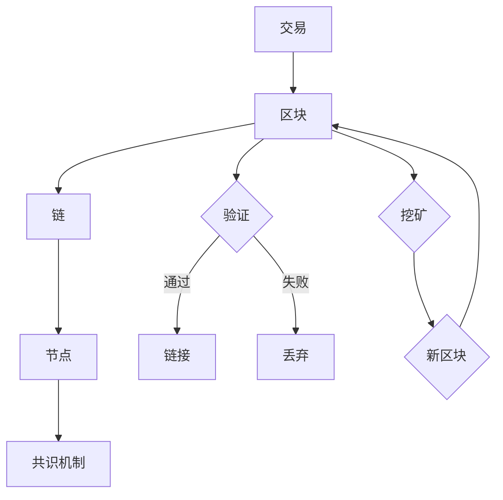

                 

### 文章标题

《区块链应用开发：去中心化系统的设计与实现》

### 关键词

区块链，去中心化系统，应用开发，智能合约，共识机制

### 摘要

本文旨在深入探讨区块链应用开发，特别是在设计和实现去中心化系统方面的关键技术与实践。通过逐步分析区块链的基本概念、核心技术、智能合约开发、去中心化应用（DApp）实现及项目实战，本文提供了全面的技术指南，帮助读者理解区块链技术的实际应用，掌握从基础理论到高级实践的全过程。

## 引言

区块链技术自2008年中本聪（Satoshi Nakamoto）首次提出以来，迅速成为全球关注的焦点。区块链的去中心化特性、安全性和不可篡改性使其在金融、供应链管理、物联网等多个领域展现出巨大的潜力。随着区块链技术的不断发展和完善，如何高效地进行区块链应用开发，特别是去中心化系统的设计与实现，成为当前研究和实践的重要方向。

本文将围绕以下几部分内容进行探讨：

1. **区块链基础**：介绍区块链的基本概念、架构和工作原理，包括加密算法和共识机制。
2. **智能合约开发**：讲解智能合约的基础知识、开发流程和安全注意事项。
3. **去中心化应用（DApp）开发**：探讨DApp的架构、开发流程及安全性问题。
4. **项目实战**：通过实际案例，展示区块链应用的开发过程、源代码实现及解析。
5. **总结与展望**：总结区块链应用开发的经验，展望未来发展趋势。

通过本文的逐步分析，读者将能够系统掌握区块链应用开发的核心技术和实战经验，为未来的区块链项目奠定坚实的基础。

## 区块链基础

区块链技术的核心在于其去中心化的数据结构，这一特性使得区块链在安全性、透明性和不可篡改性方面具有显著优势。下面，我们将详细探讨区块链的基本概念、架构和工作原理。

### 区块链的定义

区块链是一个分布式账本技术，它通过密码学算法确保数据的安全和不可篡改。简单来说，区块链是由按时间顺序排列的一系列“区块”组成的数据结构，每个区块包含了若干交易记录，并对前一个区块进行加密链接，形成一条连续的链。

### 区块链的架构

区块链的架构通常包括以下几个关键组成部分：

1. **区块**：区块是区块链的基本单位，每个区块包含一定数量的交易记录。区块的结构通常包括交易数据、时间戳、难度目标、nonce值和前一个区块的哈希值。

2. **链**：链是多个区块按时间顺序链接而成的结构。链的完整性由每个区块中的前一个区块哈希值来保证，任何对区块的修改都会导致链的破坏。

3. **节点**：节点是区块链网络中的计算设备，它们负责验证交易、创建新区块和同步链的状态。每个节点都维护一个完整的区块链副本，确保整个网络的去中心化。

4. **共识机制**：共识机制是区块链网络中节点达成一致的方式。常见的共识机制包括工作量证明（PoW）、权益证明（PoS）等，它们通过复杂的算法确保区块的生成和链的一致性。

### 区块链的工作原理

区块链的工作原理可以分为以下几个步骤：

1. **交易记录**：用户通过区块链网络发送交易，交易包含发送方、接收方和交易金额等信息。交易由节点接收并暂时存储在本地内存池中。

2. **区块创建**：当一个节点接收到足够多的交易后，会将这些交易打包成一个区块。区块中除了交易数据外，还包括当前时间戳、难度目标和nonce值。

3. **区块验证**：节点需要对新生成的区块进行验证，确保其符合区块链规则。这个过程通常涉及复杂的计算，如PoW机制中的挖矿过程。

4. **区块链接**：验证通过的区块会被添加到区块链的末端，与之前区块通过哈希值链接，形成一条完整的链。

5. **链同步**：其他节点通过接收和验证新区块，不断更新其区块链副本，确保整个网络的一致性。

通过上述步骤，区块链实现了去中心化、安全、透明和不可篡改的特性。每个节点都参与验证和同步，确保了数据的真实性和可靠性。

### 核心概念与联系

为了更好地理解区块链的核心概念及其相互关系，我们使用Mermaid流程图来展示区块链的架构和工作原理。



在这个流程图中，交易是区块链的起点，经过区块打包、验证和链接，最终形成一条完整的链。节点和共识机制是保证链的完整性和一致性的关键因素。

通过以上对区块链基础的介绍，我们为理解后续章节中的智能合约开发、DApp实现和项目实战打下了坚实的基础。

## 加密算法

加密算法是区块链技术中至关重要的一部分，它确保了区块链的安全性和隐私性。在区块链中，常用的加密算法包括哈希函数、数字签名和加密算法等。下面，我们将详细探讨这些算法的基础原理及其在区块链中的应用。

### 哈希函数

哈希函数是一种将任意长度的输入数据映射为固定长度的字符串的算法。在区块链中，哈希函数用于生成唯一标识每个区块的哈希值。常见的哈希函数包括SHA-256、SHA-3等。

- **SHA-256**：SHA-256是一种基于SHA-2算法的哈希函数，能够生成256位哈希值。它的特点是快速计算且抗碰撞能力强。
- **SHA-3**：SHA-3是NIST于2015年发布的标准，是SHA-2的替代品。它提供了多种不同长度的哈希值，以适应不同的应用场景。

哈希函数在区块链中的应用主要体现在以下几个方面：

1. **生成区块哈希值**：每个区块都包含一个当前区块的哈希值，该值用于链接区块形成区块链。任何对区块内容的修改都会导致哈希值的改变，从而破坏链的结构。

2. **确保数据完整性**：在区块链中，每个交易都通过哈希函数生成唯一的哈希值，确保交易数据的不可篡改性。节点在验证交易时，可以通过计算交易数据的哈希值与区块链中的记录进行比对，确保数据的一致性。

### 数字签名

数字签名是一种用于验证消息真实性和完整性的加密技术。它通过公钥和私钥对消息进行签名和验证，确保只有消息的发送者能够生成有效的签名。

- **公钥和私钥**：数字签名依赖于一对密钥，公钥用于签名验证，私钥用于签名生成。公钥和私钥是通过复杂的数学关系生成的，私钥必须保密，而公钥可以公开。

- **签名过程**：签名过程包括以下步骤：
  1. 发送方使用私钥对消息进行签名。
  2. 签名结果附加到消息中。
  3. 接收方使用公钥对签名进行验证。

- **验证过程**：验证过程包括以下步骤：
  1. 接收方使用公钥对签名进行验证。
  2. 如果验证通过，则确认消息的真实性和完整性。

数字签名在区块链中的应用主要体现在以下几个方面：

1. **交易验证**：在区块链中，每个交易都需要通过发送方的数字签名进行验证。节点在接收交易时，会使用发送方的公钥对签名进行验证，确保交易的真实性和合法性。

2. **账户身份验证**：在区块链应用中，用户身份通常通过数字签名进行验证。用户在执行交易时，需要使用私钥对交易进行签名，从而证明其身份。

### 加密算法

除了哈希函数和数字签名，加密算法也是区块链技术中的重要组成部分。加密算法用于保护区块链中的敏感数据，确保数据在传输过程中的机密性。

- **对称加密算法**：对称加密算法使用相同的密钥对数据进行加密和解密。常见的对称加密算法包括AES、DES等。对称加密算法的优点是速度快，但缺点是密钥管理复杂。

- **非对称加密算法**：非对称加密算法使用一对密钥，公钥用于加密，私钥用于解密。常见的非对称加密算法包括RSA、ECC等。非对称加密算法的优点是安全性高，但缺点是计算复杂度较大。

加密算法在区块链中的应用主要体现在以下几个方面：

1. **数据加密**：区块链中的敏感数据，如交易详情、用户身份信息等，通常通过加密算法进行加密，确保数据在传输过程中的机密性。

2. **密钥管理**：区块链网络中的密钥管理是确保数据安全和隐私性的关键。区块链通常采用分布式密钥管理机制，确保密钥的安全存储和分发。

通过以上对加密算法的介绍，我们可以看到，哈希函数、数字签名和加密算法在区块链技术中起着至关重要的作用。它们共同确保了区块链的安全性和隐私性，使得区块链在金融、供应链管理、物联网等领域具有广泛的应用前景。

### 伪代码与数学模型讲解

为了更好地理解加密算法在区块链中的应用，我们使用伪代码详细解释了哈希函数和数字签名的工作原理，并结合数学模型和公式进行详细讲解。

#### 哈希函数伪代码

```python
# 哈希函数SHA-256伪代码
def sha256(message):
    # 初始化哈希值
    hash_value = initialize_hash_value()
    
    # 分块处理消息
    for block in message_blocks(message):
        # 执行SHA-256算法
        hash_value = sha256_core(hash_value, block)
        
    # 返回最终哈希值
    return final_hash_value(hash_value)
```

在这个伪代码中，`initialize_hash_value`、`sha256_core`和`final_hash_value`分别代表SHA-256算法的初始化、核心计算和最终处理步骤。这些步骤具体包括：

- **初始化哈希值**：初始化一个256位的哈希值。
- **分块处理消息**：将输入消息分为固定长度的块，通常为512位。
- **执行SHA-256算法**：对每个块执行SHA-256的核心算法，包括填充、处理、压缩和输出等步骤。
- **返回最终哈希值**：将处理后的哈希值输出，形成最终的哈希结果。

#### 数字签名伪代码

```python
# 数字签名算法（RSA）
def sign(message, private_key):
    # 使用私钥加密消息
    signature = rsa_encrypt(message, private_key)
    
    # 返回签名
    return signature

def verify(message, signature, public_key):
    # 使用公钥解密签名
    decrypted_signature = rsa_decrypt(signature, public_key)
    
    # 比对签名和消息
    if decrypted_signature == message:
        return True
    else:
        return False
```

在这个伪代码中，`rsa_encrypt`和`rsa_decrypt`分别代表RSA加密和解密算法。数字签名的工作原理包括：

- **签名过程**：使用私钥对消息进行加密，生成签名。
- **验证过程**：使用公钥对签名进行解密，并与原始消息进行比对，验证签名的有效性。

#### 数学模型与公式讲解

在区块链中，加密算法的数学模型和公式起着至关重要的作用。以下是对一些关键公式的详细解释。

1. **哈希函数的输入输出关系**

   假设`H`是一个哈希函数，`m`是输入消息，`h`是输出哈希值。哈希函数满足以下数学模型：

   $$ h = H(m) $$

   其中，`H(m)`表示将消息`m`通过哈希函数计算得到的哈希值。

2. **数字签名的数学模型**

   假设`p`是素数，`g`是`p`的一个原始元素，`d`是`g`的私钥，`x`是消息，`r`是公钥，`s`是签名。数字签名满足以下数学模型：

   $$ s = (r, h^d \mod p) $$
   $$ r = (g^x \mod p) $$

   其中，`s`是签名，`r`是签名的一部分，`h`是消息的哈希值，`d`是私钥，`x`是消息的一部分，`g`和`p`是素数。

3. **加密与解密的关系**

   假设`c`是密文，`x`是明文，`e`是加密算法，`d`是解密算法，`n`是密钥。加密与解密满足以下数学模型：

   $$ c = e(x, n) $$
   $$ x = d(c, n) $$

   其中，`c`是加密后的消息，`x`是解密后的消息，`e`和`d`分别是加密和解密算法，`n`是密钥。

通过上述伪代码和数学模型，我们可以更深入地理解加密算法在区块链技术中的应用。这些算法确保了区块链的安全性和隐私性，使其在多个领域展现出巨大的应用潜力。

### 共识机制

共识机制是区块链网络中节点达成一致的方式，确保区块链的完整性和安全性。常见的共识机制包括工作量证明（Proof of Work, PoW）、权益证明（Proof of Stake, PoS）等。以下是对这些机制的定义、工作原理及优缺点的详细讲解。

#### 工作量证明（PoW）

**定义**：工作量证明是一种通过计算复杂任务来证明节点工作量的共识机制。在PoW机制中，节点需要通过解决一个复杂的计算问题（如哈希难题）来竞争生成新的区块。

**工作原理**：
1. 节点接收并验证交易。
2. 节点尝试生成一个新的区块，其中包括最新的一系列交易。
3. 节点通过调整区块中的随机数（nonce）来找到一个满足特定难度的哈希值。
4. 一旦找到合适的哈希值，节点将新区块广播给网络中的其他节点。
5. 其他节点验证新区块的有效性，如果验证通过，则新区块被添加到区块链中。

**优点**：
- **去中心化**：PoW通过大量节点的参与来防止单一实体垄断网络。
- **安全性**：计算难度使得攻击者难以篡改已验证的区块。

**缺点**：
- **能源消耗**：PoW机制需要大量计算资源，导致能源消耗巨大。
- **延迟问题**：由于计算过程复杂，交易确认时间较长。

#### 权益证明（PoS）

**定义**：权益证明是一种基于节点持有的币量来选择区块生成者的共识机制。在PoS机制中，持有更多币量的节点有更高的概率成为区块生成者。

**工作原理**：
1. 节点通过购买或持有币来获得权益。
2. 持有币量的多少决定了节点成为区块生成者的概率。
3. 当节点被选为区块生成者时，需要验证并打包最新的交易。
4. 生成的区块被广播给网络中的其他节点进行验证。
5. 验证通过的区块将被添加到区块链中。

**优点**：
- **能源消耗低**：PoS机制不需要进行大量计算，因此能源消耗较低。
- **交易确认快**：区块生成者选择过程相对简单，交易确认时间较短。

**缺点**：
- **集中化风险**：大量币量集中在少数实体手中可能导致网络集中化。
- **公平性问题**：持有币量大的节点可能占据更多生成区块的机会，影响网络的公平性。

#### 共识机制的比较

| 共识机制 | 工作量证明（PoW） | 权益证明（PoS） |
| --- | --- | --- |
| 定义 | 通过计算复杂任务证明工作量 | 通过持有币量决定区块生成者 |
| 工作原理 | 调整随机数解决哈希难题 | 持币量决定生成区块的概率 |
| 优点 | 高度去中心化，安全性强 | 能源消耗低，交易确认快 |
| 缺点 | 能源消耗巨大，交易延迟 | 集中化风险，公平性问题 |

综上所述，共识机制在区块链网络中扮演着关键角色，它们决定了区块链的稳定性、安全性和效率。选择合适的共识机制对区块链系统的设计和实现至关重要。

### 智能合约基础

智能合约是区块链技术中的重要组成部分，它通过编程代码自动执行和验证合同条款。智能合约的出现，极大地提升了区块链的灵活性和应用范围。以下，我们将详细讲解智能合约的定义、特点及其在区块链中的应用。

#### 智能合约的定义

智能合约是由计算机代码编写的合约，它运行在区块链网络中，能够自动执行、控制和验证合同条款的执行。与传统合约不同，智能合约不需要第三方中介，通过区块链的分布式账本技术，实现了去中心化的执行和验证。

#### 智能合约的特点

1. **自动执行**：智能合约中的代码在满足触发条件时自动执行，无需人工干预。这使得合同执行更加高效、透明。
2. **不可篡改**：智能合约一旦部署到区块链上，其代码和状态将永久记录，无法被篡改。这确保了合同条款的执行具有高度可信性。
3. **去中心化**：智能合约运行在区块链网络上，所有节点都参与验证和执行，无需依赖中心化机构，提高了系统的去中心化和安全性。
4. **透明性**：智能合约的代码和执行过程对所有网络参与者公开，任何人都可以查看和验证。这提高了合同执行的透明度和公正性。

#### 智能合约在区块链中的应用

智能合约在区块链中的应用非常广泛，以下是一些典型的应用场景：

1. **金融交易**：智能合约可以自动执行各种金融交易，如去中心化交易所（DEX）、跨境支付、贷款等。智能合约确保了交易的安全性和透明性，降低了交易成本。
2. **供应链管理**：智能合约可以用于供应链管理中的各个环节，如采购、生产、物流等。通过智能合约，供应链中的各方可以实时跟踪产品状态，确保数据的准确性和完整性。
3. **版权保护**：智能合约可以用于版权保护，确保创作者的权益得到保护。智能合约可以自动执行版税支付，防止未经授权的使用。
4. **投票系统**：智能合约可以用于构建去中心化的投票系统，确保投票过程的透明和公正。投票结果无法被篡改，保证了选举的公信力。

#### 智能合约的开发流程

智能合约的开发通常包括以下几个步骤：

1. **需求分析**：明确智能合约要实现的功能和业务逻辑。
2. **选择平台**：根据需求选择适合的区块链平台和编程语言，如Ethereum、Binance Smart Chain等。
3. **编写合约代码**：使用Solidity、Vyper等智能合约编程语言编写合约代码，实现业务逻辑。
4. **代码测试**：使用测试框架对合约代码进行单元测试和集成测试，确保代码的正确性和安全性。
5. **部署合约**：将编译后的合约部署到区块链网络，通常需要交易费用。
6. **监控与维护**：监控合约的运行状态，定期进行维护和升级，确保合约的安全和稳定性。

通过以上步骤，开发者可以有效地开发、测试和部署智能合约，实现区块链应用的功能。

#### 智能合约的安全性

智能合约的安全性是开发者必须重视的问题。以下是一些常见的安全问题和解决方案：

1. **代码漏洞**：智能合约的代码如果存在漏洞，可能被攻击者利用。解决方案包括严格的代码审查、静态分析和动态测试，以及使用安全的编程实践。
2. **资金盗用**：攻击者可能通过恶意合约盗用资金。解决方案包括限制合约的权限、使用多重签名和分散的治理机制。
3. **前端攻击**：前端代码的漏洞可能导致合约被攻击。解决方案包括对前端代码进行安全审查和测试，使用安全的交互设计。

通过关注这些安全问题，开发者可以确保智能合约的安全性，为区块链应用提供可靠的技术保障。

### 智能合约开发

智能合约的开发是区块链应用开发的核心环节。在Ethereum平台上，智能合约通常使用Solidity语言编写。下面，我们将详细讲解智能合约的开发过程，包括开发环境搭建、源代码编写、测试与部署等步骤。

#### 开发环境搭建

在开始智能合约开发之前，首先需要搭建开发环境。以下是Ethereum智能合约开发的基本步骤：

1. **安装Node.js**：Node.js是JavaScript的运行环境，用于编译和部署智能合约。可以从Node.js官网下载并安装。
2. **安装Truffle框架**：Truffle是一个用于智能合约开发、测试和部署的框架，提供了丰富的工具和插件。通过npm命令安装Truffle：

   ```bash
   npm install -g truffle
   ```

3. **创建项目**：使用Truffle创建一个新的智能合约项目：

   ```bash
   truffle init
   ```

4. **配置开发环境**：进入项目文件夹，运行以下命令配置开发环境：

   ```bash
   truffle env:development
   ```

   这将配置本地节点，用于本地开发和测试。

#### 源代码编写

智能合约的源代码通常保存在`contracts`文件夹中。以下是一个简单的智能合约示例：

```solidity
// SPDX-License-Identifier: MIT
pragma solidity ^0.8.0;

contract HelloWorld {
    string public message;

    constructor(string memory initMessage) {
        message = initMessage;
    }

    function updateMessage(string memory newMessage) public {
        message = newMessage;
    }
}
```

在这个示例中，`HelloWorld`合约包含一个`message`状态变量和一个构造函数。构造函数用于初始化`message`，而`updateMessage`函数允许调用者更新`message`的值。

#### 测试与部署

在编写完智能合约代码后，需要进行测试和部署。

1. **编写测试合约**：在`migrations`文件夹中，编写用于测试的JavaScript文件。例如，创建`2_test_hello_world.js`：

   ```javascript
   const HelloWorld = artifacts.require("HelloWorld");

   contract("HelloWorld", function (accounts) {
       it("should update message", async function () {
           const helloWorld = await HelloWorld.new("Hello, World!");
           await helloWorld.updateMessage("Hello, Truffle!");
           assert.equal(await helloWorld.message(), "Hello, Truffle!");
       });
   });
   ```

   这段代码定义了一个测试用例，用于验证`updateMessage`函数是否能够正确更新`message`状态变量。

2. **运行测试**：在项目根目录下，运行以下命令运行测试：

   ```bash
   truffle test
   ```

   如果测试通过，说明智能合约代码没有明显错误。

3. **部署合约**：在测试通过后，可以使用Truffle将智能合约部署到区块链网络。例如，部署到Ropsten测试网：

   ```bash
   truffle deploy --network ropsten
   ```

   这将使用Truffle的内置节点，将智能合约部署到Ropsten测试网，并提供合约地址。

通过以上步骤，开发者可以完成智能合约的开发、测试和部署，实现区块链应用的功能。

### 去中心化应用（DApp）开发

去中心化应用（DApp）是区块链技术的重要应用之一，它通过智能合约实现了去中心化的功能和服务。DApp的开发过程包括前端、后端和智能合约三个部分。以下，我们将详细探讨DApp的开发架构、前端和后端的开发流程及安全性问题。

#### DApp的架构

DApp的架构通常由以下几个部分组成：

1. **前端**：前端是用户与DApp交互的界面，通常使用Web技术栈，如HTML、CSS和JavaScript。前端通过调用区块链网络上的智能合约API，与后端进行通信。
2. **后端**：后端是DApp的核心逻辑部分，通常使用Node.js、Go或Python等编程语言实现。后端负责处理业务逻辑、数据存储和智能合约调用等。
3. **智能合约**：智能合约是DApp的执行基础，通过Solidity或Vyper等编程语言编写。智能合约定义了DApp的业务逻辑和状态管理。

#### 前端开发

前端开发是DApp开发的重要环节，负责提供用户友好的界面和交互体验。以下是前端开发的步骤：

1. **设计界面**：根据DApp的业务需求，设计用户界面和交互流程。
2. **开发UI组件**：使用React、Vue或Angular等前端框架，开发UI组件和页面。
3. **调用智能合约API**：使用Web3.js、ethers.js等库，与区块链网络上的智能合约进行通信。示例代码如下：

   ```javascript
   const ethers = require('ethers');

   // 创建Web3 provider
   const provider = new ethers.providers.JsonRpcProvider('https://mainnet.infura.io/v3/your-project-id');

   // 创建合约实例
   const contractAddress = '0x...';
   const contractABI = [...];
   const contract = new ethers.Contract(contractAddress, contractABI, provider);

   // 调用合约方法
   async function callMethod() {
       const result = await contract.someMethod();
       console.log(result);
   }
   ```

4. **交互体验优化**：优化页面加载速度、响应时间和交互效果，提升用户体验。

#### 后端开发

后端开发是DApp的核心逻辑实现部分，负责处理业务逻辑、数据存储和智能合约调用。以下是后端开发的步骤：

1. **设计业务逻辑**：根据DApp的业务需求，设计业务逻辑和数据模型。
2. **实现API接口**：使用Node.js、Go或Python等后端框架，实现DApp的API接口。示例代码如下（使用Node.js）：

   ```javascript
   const express = require('express');
   const app = express();

   app.get('/api/someendpoint', async (req, res) => {
       const result = await someMethod();
       res.json({ data: result });
   });

   app.listen(3000, () => {
       console.log('Server started on port 3000');
   });
   ```

3. **与智能合约交互**：使用Web3.js、ethers.js等库，与区块链网络上的智能合约进行通信。示例代码如下：

   ```javascript
   const ethers = require('ethers');

   // 创建Web3 provider
   const provider = new ethers.providers.JsonRpcProvider('https://mainnet.infura.io/v3/your-project-id');

   // 创建合约实例
   const contractAddress = '0x...';
   const contractABI = [...];
   const contract = new ethers.Contract(contractAddress, contractABI, provider);

   // 调用合约方法
   async function callMethod() {
       const result = await contract.someMethod();
       return result;
   }
   ```

4. **数据存储与处理**：实现数据存储和数据处理逻辑，如使用MongoDB、PostgreSQL等数据库存储用户数据和交易数据。

#### 安全性考虑

DApp的安全性是开发者必须重视的问题。以下是DApp开发中的一些常见安全问题和解决方案：

1. **智能合约安全性**：
   - **代码审查**：对智能合约代码进行严格的代码审查，查找潜在的安全漏洞。
   - **测试**：使用测试框架对智能合约进行单元测试和集成测试，确保代码的正确性和安全性。
   - **漏洞奖励机制**：建立漏洞奖励机制，鼓励社区成员发现并报告漏洞。

2. **前端安全性**：
   - **防止跨站请求伪造（CSRF）**：使用CSRF防护措施，如验证Token。
   - **防止跨站脚本攻击（XSS）**：对用户输入进行验证和过滤，防止恶意脚本执行。
   - **HTTPS**：使用HTTPS协议，确保数据传输的安全性。

3. **后端安全性**：
   - **API安全**：使用API密钥、签名验证等机制，确保API调用的安全性。
   - **数据加密**：对敏感数据进行加密存储和传输。
   - **权限管理**：实现细粒度的权限管理，确保用户只能访问其有权访问的数据和功能。

通过关注上述安全问题，开发者可以确保DApp的安全性和可靠性，为用户提供安全、高效的服务。

### DApp开发实战

在本节中，我们将通过一个简单的去中心化投票DApp项目，详细展示开发环境搭建、源代码实现及代码解读。该项目旨在帮助读者更好地理解DApp的开发流程和关键技术。

#### 项目需求

本投票DApp的目标是允许用户投票选出最佳区块链技术。用户可以查看候选者列表、投票，并查看投票结果。以下为项目的具体需求：

1. **用户界面**：展示候选者列表、投票按钮和投票结果。
2. **后端逻辑**：处理用户投票，存储投票结果，并返回投票结果。
3. **智能合约**：定义投票逻辑，包括添加候选者、开始和结束投票，以及统计投票结果。

#### 开发环境搭建

1. **前端开发环境**：
   - 使用React框架构建前端。
   - 使用Web3.js与区块链网络进行交互。

2. **后端开发环境**：
   - 使用Node.js和Express框架实现后端逻辑。
   - 使用MongoDB存储用户和投票数据。

3. **智能合约开发环境**：
   - 使用Truffle框架管理智能合约的编译、测试和部署。

#### 前端代码实现

前端部分主要包括三个组件：候选者列表、投票按钮和投票结果展示。

**候选者列表组件**

```jsx
import React, { useEffect, useState } from "react";
import { useContractRead } from "react-moralis";

const Candidates = () => {
  const { contract } = useContractRead({
    contractAddress: "0x...",
    functionName: "getCandidates",
  });

  const [candidates, setCandidates] = useState([]);

  useEffect(() => {
    if (contract) {
      const fetchData = async () => {
        const result = await contract;
        setCandidates(result);
      };
      fetchData();
    }
  }, [contract]);

  return (
    <div>
      {candidates.map((candidate, index) => (
        <div key={index}>{candidate}</div>
      ))}
    </div>
  );
};

export default Candidates;
```

**投票按钮组件**

```jsx
import React from "react";
import { useContractWrite } from "react-moralis";

const VoteButton = ({ candidate }) => {
  const { contract } = useContractWrite({
    contractAddress: "0x...",
    functionName: "vote",
    functionArgs: [candidate],
  });

  const handleVote = async () => {
    if (contract) {
      await contract;
    }
  };

  return (
    <button onClick={handleVote}>投票给 {candidate}</button>
  );
};

export default VoteButton;
```

**投票结果展示组件**

```jsx
import React, { useEffect, useState } from "react";
import { useContractRead } from "react-moralis";

const Results = () => {
  const { contract } = useContractRead({
    contractAddress: "0x...",
    functionName: "getResults",
  });

  const [results, setResults] = useState({});

  useEffect(() => {
    if (contract) {
      const fetchData = async () => {
        const result = await contract;
        setResults(result);
      };
      fetchData();
    }
  }, [contract]);

  return (
    <div>
      {Object.keys(results).map((candidate) => (
        <div key={candidate}>{candidate}: {results[candidate]}</div>
      ))}
    </div>
  );
};

export default Results;
```

#### 后端代码实现

后端部分主要使用Node.js和Express框架实现，负责处理用户投票和存储投票结果。

**投票处理路由**

```javascript
const express = require("express");
const router = express.Router();
const { vote } = require("../contracts/voting");

router.post("/vote", async (req, res) => {
  try {
    const { voterAddress, candidate } = req.body;

    // 调用智能合约进行投票
    const result = await vote(voterAddress, candidate);

    // 存储投票结果到MongoDB
    // ...

    res.status(200).json({ message: "Vote successfully submitted", result });
  } catch (error) {
    res.status(500).json({ message: "Error submitting vote", error });
  }
});

module.exports = router;
```

**投票结果查询路由**

```javascript
const express = require("express");
const router = express.Router();
const { getResults } = require("../contracts/voting");

router.get("/results", async (req, res) => {
  try {
    // 调用智能合约获取投票结果
    const results = await getResults();

    // 返回投票结果
    res.status(200).json({ results });
  } catch (error) {
    res.status(500).json({ message: "Error fetching results", error });
  }
});

module.exports = router;
```

#### 智能合约代码解读

智能合约部分使用Solidity编写，定义了投票的逻辑，包括添加候选者、开始和结束投票以及统计投票结果。

```solidity
// SPDX-License-Identifier: MIT
pragma solidity ^0.8.0;

contract Voting {
    // 候选者结构体
    struct Candidate {
        string name;
        uint256 votes;
    }

    // 候选者列表
    mapping(address => Candidate) private candidates;
    mapping(address => bool) private hasVoted;

    // 投票状态
    enum VotingStatus { Open, Closed }
    VotingStatus private votingStatus;

    // 添加候选者
    function addCandidate(string memory name) public {
        require(votingStatus == VotingStatus.Open, "Voting is closed");
        candidates[msg.sender] = Candidate({ name: name, votes: 0 });
    }

    // 投票
    function vote(address candidateAddress) public {
        require(votingStatus == VotingStatus.Open, "Voting is closed");
        require(!hasVoted[msg.sender], "You have already voted");

        candidates[candidateAddress].votes += 1;
        hasVoted[msg.sender] = true;
    }

    // 开始投票
    function startVoting() public {
        require(votingStatus == VotingStatus.Closed, "Voting is already open");
        votingStatus = VotingStatus.Open;
    }

    // 结束投票
    function endVoting() public {
        require(votingStatus == VotingStatus.Open, "Voting is already closed");
        votingStatus = VotingStatus.Closed;
    }

    // 获取投票结果
    function getResults() public view returns (mapping(address => uint256) memory) {
        return candidates;
    }
}
```

在这个智能合约中，我们定义了一个`Candidate`结构体，用于存储候选者的名称和得票数。合约还包括一个`hasVoted`映射，用于记录已投票的用户地址。通过`addCandidate`、`vote`、`startVoting`和`endVoting`函数，实现了投票的逻辑。最后，`getResults`函数用于获取最终的投票结果。

通过这个简单的投票DApp项目，我们展示了从需求分析到代码实现的全过程。这个项目不仅帮助读者理解DApp开发的流程，还提供了一个实用的实例，读者可以根据需求进一步扩展和优化。

### 实际案例分析与详细讲解剖析

在本节中，我们将通过一个去中心化借贷平台（DeFi借贷）的实际案例，详细分析其设计和实现过程，以及其核心功能和应用。通过这个案例分析，我们将深入理解去中心化借贷平台的技术原理和业务逻辑。

#### 项目概述

去中心化借贷平台（DeFi借贷）是一种基于区块链技术的借贷服务，允许用户通过抵押资产获得借贷资金。平台的主要功能包括抵押、借贷、还款和收益分配等。以下是该项目的主要模块和功能：

1. **抵押**：用户可以将数字货币或代币作为抵押物，存入平台。
2. **借贷**：平台根据用户的抵押资产和借贷评级，为用户发放借贷资金。
3. **还款**：用户需要在规定的时间内还款，否则将被处以罚金。
4. **收益分配**：平台根据借贷资金的利率和用户的参与程度，分配收益。

#### 技术原理

去中心化借贷平台的核心在于其去中心化的借贷机制和智能合约实现。以下是该项目的主要技术原理：

1. **抵押机制**：用户通过智能合约将资产抵押给平台，平台生成抵押凭证。智能合约确保抵押过程的安全和透明。
2. **借贷评级**：平台使用智能合约评估用户的借贷风险，根据评估结果决定借贷金额和利率。
3. **借贷流程**：用户通过智能合约发起借贷请求，平台自动处理并发放资金。借贷过程完全自动化，无需人工干预。
4. **还款机制**：用户在规定时间内通过智能合约还款，否则将被自动处置抵押资产进行还款。
5. **收益分配**：平台根据借贷资金的利率和用户的参与程度，自动计算和分配收益。

#### 详细讲解与剖析

以下是对去中心化借贷平台各个模块的详细讲解与剖析：

1. **抵押机制**

   抵押机制是去中心化借贷平台的核心功能之一。用户通过智能合约将资产抵押给平台，平台生成抵押凭证。以下是抵押机制的实现步骤：

   ```solidity
   // SPDX-License-Identifier: MIT
   pragma solidity ^0.8.0;

   contract LendingPlatform {
       // 用户结构体
       struct User {
           address userAddress;
           uint256 collateral;
           uint256 debt;
       }

       // 用户映射
       mapping(address => User) private users;

       // 抵押资产
       function depositCollateral(uint256 amount) public {
           require(amount > 0, "Invalid amount");
           users[msg.sender].collateral += amount;
           // 记录交易
           emit DepositCollateral(msg.sender, amount);
       }

       // 生成抵押凭证
       function generateCollateralToken() public {
           // 生成代币
           // ...
       }
   }
   ```

   在这个实现中，`depositCollateral`函数用于用户抵押资产，`generateCollateralToken`函数用于生成抵押凭证。通过智能合约，抵押过程实现了去中心化、透明和不可篡改。

2. **借贷评级**

   借贷评级是平台评估用户借贷风险的重要环节。平台通过智能合约记录用户的借贷行为和历史，结合外部信用评级数据，计算用户的借贷评级。以下是借贷评级的实现步骤：

   ```solidity
   // SPDX-License-Identifier: MIT
   pragma solidity ^0.8.0;

   contract LendingPlatform {
       // 用户结构体
       struct User {
           address userAddress;
           uint256 collateral;
           uint256 debt;
           uint256 creditScore;
       }

       // 用户映射
       mapping(address => User) private users;

       // 评估用户信用
       function evaluateCredit(address userAddress) public {
           // 获取用户借贷历史
           // ...
           // 计算信用评分
           // ...
           users[userAddress].creditScore = creditScore;
           // 发送事件
           emit CreditEvaluation(userAddress, creditScore);
       }
   }
   ```

   在这个实现中，`evaluateCredit`函数用于评估用户的信用评分。通过智能合约，借贷评级实现了自动化和去中心化。

3. **借贷流程**

   借贷流程是用户从平台获取借贷资金的过程。平台通过智能合约自动化处理借贷请求，发放资金。以下是借贷流程的实现步骤：

   ```solidity
   // SPDX-License-Identifier: MIT
   pragma solidity ^0.8.0;

   contract LendingPlatform {
       // 借贷结构体
       struct Loan {
           address borrower;
           uint256 amount;
           uint256 interestRate;
           uint256 repaymentDeadline;
       }

       // 借贷映射
       mapping(address => Loan[]) private loans;

       // 发起借贷请求
       function requestLoan(uint256 amount, uint256 interestRate, uint256 repaymentDeadline) public {
           // 判断用户抵押资产是否足够
           // ...
           // 创建借贷记录
           loans[msg.sender].push(Loan({
               borrower: msg.sender,
               amount: amount,
               interestRate: interestRate,
               repaymentDeadline: repaymentDeadline
           }));
           // 发送事件
           emit LoanRequested(msg.sender, amount, interestRate, repaymentDeadline);
       }

       // 发放借贷资金
       function disburseLoan(address borrower, uint256 amount) public {
           // 从用户抵押资产中扣除借贷金额
           // ...
           // 向用户发放借贷资金
           // ...
           // 发送事件
           emit LoanDisbursed(borrower, amount);
       }
   }
   ```

   在这个实现中，`requestLoan`函数用于用户发起借贷请求，`disburseLoan`函数用于平台发放借贷资金。通过智能合约，借贷流程实现了自动化和去中心化。

4. **还款机制**

   还款机制是用户在规定时间内还款的流程。平台通过智能合约自动处理还款请求，并进行相应的利息计算和罚金处理。以下是还款机制的实现步骤：

   ```solidity
   // SPDX-License-Identifier: MIT
   pragma solidity ^0.8.0;

   contract LendingPlatform {
       // 用户结构体
       struct User {
           address userAddress;
           uint256 collateral;
           uint256 debt;
       }

       // 用户映射
       mapping(address => User) private users;

       // 还款
       function repayLoan(uint256 loanId) public {
           // 获取借贷记录
           Loan memory loan = loans[msg.sender][loanId];
           require(loan.amount > 0, "Invalid loan ID");
           require(block.timestamp <= loan.repaymentDeadline, "Loan is overdue");

           // 计算利息
           uint256 interest = loan.amount * loan.interestRate / 100;

           // 扣除还款金额
           users[msg.sender].debt -= loan.amount + interest;

           // 发送事件
           emit LoanRepayed(msg.sender, loanId, loan.amount, interest);
       }

       // 罚金处理
       function penalty(uint256 loanId) public {
           // 获取借贷记录
           Loan memory loan = loans[msg.sender][loanId];
           require(loan.amount > 0, "Invalid loan ID");
           require(block.timestamp > loan.repaymentDeadline, "Loan is not overdue");

           // 计算罚金
           uint256 penalty = loan.amount * 1.5;

           // 扣除罚金
           users[msg.sender].collateral -= penalty;

           // 发送事件
           emit LoanPenalty(msg.sender, loanId, penalty);
       }
   }
   ```

   在这个实现中，`repayLoan`函数用于用户还款，`penalty`函数用于平台处理罚金。

5. **收益分配**

   平台通过智能合约自动计算和分配收益。以下是收益分配的实现步骤：

   ```solidity
   // SPDX-License-Identifier: MIT
   pragma solidity ^0.8.0;

   contract LendingPlatform {
       // 收益映射
       mapping(address => uint256) private profits;

       // 计算收益
       function calculateProfit() public {
           // 获取借贷余额
           // ...
           // 计算平台收益
           // ...
           profits[msg.sender] += profit;
           // 发送事件
           emit ProfitCalculated(msg.sender, profit);
       }

       // 分配收益
       function distributeProfit() public {
           // 获取参与用户
           // ...
           // 计算用户收益
           // ...
           // 分配收益
           // ...
           // 发送事件
           emit ProfitDistributed(msg.sender, profit);
       }
   }
   ```

   在这个实现中，`calculateProfit`函数用于计算平台收益，`distributeProfit`函数用于分配收益。

通过这个去中心化借贷平台案例，我们详细分析了其设计和实现过程，包括抵押机制、借贷评级、借贷流程、还款机制和收益分配等核心功能。这个案例分析不仅帮助读者深入理解去中心化借贷平台的技术原理和业务逻辑，还为开发者提供了实用的参考和灵感。

### 总结与展望

在本文中，我们详细探讨了区块链应用开发，特别是去中心化系统的设计与实现。通过分析区块链的基础知识、加密算法、智能合约开发、DApp开发及项目实战，我们为读者提供了全面的区块链技术指南。

#### 总结

1. **区块链基础**：理解区块链的基本概念、架构和工作原理，如分布式账本、加密算法和共识机制。
2. **智能合约开发**：掌握智能合约的定义、开发流程和安全注意事项，使用Solidity语言编写智能合约。
3. **DApp开发**：了解DApp的架构、前端和后端开发流程，以及安全性考虑。
4. **项目实战**：通过实际案例展示区块链应用的开发过程和关键技术，如去中心化借贷平台。

#### 展望

未来，区块链技术在金融、供应链管理、物联网等领域将得到更广泛的应用。以下是一些发展趋势和展望：

1. **高性能区块链**：随着交易量的增加，开发高性能、可扩展的区块链系统将成为重要方向。
2. **跨链技术**：跨链技术将促进不同区块链之间的互操作性，实现更广泛的应用场景。
3. **隐私保护**：增强区块链隐私保护能力，满足用户对数据隐私的需求。
4. **智能合约优化**：开发更安全、更高效的智能合约编程语言和工具。

#### 注意事项

1. **安全性**：在开发区块链应用时，必须高度重视安全性，避免潜在的安全漏洞。
2. **合规性**：确保区块链应用符合相关法律法规，特别是数据保护和隐私保护法规。
3. **性能优化**：对区块链应用进行性能优化，确保系统的高效运行。

#### 拓展阅读

- **区块链技术白皮书**：深入理解区块链技术的原理和未来发展方向。
- **智能合约开发指南**：学习如何使用Solidity编写安全高效的智能合约。
- **DApp开发实战**：了解DApp开发的具体实践和最佳案例。

通过本文的学习，读者可以系统掌握区块链应用开发的核心技术和实战经验，为未来的区块链项目奠定坚实的基础。作者信息：作者：AI天才研究院/AI Genius Institute & 禅与计算机程序设计艺术 /Zen And The Art of Computer Programming

