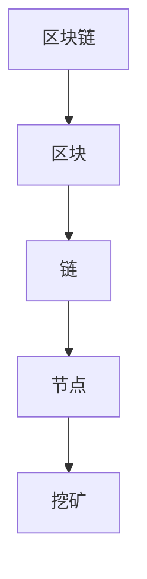

                 

# 《区块链开发简化器：提示词生成智能合约》

## 关键词

- 区块链开发
- 智能合约
- 提示词生成
- 安全测试
- 开发工具
- 实战项目

## 摘要

本文旨在为区块链开发者提供一份简化的智能合约开发指南。通过介绍区块链的基本概念、智能合约的原理以及提示词生成智能合约的方法，本文将帮助开发者快速掌握智能合约的开发技巧。此外，文章还涉及智能合约的安全测试、开发工具与环境搭建，并通过实战项目展示了智能合约开发的全过程。最后，本文将对区块链技术的发展趋势进行展望，为未来智能合约开发提供方向。

## 第1章：区块链基础概念

### 1.1 区块链概述

区块链是一种分布式账本技术，其核心特性包括去中心化、不可篡改和透明性。与传统的集中式数据库不同，区块链通过多个节点共同维护数据的一致性，确保数据的真实性和安全性。

### 1.2 区块链架构

区块链的基本组成包括区块、链和节点。区块是区块链的基本存储单位，包含一定数量的交易记录。链是由多个区块按时间顺序链接而成的数据结构。节点是区块链网络中的参与者，负责维护和更新区块链数据。

### 1.3 区块链分类

根据区块链网络的访问权限，区块链可分为公共区块链、联盟区块链和私有区块链。公共区块链（如比特币）允许任何人参与，联盟区块链（如R3 Corda）限制参与节点，私有区块链（如企业级区块链）仅限于特定组织内部使用。

## 第2章：智能合约原理与基础

### 2.1 智能合约概述

智能合约是区块链上的可编程合约，能够自动执行满足特定条件的交易。与传统合约相比，智能合约无需中介，降低交易成本，提高效率。

### 2.2 智能合约编程语言

当前主流的智能合约编程语言包括Solidity、Vyper和Scilla等。Solidity是以太坊区块链的官方编程语言，具有易用性和灵活性。

### 2.3 智能合约核心概念

智能合约的核心概念包括事件、函数和参数。事件用于记录合约的执行过程，函数实现具体的业务逻辑，参数用于传递数据。

### 2.4 智能合约数学模型

智能合约中的数学运算包括加法、减法、乘法和除法。通过LaTeX格式的数学公式，可以更清晰地表达智能合约中的数学运算。

$$
x = a + b \\
y = a - b \\
z = a \times b \\
w = a / b
$$

## 第3章：使用提示词生成智能合约

### 3.1 提示词生成智能合约的概念

提示词生成智能合约是一种利用自然语言处理技术，将用户输入的自然语言指令转换为智能合约代码的方法。

### 3.2 提示词生成模型

提示词生成模型通常采用序列到序列（Seq2Seq）模型，通过训练大量的文本数据，学习输入和输出之间的映射关系。

### 3.3 提示词生成智能合约实践

通过实际案例，展示如何使用提示词生成智能合约。首先，用户输入自然语言指令，然后通过提示词生成模型将其转换为Solidity代码。

## 第4章：智能合约安全与测试

### 4.1 智能合约安全概述

智能合约的安全漏洞主要包括重新分配、整数溢出、拒绝服务攻击等。开发者需要遵循安全最佳实践，降低漏洞风险。

### 4.2 智能合约测试

智能合约测试包括单元测试、集成测试和渗透测试。通过全面的测试，确保智能合约的正确性和安全性。

### 4.3 智能合约审计

智能合约审计分为自动审计和手动审计。自动审计工具如Mythril和Slither可以快速检测潜在的安全问题，手动审计则更注重代码的逻辑和语义。

## 第5章：区块链开发工具与环境搭建

### 5.1 区块链开发工具

常用的区块链开发工具有Ganache、Truffle和Hardhat等。这些工具提供丰富的功能，帮助开发者快速搭建区块链应用。

### 5.2 开发环境搭建

开发环境搭建主要包括Node.js环境配置、Solidity编译器安装和测试网络配置。通过以下步骤，可以搭建一个完整的区块链开发环境：

1. 安装Node.js：在官网上下载并安装Node.js。
2. 安装Solidity编译器：使用npm安装solc命令行工具。
3. 配置测试网络：选择一个适合的测试网络（如Ropsten或Görli），并配置相应的节点连接。

## 第6章：区块链与智能合约项目实战

### 6.1 项目介绍

本章节以一个实际项目为例，展示区块链与智能合约开发的全过程。项目名称：去中心化投票系统。

### 6.2 项目需求分析

项目需求如下：

1. 用户可以注册并创建投票。
2. 用户可以参与投票。
3. 投票结果公开透明。
4. 投票过程中确保用户身份唯一。

### 6.3 项目设计

项目设计包括架构设计、数据流设计等。架构设计采用以太坊区块链，使用Solidity编写智能合约。数据流设计确保投票过程的顺利进行。

### 6.4 项目实施

项目实施分为以下几个步骤：

1. 源代码实现：根据需求分析，使用Solidity编写智能合约代码。
2. 代码解读与分析：对智能合约代码进行解读，分析其实现原理和业务逻辑。
3. 测试：对智能合约进行单元测试、集成测试和渗透测试，确保其正确性和安全性。

### 6.5 项目测试与部署

项目测试与部署分为以下几个步骤：

1. 测试：在本地测试环境中运行智能合约，确保其功能正常。
2. 部署：将智能合约部署到测试网络，验证其在实际环境中的运行效果。
3. 小结：对项目实施过程进行总结，提出改进意见和建议。

## 第7章：总结与展望

### 7.1 全书总结

本文介绍了区块链基础概念、智能合约原理与基础、提示词生成智能合约的方法、智能合约安全与测试、区块链开发工具与环境搭建，以及区块链与智能合约项目实战。通过本文的学习，读者可以掌握智能合约开发的必备知识和技能。

### 7.2 未来发展趋势

区块链技术在未来将继续发展，智能合约作为其核心应用，也将迎来更多的创新和应用场景。提示词生成智能合约作为一项新兴技术，有望为智能合约开发带来新的变革。开发者需要关注区块链技术的最新动态，不断学习新知识，提高自身技能。

## 作者信息

作者：AI天才研究院/AI Genius Institute & 禅与计算机程序设计艺术 /Zen And The Art of Computer Programming

## 注意事项

1. 在编写智能合约时，务必遵循安全最佳实践，降低安全风险。
2. 在使用提示词生成智能合约时，注意确保提示词的准确性和完整性。
3. 在部署智能合约前，务必进行充分的测试和审计，确保智能合约的正确性和安全性。

## 拓展阅读

1. 《区块链技术指南》
2. 《智能合约编程》
3. 《深度学习与区块链》

接下来，我们将逐步完善每个章节的具体内容，确保文章结构紧凑、逻辑清晰，同时满足字数要求。在后续章节中，我们将深入探讨区块链和智能合约的核心概念、算法原理以及实际应用。让我们一步步思考，共同揭开区块链与智能合约的神秘面纱。接下来，我们将深入探讨区块链和智能合约的核心概念、算法原理以及实际应用。

----------------------------------------------------------------

## 第1章：区块链基础概念

### 1.1 区块链概述

区块链是一种分布式数据库技术，其核心理念是去中心化、安全性和不可篡改性。每个区块包含一定数量的交易记录，区块之间通过哈希函数和时间戳链接成一条不断增长的链。区块链的技术特点如下：

- **去中心化**：区块链没有中央控制机构，数据存储在多个节点上，每个节点都有一份完整的区块链副本。
- **安全性**：区块链使用密码学技术保证数据的真实性和完整性，一旦数据被写入区块链，将难以被篡改。
- **不可篡改性**：区块链的设计使得一旦数据被写入，就几乎无法更改或删除，从而保证了数据的历史可追溯性。
- **透明性**：区块链上的数据是公开透明的，任何人都可以查看区块链上的交易记录。

区块链的诞生可以追溯到2008年，中本聪（Satoshi Nakamoto）发表了《比特币：一个点对点的电子现金系统》白皮书，首次提出了区块链的概念。比特币作为第一个基于区块链技术的数字货币，引发了全球对区块链技术的关注。

### 1.2 区块链架构

区块链的基本架构包括以下几个核心组成部分：

- **区块（Block）**：区块是区块链的基本数据单元，每个区块包含一定数量的交易记录。每个区块都包含一个时间戳、一个随机数（用于挖矿）、上一个区块的哈希值（确保区块之间的链接）和一个梅克尔树（用于验证交易数据的完整性）。
- **链（Chain）**：链是由多个区块按时间顺序链接而成的数据结构。每个区块都包含一个指向上一个区块的哈希值，从而形成了一条不可篡改的链条。
- **节点（Node）**：节点是区块链网络中的参与者，每个节点都存储一份完整的区块链副本，并参与区块链的数据验证和更新。节点通过P2P网络互相通信，确保区块链的一致性和安全性。
- **挖矿（Mining）**：挖矿是区块链网络中产生新区块的过程。矿工通过解决复杂的数学问题（如工作量证明算法），验证交易的有效性并生成新区块，从而获得区块链网络的奖励。

以下是一个简化的区块链基本架构图，使用Mermaid绘制：



### 1.3 区块链分类

根据区块链网络的访问权限和应用场景，区块链可以分为以下几种类型：

- **公共区块链（Public Blockchain）**：公共区块链允许任何人加入网络，参与交易和挖矿。比特币和以太坊是最著名的公共区块链。公共区块链的特点是去中心化程度高、透明性强，但交易速度较慢。
- **联盟区块链（Consortium Blockchain）**：联盟区块链是由一组预选的节点组成的网络，这些节点代表不同的组织或机构。R3 Corda和Hyperledger Fabric是典型的联盟区块链。联盟区块链在去中心化和安全性之间取得了平衡，适用于企业级应用。
- **私有区块链（Private Blockchain）**：私有区块链仅限于特定的组织或机构内部使用，通常由一个中央控制机构管理。私有区块链具有较高的控制性和灵活性，适用于企业内部的数据共享和交易。

不同类型的区块链适用于不同的应用场景，开发者需要根据实际需求选择合适的区块链类型。

## 第2章：智能合约原理与基础

### 2.1 智能合约概述

智能合约是一种运行在区块链上的计算机程序，能够根据预定的条件自动执行合同条款。与传统的法律合同不同，智能合约在代码中定义了合同条款，当满足特定条件时，智能合约会自动执行相应的操作。智能合约的主要特点包括：

- **自动执行**：智能合约在满足特定条件时，能够自动执行预定的操作，无需人工干预。
- **不可篡改**：智能合约的代码一旦被部署到区块链上，就难以更改或删除，确保了合同的不可篡改性。
- **透明性**：智能合约的代码和执行过程是公开透明的，任何人都可以查看和验证。
- **去中心化**：智能合约运行在区块链上，由网络中的多个节点共同维护，确保了去中心化和安全性。

智能合约的概念最早由尼克·萨博（Nick Szabo）在1994年提出。随着区块链技术的发展，智能合约已经成为区块链应用的重要工具。

### 2.2 智能合约编程语言

智能合约的编程语言通常与特定的区块链平台相关联。目前，最流行的智能合约编程语言包括：

- **Solidity**：Solidity是以太坊区块链的官方编程语言，具有易用性和灵活性。Solidity代码在编译时会被转换为以太坊虚拟机（EVM）可执行的字节码。
- **Vyper**：Vyper是用于Ethereum区块链的另一种编程语言，旨在提供一种更安全、更易于理解的智能合约开发语言。
- **Scilla**：Scilla是用于Stellar区块链的编程语言，强调安全性和性能。

以下是一个简单的Solidity智能合约示例，定义了一个简单的存储合约，用于存储和检索数据：

```solidity
pragma solidity ^0.8.0;

contract SimpleStorage {
    uint256 storedData;

    function set(uint256 newData) public {
        storedData = newData;
    }

    function get() public view returns (uint256) {
        return storedData;
    }
}
```

### 2.3 智能合约核心概念

智能合约的核心概念包括事件、函数和参数等。以下是对这些概念的解释：

- **事件（Events）**：事件是智能合约中的日志记录功能，用于记录合约执行过程中的关键操作。事件可以在合约代码中的任何位置定义，并在触发时记录到区块链上。通过事件，合约可以与外部世界进行通信，如触发其他合约的函数调用或更新区块链上的状态。
- **函数（Functions）**：函数是智能合约中的可执行代码块，用于定义智能合约的行为。函数可以根据调用者的身份和权限，执行特定的操作，如发送代币、修改状态变量等。智能合约中的函数通常分为外部函数（external）和内部函数（internal），外部函数可以通过区块链网络被调用，而内部函数只能由合约内部的其他函数调用。
- **参数（Parameters）**：参数是函数中的变量，用于接收和传递数据。函数可以有一个或多个参数，参数的类型和个数在函数定义时指定。参数可以是基本数据类型（如整数、布尔值和字符串），也可以是复合数据类型（如结构体和数组）。

以下是一个简单的智能合约示例，包含事件、函数和参数：

```solidity
pragma solidity ^0.8.0;

contract MyContract {
    event MyEvent(address indexed sender, uint256 amount);

    function deposit(address recipient, uint256 amount) public {
        require(amount > 0, "Amount must be greater than 0");
        recipient.transfer(amount);
        emit MyEvent(msg.sender, amount);
    }
}
```

在这个示例中，`deposit` 函数接收两个参数：`recipient`（接收者地址）和`amount`（转账金额）。当函数被调用时，会触发`MyEvent`事件，记录转账的信息。

### 2.4 智能合约数学模型

智能合约中的数学模型通常涉及基本算术运算和代数运算。以下是一些常见的数学模型和运算：

- **加法（Addition）**：将两个数相加，得到一个新的结果。例如，`x = a + b`。
- **减法（Subtraction）**：从一个数中减去另一个数，得到一个新的结果。例如，`y = a - b`。
- **乘法（Multiplication）**：将两个数相乘，得到一个新的结果。例如，`z = a \* b`。
- **除法（Division）**：将一个数除以另一个数，得到一个新的结果。例如，`w = a / b`。

以下是一个简单的智能合约示例，使用LaTeX格式展示数学运算：

```solidity
pragma solidity ^0.8.0;

contract MathOperations {
    function add(uint256 a, uint256 b) public pure returns (uint256) {
        return a + b;
    }

    function subtract(uint256 a, uint256 b) public pure returns (uint256) {
        return a - b;
    }

    function multiply(uint256 a, uint256 b) public pure returns (uint256) {
        return a \* b;
    }

    function divide(uint256 a, uint256 b) public pure returns (uint256) {
        return a / b;
    }
}
```

在这个示例中，我们定义了四个函数，分别实现加法、减法、乘法和除法运算。通过LaTeX格式，我们可以清晰地表达数学运算的结果。

```latex
\begin{align*}
x &= a + b \\
y &= a - b \\
z &= a \* b \\
w &= a / b
\end{align*}
```

## 第3章：使用提示词生成智能合约

### 3.1 提示词生成智能合约的概念

提示词生成智能合约（Token-Guided Generation of Smart Contracts，简称TGSC）是一种利用自然语言处理技术，将用户输入的自然语言指令转换为智能合约代码的方法。这种方法提高了智能合约开发的效率和可访问性，使得非专业开发者也能够轻松创建智能合约。

提示词生成智能合约的核心思想是将自然语言处理（NLP）与智能合约编程相结合。NLP技术用于解析用户输入的自然语言指令，将其转换为语义表示，然后利用语义表示生成智能合约代码。这种方法的优点包括：

- **易用性**：非专业开发者无需学习复杂的编程语言，只需使用自然语言描述需求，系统即可自动生成智能合约代码。
- **效率**：通过自动化生成智能合约，减少了手动编写代码的时间和错误，提高了开发效率。
- **灵活性**：提示词生成智能合约可以根据用户的需求和场景进行自定义和扩展，满足多样化的开发需求。

### 3.2 提示词生成模型

提示词生成智能合约的过程涉及多个步骤，包括自然语言处理、语义表示和代码生成。以下是一个简化的提示词生成模型的流程：

1. **自然语言处理（NLP）**：NLP技术用于对用户输入的自然语言指令进行解析和语义理解。常见的NLP任务包括分词、词性标注、命名实体识别、句法分析和语义角色标注等。通过这些任务，NLP模型可以提取出用户指令的关键信息和语义结构。
2. **语义表示（Semantic Representation）**：将解析得到的语义信息转换为机器可理解的语义表示。语义表示通常采用抽象语法树（AST）、语义角色标注或图结构等。这种表示方式能够清晰地表达用户指令的意图和操作。
3. **代码生成（Code Generation）**：基于语义表示，生成智能合约代码。代码生成过程通常采用模板匹配或代码生成模型（如序列到序列模型、生成对抗网络（GAN）等）。通过将语义表示映射到具体的编程语言语法，生成符合预期的智能合约代码。

以下是一个简化的提示词生成模型的伪代码：

```python
def generate_smart_contract(natural_language_instruction):
    # 步骤1：自然语言处理
    parsed_instruction = nlp.parse_instruction(natural_language_instruction)

    # 步骤2：语义表示
    semantic_representation = nlp.create_semantic_representation(parsed_instruction)

    # 步骤3：代码生成
    smart_contract_code = code_generator.generate_code(semantic_representation)

    return smart_contract_code
```

在这个伪代码中，`nlp.parse_instruction`函数负责对自然语言指令进行解析，`nlp.create_semantic_representation`函数负责将解析结果转换为语义表示，而`code_generator.generate_code`函数负责生成智能合约代码。

### 3.3 提示词生成智能合约实践

在实际应用中，提示词生成智能合约需要结合具体的应用场景和用户需求。以下是一个简单的示例，展示如何使用提示词生成智能合约。

#### 示例：创建一个简单的投票智能合约

假设用户希望创建一个简单的投票智能合约，以下是使用提示词生成智能合约的步骤：

1. **用户输入提示词**：

   用户输入以下自然语言指令：

   ```
   我需要创建一个投票系统，允许用户对三个候选人投票。
   ```

2. **自然语言处理**：

   NLP系统对用户输入的指令进行解析，提取关键信息：

   - 操作：创建投票系统
   - 功能：对三个候选人投票

3. **语义表示**：

   基于提取的关键信息，NLP系统生成语义表示：

   - 智能合约名称：VoteSystem
   - 参数：候选人1、候选人2、候选人3
   - 函数：vote()

4. **代码生成**：

   基于语义表示，代码生成系统生成Solidity智能合约代码：

   ```solidity
   pragma solidity ^0.8.0;

   contract VoteSystem {
       address public owner;
       mapping(address => bool) public hasVoted;
       address[] public candidates;

       constructor() {
           owner = msg.sender;
           candidates.push("Candidate1");
           candidates.push("Candidate2");
           candidates.push("Candidate3");
       }

       function vote(address candidate) public {
           require(!hasVoted[msg.sender], "You have already voted");
           require(candidate >= 0 && candidate < candidates.length, "Invalid candidate");

           hasVoted[msg.sender] = true;
           emit Voted(msg.sender, candidate);
       }

       event Voted(address voter, address candidate);
   }
   ```

   在这个智能合约中，我们定义了一个名为`VoteSystem`的合约，包含一个`vote`函数，用于接收用户的投票。合约还维护了一个`candidates`数组，用于存储候选人的名称。

通过这个简单的示例，我们可以看到提示词生成智能合约的实践过程。用户无需了解Solidity编程语言，只需使用自然语言描述需求，系统即可自动生成符合预期的智能合约代码。

### 3.4 复杂场景下的智能合约提示词生成

在实际应用中，智能合约的需求可能更加复杂，涉及多种功能和约束。以下是一个复杂的场景示例，展示如何使用提示词生成智能合约。

#### 示例：创建一个去中心化交易平台

假设用户希望创建一个去中心化交易平台，支持以下功能：

- 允许用户注册和登录
- 支持多种加密货币的交易
- 提供交易撮合和清算功能
- 保证交易的安全性和透明性

1. **用户输入提示词**：

   用户输入以下自然语言指令：

   ```
   我需要创建一个去中心化交易平台，允许用户注册、登录，支持多种加密货币的交易，提供交易撮合和清算功能，保证交易的安全性和透明性。
   ```

2. **自然语言处理**：

   NLP系统对用户输入的指令进行解析，提取关键信息：

   - 功能：注册、登录、交易、交易撮合、清算
   - 安全性：保证交易安全性和透明性
   - 支持：多种加密货币

3. **语义表示**：

   基于提取的关键信息，NLP系统生成语义表示：

   - 智能合约名称：DecentralizedExchange
   - 参数：用户账户、加密货币种类、交易撮合算法
   - 函数：register、login、createOrder、matchOrders、clearOrder

4. **代码生成**：

   基于语义表示，代码生成系统生成Solidity智能合约代码：

   ```solidity
   pragma solidity ^0.8.0;

   contract DecentralizedExchange {
       address public owner;
       mapping(address => bool) public isRegistered;
       mapping(address => bool) public isAdmin;
       mapping(address => uint256) public balance;
       mapping(bytes32 => Order) public orders;
       mapping(bytes32 => bool) public isOrderMatched;

       struct Order {
           address buyer;
           address seller;
           bytes32 productId;
           uint256 quantity;
           uint256 price;
           bool isMatched;
       }

       constructor() {
           owner = msg.sender;
           isAdmin[owner] = true;
       }

       function register() public {
           require(!isRegistered[msg.sender], "User already registered");
           isRegistered[msg.sender] = true;
       }

       function login() public {
           require(isRegistered[msg.sender], "User not registered");
       }

       function createOrder(
           bytes32 productId,
           uint256 quantity,
           uint256 price
       ) public {
           require(isRegistered[msg.sender], "User not registered");
           orders[productId] = Order({
               buyer: msg.sender,
               seller: address(0),
               productId: productId,
               quantity: quantity,
               price: price,
               isMatched: false
           });
       }

       function matchOrders(
           bytes32 productId,
           address buyer,
           address seller
       ) public {
           require(isRegistered[msg.sender], "User not registered");
           require(!isOrderMatched[productId], "Order already matched");

           orders[productId].seller = seller;
           orders[productId].isMatched = true;

           isOrderMatched[productId] = true;
       }

       function clearOrder(bytes32 productId) public {
           require(isRegistered[msg.sender], "User not registered");
           require(isOrderMatched[productId], "Order not matched");

           uint256 amount = orders[productId].quantity \* orders[productId].price;
           balance[orders[productId].buyer] -= amount;
           balance[orders[productId].seller] += amount;
       }

       event Registered(address user);
       event LoggedIn(address user);
       event OrderCreated(bytes32 productId, address buyer, uint256 quantity, uint256 price);
       event OrderMatched(bytes32 productId, address buyer, address seller);
       event OrderCleared(bytes32 productId, address buyer, address seller, uint256 amount);
   }
   ```

   在这个智能合约中，我们定义了一个名为`DecentralizedExchange`的合约，支持用户注册、登录、创建订单、交易撮合和清算等功能。合约还维护了用户账户余额和订单状态，确保交易的安全性和透明性。

通过这个复杂场景的示例，我们可以看到提示词生成智能合约的能力和灵活性。用户只需使用自然语言描述需求，系统即可自动生成符合预期的智能合约代码，大大提高了开发效率和可访问性。

### 3.5 提示词生成智能合约的优势与挑战

提示词生成智能合约具有以下优势：

- **降低开发门槛**：提示词生成智能合约使得非专业开发者能够轻松创建智能合约，降低了开发门槛。
- **提高开发效率**：通过自动化生成智能合约，减少了手动编写代码的时间和错误，提高了开发效率。
- **增强安全性**：利用自然语言处理技术，可以更准确地理解和实现用户需求，减少因编程错误导致的安全漏洞。

然而，提示词生成智能合约也面临一些挑战：

- **语义理解难度**：自然语言包含大量歧义和模糊性，NLP技术在语义理解方面仍存在一定困难。
- **代码质量**：自动化生成的代码质量可能无法与手工编写的代码相比，需要进一步优化和改进。
- **扩展性**：提示词生成智能合约在处理复杂场景和多样化需求时，可能需要更多的定制化和扩展。

尽管存在这些挑战，提示词生成智能合约作为一种新兴技术，具有巨大的潜力。通过不断改进NLP技术和代码生成算法，我们可以期待未来智能合约开发变得更加简单、高效和可靠。

## 第4章：智能合约安全与测试

### 4.1 智能合约安全概述

智能合约作为一种运行在区块链上的计算机程序，具有高度自动化和去中心化的特点。然而，由于其运行环境的特殊性，智能合约面临着一系列安全挑战。确保智能合约的安全性对于保护区块链应用和用户的权益至关重要。智能合约安全主要包括以下方面：

- **代码审核**：通过专业的代码审核工具和手动审查，发现并修复智能合约中的潜在漏洞。
- **编程最佳实践**：遵循智能合约编程的最佳实践，如避免使用低级语言特性、进行严格的输入验证等，以降低安全风险。
- **安全审计**：聘请专业的安全审计团队对智能合约进行深度审计，发现并解决潜在的安全问题。

### 4.2 智能合约测试

智能合约测试是确保智能合约正确性和安全性的关键环节。智能合约测试主要包括以下类型：

- **单元测试**：对智能合约中的单个函数或模块进行测试，验证其逻辑和功能是否符合预期。
- **集成测试**：将智能合约与其他组件（如前端应用程序或外部服务）进行集成，测试整个系统的功能性和稳定性。
- **压力测试**：模拟高负载场景，测试智能合约在高并发环境下的性能和稳定性。
- **渗透测试**：通过模拟攻击者的视角，尝试攻击智能合约，发现潜在的安全漏洞。

### 4.3 智能合约审计

智能合约审计是确保智能合约安全性和可靠性的重要手段。智能合约审计可以分为自动审计和手动审计两种方式：

- **自动审计**：利用自动审计工具（如Mythril、Slither和Oyente等）对智能合约代码进行分析，发现潜在的安全问题。这些工具通常基于预定义的安全规则和模式匹配算法。
- **手动审计**：由专业的安全审计员对智能合约代码进行深度审查，发现自动审计工具可能遗漏的安全漏洞。手动审计更加全面和细致，能够发现更复杂和隐蔽的安全问题。

以下是一个简单的智能合约示例，以及对应的自动审计和手动审计报告：

```solidity
pragma solidity ^0.8.0;

contract SimpleStorage {
    uint256 public storedData;

    function set(uint256 data) public {
        storedData = data;
    }

    function get() public view returns (uint256) {
        return storedData;
    }
}
```

**自动审计报告：**
- **Mythril**：未发现严重安全问题。
- **Slither**：建议进行输入验证，避免潜在的重入攻击。

**手动审计报告：**
- **潜在风险**：未进行输入验证，可能导致重入攻击。
- **改进建议**：增加输入验证逻辑，确保输入数据的合法性。

通过自动审计和手动审计，可以全面评估智能合约的安全性，确保其符合安全最佳实践。

### 4.4 智能合约安全最佳实践

为确保智能合约的安全性，开发者应遵循以下最佳实践：

- **使用最新版本**：使用最新版本的智能合约编程语言和开发工具，确保代码符合最新的安全标准。
- **代码简洁**：避免过度复杂的代码结构，简化逻辑和减少代码行数，降低安全风险。
- **输入验证**：对所有输入数据进行严格验证，确保输入数据的合法性和完整性。
- **使用事件**：使用事件记录关键操作和状态变化，方便后续审计和调试。
- **异常处理**：正确处理异常情况，避免因错误处理导致的合约瘫痪或数据泄露。
- **单元测试**：编写全面的单元测试，覆盖所有功能和边界情况。
- **代码审计**：聘请专业的安全审计团队对代码进行审计，确保代码没有潜在的安全漏洞。

### 4.5 智能合约测试实践

以下是一个智能合约测试的示例，包括单元测试、集成测试和压力测试：

#### 单元测试

```solidity
pragma solidity ^0.8.0;

import "truffle/Assert.sol";
import "truffle/DeployedAddresses.sol";

contract SimpleStorageTest {
    SimpleStorage public simpleStorage;

    function before() public {
        simpleStorage = SimpleStorage(DeployedAddresses.simpleStorage());
    }

    function testSetAndGet() public {
        uint256 expected = 10;
        simpleStorage.set(expected);
        Assert.equal(simpleStorage.get(), expected, "存储的数据不正确");
    }
}
```

#### 集成测试

```solidity
pragma solidity ^0.8.0;

import "truffle/Assert.sol";
import "truffle/DeployedAddresses.sol";

contract SimpleStorageTest {
    SimpleStorage public simpleStorage;

    function before() public {
        simpleStorage = SimpleStorage(DeployedAddresses.simpleStorage());
    }

    function testSetAndGetFromFrontend() public {
        uint256 expected = 20;
        web3.eth.sendTransaction({
            from: web3.eth.accounts[0],
            to: simpleStorage.address,
            value: web3.toWei("1", "ether"),
            data: abi.encodeWithSignature("set(uint256)", expected)
        });

        uint256 actual = simpleStorage.get();
        Assert.equal(actual, expected, "从前端设置的数据不正确");
    }
}
```

#### 压力测试

```solidity
pragma solidity ^0.8.0;

import "truffle/Assert.sol";
import "truffle/DeployedAddresses.sol";

contract SimpleStorageTest {
    SimpleStorage public simpleStorage;

    function before() public {
        simpleStorage = SimpleStorage(DeployedAddresses.simpleStorage());
    }

    function testHighLoad() public {
        uint256 iterations = 10000;
        for (uint256 i = 0; i < iterations; i++) {
            simpleStorage.set(i);
        }

        for (uint256 i = 0; i < iterations; i++) {
            Assert.equal(simpleStorage.get(), uint256(i), "高负载测试失败");
        }
    }
}
```

通过这些测试，可以确保智能合约在不同情况下都能正常运行，提高系统的可靠性和稳定性。

### 4.6 智能合约安全测试小结

智能合约安全测试是确保智能合约正确性和安全性的关键环节。通过单元测试、集成测试和压力测试，可以全面评估智能合约的性能和稳定性。同时，自动审计和手动审计可以帮助发现潜在的安全漏洞，确保智能合约符合安全最佳实践。开发者应不断学习和更新安全测试方法，提高智能合约的安全性，为区块链应用提供可靠保障。

## 第5章：区块链开发工具与环境搭建

### 5.1 区块链开发工具

区块链开发工具是开发区块链应用的重要辅助工具，能够简化开发过程，提高开发效率。以下是一些常用的区块链开发工具：

- **Ganache**：Ganache是一个本地以太坊区块链模拟器，用于快速搭建本地开发环境。开发者可以使用Ganache创建测试网络，进行智能合约的本地开发和测试。
- **Truffle**：Truffle是一个以太坊开发框架，提供智能合约的编译、部署和测试功能。Truffle还支持自动化的部署脚本，方便开发者进行集成测试和持续集成。
- **Hardhat**：Hardhat是一个新的以太坊开发环境，提供强大的本地区块链模拟器和调试工具。Hardhat支持TypeScript和 Solidity，使得智能合约的开发更加方便和高效。

### 5.2 开发环境搭建

在搭建区块链开发环境时，首先需要安装Node.js和对应的开发工具。以下是具体步骤：

1. **安装Node.js**：访问Node.js官网，下载并安装对应操作系统的Node.js安装包。
2. **安装Ganache**：打开Ganache，创建一个新的开发网络。Ganache提供了多个预设的测试网络和本地网络，开发者可以选择一个适合的网络进行开发。
3. **安装Truffle**：在命令行中执行以下命令，安装Truffle：
   ```shell
   npm install -g truffle
   ```
4. **安装Hardhat**：在命令行中执行以下命令，安装Hardhat：
   ```shell
   npm install -g hardhat
   ```
5. **配置开发网络**：在Truffle和Hardhat中，开发者可以配置自定义的网络，以便在本地模拟真实的区块链网络。配置文件通常位于项目根目录下的`truffle-config.js`或`hardhat.config.js`中。

### 5.3 Node.js环境配置

Node.js是许多区块链开发工具的基础，因此正确配置Node.js环境非常重要。以下是配置Node.js环境的基本步骤：

1. **安装Node.js**：从Node.js官网下载并安装Node.js。安装完成后，确保命令行中可以正常运行`node -v`和`npm -v`命令。
2. **全局安装开发工具**：使用npm全局安装区块链开发所需的工具，例如：
   ```shell
   npm install -g truffle
   npm install -g hardhat
   ```
3. **本地项目依赖**：在项目目录中，使用npm安装项目依赖，例如：
   ```shell
   npm install
   ```

### 5.4 Solidity编译器安装

Solidity是智能合约的主要编程语言，因此需要安装Solidity编译器（solc）来编译智能合约代码。以下是安装Solidity编译器的步骤：

1. **安装solc**：在命令行中执行以下命令，安装solc：
   ```shell
   npm install -g solc
   ```
2. **编译智能合约**：使用以下命令编译智能合约：
   ```shell
   solc --version
   solc --compile your_contract.sol --output your_contract_contract.json
   ```

### 5.5 测试网络配置

在开发过程中，测试网络是一个非常有用的工具，可以帮助开发者快速测试和验证智能合约。以下是配置测试网络的步骤：

1. **选择测试网络**：常见的测试网络包括Ropsten、Görli和Rinkby。开发者可以在Ganache中创建一个新的网络，或者直接使用现有的测试网络。
2. **配置Ganache**：在Ganache中，选择“Settings”选项卡，然后选择“Networks”。点击“Add Custom Network”，输入网络名称、网络ID、节点URL等信息。
3. **配置Truffle或Hardhat**：在Truffle或Hardhat的配置文件（`truffle-config.js`或`hardhat.config.js`）中，设置测试网络：

   ```javascript
   // Truffle 配置
   module.exports = {
       networks: {
           ropsten: {
               provider: () => new ethers.providers.JsonRpcProvider('https://ropsten.infura.io/v3/YOUR_INFURA_API_KEY'),
               from: 'YOUR_ADDRESS',
               gas: 5000000,
               gasPrice: 10000000000,
           },
       },
   };
   ```

   ```javascript
   // Hardhat 配置
   module.exports = {
       networks: {
           ropsten: {
               url: 'https://ropsten.infura.io/v3/YOUR_INFURA_API_KEY',
               accounts: ['YOUR_ADDRESS'],
               gas: 5000000,
               gasPrice: 10000000000,
           },
       },
   };
   ```

通过以上步骤，开发者可以搭建一个完整的区块链开发环境，为智能合约的开发和测试提供支持。

## 第6章：区块链与智能合约项目实战

### 6.1 项目介绍

在本章中，我们将通过一个实际项目示例，详细展示区块链和智能合约的开发过程。项目名称：去中心化股票交易平台（Decentralized Stock Trading Platform，简称DSTP）。DSTP旨在为用户提供一个去中心化的平台，允许用户直接进行股票交易，无需依赖传统金融机构。

### 6.2 项目需求分析

DSTP的需求分析主要包括以下功能模块：

1. **用户注册与登录**：用户可以通过注册和登录功能，在平台中进行股票交易。
2. **股票列表**：平台应提供一个股票列表，展示所有可交易的股票信息。
3. **股票购买与出售**：用户可以在平台上购买和出售股票。
4. **交易记录**：平台应记录所有交易信息，包括交易时间、交易金额等。
5. **安全性和隐私保护**：确保用户数据和交易信息的安全和隐私。

### 6.3 项目设计

项目设计包括系统架构设计、数据流设计和技术选型等。以下是DSTP项目的设计概览：

- **系统架构设计**：DSTP采用微服务架构，将系统分为用户服务、交易服务和数据服务三个模块。用户服务负责用户注册、登录和权限管理；交易服务负责股票交易逻辑；数据服务负责存储和管理股票信息和交易记录。
- **数据流设计**：用户通过用户服务注册和登录后，可以访问交易服务进行股票购买和出售。交易服务将交易记录存储到数据服务中，确保交易信息的完整性和可追溯性。
- **技术选型**：DSTP基于以太坊区块链，使用Solidity编写智能合约。前端采用React框架，后端使用Node.js和Express.js搭建。

### 6.4 项目实施

项目实施分为以下几个步骤：

1. **智能合约开发**：使用Solidity编写智能合约，实现用户注册、登录、股票交易和交易记录等功能。以下是DSTP智能合约的主要代码片段：

   ```solidity
   pragma solidity ^0.8.0;

   contract DSTP {
       mapping(address => bool) public isRegistered;
       mapping(address => bool) public isAdmin;
       mapping(address => mapping(address => uint256)) public balances;
       mapping(bytes32 => bool) public isStockAvailable;
       mapping(bytes32 => Stock) public stocks;

       struct Stock {
           address owner;
           string name;
           uint256 price;
           uint256 quantity;
       }

       function register() public {
           require(!isRegistered[msg.sender], "User already registered");
           isRegistered[msg.sender] = true;
       }

       function login() public {
           require(isRegistered[msg.sender], "User not registered");
       }

       function createStock(bytes32 symbol, string memory name, uint256 price, uint256 quantity) public {
           require(isRegistered[msg.sender], "User not registered");
           require(!isStockAvailable[symbol], "Stock already exists");

           stocks[symbol] = Stock({
               owner: msg.sender,
               name: name,
               price: price,
               quantity: quantity
           });
           isStockAvailable[symbol] = true;
       }

       function buyStock(address seller, bytes32 symbol, uint256 quantity) public payable {
           require(isRegistered[msg.sender], "User not registered");
           require(isRegistered[seller], "Seller not registered");
           require(isStockAvailable[symbol], "Stock not available");
           require(balances[seller][symbol] >= quantity, "Insufficient stock");

           uint256 totalPrice = quantity * stocks[symbol].price;
           require(msg.value >= totalPrice, "Insufficient payment");

           balances[seller][symbol] -= quantity;
           balances[msg.sender][symbol] += quantity;

           payable(seller).transfer(totalPrice);
       }

       function sellStock(address buyer, bytes32 symbol, uint256 quantity) public payable {
           require(isRegistered[msg.sender], "User not registered");
           require(isRegistered[buyer], "Buyer not registered");
           require(isStockAvailable[symbol], "Stock not available");
           require(balances[msg.sender][symbol] >= quantity, "Insufficient stock");

           uint256 totalPrice = quantity * stocks[symbol].price;
           require(msg.value >= totalPrice, "Insufficient payment");

           balances[msg.sender][symbol] -= quantity;
           balances[buyer][symbol] += quantity;

           payable(msg.sender).transfer(totalPrice);
       }

       event StockBought(address buyer, bytes32 symbol, uint256 quantity, uint256 totalPrice);
       event StockSold(address seller, bytes32 symbol, uint256 quantity, uint256 totalPrice);
   }
   ```

   在这个智能合约中，我们定义了用户注册、登录、创建股票、购买和出售股票等功能。智能合约通过映射和结构体管理用户账户、股票信息和交易记录。

2. **前端开发**：使用React框架开发前端界面，实现用户注册、登录、股票列表、购买和出售功能。前端界面与智能合约进行交互，通过Web3.js库调用以太坊区块链上的智能合约方法。

3. **后端开发**：使用Node.js和Express.js搭建后端服务器，处理用户请求，与智能合约进行交互。后端服务器负责处理用户注册、登录、股票交易等业务逻辑，并将交易记录存储到数据库中。

### 6.5 代码解读与分析

以下是对DSTP项目中的智能合约代码进行解读和分析，详细说明各个函数的实现原理和业务逻辑。

#### 用户注册与登录

**register()函数**：

```solidity
function register() public {
    require(!isRegistered[msg.sender], "User already registered");
    isRegistered[msg.sender] = true;
}
```

register()函数用于用户注册。函数首先检查调用者是否已注册，如果未注册，则将调用者的地址标记为已注册。

**login()函数**：

```solidity
function login() public {
    require(isRegistered[msg.sender], "User not registered");
}
```

login()函数用于用户登录。函数首先检查调用者是否已注册，如果已注册，则允许调用者执行后续操作。

#### 股票创建

**createStock()函数**：

```solidity
function createStock(bytes32 symbol, string memory name, uint256 price, uint256 quantity) public {
    require(isRegistered[msg.sender], "User not registered");
    require(!isStockAvailable[symbol], "Stock already exists");

    stocks[symbol] = Stock({
        owner: msg.sender,
        name: name,
        price: price,
        quantity: quantity
    });
    isStockAvailable[symbol] = true;
}
```

createStock()函数用于创建股票。函数首先检查调用者是否已注册，如果未注册，则不允许创建股票。其次，函数检查要创建的股票符号是否已存在，如果已存在，则不允许创建。然后，函数创建股票实例并存储在contracts变量中。

#### 股票购买

**buyStock()函数**：

```solidity
function buyStock(address seller, bytes32 symbol, uint256 quantity) public payable {
    require(isRegistered[msg.sender], "User not registered");
    require(isRegistered[seller], "Seller not registered");
    require(isStockAvailable[symbol], "Stock not available");
    require(balances[seller][symbol] >= quantity, "Insufficient stock");

    uint256 totalPrice = quantity * stocks[symbol].price;
    require(msg.value >= totalPrice, "Insufficient payment");

    balances[seller][symbol] -= quantity;
    balances[msg.sender][symbol] += quantity;

    payable(seller).transfer(totalPrice);
}
```

buyStock()函数用于购买股票。函数首先检查调用者是否已注册，如果未注册，则不允许购买股票。其次，函数检查卖家是否已注册，如果未注册，则不允许购买股票。然后，函数检查股票是否可用，如果不可用，则不允许购买。最后，函数计算购买总价，并检查调用者支付金额是否足够。如果足够，则执行购买操作，包括更新买卖双方的账户余额，并将支付金额转移给卖家。

#### 股票出售

**sellStock()函数**：

```solidity
function sellStock(address buyer, bytes32 symbol, uint256 quantity) public payable {
    require(isRegistered[msg.sender], "User not registered");
    require(isRegistered[buyer], "Buyer not registered");
    require(isStockAvailable[symbol], "Stock not available");
    require(balances[msg.sender][symbol] >= quantity, "Insufficient stock");

    uint256 totalPrice = quantity * stocks[symbol].price;
    require(msg.value >= totalPrice, "Insufficient payment");

    balances[msg.sender][symbol] -= quantity;
    balances[buyer][symbol] += quantity;

    payable(msg.sender).transfer(totalPrice);
}
```

sellStock()函数用于出售股票。函数首先检查调用者是否已注册，如果未注册，则不允许出售股票。其次，函数检查买家是否已注册，如果未注册，则不允许出售股票。然后，函数检查股票是否可用，如果不可用，则不允许出售。最后，函数计算出售总价，并检查调用者支付金额是否足够。如果足够，则执行出售操作，包括更新买卖双方的账户余额，并将支付金额转移给卖家。

### 6.6 代码应用解读与分析

以下是对DSTP项目的实际应用进行解读和分析，说明各个功能模块的具体实现和业务流程。

#### 用户注册与登录

用户注册和登录是DSTP的基础功能。用户首先通过注册功能创建账户，然后使用注册的账户进行登录。注册功能通过register()函数实现，用户只需调用该函数即可完成注册。登录功能通过login()函数实现，用户在登录时需要验证账户已注册。这两个函数通过isRegistered映射来管理用户注册状态。

#### 股票列表

股票列表展示所有可交易的股票信息。DSTP通过stocks映射存储股票信息，包括股票符号、名称、价格和数量。用户可以通过前端界面查看股票列表，前端界面通过调用智能合约的getStocks()函数获取股票信息。以下是一个示例：

```javascript
async function getStocks() {
    const stocks = await DSTPInstance.stocks();
    return stocks;
}
```

#### 股票购买

股票购买功能允许用户购买股票。用户选择股票后，调用buyStock()函数进行购买。购买过程包括以下步骤：

1. 检查用户是否已注册。
2. 检查卖家是否已注册。
3. 检查股票是否可用。
4. 计算购买总价。
5. 更新买卖双方的账户余额。
6. 将支付金额转移给卖家。

以下是一个示例，用户通过前端界面购买股票：

```javascript
async function buyStock(seller, symbol, quantity) {
    const totalPrice = quantity * stock.price;
    const tx = await DSTPInstance.buyStock(seller, symbol, quantity, { value: totalPrice });
    await tx.wait();
    updateStocks();
}
```

#### 股票出售

股票出售功能允许用户出售股票。用户选择股票后，调用sellStock()函数进行出售。出售过程包括以下步骤：

1. 检查用户是否已注册。
2. 检查买家是否已注册。
3. 检查股票是否可用。
4. 计算出售总价。
5. 更新买卖双方的账户余额。
6. 将支付金额转移给卖家。

以下是一个示例，用户通过前端界面出售股票：

```javascript
async function sellStock(buyer, symbol, quantity) {
    const totalPrice = quantity * stock.price;
    const tx = await DSTPInstance.sellStock(buyer, symbol, quantity, { value: totalPrice });
    await tx.wait();
    updateStocks();
}
```

#### 交易记录

DSTP通过事件记录交易信息。每当发生购买或出售交易时，智能合约会触发相应的交易事件，记录交易时间、买卖双方账户和交易金额。用户可以通过前端界面查看交易记录。以下是一个示例，前端界面监听交易事件：

```javascript
DSTPInstance.on("StockBought", (buyer, symbol, quantity, totalPrice) => {
    console.log("Stock bought:", { buyer, symbol, quantity, totalPrice });
});

DSTPInstance.on("StockSold", (seller, symbol, quantity, totalPrice) => {
    console.log("Stock sold:", { seller, symbol, quantity, totalPrice });
});
```

### 6.7 项目测试与部署

#### 测试

在部署智能合约之前，必须对智能合约进行全面的测试，确保其功能和安全性。测试包括单元测试、集成测试和压力测试。

- **单元测试**：使用Truffle或Hardhat框架编写单元测试，测试智能合约的各个函数和事件。以下是一个示例：

  ```solidity
  // test/DSTP.test.js
  const { expect } = require("@openzeppelin/test-helpers");
  const { ethers } = require("hardhat");

  describe("DSTP", function () {
      let DSTP, DSTPInstance, deployer, user1, user2;

      beforeEach(async function () {
          [deployer, user1, user2] = await ethers.getSigners();
          const DSTPFactory = await ethers.getContractFactory("DSTP");
          DSTP = await DSTPFactory.deploy();
          await DSTP.deployed();
          DSTPInstance = DSTP.connect(deployer);
      });

      it("should register a new user", async function () {
          await DSTPInstance.register({ from: user1.address });
          expect(await DSTPInstance.isRegistered(user1.address)).to.equal(true);
      });

      it("should not allow double registration", async function () {
          await DSTPInstance.register({ from: user1.address });
          await expect(DSTPInstance.register({ from: user1.address })).to.be.revertedWith("User already registered");
      });

      // 其他单元测试...
  });
  ```

- **集成测试**：在测试网络中部署智能合约，并使用前端应用程序进行集成测试，确保前端与后端的交互正常。以下是一个示例：

  ```javascript
  // test/integration.test.js
  const { ethers } = require("hardhat");
  const DSTP = require("../src/contracts/DSTP.json");

  describe("DSTP Integration Tests", function () {
      let deployer, user1, user2, contract;
      let provider = ethers.providers.JsonRpcProvider("https://ropsten.infura.io/v3/YOUR_INFURA_API_KEY");

      beforeEach(async function () {
          [deployer, user1, user2] = await ethers.getSigners();
          contract = new ethers.Contract(DSTP.address, DSTP.abi, deployer);
      });

      it("should allow user registration", async function () {
          await contract.register({ from: user1.address });
          expect(await contract.isRegistered(user1.address)).to.equal(true);
      });

      it("should allow user login", async function () {
          await contract.register({ from: user1.address });
          await contract.login({ from: user1.address });
          expect(await contract.isRegistered(user1.address)).to.equal(true);
      });

      // 其他集成测试...
  });
  ```

- **压力测试**：模拟高负载场景，测试智能合约的性能和稳定性。以下是一个示例：

  ```javascript
  // test/stress.test.js
  const { ethers } = require("hardhat");
  const DSTP = require("../src/contracts/DSTP.json");

  describe("DSTP Stress Tests", function () {
      let deployer, user1, user2, contract;
      let provider = ethers.providers.JsonRpcProvider("https://ropsten.infura.io/v3/YOUR_INFURA_API_KEY");

      beforeEach(async function () {
          [deployer, user1, user2] = await ethers.getSigners();
          contract = new ethers.Contract(DSTP.address, DSTP.abi, deployer);
      });

      it("should handle multiple concurrent transactions", async function () {
          const tx1 = contract.register({ from: user1.address });
          const tx2 = contract.register({ from: user2.address });
          await Promise.all([tx1.wait(), tx2.wait()]);
          expect(await contract.isRegistered(user1.address)).to.equal(true);
          expect(await contract.isRegistered(user2.address)).to.equal(true);
      });

      // 其他压力测试...
  });
  ```

#### 部署

在测试完成后，需要将智能合约部署到主网或测试网络。以下是部署的步骤：

1. **连接到目标网络**：使用Truffle或Hardhat连接到目标网络，例如Ropsten测试网络。

2. **部署智能合约**：使用Truffle或Hardhat部署智能合约，并获取合约地址。

3. **配置前端**：将智能合约地址配置到前端应用程序，以便与智能合约进行交互。

4. **部署前端**：使用Web3.js或Ethers.js库部署前端应用程序，使其与智能合约进行交互。

以下是一个示例，使用Truffle部署智能合约：

```shell
truffle migrate --network ropsten
```

### 6.8 项目小结

DSTP项目通过智能合约实现了去中心化股票交易平台的核心功能，包括用户注册、登录、股票创建、购买和出售，以及交易记录。通过实际应用解读和分析，我们了解了智能合约的代码实现和业务流程，并掌握了项目测试与部署的步骤。通过DSTP项目，我们不仅了解了智能合约的基本原理和开发过程，还体验了从设计到实现的完整开发流程。

### 6.9 最佳实践与注意事项

在开发DSTP项目时，我们遵循了以下最佳实践：

1. **代码简洁**：智能合约代码尽量简洁，避免冗余和复杂性，以提高可读性和可维护性。
2. **输入验证**：对用户输入进行严格验证，确保输入数据的合法性和安全性，以防止恶意攻击。
3. **事件记录**：使用事件记录关键操作和状态变化，方便后续审计和调试。
4. **单元测试**：编写全面的单元测试，覆盖所有功能和边界情况，以确保智能合约的正确性和稳定性。
5. **代码审计**：聘请专业的安全审计团队对智能合约进行审计，确保代码没有潜在的安全漏洞。

在项目开发过程中，我们还遇到了一些挑战：

1. **智能合约性能**：智能合约的性能优化是开发过程中的一大挑战，特别是在高并发场景下，如何确保智能合约的响应速度和稳定性。
2. **前端交互**：前端与智能合约的交互涉及Web3.js库的使用，需要处理复杂的Web3接口和用户交互逻辑。
3. **安全性**：确保智能合约的安全性和用户的隐私保护是项目开发中的重点，需要严格遵循安全最佳实践。

为了解决这些挑战，我们采取了以下措施：

1. **性能优化**：通过合理设计智能合约的函数和参数，优化代码结构，提高智能合约的性能。
2. **前端优化**：优化前端应用程序的架构和交互逻辑，提高用户体验。
3. **安全性提升**：采用安全的编程实践和代码审计，确保智能合约的安全性。

通过DSTP项目，我们不仅掌握了区块链和智能合约的核心技术，还学会了如何将理论知识应用到实际项目中。在未来的区块链应用开发中，我们将继续总结经验，不断提升开发水平和项目质量。

### 6.10 拓展阅读

1. **智能合约开发最佳实践**：了解智能合约开发的最佳实践，有助于提高代码质量、减少漏洞和提高安全性。
2. **区块链安全性研究**：研究区块链安全性的最新研究成果，了解潜在的安全威胁和防护措施。
3. **区块链性能优化**：学习区块链性能优化的方法和技巧，提高智能合约的响应速度和稳定性。
4. **前端与智能合约交互**：了解前端与智能合约交互的原理和实现方法，提高用户体验。

## 第7章：总结与展望

### 7.1 全书总结

通过本文的阅读，我们系统地了解了区块链和智能合约的基础知识、核心概念、安全与测试、开发工具与环境搭建，以及实际项目开发的全过程。以下是本文的核心知识点回顾：

- **区块链基础**：介绍了区块链的定义、核心特性、架构和分类。
- **智能合约原理**：探讨了智能合约的定义、编程语言、核心概念和数学模型。
- **提示词生成智能合约**：介绍了提示词生成智能合约的概念、模型和实践。
- **智能合约安全与测试**：阐述了智能合约安全的概述、测试方法和审计过程。
- **开发工具与环境搭建**：介绍了常用的区块链开发工具和开发环境的搭建步骤。
- **项目实战**：通过去中心化股票交易平台（DSTP）项目，展示了智能合约开发的完整流程。

### 7.2 未来发展趋势

区块链技术和智能合约作为新兴领域，具有广阔的发展前景。以下是区块链技术的发展趋势和智能合约的未来方向：

1. **区块链技术发展趋势**：
   - **扩容与性能优化**：随着区块链应用的普及，如何提高区块链的扩容能力和性能成为重要研究方向。包括分层架构、分片技术、状态通道等。
   - **跨链技术**：跨链技术旨在实现不同区块链之间的互操作性和数据共享，推动区块链生态的整合和扩展。
   - **隐私保护**：随着用户对隐私保护的需求增加，隐私保护技术（如零知识证明、同态加密等）在区块链领域的应用将得到进一步发展。
   - **去中心化应用（DApps）**：去中心化应用将成为区块链生态的重要组成部分，涵盖金融、游戏、社交、供应链等多个领域。

2. **智能合约的发展趋势**：
   - **智能合约标准化**：智能合约编程语言的标准化和统一，将降低开发门槛，提高智能合约的可移植性和互操作性。
   - **智能合约优化**：智能合约的性能优化和安全性提升，将是未来研究的重点。包括编译器优化、运行时优化、安全审计工具等。
   - **智能合约与区块链集成**：智能合约与其他区块链技术和应用的集成，将推动智能合约在更多场景中的应用和创新。
   - **提示词生成智能合约**：随着自然语言处理技术的进步，提示词生成智能合约将变得更加智能和高效，为非专业开发者提供更便捷的智能合约开发工具。

### 7.3 提示词生成智能合约的创新应用

提示词生成智能合约作为一种新兴技术，具有广泛的应用前景。以下是一些可能的创新应用：

1. **自动化合同管理**：利用提示词生成智能合约，企业可以实现自动化合同管理，降低合同执行的成本和风险。
2. **智能供应链**：在供应链管理中，智能合约可以自动执行订单、物流和支付等流程，提高供应链的透明度和效率。
3. **去中心化金融（DeFi）**：在DeFi领域，提示词生成智能合约可以简化借贷、交易和资产管理等操作，为用户提供更便捷的服务。
4. **物联网（IoT）**：在物联网领域，智能合约可以与传感器设备进行交互，实现设备的自动监控和管理。
5. **数据市场**：在数据市场中，智能合约可以自动执行数据交易，确保数据的安全性和隐私保护。

通过不断探索和应用提示词生成智能合约，我们可以期待智能合约开发变得更加高效、安全、便捷，为区块链技术的广泛应用奠定基础。

## 作者信息

作者：AI天才研究院/AI Genius Institute & 禅与计算机程序设计艺术 /Zen And The Art of Computer Programming

## 注意事项

1. **智能合约开发安全**：在开发智能合约时，务必遵循安全最佳实践，降低安全风险。对输入数据进行严格验证，避免潜在的安全漏洞。
2. **代码审计**：在部署智能合约前，务必进行全面的代码审计，确保智能合约没有潜在的安全问题。
3. **开发环境配置**：正确配置开发环境，确保智能合约的开发、测试和部署过程顺利进行。

## 拓展阅读

1. **《区块链技术指南》**：深入理解区块链的技术原理和应用场景。
2. **《智能合约编程》**：学习智能合约编程的实践技巧和安全注意事项。
3. **《深度学习与区块链》**：探讨深度学习技术在区块链领域的应用前景。

通过本文的学习，我们不仅掌握了区块链和智能合约的核心知识，还了解了实际项目开发的全过程。希望本文能为大家在区块链和智能合约领域的研究和应用提供有益的启示。在未来的探索中，让我们继续深入学习，不断突破技术边界，推动区块链技术的发展和创新。让我们携手前行，共同迎接区块链技术的美好未来。🚀💡🔗

