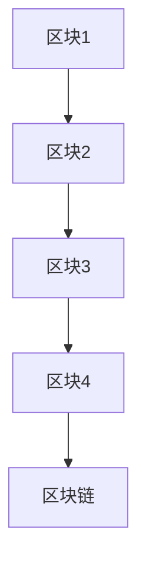

                 


## 文章标题
《区块链技术：去中心化系统的设计原则与实践》

## 文章关键词
区块链技术，去中心化系统，设计原则，技术实践，加密算法，共识算法，智能合约，实际应用，项目案例

## 文章摘要
本文旨在深入探讨区块链技术，特别是其作为去中心化系统设计原则与实践的核心。我们将从区块链技术的基本概念、加密技术、共识算法、智能合约等方面进行详细解析，并通过实际项目案例分析，展示区块链技术的应用与实践。文章将结合Mermaid流程图、伪代码和latex数学公式，帮助读者全面理解区块链技术的原理和实现方法。

---

### 引言与概述

#### 区块链技术概述

区块链是一种分布式数据库技术，通过加密算法、共识算法等机制实现数据的去中心化存储和验证。区块链技术的核心特点是去中心化、安全性和不可篡改性，这使得它在金融、供应链管理、医疗等领域有着广泛的应用前景。

#### 去中心化系统的优势

去中心化系统的设计原则是区块链技术的核心，它克服了传统中心化系统中的单点故障、数据不安全、信任问题等缺点。去中心化系统能够提高系统的可靠性和安全性，减少对中心节点的依赖，从而实现更高效的资源利用和管理。

#### 区块链的发展历史

区块链技术的起源可以追溯到2008年，当时中本聪（Satoshi Nakamoto）发表了《比特币：一种点对点的电子现金系统》的白皮书，提出了比特币和区块链的概念。随着比特币的成功，区块链技术逐渐引起了全球关注，并不断有新的应用和改进。

---

### 核心概念与联系

区块链技术包含多个核心概念，它们之间紧密联系，共同构成了区块链系统的框架。以下是区块链技术中一些关键概念及其关系：

1. **区块（Block）**：区块链的基本单元，包含一定数量的交易记录。
2. **链（Chain）**：由一系列按时间顺序排列的区块组成。
3. **加密算法（Cryptography）**：用于保护区块链中的数据和交易，确保数据的隐私和完整性。
4. **共识算法（Consensus Algorithm）**：确保区块链网络中的节点对数据的共识和同步。
5. **智能合约（Smart Contract）**：自动执行和验证合约条款的计算机程序。

这些概念之间通过以下方式相互联系：

- **区块**通过哈希函数与**链**相连，每个区块都包含前一个区块的哈希值，从而确保链的不可篡改性。
- **加密算法**用于保护**交易**和**区块**中的数据，确保数据在传输过程中的隐私和完整性。
- **共识算法**则确保**区块链网络**中的节点能够达成一致，共同维护区块链的完整性。
- **智能合约**作为**区块链**的一部分，可以实现自动化执行和验证，增强区块链的功能和应用场景。

下面是一个Mermaid流程图，展示区块链中区块和链的关系：



---

### 核心算法原理讲解

区块链技术中的核心算法包括加密算法和共识算法。以下将分别对这些算法进行详细讲解。

#### 加密算法

加密算法是区块链技术中至关重要的一环，用于保护区块链中的数据和交易。以下是几种常见的加密算法：

1. **哈希函数**：哈希函数是一种将任意长度的输入数据转换成固定长度的输出数据的算法。在区块链中，哈希函数用于生成区块的唯一标识和确保数据的一致性。

   伪代码：
   ```plaintext
   function hash(data) {
       // 假设使用SHA-256哈希算法
       return SHA256(data);
   }
   ```

2. **数字签名**：数字签名是一种用于验证消息发送者身份的加密技术。发送者使用私钥对消息进行签名，接收者可以使用公钥验证签名的有效性。

   伪代码：
   ```plaintext
   function sign(message, privateKey) {
       // 使用ECDSA算法签名
       return ECDSA_sign(message, privateKey);
   }

   function verify(message, signature, publicKey) {
       // 使用ECDSA算法验证签名
       return ECDSA_verify(message, signature, publicKey);
   }
   ```

3. **加密通信**：在区块链网络中，节点之间的通信需要加密，以确保数据的隐私性和完整性。

   伪代码：
   ```plaintext
   function encrypt(message, publicKey) {
       // 使用RSA加密算法
       return RSA_encrypt(message, publicKey);
   }

   function decrypt(encryptedMessage, privateKey) {
       // 使用RSA加密算法解密
       return RSA_decrypt(encryptedMessage, privateKey);
   }
   ```

#### 共识算法

共识算法是区块链网络中的节点达成一致的关键机制。以下是几种常见的共识算法：

1. **工作量证明（PoW）**：工作量证明是一种通过计算复杂度证明节点对网络贡献的算法。节点需要解决一个数学难题，证明自己的计算能力。

   伪代码：
   ```plaintext
   function proveOfWork(difficulty) {
       // 找到一个满足难度要求的哈希值
       while (hash(output) >= difficulty) {
           // 进行多次尝试
           output = nextOutput();
       }
       return output;
   }
   ```

2. **拜占庭容错算法（BFT）**：拜占庭容错算法是一种能够处理网络中恶意节点的共识算法。节点通过交换信息来达成一致，即使某些节点不诚实，网络仍能保持一致性。

   伪代码：
   ```plaintext
   function BFT_vote(message, signature) {
       // 对消息进行验证并投票
       if (verify(message, signature, senderPublicKey)) {
           vote(message);
       }
   }

   function BFT_agreement() {
       // 通过投票达成一致
       while (!allNodesAgree()) {
           // 交换信息和投票
           exchangeMessages();
           BFT_vote(currentMessage, senderSignature);
       }
   }
   ```

---

### 数学模型和数学公式

区块链技术中的数学模型和公式对于理解和实现区块链算法至关重要。以下是几个关键数学模型和公式：

1. **哈希函数的碰撞概率**：哈希函数是一种将输入数据映射到固定长度输出数据的算法。哈希函数的碰撞概率是输入数据量与输出数据量的比值。在区块链中，为了确保安全性，通常选择输出数据量远大于输入数据量的哈希函数。

   公式：
   $$ P(\text{collision}) = \frac{|\text{input space}|}{|\text{output space}|} $$

2. **加密算法的安全性**：加密算法的安全性通常取决于密钥的长度和算法的复杂性。对于区块链中的加密算法，选择足够长的密钥和复杂的算法是确保安全性的关键。

   公式：
   $$ \text{Security} \propto \log_2(\text{key length}) $$

3. **共识算法的一致性**：共识算法的一致性通常通过以下公式来衡量。在一个拜占庭容错算法中，节点需要达成一致的概率取决于网络中恶意节点的数量和节点的计算能力。

   公式：
   $$ P(\text{consensus}) = 1 - \left(\frac{\text{number of malicious nodes}}{\text{total number of nodes}}\right)^{\text{2}} $$

---

### 项目实战

在本节中，我们将介绍一个简单的区块链项目，包括开发环境搭建、源代码实现和代码解读。

#### 开发环境搭建

1. **安装Node.js**：区块链项目通常使用JavaScript语言开发，因此首先需要安装Node.js。

   命令：
   ```bash
   curl -sL https://deb.nodesource.com/setup_14.x | sudo -E bash -
   sudo apt-get install -y nodejs
   ```

2. **安装Golang**：一些区块链项目也使用Golang进行开发，因此需要安装Golang。

   命令：
   ```bash
   sudo apt-get install golang-go
   ```

3. **安装Docker**：Docker用于容器化部署区块链节点。

   命令：
   ```bash
   sudo apt-get install docker.io
   ```

#### 源代码实现

以下是一个简单的区块链节点的源代码实现，包括区块的创建、交易和链的维护。

```go
package main

import (
    "crypto/sha256"
    "encoding/hex"
    "fmt"
    "math"
    "math/rand"
    "time"
)

// 区块结构
type Block struct {
    Index     int
    Timestamp string
    Data      string
    Hash      string
    PreviousHash string
}

// 创建新区块
func NewBlock(index int, data string, previousHash string) *Block {
    block := &Block{Index: index, Timestamp: time.Now().String(), Data: data, PreviousHash: previousHash}
    block.Hash = calculateHash(block)
    return block
}

// 计算区块哈希
func calculateHash(block *Block) string {
    hasher := sha256.New()
    hasher.Write([]byte(block.Timestamp))
    hasher.Write([]byte(block.Data))
    hasher.Write([]byte(block.PreviousHash))
    hashed := hasher.Sum(nil)
    return hex.EncodeToString(hashed)
}

// 工作量证明
func proofOfWork(difficulty int) int {
    var hashValue string
    var nonce int

    for nonce = 0; hashValue != "" || !isValidProof(hashValue, difficulty); nonce++ {
        hashValue = calculateHash(&Block{0, "", "", "", fmt.Sprint(nonce)})
    }

    return nonce
}

// 验证工作量证明
func isValidProof(hashValue string, difficulty int) bool {
    prefix := strings.Repeat("0", difficulty)
    return strings.HasPrefix(hashValue, prefix)
}

// 创建区块链
func createBlockchain(difficulty int) *Blockchain {
    blockchain := &Blockchain{}
    genesisBlock := NewBlock(0, "Genesis Block", "")
    blockchain.AddBlock(genesisBlock)
    return blockchain
}

// 添加区块到区块链
func (bc *Blockchain) AddBlock(block *Block) {
    block.PreviousHash = bc.Blocks[len(bc.Blocks)-1].Hash
    bc.Blocks = append(bc.Blocks, block)
}

// 区块链结构
type Blockchain struct {
    Blocks []*Block
}

func main() {
    // 设置随机种子
    rand.Seed(time.Now().UnixNano())

    // 创建区块链
    blockchain := createBlockchain(4)

    // 生成一些区块
    for i := 0; i < 10; i++ {
        block := NewBlock(i+1, fmt.Sprintf("Block %d", i), blockchain.Blocks[len(blockchain.Blocks)-1].Hash)
        blockchain.AddBlock(block)
    }

    // 打印区块链
    for _, block := range blockchain.Blocks {
        fmt.Printf("Index: %d\n", block.Index)
        fmt.Printf("Timestamp: %s\n", block.Timestamp)
        fmt.Printf("Data: %s\n", block.Data)
        fmt.Printf("Hash: %s\n", block.Hash)
        fmt.Printf("Previous Hash: %s\n\n", block.PreviousHash)
    }
}
```

#### 代码解读

上述代码实现了区块链的基本功能，包括区块的创建、交易和链的维护。以下是代码的关键部分：

1. **区块结构**：`Block` 结构定义了区块的属性，包括索引、时间戳、数据和哈希值。
2. **创建新区块**：`NewBlock` 函数用于创建新的区块，并计算其哈希值。
3. **计算区块哈希**：`calculateHash` 函数使用 SHA-256 哈希算法计算区块的哈希值。
4. **工作量证明**：`proofOfWork` 函数用于实现工作量证明，确保区块的哈希值满足一定的难度要求。
5. **添加区块到区块链**：`AddBlock` 函数将新的区块添加到区块链中。
6. **区块链结构**：`Blockchain` 结构定义了区块链的属性，包括一系列区块。
7. **主函数**：`main` 函数用于创建一个区块链，并生成一些区块。

通过这个简单的项目，我们可以看到区块链技术的基本原理和实现方法。在实际应用中，区块链项目会更加复杂，但基本的原理是相同的。

---

### 最佳实践 Tips、小结、注意事项、拓展阅读

#### 最佳实践 Tips

1. **安全性**：在设计区块链项目时，确保使用安全的加密算法和共识算法，以防止攻击和数据篡改。
2. **可扩展性**：考虑区块链项目的可扩展性，以应对日益增长的数据量和用户需求。
3. **性能优化**：优化区块链网络的性能，包括交易处理速度和网络延迟。
4. **代码审查**：在发布区块链项目之前，进行严格的代码审查，以确保代码的质量和安全性。

#### 小结

本文深入探讨了区块链技术的核心概念、设计原则、技术实现和实际应用。通过Mermaid流程图、伪代码和latex数学公式，我们全面了解了区块链技术的原理和实现方法。在实际项目中，我们需要注重安全性、可扩展性和性能优化。

#### 注意事项

1. **加密算法的选择**：选择合适的加密算法对于区块链系统的安全性至关重要。
2. **共识算法的选择**：不同的共识算法适用于不同的应用场景，需要根据具体需求进行选择。
3. **代码审计**：定期进行代码审计，以发现潜在的安全漏洞。

#### 拓展阅读

1. **《区块链技术指南》**：深入了解区块链技术的各个方面。
2. **《智能合约设计与应用》**：学习智能合约的设计和实现方法。
3. **《区块链：从入门到实战》**：从入门到高级的区块链技术实践。

---

通过本文的详细讲解，我们希望读者能够对区块链技术有更深入的理解，并能够将其应用于实际项目中。让我们继续探索区块链技术的无限可能性！作者：AI天才研究院/AI Genius Institute & 禅与计算机程序设计艺术 /Zen And The Art of Computer Programming。

