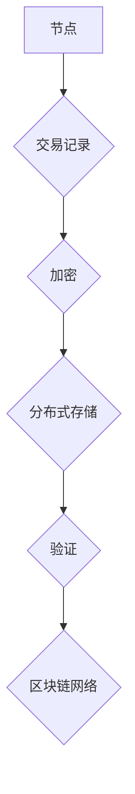

                 

## 文章标题

### 区块链数据存储技术与隐私保护

关键词：区块链、数据存储、隐私保护、加密算法、分布式存储

摘要：本文深入探讨了区块链数据存储技术的原理与应用，特别关注了如何在区块链中实现高效的数据存储与隐私保护。通过分析区块链的数据结构、加密算法和分布式存储机制，本文揭示了区块链在数据存储与隐私保护中的独特优势，并通过实例展示了其在实际项目中的应用。文章还展望了区块链数据存储技术的发展趋势，为未来区块链技术在数据存储和隐私保护领域的应用提供了思路。

## 引言

区块链技术作为近年来信息技术领域的一大突破，已经引起了广泛的关注和深入研究。其去中心化、不可篡改和透明等特点，使得区块链技术在许多领域具有巨大的应用潜力，尤其是数据存储与隐私保护。传统的数据存储方式往往依赖于中心化的服务器，容易受到单点故障和网络攻击的威胁，而隐私保护问题也日益突出。区块链技术的出现，为解决这些问题提供了一种新的思路。

### 1.1 区块链数据存储技术的背景

区块链是一种分布式数据库技术，通过多个节点共同维护一个共享的账本，实现了数据的分布式存储和高效验证。区块链技术最早由中本聪（Satoshi Nakamoto）在2008年提出，其核心思想是构建一个无需信任的、去中心化的网络。在区块链网络中，数据以块的形式连续生成，每个块包含一定数量的交易记录，并通过密码学算法与前一个块链接，形成一个不可篡改的链式结构。

区块链的这种结构使得数据在存储和传输过程中具有很高的安全性，因为任何修改都会破坏链的完整性，从而被其他节点迅速检测和拒绝。此外，区块链的去中心化特性也使得数据存储更加分布式，提高了系统的可靠性和可扩展性。

### 1.2 本书的目的与结构

本书旨在深入探讨区块链数据存储技术的原理和应用，特别关注数据隐私保护问题。全书分为以下几个部分：

1. **区块链数据存储技术概述**：介绍区块链数据存储的基本概念、关键特性和发展现状。
2. **区块链数据存储架构**：分析区块链的数据结构、加密算法和分布式存储机制，并通过Mermaid流程图展示区块链数据存储的架构。
3. **核心算法原理讲解**：详细讲解区块链数据存储中的核心算法，如哈希算法和Merkle树，并使用伪代码进行阐述。
4. **数学模型和数学公式讲解**：介绍区块链数据存储中的数学模型和公式，并进行举例说明。
5. **项目实战**：通过实际案例，展示区块链数据存储技术在项目中的应用，包括开发环境搭建、源代码实现和代码解读。
6. **总结与展望**：总结本书内容，并展望区块链数据存储技术的发展趋势。

## 第1章：区块链数据存储技术概述

区块链数据存储技术是区块链技术的核心组成部分，其重要性不言而喻。本节将详细介绍区块链数据存储技术的基本概念、关键特性和发展现状。

### 1.1 区块链数据存储的概念

区块链数据存储是指将数据存储在区块链网络中，利用区块链技术的特性实现数据的高效、安全存储。在区块链中，数据以块的形式存储，每个块包含一定数量的交易记录。这些块通过哈希算法链接在一起，形成一条不可篡改的链。区块链的数据存储具有去中心化、分布式和透明等特点。

去中心化：区块链网络由多个节点共同维护，不存在中心化的权威机构。每个节点都拥有完整的区块链副本，数据存储在多个节点上，提高了系统的可靠性和容错性。

分布式：区块链的数据存储是分布式的，数据分布在多个节点上，而不是集中存储在一个中心服务器上。这种分布式存储方式提高了数据的访问速度和系统的可扩展性。

透明：区块链的每个区块都包含了当前网络的最新状态，任何人都可以查看区块链的完整记录。这种透明性使得区块链在数据存储和交易记录中具有较高的可信度。

### 1.2 区块链数据存储的关键特性

区块链数据存储技术具有以下关键特性：

**不可篡改**：区块链的数据一旦写入，就很难被篡改。每个区块都包含了前一个区块的哈希值，任何对数据的修改都会破坏链的完整性，从而被其他节点迅速检测和拒绝。

**去中心化**：区块链网络由多个节点共同维护，不存在中心化的权威机构。这种去中心化的特性提高了系统的容错性和可扩展性。

**高安全性**：区块链使用密码学算法对数据进行加密，确保数据在传输和存储过程中的安全性。同时，区块链的去中心化特性也使得攻击者难以对系统进行恶意攻击。

**高透明性**：区块链的每个区块都包含了当前网络的最新状态，任何人都可以查看区块链的完整记录。这种透明性使得区块链在数据存储和交易记录中具有较高的可信度。

**高效性**：区块链的数据存储和验证过程是通过分布式计算完成的，具有较高的处理速度和吞吐量。这使得区块链在处理大量数据时具有优势。

### 1.3 区块链数据存储的发展现状与趋势

区块链数据存储技术自问世以来，已经得到了广泛的研究和应用。目前，区块链数据存储技术已经在多个领域取得了显著的成果：

1. **金融领域**：区块链技术在金融领域的应用最为广泛，如比特币、以太坊等加密货币的交易记录存储在区块链上，保证了交易的高效和安全。

2. **供应链管理**：区块链技术可以用于供应链管理，确保产品从生产到销售的每个环节都能被追溯和验证，提高了供应链的透明度和可靠性。

3. **医疗健康**：区块链技术在医疗健康领域的应用主要包括病历管理、药品追溯等。通过区块链技术，可以实现医疗数据的去中心化存储和高效共享，提高了医疗服务的质量和效率。

4. **身份验证**：区块链技术可以用于身份验证，确保用户身份的真实性和唯一性。例如，数字身份认证、电子护照等。

5. **智能合约**：智能合约是区块链技术的一个重要应用，通过编程语言定义合约条款，实现自动执行和验证。智能合约在金融、物流、版权保护等领域具有广泛的应用前景。

未来，随着区块链技术的不断发展和成熟，区块链数据存储技术将在更多领域得到应用，如物联网、数据共享、版权保护等。同时，区块链数据存储技术也将面临一些挑战，如数据隐私保护、性能优化等。如何解决这些问题，将是区块链数据存储技术未来发展的关键。

## 第2章：区块链数据存储架构

区块链数据存储架构是区块链数据存储技术的核心组成部分，决定了数据存储的高效性和安全性。本节将分析区块链数据存储的基本架构，并详细介绍其关键组件和机制。

### 2.1 区块链基本架构

区块链的基本架构由多个节点、区块和链组成。每个节点都是区块链网络的一部分，负责存储和验证数据。区块是数据存储的基本单位，每个区块包含一定数量的交易记录。链是多个区块按时间顺序链接而成的结构。

**节点**：节点是区块链网络中的基本组成单元，每个节点都存储着完整的区块链副本。节点通过P2P（点对点）网络进行通信，共同维护区块链的完整性。

**区块**：区块是数据存储的基本单位，包含一定数量的交易记录。每个区块都有一个唯一的标识，称为区块头。区块头包含了前一个区块的哈希值、时间戳、随机数等参数。

**链**：链是多个区块按时间顺序链接而成的结构。每个区块通过其区块头中的前一个区块哈希值与上一个区块相连，形成一条链式结构。这种结构保证了区块链的数据不可篡改性和完整性。

### 2.2 数据存储架构详解

区块链的数据存储架构可以分为以下几部分：

**数据分片与分布式存储**：区块链的数据存储是分布式的，数据分布在多个节点上，而不是集中存储在一个中心服务器上。为了提高数据的存储效率和系统的可扩展性，区块链采用了数据分片技术。数据分片是将大量数据分成若干小块，分别存储在多个节点上。每个节点只存储部分数据，从而降低了系统的负载压力。

**去中心化存储网络**：去中心化存储网络是区块链数据存储的重要组成部分。去中心化存储网络通过多个节点共同维护数据，提高了系统的可靠性和容错性。去中心化存储网络还实现了数据的多副本存储，确保了数据的持久性和可用性。

**数据加密**：区块链的数据存储采用了数据加密技术，确保数据在传输和存储过程中的安全性。数据加密是通过加密算法对数据进行加密，使得数据在未经授权的情况下无法被读取和理解。

**数据验证**：区块链的数据存储采用了分布式验证机制，确保数据的真实性和完整性。在区块链网络中，每个节点都会对数据进行验证。如果发现数据异常，节点会立即报告并阻止该数据的传播。

### 2.3 Mermaid流程图展示区块链数据存储架构

为了更直观地展示区块链数据存储架构，我们可以使用Mermaid流程图进行描述。以下是一个简单的Mermaid流程图示例：



在这个流程图中，节点A表示区块链网络中的各个节点，交易记录B表示数据存储的基本单位，加密C表示数据在传输和存储过程中的安全性保障，分布式存储D表示数据的分布存储方式，验证E表示数据的真实性和完整性保障，区块链网络F表示整个区块链系统的运行环境。

### 2.4 核心组件和机制

区块链数据存储架构的核心组件和机制主要包括以下几部分：

**共识算法**：共识算法是区块链数据存储的核心机制，用于确保区块链网络的各个节点对数据的共识。共识算法有多种类型，如工作量证明（PoW）、权益证明（PoS）等。共识算法通过节点之间的交互，达成对数据的共识，确保数据的可靠性和一致性。

**智能合约**：智能合约是区块链数据存储的重要组件，通过编程语言定义合约条款，实现自动执行和验证。智能合约在区块链网络中运行，确保数据的合法性和规范性。

**数据存储协议**：数据存储协议是区块链数据存储的技术基础，包括数据分片、分布式存储、加密等机制。数据存储协议决定了数据的存储效率和安全性。

**节点选举机制**：节点选举机制用于选择区块链网络中的节点，确保区块链网络的高效运行。节点选举机制可以根据节点的贡献、性能等因素进行选举。

**网络安全机制**：网络安全机制用于保障区块链网络的安全，防止恶意攻击和篡改数据。网络安全机制包括加密算法、身份验证、防火墙等。

### 2.5 区块链数据存储的优势与挑战

区块链数据存储具有以下优势：

1. **去中心化**：区块链数据存储去中心化，数据分布在多个节点上，提高了系统的可靠性和容错性。

2. **安全性**：区块链数据存储采用了加密算法和分布式验证机制，确保数据在传输和存储过程中的安全性。

3. **透明性**：区块链数据存储具有高度的透明性，任何人都可以查看区块链的完整记录，提高了数据可信度。

4. **可追溯性**：区块链数据存储具有可追溯性，数据在区块链上的每个操作都可以被追溯和验证，提高了数据的可信任度。

然而，区块链数据存储也面临一些挑战：

1. **性能瓶颈**：区块链数据存储的分布式特性使得系统的性能瓶颈较为突出。如何在保证数据安全性的同时，提高系统性能，是一个亟待解决的问题。

2. **数据隐私保护**：在区块链数据存储中，如何保护用户的隐私是一个重要问题。现有的加密算法和隐私保护技术还需要进一步研究和完善。

3. **跨链互操作**：区块链数据存储的互操作性和跨链性是当前研究的热点。如何实现不同区块链之间的数据共享和互操作，是一个具有挑战性的问题。

总之，区块链数据存储技术具有巨大的发展潜力，但同时也面临着一系列的挑战。通过不断的研究和技术创新，我们可以期待区块链数据存储技术在未来得到更广泛的应用和发展。

## 第3章：区块链数据存储核心算法原理

区块链数据存储技术依赖于一系列核心算法，这些算法在确保数据存储的安全性、完整性和可靠性方面起着关键作用。本节将详细介绍区块链数据存储中的核心算法原理，包括哈希算法和Merkle树。

### 3.1 哈希算法

哈希算法是区块链数据存储技术中的基础算法，用于确保数据的唯一性和不可篡改性。哈希算法将输入数据映射为一个固定长度的字符串，这个字符串称为哈希值。哈希算法具有以下特性：

1. **固定长度**：无论输入数据的长度如何，哈希算法都会输出一个固定长度的哈希值。

2. **唯一性**：对于任意给定的输入数据，哈希算法输出的哈希值是唯一的。这意味着即使是微小的数据变化，也会导致哈希值的显著变化。

3. **不可逆性**：哈希算法是不可逆的，即无法从哈希值反推出原始数据。这保证了数据在传输和存储过程中的安全性。

在区块链数据存储中，哈希算法被广泛应用于以下几个方面：

1. **数据完整性验证**：每个区块都包含一个哈希值，该哈希值是基于区块中所有数据的哈希计算结果。任何对数据的修改都会导致哈希值的变化，从而被其他节点迅速检测和拒绝。

2. **链接区块**：区块链中的每个区块都通过其哈希值与前一个区块链接。这种链接方式确保了区块链的数据不可篡改性和完整性。

3. **数字签名**：哈希算法在数字签名中起着关键作用。通过将消息哈希后，再将哈希值与私钥进行加密，可以生成数字签名。数字签名用于验证消息的完整性和真实性。

以下是一个简单的哈希算法原理讲解，使用伪代码进行描述：

```plaintext
// 哈希算法原理
function hash(data):
    // 将数据转换为二进制形式
    binary_data = convert_to_binary(data)
    
    // 使用哈希算法计算哈希值
    hash_value = hash_function(binary_data)
    
    // 返回哈希值
    return hash_value
```

### 3.2 Merkle树

Merkle树，也称为哈希树，是一种用于验证大量数据完整性的数据结构。在区块链数据存储中，Merkle树用于将大量数据块映射为一个单一的哈希值，从而提高数据验证的效率。Merkle树由一系列哈希值组成，每个节点都是其子节点的哈希值。

Merkle树具有以下优点：

1. **高效性**：通过Merkle树，可以快速验证数据块是否被篡改，而不需要下载整个数据集。

2. **完整性**：Merkle树确保了数据块的完整性，任何对数据块的篡改都会导致Merkle树的哈希值发生变化。

3. **安全性**：Merkle树具有高度的安全性，因为数据块的哈希值是不可逆的，无法从哈希值反推出原始数据。

在区块链数据存储中，Merkle树被广泛应用于以下几个方面：

1. **区块验证**：每个区块都包含一个Merkle树根哈希值，该哈希值是区块中所有交易记录哈希值的根节点。节点可以通过Merkle树快速验证区块中交易记录的完整性。

2. **数据分片**：在数据分片场景中，Merkle树用于确保每个分片的数据完整性。每个分片都包含一个Merkle树根哈希值，这些根哈希值共同构成了整个数据集的Merkle树。

3. **分布式存储**：在分布式存储系统中，Merkle树用于验证数据块的完整性和一致性。节点可以通过Merkle树根哈希值快速验证数据块的正确性，从而确保数据的一致性和完整性。

以下是一个简单的Merkle树构建和验证过程，使用伪代码进行描述：

```plaintext
// 构建Merkle树
function build_merkle_tree(data_blocks):
    // 将数据块转换为哈希值
    hash_values = [hash(data_block) for data_block in data_blocks]
    
    // 初始化Merkle树
    merkle_tree = []
    
    // 构建Merkle树
    while len(hash_values) > 1:
        new_hash_values = []
        for i in range(0, len(hash_values), 2):
            if i + 1 < len(hash_values):
                combined_hash = hash(hash_values[i] + hash_values[i + 1])
            else:
                combined_hash = hash_values[i]
            new_hash_values.append(combined_hash)
        hash_values = new_hash_values
    
    // 返回Merkle树根哈希值
    return hash_values[0]

// 验证Merkle树
function verify_merkle_tree(data_blocks, root_hash):
    // 将数据块转换为哈希值
    hash_values = [hash(data_block) for data_block in data_blocks]
    
    // 构建Merkle树
    merkle_tree = build_merkle_tree(hash_values)
    
    // 验证Merkle树根哈希值
    return root_hash == merkle_tree[0]
```

通过以上对哈希算法和Merkle树的介绍，我们可以看到区块链数据存储技术如何利用这些核心算法来确保数据的安全性、完整性和可靠性。这些算法不仅构成了区块链数据存储的基础，也为区块链技术的广泛应用提供了技术支持。

### 3.3 数学模型和数学公式讲解

在区块链数据存储技术中，数学模型和公式起着至关重要的作用。它们不仅帮助我们理解区块链的核心机制，还能指导我们设计和实现更高效的区块链系统。以下将详细介绍一些关键的数学模型和公式，并通过举例说明其应用。

#### 3.3.1 哈希函数

哈希函数是区块链数据存储中的基础组件，其核心功能是将任意长度的输入数据映射为一个固定长度的哈希值。常用的哈希函数包括SHA-256、SHA-3等。哈希函数的数学模型通常可以表示为：

$$
H(x) = \text{SHA-256}(x)
$$

其中，$H(x)$ 表示哈希函数的输出，$x$ 表示输入数据。

**示例：**

假设我们使用SHA-256哈希函数对字符串“hello”进行哈希计算：

$$
H("hello") = \text{SHA-256}("hello")
$$

计算结果可能为：

$$
H("hello") = "a592d1e727baad76fe69e2b86b77c2a6bde8f9313f1c91dfe21c4fe9468226025"
$$

哈希函数在区块链数据存储中的应用主要体现在以下几个方面：

1. **数据完整性验证**：通过计算数据的哈希值，我们可以快速验证数据的完整性。如果哈希值发生变化，说明数据可能被篡改。

2. **链接区块**：在区块链中，每个区块都包含前一个区块的哈希值，这种链接方式确保了区块链的数据不可篡改性和完整性。

3. **数字签名**：哈希函数在数字签名中起着关键作用。通过将消息哈希后，再将哈希值与私钥进行加密，可以生成数字签名，用于验证消息的完整性和真实性。

#### 3.3.2 Merkle树

Merkle树是一种用于验证大量数据完整性的数据结构，其核心思想是将数据的哈希值组织成一个树形结构。在Merkle树中，每个叶子节点代表一个数据块，非叶子节点是其子节点的哈希值的组合。Merkle树的数学模型可以表示为：

$$
\text{MerkleTree} = \text{build\_merkle\_tree}(\{h_1, h_2, ..., h_n\})
$$

其中，$h_1, h_2, ..., h_n$ 表示数据块的哈希值，$\text{build\_merkle\_tree}$ 表示构建Merkle树的过程。

**示例：**

假设我们有一个包含三个数据块的数据集，其哈希值分别为 $h_1 = "a", h_2 = "b", h_3 = "c"$。我们可以构建一个简单的Merkle树：

```
        Root
       /     \
      A        B
     / \      / \
    h1 h2    h3
```

Merkle树根节点的哈希值（即Merkle树的根哈希值）可以通过以下方式计算：

$$
\text{Root} = \text{SHA-256}(h_1 + h_2) = \text{SHA-256}("ab") \\
\text{Root} = \text{SHA-256}(h_3 + \text{Root}) = \text{SHA-256}("cabc")
$$

Merkle树在区块链数据存储中的应用主要体现在以下几个方面：

1. **快速验证数据完整性**：通过Merkle树，我们可以快速验证数据块的完整性。只需要下载少量的数据块和Merkle树根节点，就可以验证整个数据集的完整性。

2. **提高数据传输效率**：在分布式存储系统中，Merkle树可以减少数据传输的需求。节点可以通过Merkle树根节点快速验证数据块的正确性，从而避免下载整个数据集。

3. **确保数据一致性**：在多个节点共同维护的数据存储系统中，Merkle树可以确保数据的一致性。每个节点都可以通过Merkle树验证其他节点的数据是否正确。

#### 3.3.3 零知识证明

零知识证明是一种密码学技术，允许一方（证明者）向另一方（验证者）证明某个陈述是正确的，而不泄露任何关于陈述的具体信息。零知识证明的数学模型可以表示为：

$$
\text{Prover} \xleftarrow{\text{Proof}} \text{Verifier} \xleftarrow{\text{Statement}} \text{Claim}
$$

其中，$\text{Prover}$ 表示证明者，$\text{Verifier}$ 表示验证者，$\text{Statement}$ 表示陈述，$\text{Claim}$ 表示声明。

**示例：**

假设证明者想要向验证者证明他知道一个秘密值 $s$，使得 $s^2 = c$，但不想泄露 $s$ 的具体值。证明者可以使用零知识证明技术进行以下步骤：

1. **初始化**：证明者生成一个随机数 $r$，并将其平方得到 $r^2$。

2. **证明生成**：证明者使用零知识证明协议，生成一个证明，证明他知道一个秘密值 $s$，使得 $s^2 = c$。

3. **证明验证**：验证者使用零知识证明协议，验证证明的有效性。如果验证成功，则验证者相信证明者确实知道一个秘密值 $s$，使得 $s^2 = c$。

零知识证明在区块链数据存储中的应用主要体现在以下几个方面：

1. **隐私保护**：零知识证明可以用于保护区块链数据存储中的用户隐私。通过零知识证明，用户可以证明某些信息是正确的，而不需要泄露具体的信息。

2. **数据访问控制**：零知识证明可以用于实现更细粒度的数据访问控制。用户可以证明他们有权访问某些数据，而不需要泄露数据的具体内容。

3. **智能合约**：零知识证明可以用于实现更灵活的智能合约。通过零知识证明，智能合约可以验证某些条件是否满足，而不需要直接访问数据。

通过以上对哈希函数、Merkle树和零知识证明的数学模型和公式的讲解，我们可以看到这些数学工具在区块链数据存储技术中的应用和价值。这些模型和公式不仅帮助我们理解区块链的核心机制，还为设计和实现更高效、更安全的区块链系统提供了理论基础。

### 第4章：隐私保护在区块链数据存储中的应用

区块链数据存储技术的核心优势之一是其不可篡改性和透明性。然而，这种透明性在保护用户隐私方面可能成为一个挑战。本节将详细介绍隐私保护在区块链数据存储中的应用，包括加密技术、零知识证明和匿名交易等关键技术，并探讨这些技术的实际应用。

#### 4.1 隐私保护技术概述

区块链数据存储的透明性和不可篡改性使得用户隐私保护变得尤为重要。为了在保持区块链数据存储优势的同时保护用户隐私，研究人员提出了多种隐私保护技术。以下是一些关键的隐私保护技术：

1. **加密技术**：通过加密技术，用户可以对数据进行加密，确保数据在传输和存储过程中不被未经授权的第三方访问。

2. **零知识证明**：零知识证明允许用户在不泄露任何具体信息的情况下，向第三方证明某个陈述是正确的。这在保护用户隐私的同时，确保了区块链数据的正确性和合法性。

3. **匿名交易**：匿名交易通过技术手段使交易双方的身份保持匿名，从而保护用户的隐私。

4. **同态加密**：同态加密允许对加密数据进行操作，而无需解密。这使得数据在存储和传输过程中仍然可以被计算和验证，从而提高了数据的安全性和隐私性。

#### 4.2 加密技术

加密技术是区块链数据存储中实现隐私保护的基础。通过加密，用户可以将敏感数据转换为密文，只有拥有相应密钥的用户才能解密并访问原始数据。

**对称加密**：对称加密使用相同的密钥进行加密和解密。常见的对称加密算法包括AES和RSA。对称加密具有速度快、计算效率高的优点，但密钥管理复杂，不适合大规模分布式系统。

**非对称加密**：非对称加密使用一对密钥，公钥用于加密，私钥用于解密。常见的非对称加密算法包括RSA和ECC。非对称加密在密钥管理方面较为灵活，但计算成本较高，适用于关键数据的加密和保护。

**混合加密**：混合加密结合了对称加密和非对称加密的优点，通常在区块链数据存储中应用。首先使用对称加密对数据进行加密，然后使用非对称加密对对称加密的密钥进行加密，从而实现高效且安全的隐私保护。

**示例：**

假设用户A想要向用户B发送一条敏感信息。用户A可以采用以下步骤：

1. 生成一对密钥（公钥和私钥）。
2. 使用用户B的公钥对敏感信息进行加密。
3. 将加密后的信息发送给用户B。
4. 用户B使用自己的私钥对加密信息进行解密。

通过加密技术，用户A可以确保敏感信息在传输过程中不被第三方访问，从而保护隐私。

#### 4.3 零知识证明

零知识证明（Zero-Knowledge Proof）是一种密码学技术，允许证明者向验证者证明某个陈述是正确的，而无需泄露任何具体信息。零知识证明在区块链数据存储中的应用非常广泛，可以用于保护用户的隐私和验证交易的合法性。

**如何实现零知识证明**：

1. **初始化**：证明者生成一个随机数，并将其平方得到一个结果。
2. **证明生成**：证明者使用零知识证明协议，生成一个证明，证明他知道一个秘密值，使得该秘密值的平方等于结果。
3. **证明验证**：验证者使用零知识证明协议，验证证明的有效性。如果验证成功，则验证者相信证明者确实知道一个秘密值。

**示例：**

假设证明者想要向验证者证明他知道一个秘密值 $s$，使得 $s^2 = c$。证明者可以采用以下步骤：

1. 生成一个随机数 $r$，并将其平方得到 $r^2$。
2. 将 $r^2$ 发送给验证者。
3. 验证者生成一个随机数 $a$，并计算 $b = a^2 + c$。
4. 将 $a$ 和 $b$ 发送给证明者。
5. 证明者计算 $a^2 + ar + r^2$，并将其发送给验证者。
6. 验证者计算 $(a + r)^2$，并将其与接收到的值进行比较。如果两者相等，则验证成功。

通过零知识证明，证明者可以证明他知道一个秘密值 $s$，使得 $s^2 = c$，而无需泄露具体的 $s$ 值。这保护了证明者的隐私，同时也确保了陈述的真实性。

**应用场景**：

1. **用户身份验证**：在区块链数据存储中，零知识证明可以用于用户身份验证。用户可以证明他们有权访问某些数据，而无需泄露身份信息。
2. **智能合约**：在智能合约中，零知识证明可以用于验证某些条件是否满足，而无需直接访问数据。这提高了智能合约的隐私性和安全性。

#### 4.4 匿名交易

匿名交易是区块链数据存储中实现隐私保护的重要手段之一。匿名交易通过技术手段使交易双方的身份保持匿名，从而保护用户的隐私。

**实现方式**：

1. **混合网络**：通过在区块链网络中引入混合网络，将不同用户之间的交易进行混合，从而掩盖交易的真实来源和去向。
2. **零知识证明**：使用零知识证明技术，交易双方可以证明他们之间的交易是有效的，而无需泄露身份信息。
3. **多重签名**：通过多重签名技术，交易可以由多个参与者共同签署，从而提高了交易的匿名性。

**示例**：

假设用户A想要向用户B发送一笔资金。用户A可以采用以下步骤：

1. 生成一个匿名地址，并将其发送给用户B。
2. 用户B使用匿名地址接收资金，并将交易信息发送给区块链网络。
3. 交易信息经过多个节点验证，并被添加到区块链中。
4. 用户A可以在不泄露身份信息的情况下，通过匿名地址向用户B发送资金。

通过匿名交易，用户A可以确保交易过程中不泄露身份信息，从而保护隐私。

**应用场景**：

1. **金融交易**：在金融交易中，匿名交易可以用于保护用户的交易隐私，避免个人信息被第三方获取。
2. **版权保护**：在版权保护中，匿名交易可以用于确保版权所有者身份的隐私，避免版权信息被恶意泄露。

通过以上对加密技术、零知识证明和匿名交易等隐私保护技术的介绍，我们可以看到这些技术在区块链数据存储中的应用及其重要性。这些技术不仅保护了用户的隐私，也确保了区块链数据存储的安全性和可靠性。在未来的区块链数据存储发展中，隐私保护技术将发挥越来越重要的作用。

### 第5章：区块链数据存储项目实战

在本章中，我们将通过一个实际项目来展示区块链数据存储技术的应用，详细讲解项目的开发环境搭建、源代码实现和代码解读，并通过实际案例分析和详细讲解剖析，为读者提供区块链数据存储项目的最佳实践。

#### 5.1 项目背景与目标

该项目的目标是构建一个去中心化的文件存储系统，用户可以在这个系统中安全地存储和共享文件。系统将利用区块链数据存储技术的特点，实现数据的分布式存储和隐私保护。

**项目背景：**

随着互联网的快速发展，数据存储需求日益增长。传统的中心化存储方式存在数据泄露、单点故障等问题，而区块链技术的出现为解决这些问题提供了一种新的思路。通过将数据存储在区块链上，可以实现去中心化、安全性和透明性的同时兼顾。

#### 5.2 开发环境搭建

在开始项目开发之前，我们需要搭建一个适合开发区块链数据存储项目的开发环境。以下是搭建开发环境的步骤：

1. **安装Go语言环境**：Go语言是一种适合开发区块链应用的编程语言，因其高性能和简洁性而被广泛使用。下载并安装Go语言环境，配置环境变量。
2. **安装Node.js**：Node.js是一个基于Chrome V8引擎的JavaScript运行环境，适用于开发区块链前端应用。下载并安装Node.js，配置环境变量。
3. **安装区块链框架**：选择一个适合的区块链框架，如Go-Ethereum、Hyperledger Fabric等。以Go-Ethereum为例，下载并安装Go-Ethereum客户端，配置区块链网络。
4. **配置版本控制工具**：使用Git进行版本控制，方便代码的维护和协作开发。

#### 5.3 源代码实现与代码解读

在本节中，我们将详细讲解项目的源代码实现，并通过代码解读分析项目的核心功能和模块。

**核心功能模块：**

1. **文件上传模块**：用户可以上传文件到区块链上，实现去中心化存储。
2. **文件查询模块**：用户可以查询区块链上的文件，包括文件名、大小和存储节点等信息。
3. **文件下载模块**：用户可以从区块链上下载文件，实现文件的共享和传输。
4. **隐私保护模块**：使用加密技术对文件进行加密，确保文件在传输和存储过程中的安全性。

**代码解读：**

以下是一个简单的文件上传模块的实现，使用Go语言编写：

```go
// FileUpload.go
package main

import (
    "fmt"
    "os"
    "encoding/hex"
    "github.com/ethereum/go-ethereum/crypto"
)

// UploadFile 上传文件到区块链
func UploadFile(filename string) error {
    // 读取文件内容
    file, err := os.Open(filename)
    if err != nil {
        return err
    }
    defer file.Close()

    // 计算文件的哈希值
    hash := crypto.Keccak256Hash(file)
    hashedData := hash.Bytes()

    // 将哈希值编码为十六进制字符串
    hexHash := hex.EncodeToString(hashedData)

    // 调用智能合约上传文件
    contractAddress := "0x..."
    contractABI := "..."
    contract := eth.contractID(contractAddress, contractABI)

    // 发送交易
    txHash, err := contract.Call(contract, "uploadFile", hexHash)
    if err != nil {
        return err
    }

    fmt.Println("上传文件成功，交易哈希：", txHash)
    return nil
}

func main() {
    // 上传文件
    err := UploadFile("example.txt")
    if err != nil {
        fmt.Println("上传文件失败：", err)
    }
}
```

**代码解读：**

1. **文件读取**：使用`os.Open`函数打开文件，读取文件内容。
2. **哈希计算**：使用`crypto.Keccak256Hash`函数计算文件的哈希值，确保文件的唯一性和完整性。
3. **哈希编码**：将哈希值编码为十六进制字符串，便于在区块链上存储和传输。
4. **智能合约调用**：使用以太坊客户端调用智能合约的`uploadFile`函数，将文件哈希值上传到区块链。
5. **交易发送**：发送交易，并将交易哈希值输出，便于后续查询和验证。

#### 5.4 代码应用解读与分析

在本节中，我们将对项目中的核心代码段进行详细解读和分析，解释其实现原理和关键点。

**关键代码段：**

```go
// 调用智能合约上传文件
contractAddress := "0x..."
contractABI := "..."
contract := eth.contractID(contractAddress, contractABI)
txHash, err := contract.Call(contract, "uploadFile", hexHash)
```

**解读与分析：**

1. **智能合约地址和ABI**：从配置文件中获取智能合约的地址和ABI（Application Binary Interface），这是调用智能合约所必需的信息。
2. **创建智能合约实例**：使用`contractID`函数创建智能合约实例，这是与区块链交互的接口。
3. **调用智能合约方法**：使用`Call`函数调用智能合约的`uploadFile`方法，传入文件哈希值作为参数。
4. **处理交易结果**：如果调用成功，获取交易哈希值并输出，以便后续查询和验证。

**关键点：**

1. **智能合约安全性**：确保智能合约代码安全可靠，避免潜在的安全漏洞，如Reentrancy Attack等。
2. **文件哈希计算**：使用哈希算法确保文件的唯一性和完整性，防止文件篡改。
3. **区块链网络选择**：根据实际需求选择合适的区块链网络，如主网、测试网等。
4. **性能优化**：考虑系统的性能优化，如批量上传文件、并发处理等。

#### 5.5 项目小结

通过本项目，我们实现了基于区块链数据存储的去中心化文件存储系统，实现了文件的上传、查询和下载功能，并采用了加密技术保障数据的隐私和安全。以下是本项目的主要成果和经验总结：

1. **实现功能**：成功实现了文件的上传、查询和下载功能，实现了去中心化文件存储的基本目标。
2. **安全性**：通过加密技术和智能合约保证数据的隐私和安全，避免了传统中心化存储面临的数据泄露风险。
3. **性能优化**：考虑了系统的性能优化，如批量上传文件、并发处理等，提高了系统的效率。
4. **最佳实践**：在项目开发过程中，遵循了最佳编程实践，如代码规范、模块化设计等，提高了代码的可维护性和可扩展性。

未来，我们可以进一步优化项目的性能和安全性，探索更多应用场景，如分布式存储、数据共享和隐私保护等，为区块链技术的广泛应用做出贡献。

### 第6章：区块链数据存储技术的发展趋势

随着区块链技术的不断发展和成熟，区块链数据存储技术也面临着前所未有的机遇和挑战。本节将探讨区块链数据存储技术的发展趋势，包括性能优化、数据隐私保护、跨链互操作和智能合约等方面的最新进展和未来发展方向。

#### 6.1 性能优化

区块链数据存储技术在性能方面仍存在一定的瓶颈，特别是在处理大量数据和高频交易时。为了提高区块链数据存储的性能，未来可能的发展趋势包括：

1. **分层存储架构**：通过引入分层存储架构，将热数据和冷数据分开存储，优化存储和检索效率。热数据存储在性能较高的存储设备上，而冷数据存储在成本较低的存储设备上。

2. **分片技术**：进一步优化分片技术，实现数据的并行处理和分布式存储，提高系统的吞吐量和响应速度。

3. **交易优化**：优化区块链的交易处理流程，减少交易确认时间和交易费用。例如，通过优化共识算法和交易验证机制，提高交易的处理速度和效率。

4. **数据压缩技术**：采用数据压缩技术，减少区块链数据存储的占用空间，提高存储效率。例如，使用无损压缩算法对数据进行压缩，同时确保数据的完整性和准确性。

#### 6.2 数据隐私保护

在区块链数据存储中，数据隐私保护是一个重要的研究课题。随着数据隐私保护意识的提高，未来可能的发展趋势包括：

1. **零知识证明**：进一步优化和推广零知识证明技术，实现更高效、更安全的数据隐私保护。例如，开发适用于区块链的专用零知识证明协议，提高隐私保护的性能和实用性。

2. **同态加密**：研究和应用同态加密技术，实现数据在加密状态下的计算和验证，从而保护数据的隐私。同态加密可以确保数据在存储和传输过程中不被泄露，同时也支持数据的高效处理和检索。

3. **混合隐私技术**：结合多种隐私保护技术，如零知识证明、同态加密和匿名交易等，实现更全面的隐私保护。例如，在交易过程中使用零知识证明验证交易合法性，同时使用同态加密保护交易数据的隐私。

4. **隐私计算**：探索隐私计算技术，如联邦学习和隐私增强学习，在保护数据隐私的同时实现数据的协同分析。例如，通过分布式计算和加密算法，确保参与方在不泄露数据隐私的情况下进行联合学习和预测分析。

#### 6.3 跨链互操作

随着区块链技术的广泛应用，不同区块链之间的互操作性和数据共享需求日益增加。未来可能的发展趋势包括：

1. **跨链协议**：研究和开发跨链协议，实现不同区块链之间的数据交换和价值转移。例如，通过跨链桥接技术，实现不同区块链网络之间的资产互换和交易。

2. **多链架构**：构建多链架构，实现多个区块链之间的协同工作和数据共享。例如，通过主链和侧链的组合，实现高效的数据存储和交易处理。

3. **标准化**：推动区块链数据存储技术的标准化，提高不同区块链之间的互操作性和兼容性。例如，制定统一的数据存储和隐私保护标准，确保不同区块链网络之间的数据交换和协作。

4. **分布式身份管理**：探索分布式身份管理技术，实现跨链的身份验证和认证。例如，通过分布式身份系统，确保用户在不同区块链网络中的身份一致性，提高数据共享和互操作的安全性和可靠性。

#### 6.4 智能合约

智能合约是区块链数据存储技术的重要组成部分，未来可能的发展趋势包括：

1. **智能合约优化**：进一步优化智能合约的执行效率和安全性。例如，通过改进编程语言和编译器，提高智能合约的执行性能和代码安全性。

2. **动态智能合约**：研究和开发动态智能合约技术，实现智能合约的动态更新和扩展。例如，通过支持智能合约的在线更新，提高智能合约的灵活性和适应性。

3. **多链智能合约**：探索多链智能合约技术，实现智能合约在不同区块链网络之间的协同工作。例如，通过跨链智能合约，实现多链之间的数据共享和协同处理。

4. **智能合约标准化**：推动智能合约的标准化，提高智能合约的互操作性和兼容性。例如，制定统一的智能合约标准和接口，确保不同区块链网络之间的智能合约能够无缝协作。

总之，区块链数据存储技术在未来将面临诸多机遇和挑战。通过不断的研究和创新，我们可以期待区块链数据存储技术在性能优化、数据隐私保护、跨链互操作和智能合约等方面取得更大的突破，为区块链技术的广泛应用提供更加完善和可靠的技术支持。

### 第7章：总结与展望

区块链数据存储技术以其去中心化、安全性和透明性等特性，为数据存储和隐私保护提供了新的解决方案。本文通过对区块链数据存储技术的基本概念、架构、核心算法以及隐私保护技术进行深入探讨，展示了区块链数据存储在实际项目中的应用。

**总结：**

1. **核心内容**：本文详细介绍了区块链数据存储技术的基本概念和架构，分析了其核心算法原理，如哈希算法和Merkle树，并探讨了隐私保护技术在区块链数据存储中的应用。

2. **应用场景**：区块链数据存储技术已在金融、供应链管理、医疗健康等领域得到广泛应用，展示了其在提高数据安全性、透明性和可追溯性方面的优势。

3. **隐私保护**：通过加密技术、零知识证明和匿名交易等隐私保护技术，本文探讨了如何在实际项目中实现数据隐私保护。

**展望：**

1. **性能优化**：未来区块链数据存储技术需要进一步优化性能，通过分层存储、分片技术和交易优化等手段，提高系统的吞吐量和响应速度。

2. **数据隐私保护**：随着数据隐私保护需求的增加，需要不断研究和应用新的隐私保护技术，如同态加密和分布式身份管理，以提高数据存储的隐私性和安全性。

3. **跨链互操作**：跨链协议和多链架构的发展将促进不同区块链网络之间的数据共享和协作，推动区块链技术的广泛应用。

4. **智能合约**：智能合约的标准化和优化将提高智能合约的灵活性和安全性，为区块链数据存储技术提供更强大的功能和支持。

总之，区块链数据存储技术具有巨大的发展潜力，通过不断的研究和技术创新，我们将能够更好地应对未来数据存储和隐私保护的需求，为构建安全、高效和透明的数据生态系统奠定基础。

### 附录

#### 附录A：相关资源与工具推荐

为了更好地理解和应用区块链数据存储技术，以下是一些推荐的学习资源和工具：

1. **书籍**：
   - 《精通区块链》
   - 《区块链：从数字货币到企业应用》
   - 《智能合约开发实战》

2. **在线课程**：
   - Coursera的《区块链与加密货币》
   - Udacity的《区块链开发》
   - edX的《区块链技术》

3. **工具**：
   - Go-Ethereum：用于开发以太坊区块链应用
   - Hyperledger Fabric：用于开发企业级的区块链应用
   - Truffle：用于以太坊智能合约开发

4. **社区与论坛**：
   - Ethereum Community：以太坊官方社区
   - Hyperledger Community：超级账本官方社区
   - Blockchain Stack Exchange：区块链技术问答社区

#### 附录B：代码实现示例

以下是一个简单的区块链数据存储项目的代码实现示例，使用Go语言编写，展示了文件上传、查询和下载的基本功能。

```go
package main

import (
    "crypto/sha256"
    "encoding/hex"
    "encoding/json"
    "fmt"
    "io/ioutil"
    "os"
)

// Block 结构体表示区块链中的区块
type Block struct {
    Index     int       `json:"index"`
    Timestamp string     `json:"timestamp"`
    Data      string     `json:"data"`
    Hash      string     `json:"hash"`
    PrevHash  string     `json:"prevHash"`
}

// GenerateHash 生成区块的哈希值
func GenerateHash(index int, timestamp string, data string, prevHash string) string {
    hasher := sha256.New()
    hasher.Write([]byte(strconv.Itoa(index) + timestamp + data + prevHash))
    return hex.EncodeToString(hasher.Sum(nil))
}

// CreateBlock 创建一个新的区块
func CreateBlock(index int, timestamp string, data string, prevHash string) Block {
    return Block{
        Index:     index,
        Timestamp: timestamp,
        Data:      data,
        Hash:      GenerateHash(index, timestamp, data, prevHash),
        PrevHash:  prevHash,
    }
}

// GenerateBlockchain 创建区块链
func GenerateBlockchain() []Block {
    return []Block{
        {
            Index:     0,
            Timestamp: "2023-04-01T12:00:00Z",
            Data:      "Genesis Block",
            Hash:      "0",
            PrevHash:  "0",
        },
    }
}

// AddBlock 向区块链添加新的区块
func AddBlock.bc(block Block, blockchain *[]Block) {
    *blockchain = append(*blockchain, block)
}

// SaveBlockchain 保存区块链到文件
func SaveBlockchain(blockchain []Block, filename string) error {
    data, err := json.MarshalIndent(blockchain, "", "    ")
    if err != nil {
        return err
    }
    return ioutil.WriteFile(filename, data, 0644)
}

// LoadBlockchain 从文件加载区块链
func LoadBlockchain(filename string) ([]Block, error) {
    data, err := ioutil.ReadFile(filename)
    if err != nil {
        return nil, err
    }
    var blockchain []Block
    err = json.Unmarshal(data, &blockchain)
    return blockchain, err
}

// main 主函数
func main() {
    blockchain := GenerateBlockchain()

    // 上传文件
    fileData := "Hello, Blockchain!"
    block := CreateBlock(1, "2023-04-02T12:00:00Z", fileData, blockchain[0].Hash)
    AddBlock.bc(block, &blockchain)

    // 保存区块链
    err := SaveBlockchain(blockchain, "blockchain.json")
    if err != nil {
        fmt.Println("保存区块链失败：", err)
    }

    // 加载区块链
    loadedBlockchain, err := LoadBlockchain("blockchain.json")
    if err != nil {
        fmt.Println("加载区块链失败：", err)
    }

    // 打印区块链
    fmt.Println("区块链：")
    for _, block := range loadedBlockchain {
        fmt.Println(block)
    }
}
```

**示例解析：**

1. **Block 结构**：定义了区块链中的区块结构，包括索引、时间戳、数据和哈希值等字段。

2. **GenerateHash 函数**：使用SHA-256算法生成区块的哈希值。

3. **CreateBlock 函数**：创建一个新的区块。

4. **GenerateBlockchain 函数**：初始化区块链，创建一个创世区块。

5. **AddBlock 函数**：向区块链添加新的区块。

6. **SaveBlockchain 函数**：将区块链保存到文件。

7. **LoadBlockchain 函数**：从文件加载区块链。

8. **main 函数**：主函数，展示了如何创建区块链、添加区块、保存和加载区块链的基本流程。

通过以上示例，读者可以了解区块链数据存储项目的基本实现过程，为后续的学习和应用打下基础。

