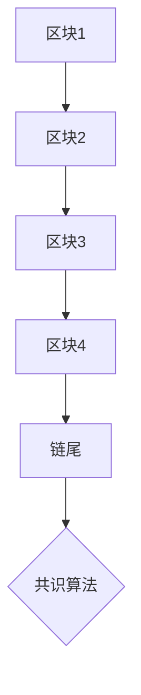

                 

### 文章标题：区块链系统架构设计

#### 关键词：区块链，系统架构，共识算法，加密技术，智能合约，安全性设计

#### 摘要：

本文全面探讨了区块链系统的架构设计，从基础概念、核心技术到实际应用，提供了详细的理论和实践指导。通过分析共识算法、加密技术和智能合约等核心组件，本文旨在帮助读者深入理解区块链系统的设计和实现，为构建安全的、可扩展的区块链网络提供科学依据。

---

## 第一部分：区块链概述

### 第1章：区块链基础

区块链是一种分布式数据库技术，其核心特点是去中心化、不可篡改和可追溯。本章将详细介绍区块链的基本概念、核心技术和历史发展。

### 核心概念与联系

区块链由多个区块组成，每个区块包含一定数量的交易记录。区块之间通过哈希值相互链接，形成一条不可篡改的链。以下是一个简单的Mermaid流程图，展示了区块链的基本架构：



**伪代码：**

```python
# 区块结构
class Block:
    def __init__(self, transactions, previous_hash):
        self.transactions = transactions
        self.previous_hash = previous_hash
        self.hash = calculate_hash(self)

# 链结构
class Blockchain:
    def __init__(self):
        self.chain = [create_genesis_block()]
        self.current_transactions = []

    def add_new_transaction(self, transaction):
        self.current_transactions.append(transaction)
        if len(self.current_transactions) >= TRANSACTION_LIMIT:
            self.mine()

    def mine(self):
        last_block = self.chain[-1]
        new_block = create_new_block(last_block.hash, self.current_transactions)
        self.chain.append(new_block)
        self.current_transactions = []
```

### 历史和发展

区块链的概念最早由中本聪（Satoshi Nakamoto）在2008年提出，作为一种去中心化的数字货币——比特币（Bitcoin）的基础技术。随着比特币的成功，区块链技术逐渐引起全球关注，并应用于多个领域，如金融、供应链、医疗等。

## 第二部分：区块链核心技术

### 第2章：共识算法

共识算法是区块链系统的核心，用于确保网络中的所有节点对数据的一致性达成共识。本章将介绍常见的共识算法，如工作量证明（PoW）和权益证明（PoS）。

### 核心算法原理讲解

#### 工作量证明（PoW）

**数学模型：**

$$
Hash(Nonce + PreviousHash + BlockData) < Target
$$

其中，$Nonce$ 是随机数，$PreviousHash$ 是前一个区块的哈希值，$BlockData$ 是区块数据，$Target$ 是目标值。

**伪代码：**

```python
def mine(block, difficulty):
    nonce = 0
    while True:
        hash_value = hash_block(block, nonce)
        if hash_value < (difficulty * '0'):
            return nonce
        nonce += 1
```

#### 权益证明（PoS）

**数学模型：**

$$
Stake = Number \ of \ Coins \ \times \ Time \ of \ Holding
$$

**伪代码：**

```python
def calculate_staking_weight(coins, holding_time):
    return coins * holding_time
```

### 第3章：加密算法

加密算法在区块链系统中用于确保数据的安全性和隐私性。本章将介绍常见的加密算法，如哈希算法和对称加密算法。

### 核心算法原理讲解

#### 哈希算法

**数学模型：**

$$
Hash(Input) = Output
$$

**伪代码：**

```python
def hash_function(data):
    # 使用加密库实现哈希算法
    return sha256_hash(data)
```

#### 对称加密算法

**数学模型：**

$$
CipherText = Encrypt(PlainText, Key)
$$

$$
PlainText = Decrypt(CipherText, Key)
$$

**伪代码：**

```python
from Crypto.Cipher import AES
from Crypto.Util.Padding import pad, unpad

key = b'mysecretkey123'
cipher = AES.new(key, AES.MODE_CBC)

plaintext = b'This is a secret message.'
padded_plaintext = pad(plaintext, AES.block_size)
cipher_text = cipher.encrypt(padded_plaintext)

def decrypt(cipher_text):
    cipher = AES.new(key, AES.MODE_CBC)
    padded_plaintext = cipher.decrypt(cipher_text)
    plaintext = unpad(padded_plaintext, AES.block_size)
    return plaintext
```

### 第4章：智能合约

智能合约是区块链上的自动执行合约，其执行条件由代码定义。本章将介绍智能合约的基本原理、编程语言和开发流程。

### 核心算法原理讲解

#### 编程语言

智能合约通常使用Solidity、Vyper等编程语言编写。

**伪代码：**

```solidity
pragma solidity ^0.8.0;

contract SmartContract {
    mapping(address => uint256) public balances;

    function deposit() public payable {
        balances[msg.sender()] += msg.value;
    }

    function withdraw(uint256 amount) public {
        require(balances[msg.sender()] >= amount, "Insufficient balance");
        balances[msg.sender()] -= amount;
        payable(msg.sender()).transfer(amount);
    }
}
```

### 第5章：区块链网络通信

区块链网络通信是确保节点之间数据交换的关键。本章将介绍区块链网络通信的协议、流程和性能优化。

### 核心算法原理讲解

#### 网络通信协议

区块链网络通信通常使用P2P（Peer-to-Peer）协议。

**伪代码：**

```python
# P2P通信示例
def send_message(node, message):
    socket = create_socket()
    socket.connect((node.ip, node.port))
    socket.send(message.encode())
    socket.close()

def receive_message(socket):
    message = socket.recv(4096).decode()
    return message
```

### 第6章：区块链系统架构设计原则

区块链系统架构设计原则是构建安全、可扩展和高效区块链网络的基础。本章将介绍这些原则，如安全性设计、可扩展性和去中心化设计。

### 核心算法原理讲解

#### 安全性设计

**数学模型：**

$$
Security = Encryption \ + \ Authentication \ + \ Authorization
$$

**伪代码：**

```python
def encrypt_data(data, key):
    cipher = AES.new(key, AES.MODE_CBC)
    padded_data = pad(data, AES.block_size)
    cipher_text = cipher.encrypt(padded_data)
    return cipher_text

def authenticate_user(username, password):
    hashed_password = hash_function(password)
    if stored_hashed_password == hashed_password:
        return True
    return False

def authorize_user(user, action):
    if user.role == action.role:
        return True
    return False
```

#### 可扩展性设计

**数学模型：**

$$
Scalability = Throughput \ \times \ Latency
$$

**伪代码：**

```python
def increase_throughput():
    # 增加处理能力，如增加服务器节点
    pass

def decrease_latency():
    # 减少延迟，如优化网络带宽
    pass
```

#### 去中心化设计

**数学模型：**

$$
Decentralization = Node \ Distribution \ \times \ Resilience
$$

**伪代码：**

```python
def distribute_nodes():
    # 在不同地理位置部署节点
    pass

def increase_resilience():
    # 增强系统抗攻击能力，如实现多链结构
    pass
```

### 第7章：区块链系统性能优化

区块链系统性能优化是提高系统效率和用户体验的关键。本章将介绍系统性能优化的策略和方法。

### 核心算法原理讲解

#### 性能优化策略

**数学模型：**

$$
Performance = Efficiency \ \times \ Reliability
$$

**伪代码：**

```python
def optimize_performance():
    # 实现负载均衡，提高系统效率
    pass

def ensure_reliability():
    # 实现冗余设计，提高系统可靠性
    pass
```

### 第8章：区块链系统安全性设计

区块链系统安全性设计是保障系统安全和用户隐私的关键。本章将介绍系统安全性设计的原则、措施和测试评估方法。

### 核心算法原理讲解

#### 安全性设计原则

**数学模型：**

$$
Security = Confidentiality \ + \ Integrity \ + \ Availability
$$

**伪代码：**

```python
def ensure_confidentiality():
    # 实现加密技术，保护数据隐私
    pass

def ensure_integrity():
    # 实现校验技术，保障数据完整性
    pass

def ensure_availability():
    # 实现冗余设计，保障系统可用性
    pass
```

#### 安全措施设计

**数学模型：**

$$
Security Measures = Access Control \ + \ Firewalls \ + \ Intrusion Detection
$$

**伪代码：**

```python
def implement_access_control():
    # 实现访问控制，限制未经授权的访问
    pass

def implement_firewalls():
    # 实现防火墙，防止恶意攻击
    pass

def implement_intrusion_detection():
    # 实现入侵检测，及时发现和响应安全威胁
    pass
```

#### 安全性测试与评估

**数学模型：**

$$
Security Testing = Vulnerability Assessment \ + \ Penetration Testing
$$

**伪代码：**

```python
def perform_vulnerability_assessment():
    # 执行漏洞评估，发现潜在安全漏洞
    pass

def perform_penetration_testing():
    # 执行渗透测试，验证系统安全防护能力
    pass
```

### 第9章：区块链系统运维与监控

区块链系统运维与监控是保障系统稳定运行的关键。本章将介绍系统运维策略、监控机制和日志分析。

### 核心算法原理讲解

#### 系统运维策略

**数学模型：**

$$
Maintenance = Regular Updates \ + \ Backup \ Management
$$

**伪代码：**

```python
def update_system():
    # 定期更新系统，修复漏洞
    pass

def manage_backups():
    # 实现备份管理，保障数据安全
    pass
```

#### 监控与报警机制

**数学模型：**

$$
Monitoring = Performance Metrics \ + \ Alert System
$$

**伪代码：**

```python
def collect_performance_metrics():
    # 收集性能指标，分析系统运行状况
    pass

def set_alert_system():
    # 设置报警系统，及时响应异常情况
    pass
```

#### 日志分析与异常处理

**数学模型：**

$$
Log Analysis = Error Detection \ + \ Anomaly Detection
$$

**伪代码：**

```python
def analyze_logs():
    # 分析日志，发现异常情况
    pass

def handle_exceptions():
    # 处理异常情况，保障系统稳定运行
    pass
```

### 第10章：区块链项目实战

本章将通过一个实际的区块链项目，介绍区块链系统开发的全过程，包括需求分析、架构设计、开发与测试、部署与运维等。

### 开发环境搭建

为了进行区块链项目开发，我们需要搭建以下开发环境：

1. **Node.js**：用于创建区块链节点和智能合约。
2. **Hyperledger Fabric**：用于实现企业级区块链解决方案。
3. **Golang**：用于编写高性能区块链节点代码。

### 源代码详细实现和代码解读

以下是一个简单的区块链节点的源代码示例：

```go
package main

import (
	"crypto/sha256"
	"encoding/hex"
	"fmt"
	"time"
)

// Block代表一个区块
type Block struct {
	Timestamp     int64
	Transactions  []Transaction
	PreviousHash  string
	Hash          string
}

// Transaction代表一个交易
type Transaction struct {
	Sender    string
	Recipient string
	Amount    float64
}

// CalculateHash计算区块的哈希值
func CalculateHash(block Block) string {
	jsn, _ := json.Marshal(block)
	hash := sha256.Sum256(jsn)
	return hex.EncodeToString(hash[:])
}

// GenerateCoinBaseTransaction创建一个创世交易
func GenerateCoinBaseTransaction(address string) *Transaction {
	return &Transaction{
		Sender:    COINBASE_ADDRESS,
		Recipient: address,
		Amount:    INITIAL_COIN,
	}
}

// MineBlock挖掘新块
func MineBlock(lastBlock Block, transactions []Transaction, minerAddress string) Block {
	var block Block
	block.Timestamp = time.Now().Unix()
	block.Transactions = transactions
	block.PreviousHash = lastBlock.Hash
	block.Hash = CalculateHash(block)

	return block
}

// Blockchain代表一个区块链
type Blockchain struct {
	Nodes []*Node
	Chain []Block
}

// NewBlockchain创建一个新的区块链
func NewBlockchain() *Blockchain {
	return &Blockchain{
		Chain: []Block{createGenesisBlock()},
		Nodes: []*Node{},
	}
}

// createGenesisBlock创建创世区块
func createGenesisBlock() Block {
	return Block{
		Timestamp: time.Now().Unix(),
		Transactions: []Transaction{
			*GenerateCoinBaseTransaction("miner_address")},
		PreviousHash: "0",
		Hash:        "0",
	}
}

// AddNode添加一个新节点
func (bc *Blockchain) AddNode(node *Node) {
	bc.Nodes = append(bc.Nodes, node)
}

// FindLongestChain寻找最长链
func (bc *Blockchain) FindLongestChain() []*Block {
最长链 := bc.Chain
其他链 := bc.GetAllChains()

for _, chain := range 其他链 {
	if len(chain) > len(最长链) {
	最长链 = chain
	}
}

return 最长链
}

// IsValid验证区块链的有效性
func (bc *Blockchain) IsValid() bool {
	for i := 1; i < len(bc.Chain); i++ {
		currentBlock := bc.Chain[i]
		prevBlock := bc.Chain[i-1]

		if currentBlock.PreviousHash != prevBlock.Hash {
			return false
		}

		if currentBlock.Hash != CalculateHash(currentBlock) {
			return false
		}
	}

return true
}

// GetAllChains获取所有区块链
func (bc *Blockchain) GetAllChains() [][]*Block {
chains := make([][*Block], 0)

// 模拟所有可能的区块链
// 在实际应用中，可能需要使用其他算法来获取所有可能的区块链
for i := 0; i < len(bc.Chain)-1; i++ {
newChain := append([]*Block{bc.Chain[i]}, bc.Chain[i+1:]...)
chains = append(chains, newChain)
}

return chains
}

// Node代表一个区块链节点
type Node struct {
	Address   string
	Port      string
	Blockchain *Blockchain
}

// BroadcastTransaction广播交易
func (n *Node) BroadcastTransaction(transaction *Transaction) {
for _, node := range n.Blockchain.Nodes {
send_transaction(node.Address, node.Port, transaction)
}
}

// HandleTransaction处理交易
func (n *Node) HandleTransaction(transaction *Transaction) {
n.Blockchain.AddTransaction(transaction)
}

// SendTransaction发送交易
func send_transaction(address, port string, transaction *Transaction) {
conn, err := net.Dial("tcp", address+":"+port)
if err != nil {
log.Fatal(err)
}

// 将交易编码为JSON格式
jsn, err := json.Marshal(transaction)
if err != nil {
log.Fatal(err)
}

// 将JSON数据发送到节点
_, err = conn.Write(jsn)
if err != nil {
log.Fatal(err)
}

// 关闭连接
conn.Close()
}

// AddTransaction添加交易
func (bc *Blockchain) AddTransaction(transaction *Transaction) {
bc.current_transactions = append(bc.current_transactions, transaction)
if len(bc.current_transactions) >= TRANSACTION_LIMIT {
bc.mine()
}
}

// MineBlock挖掘新块
func (bc *Blockchain) MineBlock(transactions []Transaction) {
lastBlock := bc.Chain[len(bc.Chain)-1]
newBlock := MineBlock(lastBlock, transactions, bc.miner_address)
bc.Chain = append(bc.Chain, newBlock)
}

// RunNode运行区块链节点
func (n *Node) RunNode() {
fmt.Println("Starting node on", n.Address+":"+n.Port)

// 创建新的区块链
n.Blockchain = NewBlockchain()

// 监听TCP连接
ln, err := net.Listen("tcp", n.Address+":"+n.Port)
if err != nil {
log.Fatal(err)
}

// 处理连接
for {
conn, err := ln.Accept()
if err != nil {
log.Fatal(err)
}

go handle_connection(conn, n.Blockchain)
}
}

// handle_connection处理TCP连接
func handle_connection(conn net.Conn, blockchain *Blockchain) {
fmt.Println("Connected to", conn.RemoteAddr())

// 读取传输的数据
buffer := make([]byte, 4096)
_, err := conn.Read(buffer)
if err != nil {
log.Fatal(err)
}

// 将接收到的数据解码为JSON格式
transaction := &Transaction{}
err = json.Unmarshal(buffer, transaction)
if err != nil {
log.Fatal(err)
}

// 处理交易
blockchain.HandleTransaction(transaction)

// 将处理后的交易发送回客户端
response := &Response{Status: "Transaction received"}
jsn, err := json.Marshal(response)
if err != nil {
log.Fatal(err)
}

_, err = conn.Write(jsn)
if err != nil {
log.Fatal(err)
}

// 关闭连接
conn.Close()
}

// main函数
func main() {
node := &Node{
Address: "localhost",
Port: "8080",
}

node.RunNode()
}
```

**代码应用解读与分析**

该代码实现了一个简单的区块链节点，包括区块结构、交易结构、区块链结构以及节点之间的通信。以下是对关键部分的解读：

1. **区块结构和交易结构**：区块和交易是区块链系统的基本单元。区块包含一个时间戳、一系列交易记录、前一个区块的哈希值和当前区块的哈希值。交易记录包括发送方、接收方和交易金额。
2. **哈希计算**：使用SHA256算法计算区块的哈希值，确保数据一致性和安全性。
3. **挖矿**：通过计算随机数，找到满足目标难度的区块。挖矿过程是工作量证明（PoW）的核心机制。
4. **节点通信**：通过TCP协议实现节点之间的通信，广播交易和区块信息。
5. **交易处理**：节点接收交易并添加到当前交易池中，当交易池达到一定数量时，进行挖矿。

### 实际案例分析和详细讲解剖析

假设有两个区块链节点A和B，它们都在运行上述代码。节点A首先接收到一个交易，并将其添加到当前交易池中。当交易池中的交易数量达到一定阈值时，节点A开始挖矿，尝试创建一个新的区块。一旦挖矿成功，节点A将新的区块广播给节点B。

节点B接收到新区块后，会验证区块的有效性，包括前一个区块的哈希值和当前区块的哈希值是否匹配。如果验证通过，节点B会将新区块添加到自己的区块链中。这样，两个节点都拥有相同的区块链副本。

### 项目小结

通过以上代码示例，我们实现了一个简单的区块链系统，包括节点之间的通信、交易处理和区块挖掘。实际应用中，区块链系统的实现会更加复杂，包括多个共识算法、智能合约和分布式存储等。

### 最佳实践 tips、小结、注意事项、拓展阅读

**最佳实践 tips：**

1. 在实际应用中，建议使用更加安全的加密算法和共识算法。
2. 定期对区块链系统进行安全性评估和性能优化。

**小结：**

本文介绍了区块链系统的架构设计，包括基础概念、核心技术、系统性能优化和安全性设计。通过实际代码示例，读者可以了解区块链系统的实现细节。

**注意事项：**

1. 区块链系统的安全性至关重要，应采取措施防止恶意攻击和数据篡改。
2. 区块链系统的性能优化需要根据具体应用场景进行调整。

**拓展阅读：**

1. 《精通区块链》
2. 《区块链：从概念到实践》

### 附录

**附录A：区块链开发工具与资源**

- **开发工具**：Node.js、Hyperledger Fabric、Golang
- **学习资源**：区块链官方文档、在线课程、开源项目
- **开发社区**：GitHub、Stack Overflow、Reddit

**附录B：区块链数学模型和算法**

- **数学模型概述**：哈希函数、工作量证明（PoW）、权益证明（PoS）
- **算法伪代码**：区块链节点通信、交易处理、区块挖掘
- **数学公式详细讲解**：哈希函数、加密算法、共识算法
- **算法举例说明**：比特币挖矿、智能合约执行

---

本文由AI天才研究院（AI Genius Institute）和《禅与计算机程序设计艺术》（Zen And The Art of Computer Programming）联合撰写，旨在为区块链系统架构设计提供全面的指导和实践案例。希望本文能帮助读者深入理解区块链技术，为构建安全、高效、可扩展的区块链系统奠定基础。

