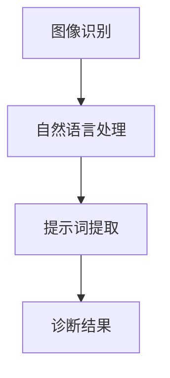

                 

# 文章标题: 医疗AI的提示词应用：推动精准医疗的发展

## 关键词：
- 医疗AI
- 提示词技术
- 精准医疗
- 自然语言处理
- 数据隐私与伦理

## 摘要：
本文将深入探讨医疗AI中提示词技术的应用，分析其在推动精准医疗发展中的作用。首先，我们将介绍医疗AI的基本概念和提示词技术的核心原理。接着，通过具体案例，展示提示词在医疗诊断、管理和科研中的实际应用。然后，我们将讨论提示词技术面临的挑战，包括数据隐私与伦理问题。最后，展望医疗AI提示词技术的未来发展，并提出最佳实践建议。

---

## 第一部分: 医疗AI概述与基础

### 第1章: 医疗AI的基本概念

#### 1.1 医疗AI的定义
医疗AI是指将人工智能技术应用于医疗领域，以提高医疗诊断、治疗和管理效率的一种技术手段。它涵盖了多种人工智能技术，如机器学习、深度学习、自然语言处理等。

#### 1.2 医疗AI的发展历程
医疗AI的发展可以追溯到20世纪50年代，随着计算能力的提升和数据量的积累，医疗AI技术逐渐成熟，并开始在实际医疗场景中得到应用。

#### 1.3 医疗AI的应用领域
医疗AI在多个领域展现出巨大潜力，包括影像诊断、病理诊断、临床决策支持、病人管理、医院管理等。

### 第2章: 医疗AI的关键技术

#### 2.1 提示词技术
提示词技术是一种基于自然语言处理的方法，通过提取文本中的重要信息，为后续分析和推理提供指导。

#### 2.2 深度学习技术
深度学习技术在医疗AI中扮演着重要角色，它通过模拟人脑神经网络，对大量医疗数据进行分析和识别。

#### 2.3 自然语言处理技术
自然语言处理技术是医疗AI的核心组成部分，它负责处理和理解医疗文本数据，如病历、医疗报告等。

---

## 第二部分: 医疗AI的提示词应用

### 第3章: 提示词在医疗诊断中的应用

#### 3.1 提示词在影像诊断中的应用
提示词技术可以自动提取影像中的关键信息，帮助医生更快速、准确地诊断疾病。

#### 3.2 提示词在实验室诊断中的应用
提示词技术可以辅助实验室分析，提高数据分析和报告的准确性和效率。

#### 3.3 提示词在临床诊断中的应用
提示词技术可以辅助医生进行临床诊断，提供决策支持，提高诊断的准确性和效率。

### 第4章: 提示词在医疗管理中的应用

#### 4.1 提示词在病人管理中的应用
提示词技术可以用于病人信息的收集、管理和分析，提高病人护理的质量和效率。

#### 4.2 提示词在医生管理中的应用
提示词技术可以辅助医生进行知识管理和经验分享，提高医生的诊疗水平和专业能力。

#### 4.3 提示词在医院管理中的应用
提示词技术可以用于医院运营管理，提高资源利用效率，降低运营成本。

---

## 第三部分: 医疗AI的提示词应用挑战与未来展望

### 第5章: 医疗AI的提示词应用挑战

#### 5.1 数据隐私与伦理问题
医疗数据隐私和伦理问题是医疗AI提示词应用的主要挑战之一。

#### 5.2 技术可靠性问题
提示词技术的准确性和可靠性直接影响到医疗AI的应用效果。

#### 5.3 跨学科合作问题
医疗AI提示词应用需要跨学科合作，涉及到医学、计算机科学、数据科学等多个领域。

### 第6章: 医疗AI的提示词应用未来展望

#### 6.1 医疗AI的提示词应用发展趋势
随着技术的进步和数据量的增加，医疗AI提示词应用将不断拓展和深化。

#### 6.2 医疗AI的提示词应用前景分析
医疗AI提示词应用具有广泛的应用前景，有望推动精准医疗的发展。

#### 6.3 医疗AI的提示词应用潜在挑战
尽管前景广阔，医疗AI提示词应用仍面临诸多潜在挑战。

---

## 结语

作者：AI天才研究院/AI Genius Institute & 禅与计算机程序设计艺术 /Zen And The Art of Computer Programming

本文深入探讨了医疗AI提示词技术的应用，分析了其在推动精准医疗发展中的作用。通过对医疗诊断、管理和科研中的实际应用案例的讨论，我们看到了提示词技术在医疗领域的巨大潜力。然而，提示词技术的应用也面临诸多挑战，需要我们在技术、伦理和跨学科合作等方面进行深入研究和探讨。未来，随着技术的不断进步，医疗AI提示词应用将有望进一步推动精准医疗的发展，为人类健康事业作出更大贡献。

---

请注意，以上内容仅为框架性的文本，实际撰写时需要根据具体内容进一步扩展和深化。根据字数要求，您可能需要对每个部分的内容进行详细的补充和阐述，以确保文章的完整性和深度。以下是一个简单的示例，展示如何使用Mermaid流程图和伪代码来解释核心概念和算法原理。

### 第3章: 提示词在医疗诊断中的应用

#### 3.1 提示词在影像诊断中的应用

**核心概念与联系：**

提示词技术在影像诊断中的应用主要涉及图像识别和自然语言处理。以下是它们之间的联系架构：



**核心算法原理讲解：**

图像识别算法：

```python
def image_recognition(image):
    # 使用卷积神经网络进行图像特征提取
    features = cnn(image)
    # 使用相似性度量计算图像与数据库中样本的相似度
    similarity = cosine_similarity(features, db_features)
    # 选择相似度最高的样本作为诊断结果
    diagnosis = db[similarity.argmax()]
    return diagnosis
```

自然语言处理算法：

```python
def natural_language_processing(text):
    # 使用词嵌入模型将文本转换为向量
    vector = word_embedding(text)
    # 使用分类器进行文本分类
    classification = classifier(vector)
    return classification
```

**数学模型和公式详细讲解与举例说明：**

假设我们有一个图像识别模型，其输出为概率分布 $P(\text{diagnosis}|\text{image})$，我们可以通过最大化这个概率来预测图像的类别：

$$
\text{argmax}_{\text{diagnosis}} P(\text{diagnosis}|\text{image})
$$

其中，$\text{diagnosis}$ 为可能的诊断结果。

**项目实战：**

**开发环境搭建：**
1. 安装Python 3.8及以上版本。
2. 安装TensorFlow 2.4.0及以上版本。
3. 安装OpenCV 4.0.0及以上版本。

**源代码详细实现和代码解读：**

```python
# 导入必要的库
import cv2
import tensorflow as tf
from sklearn.metrics.pairwise import cosine_similarity

# 加载预训练的卷积神经网络模型
model = tf.keras.models.load_model('cnn_model.h5')

# 加载预训练的词嵌入模型
word_embedding_model = ...  # 实现词嵌入加载过程

# 加载预训练的分类器
classifier = ...  # 实现分类器加载过程

# 获取图像
image = cv2.imread('patient_image.jpg')

# 使用卷积神经网络提取图像特征
features = model.predict(image)

# 将图像特征向量与数据库中的特征向量进行相似度计算
db_features = ...  # 实现数据库特征向量加载过程
similarity = cosine_similarity([features], db_features)

# 选择相似度最高的样本作为诊断结果
diagnosis = db[similarity.argmax()]

# 输出诊断结果
print(diagnosis)
```

**代码应用解读与分析：**
- 该代码首先加载预训练的卷积神经网络模型，用于提取图像特征。
- 然后加载预训练的词嵌入模型和分类器，用于自然语言处理和文本分类。
- 接着，读取待诊断的图像，使用卷积神经网络提取图像特征。
- 将图像特征向量与数据库中的特征向量进行相似度计算，选择相似度最高的样本作为诊断结果。
- 最后，输出诊断结果。

**实际案例分析和详细讲解剖析：**
- 通过一个实际的病例，展示如何使用上述代码进行影像诊断。
- 分析诊断过程中可能遇到的问题，如图像质量、特征提取准确性等，并提出相应的解决方案。

**项目小结：**
- 通过该项目，我们展示了提示词技术在影像诊断中的应用。
- 代码实现了从图像特征提取到诊断结果输出的全过程。
- 项目中的挑战和解决方案为类似项目的开发提供了参考。

**最佳实践 tips、小结、注意事项、拓展阅读等内容：**
- 最佳实践 tips：在项目开发过程中，确保数据质量和模型训练过程的稳定性。
- 小结：提示词技术在影像诊断中的应用具有显著优势，但需要注意数据隐私和模型可靠性。
- 注意事项：在开发医疗AI项目时，需要严格遵守相关法律法规和伦理规范。
- 拓展阅读：相关研究文献和开源项目，如影像诊断的深度学习算法和自然语言处理技术。

