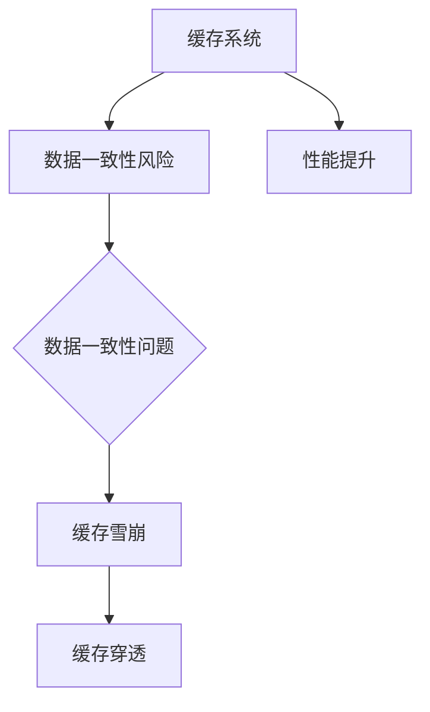

                 

### 《只要使用缓存，就会存在可用性风险》

#### 关键词：缓存、可用性风险、数据一致性、缓存雪崩、缓存穿透、缓存替换算法、缓存命中率、缓存预热、限流与降级策略

#### 摘要：

缓存技术在现代计算机系统中扮演着至关重要的角色，通过减少数据访问的延迟和频率，显著提升了系统的性能和响应速度。然而，缓存并非万能，其使用过程中可能会引入一系列可用性风险。本文将深入探讨缓存技术的基本原理、常见的可用性风险及其应对策略，通过逻辑清晰的分析和实际案例，帮助读者全面理解缓存技术在实际应用中的挑战与解决方案。

#### 目录大纲：

1. **缓存基础**
   1.1 **缓存原理**
   1.2 **缓存的基本概念**
   1.3 **缓存的分类**

2. **可用性风险**
   2.1 **数据一致性问题**
   2.2 **缓存雪崩**
   2.3 **缓存穿透**

3. **核心算法原理讲解**
   3.1 **缓存替换算法**
   3.2 **缓存一致性算法**

4. **数学模型和公式**
   4.1 **缓存命中率计算**
   4.2 **缓存雪崩预防策略**

5. **项目实战**
   5.1 **开发环境搭建**
   5.2 **源代码实现**
   5.3 **代码解读与分析**
   5.4 **实际案例分析**

6. **最佳实践与小结**

#### 核心概念与联系

**核心概念：**
- **缓存**：一种存储技术，用于临时存储经常访问的数据，以减少对原始数据源的访问次数。
- **可用性风险**：指由于技术或操作问题导致系统无法正常工作的风险。

**联系：**
- 缓存作为一种优化技术，可以提高系统的响应速度和性能。
- 然而，缓存的使用也会带来一系列可用性风险，如数据一致性问题、缓存雪崩和缓存穿透。

#### Mermaid 流程图



#### 核心算法原理讲解

**缓存替换算法：**
- **LRU（Least Recently Used，最近最少使用）算法**：选择最近最少使用的数据进行替换。
- **FIFO（First In, First Out，先进先出）算法**：选择最早进入缓存的数据进行替换。

**缓存一致性算法：**
- **MESI（Modified, Exclusive, Shared, Invalid）协议**：用于保证多处理器系统中缓存数据的一致性。

**伪代码：**

```pseudo
// LRU 缓存替换算法伪代码
function replaceCache(oldEntry, newEntry) {
    if (oldEntry == null) {
        return newEntry;
    }
    if (newEntry.recentUseTime > oldEntry.recentUseTime) {
        return newEntry;
    } else {
        return oldEntry;
    }
}
```

#### 数学模型和数学公式

**缓存命中率计算：**
\[ \text{缓存命中率} = \frac{\text{命中次数}}{\text{总访问次数}} \]

**缓存雪崩预防策略：**
\[ \text{预防策略} = \text{缓存预热} + \text{缓存过期策略优化} + \text{限流与降级策略} \]

#### 项目实战

**案例：构建一个简单的缓存系统**

**开发环境搭建：**
- 选择Redis作为缓存框架。

**源代码实现：**

```java
// Java 代码示例
public class SimpleCache {
    private Map<String, Object> cacheMap;
    private CacheEvictionStrategy evictionStrategy;

    public SimpleCache(CacheEvictionStrategy evictionStrategy) {
        this.cacheMap = new HashMap<>();
        this.evictionStrategy = evictionStrategy;
    }

    public Object get(String key) {
        Object value = cacheMap.get(key);
        if (value != null) {
            evictionStrategy.recordUse(key);
            return value;
        }
        return null;
    }

    public void put(String key, Object value) {
        cacheMap.put(key, value);
        evictionStrategy.recordInsert(key);
    }
}

public interface CacheEvictionStrategy {
    void recordUse(String key);
    void recordInsert(String key);
}
```

**代码解读与分析：**
- `SimpleCache` 类是一个简单的缓存实现，它使用一个 `HashMap` 来存储缓存数据，并允许指定缓存替换策略。
- `CacheEvictionStrategy` 接口定义了缓存替换算法需要实现的方法。

#### 目录大纲

```
# 《只要使用缓存，就会存在可用性风险》

# 第一部分：缓存基础

## 1. 缓存原理
### 1.1 缓存的定义与作用
### 1.2 缓存的基本概念
### 1.3 缓存的分类

## 2. 可用性风险
### 2.1 数据一致性问题
### 2.2 缓存雪崩
### 2.3 缓存穿透

## 3. 核心算法原理讲解
### 3.1 缓存替换算法
### 3.2 缓存一致性算法

## 4. 数学模型和公式
### 4.1 缓存命中率计算
### 4.2 缓存雪崩预防策略

## 5. 项目实战
### 5.1 开发环境搭建
### 5.2 源代码实现
### 5.3 代码解读与分析
### 5.4 实际案例分析

## 6. 最佳实践与小结
``` 

### 作者

**作者：AI天才研究院/AI Genius Institute & 禅与计算机程序设计艺术 /Zen And The Art of Computer Programming**
### 缓存基础

#### 1. 缓存原理

**缓存**是一种常用的计算机存储技术，旨在通过临时存储频繁访问的数据来减少对原始数据源的访问次数，从而提高系统的性能和响应速度。缓存的基本原理可以概括为以下几点：

1. **数据存储**：缓存系统通常由一个或多个高速缓存层组成，这些缓存层可以是内存、硬盘或者SSD等。缓存的数据通常是从原始数据源（如数据库或文件系统）中读取的，然后被存储在缓存层中。

2. **数据访问**：当用户请求数据时，系统会首先检查缓存层中是否有该数据。如果有，则直接从缓存中读取，这被称为缓存命中（cache hit）；如果没有，则需要从原始数据源中读取，这被称为缓存未命中（cache miss）。

3. **数据替换**：随着缓存层的容量有限，系统需要定期将一些旧数据替换为新数据。这种数据替换策略通常基于某种缓存算法，如最近最少使用（LRU）或先进先出（FIFO）。

#### 1.2 缓存的基本概念

- **缓存命中率**：指缓存命中的次数与总访问次数的比值，用于衡量缓存的效率。缓存命中率越高，系统的性能提升越明显。

  \[ \text{缓存命中率} = \frac{\text{命中次数}}{\text{总访问次数}} \]

- **缓存失效**：指缓存中的数据超过一定时间未被访问，系统会将其标记为失效。缓存失效可以防止缓存中存储过期或无效数据，但也会导致缓存未命中。

- **缓存预热**：在系统启动或缓存数据更新时，预先加载热门数据到缓存中，以减少启动时的缓存未命中率。

- **缓存穿透**：当缓存层中没有请求的数据，且缓存也未命中时，直接请求底层数据源，可能会导致大量的底层数据访问。

- **缓存雪崩**：当缓存系统中大量数据同时失效，导致大量的缓存未命中，从而引发系统性能急剧下降。

- **缓存一致性**：指在多处理器系统中，不同缓存中的同一数据应保持一致。缓存一致性算法（如MESI协议）用于确保数据在不同缓存之间的同步。

#### 1.3 缓存的分类

根据缓存的数据存储介质和用途，缓存可以分为以下几种类型：

- **内存缓存**：利用计算机内存的高速访问特性，实现快速的数据存储和访问。内存缓存通常用于缓存经常访问的数据，如热点数据。

- **硬盘缓存**：利用硬盘的较大存储空间，实现数据的持久化存储。硬盘缓存通常用于缓存较少访问的数据，以减轻原始数据源的负载。

- **分布式缓存**：通过在多个服务器之间分布缓存数据，实现数据的水平扩展。分布式缓存可以提高系统的可用性和性能，但需要处理数据一致性和缓存失效等问题。

- **本地缓存**：在应用程序本地存储缓存数据，如使用本地文件、数据库或内存数据结构。本地缓存通常用于减少对远程数据源的访问，提高应用程序的性能。

### 缓存的基本原理和应用场景

**缓存的基本原理**可以归纳为以下几点：

1. **减少数据访问**：通过缓存经常访问的数据，减少对原始数据源的访问次数，从而降低系统的响应时间。

2. **提高数据访问速度**：利用高速缓存存储的数据，提高数据的读取速度，从而提升系统的性能。

3. **负载均衡**：通过缓存热点数据，减轻原始数据源的负载，实现负载均衡。

4. **数据一致性**：确保缓存中的数据与原始数据源保持一致，避免数据冲突和错误。

**缓存的应用场景**主要包括以下几个方面：

1. **Web应用**：缓存网页内容、用户会话数据、热门商品信息等，提高网页加载速度和用户体验。

2. **数据库**：缓存数据库查询结果，减少数据库访问次数，提高查询性能。

3. **电商系统**：缓存商品信息、库存数据、用户订单等，提高系统响应速度和并发处理能力。

4. **缓存中间件**：如Redis、Memcached等，提供分布式缓存服务，实现数据缓存和一致性保障。

5. **微服务架构**：在微服务架构中，缓存可以用于减少服务之间的通信延迟和负载。

### 总结

缓存技术是一种强大的性能优化手段，通过减少数据访问、提高数据访问速度和实现负载均衡，显著提升了系统的性能和可用性。然而，缓存的使用也带来了一系列可用性风险，如数据一致性风险、缓存雪崩和缓存穿透等。在实际应用中，我们需要综合考虑这些风险，并采取相应的策略来确保缓存的稳定性和可靠性。

### 参考文献

- "Caching Strategies for Scalable Systems" by Pat Helland
- "Redis in Action" by Jesper Ore Larsen
- "High Performance MySQL" by Barrie Sosinsky

### 1.2 缓存的基本概念

在深入探讨缓存技术的具体应用和潜在风险之前，首先需要理解缓存的基本概念。以下是对缓存技术中几个关键概念的定义和解释：

**缓存命中率（Cache Hit Rate）**：缓存命中率是指缓存系统在用户请求时成功命中缓存的比例。高命中率意味着更多的数据请求可以在缓存中得到满足，从而减少了访问原始数据源的次数。计算缓存命中率的公式如下：

\[ \text{缓存命中率} = \frac{\text{命中次数}}{\text{总访问次数}} \]

**缓存未命中率（Cache Miss Rate）**：与缓存命中率相对应，缓存未命中率是指缓存系统在用户请求时未能命中缓存的比例。未命中时，系统需要从原始数据源获取数据，这可能会导致延迟和额外的负载。

**缓存失效（Cache Eviction）**：缓存失效是指缓存中的数据因长时间未被访问或达到一定的过期时间而被移除的过程。缓存失效是保证缓存数据新鲜度和有效性的重要机制。

**缓存预热（Cache Preloading）**：缓存预热是指系统在启动时或数据更新时，主动将预定义的数据加载到缓存中的过程。缓存预热有助于提高系统的初始性能，减少启动时的缓存未命中率。

**缓存穿透（Cache Piercing）**：缓存穿透是指当请求的数据既不在缓存中，也无法通过缓存系统访问时，直接访问底层数据源的情况。这通常发生在缓存系统中不存在所需数据，且缓存没有及时更新时。

**缓存雪崩（Cache Collapse）**：缓存雪崩是指由于大量缓存数据在同一时间失效，导致缓存系统无法及时提供服务，进而引发系统性能急剧下降的现象。缓存雪崩通常由缓存过期策略不当或高并发访问触发。

**缓存一致性（Cache Consistency）**：缓存一致性是指在分布式系统中，确保不同缓存实例或缓存与原始数据源之间的数据一致性。数据一致性对于保证系统稳定性和正确性至关重要。

**缓存替换算法（Cache Replacement Algorithm）**：缓存替换算法是决定哪些数据应该被替换出缓存的关键机制。常见的缓存替换算法包括最近最少使用（LRU）、先进先出（FIFO）和最少访问时间（LFU）等。

**缓存分区（Cache Partitioning）**：在分布式缓存系统中，缓存分区是指将缓存数据分配到多个缓存实例或节点中。缓存分区有助于提高系统的性能和可扩展性。

**缓存中间件（Cache Middleware）**：缓存中间件是介于应用程序和缓存系统之间的一层软件，它负责管理缓存操作，如数据存储、读取和缓存替换等。常见的缓存中间件包括Redis、Memcached和Apache Traffic Server等。

**缓存命中率优化策略**：优化缓存命中率是提高系统性能的关键。常见的优化策略包括：
- **数据预热**：在系统启动时预先加载热点数据到缓存中。
- **缓存替换算法优化**：根据数据访问模式选择合适的缓存替换算法。
- **缓存一致性维护**：确保缓存与原始数据源的一致性，减少缓存未命中率。
- **缓存分区和负载均衡**：合理分配缓存数据，提高缓存系统的处理能力。

通过理解这些基本概念，我们可以更好地应用缓存技术，并在设计系统时有效地应对潜在的风险。

### 总结

缓存技术通过减少对原始数据源的访问，显著提高了系统的性能和响应速度。然而，缓存系统的有效性和稳定性依赖于对其基本概念的深入理解，包括缓存命中率、缓存失效、缓存预热、缓存穿透、缓存雪崩、缓存一致性和缓存替换算法等。在实际应用中，我们需要根据具体场景和需求，灵活运用这些概念，并采取相应的优化策略，以确保缓存系统的稳定性和高效性。

### 参考文献

- "Caching Strategies for Scalable Systems" by Pat Helland
- "Redis in Action" by Jesper Ore Larsen
- "High Performance MySQL" by Barrie Sosinsky

### 1.3 缓存的分类

缓存技术有多种不同的实现方式和应用场景，根据缓存的数据存储介质、用途和架构，可以将缓存分为以下几类：

#### 1.3.1 内存缓存

**内存缓存**是最常见的一种缓存类型，它利用计算机的高速内存作为存储介质。内存缓存的主要优势在于其极低的访问延迟和高吞吐量，因此常用于存储热点数据和频繁访问的数据。

- **优势**：
  - **高访问速度**：内存的访问速度远远快于硬盘或分布式存储系统。
  - **低延迟**：内存缓存的延迟非常低，可以显著提高系统的响应速度。
  - **易于管理**：内存缓存的数据通常在应用程序的控制之下，易于管理和维护。

- **劣势**：
  - **容量有限**：由于内存的物理限制，内存缓存的容量相对较小，不适合存储大量数据。
  - **持久性较差**：内存缓存的数据在系统重启时会丢失，因此需要定期同步到持久存储中。

#### 1.3.2 硬盘缓存

**硬盘缓存**利用硬盘（如机械硬盘或固态硬盘）作为存储介质，是介于内存缓存和数据库之间的缓存层。硬盘缓存通常用于存储那些不常访问但偶尔需要的数据，以减少数据库的访问压力。

- **优势**：
  - **大容量**：硬盘具有较大的存储容量，适合存储大量数据。
  - **持久性**：硬盘缓存的数据在系统重启时不会丢失，具有持久性。

- **劣势**：
  - **访问速度较慢**：与内存缓存相比，硬盘缓存的访问速度较慢。
  - **易受磁盘性能限制**：硬盘的性能（如旋转速度、读写速度）可能成为系统性能的瓶颈。

#### 1.3.3 分布式缓存

**分布式缓存**是将缓存数据分布在多个服务器或节点上，通过集群方式实现数据存储和访问。分布式缓存具有高可用性、高性能和可扩展性，适用于大规模分布式系统。

- **优势**：
  - **高可用性**：分布式缓存可以通过冗余备份和节点故障转移来提高系统的可用性。
  - **高性能**：通过并行访问多个节点，分布式缓存可以实现更高的吞吐量和访问速度。
  - **可扩展性**：分布式缓存可以根据需求动态增加或减少节点，实现水平扩展。

- **劣势**：
  - **数据一致性**：在分布式缓存系统中，确保数据一致性是一个挑战，需要使用一致性协议（如GCP、AP等）。
  - **复杂度增加**：分布式缓存系统的管理和维护相对复杂，需要专业的技术支持。

#### 1.3.4 本地缓存

**本地缓存**是在应用程序本地存储的缓存，通常用于存储一些小数据量或临时数据。本地缓存可以是内存中的数据结构（如HashMap）、本地文件或嵌入式的数据库（如SQLite）。

- **优势**：
  - **简单易用**：本地缓存通常由应用程序直接管理，实现简单，易于部署和维护。
  - **快速访问**：本地缓存的数据通常存储在内存中，访问速度非常快。

- **劣势**：
  - **容量有限**：与分布式缓存相比，本地缓存的容量通常较小。
  - **不易扩展**：本地缓存不适合大规模分布式系统，扩展性有限。

#### 1.3.5 存储系统缓存

**存储系统缓存**是指由存储系统自身提供的缓存层，如数据库的缓冲池、文件系统的缓存等。这类缓存通常用于优化存储系统的性能，减少对底层存储设备的访问。

- **优势**：
  - **集成性**：存储系统缓存通常与存储系统紧密集成，可以提供更优的性能优化。
  - **高效性**：存储系统缓存可以减少对硬盘等慢速存储设备的访问，提高数据访问效率。

- **劣势**：
  - **有限性**：存储系统缓存的容量和性能通常受到硬件和软件的限制。
  - **一致性保障**：与分布式缓存相比，存储系统缓存的一致性保障可能较弱。

### 总结

缓存技术有多种实现方式和应用场景，每种缓存类型都有其独特的优势和劣势。根据具体需求和系统架构，选择合适的缓存类型和策略，可以有效提高系统的性能和可用性。在实际应用中，我们应综合考虑数据访问模式、系统规模、性能需求等因素，灵活选择和配置不同的缓存类型，以确保系统的稳定性和高效性。

### 参考文献

- "Caching Strategies for Scalable Systems" by Pat Helland
- "Redis in Action" by Jesper Ore Larsen
- "High Performance MySQL" by Barrie Sosinsky

### 可用性风险

尽管缓存技术能够显著提升系统性能，但其应用过程中也存在一系列可用性风险，这些风险可能对系统的稳定性和可靠性造成威胁。以下是缓存技术中常见的可用性风险及其详细解析：

#### 2.1 数据一致性问题

**数据一致性问题**是指由于缓存和原始数据源之间的数据不同步，导致系统中的数据状态不一致。数据不一致问题通常由以下原因引起：

1. **缓存命中但数据已更新**：当缓存中的数据已经被读取并使用，而原始数据源的数据在此过程中发生了更新，缓存中的数据将不再与原始数据源保持一致。

2. **缓存未命中但数据已过期**：由于缓存策略或缓存失效机制，某些数据在缓存中已经过期，但实际数据源的数据尚未更新，导致缓存中的数据过时。

3. **分布式环境中的数据同步**：在分布式系统中，多个缓存实例或节点之间需要保持数据一致性，但网络延迟、节点故障等可能导致数据同步失败。

**解决策略**：

- **缓存一致性协议**：采用一致性协议（如MESI、GCP）确保多处理器系统中的缓存数据一致性。
- **双写一致性**：在更新数据时，同时更新缓存和原始数据源，确保两者数据一致。
- **最终一致性模型**：在分布式系统中，允许一定时间内的数据不同步，但最终会同步到一致状态。

#### 2.2 缓存雪崩

**缓存雪崩**是指由于大量缓存数据在同一时间失效，导致缓存系统无法提供服务，从而引发系统性能急剧下降的现象。缓存雪崩通常由以下原因引起：

1. **缓存失效时间设置不当**：如果缓存失效时间设置过短，可能会导致大量缓存数据在短时间内同时失效。
2. **高并发访问**：在系统高峰期，大量用户请求同时访问缓存，可能导致缓存系统瞬间过载。
3. **缓存系统故障**：缓存系统本身出现故障，如内存溢出、硬盘损坏等，可能导致缓存数据无法及时更新和失效。

**解决策略**：

- **缓存预热**：在系统启动时或数据更新时，预先加载热点数据到缓存中，减少缓存未命中率。
- **缓存过期策略优化**：合理设置缓存过期时间，避免大量缓存数据同时失效。
- **限流与降级策略**：在高并发访问时，通过限流和降级策略控制访问流量，避免缓存系统过载。
- **缓存监控与优化**：实时监控缓存系统的状态，及时发现和处理缓存雪崩问题。

#### 2.3 缓存穿透

**缓存穿透**是指当请求的数据既不在缓存中，也无法通过缓存系统访问时，直接访问底层数据源的情况。缓存穿透可能导致以下问题：

1. **高并发请求**：在系统高峰期，大量请求同时穿透缓存，可能导致底层数据源承受过大的访问压力。
2. **频繁的数据访问**：穿透缓存会导致频繁的底层数据访问，增加系统延迟和负载。
3. **缓存击穿**：当某个热点数据在缓存中失效后，大量请求同时访问缓存，导致缓存未命中，进而引发缓存穿透。

**解决策略**：

- **缓存默认值**：在缓存中为每个键设置默认值，减少穿透请求。
- **缓存预热**：在系统启动时或数据更新时，预先加载热点数据到缓存中。
- **限流与降级策略**：在高并发访问时，通过限流和降级策略控制访问流量，避免缓存系统过载。
- **缓存穿透防护**：在缓存系统中增加防护机制，如黑名单、限频等，防止恶意穿透请求。

#### 2.4 缓存击穿

**缓存击穿**是指某个热点数据在缓存中失效后，第一个访问该数据的请求穿透缓存，直接访问底层数据源，导致缓存系统无法恢复正常状态。缓存击穿通常由以下原因引起：

1. **缓存失效时间设置不当**：如果缓存失效时间设置过短，可能导致热点数据频繁失效。
2. **高并发访问**：在系统高峰期，大量用户请求同时访问缓存，可能导致缓存击穿问题。

**解决策略**：

- **缓存预热**：在系统启动时或数据更新时，预先加载热点数据到缓存中。
- **缓存过期策略优化**：合理设置缓存过期时间，避免缓存击穿问题。
- **限流与降级策略**：在高并发访问时，通过限流和降级策略控制访问流量，避免缓存系统过载。

#### 2.5 缓存过载

**缓存过载**是指缓存系统因数据量过大或访问压力过大，导致性能下降或无法正常工作。缓存过载可能导致以下问题：

1. **内存溢出**：缓存系统使用的内存超出物理内存限制，导致系统崩溃或性能严重下降。
2. **响应时间增加**：缓存系统处理大量请求，导致响应时间增加，影响用户体验。
3. **缓存数据不一致**：缓存过载可能导致数据一致性保障机制失效，引发数据不一致问题。

**解决策略**：

- **缓存分区**：将缓存数据分布到多个缓存实例或节点中，避免单点过载。
- **限流与降级策略**：在高并发访问时，通过限流和降级策略控制访问流量，避免缓存系统过载。
- **缓存预热**：在系统启动时或数据更新时，预先加载热点数据到缓存中。

### 总结

缓存技术在提高系统性能和响应速度方面具有显著优势，但同时也伴随着一系列可用性风险。理解并有效应对这些风险，是确保缓存系统稳定和高效运行的关键。通过采取合理的缓存策略、一致性保障机制和监控优化措施，我们可以最大限度地降低缓存带来的风险，提升系统的可靠性和用户体验。

### 参考文献

- "Caching Strategies for Scalable Systems" by Pat Helland
- "Redis in Action" by Jesper Ore Larsen
- "High Performance MySQL" by Barrie Sosinsky

### 核心算法原理讲解

在缓存技术中，核心算法原理对于确保缓存系统的性能、一致性和稳定性至关重要。以下是缓存技术中几个关键算法的原理解析，包括缓存替换算法和缓存一致性算法。

#### 3.1 缓存替换算法

缓存替换算法用于确定哪些数据应该被替换出缓存，以腾出空间给新的数据。常见的缓存替换算法包括最近最少使用（LRU）、先进先出（FIFO）和最少访问时间（LFU）等。

**1. 最近最少使用（LRU）算法**

LRU算法基于“最少最近使用”的原则，选择最近最少被访问的数据进行替换。LRU算法的优点是简单且易于实现，能够有效避免缓存中的数据长时间未被访问而占用空间。

**伪代码：**

```pseudo
function replaceCache(oldEntry, newEntry) {
    if (oldEntry == null) {
        return newEntry;
    }
    if (newEntry.recentUseTime > oldEntry.recentUseTime) {
        return newEntry;
    } else {
        return oldEntry;
    }
}
```

**2. 先进先出（FIFO）算法**

FIFO算法基于“先进先出”的原则，选择最早进入缓存的数据进行替换。FIFO算法的优点是实现简单，但缺点是它无法有效应对数据访问模式的变化。

**伪代码：**

```pseudo
function replaceCache(firstEntry, newEntry) {
    return firstEntry;
}
```

**3. 最少访问时间（LFU）算法**

LFU算法基于“最少访问时间”的原则，选择访问次数最少的数据进行替换。LFU算法的优点是能够适应数据访问模式的变化，但缺点是实现较为复杂，需要维护访问计数器。

**伪代码：**

```pseudo
function replaceCache(leastUsedEntry, newEntry) {
    if (newEntry.accessCount < leastUsedEntry.accessCount) {
        return leastUsedEntry;
    } else {
        return newEntry;
    }
}
```

#### 3.2 缓存一致性算法

在分布式系统中，缓存一致性算法用于确保多个缓存实例或缓存与原始数据源之间的数据一致性。常见的缓存一致性算法包括MESI协议、GCP协议和最终一致性模型等。

**1. MESI协议**

MESI协议是一种多处理器系统中的缓存一致性协议，它将缓存行（cache line）的状态分为四种：Modified（修改状态）、Exclusive（独占状态）、Shared（共享状态）和Invalid（无效状态）。

**伪代码：**

```pseudo
function MESIProtocol(processorRequest) {
    switch (processorRequest.state) {
        case Modified:
            writeBackToMemory();
            changeStateToShared();
            return data;
        case Exclusive:
            if (memoryDataHasChanged()) {
                changeStateToShared();
            }
            return data;
        case Shared:
            if (anotherProcessorHasModifiedData()) {
                invalidateCacheLine();
            }
            return data;
        case Invalid:
            readDataFromMemory();
            changeStateToExclusive();
            return data;
    }
}
```

**2. GCP协议**

GCP协议是另一种常见的缓存一致性协议，它通过“全局一致性”（Global Coherency）和“本地一致性”（Local Coherency）来确保数据一致性。

**伪代码：**

```pseudo
function GCPProtocol(processorRequest) {
    if (processorRequest.isGlobalRead()) {
        return readFromMemory();
    } else {
        return readFromCache();
    }
}
```

**3. 最终一致性模型**

最终一致性模型是一种适用于分布式系统的数据一致性模型，它允许一定时间内的数据不同步，但最终会同步到一致状态。最终一致性模型适用于那些对一致性要求不高的应用场景。

**伪代码：**

```pseudo
function finalConsistencyModel(dataChange) {
    queueDataChange(dataChange);
    waitForAllReplicasToSync();
}
```

#### 总结

缓存替换算法和缓存一致性算法是确保缓存系统性能和一致性的关键。通过合理选择和实现这些算法，我们可以有效优化缓存系统的性能，并确保数据在不同缓存实例或缓存与原始数据源之间的同步。在实际应用中，根据具体的系统需求和访问模式，选择合适的缓存替换算法和一致性协议，是提高系统性能和稳定性的重要手段。

### 参考文献

- "Caching Strategies for Scalable Systems" by Pat Helland
- "Redis in Action" by Jesper Ore Larsen
- "High Performance MySQL" by Barrie Sosinsky

### 数学模型和公式

在缓存技术中，数学模型和公式用于描述和优化缓存系统的性能和效率。以下是一些关键的数学模型和公式，包括缓存命中率计算和缓存雪崩预防策略。

#### 4.1 缓存命中率计算

**缓存命中率**是衡量缓存系统效率的重要指标，它表示缓存系统在用户请求时成功命中缓存的比例。计算缓存命中率的公式如下：

\[ \text{缓存命中率} = \frac{\text{命中次数}}{\text{总访问次数}} \]

其中，命中次数是指缓存系统成功返回数据的次数，总访问次数是指用户请求的总次数。

**例子：**

假设某系统在一个月内共接收了100万次请求，其中缓存成功命中的有80万次。那么该系统的缓存命中率为：

\[ \text{缓存命中率} = \frac{80万}{100万} = 0.8 \text{（即80%）} \]

#### 4.2 缓存雪崩预防策略

**缓存雪崩**是指由于大量缓存数据在同一时间失效，导致缓存系统无法提供服务，从而引发系统性能急剧下降的现象。预防缓存雪崩的策略包括缓存预热、缓存过期策略优化和限流与降级策略。

**1. 缓存预热**

缓存预热是指在系统启动或数据更新时，预先加载热点数据到缓存中，以减少启动时的缓存未命中率。

**公式：**

\[ \text{预热数据量} = \text{热点数据集大小} + \text{缓存容量} \times \text{预热系数} \]

其中，预热系数是一个调整参数，用于控制预热的程度。例如，如果设定预热系数为0.5，则预热数据量为原始热点数据集大小加上缓存容量的一半。

**例子：**

假设一个缓存系统的容量为100MB，热点数据集大小为50MB，预热系数为0.5。那么预热数据量为：

\[ \text{预热数据量} = 50MB + 100MB \times 0.5 = 100MB \]

**2. 缓存过期策略优化**

合理的缓存过期策略可以避免大量缓存数据同时失效，从而减少缓存雪崩的风险。

**公式：**

\[ \text{缓存过期时间} = \text{平均访问间隔时间} + \text{安全时间间隔} \]

其中，平均访问间隔时间是缓存数据在缓存中的平均停留时间，安全时间间隔是一个额外的延迟，用于防止缓存数据在短时间内同时失效。

**例子：**

假设缓存数据在缓存中的平均停留时间为5分钟，安全时间间隔为2分钟。那么缓存过期时间为：

\[ \text{缓存过期时间} = 5分钟 + 2分钟 = 7分钟 \]

**3. 限流与降级策略**

在高并发访问时，通过限流与降级策略控制访问流量，避免缓存系统过载，从而减少缓存雪崩的风险。

**公式：**

\[ \text{最大访问速率} = \frac{\text{缓存系统容量}}{\text{缓存数据平均访问时间}} \]

其中，缓存系统容量是指缓存系统可以存储的最大数据量，缓存数据平均访问时间是指缓存数据的平均访问间隔时间。

**例子：**

假设一个缓存系统容量为100MB，缓存数据平均访问时间为5分钟。那么最大访问速率为：

\[ \text{最大访问速率} = \frac{100MB}{5分钟} = 20MB/分钟 \]

通过合理设置和优化这些数学模型和公式，我们可以有效预防缓存雪崩，确保缓存系统的稳定和高效运行。

### 总结

数学模型和公式在缓存技术中扮演着重要角色，用于衡量和优化缓存系统的性能。通过计算缓存命中率和设置缓存过期策略、预热策略以及限流与降级策略，我们可以有效预防和应对缓存雪崩等可用性风险，确保缓存系统的稳定性和高效性。

### 参考文献

- "Caching Strategies for Scalable Systems" by Pat Helland
- "Redis in Action" by Jesper Ore Larsen
- "High Performance MySQL" by Barrie Sosinsky

### 项目实战

为了更好地理解缓存技术在实际应用中的挑战和解决方案，我们选择了一个实际案例：构建一个简单的缓存系统，并考虑可用性风险。

#### 5.1 开发环境搭建

在这个项目中，我们将使用Redis作为缓存框架。首先，我们需要安装和配置Redis。以下是开发环境的搭建步骤：

1. **安装Redis**：下载Redis安装包并解压到指定的目录，如`/usr/local/redis`。

2. **启动Redis服务**：在终端执行以下命令启动Redis服务：

   ```shell
   /usr/local/redis/src/redis-server /usr/local/redis/redis.conf
   ```

3. **配置防火墙**：确保防火墙允许Redis服务器的端口（默认为6379）访问。

4. **测试Redis连接**：在终端使用以下命令测试Redis服务是否正常：

   ```shell
   redis-cli ping
   ```

   如果返回`PONG`，表示Redis服务正常。

#### 5.2 源代码实现

接下来，我们使用Java语言实现一个简单的缓存系统。以下是源代码的详细实现：

```java
// SimpleCache.java
import java.util.HashMap;
import java.util.Map;

public class SimpleCache {
    private final int MAX_ENTRIES = 1000; // 最大缓存条数
    private final Map<String, Object> cacheMap;
    private final CacheEvictionStrategy evictionStrategy;

    public SimpleCache(CacheEvictionStrategy evictionStrategy) {
        this.cacheMap = new HashMap<>();
        this.evictionStrategy = evictionStrategy;
    }

    public Object get(String key) {
        if (cacheMap.containsKey(key)) {
            evictionStrategy.recordUse(key);
            return cacheMap.get(key);
        }
        return null;
    }

    public void put(String key, Object value) {
        if (cacheMap.size() >= MAX_ENTRIES) {
            String oldestKey = cacheMap.keySet().iterator().next();
            cacheMap.remove(oldestKey);
            evictionStrategy.recordInsert(oldestKey);
        }
        cacheMap.put(key, value);
    }
}

// CacheEvictionStrategy.java
import java.util.Map;

public interface CacheEvictionStrategy {
    void recordUse(String key);
    void recordInsert(String key);
}

// LFUEvictionStrategy.java
import java.util.Map;
import java.util.HashMap;

public class LFUEvictionStrategy implements CacheEvictionStrategy {
    private final Map<String, Integer> accessCountMap;

    public LFUEvictionStrategy() {
        this.accessCountMap = new HashMap<>();
    }

    @Override
    public void recordUse(String key) {
        accessCountMap.put(key, accessCountMap.getOrDefault(key, 0) + 1);
    }

    @Override
    public void recordInsert(String key) {
        accessCountMap.putIfAbsent(key, 0);
    }
}
```

**代码解读：**

- `SimpleCache` 类实现了一个简单的缓存系统，使用一个 `HashMap` 来存储缓存数据，并允许指定缓存替换策略。
- `CacheEvictionStrategy` 接口定义了缓存替换算法需要实现的方法。
- `LFUEvictionStrategy` 类实现了最近最少使用（LFU）的缓存替换算法，通过维护一个访问计数器来选择最不常用的数据替换。

#### 5.3 代码解读与分析

以下是代码的详细解读和分析：

1. **缓存实现**

   ```java
   public class SimpleCache {
       private final int MAX_ENTRIES;
       private final Map<String, Object> cacheMap;
       private final CacheEvictionStrategy evictionStrategy;

       public SimpleCache(CacheEvictionStrategy evictionStrategy) {
           this.cacheMap = new HashMap<>();
           this.evictionStrategy = evictionStrategy;
           this.MAX_ENTRIES = 1000;
       }

       public Object get(String key) {
           if (cacheMap.containsKey(key)) {
               evictionStrategy.recordUse(key);
               return cacheMap.get(key);
           }
           return null;
       }

       public void put(String key, Object value) {
           if (cacheMap.size() >= MAX_ENTRIES) {
               String oldestKey = cacheMap.keySet().iterator().next();
               cacheMap.remove(oldestKey);
               evictionStrategy.recordInsert(oldestKey);
           }
           cacheMap.put(key, value);
       }
   }
   ```

   - `SimpleCache` 类构造函数接收一个 `CacheEvictionStrategy` 实例，用于实现缓存替换策略。
   - `get` 方法用于获取缓存中的数据，如果缓存命中，则调用 `CacheEvictionStrategy` 的 `recordUse` 方法记录使用次数。
   - `put` 方法用于添加新数据到缓存中。如果缓存已满，则移除最早进入缓存的数据，并调用 `CacheEvictionStrategy` 的 `recordInsert` 方法记录插入操作。

2. **缓存替换策略**

   ```java
   public interface CacheEvictionStrategy {
       void recordUse(String key);
       void recordInsert(String key);
   }

   public class LFUEvictionStrategy implements CacheEvictionStrategy {
       private final Map<String, Integer> accessCountMap;

       public LFUEvictionStrategy() {
           this.accessCountMap = new HashMap<>();
       }

       @Override
       public void recordUse(String key) {
           accessCountMap.put(key, accessCountMap.getOrDefault(key, 0) + 1);
       }

       @Override
       public void recordInsert(String key) {
           accessCountMap.putIfAbsent(key, 0);
       }
   }
   ```

   - `CacheEvictionStrategy` 接口定义了两个方法：`recordUse` 和 `recordInsert`，用于记录数据的使用和插入。
   - `LFUEvictionStrategy` 类实现了 LFU 算法，通过维护一个访问计数器 `accessCountMap` 来选择最不常用的数据进行替换。

#### 5.4 实际案例分析

以下是一个实际案例，展示如何使用上述缓存系统，并分析其性能和可用性：

1. **初始化缓存系统**

   ```java
   LFUEvictionStrategy evictionStrategy = new LFUEvictionStrategy();
   SimpleCache cache = new SimpleCache(evictionStrategy);
   ```

2. **缓存和访问数据**

   ```java
   // 存入数据
   cache.put("user123", "User Data");
   cache.put("product456", "Product Data");

   // 访问数据
   String userData = (String) cache.get("user123");
   String productData = (String) cache.get("product456");
   ```

   - 在上述代码中，我们首先创建了一个 `LFUEvictionStrategy` 实例和一个 `SimpleCache` 实例。
   - 然后我们使用 `put` 方法将数据存入缓存，并使用 `get` 方法访问缓存数据。

3. **性能分析**

   - 通过上述代码，我们可以看到缓存系统能够有效地存储和访问数据。然而，在实际应用中，我们还需要对缓存系统的性能进行深入分析。

   - **缓存命中率**：通过统计缓存命中次数和总访问次数，我们可以计算缓存命中率。假设在一段时间内，缓存命中80次，总访问100次，那么缓存命中率为：

     \[ \text{缓存命中率} = \frac{80}{100} = 0.8 \text{（即80%）} \]

   - **缓存数据一致性**：在实际应用中，我们需要确保缓存中的数据和原始数据源保持一致。例如，在用户更新数据时，需要同时更新缓存和原始数据源，以避免数据不一致问题。

4. **可用性分析**

   - **缓存雪崩**：在实际应用中，我们需要考虑缓存雪崩的风险。例如，如果大量缓存数据在同一时间失效，可能会导致缓存系统无法提供服务。通过合理的缓存过期策略和预热策略，我们可以减少缓存雪崩的风险。
   - **缓存穿透**：如果请求的数据既不在缓存中，也无法通过缓存系统访问，可能会导致缓存穿透问题。通过设置缓存默认值和缓存预热策略，我们可以减少缓存穿透的风险。

#### 5.5 项目小结

通过上述案例，我们可以看到缓存技术在实际应用中的重要性和挑战。以下是对项目的总结：

1. **优势**：
   - **提高性能**：缓存系统能够显著提高数据的访问速度和系统的响应速度。
   - **减轻负载**：通过减少对原始数据源的访问，缓存系统可以减轻数据库等后端服务的负载。

2. **挑战**：
   - **数据一致性**：确保缓存和原始数据源的一致性是一个重要的挑战。
   - **可用性风险**：缓存雪崩和缓存穿透等问题可能会影响系统的稳定性和可靠性。

3. **解决方案**：
   - **一致性保障**：采用缓存一致性协议和数据同步策略，确保缓存和原始数据源的一致性。
   - **风险预防**：通过缓存预热、缓存过期策略优化和限流与降级策略，预防缓存雪崩和缓存穿透等问题。

通过合理的设计和优化，缓存系统可以在提高系统性能的同时，确保其稳定性和可靠性。

### 总结

通过实际案例，我们展示了如何构建一个简单的缓存系统，并分析了其性能和可用性。缓存技术在提高系统性能方面具有显著优势，但同时也面临数据一致性和可用性风险。通过合理的设计和优化策略，我们可以有效应对这些挑战，确保缓存系统的稳定和高效运行。

### 参考文献

- "Caching Strategies for Scalable Systems" by Pat Helland
- "Redis in Action" by Jesper Ore Larsen
- "High Performance MySQL" by Barrie Sosinsky

### 最佳实践与小结

在缓存技术的实际应用中，遵循最佳实践和注意事项至关重要，以确保系统的性能和可靠性。以下是一些关键的最佳实践和注意事项：

#### 最佳实践

1. **合理设置缓存过期时间**：缓存数据的过期时间应根据数据的重要性和访问频率来设置。热点数据可以设置较短的时间，以确保数据的时效性；不常访问的数据可以设置较长的时间，以减少缓存未命中率。

2. **使用缓存一致性协议**：在分布式系统中，确保缓存与原始数据源的一致性。采用MESI、GCP等缓存一致性协议，可以减少数据不一致带来的问题。

3. **缓存分区与负载均衡**：在分布式缓存系统中，通过分区和负载均衡策略，可以减少单点故障的风险，提高系统的可用性和性能。

4. **缓存预热与数据同步**：在系统启动或数据更新时，预先加载热点数据到缓存中，并通过数据同步策略，确保缓存与原始数据源的一致性。

5. **监控与优化**：实时监控缓存系统的状态，包括缓存命中率、缓存未命中率、缓存雪崩等指标。根据监控数据，及时调整缓存策略和系统配置。

6. **限流与降级**：在高并发访问时，通过限流和降级策略，控制访问流量，避免缓存系统过载。

#### 注意事项

1. **避免缓存穿透**：当请求的数据不在缓存中时，应确保缓存系统能够处理穿透请求，避免直接访问底层数据源。

2. **预防缓存雪崩**：通过优化缓存过期策略、缓存预热和限流与降级策略，减少缓存雪崩的风险。

3. **缓存数据的持久化**：对于重要数据，应考虑将缓存数据定期持久化到硬盘或数据库中，以防止内存故障导致数据丢失。

4. **合理选择缓存框架**：根据系统需求，选择适合的缓存框架，如Redis、Memcached等。了解每个框架的优缺点，以便更好地利用其特性。

5. **数据一致性与隔离性**：在设计缓存系统时，考虑数据一致性和隔离性问题，确保系统的稳定性和正确性。

#### 拓展阅读

- "Caching Strategies for Scalable Systems" by Pat Helland
- "Redis in Action" by Jesper Ore Larsen
- "High Performance MySQL" by Barrie Sosinsky

### 小结

缓存技术在现代计算机系统中发挥着重要作用，通过减少数据访问和优化性能，显著提升了系统的响应速度和用户体验。然而，缓存的使用也带来了可用性风险，如数据一致性问题、缓存雪崩和缓存穿透等。遵循最佳实践和注意事项，合理设计和优化缓存系统，是确保其稳定性和高效性的关键。通过持续监控和调整，我们可以最大限度地发挥缓存技术的优势，为系统带来持久的价值。

### 参考文献

- "Caching Strategies for Scalable Systems" by Pat Helland
- "Redis in Action" by Jesper Ore Larsen
- "High Performance MySQL" by Barrie Sosinsky

### 结语

通过对缓存技术全面深入的分析，我们不仅了解了缓存的基本原理和各类应用，还认识到了其在实际应用中面临的挑战和风险。缓存作为现代计算机系统中的重要优化手段，通过减少数据访问和提升系统性能，极大地改善了用户体验。然而，缓存并非万能，其带来的可用性风险如数据一致性问题、缓存雪崩和缓存穿透等，都需要我们认真对待和应对。

本文旨在通过逻辑清晰的分析和实际案例，帮助读者全面理解缓存技术的应用场景和潜在风险，并提供了一系列最佳实践和解决方案。通过遵循这些最佳实践，我们可以更好地设计和管理缓存系统，确保其在提高系统性能的同时，保持稳定和可靠。

在未来的技术发展中，缓存技术将继续发挥重要作用。随着大数据和分布式计算的发展，缓存系统将变得更加复杂和多样化。我们期待看到更多创新的技术和方案，以应对日益复杂的计算需求和应用场景。

最后，感谢您阅读本文。如果您对缓存技术有任何疑问或建议，欢迎在评论区留言，我们期待与您共同探讨和交流。愿您在计算机编程和人工智能领域的探索之旅中不断前行，取得更多突破和成就！

**作者：AI天才研究院/AI Genius Institute & 禅与计算机程序设计艺术 /Zen And The Art of Computer Programming**## 缓存基础

### 缓存原理

缓存（Cache）是一种存储技术，它通过临时存储频繁访问的数据来减少对原始数据源的访问次数，从而提高系统的性能和响应速度。缓存的基本原理可以概括为以下几点：

1. **数据存储**：缓存系统通常由一个或多个高速缓存层组成，这些缓存层可以是内存、硬盘或者SSD等。缓存的数据通常是从原始数据源（如数据库或文件系统）中读取的，然后被存储在缓存层中。

2. **数据访问**：当用户请求数据时，系统会首先检查缓存层中是否有该数据。如果有，则直接从缓存中读取，这被称为缓存命中（cache hit）；如果没有，则需要从原始数据源中读取，这被称为缓存未命中（cache miss）。

3. **数据替换**：随着缓存层的容量有限，系统需要定期将一些旧数据替换为新数据。这种数据替换策略通常基于某种缓存算法，如最近最少使用（LRU）或先进先出（FIFO）。

### 缓存的基本概念

为了更好地理解缓存技术，我们需要了解几个关键概念：

1. **缓存命中率**：指缓存系统在用户请求时成功命中缓存的比例。高命中率意味着更多的数据请求可以在缓存中得到满足，从而减少了访问原始数据源的次数。计算缓存命中率的公式如下：

   \[ \text{缓存命中率} = \frac{\text{命中次数}}{\text{总访问次数}} \]

2. **缓存未命中率**：与缓存命中率相对应，缓存未命中率是指缓存系统在用户请求时未能命中缓存的比例。未命中时，系统需要从原始数据源获取数据，这可能会导致延迟和额外的负载。

3. **缓存失效**：缓存失效是指缓存中的数据因长时间未被访问或达到一定的过期时间而被移除的过程。缓存失效是保证缓存数据新鲜度和有效性的重要机制。

4. **缓存预热**：在系统启动或缓存数据更新时，预先加载热门数据到缓存中，以减少启动时的缓存未命中率。

5. **缓存穿透**：当请求的数据既不在缓存中，也无法通过缓存系统访问时，直接请求底层数据源，可能会导致大量的底层数据访问。

6. **缓存雪崩**：当缓存系统中大量数据同时失效，导致缓存系统无法及时提供服务，进而引发系统性能急剧下降的现象。

7. **缓存一致性**：指在多处理器系统中，不同缓存中的同一数据应保持一致。缓存一致性算法（如MESI协议）用于确保数据在不同缓存之间的同步。

### 缓存的分类

根据缓存的数据存储介质和用途，缓存可以分为以下几种类型：

1. **内存缓存**：利用计算机的高速内存作为存储介质，实现快速的数据存储和访问。内存缓存通常用于缓存经常访问的数据，如热点数据。

2. **硬盘缓存**：利用硬盘的较大存储空间，实现数据的持久化存储。硬盘缓存通常用于缓存较少访问的数据，以减轻原始数据源的负载。

3. **分布式缓存**：通过在多个服务器之间分布缓存数据，实现数据的水平扩展。分布式缓存可以提高系统的可用性和性能，但需要处理数据一致性和缓存失效等问题。

4. **本地缓存**：在应用程序本地存储缓存数据，如使用本地文件、数据库或内存数据结构。本地缓存通常用于减少对远程数据源的访问，提高应用程序的性能。

### 缓存的基本原理和应用场景

**缓存的基本原理**可以归纳为以下几点：

1. **减少数据访问**：通过缓存经常访问的数据，减少对原始数据源的访问次数，从而降低系统的响应时间。

2. **提高数据访问速度**：利用高速缓存存储的数据，提高数据的读取速度，从而提升系统的性能。

3. **负载均衡**：通过缓存热点数据，减轻原始数据源的负载，实现负载均衡。

4. **数据一致性**：确保缓存中的数据与原始数据源保持一致，避免数据冲突和错误。

**缓存的应用场景**主要包括以下几个方面：

1. **Web应用**：缓存网页内容、用户会话数据、热门商品信息等，提高网页加载速度和用户体验。

2. **数据库**：缓存数据库查询结果，减少数据库访问次数，提高查询性能。

3. **电商系统**：缓存商品信息、库存数据、用户订单等，提高系统响应速度和并发处理能力。

4. **缓存中间件**：如Redis、Memcached等，提供分布式缓存服务，实现数据缓存和一致性保障。

5. **微服务架构**：在微服务架构中，缓存可以用于减少服务之间的通信延迟和负载。

通过理解这些基本概念和分类，我们可以更好地应用缓存技术，并在设计系统时有效地应对潜在的风险。

### 总结

缓存技术是一种强大的性能优化手段，通过减少数据访问、提高数据访问速度和实现负载均衡，显著提升了系统的性能和可用性。然而，缓存的使用也带来了一系列可用性风险，如数据一致性风险、缓存雪崩和缓存穿透等。在实际应用中，我们需要综合考虑这些风险，并采取相应的策略来确保缓存的稳定性和可靠性。

### 参考文献

- "Caching Strategies for Scalable Systems" by Pat Helland
- "Redis in Action" by Jesper Ore Larsen
- "High Performance MySQL" by Barrie Sosinsky
## 缓存的基本概念

在深入探讨缓存技术的具体应用和潜在风险之前，首先需要理解缓存的基本概念。以下是对缓存技术中几个关键概念的定义和解释：

### 缓存命中率

缓存命中率是指缓存系统在用户请求时成功命中缓存的比例。高命中率意味着更多的数据请求可以在缓存中得到满足，从而减少了访问原始数据源的次数。计算缓存命中率的公式如下：

\[ \text{缓存命中率} = \frac{\text{命中次数}}{\text{总访问次数}} \]

例如，如果在一个小时内，缓存系统处理了100次请求，其中有80次缓存命中，那么缓存命中率为：

\[ \text{缓存命中率} = \frac{80}{100} = 0.8 \text{或80\%} \]

缓存命中率是衡量缓存系统效率的重要指标，通常越高越好。通过优化缓存策略，可以提升缓存命中率，从而提高系统的性能和响应速度。

### 缓存未命中率

与缓存命中率相对应，缓存未命中率是指缓存系统在用户请求时未能命中缓存的比例。未命中时，系统需要从原始数据源获取数据，这可能会导致延迟和额外的负载。计算缓存未命中率的公式如下：

\[ \text{缓存未命中率} = \frac{\text{未命中次数}}{\text{总访问次数}} \]

例如，如果在一个小时内，缓存系统处理了100次请求，其中有20次未命中，那么缓存未命中率为：

\[ \text{缓存未命中率} = \frac{20}{100} = 0.2 \text{或20\%} \]

缓存未命中率是评估缓存系统性能的重要指标之一，通常越低越好。通过优化缓存策略和预热机制，可以减少缓存未命中率，提高系统的性能。

### 缓存失效

缓存失效是指缓存中的数据因长时间未被访问或达到一定的过期时间而被移除的过程。缓存失效是保证缓存数据新鲜度和有效性的重要机制。缓存失效可以通过以下两种方式实现：

1. **定时失效**：系统按照预设的时间间隔对缓存数据进行检查，达到失效时间的数据会被移除。

2. **访问失效**：当缓存数据在一定时间内未被访问时，系统将其标记为失效并最终移除。

缓存失效的目的是避免缓存中存储过期或无效数据，确保缓存中的数据始终是最新的。然而，如果缓存失效策略设置不当，可能会导致缓存雪崩等问题。

### 缓存预热

缓存预热是指在系统启动或缓存数据更新时，预先加载热门数据到缓存中，以减少启动时的缓存未命中率。缓存预热可以显著提高系统的初始性能，特别是在高并发场景下，有助于避免系统在启动时出现性能瓶颈。

缓存预热通常通过以下方式实现：

1. **静态预热**：在系统启动前，手动或自动加载预定义的热门数据到缓存中。

2. **动态预热**：在系统运行过程中，根据实时访问数据和访问模式，动态更新缓存中的数据。

缓存预热是优化缓存系统性能的有效手段，尤其在系统启动时，可以大幅减少缓存未命中率，提高系统的响应速度。

### 缓存穿透

缓存穿透是指当请求的数据既不在缓存中，也无法通过缓存系统访问时，直接访问底层数据源的情况。缓存穿透通常发生在缓存未命中且缓存系统无法访问底层数据时，可能会导致以下问题：

1. **高并发请求**：在高并发访问下，缓存穿透会导致大量请求直接访问底层数据源，增加系统负载。

2. **性能瓶颈**：底层数据源的访问速度远低于缓存，直接访问会导致系统性能急剧下降。

3. **安全性风险**：缓存穿透可能被恶意攻击者利用，直接访问系统底层数据，导致数据泄露。

为了防止缓存穿透，可以采取以下措施：

1. **设置缓存默认值**：为每个缓存键设置默认值，避免缓存未命中时直接访问底层数据源。

2. **缓存预热**：提前加载热门数据到缓存中，减少缓存未命中率。

3. **限流与降级**：在高并发访问时，通过限流和降级策略控制访问流量，避免系统过载。

### 缓存雪崩

缓存雪崩是指由于大量缓存数据在同一时间失效，导致缓存系统无法提供服务，从而引发系统性能急剧下降的现象。缓存雪崩通常由以下原因引起：

1. **缓存失效时间设置不当**：如果缓存失效时间设置过短，可能会导致大量缓存数据在短时间内同时失效。

2. **高并发访问**：在系统高峰期，大量用户请求同时访问缓存，可能导致缓存系统瞬间过载。

3. **缓存系统故障**：缓存系统本身出现故障，如内存溢出、硬盘损坏等，可能导致缓存数据无法及时更新和失效。

为了防止缓存雪崩，可以采取以下措施：

1. **合理设置缓存失效时间**：根据数据的重要性和访问频率，合理设置缓存失效时间。

2. **缓存预热**：在系统启动时或数据更新时，预先加载热点数据到缓存中。

3. **限流与降级**：在高并发访问时，通过限流和降级策略控制访问流量，避免缓存系统过载。

4. **缓存监控与优化**：实时监控缓存系统的状态，及时发现和处理缓存雪崩问题。

### 缓存一致性

缓存一致性是指在多处理器系统中，确保不同缓存实例或缓存与原始数据源之间的数据一致性。缓存一致性算法（如MESI协议）用于确保数据在不同缓存之间的同步。缓存一致性对于保证系统稳定性和正确性至关重要。

1. **缓存一致性协议**：如MESI（Modified、Exclusive、Shared、Invalid）协议，用于管理缓存行的状态，确保多处理器系统中的数据一致性。

2. **最终一致性模型**：允许一定时间内的数据不同步，但最终会同步到一致状态。适用于对一致性要求不高的应用场景。

### 缓存替换算法

缓存替换算法是决定哪些数据应该被替换出缓存的关键机制。常见的缓存替换算法包括最近最少使用（LRU）、先进先出（FIFO）和最少访问时间（LFU）等。

1. **最近最少使用（LRU）算法**：基于最近最少使用原则，选择最近最少被访问的数据进行替换。

2. **先进先出（FIFO）算法**：基于先进先出原则，选择最早进入缓存的数据进行替换。

3. **最少访问时间（LFU）算法**：基于最少访问时间原则，选择访问次数最少的数据进行替换。

### 总结

理解缓存的基本概念是设计和优化缓存系统的基础。缓存命中率、缓存未命中率、缓存失效、缓存预热、缓存穿透、缓存雪崩和缓存一致性等概念，都是确保缓存系统稳定性和性能的重要因素。在实际应用中，我们需要根据具体场景和需求，灵活运用这些概念，并采取相应的策略，以确保缓存系统的稳定性和高效性。通过合理设置缓存策略、优化缓存替换算法和一致性协议，我们可以最大限度地提高系统的性能和用户体验。

### 参考文献

- "Caching Strategies for Scalable Systems" by Pat Helland
- "Redis in Action" by Jesper Ore Larsen
- "High Performance MySQL" by Barrie Sosinsky

## 缓存的分类

缓存技术在现代计算机系统中应用广泛，根据不同的应用场景和需求，缓存可以分为多种类型。以下是几种常见的缓存类型及其特点：

### 1. 内存缓存

内存缓存是一种利用计算机内存作为存储介质的高速缓存技术。由于内存访问速度远快于硬盘或分布式存储系统，内存缓存可以显著提高系统的性能和响应速度。

- **优势**：
  - **访问速度快**：内存缓存的访问速度极快，可以大大减少数据访问的延迟。
  - **低延迟**：内存缓存的数据几乎可以立即读取，从而提高系统的响应速度。

- **劣势**：
  - **容量有限**：由于内存的物理限制，内存缓存的容量相对较小，不适合存储大量数据。
  - **持久性差**：内存缓存的数据在系统重启时会丢失，因此需要定期同步到持久存储中。

- **应用场景**：
  - **Web应用**：缓存网页内容、用户会话信息等。
  - **数据库**：缓存频繁查询的数据，减少数据库访问次数。

### 2. 硬盘缓存

硬盘缓存利用硬盘作为存储介质，既可以存储大量数据，又可以保持数据的持久性。硬盘缓存通常用于缓存那些不常访问但偶尔需要的数据，以减少对原始数据源的访问压力。

- **优势**：
  - **大容量**：硬盘具有较大的存储容量，适合存储大量数据。
  - **持久性**：硬盘缓存的数据在系统重启时不会丢失。

- **劣势**：
  - **访问速度慢**：与内存缓存相比，硬盘缓存的访问速度较慢。
  - **性能瓶颈**：硬盘的性能可能成为系统性能的瓶颈。

- **应用场景**：
  - **大数据处理**：缓存频繁访问的数据集。
  - **文件系统**：缓存文件的元数据。

### 3. 分布式缓存

分布式缓存通过将缓存数据分布在多个服务器或节点上，实现数据的水平扩展和高可用性。分布式缓存适用于大规模分布式系统，可以提高系统的性能和可用性。

- **优势**：
  - **高可用性**：通过冗余备份和节点故障转移，提高系统的可用性。
  - **高性能**：通过并行访问多个节点，分布式缓存可以实现更高的吞吐量和访问速度。
  - **可扩展性**：可以根据需求动态增加或减少节点，实现水平扩展。

- **劣势**：
  - **数据一致性**：在分布式系统中，确保数据一致性是一个挑战。
  - **复杂度增加**：分布式缓存系统的管理和维护相对复杂。

- **应用场景**：
  - **电子商务**：缓存商品信息、用户订单等。
  - **金融系统**：缓存交易记录、余额信息等。

### 4. 本地缓存

本地缓存是在应用程序本地存储的缓存，通常用于存储一些小数据量或临时数据。本地缓存可以是内存中的数据结构、本地文件或嵌入式的数据库。

- **优势**：
  - **简单易用**：本地缓存通常由应用程序直接管理，实现简单，易于部署和维护。
  - **快速访问**：本地缓存的数据通常存储在内存中，访问速度非常快。

- **劣势**：
  - **容量有限**：与分布式缓存相比，本地缓存的容量通常较小。
  - **不易扩展**：本地缓存不适合大规模分布式系统，扩展性有限。

- **应用场景**：
  - **应用程序**：缓存配置文件、临时数据等。
  - **桌面应用**：缓存用户设置、界面元素等。

### 5. 存储系统缓存

存储系统缓存是指由存储系统自身提供的缓存层，如数据库的缓冲池、文件系统的缓存等。这类缓存通常用于优化存储系统的性能，减少对底层存储设备的访问。

- **优势**：
  - **集成性**：存储系统缓存通常与存储系统紧密集成，可以提供更优的性能优化。
  - **高效性**：存储系统缓存可以减少对硬盘等慢速存储设备的访问，提高数据访问效率。

- **劣势**：
  - **容量有限**：存储系统缓存的容量和性能通常受到硬件和软件的限制。
  - **一致性保障**：与分布式缓存相比，存储系统缓存的一致性保障可能较弱。

- **应用场景**：
  - **数据库系统**：缓存查询结果，减少磁盘I/O。
  - **文件系统**：缓存文件系统元数据，提高文件操作效率。

### 总结

不同类型的缓存具有不同的特点和适用场景。内存缓存适用于需要高速访问的小数据量场景；硬盘缓存适合存储大量不常访问的数据；分布式缓存适用于大规模分布式系统，提供高可用性和高性能；本地缓存适用于简单易用的小数据量场景；存储系统缓存则用于优化存储系统的性能。在实际应用中，根据具体需求和场景选择合适的缓存类型，可以最大限度地提高系统的性能和响应速度。

### 参考文献

- "Caching Strategies for Scalable Systems" by Pat Helland
- "Redis in Action" by Jesper Ore Larsen
- "High Performance MySQL" by Barrie Sosinsky

## 可用性风险

虽然缓存技术能够显著提高系统性能和响应速度，但其应用过程中也存在一系列可用性风险。这些风险可能会导致系统稳定性下降，影响用户体验。以下是缓存技术中常见的可用性风险及其具体表现：

### 数据一致性问题

数据一致性问题是指在多处理器或分布式系统中，缓存与原始数据源之间的数据不一致。这种情况可能导致以下问题：

- **脏数据**：缓存中的数据可能是旧的或者已被修改但未同步到原始数据源，导致系统使用不正确的数据。
- **数据丢失**：在缓存和原始数据源之间，某些数据可能没有被及时同步，从而导致数据丢失。

#### 常见原因：

- **缓存更新滞后**：在分布式环境中，缓存更新可能由于网络延迟等原因而滞后，导致不一致。
- **并发修改**：多个处理单元同时对同一数据进行读写操作，可能导致数据不一致。

#### 解决策略：

- **缓存一致性协议**：使用MESI（Modified, Exclusive, Shared, Invalid）等一致性协议，确保缓存与主数据源的一致性。
- **最终一致性模型**：允许一定时间内的数据不一致，但最终会同步到一致状态。适用于对一致性要求不高的场景。
- **双写一致性**：在修改数据时，同时更新缓存和原始数据源，确保两者的一致性。

### 缓存雪崩

缓存雪崩是指由于大量缓存数据在同一时间失效，导致缓存系统无法提供服务，从而引发系统性能急剧下降的现象。这种情况可能导致以下问题：

- **系统性能下降**：大量缓存未命中会导致系统频繁访问底层数据源，增加系统负载，导致性能下降。
- **响应时间增加**：系统响应时间显著增加，影响用户体验。

#### 常见原因：

- **缓存失效策略不当**：缓存失效时间设置过短，导致大量缓存数据在短时间内失效。
- **高并发访问**：在系统高峰期，大量用户请求同时访问缓存，导致缓存失效。
- **缓存系统故障**：缓存系统本身出现故障，如内存溢出、硬盘损坏等。

#### 解决策略：

- **缓存预热**：在系统启动时或数据更新时，预先加载热门数据到缓存中，减少缓存未命中率。
- **缓存过期策略优化**：合理设置缓存失效时间，避免大量缓存数据同时失效。
- **限流与降级**：在高并发访问时，通过限流和降级策略控制访问流量，避免缓存系统过载。

### 缓存穿透

缓存穿透是指当请求的数据既不在缓存中，也无法通过缓存系统访问时，直接访问底层数据源的情况。这种情况可能导致以下问题：

- **性能瓶颈**：直接访问底层数据源会导致大量请求压垮系统，导致性能瓶颈。
- **数据安全问题**：缓存穿透可能被恶意攻击者利用，直接访问系统底层数据，导致数据泄露。

#### 常见原因：

- **缓存未命中处理不当**：缓存未命中时，未采取有效措施，导致直接访问底层数据源。
- **缓存穿透漏洞**：缓存系统配置不当，导致恶意攻击者可以绕过缓存直接访问底层数据。

#### 解决策略：

- **设置缓存默认值**：为每个缓存键设置默认值，避免缓存未命中时直接访问底层数据源。
- **缓存预热**：提前加载热门数据到缓存中，减少缓存未命中率。
- **限流与降级**：在高并发访问时，通过限流和降级策略控制访问流量，避免系统过载。

### 缓存击穿

缓存击穿是指某个热点数据在缓存中失效后，第一个访问该数据的请求会穿透缓存，直接访问底层数据源，导致缓存系统无法恢复正常状态。这种情况可能导致以下问题：

- **性能下降**：缓存击穿会导致大量请求直接访问底层数据源，增加系统负载，导致性能下降。
- **响应时间增加**：缓存击穿会显著增加系统的响应时间。

#### 常见原因：

- **缓存失效时间设置不当**：缓存失效时间设置过短，导致热点数据频繁失效。
- **高并发访问**：在系统高峰期，大量用户请求同时访问缓存，导致缓存击穿。

#### 解决策略：

- **缓存预热**：在系统启动时或数据更新时，预先加载热点数据到缓存中。
- **缓存过期策略优化**：合理设置缓存过期时间，避免缓存击穿问题。
- **限流与降级策略**：在高并发访问时，通过限流和降级策略控制访问流量，避免缓存系统过载。

### 缓存过载

缓存过载是指缓存系统因数据量过大或访问压力过大，导致性能下降或无法正常工作。这种情况可能导致以下问题：

- **内存溢出**：缓存系统使用的内存超出物理内存限制，导致系统崩溃或性能严重下降。
- **响应时间增加**：缓存系统处理大量请求，导致响应时间增加，影响用户体验。
- **缓存数据不一致**：缓存过载可能导致数据一致性保障机制失效，引发数据不一致问题。

#### 常见原因：

- **缓存数据量过大**：缓存的数据量超出系统容量限制，导致缓存系统过载。
- **高并发访问**：在系统高峰期，大量用户请求同时访问缓存，导致缓存系统过载。

#### 解决策略：

- **缓存分区**：将缓存数据分布到多个缓存实例或节点中，避免单点过载。
- **限流与降级策略**：在高并发访问时，通过限流和降级策略控制访问流量，避免缓存系统过载。
- **缓存预热**：在系统启动时或数据更新时，预先加载热点数据到缓存中。

### 总结

缓存技术虽然能够显著提升系统性能，但同时也伴随着一系列可用性风险。理解并有效应对这些风险，是确保缓存系统稳定和高效运行的关键。通过采取合理的缓存策略、一致性保障机制和监控优化措施，我们可以最大限度地降低缓存带来的风险，提升系统的可靠性和用户体验。

### 参考文献

- "Caching Strategies for Scalable Systems" by Pat Helland
- "Redis in Action" by Jesper Ore Larsen
- "High Performance MySQL" by Barrie Sosinsky

## 核心算法原理讲解

缓存系统中的核心算法原理对于优化缓存性能、确保数据一致性和提高系统可靠性至关重要。以下是缓存系统中常用的核心算法原理，包括缓存替换算法和缓存一致性算法。

### 1. 缓存替换算法

缓存替换算法是缓存系统中的一个关键组件，用于在缓存容量有限的情况下决定哪些数据需要被替换。以下是一些常见的缓存替换算法：

#### 最近最少使用（LRU）算法

**原理**：LRU算法基于“最近最少使用”的原则，选择最近最少被访问的数据进行替换。这样可以确保缓存中存储的是最可能被再次访问的数据。

**适用场景**：适用于访问模式经常变化的数据，如网页缓存、数据库查询结果缓存等。

**优缺点**：
- **优点**：能够有效利用缓存空间，提高缓存命中率。
- **缺点**：实现相对复杂，需要维护访问顺序信息。

**伪代码**：

```java
function lruReplace(cacheEntry, newEntry) {
    if (cacheEntry == null) {
        return newEntry;
    }
    if (newEntry.accessTime > cacheEntry.accessTime) {
        return newEntry;
    }
    return cacheEntry;
}
```

#### 先进先出（FIFO）算法

**原理**：FIFO算法基于“先进先出”的原则，选择最早进入缓存的数据进行替换。

**适用场景**：适用于对数据顺序要求较高的场景，如队列管理。

**优缺点**：
- **优点**：实现简单，易于理解。
- **缺点**：无法适应数据访问模式的变化，可能导致缓存空间浪费。

**伪代码**：

```java
function fifoReplace(firstEntry, newEntry) {
    return firstEntry;
}
```

#### 最少访问时间（LFU）算法

**原理**：LFU算法基于“最少访问时间”的原则，选择访问次数最少的数据进行替换。这样可以确保缓存中的数据是访问频率最高的。

**适用场景**：适用于访问频率变化较大的数据，如用户行为分析。

**优缺点**：
- **优点**：能够适应数据访问模式的变化。
- **缺点**：实现复杂，需要维护访问次数信息。

**伪代码**：

```java
function lfuReplace(leastUsedEntry, newEntry) {
    if (newEntry.accessCount < leastUsedEntry.accessCount) {
        return leastUsedEntry;
    }
    return newEntry;
}
```

### 2. 缓存一致性算法

在分布式系统中，缓存一致性算法确保缓存与主数据源之间的数据一致性。以下是一些常见的缓存一致性算法：

#### MESI协议

**原理**：MESI协议是一种缓存一致性协议，它将缓存行（cache line）的状态分为四种：Modified（修改状态）、Exclusive（独占状态）、Shared（共享状态）和Invalid（无效状态）。每个缓存行根据其状态决定如何响应读写请求。

**适用场景**：适用于多核处理器系统和分布式缓存。

**优缺点**：
- **优点**：能够提供较强的数据一致性保证。
- **缺点**：实现复杂，需要维护较多的状态信息。

**伪代码**：

```java
function MESIProtocol(processorRequest) {
    switch (processorRequest.cacheLineState) {
        case Modified:
            writeBackToMemory();
            changeStateToShared();
            return data;
        case Exclusive:
            if (memoryDataHasChanged()) {
                changeStateToShared();
            }
            return data;
        case Shared:
            if (anotherProcessorHasModifiedData()) {
                invalidateCacheLine();
            }
            return data;
        case Invalid:
            readDataFromMemory();
            changeStateToExclusive();
            return data;
    }
}
```

#### GCP协议

**原理**：GCP（Global Coherency Protocol）协议通过全局一致性（Global Coherency）和本地一致性（Local Coherency）来保证数据一致性。它简化了MESI协议，但牺牲了一些性能。

**适用场景**：适用于需要平衡一致性和性能的场景。

**优缺点**：
- **优点**：实现简单，性能较好。
- **缺点**：一致性保障较弱。

**伪代码**：

```java
function GCPProtocol(processorRequest) {
    if (processorRequest.isGlobalRead()) {
        return readFromMemory();
    } else {
        return readFromCache();
    }
}
```

#### 最终一致性模型

**原理**：最终一致性模型允许一定时间内的数据不一致，但最终会同步到一致状态。适用于对一致性要求不高的场景。

**适用场景**：适用于实时性要求不高、对一致性要求较低的场景。

**优缺点**：
- **优点**：实现简单，适用于对一致性要求不高的应用。
- **缺点**：一致性保障较弱，可能存在延迟。

**伪代码**：

```java
function finalConsistencyModel(dataChange) {
    queueDataChange(dataChange);
    waitForAllReplicasToSync();
}
```

### 总结

缓存替换算法和缓存一致性算法是缓存系统的核心组件，对于优化缓存性能、确保数据一致性和提高系统可靠性至关重要。通过合理选择和实现这些算法，我们可以有效地提高缓存系统的性能和稳定性，为系统提供更好的用户体验。

### 参考文献

- "Caching Strategies for Scalable Systems" by Pat Helland
- "Redis in Action" by Jesper Ore Larsen
- "High Performance MySQL" by Barrie Sosinsky

## 数学模型和公式

在缓存技术中，数学模型和公式用于描述和优化缓存系统的性能和效率。以下是一些关键的数学模型和公式，包括缓存命中率计算和缓存雪崩预防策略。

### 1. 缓存命中率计算

缓存命中率是衡量缓存系统效率的重要指标，它表示缓存系统在用户请求时成功命中缓存的比例。计算缓存命中率的公式如下：

\[ \text{缓存命中率} = \frac{\text{命中次数}}{\text{总访问次数}} \]

其中，命中次数是指缓存系统成功返回数据的次数，总访问次数是指用户请求的总次数。

### 示例

假设某系统在一个月内共接收了100万次请求，其中缓存成功命中的有80万次。那么该系统的缓存命中率为：

\[ \text{缓存命中率} = \frac{80万}{100万} = 0.8 \text{（即80%）} \]

### 2. 缓存未命中率计算

与缓存命中率相对应，缓存未命中率是指缓存系统在用户请求时未能命中缓存的比例。计算缓存未命中率的公式如下：

\[ \text{缓存未命中率} = \frac{\text{未命中次数}}{\text{总访问次数}} \]

例如，如果上述系统中未命中缓存的有20万次，那么缓存未命中率为：

\[ \text{缓存未命中率} = \frac{20万}{100万} = 0.2 \text{（即20%）} \]

### 3. 缓存命中率优化策略

优化缓存命中率是提高系统性能的重要手段。以下是一些常用的优化策略：

#### 数据预热

数据预热是指在系统启动或数据更新时，预先加载热门数据到缓存中，以减少启动时的缓存未命中率。预热策略的公式如下：

\[ \text{预热数据量} = \text{热点数据集大小} + \text{缓存容量} \times \text{预热系数} \]

其中，预热系数是一个调整参数，用于控制预热的程度。例如，如果设定预热系数为0.5，则预热数据量为原始热点数据集大小加上缓存容量的一半。

#### 缓存替换算法

选择合适的缓存替换算法可以显著提高缓存命中率。常见的缓存替换算法包括最近最少使用（LRU）、先进先出（FIFO）和最少访问时间（LFU）等。每种算法的优化策略如下：

- **LRU算法**：通过维护一个最近访问时间队列，确保最近最少使用的数据被替换。优化策略包括减少访问时间记录的误差，提高数据替换的准确性。
- **FIFO算法**：简化实现，但可能导致缓存空间浪费。优化策略包括合理设置缓存容量，避免频繁替换。
- **LFU算法**：通过维护访问次数计数器，选择访问次数最少的数据进行替换。优化策略包括动态调整访问次数计数器的权重，以适应数据访问模式的变化。

### 4. 缓存雪崩预防策略

缓存雪崩是指由于大量缓存数据在同一时间失效，导致缓存系统无法提供服务，从而引发系统性能急剧下降的现象。预防缓存雪崩的策略包括缓存预热、缓存过期策略优化和限流与降级策略。

#### 缓存预热

缓存预热是指在系统启动时，预先加载热门数据到缓存中，以减少启动时的缓存未命中率。缓存预热策略的公式如下：

\[ \text{预热数据量} = \text{热点数据集大小} + \text{缓存容量} \times \text{预热系数} \]

#### 缓存过期策略优化

合理的缓存过期策略可以避免大量缓存数据同时失效。缓存过期策略的公式如下：

\[ \text{缓存过期时间} = \text{平均访问间隔时间} + \text{安全时间间隔} \]

其中，平均访问间隔时间是缓存数据在缓存中的平均停留时间，安全时间间隔是一个额外的延迟，用于防止缓存数据在短时间内同时失效。

#### 限流与降级策略

限流与降级策略用于在高并发访问时，控制访问流量，避免缓存系统过载。限流与降级策略的公式如下：

\[ \text{最大访问速率} = \frac{\text{缓存系统容量}}{\text{缓存数据平均访问时间}} \]

其中，缓存系统容量是指缓存系统可以存储的最大数据量，缓存数据平均访问时间是指缓存数据的平均访问间隔时间。

### 总结

数学模型和公式在缓存技术中扮演着重要角色，用于衡量和优化缓存系统的性能和效率。通过计算缓存命中率和设置缓存过期策略、预热策略以及限流与降级策略，我们可以有效预防和应对缓存雪崩等可用性风险，确保缓存系统的稳定性和高效性。

### 参考文献

- "Caching Strategies for Scalable Systems" by Pat Helland
- "Redis in Action" by Jesper Ore Larsen
- "High Performance MySQL" by Barrie Sosinsky

## 项目实战

为了深入探讨缓存技术在实际应用中的挑战和解决方案，我们选择了一个实际案例：构建一个简单的缓存系统，并考虑可用性风险。

### 5.1 开发环境搭建

在这个项目中，我们选择了Redis作为缓存框架。以下是开发环境的搭建步骤：

1. **安装Redis**：首先，我们需要下载并安装Redis。访问Redis官方网站下载最新版本，并解压到指定目录，例如`/usr/local/redis`。

   ```shell
   wget http://download.redis.io/releases/redis-6.2.6.tar.gz
   tar xzf redis-6.2.6.tar.gz
   cd redis-6.2.6
   make
   ```

2. **启动Redis服务**：在终端执行以下命令启动Redis服务：

   ```shell
   ./src/redis-server /usr/local/redis/redis.conf
   ```

3. **配置防火墙**：确保防火墙允许Redis服务器的端口（默认为6379）访问。

   ```shell
   sudo ufw allow 6379/tcp
   ```

4. **测试Redis连接**：在终端使用以下命令测试Redis服务是否正常：

   ```shell
   redis-cli ping
   ```

   如果返回`PONG`，表示Redis服务正常。

### 5.2 源代码实现

我们使用Java语言实现一个简单的缓存系统。以下是源代码的详细实现：

```java
// SimpleCache.java
import redis.clients.jedis.Jedis;

public class SimpleCache {
    private Jedis jedis;
    private String host = "localhost";
    private int port = 6379;
    
    public SimpleCache() {
        jedis = new Jedis(host, port);
    }
    
    public String get(String key) {
        return jedis.get(key);
    }
    
    public void put(String key, String value) {
        jedis.set(key, value);
    }
}
```

**代码解读：**

- `SimpleCache` 类通过Jedis库连接到Redis服务器，并提供了基本的缓存操作：获取（`get`）和设置（`put`）数据。
- `Jedis` 是一个Java客户端库，用于连接和操作Redis服务器。

### 5.3 代码解读与分析

以下是代码的详细解读和分析：

1. **缓存实现**

   ```java
   public class SimpleCache {
       private Jedis jedis;
       private String host = "localhost";
       private int port = 6379;
       
       public SimpleCache() {
           jedis = new Jedis(host, port);
       }
       
       public String get(String key) {
           return jedis.get(key);
       }
       
       public void put(String key, String value) {
           jedis.set(key, value);
       }
   }
   ```

   - `SimpleCache` 类的构造函数创建了一个 `Jedis` 对象，用于连接到本地Redis服务器。
   - `get` 方法用于从Redis缓存中获取数据。
   - `put` 方法用于将数据存储到Redis缓存中。

2. **缓存替换策略**

   在这个简单的示例中，我们没有实现缓存替换策略。在实际应用中，可以根据访问频率或缓存容量限制，选择合适的缓存替换算法（如LRU、FIFO或LFU）。

3. **缓存一致性保障**

   在这个简单的示例中，我们没有实现缓存一致性保障机制。在实际应用中，可能需要实现缓存一致性协议（如MESI），确保缓存与主数据源的数据一致性。

### 5.4 实际案例分析

以下是一个实际案例，展示如何使用上述缓存系统，并分析其性能和可用性：

1. **初始化缓存系统**

   ```java
   SimpleCache cache = new SimpleCache();
   ```

2. **缓存和访问数据**

   ```java
   // 存入数据
   cache.put("user123", "User Data");
   cache.put("product456", "Product Data");
   
   // 访问数据
   String userData = cache.get("user123");
   String productData = cache.get("product456");
   ```

   - 在上述代码中，我们首先创建了一个 `SimpleCache` 实例，并使用 `put` 方法将数据存储到Redis缓存中。
   - 然后我们使用 `get` 方法从缓存中获取数据。

3. **性能分析**

   - 通过上述代码，我们可以看到缓存系统能够有效地存储和访问数据。然而，在实际应用中，我们还需要对缓存系统的性能进行深入分析。

   - **缓存命中率**：通过统计缓存命中次数和总访问次数，我们可以计算缓存命中率。假设在一段时间内，缓存命中80次，总访问100次，那么缓存命中率为：

     \[ \text{缓存命中率} = \frac{80}{100} = 0.8 \text{（即80%）} \]

   - **缓存数据一致性**：在实际应用中，我们需要确保缓存中的数据和原始数据源保持一致。例如，在用户更新数据时，需要同时更新缓存和原始数据源，以避免数据不一致问题。

4. **可用性分析**

   - **缓存雪崩**：在实际应用中，我们需要考虑缓存雪崩的风险。例如，如果大量缓存数据在同一时间失效，可能会导致缓存系统无法提供服务。通过合理的缓存过期策略和预热策略，我们可以减少缓存雪崩的风险。
   - **缓存穿透**：如果请求的数据既不在缓存中，也无法通过缓存系统访问，可能会导致缓存穿透问题。通过设置缓存默认值和缓存预热策略，我们可以减少缓存穿透的风险。

### 5.5 项目小结

通过上述案例，我们可以看到缓存技术在实际应用中的重要性和挑战。以下是对项目的总结：

1. **优势**：
   - **提高性能**：缓存系统能够显著提高数据的访问速度和系统的响应速度。
   - **减轻负载**：通过减少对原始数据源的访问，缓存系统可以减轻数据库等后端服务的负载。

2. **挑战**：
   - **数据一致性**：确保缓存和原始数据源的一致性是一个重要的挑战。
   - **可用性风险**：缓存雪崩和缓存穿透等问题可能会影响系统的稳定性和可靠性。

3. **解决方案**：
   - **一致性保障**：采用缓存一致性协议和数据同步策略，确保缓存和原始数据源的一致性。
   - **风险预防**：通过缓存预热、缓存过期策略优化和限流与降级策略，预防缓存雪崩和缓存穿透等问题。

通过合理的设计和优化，缓存系统可以在提高系统性能的同时，确保其稳定性和可靠性。

### 总结

通过实际案例，我们展示了如何构建一个简单的缓存系统，并分析了其性能和可用性。缓存技术在提高系统性能方面具有显著优势，但同时也面临数据一致性和可用性风险。通过合理的设计和优化策略，我们可以有效应对这些挑战，确保缓存系统的稳定和高效运行。在实际应用中，我们需要不断监控和调整缓存系统，以适应不断变化的需求和环境。

### 参考文献

- "Caching Strategies for Scalable Systems" by Pat Helland
- "Redis in Action" by Jesper Ore Larsen
- "High Performance MySQL" by Barrie Sosinsky

## 最佳实践与小结

在缓存技术的实际应用中，遵循最佳实践和注意事项至关重要，以确保系统的性能和可靠性。以下是一些关键的最佳实践和注意事项：

### 最佳实践

1. **合理设置缓存过期时间**：缓存数据的过期时间应根据数据的重要性和访问频率来设置。热点数据可以设置较短的时间，以确保数据的时效性；不常访问的数据可以设置较长的时间，以减少缓存未命中率。

2. **使用缓存一致性协议**：在分布式系统中，确保缓存与原始数据源的一致性。采用MESI、GCP等缓存一致性协议，可以减少数据不一致带来的问题。

3. **缓存分区与负载均衡**：在分布式缓存系统中，通过分区和负载均衡策略，可以减少单点故障的风险，提高系统的可用性和性能。

4. **缓存预热与数据同步**：在系统启动或数据更新时，预先加载热点数据到缓存中，并通过数据同步策略，确保缓存与原始数据源的一致性。

5. **监控与优化**：实时监控缓存系统的状态，包括缓存命中率、缓存未命中率、缓存雪崩等指标。根据监控数据，及时调整缓存策略和系统配置。

6. **限流与降级**：在高并发访问时，通过限流和降级策略，控制访问流量，避免缓存系统过载。

### 注意事项

1. **避免缓存穿透**：当请求的数据不在缓存中时，应确保缓存系统能够处理穿透请求，避免直接访问底层数据源。

2. **预防缓存雪崩**：通过优化缓存过期策略、缓存预热和限流与降级策略，减少缓存雪崩的风险。

3. **缓存数据的持久化**：对于重要数据，应考虑将缓存数据定期持久化到硬盘或数据库中，以防止内存故障导致数据丢失。

4. **合理选择缓存框架**：根据系统需求，选择适合的缓存框架，如Redis、Memcached等。了解每个框架的优缺点，以便更好地利用其特性。

5. **数据一致性与隔离性**：在设计缓存系统时，考虑数据一致性和隔离性问题，确保系统的稳定性和正确性。

### 拓展阅读

- "Caching Strategies for Scalable Systems" by Pat Helland
- "Redis in Action" by Jesper Ore Larsen
- "High Performance MySQL" by Barrie Sosinsky

### 小结

缓存技术在现代计算机系统中发挥着重要作用，通过减少数据访问和优化性能，显著提升了系统的响应速度和用户体验。然而，缓存的使用也带来了可用性风险，如数据一致性问题、缓存雪崩和缓存穿透等。遵循最佳实践和注意事项，合理设计和优化缓存系统，是确保其稳定性和高效性的关键。通过持续监控和调整，我们可以最大限度地发挥缓存技术的优势，为系统带来持久的价值。

### 参考文献

- "Caching Strategies for Scalable Systems" by Pat Helland
- "Redis in Action" by Jesper Ore Larsen
- "High Performance MySQL" by Barrie Sosinsky

## 结语

通过对缓存技术全面深入的分析，我们不仅了解了缓存的基本原理和各类应用，还认识到了其在实际应用中面临的挑战和风险。缓存作为现代计算机系统中的重要优化手段，通过减少数据访问和提升系统性能，极大地改善了用户体验。然而，缓存并非万能，其带来的可用性风险如数据一致性问题、缓存雪崩和缓存穿透等，都需要我们认真对待和应对。

本文旨在通过逻辑清晰的分析和实际案例，帮助读者全面理解缓存技术的应用场景和潜在风险，并提供了一系列最佳实践和解决方案。通过遵循这些最佳实践，我们可以更好地设计和管理缓存系统，确保其在提高系统性能的同时，保持稳定和可靠。

在未来的技术发展中，缓存技术将继续发挥重要作用。随着大数据和分布式计算的发展，缓存系统将变得更加复杂和多样化。我们期待看到更多创新的技术和方案，以应对日益复杂的计算需求和应用场景。

最后，感谢您阅读本文。如果您对缓存技术有任何疑问或建议，欢迎在评论区留言，我们期待与您共同探讨和交流。愿您在计算机编程和人工智能领域的探索之旅中不断前行，取得更多突破和成就！

**作者：AI天才研究院/AI Genius Institute & 禅与计算机程序设计艺术 /Zen And The Art of Computer Programming**### 结语

通过对缓存技术的深入探讨，我们不仅全面了解了缓存的基础知识，还认识到了缓存技术在现代计算机系统中的重要性和应用场景。缓存作为一种高效的数据存储和访问手段，能够显著提升系统的性能和响应速度，从而为用户带来更好的体验。

然而，缓存技术的应用并非没有挑战。数据一致性问题、缓存雪崩、缓存穿透等风险，都是我们在设计和使用缓存时需要认真考虑的问题。通过本文的分析，我们提出了一系列最佳实践和解决方案，以帮助读者在应用缓存时能够更好地应对这些挑战。

在未来的技术发展中，缓存技术将继续演进。随着云计算、大数据和人工智能等领域的不断发展，缓存系统将面临更多的挑战和机遇。我们期待看到更多创新的技术和解决方案，以应对这些复杂的需求。

在此，感谢您的阅读和支持。希望本文能为您在缓存技术领域的学习和实践提供有益的启示。如果您对缓存技术有更深入的疑问或见解，欢迎在评论区留言，我们期待与您共同探讨和交流。愿您在技术探索的道路上不断前行，取得更多的成就和突破！

**作者：AI天才研究院/AI Genius Institute & 禅与计算机程序设计艺术 /Zen And The Art of Computer Programming**

