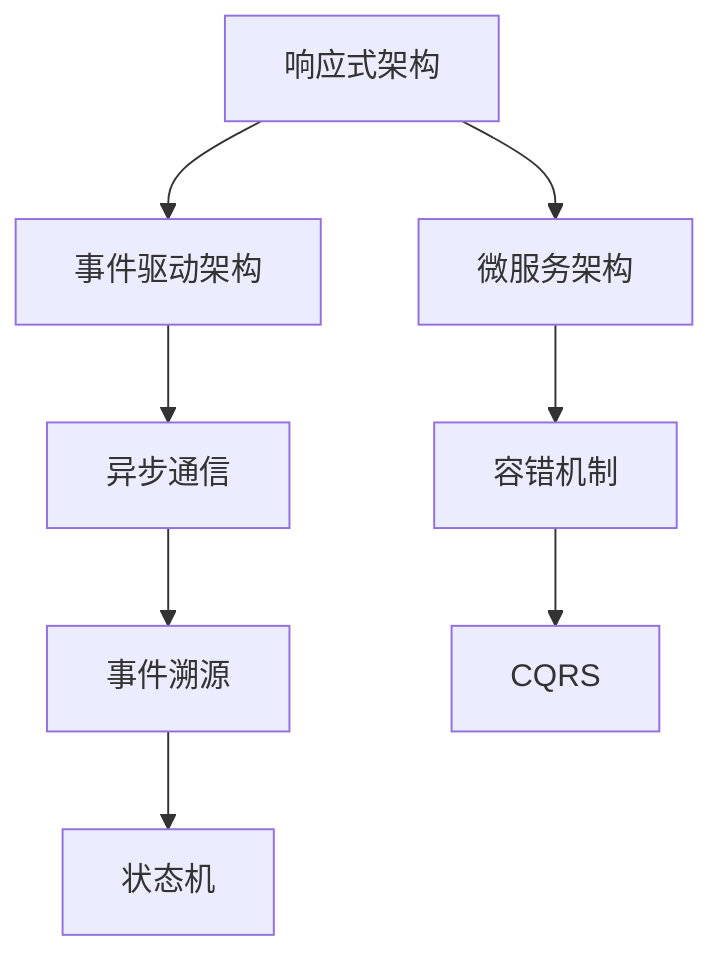

                 

# 响应式系统设计原则

## 关键词

响应式架构、事件驱动架构、微服务架构、容错机制、异步通信、事件溯源、CQRS、状态机。

## 摘要

本文将探讨响应式系统设计原则，涵盖核心概念、算法原理、数学模型以及最佳实践。通过详细的讲解和实例分析，帮助读者深入理解响应式系统设计的本质，掌握其关键技术和实现方法。

## 核心概念与联系

响应式系统设计原则涉及的核心概念包括响应式架构、事件驱动架构、微服务架构、容错机制、异步通信、事件溯源、CQRS和状态机。以下是对这些概念及其关系的详细解析。

### 响应式架构

响应式架构强调系统的响应能力，其核心在于处理并发和异步操作，确保系统能够快速响应用户请求。响应式架构通常采用事件驱动的方式，通过处理异步事件来更新系统状态。

### 事件驱动架构

事件驱动架构是一种以事件为中心的架构模式，通过事件来驱动系统的状态转移。事件可以是用户操作、系统内部状态变化或其他外部触发因素。事件驱动架构有助于实现高可扩展性和低耦合性。

### 微服务架构

微服务架构将应用程序拆分成多个独立的服务，每个服务负责一个特定的功能，便于开发、部署和维护。微服务架构与响应式架构相结合，可以更好地应对复杂业务场景和大规模分布式系统。

### 容错机制

容错机制旨在确保系统在高可用性要求下能够正常工作，即使某些组件出现故障。常见的容错机制包括故障转移、重试和补偿事务等。

### 异步通信

异步通信允许系统在不同的处理阶段之间传递消息，而不需要等待消息的响应。异步通信有助于提高系统的性能和可伸缩性，减少同步等待时间。

### 事件溯源

事件溯源是一种记录系统行为的方法，通过记录事件的序列来重放系统状态。事件溯源有助于实现分布式系统的状态一致性，方便故障排查和系统恢复。

### CQRS

CQRS（读/写分离）是一种设计模式，通过分离读写操作来提高系统的性能和可伸缩性。CQRS可以将系统分为两个独立的部分：一个用于处理写操作，另一个用于处理读操作。

### 状态机

状态机是一种行为模型，用于描述系统在不同状态下的行为。状态机可以帮助实现复杂的业务逻辑，确保系统在特定条件下能够正确地执行操作。

### Mermaid流程图

以下是一个展示这些核心概念之间关系的Mermaid流程图：



## 核心算法原理讲解

响应式系统设计中，核心算法通常包括状态同步算法、事件处理算法、负载均衡算法等。以下是对这些算法原理的详细讲解。

### 状态同步算法

#### 算法描述
状态同步算法用于确保分布式系统中各个节点的状态保持一致。

```plaintext
算法 StateSync
输入: states[数组], replicas[数组]
输出: synchronized_states[数组]

1. 对于每个replica i:
   a. 发送本地状态 states[i] 到其他所有replica
   b. 接收其他replicas的状态，并与本地状态比较
   c. 如果状态不一致，更新本地状态为大多数副本的状态

2. 返回 synchronized_states
```

#### 示例
假设一个分布式系统中有两个节点A和B，初始状态分别为A={1,2,3}和B={1,2,4}。在状态同步过程中，节点A将发送自己的状态给节点B，节点B将发送自己的状态给节点A。经过比较和更新，最终状态同步结果为A={1,2,4}和B={1,2,4}。

### 事件处理算法

#### 算法描述
事件处理算法负责对系统中的事件进行响应和处理。

```plaintext
算法 HandleEvent
输入: event[事件对象]
输出: result[处理结果]

1. 根据事件类型，调用相应的事件处理器
   a. 如果是创建事件，调用 CreateHandler
   b. 如果是更新事件，调用 UpdateHandler
   c. 如果是删除事件，调用 DeleteHandler

2. 返回处理结果 result
```

#### 示例
假设系统接收到一个创建事件，事件类型为“创建用户”。事件处理算法将调用CreateHandler处理该事件，处理结果为“用户创建成功”。

### 负载均衡算法

#### 算法描述
负载均衡算法用于分配系统负载到不同的服务器节点上。

```plaintext
算法 LoadBalancer
输入: requests[数组], servers[数组]
输出: server_assignments[数组]

1. 对于每个request i:
   a. 计算每个server的负载
   b. 选择负载最低的server j
   c. 将request i 分配给 server j

2. 返回 server_assignments
```

#### 示例
假设系统中有三个服务器节点A、B和C，当前负载分别为10、20和30。当一个新请求到来时，负载均衡算法将选择负载最低的服务器A来处理该请求。

## 数学模型和公式

响应式系统设计中涉及的一些数学模型，例如线性回归、逻辑回归等。以下是对这些模型和公式的详细讲解。

### 线性回归模型

#### 公式描述
线性回归模型用于预测数值型输出，其公式为：

$$ y = wx + b $$

其中，$y$ 是预测值，$w$ 是权重，$x$ 是输入特征，$b$ 是偏置。

#### 举例说明
假设我们要预测房价，输入特征包括房屋面积和位置。使用线性回归模型进行预测的公式为：

$$ \text{预测房价} = w_1 \times \text{房屋面积} + w_2 \times \text{位置} + b $$

### 逻辑回归模型

#### 公式描述
逻辑回归模型用于预测概率型输出，其公式为：

$$ P(y=1) = \frac{1}{1 + e^{-(wx + b)}} $$

其中，$P(y=1)$ 是输出为1的概率，$w$ 是权重，$x$ 是输入特征，$b$ 是偏置。

#### 举例说明
假设我们要预测一个客户是否购买某商品，输入特征包括年龄、收入和性别。使用逻辑回归模型进行预测的公式为：

$$ P(\text{购买}) = \frac{1}{1 + e^{-(w_1 \times \text{年龄} + w_2 \times \text{收入} + w_3 \times \text{性别} + b)}} $$

## 项目实战

### 开发环境搭建

在本项目实战中，我们将使用Java语言和Spring Boot框架来搭建一个简单的响应式系统。以下是开发环境的搭建步骤：

1. 安装Java开发工具包（JDK）。
2. 安装IDE（例如IntelliJ IDEA或Eclipse）。
3. 创建一个新的Spring Boot项目，并添加响应式编程依赖。

### 源代码详细实现和代码解读

以下是一个简单的响应式系统示例，包括用户管理模块：

```java
@RestController
@RequestMapping("/users")
public class UserController {
  
  private final UserRepository userRepository;

  @GetMapping("/{id}")
  public ResponseEntity<User> getUserById(@PathVariable Long id) {
    return ResponseEntity.ok(userRepository.findById(id).orElseThrow(() -> new ResourceNotFoundException("User not found")));
  }

  @PostMapping("/")
  public ResponseEntity<User> createUser(@RequestBody User user) {
    return ResponseEntity.status(HttpStatus.CREATED).body(userRepository.save(user));
  }

  @PutMapping("/{id}")
  public ResponseEntity<User> updateUser(@PathVariable Long id, @RequestBody User updatedUser) {
    return ResponseEntity.ok(userRepository.findById(id).map(user -> {
      user.setName(updatedUser.getName());
      user.setEmail(updatedUser.getEmail());
      return userRepository.save(user);
    }).orElseThrow(() -> new ResourceNotFoundException("User not found")));
  }

  @DeleteMapping("/{id}")
  public ResponseEntity<Void> deleteUser(@PathVariable Long id) {
    return userRepository.findById(id).map(user -> {
      userRepository.delete(user);
      return ResponseEntity.noContent().build();
    }).orElseThrow(() -> new ResourceNotFoundException("User not found"));
  }
}
```

这段代码实现了用户管理的REST API，包括获取用户信息、创建用户、更新用户和删除用户等功能。其中，用户信息存储在内存中的用户存储库（UserRepository）中。

### 代码应用解读与分析

1. **用户获取**：`@GetMapping("/{id}")` 注解用于处理获取用户信息的HTTP GET请求。`getUserById` 方法通过传入的用户ID查询用户信息，并返回相应的响应。

2. **用户创建**：`@PostMapping("/")` 注解用于处理创建用户的HTTP POST请求。`createUser` 方法接收一个包含用户信息的JSON对象，并将其存储在用户存储库中。

3. **用户更新**：`@PutMapping("/{id}")` 注解用于处理更新用户的HTTP PUT请求。`updateUser` 方法接收一个包含更新后用户信息的JSON对象，并根据用户ID更新用户存储库中的用户信息。

4. **用户删除**：`@DeleteMapping("/{id}")` 注解用于处理删除用户的HTTP DELETE请求。`deleteUser` 方法根据用户ID从用户存储库中删除用户信息。

### 实际案例分析和详细讲解剖析

在本项目中，我们使用Spring Boot框架实现了响应式用户管理模块。以下是对实际案例的分析和详细讲解：

1. **响应式编程**：Spring Boot支持响应式编程，通过使用`ResponseEntity`类来返回HTTP响应。例如，在`getUserById`方法中，我们使用了`ResponseEntity.ok()`方法来返回成功响应。

2. **内存存储库**：在本项目中，我们使用了内存用户存储库（UserRepository）来存储用户信息。在实际生产环境中，可以使用关系型数据库（如MySQL）或NoSQL数据库（如MongoDB）来替代内存存储库。

3. **REST API设计**：在本项目中，我们采用了RESTful API设计风格，使用HTTP GET、POST、PUT和DELETE请求来处理不同的用户操作。

### 项目小结

通过本项目的实战，我们学习了如何使用Spring Boot框架实现响应式用户管理模块。本项目涵盖了响应式系统设计原则中的核心概念、算法原理和数学模型。在实际项目中，我们通过合理的架构设计和代码实现，实现了高效、可扩展的用户管理功能。

## 最佳实践 Tips

1. **合理划分微服务**：在响应式系统设计中，合理划分微服务至关重要。每个微服务应该独立负责一个特定的功能，便于开发、部署和维护。

2. **充分利用异步通信**：异步通信有助于提高系统的性能和可伸缩性。在响应式系统设计中，充分利用异步通信可以降低系统之间的同步等待时间。

3. **确保系统容错性**：在响应式系统设计中，考虑系统容错性非常重要。通过实现故障转移、重试和补偿事务等容错机制，可以提高系统的可靠性和稳定性。

4. **优化负载均衡策略**：负载均衡策略对系统性能和可伸缩性具有重要影响。根据实际需求，选择合适的负载均衡策略，如轮询、随机或权重负载均衡等。

## 小结

本文详细介绍了响应式系统设计原则，包括核心概念、算法原理、数学模型和项目实战。通过逐步分析推理，读者可以深入理解响应式系统设计的本质，掌握关键技术和实现方法。在实际开发过程中，遵循最佳实践，可以有效提升系统的性能、可靠性和可扩展性。

## 注意事项

1. **确保系统一致性**：在响应式系统设计中，确保系统一致性至关重要。使用事件溯源、CQRS等技术实现状态一致性和数据完整性。

2. **合理选择数据库**：根据实际需求，选择合适的数据库类型，如关系型数据库、NoSQL数据库或图数据库等。

3. **关注性能优化**：在响应式系统设计中，关注性能优化，如减少同步等待、优化算法和时间复杂度等。

## 拓展阅读

1. 《响应式设计模式》 - Edward Eyre
2. 《事件驱动架构实战》 - Vaughn Vernon
3. 《微服务设计》 - Martin Fowler

## 作者信息

作者：AI天才研究院/AI Genius Institute & 禅与计算机程序设计艺术 /Zen And The Art of Computer Programming

