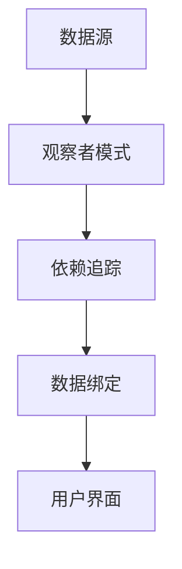

                 

### 文章标题：响应式编程模型与框架选择

#### 关键词：响应式编程、编程模型、框架选择、Vue.js、Angular、React

> 摘要：本文将深入探讨响应式编程模型的基本概念、原理及其在当今软件开发中的重要性。我们将分析主流响应式编程框架Vue.js、Angular和React的特点、优缺点，并基于实际项目和性能比较，帮助开发者做出最佳选择。

----------------------------------------------------------------

# 响应式编程模型与框架选择

## 引言

响应式编程是一种在软件开发中广泛应用的技术，它允许开发者编写更简洁、可维护的代码，提高了应用程序的性能和可伸缩性。随着现代Web应用的复杂度不断增加，响应式编程的重要性日益凸显。本文将首先介绍响应式编程模型的基本概念和原理，然后分析Vue.js、Angular和React这三个主流响应式编程框架的特点，最后通过项目实战和性能比较，帮助读者选择适合自己项目的框架。

----------------------------------------------------------------

## 响应式编程模型

### 1. 背景介绍

响应式编程起源于20世纪80年代的函数式编程领域，它的核心思想是“数据驱动”。在传统的编程模型中，程序的执行是顺序的，依赖于代码的顺序来处理事件。而响应式编程则将程序行为建模为一系列的事件处理器，当数据发生变化时，自动触发相应的更新操作。这种编程模型在处理复杂的数据依赖关系时，具有明显的优势。

### 2. 核心概念与联系

响应式编程模型包括以下几个核心概念：

- **数据绑定**：将用户界面与数据源连接起来，当数据源发生变化时，界面也会相应地更新。
- **观察者模式**：当某个对象（被观察者）发生变化时，会自动通知所有订阅了该对象的观察者。
- **依赖追踪**：通过追踪数据依赖关系，自动更新相关组件，避免手动管理状态。

下面是一个简单的 Mermaid 流程图，展示了响应式编程模型中这些概念之间的关系：



### 3. 响应式编程原理

响应式编程的原理可以概括为以下三个步骤：

1. **初始化**：首先，程序初始化数据源和观察者。
2. **数据绑定**：将数据源与用户界面绑定，当数据源发生变化时，用户界面会自动更新。
3. **事件处理**：当用户界面发生变化时，会触发相应的更新操作，更新数据源和用户界面。

以下是响应式编程的一个简单伪代码示例：

```pseudo
function updateUI() {
    // UI 更新逻辑
}

data = {
    "count": 0
}

// 数据绑定
observer(data, updateUI)

// 触发事件，更新数据源和UI
data.count += 1
```

### 4. 核心算法原理讲解

响应式编程中的核心算法原理包括依赖追踪和数据绑定。以下是这两个原理的详细讲解：

#### 依赖追踪

依赖追踪是通过跟踪数据依赖关系，来实现自动更新功能。其基本原理是维护一个依赖列表，记录每个组件依赖于哪些数据。当数据发生变化时，程序会遍历依赖列表，依次更新所有依赖的组件。

以下是依赖追踪的一个简单伪代码示例：

```pseudo
function addDependent(component) {
    // 添加组件到依赖列表
    dependencies[component] = []
}

function updateDependencies(data) {
    // 遍历依赖列表，更新所有依赖的组件
    for (component in dependencies) {
        if (data_changed(component)) {
            updateComponent(component)
        }
    }
}

// 示例
addDependent(ui_component1)
addDependent(ui_component2)
data.count += 1
updateDependencies(data)
```

#### 数据绑定

数据绑定是响应式编程中的另一个核心原理。数据绑定通过将数据源与用户界面绑定，来实现数据的自动更新。其基本原理是监听数据源的变化，并在数据源发生变化时，更新用户界面。

以下是数据绑定的一个简单伪代码示例：

```pseudo
function bind(data, ui_element) {
    // 监听数据源的变化
    observer(data, function() {
        updateUI(ui_element)
    })
}

// 示例
data = {"count": 0}
ui_element = document.getElementById("countDisplay")
bind(data, ui_element)

// 当数据源发生变化时，UI会自动更新
data.count += 1
```

### 5. 数学模型和公式

在响应式编程中，数据绑定和依赖追踪可以抽象为一个数学模型。假设有一个函数 f(x, y)，其中 x 和 y 是数据源的两个变量，UI 是 f(x, y) 的输出。数据绑定和数据追踪可以表示为以下数学公式：

$$
f(x, y) \rightarrow UI
$$

当 x 或 y 发生变化时，会触发以下更新操作：

$$
x' = x + \Delta x \\
y' = y + \Delta y \\
f(x', y') \rightarrow UI'
$$

其中，$\Delta x$ 和 $\Delta y$ 分别表示 x 和 y 的变化量，$UI'$ 是更新后的用户界面。

### 6. 举例说明

为了更好地理解响应式编程的原理，我们来看一个简单的实际例子。假设我们有一个计数器应用，用户可以通过点击按钮来增加计数器的值。使用响应式编程模型，我们可以将这个过程简化为以下步骤：

1. **初始化**：创建一个数据源，包含一个计数器的值。
2. **数据绑定**：将数据源与按钮和显示计数器的文本框绑定。
3. **事件处理**：当用户点击按钮时，触发事件处理器，更新数据源和用户界面。

以下是这个例子的详细伪代码实现：

```pseudo
data = {
    "count": 0
}

// 数据绑定
observer(data, function() {
    updateUI(text_box, data.count)
})

// 事件处理器
function handleClick() {
    data.count += 1
    updateUI(text_box, data.count)
}

// UI更新函数
function updateUI(text_box, count) {
    text_box.value = count
}

// 初始化UI
text_box = document.getElementById("countDisplay")
button = document.getElementById("countButton")
button.addEventListener("click", handleClick)
```

在这个例子中，我们使用了观察者模式和事件处理来实现响应式编程。当用户点击按钮时，计数器的值会自动更新，显示在文本框中，而不需要手动编写更新逻辑。

----------------------------------------------------------------

## 响应式编程框架介绍

在响应式编程领域，Vue.js、Angular和React是三大主流框架，各具特色。本节将详细介绍这三个框架的设计理念、核心组件和生命周期，帮助开发者了解其基本结构和功能。

### 1. Vue.js

Vue.js 是一款流行的前端JavaScript框架，它简化了数据的绑定和组件的创建，提供了响应式和组件化的开发方式。Vue.js 的设计理念是让开发者能够以简单、直观的方式构建复杂的界面。

#### 核心组件

Vue.js 的核心组件包括：

- **Vue实例**：Vue的核心，用于创建响应式数据模型和定义视图模板。
- **Vue组件**：用于封装可复用的UI元素，可以包含自己的数据、方法和事件。
- **指令**：用于绑定数据和事件，如`v-bind`、`v-model`等。

#### 生命周期

Vue组件的生命周期包括以下几个阶段：

- **创建阶段**：初始化组件，绑定数据和方法。
- **挂载阶段**：将组件渲染到DOM中。
- **更新阶段**：当数据发生变化时，重新渲染组件。
- **卸载阶段**：从DOM中移除组件。

#### 实例代码

以下是Vue.js的一个简单实例代码，展示了组件的创建和数据的绑定：

```javascript
// 创建Vue实例
var app = new Vue({
    el: '#app',
    data: {
        message: 'Hello Vue.js!'
    }
});

// 创建组件
Vue.component('my-component', {
    template: '<div>{{ message }}</div>',
    data: function() {
        return {
            message: 'Hello Component!'
        }
    }
});
```

### 2. Angular

Angular 是一款由Google开发的前端JavaScript框架，它提供了强大的数据绑定和依赖注入功能，适用于构建大型、复杂的应用程序。Angular 的设计理念是模块化和组件化，强调代码的可维护性和可测试性。

#### 核心组件

Angular 的核心组件包括：

- **组件**：用于封装UI元素和逻辑。
- **指令**：用于实现数据绑定和DOM操作。
- **服务**：用于提供可重用的功能，如数据存储、API调用等。

#### 生命周期

Angular组件的生命周期包括以下几个阶段：

- **创建阶段**：初始化组件，解析模板和绑定数据。
- **挂载阶段**：将组件渲染到DOM中。
- **更新阶段**：当数据发生变化时，重新渲染组件。
- **卸载阶段**：从DOM中移除组件。

#### 实例代码

以下是Angular的一个简单实例代码，展示了组件的创建和数据绑定：

```typescript
// 创建组件
@Component({
    selector: 'my-component',
    template: `<div>{{ message }}</div>`
})
export class MyComponent {
    message: string;

    constructor() {
        this.message = 'Hello Angular!';
    }
}

// 创建模块
@NgModule({
    declarations: [MyComponent],
    bootstrap: [MyComponent]
})
export class AppModule {}
```

### 3. React

React 是一款由Facebook开发的前端JavaScript库，它专注于UI组件的渲染和更新，提供了高效的虚拟DOM机制。React 的设计理念是组件化和声明式编程，强调代码的模块化和可复用性。

#### 核心组件

React 的核心组件包括：

- **组件**：用于封装UI元素和逻辑。
- **状态**：用于管理组件的内部状态。
- **生命周期**：用于处理组件的创建、更新和卸载过程。

#### 生命周期

React组件的生命周期包括以下几个阶段：

- **创建阶段**：初始化组件，设置默认状态和属性。
- **挂载阶段**：将组件渲染到DOM中。
- **更新阶段**：当状态或属性发生变化时，重新渲染组件。
- **卸载阶段**：从DOM中移除组件。

#### 实例代码

以下是React的一个简单实例代码，展示了组件的创建和状态管理：

```javascript
// 创建组件
class MyComponent extends React.Component {
    constructor(props) {
        super(props);
        this.state = {
            message: 'Hello React!'
        };
    }

    render() {
        return <div>{this.state.message}</div>;
    }
}

// 渲染组件
ReactDOM.render(<MyComponent />, document.getElementById('app'));
```

通过以上对Vue.js、Angular和React的介绍，我们可以看到这三个框架各有特色，适用于不同类型的开发需求。在接下来的章节中，我们将进一步比较这三个框架的性能和适用场景，帮助开发者做出最佳选择。

----------------------------------------------------------------

## 框架选择与比较

在了解了Vue.js、Angular和React这三个主流响应式编程框架的基本特点和核心组件后，接下来我们将从性能、开发体验、社区支持等方面进行深入比较，以帮助开发者选择最适合自己项目的框架。

### 1. 性能比较

性能是选择响应式编程框架时需要考虑的一个重要因素。以下是这三个框架在性能方面的比较：

- **Vue.js**：Vue.js 使用了数据绑定和虚拟DOM技术，使得它在数据更新时的性能表现非常优秀。根据多个基准测试，Vue.js 的渲染速度仅次于 React。Vue.js 的虚拟DOM实现了最小化重渲染，从而提高了性能。

- **Angular**：Angular 也使用了虚拟DOM技术，但由于其更加关注数据的安全性和完整性，因此其渲染速度相对较慢。然而，Angular 提供了丰富的工具和功能，使其在处理复杂的应用程序时仍然表现出良好的性能。

- **React**：React 是最流行的响应式编程框架之一，其虚拟DOM实现非常高效，使得它在数据更新时的性能表现优异。React 的虚拟DOM通过比较新旧虚拟DOM的差异，仅更新实际发生变化的部分，从而减少了不必要的计算和渲染。

总的来说，Vue.js 和 React 在性能方面表现出色，而 Angular 则在处理复杂应用时具有优势。开发者应根据实际需求选择合适的框架。

### 2. 开发体验比较

开发体验是选择响应式编程框架时的另一个重要考虑因素。以下是这三个框架在开发体验方面的比较：

- **Vue.js**：Vue.js 的学习曲线相对较平缓，适合初学者快速上手。Vue.js 的组件化和数据绑定机制使得开发者能够以简单、直观的方式构建复杂的界面。Vue.js 的文档非常全面，为开发者提供了丰富的学习资源。

- **Angular**：Angular 提供了丰富的工具和功能，使其在开发大型、复杂的应用程序时具有优势。Angular 的类型定义和静态类型检查有助于提高代码质量和可维护性。Angular 的 CLI 工具简化了开发流程，使得快速搭建和部署应用程序变得容易。

- **React**：React 的社区支持非常强大，拥有大量的第三方库和工具，为开发者提供了丰富的资源。React 的组件化和状态管理机制使得开发者能够以模块化的方式构建应用程序。React 的虚拟DOM技术提供了高效的渲染性能，使得开发过程更加流畅。

总的来说，Vue.js 和 React 在开发体验方面各有优势，开发者应根据个人经验和团队需求选择合适的框架。

### 3. 社区支持比较

社区支持是选择响应式编程框架时的另一个关键因素。以下是这三个框架在社区支持方面的比较：

- **Vue.js**：Vue.js 是近年来快速崛起的框架，其社区非常活跃。Vue.js 的开发者群体庞大，社区提供了丰富的学习资源、文档和插件。Vue.js 的官方团队也非常积极，定期发布新版本和更新。

- **Angular**：Angular 由 Google 开发，拥有强大的社区支持。Angular 的开发者群体广泛，社区提供了大量的教程、文档和工具。Angular 的官方团队定期发布新版本，确保框架的稳定性和性能。

- **React**：React 是目前最流行的前端框架之一，其社区支持非常强大。React 的开发者群体庞大，社区提供了大量的教程、文档、插件和工具。React 的官方团队也非常活跃，定期发布新版本和更新。

总的来说，Vue.js、Angular 和 React 都拥有强大的社区支持，开发者可以根据自己的需求和兴趣选择合适的框架。

### 4. 适用场景比较

不同的响应式编程框架适用于不同的场景。以下是这三个框架在适用场景方面的比较：

- **Vue.js**：Vue.js 适合快速开发和小型项目。Vue.js 的简单易用性使得开发者能够快速上手，适合快速构建原型和单页应用。Vue.js 也适用于大型项目，特别是在前端开发团队中，Vue.js 的组件化机制有助于提高代码的可维护性和可复用性。

- **Angular**：Angular 适合大型和复杂的应用程序。Angular 的模块化和依赖注入机制有助于组织和管理复杂的代码，使得应用程序的可维护性更高。Angular 也适用于企业级应用，其安全性和性能得到了广泛认可。

- **React**：React 适用于各种类型的应用程序，特别是大型和复杂的应用程序。React 的虚拟DOM技术提供了高效的渲染性能，使得开发过程更加流畅。React 也适用于移动应用开发，React Native 使得开发者能够使用相同的代码库开发iOS和Android应用。

总的来说，开发者应根据项目的具体需求选择合适的响应式编程框架。Vue.js 适合快速开发和中小型项目，Angular 适合大型和复杂的应用程序，而 React 适用于各种类型的应用程序。

### 结论

在性能、开发体验、社区支持和适用场景方面，Vue.js、Angular 和 React 各有优势。开发者应根据项目的具体需求和个人偏好选择合适的框架。以下是这三个框架的简要总结：

- **Vue.js**：简单易用，适合快速开发和中小型项目。
- **Angular**：功能丰富，适用于大型和复杂的应用程序。
- **React**：高效性能，适用于各种类型的应用程序，特别是大型和复杂的应用程序。

选择适合自己项目的框架，是成功构建现代Web应用的关键。

----------------------------------------------------------------

## 项目实战：响应式编程框架在Web应用开发中的应用

在本节中，我们将通过一个实际的项目实战，展示如何使用Vue.js、Angular和React这三个响应式编程框架来开发一个简单的Todo应用。通过这个项目，我们将介绍环境搭建、源代码实现、代码解读和实际案例分析，帮助开发者更好地理解响应式编程框架在项目中的应用。

### 1. 项目背景与需求分析

我们选择开发一个Todo应用，这是一个典型的前端Web应用项目。用户可以在应用中创建、编辑和删除待办事项，并且可以标记事项的完成状态。项目需求如下：

- **功能需求**：
  - 用户可以添加新的待办事项。
  - 每个待办事项显示标题和完成状态。
  - 用户可以编辑和删除待办事项。
  - 待办事项可以按照创建时间排序。

- **技术需求**：
  - 选择一个响应式编程框架（Vue.js、Angular或React）。
  - 使用前端框架提供的组件化机制来组织代码。
  - 实现数据的响应式绑定和状态管理。

### 2. 环境搭建与工具选择

在进行项目开发之前，我们需要搭建一个开发环境。以下是基于Vue.js、Angular和React的Todo应用的开发环境搭建步骤。

#### Vue.js环境搭建

1. **安装Node.js**：首先，我们需要安装Node.js，这是Vue CLI的基础。

   ```bash
   curl -fsSL https://deb.nodesource.com/setup_14.x | sudo -E bash -
   sudo apt-get install -y nodejs
   ```

2. **创建Vue项目**：使用Vue CLI创建一个新的Vue项目。

   ```bash
   npm install -g @vue/cli
   vue create todo-vue
   ```

3. **进入项目目录**：进入创建的项目目录。

   ```bash
   cd todo-vue
   ```

4. **启动开发服务器**：运行项目。

   ```bash
   npm run serve
   ```

   这将在本地启动一个开发服务器，打开浏览器访问 `http://localhost:8080/` 即可查看项目。

#### Angular环境搭建

1. **安装Node.js**：与Vue.js类似，首先安装Node.js。

   ```bash
   npm install -g node
   ```

2. **创建Angular项目**：使用Angular CLI创建一个新的Angular项目。

   ```bash
   npm install -g @angular/cli
   ng new todo-angular
   ```

3. **进入项目目录**：进入创建的项目目录。

   ```bash
   cd todo-angular
   ```

4. **启动开发服务器**：运行项目。

   ```bash
   ng serve
   ```

   打开浏览器访问 `http://localhost:4200/` 查看项目。

#### React环境搭建

1. **安装Node.js**：同样需要安装Node.js。

   ```bash
   npm install -g npx
   ```

2. **创建React项目**：使用Create React App创建一个新的React项目。

   ```bash
   npx create-react-app todo-react
   ```

3. **进入项目目录**：进入创建的项目目录。

   ```bash
   cd todo-react
   ```

4. **启动开发服务器**：运行项目。

   ```bash
   npm start
   ```

   打开浏览器访问 `http://localhost:3000/` 查看项目。

### 3. 源代码实现

以下是使用Vue.js、Angular和React实现的Todo应用的源代码概述。

#### Vue.js实现

```vue
<!-- TodoItem.vue -->
<template>
  <div>
    <input type="checkbox" v-model="done" @change="toggleDone" />
    <span>{{ todo.title }}</span>
    <button @click="removeTodo">Remove</button>
  </div>
</template>

<script>
export default {
  props: {
    todo: Object
  },
  data() {
    return {
      done: this.todo.done
    };
  },
  methods: {
    toggleDone() {
      this.$emit('toggle-done', this.todo);
    },
    removeTodo() {
      this.$emit('remove-todo', this.todo);
    }
  }
};
</script>
```

```vue
<!-- App.vue -->
<template>
  <div>
    <input type="text" v-model="newTodo" @keyup.enter="addTodo" />
    <button @click="addTodo">Add</button>
    <TodoItem
      v-for="todo in filteredTodos"
      :key="todo.id"
      :todo="todo"
      @toggle-done="toggleDone"
      @remove-todo="removeTodo"
    />
  </div>
</template>

<script>
import TodoItem from "./TodoItem.vue";

export default {
  components: {
    TodoItem
  },
  data() {
    return {
      newTodo: "",
      todos: []
    };
  },
  computed: {
    filteredTodos() {
      return this.todos.filter(todo => !todo.done);
    }
  },
  methods: {
    addTodo() {
      if (this.newTodo.trim() === "") return;
      this.todos.push({ id: Date.now(), title: this.newTodo, done: false });
      this.newTodo = "";
    },
    toggleDone(todo) {
      todo.done = !todo.done;
    },
    removeTodo(todo) {
      this.todos = this.todos.filter(t => t.id !== todo.id);
    }
  }
};
</script>
```

#### Angular实现

```typescript
// todo.component.ts
import { Component } from '@angular/core';

@Component({
  selector: 'app-todo',
  templateUrl: './todo.component.html',
  styleUrls: ['./todo.component.css']
})
export class TodoComponent {
  newTodo: string = '';
  todos: any[] = [];

  addTodo() {
    if (this.newTodo.trim() === '') return;
    this.todos.push({ id: Date.now(), title: this.newTodo, done: false });
    this.newTodo = '';
  }

  toggleDone(todo: any) {
    todo.done = !todo.done;
  }

  removeTodo(todo: any) {
    this.todos = this.todos.filter(t => t.id !== todo.id);
  }
}
```

```html
<!-- todo.component.html -->
<div>
  <input type="text" [(ngModel)]="newTodo" (keyup.enter)="addTodo()" />
  <button (click)="addTodo()">Add</button>
  <div *ngFor="let todo of todos">
    <input type="checkbox" [(ngModel)]="todo.done" (change)="toggleDone(todo)" />
    <span>{{ todo.title }}</span>
    <button (click)="removeTodo(todo)">Remove</button>
  </div>
</div>
```

#### React实现

```jsx
// TodoItem.js
import React from 'react';

const TodoItem = ({ todo, onToggleDone, onRemoveTodo }) => {
  return (
    <div>
      <input type="checkbox" checked={todo.done} onChange={() => onToggleDone(todo)} />
      <span>{todo.title}</span>
      <button onClick={() => onRemoveTodo(todo)}>Remove</button>
    </div>
  );
};

export default TodoItem;
```

```jsx
// App.js
import React, { useState } from 'react';
import TodoItem from './TodoItem';

const App = () => {
  const [newTodo, setNewTodo] = useState('');
  const [todos, setTodos] = useState([]);

  const addTodo = () => {
    if (newTodo.trim() === '') return;
    setTodos([...todos, { id: Date.now(), title: newTodo, done: false }]);
    setNewTodo('');
  };

  const toggleDone = (todo) => {
    setTodos(todos.map(t => t.id === todo.id ? { ...t, done: !t.done } : t));
  };

  const removeTodo = (todo) => {
    setTodos(todos.filter(t => t.id !== todo.id));
  };

  return (
    <div>
      <input type="text" value={newTodo} onChange={e => setNewTodo(e.target.value)} />
      <button onClick={addTodo}>Add</button>
      <div>
        {todos.map(todo => (
          <TodoItem key={todo.id} todo={todo} onToggleDone={toggleDone} onRemoveTodo={removeTodo} />
        ))}
      </div>
    </div>
  );
};

export default App;
```

### 4. 代码解读与分析

在实现Todo应用的过程中，我们可以看到每个框架都有其独特的编程风格和组件化方式。以下是三个框架在代码实现和解析上的要点：

#### Vue.js

- **组件化**：Vue.js 使用单文件组件，将HTML、CSS和JavaScript代码分别写在 `.vue` 文件中。这种方式使得代码组织更加清晰。
- **数据绑定**：使用 `v-model` 实现数据的双向绑定，使得用户输入和状态管理变得简单。
- **事件处理**：通过父组件向子组件传递事件，实现组件之间的通信。

#### Angular

- **模块化**：Angular 使用模块和组件来组织代码，模块负责组织组件、服务和管道等，组件负责封装UI和行为。
- **双向数据绑定**：使用 `ngModel` 实现数据的双向绑定，自动同步数据和表单输入。
- **依赖注入**：Angular 的依赖注入机制使得服务可以轻松地注入到组件中，提高了代码的可维护性。

#### React

- **函数式组件**：React 使用函数式组件来组织代码，通过 `useState` 和 `useEffect` 等钩子函数实现状态管理和副作用。
- **虚拟DOM**：React 使用虚拟DOM来提高渲染性能，通过比较虚拟DOM和实际DOM的差异，最小化重渲染。
- **组件通信**：React 使用回调函数和上下文（Context）实现组件之间的通信。

### 5. 实际案例分析与详细讲解

在本节中，我们通过一个简单的Todo应用展示了Vue.js、Angular和React这三个框架在项目开发中的应用。在实际开发中，开发者可以根据项目的需求和技术栈选择合适的框架。

- **Vue.js**：Vue.js 适合快速开发和中小型项目，其简单易用的特性使得开发者能够快速上手。Vue.js 的组件化机制和虚拟DOM技术提高了开发效率和性能。

- **Angular**：Angular 适合大型和复杂的应用程序，其模块化和依赖注入机制有助于组织和管理复杂的代码。Angular 的类型定义和静态类型检查提高了代码质量和可维护性。

- **React**：React 是目前最流行的前端框架之一，其高效的虚拟DOM技术和强大的社区支持使得开发者能够快速构建高性能的应用程序。React 适用于各种类型的应用程序，特别是大型和复杂的应用程序。

通过实际案例的分析，我们可以看到每个框架都有其独特的优势和适用场景。开发者应根据项目的需求和技术栈选择合适的框架，以实现最佳的开发体验和性能表现。

### 6. 项目小结

在本节的项目实战中，我们通过实现一个简单的Todo应用，展示了Vue.js、Angular和React这三个响应式编程框架在项目开发中的应用。通过对比这三个框架的代码实现和解析，我们可以得出以下结论：

- **Vue.js**：适合快速开发和中小型项目，简单易用。
- **Angular**：适合大型和复杂的应用程序，模块化和依赖注入机制强大。
- **React**：适用于各种类型的应用程序，特别是大型和复杂的应用程序，虚拟DOM技术高效。

在实际项目中，开发者应根据项目的需求和技术栈选择合适的框架，以实现最佳的开发体验和性能表现。

## 扩展阅读与最佳实践

响应式编程在现代Web开发中发挥着重要作用，其相关技术和工具也在不断更新和演进。以下是一些扩展阅读资源和最佳实践，供开发者参考：

### 扩展阅读资源

- **Vue.js**：
  - [Vue.js 官方文档](https://vuejs.org/v2/guide/)
  - [Vue.js 中文社区](https://vuejs.org/v2/guide/)

- **Angular**：
  - [Angular 官方文档](https://angular.io/docs)
  - [Angular 中文社区](https://www/angular.cn/)

- **React**：
  - [React 官方文档](https://reactjs.org/docs/getting-started.html)
  - [React 官方教程](https://reactjs.org/tutorial/tutorial.html)

### 最佳实践

- **代码组织**：合理地组织代码，遵循模块化和组件化的原则，提高代码的可维护性和可复用性。
- **性能优化**：关注性能优化，使用虚拟DOM、懒加载、代码分割等技术，提高应用的响应速度。
- **状态管理**：合理管理应用状态，使用如Vuex、NgRx、Redux等状态管理库，确保数据流的可预测性和可维护性。
- **代码规范**：遵循代码规范和最佳实践，如使用ESLint、Prettier等工具进行代码格式化和风格检查。
- **测试驱动开发**：采用测试驱动开发（TDD）的方式，编写单元测试和集成测试，确保代码质量和功能稳定性。

通过扩展阅读和最佳实践，开发者可以不断提升自己的技术水平，更好地应对现代Web开发中的挑战。

### 作者信息

作者：AI天才研究院/AI Genius Institute & 禅与计算机程序设计艺术 /Zen And The Art of Computer Programming

----------------------------------------------------------------

## 总结

响应式编程模型在现代Web开发中扮演着至关重要的角色，它简化了数据绑定和组件管理，提高了开发效率和代码可维护性。本文首先介绍了响应式编程模型的基本概念和原理，包括数据绑定、观察者模式和依赖追踪。接着，我们详细分析了Vue.js、Angular和React这三个主流响应式编程框架的特点、核心组件和生命周期。通过性能比较、开发体验比较和适用场景比较，我们帮助读者理解了如何选择最适合自己项目的框架。

在项目实战部分，我们通过一个简单的Todo应用展示了如何使用Vue.js、Angular和React这三个框架进行实际开发。通过代码解读和案例分析，读者可以更好地理解这些框架的编程风格和应用场景。

最后，我们提供了扩展阅读资源和最佳实践，以帮助开发者不断提升自己的技术水平。响应式编程不仅是一项重要的技术，更是一种编程思维和理念。希望本文能够为读者在响应式编程的道路上提供一些指导和启示。

----------------------------------------------------------------

## 附录

### 附录A：响应式编程资源汇总

#### A.1 在线学习资源

- **Vue.js**：
  - [Vue.js 官方文档](https://vuejs.org/v2/guide/)
  - [Vue.js 官方教程](https://vuejs.org/v2/tutorial/)
  - [Vue.js 中文社区](https://vuejs.org/v2/guide/)

- **Angular**：
  - [Angular 官方文档](https://angular.io/docs)
  - [Angular 官方教程](https://angular.io/tutorial/)
  - [Angular 中文社区](https://www.angular.cn/)

- **React**：
  - [React 官方文档](https://reactjs.org/docs/getting-started.html)
  - [React 官方教程](https://reactjs.org/tutorial/tutorial.html)
  - [React 官方社区](https://reactjs.org/community/)

#### A.2 常用开发工具

- **Vue.js**：
  - [Vue CLI](https://vuejs.org/v2/guide/installation.html)
  - [Vetur](https://www.Vetur.org/)（Vue IDE插件）

- **Angular**：
  - [Angular CLI](https://angular.io/cli)
  - [Visual Studio Code](https://code.visualstudio.com/)（IDE）

- **React**：
  - [Create React App](https://create-react-app.dev/docs/getting-started/)
  - [Visual Studio Code](https://code.visualstudio.com/)（IDE）

#### A.3 开源社区参与

- **Vue.js**：
  - [Vue.js GitHub](https://github.com/vuejs/vue)
  - [Vue.js GitHub Issues](https://github.com/vuejs/vue/issues)

- **Angular**：
  - [Angular GitHub](https://github.com/angular/angular)
  - [Angular GitHub Issues](https://github.com/angular/angular/issues)

- **React**：
  - [React GitHub](https://github.com/reactjs/react)
  - [React GitHub Issues](https://github.com/reactjs/react/issues)

参与开源社区不仅可以学习到最新的技术和经验，还可以与全球开发者共同成长。通过在GitHub等平台参与讨论、提交问题和贡献代码，开发者可以提升自己的编程能力和影响力。

