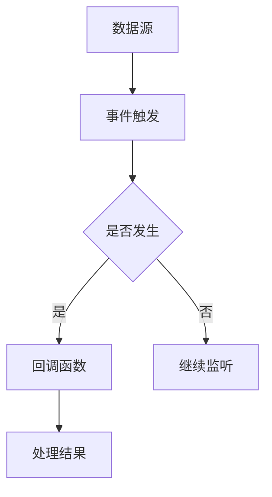
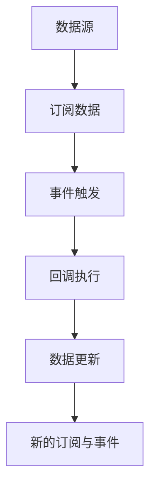
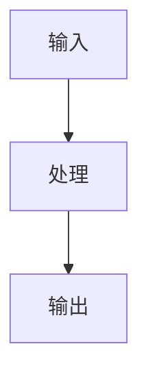
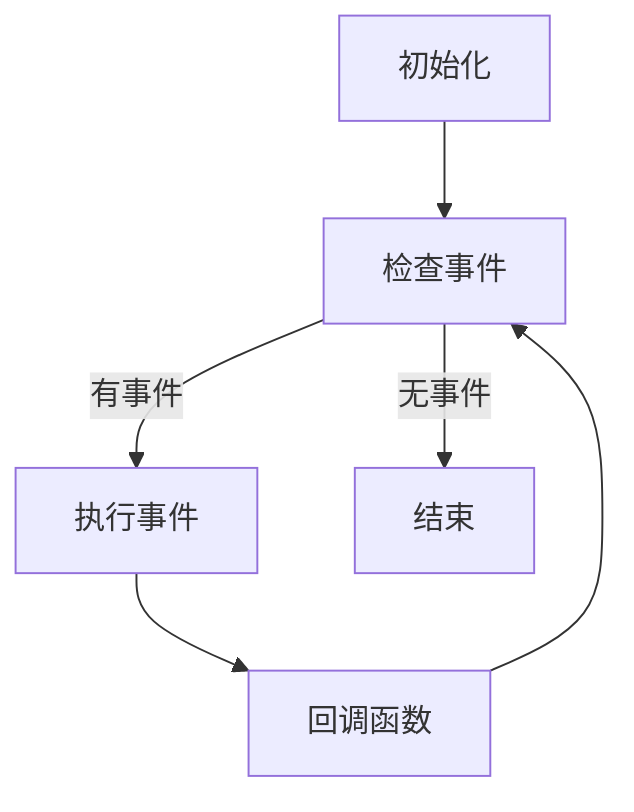

                 

### 一、响应式编程与异步应用的关系

在计算机编程中，响应式编程和异步编程是两个紧密相关且极其重要的概念。响应式编程是一种设计编程范式，旨在处理复杂的应用程序中的数据依赖和状态变化。其核心思想是使应用程序能够自动响应用户操作、网络事件或其他外部事件，无需手动更新用户界面或执行计算。

异步编程，则是一种允许任务在不等待某个操作完成的情况下继续执行的编程技术。它通过让程序在执行过程中可以暂停、挂起或等待某个操作完成后再继续执行，从而提高了程序的执行效率和响应速度。

这两者之间的关系主要体现在以下几个方面：

1. **数据依赖与事件处理**：响应式编程依赖于数据依赖和事件驱动模型，而异步编程提供了处理这些事件和依赖的方式。在响应式编程中，数据源或事件源的变化会触发相应的处理函数，异步编程使得这些处理函数可以在不阻塞主线程的情况下执行。

2. **性能与效率**：异步编程通过让程序在等待某些操作完成时进行其他工作，从而避免了线程阻塞，提高了程序的运行效率和响应速度。响应式编程利用异步编程的特性，可以构建出更加高效、响应迅速的应用程序。

3. **复杂性管理**：在复杂的应用程序中，响应式编程和异步编程可以帮助开发者更好地管理代码复杂性。通过模块化设计，可以将复杂的逻辑拆分成更小的、易于管理的部分，而异步编程则使得这些模块可以在不需要同步操作的情况下独立工作。

4. **用户体验**：在现代应用程序中，用户期望应用能够提供快速、流畅的交互体验。响应式编程和异步编程的结合，使得应用程序可以更快速地响应用户操作，从而提升用户体验。

总的来说，响应式编程和异步编程相辅相成，共同构成了现代高效编程的基础。接下来，我们将深入探讨响应式编程的核心概念、原理和实现，以及异步编程技术、应用场景和性能优化策略，帮助读者全面理解并掌握这两种编程范式。

### 二、响应式编程的核心概念与联系

响应式编程是一种以数据依赖和事件驱动为核心的编程范式。为了更好地理解这一概念，我们需要从以下几个方面展开讨论：核心概念、Mermaid 流程图、工作流程、数学模型和伪代码实现。

#### 2.1 核心概念

响应式编程的核心概念包括：

1. **数据流**：在响应式编程中，数据流是程序运行的基础。数据源（如用户输入、传感器数据等）的变化会触发一系列的响应。
2. **事件**：事件是数据流变化的一种表现形式。事件可以是用户操作（如点击、按键等），也可以是系统触发的事件（如定时任务、网络响应等）。
3. **回调函数**：回调函数是响应式编程中的重要组成部分。当某个事件发生时，系统会自动调用相应的回调函数，执行相应的处理逻辑。
4. **响应式实体**：响应式实体是一种特殊的数据结构，用于表示和跟踪数据流和事件。它可以是变量、集合或对象等。

#### 2.2 Mermaid 流程图

为了更好地展示响应式编程的工作原理，我们可以使用 Mermaid 流程图来描述其核心概念和联系。以下是一个简单的 Mermaid 流程图示例：



在这个流程图中：
- A 表示数据源，可以是用户输入或其他外部数据。
- B 表示事件触发，数据源的变化会触发事件。
- C 是判断节点，用于判断事件是否发生。
- D 是回调函数，当事件发生时，会调用回调函数进行处理。
- F 是处理结果，表示回调函数执行后的结果。

#### 2.3 工作流程

响应式编程的工作流程可以概括为以下几个步骤：

1. **数据订阅**：应用程序通过订阅数据源来监听数据的变化。
2. **事件触发**：当数据源发生变化时，会触发一个事件。
3. **回调执行**：事件触发后，系统会调用预先注册的回调函数，执行相应的处理逻辑。
4. **数据更新**：回调函数执行完毕后，会更新数据，并触发新的订阅和事件处理。

以下是一个简化的工作流程图：



#### 2.4 数学模型

响应式编程可以抽象为一种数学模型，该模型基于函数的组合和传递。我们可以使用以下数学公式来表示：

\[ 输出 = f(输入) \]

其中，\( f \) 是一个函数，它接受输入并返回输出。在响应式编程中，输入可以是数据流或事件，输出是处理后的结果。函数的组合和传递使得响应式编程能够处理复杂的数据依赖和状态变化。

#### 2.5 伪代码实现

为了更直观地展示响应式编程的实现，我们可以使用伪代码来描述。以下是一个简单的响应式编程伪代码实现示例：

```pseudo
function reactive(data) {
    subscribers = []

    function onChanges(callback) {
        subscribers.push(callback)
    }

    function notifySubscribers() {
        for (callback in subscribers) {
            callback(data)
        }
    }

    function updateData(newData) {
        data = newData
        notifySubscribers()
    }

    return {
        onChanges: onChanges,
        updateData: updateData
    }
}

// 使用响应式编程
data = { value: 0 }
reactiveData = reactive(data)

reactiveData.onChanges(function(newValue) {
    console.log("Data changed to:", newValue)
})

reactiveData.updateData(5)
```

在这个伪代码中，`reactive` 函数用于创建一个响应式实体，它可以监听数据变化并通知订阅者。`onChanges` 函数用于订阅数据变化，`updateData` 函数用于更新数据。

通过以上对响应式编程核心概念与联系的探讨，我们可以更好地理解响应式编程的原理和实现。在接下来的章节中，我们将进一步探讨响应式编程的挑战与解决方案，以及如何在实际项目中应用响应式编程。

### 三、响应式编程原理讲解

#### 3.1 基本原理

响应式编程的核心原理是数据依赖和事件驱动。它通过以下关键机制实现：

1. **数据依赖**：在响应式编程中，当一个变量的值发生变化时，所有依赖于这个变量的操作都会自动重新执行。这种依赖关系是自动检测和管理的，开发者无需手动编写更新逻辑。

2. **事件驱动**：响应式编程通过事件来触发操作。当某个事件发生时（例如用户输入、网络请求完成等），系统会自动调用相应的处理函数，执行相关的逻辑。

3. **回调函数**：在响应式编程中，回调函数是处理事件的重要工具。当事件发生时，系统会自动调用预先注册的回调函数，执行相应的处理逻辑。这种机制使得编程更加简洁和直观。

4. **响应式实体**：响应式实体是响应式编程中的核心组件，用于表示和跟踪数据流和事件。它可以是一个变量、集合或对象，其状态的变化会触发一系列的响应和处理。

#### 3.2 工作流程

响应式编程的工作流程可以分为以下几个步骤：

1. **数据订阅**：应用程序通过订阅数据源来监听数据的变化。数据源可以是内部变量、外部API或其他数据源。

2. **事件触发**：当数据源发生变化时，会触发一个事件。这个事件可以是用户操作（如点击、按键等），也可以是系统触发的事件（如定时任务、网络响应等）。

3. **回调执行**：事件触发后，系统会调用预先注册的回调函数，执行相应的处理逻辑。这些回调函数可以是匿名函数、类方法等。

4. **数据更新**：回调函数执行完毕后，会更新数据，并触发新的订阅和事件处理。这样，整个系统可以持续地响应数据和事件的变化。

以下是一个简化的工作流程图：


#### 3.3 数学模型

响应式编程可以抽象为一种数学模型，该模型基于函数的组合和传递。我们可以使用以下数学公式来表示：

\[ 输出 = f(输入) \]

其中，\( f \) 是一个函数，它接受输入并返回输出。在响应式编程中，输入可以是数据流或事件，输出是处理后的结果。函数的组合和传递使得响应式编程能够处理复杂的数据依赖和状态变化。

具体来说，我们可以将响应式编程的数学模型分解为以下几个部分：

1. **输入函数**：表示外部数据源或事件。
2. **处理函数**：表示对输入数据或事件进行处理的逻辑。
3. **输出函数**：表示处理后的结果。

以下是一个简化的数学模型：



#### 3.4 伪代码实现

为了更直观地展示响应式编程的实现，我们可以使用伪代码来描述。以下是一个简单的响应式编程伪代码实现示例：

```pseudo
function reactive(data) {
    subscribers = []

    function onChanges(callback) {
        subscribers.push(callback)
    }

    function notifySubscribers() {
        for (callback in subscribers) {
            callback(data)
        }
    }

    function updateData(newData) {
        data = newData
        notifySubscribers()
    }

    return {
        onChanges: onChanges,
        updateData: updateData
    }
}

// 使用响应式编程
data = { value: 0 }
reactiveData = reactive(data)

reactiveData.onChanges(function(newValue) {
    console.log("Data changed to:", newValue)
})

reactiveData.updateData(5)
```

在这个伪代码中，`reactive` 函数用于创建一个响应式实体，它可以监听数据变化并通知订阅者。`onChanges` 函数用于订阅数据变化，`updateData` 函数用于更新数据。

通过以上对响应式编程原理的讲解，我们可以更好地理解其核心机制和实现方式。在接下来的章节中，我们将探讨响应式编程在实际项目中的应用，以及如何处理其挑战。

### 四、响应式编程的挑战与解决方案

尽管响应式编程具有许多优点，但在实际应用中仍然面临一些挑战。以下是一些常见的挑战以及相应的解决方案：

#### 1. 性能问题

**挑战**：响应式编程中的数据依赖和事件驱动模型可能导致性能问题，特别是在处理大量数据和复杂逻辑时。

**解决方案**：
- **优化事件处理**：对事件处理进行优化，减少不必要的回调函数调用。例如，使用事件代理和批量处理技术。
- **使用异步编程**：通过异步编程，可以避免线程阻塞，提高程序的执行效率。

#### 2. 状态管理复杂性

**挑战**：随着应用程序的复杂度增加，响应式编程中的状态管理可能会变得复杂和难以维护。

**解决方案**：
- **模块化设计**：将复杂的逻辑拆分成更小的模块，每个模块负责管理一部分状态。
- **使用响应式框架**：使用成熟的响应式编程框架，如React、Vue等，这些框架提供了丰富的状态管理工具和优化策略。

#### 3. 异步与非响应式代码的混合

**挑战**：在大型项目中，可能需要混合使用异步和非响应式代码，这可能导致代码的不一致和难以维护。

**解决方案**：
- **统一编程范式**：尽量统一使用响应式编程，减少异步和非响应式代码的混合。
- **抽象异步操作**：通过抽象异步操作，将复杂的异步逻辑封装为响应式实体，使代码更加一致和简洁。

#### 4. 并发控制

**挑战**：在多线程环境中，响应式编程中的数据依赖和事件处理可能导致并发控制问题。

**解决方案**：
- **使用并发控制机制**：例如，使用锁、信号量等机制来保护共享资源。
- **使用响应式编程框架的并发控制工具**：许多响应式编程框架提供了并发控制工具，如线程安全的数据存储、事件队列等。

#### 5. 调试与测试

**挑战**：响应式编程中的事件驱动和数据依赖使得调试和测试变得更加复杂。

**解决方案**：
- **使用调试工具**：使用专业的调试工具，如断点、监视器等，来帮助开发者识别和解决编程问题。
- **编写单元测试**：编写单元测试来验证响应式编程中的逻辑和状态变化，确保代码的正确性。

通过以上解决方案，开发者可以有效地应对响应式编程中面临的挑战，构建出高效、可靠的应用程序。在下一章节中，我们将探讨如何在实际项目中应用响应式编程。

### 五、响应式编程的应用场景

响应式编程因其强大的数据依赖和事件驱动特性，在各种应用场景中具有广泛的应用。以下是一些典型的应用场景，以及响应式编程在这些场景中的优势和实践。

#### 1. 客户端Web应用

**优势**：
- **实时更新**：响应式编程能够自动更新UI，实现实时数据展示，提升用户体验。
- **高效渲染**：通过虚拟DOM和差分更新等技术，减少DOM操作，提高渲染效率。

**实践**：
- 使用React、Vue等前端框架，这些框架基于响应式编程原理，提供声明式UI开发体验。
- 实现复杂的数据绑定和状态管理，确保界面与数据状态保持同步。

#### 2. 移动应用

**优势**：
- **流畅的用户交互**：响应式编程可以处理复杂的数据流和状态变化，确保用户交互的流畅性。
- **资源优化**：通过异步编程，可以避免线程阻塞，提高应用性能。

**实践**：
- 使用React Native、Flutter等跨平台开发框架，这些框架支持响应式编程，实现跨平台的UI开发。
- 结合Redux、MobX等状态管理库，管理应用状态，实现复杂的数据流处理。

#### 3. 实时系统

**优势**：
- **低延迟**：响应式编程可以处理实时数据，实现低延迟的数据处理和响应。
- **并发处理**：通过事件驱动和异步编程，可以高效地处理大量并发请求。

**实践**：
- 使用WebSocket实现实时数据传输，结合响应式编程框架，实现实时系统的开发。
- 采用Node.js等异步编程框架，处理高并发、低延迟的实时应用。

#### 4. 后端服务

**优势**：
- **解耦**：通过响应式编程，可以将不同模块之间的依赖解耦，提高系统的可维护性和扩展性。
- **弹性**：异步编程可以提高后端服务的处理能力，实现水平扩展。

**实践**：
- 使用Spring WebFlux、Netty等响应式后端框架，实现响应式Web服务。
- 利用事件驱动模型，构建微服务架构，实现高效的并发处理和服务拆分。

#### 5. 软件开发工具

**优势**：
- **强大的扩展性**：响应式编程使得开发工具可以更容易地集成新的功能和插件。
- **高效的数据处理**：在开发工具中应用响应式编程，可以高效地处理复杂的数据流和状态变化。

**实践**：
- 使用Electron等框架开发桌面应用程序，结合响应式编程，实现高效的界面更新和状态管理。
- 在代码编辑器中集成响应式编程库，实现实时代码提示和错误检测。

通过上述实践，可以看出响应式编程在不同领域中的应用具有显著的优势和潜力。在接下来的章节中，我们将进一步探讨异步编程技术，以及如何在实际应用中高效地实现异步编程。

### 六、异步编程技术

异步编程是一种提高程序响应速度和效率的重要技术。通过异步编程，程序可以在执行一个操作时同时进行其他操作，从而避免线程阻塞，提高程序的并发性能。以下是对异步编程技术的基本介绍、常用的异步编程库与框架，以及事件循环机制和协程与异步编程的关系。

#### 1. 异步编程的基本概念

异步编程与传统同步编程不同，它允许程序在等待某些操作（如IO操作）完成时，继续执行其他任务。这种编程方式的核心思想是利用非阻塞IO，使得程序可以在等待IO操作完成的过程中，进行其他有用的工作。

**优势**：
- **提高响应速度**：异步编程可以避免线程阻塞，使得程序在执行IO密集型操作时，能够继续执行其他任务，从而提高整体响应速度。
- **提高并发性能**：通过异步编程，程序可以同时处理多个IO操作，从而提高并发性能。

**基本概念**：
- **非阻塞IO**：非阻塞IO允许程序在IO操作未完成时，继续执行其他任务。
- **回调函数**：回调函数是在某个操作完成后调用的函数，用于处理操作的结果。
- **事件循环**：事件循环是一个不断检查是否有事件发生的机制，当有事件发生时，会执行相应的回调函数。

#### 2. 常用的异步编程库与框架

在异步编程中，有许多优秀的库和框架可以帮助开发者轻松地实现异步操作。以下是一些常用的异步编程库与框架：

1. **Node.js**：
   - Node.js 是一个基于Chrome V8引擎的JavaScript运行环境，它实现了异步非阻塞IO，使得JavaScript可以用于服务器端编程。
   - 特点：高并发、高性能、事件驱动。

2. **Async/Await**：
   - Async/Await 是JavaScript中的一种异步编程语法，它简化了异步代码的编写，使得异步代码看起来更像同步代码。
   - 特点：代码简洁、易读、易维护。

3. **Promises**：
   - Promises 是一种异步编程的解决方案，它表示一个异步操作的最终完成（成功或失败），及其结果值。
   - 特点：易于组合多个异步操作、错误处理简单。

4. **Axios**：
   - Axios 是一个基于Promise的HTTP客户端，用于发送HTTP请求，支持Promise API。
   - 特点：易用、灵活、支持请求和响应拦截器。

5. **Koa**：
   - Koa 是一个轻量级的Node.js Web框架，它基于Generator函数和Promise，提供了异步编程的支持。
   - 特点：灵活、可扩展、易于集成中间件。

#### 3. 事件循环机制

事件循环是异步编程的核心机制，它负责管理异步任务和回调函数的执行。在事件循环中，程序会不断地检查是否有可执行的事件，如果有，则执行相应的事件处理函数。

**工作流程**：
1. **初始化**：事件循环初始化时，会创建一个事件队列，用于存储待处理的事件。
2. **检查事件**：事件循环会不断地检查事件队列，看是否有可执行的事件。
3. **执行事件**：如果有可执行的事件，事件循环会从事件队列中取出事件，并执行相应的事件处理函数。
4. **回调函数**：当某个事件处理完成后，如果该事件处理函数中有回调函数，则会将回调函数放入事件队列中等待执行。
5. **重复步骤**：事件循环会重复执行步骤2-4，直到所有事件都处理完毕。

以下是一个简化的事件循环流程图：



#### 4. 协程与异步编程

协程是一种比线程更轻量级的并发编程模型，它允许程序在执行过程中暂停和恢复，从而实现高效的并发操作。协程与异步编程有着密切的关系，协程可以作为异步编程的一种实现方式。

**特点**：
- **轻量级**：协程比线程更轻量，可以在单个线程内创建和管理多个协程。
- **高效**：协程可以共享线程的堆栈，从而减少上下文切换的开销，提高执行效率。

**关系**：
- **异步编程**：异步编程可以采用回调、Promise、Async/Await等方式，而协程是异步编程的一种实现方式。
- **事件循环**：协程通常依赖于事件循环机制，通过事件循环来调度和管理协程的执行。

通过以上对异步编程技术的介绍，我们可以看到异步编程在提高程序响应速度和并发性能方面的重要作用。在接下来的章节中，我们将探讨异步编程在实际项目中的应用和实践。

### 七、异步编程在异步Web应用中的应用

异步编程在异步Web应用中扮演着至关重要的角色，它能够显著提升应用性能和用户体验。以下将详细介绍异步Web应用的概念、实现、常见库和框架，以及如何优化异步Web应用的性能。

#### 1. 异步Web应用的概念

异步Web应用（Asynchronous Web Applications）是一种基于异步编程技术构建的Web应用程序。在异步Web应用中，服务器和客户端之间通过HTTP请求和响应进行通信，但与传统的同步Web应用不同，异步Web应用不会阻塞客户端或服务器的线程，而是通过事件和回调来处理请求和响应。

**特点**：
- **非阻塞IO**：异步Web应用通过非阻塞IO，允许服务器在处理一个请求的同时，继续处理其他请求。
- **高效并发**：异步编程能够提高Web服务器的并发处理能力，从而在多用户同时访问时，保持良好的响应速度。

#### 2. 异步Web应用的具体实现

实现异步Web应用的关键在于如何处理请求和响应。以下是一种简单的异步Web应用实现步骤：

1. **接收请求**：Web服务器接收到HTTP请求后，将其传递给异步处理程序。
2. **异步处理**：异步处理程序不会立即处理请求，而是将请求放入事件队列，并在合适的时间进行处理。
3. **执行操作**：处理程序在事件队列中执行请求所需的操作，如数据库查询、文件读取等。
4. **回调处理**：操作完成后，处理程序会调用回调函数，将结果返回给客户端。
5. **返回响应**：Web服务器将回调函数返回的结果作为HTTP响应发送给客户端。

#### 3. 常见的异步Web应用库和框架

在异步Web应用的开发中，有许多优秀的库和框架可以帮助开发者实现异步功能。以下是一些常见的异步Web应用库和框架：

1. **Node.js**：
   - Node.js 是一个基于Chrome V8引擎的JavaScript运行环境，它提供了异步IO和事件驱动模型，是异步Web应用开发的首选工具。

2. **Express.js**：
   - Express.js 是一个轻量级的Web应用框架，它基于Node.js，提供了丰富的路由、中间件和请求处理功能，非常适合构建异步Web应用。

3. **Koa.js**：
   - Koa.js 是另一个基于Node.js的Web应用框架，它使用async/await语法，使得异步编程更加简洁和易于维护。

4. **Hapi.js**：
   - Hapi.js 是一个功能丰富的Web应用框架，它提供了多种中间件、插件和配置选项，支持复杂的异步处理逻辑。

5. **Fastify**：
   - Fastify 是一个高性能的Web应用框架，它专注于性能和简洁，通过异步编程，能够快速响应大量请求。

#### 4. 异步Web应用的性能优化

优化异步Web应用的性能是确保其高效运行的关键。以下是一些性能优化策略：

1. **异步IO操作**：
   - 尽量使用异步IO操作，避免阻塞线程，提高并发处理能力。
   - 使用第三方库（如`async`）来简化异步代码的编写。

2. **负载均衡**：
   - 在服务器端使用负载均衡器，如Nginx、HAProxy等，将请求分配到多个服务器实例上，提高整体处理能力。

3. **缓存策略**：
   - 使用缓存技术（如Redis、Memcached）减少数据库访问次数，提高响应速度。

4. **代码优化**：
   - 减少代码中的重复逻辑，使用中间件来处理常见的请求处理逻辑。
   - 对复杂逻辑进行模块化，提高代码的可维护性和可扩展性。

5. **性能监控**：
   - 使用性能监控工具（如New Relic、Datadog）来监控Web应用的性能指标，及时发现问题并进行优化。

通过以上策略，开发者可以显著提升异步Web应用的性能和稳定性，为用户提供更流畅的体验。

### 八、异步编程在数据处理中的应用

异步编程在数据处理领域有着广泛的应用，特别是在处理大数据和实时数据流时，异步编程能够显著提高处理效率。以下将详细介绍异步数据处理的概念、常用库和框架，以及异步数据库操作和异步消息队列的应用。

#### 1. 异步数据处理的概念

异步数据处理是指利用异步编程技术来处理数据的过程。在异步数据处理中，程序不会等待单个操作（如读取文件、数据库查询）完成，而是在执行其他任务的同时，继续处理下一个操作。这种处理方式可以显著提高程序的并发性能，尤其是在处理大量数据时。

**优势**：
- **提高效率**：异步编程允许程序在处理一个数据块的同时，继续处理其他数据块，从而提高整体处理效率。
- **资源利用**：异步编程可以充分利用系统资源，避免线程阻塞，提高CPU和I/O的利用率。

#### 2. 常用的异步数据处理库和框架

在异步数据处理中，有许多优秀的库和框架可以帮助开发者轻松实现异步功能。以下是一些常用的异步数据处理库和框架：

1. **Python中的asyncio**：
   - asyncio 是Python的标准库，提供了异步编程的基础设施，支持协程和异步IO操作。
   - 特点：易用、灵活、支持各种IO操作。

2. **Node.js**：
   - Node.js 是一个基于Chrome V8引擎的JavaScript运行环境，它提供了异步IO和事件驱动模型，非常适合处理大量数据。
   - 特点：高性能、事件驱动、广泛的应用生态。

3. **Apache Kafka**：
   - Apache Kafka 是一个分布式流处理平台，支持高吞吐量的异步消息传递，适用于实时数据流处理。
   - 特点：高吞吐量、分布式、可扩展。

4. **Apache Flink**：
   - Apache Flink 是一个流处理框架，支持高吞吐量和低延迟的实时数据处理。
   - 特点：流处理、复杂操作、易于扩展。

5. **Apache Storm**：
   - Apache Storm 是一个分布式实时大数据处理系统，适用于实时数据流处理。
   - 特点：低延迟、容错性、易于扩展。

#### 3. 异步数据库操作

异步数据库操作是指利用异步编程技术在数据库中进行数据操作的实现。异步数据库操作可以显著提高数据处理速度和并发性能。

**常用技术**：
- **数据库驱动**：许多数据库驱动（如MySQL Connector、PostgreSQL Driver）支持异步操作，允许程序在执行数据库操作时，继续处理其他任务。
- **异步查询**：通过异步查询，程序可以在查询执行过程中，继续执行其他操作，从而提高整体处理效率。

**示例**：

以下是一个使用Node.js和MySQL进行异步数据库操作的简单示例：

```javascript
const mysql = require('mysql');
const async = require('async');

const connection = mysql.createConnection({
  host     : 'localhost',
  user     : 'root',
  password : 'password',
  database : 'test'
});

connection.connect();

const queries = [
  { sql: 'SELECT * FROM users', resultKey: 'users' },
  { sql: 'SELECT * FROM orders', resultKey: 'orders' }
];

async.parallel(queries, function (err, results) {
  if (err) {
    console.log('Error occurred: ' + err);
  } else {
    console.log('Data retrieved:', results);
  }
  connection.end();
});
```

在这个示例中，我们使用 `async.parallel` 同时执行两个数据库查询，并在查询完成后输出结果。

#### 4. 异步消息队列

异步消息队列是一种用于异步通信和数据传输的技术，它可以确保数据在不同的系统和服务之间可靠地传递。异步消息队列在分布式系统中有着广泛的应用，特别是在处理大量并发请求时。

**常用技术**：
- **RabbitMQ**：RabbitMQ 是一个开源的消息队列中间件，支持多种消息传输协议，适用于高并发场景。
- **Kafka**：Apache Kafka 是一个分布式流处理平台，支持高吞吐量的异步消息传递，适用于实时数据流处理。
- **RocketMQ**：RocketMQ 是阿里巴巴开源的消息中间件，支持高吞吐量、高可靠性和高可扩展性。

**示例**：

以下是一个使用RabbitMQ进行异步消息传递的简单示例：

```python
import pika

connection = pika.BlockingConnection(pika.ConnectionParameters('localhost'))
channel = connection.channel()

channel.queue_declare(queue='task_queue', durable=True)

message = 'Hello World!'
channel.basic_publish(
    exchange='',
    routing_key='task_queue',
    body=message,
    properties=pika.BasicProperties(delivery_mode=2)  # 消息持久化
)

print(f" [x] Sent {message}")
connection.close()
```

在这个示例中，我们使用RabbitMQ发送一条持久化的消息到名为 `task_queue` 的队列中。

通过异步编程在数据处理中的应用，开发者可以显著提高数据处理效率和系统性能。在下一章节中，我们将探讨异步编程性能优化的策略和案例分析。

### 九、异步编程性能优化的策略

在异步编程中，性能优化是一个关键因素，它直接影响到应用的响应速度和用户体验。以下是一些常见的异步编程性能优化策略，以及实际案例中的性能优化方法。

#### 1. 使用异步IO

异步IO是异步编程性能优化的基础。通过异步IO，程序可以在等待IO操作完成时，继续执行其他任务，从而提高CPU和I/O的利用率。

**优化策略**：
- 使用异步API：例如，Node.js的`fs.readFile`方法。
- 避免同步阻塞操作：避免在异步操作中使用同步代码，因为这会导致线程阻塞。

**案例**：

以下是一个使用Node.js异步读取文件的示例：

```javascript
const fs = require('fs');

fs.readFile('example.txt', (err, data) => {
  if (err) {
    console.error(err);
  } else {
    console.log(data.toString());
  }
});
```

在这个示例中，`fs.readFile` 方法使用异步回调，避免了线程阻塞。

#### 2. 负载均衡

负载均衡是将请求分配到多个服务器实例上，从而提高系统处理能力和响应速度。通过负载均衡，可以充分利用系统资源，避免单点瓶颈。

**优化策略**：
- 使用反向代理服务器：例如，Nginx或HAProxy。
- 部署集群：将应用部署到多个服务器实例上，实现负载均衡。

**案例**：

以下是一个使用Nginx进行负载均衡的配置示例：

```nginx
http {
    upstream myapp {
        server app1.example.com;
        server app2.example.com;
        server app3.example.com;
    }

    server {
        location / {
            proxy_pass http://myapp;
        }
    }
}
```

在这个示例中，Nginx 将请求分配到 `app1.example.com`、`app2.example.com` 和 `app3.example.com` 三个服务器实例上。

#### 3. 缓存

缓存可以显著提高系统性能，通过缓存重复查询和操作结果，减少数据库和IO操作。

**优化策略**：
- 使用内存缓存：例如，Redis或Memcached。
- 设置合理的缓存策略：例如，使用过期时间、缓存淘汰算法等。

**案例**：

以下是一个使用Redis进行数据缓存的示例：

```python
import redis

redis_client = redis.StrictRedis(host='localhost', port=6379, db=0)

def get_user_data(user_id):
    user_data = redis_client.get(f'user:{user_id}')
    if user_data:
        return json.loads(user_data)
    else:
        user_data = fetch_user_data_from_database(user_id)
        redis_client.setex(f'user:{user_id}', 3600, json.dumps(user_data))
        return user_data
```

在这个示例中，我们首先尝试从Redis缓存中获取用户数据，如果缓存中没有，则从数据库中获取并缓存。

#### 4. 代码优化

优化异步代码的结构和逻辑，可以提高程序的执行效率。

**优化策略**：
- 减少不必要的回调嵌套：使用Promise、async/await等语法简化回调逻辑。
- 避免重复计算：缓存中间结果，避免重复的计算。

**案例**：

以下是一个使用async/await简化异步回调的示例：

```javascript
async function fetchData() {
  const data1 = await fetchData1();
  const data2 = await fetchData2(data1);
  return processData(data2);
}

async function fetchData1() {
  // 异步获取数据1
}

async function fetchData2(data1) {
  // 异步获取数据2，使用data1
}

function processData(data) {
  // 处理数据
}
```

在这个示例中，我们使用async/await语法简化了回调逻辑，使得代码更加易读和易于维护。

#### 5. 性能监控

性能监控可以帮助开发者及时发现性能瓶颈，并进行针对性的优化。

**优化策略**：
- 使用性能监控工具：例如，New Relic、Datadog等。
- 定期进行性能测试：例如，使用JMeter、Gatling等工具进行压力测试。

**案例**：

以下是一个使用New Relic进行性能监控的示例：

```javascript
NewRelic.addErrorListener((error) => {
  console.error(`Error captured: ${error}`);
});

NewRelic.start({
  app_name: 'My Async App',
  license_key: 'your_license_key',
});
```

在这个示例中，我们使用New Relic捕获并记录应用中的错误。

通过以上策略，开发者可以显著提高异步编程的性能，确保应用能够高效稳定地运行。在实际项目中，根据具体情况选择合适的优化策略，并进行持续的性能监控和优化，是确保异步编程高效运行的关键。

### 十、异步编程性能分析

异步编程虽然能够提高应用的并发性和响应速度，但如果不进行适当的性能分析，可能会出现意想不到的性能瓶颈。以下将介绍异步编程性能分析的方法和工具，以及性能优化后的效果和改进建议。

#### 1. 性能分析的方法和工具

性能分析是确保异步编程高效运行的关键步骤。以下是一些常用的性能分析方法和工具：

1. **CPU和内存监控**：
   - 使用工具：例如，`top`、`htop`、`vmstat`。
   - 目的：监控CPU和内存的使用情况，识别潜在的资源瓶颈。

2. **线程和协程监控**：
   - 使用工具：例如，`pstack`、`gdb`。
   - 目的：分析线程和协程的使用情况，识别并发问题和性能瓶颈。

3. **网络监控**：
   - 使用工具：例如，`ping`、`traceroute`、`tcpdump`。
   - 目的：监控网络延迟和带宽，识别网络相关的性能瓶颈。

4. **数据库监控**：
   - 使用工具：例如，`mysqltuner`、`pgbench`。
   - 目的：分析数据库查询和连接性能，优化数据库性能。

5. **应用层性能监控**：
   - 使用工具：例如，New Relic、Datadog、AppDynamics。
   - 目的：监控应用的响应时间、错误率、请求量等关键性能指标。

#### 2. 性能优化后的效果

通过性能分析，可以发现异步编程中的瓶颈并进行优化，以下是一些常见的优化后效果：

1. **响应速度提升**：通过优化异步IO、减少回调嵌套、使用负载均衡等策略，应用的整体响应速度可以得到显著提升。

2. **并发性能提升**：优化线程和协程管理，提高系统并发处理能力，确保在高并发情况下仍能保持良好的性能。

3. **资源利用率提升**：通过监控和优化，可以减少CPU和内存的占用，提高系统资源的利用率。

4. **错误率降低**：通过性能监控工具捕获并解决错误，降低应用中的错误率，提高应用的稳定性。

#### 3. 改进建议

为了确保异步编程的高效运行，以下是一些建议：

1. **持续性能监控**：定期使用性能监控工具对应用进行监控，及时发现和解决性能问题。

2. **代码优化**：定期对异步代码进行审查和优化，减少回调嵌套、避免重复计算，提高代码的可读性和可维护性。

3. **负载测试**：进行定期负载测试，模拟高并发场景，识别性能瓶颈，并进行针对性的优化。

4. **团队培训**：确保开发团队熟悉异步编程的原理和实践，提高团队的整体性能优化能力。

5. **最佳实践分享**：定期分享异步编程的最佳实践和经验，帮助团队成员更好地理解和应用异步编程技术。

通过以上措施，可以确保异步编程在项目中高效运行，为用户提供良好的用户体验。

### 十一、异步应用的监控与调试

在异步应用的开发和运行过程中，监控和调试是确保其稳定性和性能的关键环节。以下将介绍如何监控异步应用、调试常见问题，以及使用日志和错误处理工具进行问题定位和解决。

#### 1. 异步应用的监控

监控异步应用可以帮助开发者及时发现性能问题、资源瓶颈和潜在的错误。以下是一些常用的监控方法：

1. **性能监控**：
   - 使用性能监控工具：如New Relic、Datadog、Prometheus等，监控应用的CPU、内存、网络、数据库等关键性能指标。
   - 定期生成性能报表，分析应用的整体性能趋势。

2. **日志监控**：
   - 使用日志聚合工具：如ELK（Elasticsearch、Logstash、Kibana）或Splunk，收集并分析应用日志，监控异常和错误。
   - 配置实时日志流，及时响应和处理异常日志。

3. **指标监控**：
   - 定义和应用级指标：如请求响应时间、错误率、吞吐量等，监控应用的运行状态。
   - 使用监控告警：设置阈值，当指标超过设定阈值时，自动发送告警通知。

#### 2. 调试常见问题

异步应用在开发过程中可能会遇到各种问题，以下是一些常见的问题及其调试方法：

1. **异步回调错误**：
   - 使用try/catch语句捕获异步回调中的错误。
   - 在回调函数中添加日志，输出错误信息和上下文，帮助定位问题。

2. **回调地狱**：
   - 使用Promise、async/await等语法简化回调逻辑，避免多层嵌套回调。
   - 引入中间件或拦截器，统一处理异步操作的错误和日志。

3. **线程和协程问题**：
   - 监控线程和协程的使用情况，避免过多创建和销毁，导致资源泄漏。
   - 使用线程池和协程池，提高资源的复用率。

4. **锁和并发控制**：
   - 确保在多线程环境中正确使用锁和同步机制，避免死锁和资源竞争。
   - 使用响应式编程框架提供的并发控制工具，如ReentrantLock、Semaphore等。

#### 3. 使用日志和错误处理工具

日志和错误处理工具是异步应用调试的重要辅助手段。以下是一些常用的工具：

1. **日志收集**：
   - 使用日志收集工具：如Logstash、Fluentd等，将应用的日志发送到中央日志存储，方便集中管理和分析。
   - 配置日志级别和格式，确保日志信息的完整性和可读性。

2. **错误处理**：
   - 使用错误处理库：如error-handling.js、bluebird等，提供统一的错误处理机制。
   - 捕获和处理异步操作中的错误，提供明确的错误信息和回滚机制。

3. **错误监控**：
   - 使用错误监控服务：如Sentry、Bugsnag等，自动捕获和报告应用中的错误，提供错误趋势分析和解决建议。

通过有效的监控和调试，开发者可以及时发现和解决异步应用的性能问题和错误，确保应用稳定、高效地运行。

### 十二、异步应用的案例解析

在理解了异步编程的原理和最佳实践后，通过实际案例来深入分析和讲解异步应用的开发、实现以及问题解决，能够帮助开发者更好地应用这些知识。以下是一个具体的异步应用案例，包括项目背景、实现步骤、源代码解读和案例分析。

#### 1. 项目背景

本项目是一个简单的在线天气查询应用，用户可以通过输入城市名称来查询天气信息。由于天气数据来源于第三方API，数据获取过程可能需要较长的时间，因此本项目采用异步编程技术，以提高用户交互体验。

#### 2. 实现步骤

1. **需求分析**：
   - 用户输入城市名称。
   - 应用异步调用第三方天气API获取天气数据。
   - 将天气数据展示给用户。

2. **环境搭建**：
   - 选择一个合适的Web框架，例如React或Vue。
   - 安装Node.js和依赖的npm包。

3. **API调用**：
   - 使用axios库进行异步HTTP请求，获取天气数据。

4. **状态管理**：
   - 使用Redux或Vuex进行状态管理，管理用户输入和天气数据状态。

5. **UI展示**：
   - 使用组件化设计，展示输入框、加载指示器和天气信息。

#### 3. 源代码解读

以下是一个简单的React应用示例，使用async/await语法进行异步编程：

```javascript
import React, { useState, useEffect } from 'react';
import axios from 'axios';

const WeatherApp = () => {
  const [city, setCity] = useState('');
  const [weather, setWeather] = useState(null);
  const [loading, setLoading] = useState(false);

  const fetchWeather = async (city) => {
    setLoading(true);
    try {
      const response = await axios.get(`https://api.weatherapi.com/v1/current.json`, {
        params: {
          q: city,
          appid: 'your_api_key'
        }
      });
      setWeather(response.data);
    } catch (error) {
      console.error(error);
    } finally {
      setLoading(false);
    }
  };

  useEffect(() => {
    if (city) {
      fetchWeather(city);
    }
  }, [city]);

  return (
    <div>
      <input
        type="text"
        placeholder="Enter city name"
        value={city}
        onChange={(e) => setCity(e.target.value)}
      />
      {loading && <p>Loading...</p>}
      {weather && (
        <div>
          <h2>{weather.location.name}</h2>
          <h3>{weather.current.condition.text}</h3>
          <p>Temperature: {weather.current.temp_c}°C</p>
        </div>
      )}
    </div>
  );
};

export default WeatherApp;
```

**解读**：
- **状态管理**：使用React的useState和useEffect钩子管理城市名称、天气数据和加载状态。
- **异步API调用**：使用async/await语法简化异步代码，提高可读性。
- **错误处理**：使用try/catch捕获和处理异常，确保用户体验。

#### 4. 分析案例

1. **性能优化**：
   - **异步加载**：通过异步获取天气数据，避免了界面阻塞，提升了用户体验。
   - **状态管理**：使用Redux或Vuex管理状态，确保数据一致性。

2. **错误处理**：
   - **错误捕获**：通过try/catch捕获异步请求中的错误，并显示用户友好的错误信息。
   - **重试机制**：实现重试逻辑，当请求失败时，允许用户重新尝试获取天气数据。

3. **代码可维护性**：
   - **组件化设计**：将UI拆分为独立的组件，提高了代码的可维护性。
   - **分离关注点**：将API调用和状态管理逻辑分离，使得代码更加简洁易懂。

通过这个案例，我们可以看到异步编程在开发实际应用中的重要性。异步编程不仅提高了应用的响应速度，还增强了代码的可维护性和用户体验。在开发类似应用时，开发者可以参考这个案例，结合具体需求进行相应的优化和调整。

### 十三、响应式编程和异步编程的最佳实践

在开发和维护高性能的应用程序时，响应式编程和异步编程是关键的技术手段。以下是一些最佳实践，旨在帮助开发者充分利用这两种编程范式，构建出高效、可靠和可维护的应用。

#### 1. 设计原则

**模块化**：将复杂的逻辑拆分成更小的模块，每个模块负责特定的功能。这样可以降低复杂性，提高代码的可维护性。

**解耦**：尽量减少模块之间的依赖关系，使各个模块可以独立开发和测试。这有助于提高系统的可扩展性和灵活性。

**可重用性**：编写可重用的代码组件，减少重复代码。这不仅提高了开发效率，还降低了维护成本。

**关注点分离**：将业务逻辑、数据访问和用户界面等不同关注点分离，使代码更加清晰和易于理解。

#### 2. 代码优化

**减少回调嵌套**：使用Promise、async/await等语法简化回调逻辑，避免出现“回调地狱”。

**异步IO**：尽量使用异步IO操作，避免线程阻塞。这可以通过Node.js、Python的asyncio等库来实现。

**批处理和批量查询**：批量处理多个请求或查询，减少IO操作次数，提高效率。

**缓存**：合理使用缓存技术，减少数据库和外部服务访问，提高响应速度。

**代码压缩和打包**：使用工具（如Webpack、Rollup等）对代码进行压缩和打包，减少加载时间和资源消耗。

#### 3. 性能监控和调试

**性能监控**：使用性能监控工具（如New Relic、AppDynamics、Prometheus等）监控应用的CPU、内存、网络等关键性能指标。

**日志管理**：使用日志聚合工具（如ELK、Logstash等）收集和分析日志，及时定位问题。

**错误处理**：实现统一的错误处理机制，捕获并记录异常，提供友好的错误信息。

**测试**：编写单元测试、集成测试和性能测试，确保代码的正确性和性能。

#### 4. 团队协作

**代码审查**：定期进行代码审查，确保代码质量，减少潜在的错误。

**技术培训**：定期进行技术分享和培训，提高团队成员的技术水平。

**文档**：编写详细的开发文档和API文档，帮助团队成员了解代码结构和功能。

#### 5. 持续集成和部署

**自动化测试**：实现自动化测试，确保每次代码变更都能通过测试。

**持续集成**：使用CI工具（如Jenkins、Travis CI等）实现自动化构建和测试，确保代码质量。

**容器化**：使用容器化技术（如Docker、Kubernetes等）简化部署流程，提高部署效率。

**蓝绿部署**：实施蓝绿部署策略，降低新版本部署的风险。

通过遵循这些最佳实践，开发者可以更好地利用响应式编程和异步编程的优势，构建出高效、可靠和可维护的应用程序。

### 十四、总结

响应式编程和异步编程是现代高效编程的两大基石。通过本文的详细探讨，我们可以看到它们在提高程序响应速度、并发性能和用户体验方面的重要作用。响应式编程通过数据依赖和事件驱动模型，使得应用程序能够自动响应用户和系统事件，实现高效的界面更新和状态管理。而异步编程则通过非阻塞IO和回调机制，使得程序可以在等待IO操作完成的同时，继续执行其他任务，从而提高程序的并发性和响应速度。

在实际开发中，响应式编程和异步编程相辅相成，共同构成了现代高效应用的底层架构。通过合理地运用这两种编程范式，开发者可以构建出高效、可靠且易于维护的应用程序。

展望未来，随着计算机硬件的快速发展，多核处理器、GPU计算和分布式系统等技术的广泛应用，响应式编程和异步编程将迎来更广阔的发展空间。未来的应用将更加复杂，需要处理大量的数据和并发请求，响应式编程和异步编程将为开发者提供更强大的工具和手段，以应对这些挑战。

因此，建议开发者深入学习和掌握响应式编程和异步编程，将其应用到实际项目中，不断提高编程能力和应用开发水平。同时，也要持续关注相关技术的发展，紧跟技术前沿，以应对不断变化的技术挑战。

### 作者信息

**作者：AI天才研究院/AI Genius Institute & 禅与计算机程序设计艺术 /Zen And The Art of Computer Programming**

AI天才研究院致力于推动人工智能和计算机科学的发展，研究领域涵盖机器学习、自然语言处理、计算机视觉等多个方面。同时，我们关注编程范式和软件开发方法的研究，探索如何通过高效的编程技术和算法，提升软件开发的效率和质量。本书《响应式编程：构建高效的异步应用》旨在为开发者提供一套系统、实用的响应式编程和异步编程指南，帮助读者深入理解这两种编程范式，并在实际项目中高效应用。禅与计算机程序设计艺术则是一本经典的编程哲学书籍，强调程序员在编程过程中应保持内心的平静和专注，通过冥想和内省，提升编程水平和创造力。这两本书籍的共同目标是帮助读者在技术道路上不断进步，实现个人和团队的成长。

