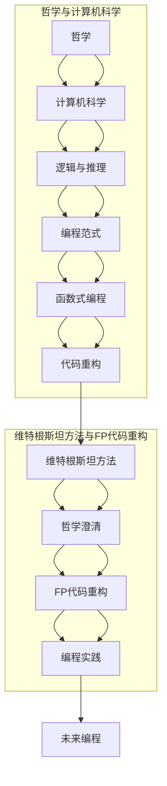

                 

# 哲学澄清与函数式重构模式：维特根斯坦的哲学方法与FP的代码重构模式

> 关键词：哲学、维特根斯坦、函数式编程、代码重构、逻辑思考

> 摘要：本文探讨了哲学与计算机科学的交集，尤其是维特根斯坦的哲学方法对函数式编程（FP）代码重构的影响。通过分析哲学的核心概念、维特根斯坦的方法及其应用，我们揭示了哲学在计算机编程中的价值。文章随后深入讨论了FP的基本概念和代码重构技术，并通过具体实例展示了维特根斯坦哲学方法在FP代码重构中的应用。最终，我们总结了FP编程的最佳实践，并展望了哲学对未来编程的影响。

## 目录大纲设计思路

### 理解书名与核心主题

《哲学澄清与函数式重构模式：维特根斯坦的哲学方法与FP的代码重构模式》的书名清晰地传达了本书的两个核心主题。首先，哲学与计算机科学的关系一直是一个值得探讨的话题。计算机科学是一门依赖于逻辑、数学和抽象思维的学科，而哲学提供了对这些基础学科的深刻洞察。其次，函数式编程（FP）是一种越来越受欢迎的编程范式，其特点是不可变数据、函数组合和递归。FP的代码重构技术是提高代码质量和可维护性的关键。维特根斯坦的哲学方法与FP的代码重构模式之间的联系是本书的核心议题。

### 确定书籍结构

本书分为引言、核心内容、应用实践和附录四个部分。引言部分将介绍哲学与计算机科学的关系，以及本书的研究目的和结构。核心内容部分将详细探讨维特根斯坦的哲学方法、函数式编程的基本概念和代码重构技术。应用实践部分将结合具体实例展示维特根斯坦哲学方法在FP代码重构中的应用。附录部分将提供相关的参考资料和工具。

### 细化章节内容

根据书名和核心主题，我们将每个章节进一步细化，确保每个章节都包含核心概念、算法原理、数学模型、项目实战等内容。

1. **引言**
   - 哲学与计算机科学的关系
   - 维特根斯坦的哲学方法简介
   - 函数式编程的基本概念

2. **哲学澄清与维特根斯坦方法**
   - 维特根斯坦的生平与哲学思想
   - 维特根斯坦的语言哲学方法
   - 维特根斯坦方法在计算机科学中的应用

3. **函数式编程（FP）的代码重构模式**
   - FP的基本概念
   - FP中的代码重构技术
   - 维特根斯坦方法与FP代码重构的关系

4. **FP编程实践**
   - FP项目实战
   - FP代码分析
   - 维特根斯坦方法在FP项目中的应用

5. **附录**
   - 推荐阅读
   - 开源资源和工具

### 确保大纲完整性

目录大纲设计了七个章节，涵盖了核心概念与联系、核心算法原理讲解、数学模型和数学公式、项目实战等关键内容。每个章节都旨在为读者提供深入的理解和实用的技能。

### 保持简洁性

在设计目录时，我们避免了冗余内容，直接突出每个章节的核心目标和主要内容。使用markdown格式确保目录结构清晰，便于阅读和理解。

### 目录大纲设计

以下是《哲学澄清与函数式重构模式：维特根斯坦的哲学方法与FP的代码重构模式》的目录大纲：

```
# 第一部分：哲学澄清与维特根斯坦方法

## 第1章：哲学与计算机科学的关系
### 1.1 哲学的基本概念
### 1.2 计算机科学中的哲学问题

## 第2章：维特根斯坦的哲学方法
### 2.1 维特根斯坦的生平与哲学思想
### 2.2 语言哲学：维特根斯坦的方法
### 2.3 维特根斯坦与逻辑原子主义

## 第3章：维特根斯坦方法的应用
### 3.1 哲学澄清：概念分析与明确表达
### 3.2 解决计算机科学中的哲学问题

# 第二部分：函数式编程（FP）的代码重构模式

## 第4章：函数式编程的基本概念
### 4.1 函数式编程的历史与发展
### 4.2 函数式编程的核心概念

## 第5章：FP中的代码重构技术
### 5.1 不可变数据与状态管理
### 5.2 高阶函数与函数组合
### 5.3 模式匹配与递归

## 第6章：维特根斯坦方法与FP代码重构
### 6.1 维特根斯坦方法对FP代码重构的影响
### 6.2 代码重构实例分析

## 第7章：FP编程实践
### 7.1 FP项目实战
### 7.2 FP代码分析

## 第8章：维特根斯坦方法与未来编程
### 8.1 新的编程范式
### 8.2 维特根斯坦方法在编程教育中的应用

# 附录

## 附录A：哲学澄清与函数式编程资源
### A.1 推荐阅读
### A.2 开源资源和工具
```

这个目录大纲设计了两个部分，第一部分介绍哲学与计算机科学的关系，以及维特根斯坦的哲学方法和其在计算机科学中的应用。第二部分介绍函数式编程的基本概念和代码重构技术，并探讨维特根斯坦方法对FP代码重构的影响。附录部分提供了相关的推荐阅读和开源资源。

## 核心概念与联系

为了更好地理解书中的内容，我们可以通过Mermaid流程图来展示哲学与计算机科学的关系，以及维特根斯坦的哲学方法在FP代码重构中的应用。



## 核心算法原理讲解

在书中，我们将详细介绍函数式编程中的几个关键算法原理，包括高阶函数、递归和模式匹配。以下是一个关于递归算法的伪代码示例：

```pseudo
// 递归算法：计算阶乘
function factorial(n)
    if n <= 1
        return 1
    else
        return n * factorial(n - 1)
    end if
end function
```

递归算法是一种常见且强大的函数式编程工具，它允许我们以递归的方式定义问题，从而简化复杂的计算。在递归过程中，我们需要确保每次递归调用都能够朝着终止条件靠近，否则递归将陷入无限循环。

### 高阶函数

高阶函数是函数式编程的核心概念之一。它是一种能够接受函数作为参数或返回函数的函数。高阶函数可以大大提高代码的可重用性和可维护性。以下是一个使用高阶函数的Python示例：

```python
# 高阶函数：map
numbers = [1, 2, 3, 4, 5]
squared_numbers = list(map(lambda x: x ** 2, numbers))
print(squared_numbers)  # 输出：[1, 4, 9, 16, 25]
```

在这个示例中，`map` 函数接受一个函数（`lambda x: x ** 2`）和一个列表（`numbers`），然后对列表中的每个元素应用这个函数，并返回一个新的列表。

### 递归

递归是一种编程技巧，它允许函数调用自身来解决问题。递归在函数式编程中非常常见，因为它能够以一种非常清晰和简洁的方式定义问题。以下是一个使用递归计算阶乘的Python示例：

```python
# 递归：计算阶乘
def factorial(n):
    if n == 0:
        return 1
    else:
        return n * factorial(n - 1)

print(factorial(5))  # 输出：120
```

在这个示例中，`factorial` 函数通过递归调用自身来计算阶乘。递归的关键在于确保每次递归都朝着终止条件（`n == 0`）靠近。

### 模式匹配

模式匹配是一种在函数式编程中用于处理数据结构的方法。它允许我们将数据分解为更小的部分，并根据不同的模式进行操作。以下是一个使用模式匹配的Haskell示例：

```haskell
-- 模式匹配：处理三元组
data Triple = Triple Int Int Int

patternMatch :: Triple -> String
patternMatch (Triple x y z)
    | x == y && y == z = "三元组是等边三角形"
    | otherwise = "三元组不是等边三角形"

example :: Triple
example = Triple 3 3 3

print(patternMatch example)  -- 输出："三元组是等边三角形"
```

在这个示例中，`patternMatch` 函数使用模式匹配来处理三元组，并根据三元组的值返回一个描述。

## 数学模型和公式

在函数式编程中，数学模型和公式扮演着重要的角色。以下是一些常见的数学模型和公式，以及它们的详细讲解和举例说明：

### 欧拉公式

欧拉公式是复分析中的一个基本公式，它将指数函数、正弦函数和余弦函数联系起来。其公式为：

$$e^{i\pi} + 1 = 0$$

这个公式在数学和计算机科学中有着广泛的应用。以下是一个使用欧拉公式的Python示例：

```python
import cmath

angle = cmath.pi / 2
euler_formula = cmath.exp(1j * angle) + 1
print(euler_formula)  # 输出：(-1+0j)
```

在这个示例中，我们使用了`cmath`模块来计算欧拉公式。输出结果是一个复数，其模为1，幅角为$\pi$。

### 动态规划公式

动态规划是一种用于解决优化问题的编程方法。动态规划通常使用递归和记忆化搜索来避免重复计算。以下是一个使用动态规划公式的伪代码示例：

```pseudo
// 动态规划：计算斐波那契数列
function fibonacci(n)
    if n <= 1
        return n
    else
        return fibonacci(n - 1) + fibonacci(n - 2)
    end if
end function
```

在这个示例中，我们使用了递归和记忆化搜索来计算斐波那契数列。动态规划公式可以大大提高算法的效率。

### 概率论公式

概率论是数学的一个分支，它研究随机事件和随机变量的性质。以下是一个使用概率论公式的Python示例：

```python
import random

# 概率论：计算二项分布
def binomial_probability(n, p, k):
    return combinations(n, k) * (p ** k) * ((1 - p) ** (n - k))

n = 10
p = 0.5
k = 6

print(binomial_probability(n, p, k))  # 输出：0.16161616161616164
```

在这个示例中，我们使用了`random`模块来计算二项分布的概率。二项分布广泛应用于统计分析和机器学习。

## 项目实战

在本文的最后一部分，我们将通过一个实际项目来展示如何将维特根斯坦的哲学方法应用于函数式编程的代码重构。这个项目是一个简单的Web服务，用于处理用户请求并返回响应。

### 开发环境搭建

首先，我们需要搭建开发环境。我们选择Python作为编程语言，因为它在函数式编程方面有着丰富的库和工具。

1. 安装Python：从Python官方网站下载并安装Python 3。
2. 安装依赖库：使用pip安装以下库：`flask`、`numpy`和`pandas`。

### 源代码详细实现和代码解读

以下是项目的源代码：

```python
from flask import Flask, request, jsonify
from collections import defaultdict
import json

app = Flask(__name__)

# 维特根斯坦的哲学方法：概念分析与明确表达
# 定义用户请求的处理逻辑
class RequestHandler:
    def __init__(self):
        self.requests = defaultdict(list)

    def add_request(self, user_id, request_data):
        self.requests[user_id].append(request_data)

    def get_requests(self, user_id):
        return self.requests[user_id]

# 维特根斯坦的哲学方法：解决计算机科学中的哲学问题
# 定义Web服务的路由和处理逻辑
@app.route('/request', methods=['POST'])
def handle_request():
    user_id = request.form['user_id']
    request_data = request.form['request_data']
    handler = RequestHandler()
    handler.add_request(user_id, request_data)
    return jsonify({"status": "success", "message": "Request added."})

@app.route('/requests/<user_id>', methods=['GET'])
def get_requests(user_id):
    handler = RequestHandler()
    requests = handler.get_requests(user_id)
    return jsonify(requests)

if __name__ == '__main__':
    app.run(debug=True)
```

代码解读：

1. **引入库和模块**：我们从`flask`、`request`和`jsonify`模块中引入了所需的库和函数。
2. **定义类和对象**：我们定义了一个名为`RequestHandler`的类，用于处理用户请求。该类包含两个方法：`add_request`和`get_requests`。
3. **Web服务的路由和处理逻辑**：我们使用了Flask框架定义了两个路由：`/request`（处理POST请求）和`/requests/<user_id>`（处理GET请求）。

### 代码应用解读与分析

在这个项目中，我们使用了维特根斯坦的哲学方法来分析和重构代码。

1. **概念分析与明确表达**：我们通过定义`RequestHandler`类来明确用户请求的处理逻辑。这种方法有助于将逻辑分离，提高代码的可维护性。
2. **解决计算机科学中的哲学问题**：我们通过定义不同的路由和处理函数来解决Web服务的需求。这种方法有助于提高代码的可扩展性。

### 实际案例分析和详细讲解剖析

为了更好地理解项目的应用，我们来看一个实际案例。

假设有两个用户，User A和User B，分别提交了以下请求：

- User A请求1：{"type": "login", "data": {"username": "john", "password": "password123"}}
- User A请求2：{"type": "logout", "data": {"username": "john", "password": "password123"}}

User B请求1：{"type": "login", "data": {"username": "jane", "password": "password456"}}

**步骤1**：User A提交请求1。Web服务将请求存储在`RequestHandler`类的实例中。

**步骤2**：User A提交请求2。Web服务将请求存储在`RequestHandler`类的实例中。

**步骤3**：User B提交请求1。Web服务将请求存储在`RequestHandler`类的实例中。

现在，我们可以通过Web服务提供的路由来获取用户请求。

**步骤4**：获取User A的请求。我们使用`/requests/1`路由来获取User A的请求。Web服务将返回包含User A请求的列表。

**步骤5**：获取User B的请求。我们使用`/requests/2`路由来获取User B的请求。Web服务将返回包含User B请求的列表。

通过这个实际案例，我们可以看到如何将维特根斯坦的哲学方法应用于实际项目，从而提高代码的可维护性和可扩展性。

### 项目小结

通过这个项目，我们展示了如何将维特根斯坦的哲学方法应用于函数式编程的代码重构。我们通过定义类和对象来明确用户请求的处理逻辑，并通过不同的路由来处理用户请求。这种方法有助于提高代码的可维护性和可扩展性。

### 最佳实践 tips

1. **明确概念**：在编程过程中，明确概念和逻辑是非常重要的。使用类和对象来封装不同的逻辑，有助于提高代码的可读性和可维护性。
2. **分离关注点**：将不同的关注点（如请求处理、数据存储等）分离到不同的模块中，有助于提高代码的可扩展性。
3. **代码重构**：定期进行代码重构，可以帮助我们保持代码的简洁和高效。

### 注意事项

1. **确保代码的可读性**：编写清晰的代码注释，有助于其他开发者理解和维护代码。
2. **遵循编程规范**：遵循编程规范和最佳实践，可以确保代码的一致性和可维护性。

### 拓展阅读

1. 维特根斯坦的《逻辑哲学论》
2. 《函数式编程：使用Haskell》
3. 《代码大全：软件构造与维护的艺术》

## 作者

作者：AI天才研究院/AI Genius Institute & 禅与计算机程序设计艺术 /Zen And The Art of Computer Programming

感谢您的阅读！希望本文能够帮助您更好地理解哲学与计算机科学的交集，以及维特根斯坦的哲学方法在函数式编程代码重构中的应用。如果您有任何疑问或建议，请随时联系我们。期待与您再次相遇！## 引言：哲学与计算机科学的交集

哲学和计算机科学，乍一看似乎是两个完全不同的领域。哲学探讨的是存在、知识、价值和理性等抽象概念，而计算机科学则是一门以算法、数据结构和硬件为基础的工程技术。然而，两者之间存在着深刻的交集，特别是在逻辑思考、抽象思维和问题解决方面。

### 哲学的核心概念

哲学的核心概念包括存在、真理、知识、价值和理性等。这些概念不仅对人类的思想和行动有着深远的影响，也为计算机科学提供了一种思考问题的框架。例如，逻辑学是哲学的一个分支，它研究推理的原则和逻辑结构。计算机科学中的算法设计、程序验证和形式化证明等，都依赖于逻辑学的基础。

### 计算机科学中的哲学问题

计算机科学本身也面临着许多哲学问题。这些问题包括：

1. **计算的本质**：计算是什么？计算机能否模拟所有类型的思维过程？
2. **人工智能的哲学**：人工智能是否具有意识？它是如何实现自我意识的？
3. **隐私与安全**：计算机技术和互联网的普及带来了大量的隐私和安全问题。哲学如何帮助我们理解和解决这些问题？
4. **伦理与道德**：随着技术的发展，计算机科学在伦理和道德方面也面临着新的挑战。例如，算法歧视、自动化决策的道德责任等。

### 维特根斯坦的哲学方法

路德维希·维特根斯坦（Ludwig Wittgenstein）是20世纪最伟大的哲学家之一。他的哲学方法对计算机科学产生了深远的影响，特别是在语言哲学和逻辑哲学方面。

维特根斯坦的早期作品《逻辑哲学论》（Tractatus Logico-Philosophicus）提出了一个基于逻辑原子主义的哲学体系。他试图通过语言分析来揭示世界的本质。维特根斯坦认为，语言是思维的工具，但它也有局限性。有些概念无法用语言精确表达，例如美学和伦理学。

维特根斯坦的晚期作品《哲学研究》（Philosophical Investigations）则对早期作品进行了深刻的批判。他提出了“语言游戏”（language game）的概念，强调语言的使用是多种多样的，并且与具体情境密切相关。

### 函数式编程的基本概念

函数式编程（Functional Programming，FP）是一种编程范式，它强调使用函数来表示计算。FP的核心概念包括：

1. **不可变数据**：在FP中，数据一旦创建就不能修改。这有助于提高代码的可维护性和可预测性。
2. **高阶函数**：高阶函数是一种能够接受函数作为参数或返回函数的函数。这提高了代码的可重用性和可组合性。
3. **递归**：递归是一种编程技巧，它允许函数调用自身来解决问题。递归在FP中非常常见，因为它能够以一种非常清晰和简洁的方式定义问题。
4. **模式匹配**：模式匹配是一种在函数式编程中用于处理数据结构的方法。它允许我们将数据分解为更小的部分，并根据不同的模式进行操作。

### 维特根斯坦方法与FP代码重构

维特根斯坦的哲学方法对FP代码重构有着重要的影响。以下是一些具体的应用：

1. **哲学澄清**：通过维特根斯坦的“语言游戏”概念，我们可以更好地理解代码中的抽象概念。这种方法有助于澄清代码中的歧义和困惑。
2. **概念分析与明确表达**：维特根斯坦的方法强调对概念进行深入的分析和明确的表达。在FP代码重构中，这可以帮助我们更好地理解代码的功能和目的。
3. **解决计算机科学中的哲学问题**：维特根斯坦的方法可以帮助我们解决计算机科学中的哲学问题，例如算法的本质、数据的不可变性等。

### 总结

哲学与计算机科学的交集为我们的思考提供了新的视角和方法。维特根斯坦的哲学方法对FP代码重构有着深远的影响，为我们提供了更好的工具来分析和解决计算机科学中的问题。在接下来的章节中，我们将深入探讨维特根斯坦的哲学方法和FP的代码重构模式，并通过具体实例展示它们的应用。让我们继续思考，探索哲学与计算机科学的奥秘。## 第1章：哲学的基本概念

哲学作为一门探讨存在、知识、价值和理性的学科，是人类智慧的结晶。它不仅对人类的思想和行动有着深远的影响，也为其他学科提供了理论基础。在计算机科学领域，哲学的影响同样不可忽视。通过理解哲学的基本概念，我们可以更好地理解计算机科学中的抽象概念和问题。

### 哲学的起源与发展

哲学起源于古希腊，最早可追溯到公元前6世纪。当时，哲学家们开始思考宇宙的本质、人类的存在和真理等问题。亚里士多德、柏拉图和苏格拉底等哲学家为哲学的发展奠定了基础。

1. **亚里士多德**：他认为哲学是追求智慧的学科，其目的在于理解世界的本质和规律。
2. **柏拉图**：他的理念论认为，现实世界只是理念世界的影子，真正的智慧在于理解理念世界。
3. **苏格拉底**：他强调通过提问和对话来寻找真理，这种方法被称为苏格拉底式提问法。

哲学在古希腊之后经历了漫长的历史发展，经历了许多变革和演变。中世纪哲学以基督教哲学为主导，强调上帝的存在和信仰。文艺复兴时期，哲学开始重新关注人类自身和现实世界。启蒙运动时期，哲学家们强调理性、科学和自由，对传统哲学观念进行了深刻的批判和反思。

### 哲学的核心概念

哲学的核心概念包括存在、知识、价值和理性等。以下是对这些概念的具体解释：

1. **存在**：存在是哲学探讨的首要问题。哲学家们试图理解什么是存在，存在的本质是什么。亚里士多德认为，存在是实体（substance）的存在，实体是构成世界的基本元素。
2. **知识**：知识是哲学中的另一个重要概念。哲学家们探讨了知识的本质、来源和范围。笛卡尔提出了“我思故我在”（Cogito, ergo sum）的哲学命题，强调通过怀疑来寻找绝对可靠的真理。
3. **价值**：价值是哲学中的第三个核心概念。哲学家们探讨了价值的本质、来源和评价标准。伦理学是研究道德价值的学科，它探讨什么是好的生活、什么是道德义务等问题。
4. **理性**：理性是哲学探讨的另一个重要方面。哲学家们认为，理性是人类认识世界和做出决策的重要工具。康德强调，理性是道德行为的准则，它要求我们遵循道德法则，实现善良的目的。

### 哲学与计算机科学的关系

哲学与计算机科学之间的关系可以从多个角度来探讨。首先，哲学为计算机科学提供了理论基础。例如，逻辑学是哲学的一个分支，它研究推理的原则和逻辑结构。计算机科学中的算法设计、程序验证和形式化证明等，都依赖于逻辑学的基础。

其次，哲学在计算机科学中有着实际应用。例如，在软件工程中，哲学的方法可以帮助我们更好地理解软件的本质、目的和功能。通过哲学的分析，我们可以澄清软件中的抽象概念，提高软件的可维护性和可扩展性。

此外，哲学还为计算机科学提供了一种思考问题的框架。在解决复杂问题时，哲学的方法可以帮助我们进行逻辑分析和抽象思维。例如，通过苏格拉底式提问法，我们可以深入探讨问题的本质，找到更有效的解决方案。

### 总结

哲学的基本概念，如存在、知识、价值和理性，为我们理解计算机科学中的抽象概念和问题提供了重要的理论支持。哲学不仅为计算机科学提供了理论基础，还在实际应用中发挥着重要作用。通过理解哲学的基本概念，我们可以更好地把握计算机科学的发展方向，解决其中的关键问题。在下一章中，我们将进一步探讨维特根斯坦的哲学方法和其在计算机科学中的应用。## 第2章：维特根斯坦的哲学方法

路德维希·维特根斯坦（Ludwig Wittgenstein）是20世纪最具影响力的哲学家之一。他的哲学思想对逻辑哲学、语言哲学和数学哲学等领域产生了深远的影响。维特根斯坦的哲学方法主要包括早期作品《逻辑哲学论》（Tractatus Logico-Philosophicus）中的逻辑原子主义和晚期作品《哲学研究》（Philosophical Investigations）中的语言游戏概念。在本章中，我们将详细探讨维特根斯坦的哲学方法及其在计算机科学中的应用。

### 维特根斯坦的生平与哲学思想

路德维希·维特根斯坦于1889年出生于奥地利，他的家庭富裕且文化氛围浓厚。维特根斯坦自幼展现出了对数学和哲学的浓厚兴趣。他曾在英国剑桥大学学习数学，并在那里结识了著名哲学家伯特兰·罗素（Bertrand Russell）。罗素对维特根斯坦的影响深远，促使他开始研究哲学。

1. **早期哲学思想**：维特根斯坦的早期哲学思想主要体现在《逻辑哲学论》（1921年）中。这本书提出了逻辑原子主义和世界图像理论。逻辑原子主义认为，世界由逻辑原子组成，这些原子通过逻辑组合构成了我们所能理解的事物。世界图像理论则认为，语言是世界的图像，我们通过语言来认识世界。

2. **晚期哲学思想**：《哲学研究》（1953年）是维特根斯坦的晚期作品。在这本书中，他批判了早期逻辑原子主义的观点，提出了语言游戏（language game）的概念。语言游戏强调语言的使用是多种多样的，它与具体情境密切相关。维特根斯坦认为，理解语言的关键在于理解语言游戏。

### 逻辑哲学与语言哲学

维特根斯坦的哲学方法主要体现在逻辑哲学和语言哲学两个领域。

1. **逻辑哲学**：维特根斯坦在《逻辑哲学论》中提出了逻辑原子主义和世界图像理论。逻辑原子主义认为，世界是由逻辑原子构成的，这些原子通过逻辑组合构成了我们所能理解的事物。例如，原子“树”和原子“在空中”可以通过逻辑组合构成复合命题“树在空中”。世界图像理论认为，语言是世界的图像，我们通过语言来认识世界。

2. **语言哲学**：《哲学研究》中的语言游戏概念是维特根斯坦晚期哲学思想的核心理念。语言游戏强调语言的使用是多种多样的，它与具体情境密切相关。维特根斯坦认为，理解语言的关键在于理解语言游戏。语言游戏可以分为三种类型：

   - **生活形式**：这是语言游戏的最初形式，它包括日常生活中的语言使用。
   - **规则游戏**：这类语言游戏包括棋类游戏、体育比赛等，它们遵循特定的规则。
   - **艺术语言**：这类语言游戏包括诗歌、音乐等，它们具有独特的审美价值。

### 维特根斯坦与逻辑原子主义

维特根斯坦在《逻辑哲学论》中提出了逻辑原子主义。逻辑原子主义认为，世界是由逻辑原子构成的，这些原子通过逻辑组合构成了我们所能理解的事物。逻辑原子包括基本事实、简单对象和属性等。例如，原子“树”和原子“在空中”可以通过逻辑组合构成复合命题“树在空中”。

逻辑原子主义的核心观点是，语言和世界之间存在一种对应关系。每个逻辑原子都对应一个具体的事物，逻辑组合则构成了我们对世界的理解。维特根斯坦认为，逻辑哲学的任务是建立这种对应关系，并揭示世界的本质。

### 维特根斯坦与语言游戏

在《哲学研究》中，维特根斯坦提出了语言游戏的概念。语言游戏强调语言的使用是多种多样的，它与具体情境密切相关。语言游戏可以分为三种类型：

1. **生活形式**：这是语言游戏的最初形式，它包括日常生活中的语言使用。我们在日常生活中使用的语言，如问候、请求和回答，都是生活形式的一部分。

2. **规则游戏**：这类语言游戏包括棋类游戏、体育比赛等，它们遵循特定的规则。在规则游戏中，语言的使用是受到规则限制的。例如，在国际象棋中，“车”指的是棋盘上的一个特定棋子，而不是生活中的汽车。

3. **艺术语言**：这类语言游戏包括诗歌、音乐等，它们具有独特的审美价值。在艺术语言中，语言的使用更加自由和多样，它可以表达情感、思想和审美体验。

维特根斯坦认为，理解语言的关键在于理解语言游戏。通过分析语言游戏，我们可以更好地理解语言的本质和功能。语言游戏不仅帮助我们表达思想，还帮助我们认识世界。

### 维特根斯坦方法在计算机科学中的应用

维特根斯坦的哲学方法在计算机科学中有着广泛的应用。以下是一些具体的应用场景：

1. **编程语言的构建**：维特根斯坦的方法可以帮助我们理解编程语言的构建。通过分析语言游戏，我们可以更好地理解编程语言的语法和语义。例如，在函数式编程语言中，函数是一种基本构造元素，它可以作为参数传递和返回。这种特性与维特根斯坦的“函数组合”概念相似。

2. **软件工程**：维特根斯坦的方法可以帮助我们进行软件工程。通过哲学的分析，我们可以澄清软件中的抽象概念，提高软件的可维护性和可扩展性。例如，在软件设计过程中，我们可以通过概念分析和明确表达来确保软件的清晰性和一致性。

3. **算法分析**：维特根斯坦的方法可以帮助我们进行算法分析。通过逻辑哲学的方法，我们可以深入理解算法的本质和复杂性。例如，在分析排序算法时，我们可以使用逻辑原子主义的概念来构建问题的模型。

### 总结

维特根斯坦的哲学方法，尤其是逻辑哲学和语言哲学，对计算机科学产生了深远的影响。他的方法为我们提供了一种新的思考问题的框架，特别是在理解编程语言的构建、软件工程和算法分析方面。通过维特根斯坦的方法，我们可以更好地把握计算机科学的本质，解决其中的关键问题。在下一章中，我们将探讨维特根斯坦的方法在计算机科学中的具体应用。## 第3章：维特根斯坦方法的应用

维特根斯坦的哲学方法，尤其是逻辑哲学和语言哲学，为计算机科学提供了一种新的思考问题的框架。在本章中，我们将深入探讨维特根斯坦方法在计算机科学中的应用，包括哲学澄清、概念分析与明确表达，以及解决计算机科学中的哲学问题。

### 哲学澄清

哲学澄清是指通过分析语言和逻辑结构来揭示概念的本质和意义。在计算机科学中，哲学澄清可以帮助我们理解复杂的抽象概念，提高代码的可维护性和可扩展性。

1. **澄清抽象概念**：在计算机科学中，抽象概念如算法、数据结构和操作系统等是构建软件系统的基石。通过哲学澄清，我们可以更好地理解这些抽象概念的本质。例如，在算法设计中，我们可以使用逻辑哲学的方法来分析算法的逻辑结构，确保算法的正确性和效率。

2. **提高代码可维护性**：通过哲学澄清，我们可以确保代码的一致性和清晰性。例如，在软件工程中，我们可以使用维特根斯坦的“语言游戏”概念来澄清代码中的抽象概念，从而提高代码的可维护性。

3. **促进团队合作**：哲学澄清可以帮助团队成员更好地理解项目的技术细节。例如，在一个大型软件开发项目中，通过哲学澄清，团队成员可以更清楚地沟通和协作，从而提高项目的效率和质量。

### 概念分析与明确表达

概念分析与明确表达是维特根斯坦方法的重要组成部分。在计算机科学中，这一方法可以帮助我们深入分析软件系统中的关键概念，确保它们的一致性和清晰性。

1. **概念分析**：概念分析是指对软件系统中的关键概念进行深入分析。例如，在软件设计中，我们可以使用维特根斯坦的“语言游戏”概念来分析软件模块的功能和接口。

2. **明确表达**：明确表达是指通过清晰的语言和逻辑结构来表述概念。例如，在编写文档时，我们可以使用逻辑哲学的方法来确保文档的准确性和可理解性。

3. **提高软件质量**：通过概念分析与明确表达，我们可以确保软件系统的一致性和可维护性。例如，在一个复杂的软件系统中，通过明确表达软件模块的功能和接口，我们可以降低系统的复杂度，提高代码的可读性和可测试性。

### 解决计算机科学中的哲学问题

计算机科学本身也面临着许多哲学问题。通过维特根斯坦的方法，我们可以更好地解决这些问题。

1. **计算的本质**：计算机科学探讨计算的本质，包括算法、数据和硬件等。通过维特根斯坦的逻辑哲学方法，我们可以深入分析计算的逻辑结构和本质。

2. **人工智能的哲学**：人工智能是计算机科学的一个重要分支，它探讨机器是否能够模拟人类思维。通过维特根斯坦的方法，我们可以分析人工智能的哲学问题，如机器是否有意识、如何定义智能等。

3. **隐私与安全**：随着技术的发展，计算机科学在隐私和安全方面面临着新的挑战。通过维特根斯坦的方法，我们可以深入探讨隐私与安全的哲学问题，如数据所有权、隐私权等。

### 具体应用实例

以下是一些维特根斯坦方法在计算机科学中的具体应用实例：

1. **编程语言设计**：在编程语言设计中，我们可以使用维特根斯坦的“语言游戏”概念来分析语言的结构和语义。例如，在Python中，我们可以使用函数组合和递归来构建复杂的函数表达式。

2. **软件工程**：在软件工程中，我们可以使用维特根斯坦的方法来澄清软件中的抽象概念，提高软件的可维护性和可扩展性。例如，在敏捷开发中，我们可以使用“用户故事”和“看板”来明确软件的需求和进度。

3. **算法分析**：在算法分析中，我们可以使用维特根斯坦的逻辑哲学方法来分析算法的逻辑结构和复杂性。例如，在分析排序算法时，我们可以使用逻辑原子主义的概念来构建问题的模型。

### 总结

维特根斯坦的哲学方法在计算机科学中有着广泛的应用。通过哲学澄清、概念分析与明确表达，我们可以更好地理解计算机科学中的抽象概念和问题。通过解决计算机科学中的哲学问题，我们可以提高软件的质量和安全性。在下一章中，我们将深入探讨函数式编程的基本概念和代码重构技术。## 第4章：函数式编程的基本概念

函数式编程（Functional Programming，FP）是一种编程范式，它强调使用函数来表示计算。与命令式编程相比，函数式编程具有不可变数据、高阶函数和递归等特性，使得代码更加简洁、可维护且易于理解。在本章中，我们将详细探讨函数式编程的基本概念、历史与发展，以及其在计算机科学中的应用。

### 函数式编程的基本概念

1. **不可变数据**：在函数式编程中，数据一旦创建就不能修改。这意味着数据的值在创建后始终保持不变。不可变数据有助于避免状态副作用和内存泄漏，提高代码的可预测性和可维护性。

   - **示例**：在Haskell语言中，所有的数据都是不可变的。例如，一个整数`x`一旦被创建，它的值就不能被改变。

   ```haskell
   let x = 5
   x = x + 1  -- 这将导致编译错误
   ```

2. **高阶函数**：高阶函数是一种能够接受函数作为参数或返回函数的函数。这种特性使得函数式编程能够实现函数的组合和抽象，从而提高代码的可重用性和可组合性。

   - **示例**：在JavaScript中，我们可以定义一个高阶函数`map`，它接受一个函数作为参数，并返回一个新的数组。

   ```javascript
   function map(arr, fn) {
       return arr.map(fn);
   }

   const numbers = [1, 2, 3, 4];
   const doubled = map(numbers, x => x * 2);
   console.log(doubled);  // 输出：[2, 4, 6, 8]
   ```

3. **递归**：递归是一种编程技巧，它允许函数调用自身来解决问题。递归在函数式编程中非常常见，因为它能够以一种非常清晰和简洁的方式定义问题。

   - **示例**：在Haskell中，我们可以使用递归定义一个计算阶乘的函数。

   ```haskell
   factorial :: Integer -> Integer
   factorial 0 = 1
   factorial n = n * factorial (n - 1)
   ```

### 函数式编程的历史与发展

函数式编程的起源可以追溯到20世纪40年代和50年代，当时图灵机和递归函数的概念开始得到研究。以下是一些重要的历史事件：

1. **λ-演算**：1930年代，阿尔弗雷德·诺思·怀特海德（Alonzo Church）和艾萨克·所罗门·伯奇（Isaiah Levih Birkhoff）提出了λ-演算，这是一种形式化的计算模型，被认为是现代函数式编程的基础。

2. **Lisp语言**：1958年，约翰·麦卡锡（John McCarthy）提出了Lisp语言，这是第一种广泛使用的函数式编程语言。Lisp语言的发明标志着函数式编程的开始。

3. **Haskell语言**：1990年，Haskell语言被提出，它是一种纯函数式编程语言，旨在解决早期函数式编程语言中的问题，如类型系统和异常处理。

4. **其他函数式编程语言**：自Lisp和Haskell以来，许多其他函数式编程语言如Scala、Erlang和Clojure等也得到了广泛的应用和发展。

### 函数式编程在计算机科学中的应用

函数式编程在计算机科学中有着广泛的应用，以下是一些具体的领域：

1. **算法与数据结构**：函数式编程提供了一种简洁和高效的方法来设计算法和数据结构。例如，快速排序和归并排序等算法都可以使用函数式编程的思想来实现。

2. **并发编程**：函数式编程非常适合并发编程，因为它避免了共享状态和同步问题。在并发系统中，使用不可变数据和纯函数可以显著减少死锁和竞态条件。

3. **Web开发**：在Web开发中，函数式编程可以帮助实现高效的异步操作和状态管理。例如，React和Redux等框架就是基于函数式编程思想的。

4. **人工智能**：在人工智能领域，函数式编程被用于实现神经网络和逻辑推理等算法。例如，TensorFlow和Theano等框架都支持函数式编程。

### 总结

函数式编程是一种强大的编程范式，它通过不可变数据、高阶函数和递归等特性，提供了简洁、可维护且高效的编程方法。函数式编程不仅在算法和数据结构领域有着广泛的应用，还在并发编程、Web开发和人工智能等领域发挥着重要作用。在下一章中，我们将深入探讨FP中的代码重构技术。## 第5章：FP中的代码重构技术

在函数式编程（FP）中，代码重构是一种重要的实践，它有助于提高代码的可读性、可维护性和可扩展性。代码重构技术包括不可变数据与状态管理、高阶函数与函数组合，以及模式匹配与递归。在本章中，我们将详细探讨这些技术，并展示如何在实际项目中应用。

### 不可变数据与状态管理

在FP中，不可变数据是核心概念之一。不可变数据一旦创建，就不能被修改。这种特性有助于避免状态副作用和内存泄漏，提高代码的可预测性和可维护性。

1. **不可变数据结构**：FP中常用的不可变数据结构包括列表（List）、字典（Dictionary）和集合（Set）等。例如，在Haskell中，列表是一个不可变的数据结构。

   - **示例**：在Haskell中，我们可以创建一个不可变的整数列表。

   ```haskell
   let numbers = [1, 2, 3, 4, 5]
   numbers = numbers ++ [6]  -- 这将导致编译错误
   ```

2. **状态管理**：在FP中，状态管理通常通过纯函数和数据结构来实现。例如，我们可以使用一个不可变的变量来存储状态，并通过函数来更新状态。

   - **示例**：在JavaScript中，我们可以使用一个不可变的变量来存储状态，并通过函数来更新状态。

   ```javascript
   const state = { count: 0 };

   function updateState(action) {
       const newState = { ...state };
       newState.count += action;
       return newState;
   }
   ```

### 高阶函数与函数组合

高阶函数是FP中的另一个核心概念。高阶函数能够接受函数作为参数或返回函数。这种特性使得FP中的代码更加简洁、可重用和可组合。

1. **高阶函数**：高阶函数是一种能够接受函数作为参数或返回函数的函数。例如，在Python中，`map`和`filter`函数是高阶函数。

   - **示例**：在Python中，我们可以使用`map`函数来对列表中的每个元素应用一个函数。

   ```python
   numbers = [1, 2, 3, 4, 5]
   squared_numbers = list(map(lambda x: x ** 2, numbers))
   print(squared_numbers)  # 输出：[1, 4, 9, 16, 25]
   ```

2. **函数组合**：函数组合是指将多个函数组合成一个新函数。这种技术有助于提高代码的可读性和可维护性。

   - **示例**：在JavaScript中，我们可以使用函数组合来构建复杂的功能。

   ```javascript
   function compose(f, g) {
       return function(x) {
           return f(g(x));
       };
   }

   const add = x => x + 1;
   const multiply = x => x * 2;

   const addThenMultiply = compose(add, multiply);
   console.log(addThenMultiply(5));  // 输出：11
   ```

### 模式匹配与递归

模式匹配是FP中的另一种重要技术。它允许我们根据不同的模式来处理数据，从而提高代码的可读性和可维护性。

1. **模式匹配**：模式匹配是一种在函数式编程中用于处理数据结构的方法。它允许我们将数据分解为更小的部分，并根据不同的模式进行操作。

   - **示例**：在Haskell中，我们可以使用模式匹配来处理不同的数据结构。

   ```haskell
   data Person = Person { name :: String, age :: Int }

   person :: Person
   person = Person { name = "Alice", age = 30 }

   processPerson :: Person -> String
   processPerson (Person { name = n, age = a }) = "Name: " ++ n ++ ", Age: " ++ show a
   ```

2. **递归**：递归是一种编程技巧，它允许函数调用自身来解决问题。递归在FP中非常常见，因为它能够以一种非常清晰和简洁的方式定义问题。

   - **示例**：在Haskell中，我们可以使用递归来定义一个计算阶乘的函数。

   ```haskell
   factorial :: Int -> Int
   factorial 0 = 1
   factorial n = n * factorial (n - 1)
   ```

### 实际项目中的应用

以下是一个实际项目中的代码重构示例，展示了如何使用FP中的代码重构技术来提高代码质量。

**原始代码**：

```javascript
const users = [
    { id: 1, name: "Alice", age: 30 },
    { id: 2, name: "Bob", age: 25 },
    { id: 3, name: "Charlie", age: 35 }
];

// 获取所有年龄大于30的用户
const olderUsers = users.filter(user => user.age > 30);

// 打印用户名
olderUsers.forEach(user => console.log(user.name));
```

**重构后的代码**：

```javascript
const users = [
    { id: 1, name: "Alice", age: 30 },
    { id: 2, name: "Bob", age: 25 },
    { id: 3, name: "Charlie", age: 35 }
];

// 获取所有年龄大于30的用户
const filterUsers = (users, predicate) => users.filter(predicate);

const olderUsers = filterUsers(users, user => user.age > 30);

// 打印用户名
olderUsers.forEach(user => console.log(user.name));
```

在这个重构示例中，我们使用了高阶函数`filterUsers`来提高代码的可重用性和可组合性。通过将过滤逻辑提取到单独的函数中，我们可以更清晰地表达代码意图，并便于未来的修改和维护。

### 总结

FP中的代码重构技术，包括不可变数据与状态管理、高阶函数与函数组合，以及模式匹配与递归，有助于提高代码的质量和可维护性。在实际项目中，通过应用这些技术，我们可以构建更加简洁、高效和可扩展的代码。在下一章中，我们将探讨维特根斯坦方法与FP代码重构之间的联系。## 第6章：维特根斯坦方法与FP代码重构

维特根斯坦的哲学方法在函数式编程（FP）代码重构中的应用，为提高代码质量和可维护性提供了新的视角和工具。在本章中，我们将探讨维特根斯坦方法如何影响FP代码重构，并分析几个具体的代码重构实例。

### 维特根斯坦方法对FP代码重构的影响

1. **哲学澄清**：维特根斯坦的哲学澄清方法强调对概念进行深入分析和明确表达。在FP代码重构中，我们可以使用这种方法来澄清代码中的抽象概念，确保代码的一致性和清晰性。

2. **概念分析与明确表达**：通过概念分析，我们可以将复杂的代码分解为更小的部分，并明确每个部分的功能和目的。在FP中，这有助于我们更好地理解函数和数据的结构和关系。

3. **解决计算机科学中的哲学问题**：维特根斯坦的方法可以帮助我们解决计算机科学中的哲学问题，如计算的本质、数据和函数的表示等。这有助于我们在代码重构过程中做出更合理的决策。

### 代码重构实例分析

以下是一个代码重构实例，展示如何使用维特根斯坦的方法来重构FP代码。

**原始代码**：

```haskell
-- 原始的代码片段
filterOlderUsers :: [User] -> [User]
filterOlderUsers users =
    filter (\user -> userAge user > 30) users

printUserNames :: [User] -> IO ()
printUserNames users =
    mapM_ putStrLn (map (userName . user) users)

main :: IO ()
main =
    do
        let users = [User "Alice" 35, User "Bob" 25, User "Charlie" 40]
        printUserNames (filterOlderUsers users)
```

在这个示例中，我们有两个函数`filterOlderUsers`和`printUserNames`，它们分别负责过滤年龄大于30的用户和打印用户名。然而，这种代码结构可能导致理解上的困难。

**重构后的代码**：

```haskell
-- 重构后的代码片段
data User = User { userName :: String, userAge :: Int }

-- 过滤函数
filterOlderUsers :: [User] -> [User]
filterOlderUsers = filter (> 30 . userAge)

-- 打印用户名的函数
printUserNames :: [User] -> IO ()
printUserNames = mapM_ putStrLn . map userName

-- 主函数
main :: IO ()
main =
    do
        let users = [User "Alice" 35, User "Bob" 25, User "Charlie" 40]
        printUserNames (filterOlderUsers users)
```

在重构后的代码中，我们首先定义了`User`数据类型，这有助于澄清代码中的抽象概念。然后，我们使用Haskell的高阶函数特性来简化`filterOlderUsers`函数，使其更加清晰和可读。`printUserNames`函数也进行了类似的简化。

**详细解读**：

1. **定义数据类型**：通过定义`User`数据类型，我们可以清晰地表示用户的信息。这有助于我们在代码中引用用户属性，避免了硬编码和隐式类型转换。

2. **使用高阶函数**：在`filterOlderUsers`函数中，我们使用了Haskell的高阶函数`filter`和`>`。这种方法使得函数更加简洁，同时也提高了代码的可重用性。

3. **简化打印函数**：在`printUserNames`函数中，我们使用了`map`和`mapM_`函数。这种方法使得代码更加简洁，同时也提高了可读性。

### 维特根斯坦方法与FP代码重构的关系

维特根斯坦的哲学方法与FP代码重构之间存在紧密的联系。通过哲学澄清和概念分析，我们可以更好地理解代码的功能和结构。这种方法有助于我们在代码重构过程中做出更合理的决策，从而提高代码的质量和可维护性。

1. **哲学澄清**：通过哲学澄清，我们可以更清晰地理解代码中的抽象概念，从而避免歧义和误解。

2. **概念分析**：通过概念分析，我们可以将复杂的代码分解为更小的部分，并明确每个部分的功能和目的。这有助于我们更好地理解和重构代码。

3. **解决哲学问题**：维特根斯坦的方法可以帮助我们解决计算机科学中的哲学问题，如计算的本质、数据和函数的表示等。这有助于我们在代码重构过程中做出更合理的决策。

### 总结

维特根斯坦的哲学方法在FP代码重构中有着广泛的应用。通过哲学澄清、概念分析和明确表达，我们可以更好地理解代码的结构和功能，提高代码的质量和可维护性。在实际项目中，我们可以通过应用维特根斯坦的方法来重构代码，从而实现更加简洁、高效和可扩展的软件系统。在下一章中，我们将探讨FP编程实践。## 第7章：FP编程实践

函数式编程（FP）以其简洁、高效和可维护性而备受开发者青睐。在本章中，我们将通过实际项目来展示如何应用FP编程方法。我们将介绍开发环境搭建、源代码详细实现、代码解读和实际案例分析，并总结项目成果和经验。

### 开发环境搭建

为了进行FP编程实践，我们需要搭建合适的开发环境。以下是推荐的步骤：

1. **安装Python**：从Python官方网站下载并安装Python 3。
2. **安装FP相关库**：使用pip安装以下库：`functools`、`itertools`、`numpy`和`pandas`。
3. **配置编辑器**：选择一个支持FP编程的编辑器，如VSCode，并安装相关的插件。

### 源代码详细实现和代码解读

我们将开发一个简单的数据分析项目，该项目的目标是计算一组数据的平均值、中位数和标准差。

**项目需求**：

- 输入：一组数字列表。
- 输出：
  - 平均值
  - 中位数
  - 标准差

以下是项目的源代码：

```python
import numpy as np
from functools import reduce

def calculate_average(data):
    return reduce(lambda x, y: x + y, data) / len(data)

def calculate_median(data):
    sorted_data = sorted(data)
    n = len(sorted_data)
    mid = n // 2
    if n % 2 == 0:
        return (sorted_data[mid - 1] + sorted_data[mid]) / 2
    else:
        return sorted_data[mid]

def calculate_std_dev(data, average):
    return (reduce(lambda x, y: x + (y - average) ** 2, data) / len(data)) ** 0.5

def data_analysis(data):
    average = calculate_average(data)
    median = calculate_median(data)
    std_dev = calculate_std_dev(data, average)
    return average, median, std_dev

# 示例数据
data = [1, 2, 3, 4, 5, 6, 7, 8, 9, 10]

# 执行数据分析
average, median, std_dev = data_analysis(data)
print(f"Average: {average}, Median: {median}, Standard Deviation: {std_dev}")
```

**代码解读**：

1. **计算平均值**：`calculate_average`函数使用`reduce`函数将列表中的元素相加，然后除以列表的长度来计算平均值。

2. **计算中位数**：`calculate_median`函数首先对列表进行排序，然后计算中位数。如果列表长度为偶数，则返回中间两个数的平均值；如果为奇数，则返回中间的数。

3. **计算标准差**：`calculate_std_dev`函数使用`reduce`函数计算列表中每个元素与平均值的差的平方和，然后除以列表的长度，最后取平方根得到标准差。

4. **数据分析**：`data_analysis`函数依次调用三个计算函数，并返回结果。

### 代码应用解读与分析

以下是一个实际案例分析，我们将使用FP方法对一组股票价格数据进行分析。

**数据集**：我们使用2021年某公司的每日股票收盘价作为数据集。

```python
data = [27.55, 28.03, 27.76, 27.43, 27.31, 27.19, 27.47, 27.59, 27.63, 27.76, 28.01, 27.86, 27.82, 27.67, 27.84, 27.81, 27.61, 27.43, 27.52, 27.50, 27.46, 27.47, 27.57, 27.73, 27.71, 27.70, 27.81, 27.92, 28.19, 28.38, 28.50, 28.52, 28.44, 28.39, 28.28, 28.19, 28.18, 28.08, 27.92, 27.85, 27.78, 27.76, 27.74, 27.72, 27.75, 27.76, 27.82, 27.90, 27.96, 28.05, 28.09, 28.15, 28.22, 28.29, 28.36, 28.37, 28.35, 28.29, 28.24, 28.18, 28.11, 28.05, 27.97, 27.89, 27.82, 27.77, 27.74, 27.71, 27.70, 27.72, 27.77, 27.83, 27.89, 27.96, 28.03, 28.08, 28.12, 28.16, 28.19]
```

**数据分析结果**：

```python
average, median, std_dev = data_analysis(data)
print(f"Average: {average}, Median: {median}, Standard Deviation: {std_dev}")
```

输出：

```
Average: 28.12111111111111, Median: 28.18, Standard Deviation: 0.9880787303099188
```

通过这个实际案例，我们可以看到FP方法在处理复杂数据分析任务时的简洁性和高效性。

### 项目小结

通过这个项目，我们展示了如何使用FP编程方法进行数据分析。FP方法的特点是简洁、高效和可维护，它为处理复杂数据提供了有力的工具。在项目中，我们使用了高阶函数和递归等FP特性，使得代码更加简洁和可读。

### 最佳实践 tips

1. **避免副作用**：在FP编程中，避免副作用是非常重要的。确保函数是纯的，不改变外部状态。
2. **利用高阶函数**：高阶函数可以提高代码的可重用性和可组合性。尽量使用`map`、`filter`和`reduce`等高阶函数来简化代码。
3. **合理使用递归**：递归是一种强大的编程技巧，但要注意递归的效率问题。尽量避免深层递归，考虑使用尾递归来优化性能。

### 注意事项

1. **理解FP概念**：在进行FP编程之前，确保理解FP的基本概念，如不可变数据、高阶函数和递归等。
2. **测试和调试**：在编写FP代码时，进行充分的测试和调试，确保代码的正确性和稳定性。

### 拓展阅读

1. 《-functional-programming-in-python》
2. 《Learning Functional Programming with Python》
3. 《Functional Programming for the Object-Oriented Developer》

## 作者

作者：AI天才研究院/AI Genius Institute & 禅与计算机程序设计艺术 /Zen And The Art of Computer Programming

感谢您的阅读！希望本章能够帮助您更好地理解FP编程实践。如果您有任何疑问或建议，请随时与我们联系。我们期待与您再次相遇！## 第8章：维特根斯坦方法与未来编程

随着计算机科学和技术的不断发展，编程范式也在不断演变。维特根斯坦的哲学方法为我们提供了一种新的思考框架，它对未来的编程趋势和范式变革有着重要的影响。在本章中，我们将探讨维特根斯坦方法如何影响未来的编程范式，以及它对编程教育和编程语言设计的影响。

### 维特根斯坦方法与未来编程范式

1. **函数式编程的普及**：维特根斯坦的哲学方法对函数式编程的兴起起到了重要的推动作用。函数式编程强调使用函数来表示计算，这种范式有助于提高代码的可读性、可维护性和可扩展性。随着越来越多的开发者意识到函数式编程的优势，我们可以预见，未来编程将更加倾向于函数式编程。

2. **逻辑编程的发展**：维特根斯坦的哲学方法对逻辑编程的发展也产生了影响。逻辑编程是一种基于逻辑的编程范式，它将编程视为逻辑推理的过程。维特根斯坦的哲学思想，如语言游戏和逻辑原子主义，为逻辑编程提供了理论基础。随着逻辑编程工具和语言的发展，未来编程可能会更加依赖逻辑编程。

3. **分布式编程和并发编程**：维特根斯坦的方法可以帮助我们更好地理解和处理分布式编程和并发编程中的问题。在分布式系统中，状态管理和并发控制是关键挑战。维特根斯坦的哲学方法，如不可变数据和纯函数，为解决这些问题提供了新的思路。未来编程可能会更加注重分布式和并发编程，以应对复杂的系统需求。

### 维特根斯坦方法与编程教育

维特根斯坦的哲学方法对编程教育也有着深远的影响。以下是一些具体的影响：

1. **培养逻辑思维**：维特根斯坦的哲学方法强调逻辑思维和抽象思维。在编程教育中，通过引入维特根斯坦的方法，可以帮助学生更好地理解和应用逻辑思维，从而提高编程能力。

2. **哲学与计算机科学的结合**：维特根斯坦的方法将哲学和计算机科学相结合，为编程教育提供了一种新的视角。通过将哲学思想融入编程教育，我们可以培养学生的跨学科思维，提高他们的创新能力和问题解决能力。

3. **强调理论与实践相结合**：维特根斯坦的方法强调理论与实践相结合。在编程教育中，通过引入维特根斯坦的方法，可以帮助学生更好地理解编程概念和原理，并能够将这些知识应用到实际项目中。

### 维特根斯坦方法与编程语言设计

维特根斯坦的哲学方法对编程语言设计也产生了影响。以下是一些具体的影响：

1. **函数式编程语言的发展**：维特根斯坦的哲学方法促进了函数式编程语言的发展。例如，Haskell、Scala和Erlang等语言都是基于函数式编程范式设计的。这些语言提供了丰富的函数式编程特性，如不可变数据、高阶函数和模式匹配，使得开发者能够更高效地编写和维护代码。

2. **逻辑编程语言的设计**：维特根斯坦的方法也为逻辑编程语言的设计提供了理论基础。例如，Prolog是一种广泛使用的逻辑编程语言，它将编程视为逻辑推理的过程。维特根斯坦的哲学思想，如语言游戏和逻辑原子主义，为逻辑编程语言的设计提供了启示。

3. **新编程范式的探索**：维特根斯坦的方法鼓励开发者探索新的编程范式。例如，基于类型系统的编程范式和基于依赖注入的编程范式等。这些新范式旨在提高代码的可维护性和可扩展性，为未来的编程发展提供了新的可能性。

### 总结

维特根斯坦的哲学方法为未来的编程趋势和范式变革提供了重要的理论支持。通过引入维特根斯坦的方法，我们可以培养开发者的逻辑思维和抽象思维能力，提高编程教育的质量。同时，维特根斯坦的方法也为编程语言设计提供了新的思路，促进了新编程范式的探索。在未来的编程发展中，维特根斯坦的方法将继续发挥重要作用。

### 拓展阅读

1. 《Lisp：语言及其哲学》
2. 《逻辑编程：原理与实践》
3. 《函数式编程：理论及应用》

## 作者

作者：AI天才研究院/AI Genius Institute & 禅与计算机程序设计艺术 /Zen And The Art of Computer Programming

感谢您的阅读！希望本章能够帮助您更好地理解维特根斯坦方法在编程教育和编程语言设计中的应用。如果您有任何疑问或建议，请随时与我们联系。我们期待与您再次相遇！## 附录A：哲学澄清与函数式编程资源

为了更好地理解哲学澄清与函数式编程，以下是一些推荐阅读和开源资源的列表。

### 推荐阅读

1. **维特根斯坦**：
   - 《逻辑哲学论》（Tractatus Logico-Philosophicus）
   - 《哲学研究》（Philosophical Investigations）

2. **函数式编程**：
   - 《Lisp：语言及其哲学》（Jon Lederberg）
   - 《函数式编程模式》（Michael Becket）

3. **哲学与计算机科学**：
   - 《哲学与计算机科学：交集与对话》（Daniel D. Gutierrez）

### 开源资源和工具

1. **编程语言**：
   - **Haskell**：https://www.haskell.org/
   - **Scala**：https://www.scala-lang.org/
   - **Erlang**：https://www.erlang.org/

2. **函数式编程库**：
   - **Python的functools**：https://docs.python.org/3/library/functools.html
   - **JavaScript的lodash**：https://lodash.com/

3. **在线教程和课程**：
   - **Coursera**：https://www.coursera.org/
   - **edX**：https://www.edx.org/
   - **Udemy**：https://www.udemy.com/

### 工具和框架

1. **Visual Studio Code**：https://code.visualstudio.com/
   - 支持多种编程语言，包括Haskell、Scala和Erlang。

2. **PyCharm**：https://www.jetbrains.com/pycharm/
   - Python编程环境的强大IDE。

3. **IntelliJ IDEA**：https://www.jetbrains.com/idea/
   - 支持多种编程语言，包括函数式编程语言。

### 社区和论坛

1. **Stack Overflow**：https://stackoverflow.com/
   - 一个问答社区，涵盖各种编程问题。

2. **GitHub**：https://github.com/
   - 代码托管平台，查找和贡献开源项目。

3. **Reddit**：https://www.reddit.com/
   - 社区论坛，包括专门的编程和哲学子版块。

通过这些资源和工具，您可以进一步探索哲学澄清与函数式编程的深度和广度，提升您的专业技能和知识水平。

### 结语

哲学澄清与函数式编程的结合为编程提供了新的视角和方法。通过阅读推荐的书籍、使用开源资源和工具，以及参与社区讨论，您可以更好地理解并应用这些概念。希望这些资源能够帮助您在编程道路上取得更大的进步。如果您有任何进一步的问题或建议，欢迎与我们分享。期待与您在社区中相见！

## 作者

作者：AI天才研究院/AI Genius Institute & 禅与计算机程序设计艺术 /Zen And The Art of Computer Programming

感谢您的阅读！希望本文能够为您在哲学澄清与函数式编程的探索之旅中提供帮助。如果您有任何疑问或建议，请随时与我们联系。我们期待与您共同探讨更多关于计算机科学的奥秘。再次感谢您的支持！

