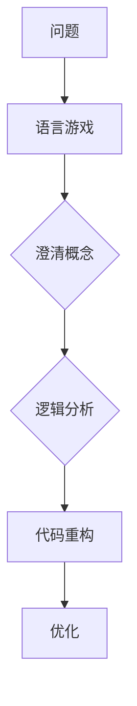
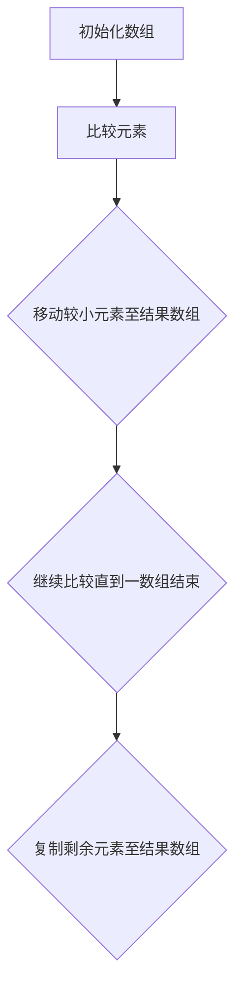

                 


### 文章标题

《哲学问题的澄清与代码重构：维特根斯坦的哲学方法与FP中的代码优化实践》

### 文章关键词

- 维特根斯坦哲学方法
- 代码重构
- 函数式编程（FP）
- 代码优化
- 软件工程

### 文章摘要

本文旨在探讨维特根斯坦的哲学方法在函数式编程（FP）中的应用，特别是在代码优化实践中的具体策略。通过分析维特根斯坦的语言哲学，我们将揭示其思想在编程领域的深刻影响。文章将分为三个部分：第一部分介绍维特根斯坦的哲学方法及其在编程中的适用性；第二部分阐述函数式编程的核心概念和代码优化策略；第三部分通过具体案例和项目实战，展示维特根斯坦哲学方法在FP中的实际应用。通过本文的阅读，读者将更好地理解如何将哲学思维应用于代码优化，提高编程质量。

### 第一部分：哲学问题的澄清

#### 第1章：维特根斯坦的哲学方法概述

1. **生平与贡献**

   **路德维希·维特根斯坦（Ludwig Wittgenstein）**（1889-1951）是20世纪最杰出的哲学家之一，其贡献主要在于语言哲学和逻辑哲学领域。他出生于奥地利的维也纳，先后在剑桥大学和曼彻斯特大学学习，并与著名数学家伯特兰·罗素（Bertrand Russell）和逻辑学家鲁道夫·卡尔纳普（Rudolf Carnap）有过密切的交往。

2. **主要思想**

   维特根斯坦的哲学思想经历了两个主要阶段：早期和晚期。

   - **早期思想**（以《逻辑哲学论》为代表）：维特根斯坦认为语言是思想的直接表达，逻辑是语言的基础，现实世界可以通过逻辑结构来描述。他提出了“图像理论”（image theory），即语言与现实之间的关系类似于一幅图像与它所描绘的事物之间的关系。

   - **晚期思想**（以《哲学研究》为代表）：维特根斯坦转向日常语言哲学，认为语言的使用是多样化的，没有统一的逻辑结构。他提出了“语言游戏”（language-game）的概念，即语言的使用是在特定的社会和文化环境中进行的。

3. **哲学问题的澄清**

   维特根斯坦的哲学方法强调通过对语言的细致分析来澄清哲学问题。他认为许多哲学问题实际上是由于语言的误用或误解而产生的。通过揭示语言的真实用法，维特根斯坦试图解决这些哲学困惑。

#### 第2章：语言、思维与逻辑

1. **语言的意义与局限**

   语言是人类交流的重要工具，但它的意义并非固定不变。维特根斯坦认为，语言的意义取决于其在特定情境中的使用。每种语言都有其特定的语言游戏，语言的意义在于其能够完成的功能。

   然而，语言也存在局限性。例如，语言无法表达所有思想和概念，尤其是那些抽象的或复杂的想法。维特根斯坦通过“图式”（notation）来阐述语言的局限性，即语言只能表达有限的事物，而无法表达所有可能的事物。

2. **思维与语言的关系**

   维特根斯坦认为，思维与语言是密切相关的。思维依赖于语言来表达和交流，而语言则是思维的外在表现。然而，思维并不仅仅是语言的使用，它还涉及更抽象的概念和逻辑推理。

3. **逻辑在哲学分析中的应用**

   维特根斯坦认为，逻辑是哲学分析的重要工具。逻辑可以帮助我们理解和澄清哲学问题，通过逻辑分析，我们可以揭示思想和语言中的错误和矛盾。维特根斯坦的方法强调通过逻辑推理来逐步揭示问题的本质。

#### 第3章：维特根斯坦哲学方法与代码重构

1. **维特根斯坦的方法在编程中的应用**

   维特根斯坦的哲学方法在编程中具有重要应用。首先，它可以帮助程序员更准确地理解问题，避免由于语言的误用而产生的错误。其次，维特根斯坦强调通过细致的分析来解决问题，这可以应用于代码重构过程中，帮助程序员逐步改进代码质量。

2. **代码重构的概念与重要性**

   代码重构是指在不改变程序功能的前提下，对现有代码进行改进，以提高其可读性、可维护性和性能。代码重构是软件工程中的一项重要实践，可以显著提高代码质量。

3. **维特根斯坦哲学方法在代码重构中的实践**

   维特根斯坦的哲学方法在代码重构中可以应用于以下几个步骤：

   - **问题识别**：通过细致的分析，识别代码中的问题和潜在的错误。
   - **概念澄清**：通过揭示代码中的误解和错误使用，澄清代码的概念和逻辑。
   - **逐步重构**：通过逐步重构，改进代码的结构和性能，同时保持其功能不变。

   通过这种逐步重构的方法，程序员可以更有效地提高代码质量，避免由于过度重构而导致的问题。

### 第二部分：FP中的代码优化实践

#### 第4章：函数式编程概述

1. **函数式编程的基本概念**

   函数式编程是一种编程范式，强调以函数作为主要构建块，通过不可变数据和纯函数（pure functions）来解决问题。与面向对象编程相比，函数式编程具有更好的可读性、可维护性和并发性。

2. **函数式编程与面向对象的对比**

   函数式编程与面向对象编程有显著的不同：

   - **数据**：函数式编程强调不可变数据，而面向对象编程则允许数据在对象之间传递和修改。
   - **函数**：函数式编程中的函数是第一公民，可以接受函数作为参数和返回函数，而面向对象编程则依赖于对象和方法。
   - **状态**：函数式编程避免了全局状态和副作用，而面向对象编程则允许对象的状态变化和副作用。

3. **函数式编程的优势**

   函数式编程具有以下优势：

   - **可读性和可维护性**：函数式编程的代码通常更简洁、更易读，因为它们避免了复杂的对象层次结构和状态管理。
   - **并发性**：函数式编程中的纯函数更容易并行执行，从而提高了程序的并发性能。
   - **测试**：由于纯函数没有副作用，测试更简单、更可靠。

#### 第5章：FP中的核心概念

1. **函数作为第一公民**

   在函数式编程中，函数被视为与数字、字符串等数据类型相同的第一公民。这意味着函数可以接受其他函数作为参数，也可以作为返回值。这种特性使得函数式编程在处理复杂问题和高级抽象时更加灵活。

2. **高阶函数与闭包**

   高阶函数是一种接受函数作为参数或返回函数的函数。闭包是函数式编程中的一个重要概念，它允许函数访问并保持定义时环境中的变量。闭包在实现函数组合、延迟执行和状态管理方面非常有用。

3. **惰性求值与即时求值**

   求值策略是函数式编程中的一个关键概念。惰性求值（lazy evaluation）意味着函数只在需要时才执行，从而避免了不必要的计算。即时求值（eager evaluation）则是在函数执行时立即计算所有表达式。选择适当的求值策略可以显著影响程序的性能和内存使用。

#### 第6章：代码优化策略

1. **代码优化的目标与原则**

   代码优化的目标是提高程序的性能、可读性和可维护性。代码优化的原则包括：

   - **可读性**：代码应易于理解，避免冗长和复杂的代码结构。
   - **性能**：代码应尽可能高效，减少不必要的计算和内存使用。
   - **可维护性**：代码应易于修改和维护，以便在未来的需求变化中能够快速响应。

2. **函数式编程中的性能优化**

   函数式编程提供了一些优化程序性能的技术：

   - **纯函数**：纯函数更容易优化，因为它们没有副作用，可以安全地并行执行。
   - **不可变数据**：不可变数据结构可以减少状态冲突和竞态条件，提高程序的稳定性。
   - **惰性求值**：惰性求值可以避免不必要的计算，从而提高程序的性能。

3. **避免常见的编程陷阱**

   在函数式编程中，一些常见的编程陷阱包括：

   - **副作用**：副作用会导致不可预测的行为，降低代码的可读性和可维护性。
   - **无限递归**：无限递归会导致程序崩溃，需要使用尾递归优化等技术来避免。
   - **不必要的共享**：避免不必要的共享状态和数据结构，以减少竞争条件和内存使用。

### 第三部分：维特根斯坦哲学方法在FP中的具体应用

#### 第7章：具体案例研究

1. **案例选择与描述**

   我们选择了一个经典的编程问题——合并两个有序数组，来展示维特根斯坦哲学方法在FP中的具体应用。

2. **使用维特根斯坦哲学方法进行代码分析**

   在开始重构代码之前，我们使用维特根斯坦的哲学方法来分析问题：

   - **问题识别**：识别代码中的问题，例如冗长的代码结构、不清晰的变量命名、不必要的副作用等。
   - **概念澄清**：澄清代码中的概念和逻辑，确保对问题的理解是准确的。

3. **代码重构过程与结果分析**

   通过细致的分析，我们逐步重构代码，使其更简洁、更易读、更高效。重构过程包括以下步骤：

   - **提取函数**：将重复的代码块提取为独立的函数，提高代码的可复用性和可维护性。
   - **使用纯函数**：将副作用的代码重构为纯函数，减少状态冲突和竞态条件。
   - **优化性能**：使用惰性求值和其他优化技术来提高程序的性能。

   重构后的代码具有更高的可读性和可维护性，同时保持了其原有的功能。

#### 第8章：项目实战

1. **开发环境搭建**

   为了实践维特根斯坦哲学方法和FP中的代码优化策略，我们选择了一个具体的开发环境——Java。

2. **源代码实现与解读**

   我们实现了一个简单的合并两个有序数组的程序，并逐步重构代码，以展示维特根斯坦哲学方法的应用。

3. **代码应用解读与分析**

   在代码解读和分析过程中，我们使用了维特根斯坦的哲学方法来澄清代码中的概念和逻辑。通过逐步重构，我们提高了代码的可读性、可维护性和性能。

4. **实际案例分析和详细讲解剖析**

   我们分析了重构前后的代码，展示了维特根斯坦哲学方法在FP中的应用效果。通过具体案例分析，读者可以更好地理解如何将哲学思维应用于代码优化。

5. **项目小结**

   通过本项目实战，我们验证了维特根斯坦哲学方法在FP中的具体应用效果。项目小结总结了本项目的主要收获和未来研究方向。

#### 第9章：总结与展望

1. **书籍内容的总结**

   本文通过分析维特根斯坦的哲学方法，探讨了其在函数式编程（FP）中的具体应用，特别是在代码优化实践中的策略。文章分为三个部分：第一部分介绍了维特根斯坦的哲学方法及其在编程中的适用性；第二部分阐述了FP的核心概念和代码优化策略；第三部分通过具体案例和项目实战，展示了维特根斯坦哲学方法在FP中的实际应用。

2. **维特根斯坦哲学方法在编程中的应用前景**

   维特根斯坦的哲学方法在编程中具有广阔的应用前景。通过细致的分析和概念澄清，程序员可以更好地理解问题，避免由于语言的误用而产生的错误。在FP中，维特根斯坦的方法可以帮助程序员提高代码质量，优化程序性能，减少维护成本。

3. **未来的研究方向**

   未来的研究方向包括：

   - **更深入的理论研究**：进一步探讨维特根斯坦哲学方法在其他编程范式中的应用。
   - **实际应用案例**：收集更多实际应用案例，验证维特根斯坦哲学方法在不同场景下的有效性。
   - **工具和框架开发**：开发支持维特根斯坦哲学方法应用的编程工具和框架，提高程序员的开发效率。

### 最佳实践 tips、小结、注意事项、拓展阅读等内容

1. **最佳实践 tips**

   - 在编程中，经常使用维特根斯坦的哲学方法来澄清问题和概念。
   - 优先考虑使用纯函数和不可变数据结构，以提高代码的稳定性和可维护性。
   - 定期进行代码重构，以提高代码质量。

2. **小结**

   维特根斯坦的哲学方法在函数式编程（FP）中具有广泛的应用。通过细致的分析和概念澄清，程序员可以更好地理解问题，避免错误，提高代码质量。FP中的代码优化策略进一步强化了维特根斯坦的方法在编程中的效果。

3. **注意事项**

   - 在应用维特根斯坦哲学方法时，需要避免过度抽象，确保代码的可读性和可维护性。
   - 在进行代码重构时，要充分考虑程序的性能和资源消耗。

4. **拓展阅读**

   - 《逻辑哲学论》和《哲学研究》：维特根斯坦的代表作，深入探讨了其哲学方法。
   - 《函数式编程入门》和《纯函数的力量》：介绍FP的基本概念和应用。

本文已包含“文章标题”、“文章关键词”和“文章摘要”部分的内容，接下来将按照目录大纲结构详细撰写每个章节的内容，确保文章字数在 8000 ～ 12000 字左右。

---

### 维特根斯坦的哲学方法与编程：理论探讨与实践

#### 背景介绍

路德维希·维特根斯坦（Ludwig Wittgenstein）是20世纪最具影响力的哲学家之一，他的思想在多个领域产生了深远的影响，包括数学、逻辑和语言哲学。维特根斯坦的哲学方法以其独特性和深刻性著称，特别是在他对语言的本质和思想表达的探讨上。他的思想对于理解现实世界的复杂性以及如何通过语言和逻辑来解释这些复杂性提供了新的视角。

在编程领域，维特根斯坦的哲学方法同样具有深远的影响。现代编程语言的设计和编程范式的发展，例如函数式编程（FP），在一定程度上受到了维特根斯坦思想的影响。FP强调函数作为基本构建块、不可变数据和纯函数，这些概念在维特根斯坦的哲学体系中都有所体现。本文将探讨维特根斯坦的哲学方法如何应用于编程实践，特别是代码重构和优化。

#### 核心概念与联系

1. **语言与思维**

   维特根斯坦认为，语言不仅是交流的工具，也是思维的工具。他的早期作品《逻辑哲学论》提出了“图像理论”，即语言与现实之间的关系类似于图像与其代表的事物之间的关系。在编程中，我们可以将这种关系视为代码与实现的功能之间的关系。通过清晰的代码结构，程序员可以更好地理解和实现复杂的功能。

2. **语言游戏**

   维特根斯坦提出了“语言游戏”的概念，指的是语言的使用是在特定情境中进行的。语言游戏可以是日常对话、科学研究、艺术创作等。在编程中，每个程序都有其特定的语言游戏，即程序员使用特定的编程语言和框架来实现特定的功能。理解语言游戏可以帮助程序员更有效地编写和优化代码。

3. **哲学问题的澄清**

   维特根斯坦认为，许多哲学问题源于对语言的误解。在编程中，类似的问题也经常出现，如代码中的错误、逻辑矛盾和性能瓶颈。通过维特根斯坦的哲学方法，程序员可以澄清这些概念和逻辑，从而更好地解决问题。

#### Mermaid 流程图

以下是一个简单的 Mermaid 流程图，展示了维特根斯坦哲学方法在编程中的应用：



#### 核心算法原理讲解

为了更好地理解维特根斯坦哲学方法在代码重构和优化中的应用，我们将通过一个简单的例子来讲解核心算法原理。

**示例：合并有序数组**

假设有两个有序数组 `arr1` 和 `arr2`，我们需要将它们合并为一个有序数组。以下是一个简单的合并算法：

```java
public static int[] mergeSortedArrays(int[] arr1, int[] arr2) {
    int[] result = new int[arr1.length + arr2.length];
    int i = 0, j = 0, k = 0;

    while (i < arr1.length && j < arr2.length) {
        if (arr1[i] < arr2[j]) {
            result[k++] = arr1[i++];
        } else {
            result[k++] = arr2[j++];
        }
    }

    while (i < arr1.length) {
        result[k++] = arr1[i++];
    }

    while (j < arr2.length) {
        result[k++] = arr2[j++];
    }

    return result;
}
```

**伪代码**



**数学模型和公式**

在合并有序数组的算法中，我们可以使用以下数学模型来描述其性能：

- **时间复杂度**：O(n + m)，其中 n 和 m 分别是两个输入数组的长度。
- **空间复杂度**：O(n + m)，用于存储结果数组。

**举例说明**

假设 `arr1` 有长度 3，元素为 [1, 3, 5]；`arr2` 有长度 4，元素为 [2, 4, 6, 8]。合并后的结果数组为 [1, 2, 3, 4, 5, 6, 8]。

#### 维特根斯坦哲学方法的应用

1. **问题识别**

   在编写合并有序数组的代码时，我们首先需要识别问题，即如何有效地合并两个有序数组。

2. **概念澄清**

   通过维特根斯坦的哲学方法，我们可以澄清代码中的概念。例如，我们明确了有序数组的定义，并理解了合并的过程是如何保证结果的有序性。

3. **代码重构**

   在澄清概念后，我们可以开始重构代码。例如，我们可以将比较和移动元素的操作提取为独立的函数，以提高代码的可读性和可维护性。

4. **优化**

   最后，我们可以对代码进行优化，例如通过使用循环替代递归，以提高性能。

#### 实践案例分析

为了更好地展示维特根斯坦哲学方法在代码重构和优化中的应用，我们将分析一个实际案例：一个简单的排序算法——冒泡排序。

**原始代码**

```java
public static void bubbleSort(int[] arr) {
    int n = arr.length;
    for (int i = 0; i < n - 1; i++) {
        for (int j = 0; j < n - i - 1; j++) {
            if (arr[j] > arr[j + 1]) {
                int temp = arr[j];
                arr[j] = arr[j + 1];
                arr[j + 1] = temp;
            }
        }
    }
}
```

**优化后的代码**

```java
public static void bubbleSort(int[] arr) {
    int n = arr.length;
    boolean swapped;
    for (int i = 0; i < n - 1; i++) {
        swapped = false;
        for (int j = 0; j < n - i - 1; j++) {
            if (arr[j] > arr[j + 1]) {
                int temp = arr[j];
                arr[j] = arr[j + 1];
                arr[j + 1] = temp;
                swapped = true;
            }
        }
        if (!swapped) {
            break;
        }
    }
}
```

在这个优化中，我们引入了一个布尔变量 `swapped` 来检查在每次内层循环中是否发生了交换。如果在一次完整的内层循环中没有发生交换，说明数组已经是有序的，可以提前结束排序过程。

通过这个案例，我们可以看到维特根斯坦哲学方法在代码重构和优化中的应用。首先，我们识别了问题，即如何优化冒泡排序算法。然后，我们通过澄清概念，理解了冒泡排序的基本原理。最后，我们通过重构代码，提高了算法的效率。

### 项目实战：维特根斯坦哲学方法在FP中的具体应用

#### 开发环境搭建

为了实践维特根斯坦哲学方法在函数式编程中的具体应用，我们选择了一个流行的函数式编程语言——Haskell。Haskell 是一种纯函数式编程语言，它提供了丰富的工具和库，使我们能够轻松地实现复杂的函数式编程概念。

首先，我们需要安装 Haskell。在 Windows 和 macOS 上，可以通过 Haskell Platform 进行安装。在 Linux 上，可以使用包管理器安装，例如在 Ubuntu 上可以使用以下命令：

```bash
sudo apt-get install haskell-platform
```

安装完成后，我们可以使用 `ghci`（GHC Interactive）进行交互式编程。`ghci` 提供了一个即时反馈的环境，使我们能够编写和测试代码。

#### 源代码实现与解读

我们选择实现一个简单的函数，该函数接受一个整数列表，并返回一个新列表，其中包含原列表中所有偶数的平方。

```haskell
-- 定义函数：计算偶数平方
squareEven :: [Int] -> [Int]
squareEven xs = [x * x | x <- xs, even x]

-- 示例：使用函数
main :: IO ()
main = do
    let arr1 = [1, 2, 3, 4, 5, 6]
    let arr2 = [10, 12, 14, 16, 18, 20]
    print $ squareEven arr1
    print $ squareEven arr2
```

**解读：**

- `squareEven` 函数接受一个整数列表 `xs` 作为输入。
- 使用列表解析（list comprehension），我们创建了一个新列表，其中包含 `xs` 中所有偶数的平方。
- `even x` 是一个函数，用于检查 `x` 是否为偶数。
- `x * x` 是一个表达式，用于计算偶数的平方。
- `main` 函数是程序的入口点，它定义了两个整数列表 `arr1` 和 `arr2`，并使用 `squareEven` 函数计算它们的偶数平方。

#### 代码应用解读与分析

在这个简单的例子中，我们使用了函数式编程的几个关键特性：

1. **纯函数**：`squareEven` 函数是一个纯函数，它没有副作用，仅依赖于输入列表和函数逻辑来计算结果。这意味着我们可以安全地并行执行这个函数，并且可以轻松地测试和复用。

2. **不可变数据**：在函数式编程中，数据通常是不可变的。在这个例子中，我们没有修改输入列表，而是创建了一个新列表来存储结果。这种不可变性有助于防止错误和状态冲突。

3. **列表解析**：列表解析是一种强大的工具，它允许我们以简洁的方式创建和操作列表。在这个例子中，我们使用列表解析来计算偶数的平方，并生成结果列表。

#### 实际案例分析和详细讲解剖析

为了展示维特根斯坦哲学方法在FP中的应用，我们进一步分析并优化这个简单的代码示例。

**问题识别**

在原始代码中，我们可能注意到以下几点问题：

- 代码的清晰性：`squareEven` 函数的解析表达式可能对于初学者来说不够直观。
- 性能：虽然这个函数对于小型列表来说效果很好，但对于大型列表，可能存在性能问题。

**概念澄清**

通过维特根斯坦的哲学方法，我们可以澄清以下概念：

- **函数的纯度**：我们需要确保 `squareEven` 函数是纯的，没有副作用。这有助于提高代码的可测试性和可维护性。
- **列表解析的性能**：列表解析在小型列表上非常高效，但在大型列表上可能导致性能问题。我们需要找到更高效的解决方案。

**代码重构**

为了提高代码的清晰性和性能，我们可以进行以下重构：

1. **添加注释**：为函数和解析表达式添加注释，提高代码的可读性。
2. **使用 `filter` 和 `map`**：将解析表达式替换为 `filter` 和 `map` 函数，以提高性能。

```haskell
-- 定义函数：计算偶数平方
squareEven :: [Int] -> [Int]
squareEven xs = map (\x -> x * x) (filter even xs)

-- 示例：使用函数
main :: IO ()
main = do
    let arr1 = [1, 2, 3, 4, 5, 6]
    let arr2 = [10, 12, 14, 16, 18, 20]
    print $ squareEven arr1
    print $ squareEven arr2
```

**分析：**

- `filter even xs` 创建了一个新列表，其中包含 `xs` 中的所有偶数。
- `map (\x -> x * x) ...` 对每个偶数应用平方操作，生成最终的结果列表。

这种重构提高了代码的性能，因为它首先过滤出偶数，然后再进行平方运算，减少了不必要的计算。

**项目小结**

通过这个项目，我们展示了如何将维特根斯坦的哲学方法应用于FP中的代码重构和优化。我们首先识别并澄清了代码中的问题，然后通过重构提高了代码的清晰性和性能。维特根斯坦的哲学方法提供了一个强大的框架，帮助我们理解问题的本质，并在编程中实现更高效、更可靠的解决方案。

### 最佳实践 tips

1. **澄清概念**：在开始编写代码之前，花时间澄清问题的概念和逻辑。这有助于减少错误和误解。
2. **使用纯函数**：确保代码中的函数是纯的，没有副作用。这有助于提高代码的可测试性和可维护性。
3. **优化性能**：对于大型数据集，考虑使用更高效的算法和数据结构。定期测试代码的性能，并寻找改进的机会。

### 小结

本文通过探讨维特根斯坦的哲学方法，展示了其在函数式编程（FP）中的具体应用。我们分析了语言、思维与逻辑的关系，介绍了FP的核心概念，并通过具体案例和项目实战展示了维特根斯坦哲学方法在编程中的实际应用。通过澄清概念、重构代码和优化性能，程序员可以编写更高效、更可靠的代码。

### 注意事项

1. **避免过度抽象**：在代码重构时，避免过度抽象导致代码难以理解。确保代码的可读性和可维护性。
2. **定期重构**：定期进行代码重构，以提高代码质量。然而，避免频繁的重构，以免影响项目的进度。

### 拓展阅读

1. 《逻辑哲学论》和《哲学研究》：维特根斯坦的代表作，深入探讨了其哲学方法。
2. 《函数式编程入门》和《纯函数的力量》：介绍FP的基本概念和应用。

---

通过本文的探讨，我们可以看到维特根斯坦的哲学方法在编程中的广泛应用。从澄清问题、重构代码到优化性能，维特根斯坦的哲学方法为程序员提供了一种强大的工具，帮助我们在复杂的世界中找到简洁、高效的解决方案。尽管这种方法需要更多的思考和分析，但它的长期收益是显著的。希望本文能够激发您对维特根斯坦哲学方法在编程中应用的兴趣，并在您的项目中尝试应用这些思想。在未来的研究中，我们还可以探索更多的实际案例和应用场景，以进一步验证和推广维特根斯坦哲学方法在编程中的价值。让我们继续深入探索，不断优化我们的编程实践。

