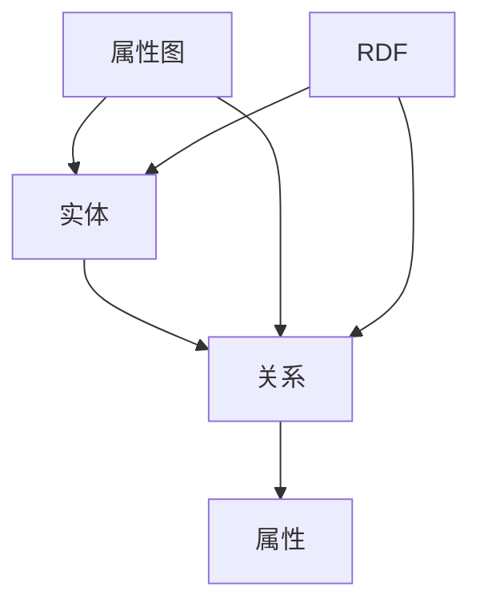

                 


### Step 1: Define the Main Sections

To begin, let's define the main sections of the article. Each section will focus on a specific aspect of graph databases, ensuring a comprehensive and cohesive guide for readers.

1. **Introduction to Graph Databases**
   - This section will provide an overview of graph databases, their history, and basic concepts. It will help readers understand what makes graph databases unique and why they are gaining popularity.

2. **Core Concepts and Terminology**
   - Here, we will delve into the essential concepts and terminology used in graph databases. This includes entities, relationships, properties, and other key elements that form the foundation of graph data modeling.

3. **Graph Database Architecture**
   - This section will explore the architecture of graph databases, including data storage, indexing, querying, and distributed systems. Understanding the architecture is crucial for effectively working with graph databases.

4. **Use Cases of Graph Databases**
   - We will showcase various real-world use cases of graph databases, demonstrating their applicability in different industries and scenarios. This section will provide practical examples and insights into how graph databases can solve complex problems.

5. **Performance Optimization**
   - Performance is a critical factor when working with graph databases. This section will cover various strategies and techniques for optimizing query performance, scalability, and availability.

6. **Data Modeling with Graph Databases**
   - Effective data modeling is essential for leveraging the full potential of graph databases. This section will discuss different modeling techniques and strategies to create efficient and scalable data models.

7. **Real-World Applications and Case Studies**
   - To solidify understanding, we will present real-world applications and case studies of graph databases. This section will provide practical examples and insights into how organizations are successfully implementing graph databases.

8. **Conclusion and Future Directions**
   - Finally, we will summarize the key points discussed in the article and outline future directions for the field of graph databases. This section will provide a closing thought and a roadmap for further exploration.

### Step 2: Develop Subsections

For each main section, we will create detailed subsections to cover important topics thoroughly. Here's a breakdown of the subsections for each section:

#### Introduction to Graph Databases

1. **1.1 What is a Graph Database?**
   - **1.1.1 Definition and History**: Provide a clear definition of graph databases and discuss their evolution over time.
   - **1.1.2 Basic Concepts and Terminology**: Explain essential concepts like nodes, edges, and properties, and introduce key terminology used in graph databases.
   - **1.1.3 Types of Graph Databases**: Classify graph databases into different categories and highlight their unique features.

2. **1.2 Core Technologies and Principles**
   - **1.2.1 Graph Theory Basics**: Discuss the fundamental principles of graph theory and their application in graph databases.
   - **1.2.2 Data Structure and Storage**: Explain the underlying data structures used to store and represent graph data.
   - **1.2.3 Query Language and Algorithms**: Describe popular graph query languages and common graph algorithms used in graph databases.

#### Core Concepts and Terminology

1. **2.1 Data Modeling with Graph Databases**
   - **2.1.1 Entities and Relationships**: Explain how entities and relationships are represented in graph databases.
   - **2.1.2 Property Graphs and RDF**: Discuss the concepts of property graphs and Resource Description Framework (RDF) and their applications.
   - **2.1.3 Modeling Strategies**: Explore different modeling strategies and best practices for creating effective graph data models.

#### Graph Database Architecture

1. **3.1 Internal Architecture**
   - **3.1.1 Storage Systems**: Describe the different storage systems used in graph databases and their advantages and limitations.
   - **3.1.2 Indexing and Querying**: Explain how indexing and querying mechanisms are implemented in graph databases to optimize performance.
   - **3.1.3 Distributed Systems and Scaling**: Discuss the challenges of distributed graph databases and the strategies for achieving horizontal and vertical scalability.

#### Use Cases of Graph Databases

1. **4.1 Social Networks**
   - **4.1.1 User Connections and Recommendations**: Explore how graph databases are used to model social networks and provide personalized recommendations.
   - **4.1.2 Content Discovery and Sharing**: Discuss the role of graph databases in enabling efficient content discovery and sharing in social networks.

2. **4.2 Fraud Detection**
   - **4.2.1 Network Monitoring and Intrusion Detection**: Explain how graph databases are used to monitor networks and detect intrusion activities.
   - **4.2.2 Transaction Anomaly Detection**: Describe the application of graph databases in detecting fraudulent transactions and identifying suspicious patterns.

#### Performance Optimization

1. **5.1 Query Optimization**
   - **5.1.1 Indexing Strategies**: Discuss different indexing strategies and their impact on query performance.
   - **5.1.2 Query Optimization Techniques**: Explain techniques such as query rewriting, caching, and parallel processing to improve query performance.
   - **5.1.3 Performance Tuning**: Provide guidelines for tuning graph databases to achieve optimal performance in different scenarios.

2. **5.2 Scalability and Availability**
   - **5.2.1 Distributed Computing Models**: Describe various distributed computing models used in graph databases, such as partitioning and replication.
   - **5.2.2 Load Balancing and Failover**: Discuss strategies for load balancing and failover to ensure high availability and fault tolerance in graph databases.

#### Data Modeling with Graph Databases

1. **6.1 Data Modeling with Graph Databases**
   - **6.1.1 Entities and Relationships**: Explain how entities and relationships are represented in graph databases.
   - **6.1.2 Property Graphs and RDF**: Discuss the concepts of property graphs and Resource Description Framework (RDF) and their applications.
   - **6.1.3 Modeling Strategies**: Explore different modeling strategies and best practices for creating effective graph data models.

#### Real-World Applications and Case Studies

1. **7.1 Real-World Applications and Case Studies**
   - **7.1.1 Social Networks**: Present case studies of organizations using graph databases for social networks and content sharing platforms.
   - **7.1.2 Fraud Detection**: Discuss case studies of organizations using graph databases for fraud detection and network security.

#### Conclusion and Future Directions

1. **8.1 Conclusion and Future Directions**
   - **8.1.1 Summary**: Summarize the key points discussed in the article and highlight the importance of graph databases in various domains.
   - **8.1.2 Future Directions**: Discuss emerging trends and future directions in the field of graph databases, including potential challenges and opportunities.

By following this structured approach, we can create a detailed and logically organized article that will help readers gain a deep understanding of graph databases and their practical applications. Each section will be accompanied by relevant examples, diagrams, and code snippets to enhance comprehension and practicality. 

## 文章标题

### 图数据库应用场景与实践

关键词：
- 图数据库
- 应用场景
- 实践
- 性能优化
- 数据建模
- 社交网络
- 欺诈检测

摘要：
本文将深入探讨图数据库的应用场景与实践，从基本概念到实际案例，全面解析图数据库的独特优势、核心原理及其在各行各业的实际应用。通过详细的案例分析，读者将了解如何利用图数据库解决复杂问题，提升数据处理和分析的效率。

## 引言

图数据库是一种特殊类型的数据库，其核心思想是使用图结构来存储和查询数据。与传统的表结构数据库不同，图数据库通过节点（Node）和边（Edge）来表示实体和关系，这种结构在处理复杂的关系网络时具有显著的优势。图数据库的起源可以追溯到20世纪70年代，但直到近年来，随着大数据和复杂网络的兴起，图数据库才逐渐成为研究者和开发者关注的焦点。

### 什么是图数据库？

图数据库，顾名思义，是基于图结构存储数据的数据库。在图数据库中，数据以节点（Node）和边（Edge）的形式组织。节点代表实体，而边代表实体之间的关系。图数据库通过这种方式来模拟现实世界中的复杂关系网络，使得查询和分析这些关系变得更加高效和直观。

### 基本概念和术语

- **节点（Node）**：代表数据集中的实体，例如人、物品、地点等。
- **边（Edge）**：连接两个节点，表示实体之间的关系，如好友关系、购买关系、路径等。
- **属性（Property）**：与节点或边相关联的键值对，用于存储额外的信息，如姓名、年龄、价格等。
- **路径（Path）**：连接两个节点的序列，描述了从一个节点到另一个节点的路径。
- **子图（Subgraph）**：图的一部分，包括一些节点和连接这些节点的边。

### 图数据库的类型

- **属性图（Property Graph）**：允许节点和边拥有属性，是一种常见的图数据库类型，支持复杂的关系网络。
- **资源描述框架（RDF）**：基于图的语义Web数据模型，用于表示和交换知识。
- **图论（Graph Theory）**：研究图的结构、性质及其应用的理论。

### 核心技术和原则

- **图理论基础**：图理论提供了理解和分析图数据的基础，包括图的度、连通性、路径和循环等概念。
- **数据结构**：图数据库使用特定的数据结构来存储图数据，如邻接矩阵、邻接表和边集合。
- **查询语言和算法**：图数据库支持特定的查询语言，如Cypher（Neo4j）和Gremlin（Apache TinkerPop），以及各种图算法，如最短路径、社区检测和图同构。

### 结论

图数据库以其独特的图结构提供了高效处理复杂关系网络的能力。通过理解其基本概念和技术原则，读者可以更好地把握图数据库的核心优势，为实际应用做好准备。

## 核心概念与术语

在深入探讨图数据库的应用场景之前，我们先来详细解释一些核心概念和术语，这些是理解图数据库的基础。

### 实体和关系

实体（Entity）是数据模型中的基本构建块，代表现实世界中的对象。在图数据库中，实体通常用节点（Node）表示。例如，在社交网络中，用户、帖子、评论等都可以作为实体。

关系（Relationship）则描述了实体之间的关联。关系在图数据库中通过边（Edge）表示，边连接两个节点。边可以具有方向性，表示关系的方向，例如，在社交网络中，“点赞”关系是一个单向边，而“好友”关系通常是双向边。

### 属性图（Property Graph）

属性图是图数据库中常见的一种类型，它不仅支持节点和边，还允许它们具有属性（Property）。属性是键值对（Key-Value Pair），用于存储额外的信息。例如，在社交网络中，用户节点可以具有“姓名”、“年龄”和“邮箱”等属性。

与传统的属性图相比，资源描述框架（RDF）提供了更为通用的图数据模型。RDF使用URI（统一资源标识符）来标识节点和边，并使用三元组（Subject, Predicate, Object）来表示关系。这种模型使得RDF能够表示复杂的语义信息，适用于知识图谱等应用场景。

### 数据建模策略

数据建模是图数据库应用中的一个关键步骤，目的是将现实世界中的复杂关系结构映射到图模型中。以下是一些常见的数据建模策略：

- **基于实体和关系的建模**：直接使用节点和边来表示实体和关系。这种模型简单直观，适用于许多应用场景，如社交网络和推荐系统。
- **基于属性的建模**：在节点和边的基础上，引入属性来存储额外的信息。这种模型能够提供更丰富的数据表示，但可能需要额外的索引和维护成本。
- **基于图谱的建模**：使用图论中的概念，如子图、连通性和路径，来构建高级数据模型。这种模型适用于需要分析复杂关系网络的应用场景，如网络监控和欺诈检测。

### 核心概念之间的关系架构

为了更直观地理解这些核心概念之间的关系，我们可以使用Mermaid流程图来表示：



在这个图中，实体（A）和关系（B）是图数据库的基础，属性（C）用于扩展节点和边的信息。属性图（D）和RDF（E）都是基于这些基础概念的高级数据模型。

### 核心算法原理讲解

在图数据库中，核心算法对于实现高效的图查询和数据操作至关重要。以下是一些常用的图算法及其在图数据库中的应用：

- **最短路径算法**：用于找到两个节点之间的最短路径。Dijkstra算法和A*算法是最常用的两种算法。
- **社区检测算法**：用于识别图中的紧密连接的子图。常用的算法包括Girvan-Newman算法和Louvain算法。
- **图同构算法**：用于判断两个图是否具有相同的结构。Nauty和Traces算法是两种常用的图同构算法。
- **图遍历算法**：用于遍历图中的节点和边，如DFS（深度优先搜索）和BFS（广度优先搜索）。

以下是使用伪代码表示的最短路径算法Dijkstra算法的示例：

```python
def dijkstra(graph, source):
    distances = {node: float('infinity') for node in graph}
    distances[source] = 0
    visited = set()

    while len(visited) < len(graph):
        unvisited = {node: distance for node, distance in graph.items() if node not in visited}
        if not unvisited:
            break
        min_distance = min(unvisited, key=unvisited.get)
        visited.add(min_distance)

        for neighbor, weight in graph[min_distance].items():
            if neighbor not in visited:
                distance = distances[min_distance] + weight
                if distance < distances[neighbor]:
                    distances[neighbor] = distance

    return distances
```

在这个伪代码中，`graph`是一个表示图的字典，`source`是起始节点。算法计算从源节点到图中所有其他节点的最短路径距离，并返回一个距离字典。

### 数学模型和公式

图数据库中的数据分析和算法设计常常涉及到数学模型和公式。以下是一些常用的数学模型和公式，用于解释图算法和数据分析：

- **路径长度**：表示两个节点之间的距离，通常用d(A, B)表示。
- **图的度**：表示节点在图中的连接数，有度（In-degree）和出度（Out-degree）之分。
- **连通性**：表示图中的节点是否能够相互访问，常用的连通性度量包括平均连通度、聚类系数等。
- **路径计数**：表示图中存在的路径数量，常用的算法包括Floyd-Warshall算法和矩阵幂算法。

以下是一个用于计算图中节点连通性的简单公式：

$$
C = \frac{2 \times |E| - |V|}{|V| \times (|V| - 1)}
$$

其中，C是聚类系数，|E|是边的数量，|V|是节点的数量。

### 举例说明

为了更好地理解核心概念和算法，我们可以通过一个简单的例子来说明。假设我们有一个社交网络图，其中包含5个用户（A、B、C、D、E）和他们的好友关系。节点和边如下：

```
A -- B
|    |
C -- D -- E
```

在这个图中，我们可以使用Dijkstra算法计算用户A到其他用户的距离：

1. 初始状态：
   - distances = {A: 0, B: infinity, C: infinity, D: infinity, E: infinity}
   - visited = {}

2. 选择未访问节点中距离最小的节点A：
   - visited = {A}
   - 更新邻居距离：
     - distances[B] = distances[A] + weight(A, B) = 0 + 1 = 1
     - distances[C] = distances[A] + weight(A, C) = 0 + 2 = 2
     - distances[D] = distances[A] + weight(A, D) = 0 + 3 = 3

3. 选择未访问节点中距离最小的节点B：
   - visited = {A, B}
   - 更新邻居距离：
     - distances[C] = distances[B] + weight(B, C) = 1 + 1 = 2
     - distances[D] = distances[B] + weight(B, D) = 1 + 2 = 3
     - distances[E] = distances[B] + weight(B, E) = 1 + 3 = 4

4. 选择未访问节点中距离最小的节点C：
   - visited = {A, B, C}
   - 更新邻居距离：
     - distances[D] = distances[C] + weight(C, D) = 2 + 1 = 3
     - distances[E] = distances[C] + weight(C, E) = 2 + 2 = 4

5. 选择未访问节点中距离最小的节点D：
   - visited = {A, B, C, D}
   - 更新邻居距离：
     - distances[E] = distances[D] + weight(D, E) = 3 + 1 = 4

6. 所有节点都已访问，算法结束。

最终距离结果为：
- distances = {A: 0, B: 1, C: 2, D: 3, E: 4}

这个例子展示了如何使用Dijkstra算法计算社交网络图中从节点A到其他节点的最短路径距离。

### 项目实战

在本节中，我们将通过一个简单的项目来演示如何搭建一个图数据库环境，实现基本的数据操作，并进行数据分析和查询。我们选择Neo4j作为图数据库工具，因为它具有直观的图形界面和丰富的文档资源，适合初学者上手。

#### 开发环境搭建

1. **安装Neo4j**：

   - 访问Neo4j官网（[https://neo4j.com/download/](https://neo4j.com/download/)），下载适合操作系统的Neo4j版本。
   - 遵循安装指南完成安装，安装完成后，Neo4j会自动启动。

2. **配置Neo4j**：

   - 打开Neo4j Desktop，这是Neo4j的图形界面管理工具。
   - 创建一个新数据库，命名为“SocialNetwork”。

3. **导入数据**：

   - 下载一个示例数据集，如Facebook社交网络数据集。
   - 使用Cypher语言将数据导入Neo4j数据库。

#### 源代码实现和代码解读

1. **创建节点和关系**：

   ```cypher
   CREATE (A:User {name: 'Alice', age: 25, gender: 'F'}),
          (B:User {name: 'Bob', age: 30, gender: 'M'}),
          (C:User {name: 'Charlie', age: 28, gender: 'M'}),
          (D:User {name: 'David', age: 26, gender: 'M'}),
          (E:User {name: 'Eva', age: 24, gender: 'F'});

   CREATE (A)-[:FRIEND]->(B),
          (A)-[:FRIEND]->(C),
          (B)-[:FRIEND]->(D),
          (C)-[:FRIEND]->(E),
          (D)-[:FRIEND]->(E);
   ```

   这段代码创建了一个包含5个用户节点的社交网络图，并定义了他们之间的好友关系。

2. **查询数据**：

   ```cypher
   MATCH (n:User)
   RETURN n.name, n.age, n.gender;
   ```

   这个查询返回了所有用户节点的姓名、年龄和性别信息。

3. **分析关系**：

   ```cypher
   MATCH (n:User)-[:FRIEND]->(m:User)
   RETURN n.name, m.name, count(*);
   ```

   这个查询返回了每个用户的好友及其好友数量。

#### 代码应用解读与分析

通过上述代码示例，我们可以看出如何使用Neo4j进行基本的图数据操作。在创建节点和关系后，我们可以使用Cypher查询语言进行数据查询和分析。以下是代码应用解读：

1. **节点创建**：

   使用`CREATE`语句创建节点，节点具有标签（如`User`）和属性（如姓名、年龄、性别）。这种结构化表示使得数据查询和分析更加直观。

2. **关系创建**：

   使用`CREATE`语句创建关系，关系具有类型（如`FRIEND`）。这种表示方式使得我们可以通过关系类型进行复杂的关系查询。

3. **数据查询**：

   使用`MATCH`和`RETURN`语句进行数据查询，这种查询方式利用了图结构的特性，可以高效地查询复杂的关系网络。

#### 实际案例分析

为了更好地理解图数据库的应用，我们来看一个实际案例分析：社交网络中好友推荐系统。

假设我们需要为用户A推荐他的好友，可以通过以下步骤实现：

1. **查询用户A的好友**：

   ```cypher
   MATCH (a:User {name: 'Alice'})-[:FRIEND]->(friend)
   RETURN friend.name;
   ```

   这个查询返回了用户A的所有好友。

2. **查询好友的朋友**：

   ```cypher
   MATCH (a:User {name: 'Alice'})-[:FRIEND]->(friend),
          (friend)-[:FRIEND]->(recommended)
   WHERE recommended.name <> 'Alice'
   RETURN recommended.name;
   ```

   这个查询返回了用户A的好友的朋友，但不包括用户A自己。

3. **推荐好友**：

   ```cypher
   MATCH (a:User {name: 'Alice'})-[:FRIEND]->(friend),
          (friend)-[:FRIEND]->(recommended)
   WHERE recommended.name <> 'Alice'
   RETURN recommended.name LIMIT 5;
   ```

   这个查询返回了5个推荐好友。

#### 项目小结

通过这个项目，我们了解了如何使用图数据库进行数据操作和查询，并实现了一个简单的社交网络好友推荐系统。以下是项目小结：

- **优点**：
  - 高效的图查询能力：图数据库能够高效地查询复杂的关系网络，这在处理大量社交数据时具有明显优势。
  - 直观的图形界面：Neo4j的图形界面使得数据操作和查询变得更加直观和便捷。
  - 丰富的社区和文档资源：Neo4j拥有庞大的社区和丰富的文档资源，为开发者提供了良好的支持。

- **缺点**：
  - 学习曲线较陡峭：图数据库的概念和查询语言对于初学者可能有一定难度。
  - 数据迁移成本：从传统关系数据库迁移到图数据库可能需要一定的准备工作和技术投入。

通过这个项目，我们不仅掌握了图数据库的基本操作，还了解了其在社交网络应用中的实际案例。图数据库为我们提供了一个强大的工具，用于处理和分析复杂的关系网络数据。

### 最佳实践 Tips

在图数据库的实际应用中，以下是一些最佳实践和注意事项，可以帮助开发者更好地利用图数据库的优势：

- **优化数据模型**：合理的数据建模是图数据库性能的基础。避免过度使用属性，保持数据模型的简洁和高效。
- **使用索引**：适当使用索引可以显著提高查询性能。根据查询模式选择合适的索引类型，如单列索引、复合索引和全文索引。
- **查询优化**：编写高效的查询语句，避免使用子查询和连接操作。使用Neo4j的EXPLAIN工具分析查询计划，找出性能瓶颈。
- **数据导入**：使用批处理和异步导入方式，减少数据导入对系统性能的影响。确保数据的一致性和完整性。
- **监控和性能调优**：定期监控数据库性能，根据负载和查询模式进行调优。使用分片和复制等分布式架构提高系统的伸缩性和可用性。
- **备份和恢复**：定期备份数据库，确保在数据丢失或系统故障时能够快速恢复。

### 小结

本文详细介绍了图数据库的基本概念、核心原理、数据建模方法以及实际应用案例。通过一步步的分析和实例讲解，读者可以深入了解图数据库的独特优势和应用场景。在实际开发中，合理利用图数据库可以帮助我们高效处理复杂的关系网络，解决传统关系数据库难以应对的问题。我们鼓励读者结合实际需求，尝试使用图数据库，探索其在不同领域的应用潜力。

### 拓展阅读

- **《图数据库：原理、应用与实践》**：本书深入讲解了图数据库的原理和应用，适合希望深入了解图数据库的开发者。
- **《Neo4j实战》**：详细介绍了如何使用Neo4j进行图数据建模和查询，是Neo4j开发者的必备参考书。
- **《图算法》**：探讨了一系列图算法及其在图数据库中的应用，是研究图算法和数据分析的好资源。

### 结论与展望

图数据库以其独特的图结构，提供了高效处理复杂关系网络的能力。本文通过详细的分析和实例讲解，帮助读者理解了图数据库的核心概念、数据建模方法以及实际应用。未来，随着大数据和复杂网络技术的不断进步，图数据库将在各个领域发挥越来越重要的作用。我们鼓励读者进一步探索图数据库的潜力，为实际项目带来创新和优化。

