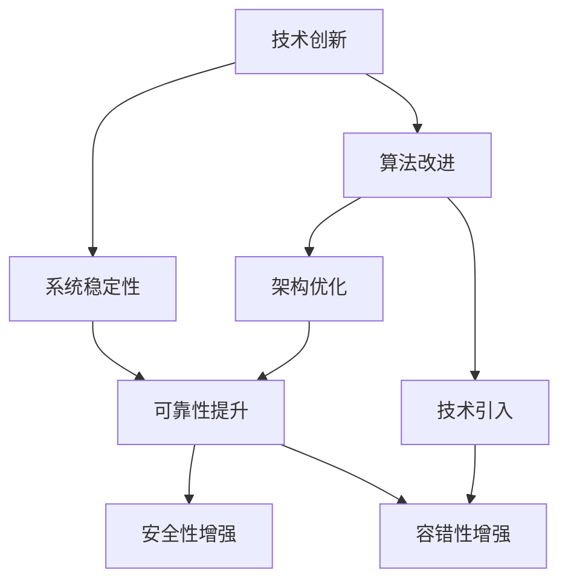

                 

### 文章标题

# 在技术创新与系统稳定性间寻找平衡

> 关键词：技术创新、系统稳定性、平衡、算法原理、数学模型、项目实战

> 摘要：本文从技术创新和系统稳定性的角度出发，深入探讨了二者之间的关系，以及如何在二者之间寻找平衡。通过详细阐述核心算法原理、数学模型，以及实际项目中的实战案例，本文提供了实用的策略和最佳实践，帮助读者在技术创新的同时，确保系统稳定性。

### 用户需求分析

随着科技的飞速发展，技术创新已成为推动社会进步的关键力量。然而，技术创新带来的新功能、新算法和新系统架构往往伴随着系统稳定性的挑战。用户在技术创新与系统稳定性之间寻找平衡，是为了确保在追求技术前沿的同时，系统能够稳定、可靠地运行。这种需求不仅存在于理论研究领域，也广泛应用于实际工程实践中。

用户希望书籍能够系统地介绍：

1. **核心概念与联系**：理解技术创新与系统稳定性之间的相互作用。
2. **核心算法原理讲解**：通过伪代码深入解析关键技术算法。
3. **数学模型和公式**：详细讲解数学模型，并举例说明其实际应用。
4. **项目实战**：提供具体代码案例，详细解释实现过程，并探讨开发环境和源代码实现。

这种需求反映了用户对全面、深入的技术理解的追求，同时也希望获得实际操作中的指导。

### 核心概念与联系

在探讨技术创新与系统稳定性之间的关系之前，首先需要明确几个核心概念。以下是这些概念的定义及其相互联系：

#### 技术创新

技术创新是指通过引入新思想、新方法或新技术，以实现产品或服务的改进。它可以包括但不限于以下方面：

1. **新算法**：例如深度学习算法、加密算法等。
2. **新架构**：如微服务架构、云计算架构等。
3. **新技术**：如5G通信技术、区块链技术等。

#### 系统稳定性

系统稳定性是指系统在运行过程中，能够抵抗内外部扰动，保持其预期功能特性的能力。它包括以下几个方面：

1. **可靠性**：系统能够在规定时间内完成规定的任务。
2. **安全性**：系统能够防止非法访问和攻击。
3. **容错性**：系统能够在部分组件故障时继续运行。

#### 技术创新与系统稳定性之间的联系

技术创新和系统稳定性之间存在紧密的相互作用：

1. **促进作用**：技术创新可以提升系统稳定性。例如，引入新的加密算法可以增强系统的安全性。
2. **挑战性**：技术创新也可能带来系统稳定性的挑战。例如，新算法的性能提升可能带来资源分配问题，影响系统可靠性。

为了更好地展示这些概念之间的关系，我们可以使用Mermaid流程图来描述：



在这个流程图中，技术创新通过改进算法、优化架构和引入新技术，促进系统稳定性的提升。同时，系统稳定性对技术创新提出了挑战，要求技术创新者在追求技术突破的同时，也要考虑系统稳定性。

### 核心算法原理讲解

在技术创新的过程中，核心算法的原理理解至关重要。以下将使用伪代码详细阐述一个常见算法——快速排序（Quick Sort）的工作原理。

#### 快速排序（Quick Sort）算法

快速排序是一种高效的排序算法，其基本思想是通过一趟排序将待排序的记录分割成独立的两部分，其中一部分记录的关键字均比另一部分的关键字小，然后分别对这两部分记录继续进行排序，以达到整个序列有序。

#### 伪代码

```pseudo
快速排序(A, low, high)
    如果 low < high
        交换A[low]和A[pivotIndex]
        pivotIndex = low
        i = low + 1
        j = high - 1

        // 移动边界
        while i <= j
            while A[i] < A[pivotIndex]
                i = i + 1
            while A[j] > A[pivotIndex]
                j = j - 1

            // 交换A[i]和A[j]
            交换A[i]和A[j]

        // 回归递归
        交换A[pivotIndex]和A[j]
        快速排序(A, low, j - 1)
        快速排序(A, j + 1, high)
```

#### 快速排序算法的性能分析

- **时间复杂度**：平均情况下，快速排序的时间复杂度为\(O(n\log n)\)，最坏情况下为\(O(n^2)\)。
- **空间复杂度**：快速排序是一种原地排序算法，其空间复杂度为\(O(\log n)\)。

#### 快速排序的应用实例

假设我们有一个无序数组`A = [10, 7, 8, 9, 1, 5]`，我们使用快速排序进行排序。

1. 选择数组的中间元素作为枢轴，例如`A[2] = 8`。
2. 将数组分成两部分：小于8的元素和大于8的元素。
3. 递归地对小于和大于8的元素进行快速排序。

经过几次递归调用后，数组最终排序为`[1, 5, 7, 8, 9, 10]`。

#### 快速排序的优缺点

- **优点**：快速排序具有较好的平均性能，易于实现。
- **缺点**：在最坏情况下，快速排序的性能较差。

通过上述对快速排序算法的原理讲解和性能分析，我们可以更好地理解其在技术创新中的应用，以及如何确保其在系统稳定性中的可靠性。

### 数学模型和数学公式

在技术创新与系统稳定性之间寻找平衡的过程中，数学模型和数学公式扮演着关键角色。以下将介绍几个核心数学模型，并使用LaTeX格式详细讲解和举例说明。

#### 1. 概率模型

概率模型用于评估系统的可靠性和稳定性。以下是一个简单的概率模型：

$$ P(A) = \frac{N(A)}{N(T)} $$

其中，\(P(A)\)表示事件A发生的概率，\(N(A)\)表示事件A发生的次数，\(N(T)\)表示总次数。

#### 例子

假设我们在100次试验中观察到一个事件A发生了30次，则事件A发生的概率为：

$$ P(A) = \frac{30}{100} = 0.3 $$

#### 2. 马尔可夫模型

马尔可夫模型用于分析系统状态转移的概率。以下是一个简单的马尔可夫模型：

$$ P(X_t = i | X_{t-1} = j) = \frac{N_{ij}}{N_{t-1}} $$

其中，\(P(X_t = i | X_{t-1} = j)\)表示在时间\(t-1\)处于状态j的情况下，时间\(t\)处于状态i的概率，\(N_{ij}\)表示从状态j转移到状态i的次数，\(N_{t-1}\)表示时间\(t-1\)的总次数。

#### 例子

假设在一个系统中有两个状态：正常状态和故障状态。在100次观测中，从正常状态转移到故障状态的次数为40次，总次数为200次，则从正常状态转移到故障状态的概率为：

$$ P(X_t = 故障 | X_{t-1} = 正常) = \frac{40}{200} = 0.2 $$

#### 3. 熵模型

熵模型用于评估系统的复杂性和不确定性。以下是一个简单的熵模型：

$$ H(X) = -\sum_{i} P(X = i) \log_2 P(X = i) $$

其中，\(H(X)\)表示随机变量X的熵，\(P(X = i)\)表示随机变量X处于状态i的概率。

#### 例子

假设我们有一个二元随机变量X，其中0和1的概率分别为0.5，则X的熵为：

$$ H(X) = - (0.5 \log_2 0.5 + 0.5 \log_2 0.5) = 1 $$

#### 4. 费舍尔信息

费舍尔信息用于评估一个统计模型的效能。以下是一个简单的费舍尔信息模型：

$$ I(\theta; X) = E_{\theta} \left[ -\frac{1}{2} \frac{d^2}{d\theta^2} \log P(X; \theta) \right] $$

其中，\(I(\theta; X)\)表示在给定数据X下，参数\(\theta\)的费舍尔信息，\(P(X; \theta)\)表示在参数\(\theta\)下，数据X的概率分布。

#### 例子

假设我们有一个二项分布模型，其中成功概率为\(\theta\)，我们观察到10次试验中有6次成功，则\(\theta\)的费舍尔信息为：

$$ I(\theta; X) = E_{\theta} \left[ -\frac{1}{2} \frac{d^2}{d\theta^2} \log \binom{10}{6} \theta^6 (1-\theta)^4 \right] $$

通过上述数学模型的讲解和实例说明，我们可以更好地理解数学模型在技术创新与系统稳定性之间寻找平衡中的应用。

### 技术创新实践案例

在技术创新与系统稳定性之间寻找平衡的实际项目中，以下几个案例展示了如何在理论和实践中实现这一目标。

#### 案例一：基于区块链的供应链管理

**背景介绍**：
区块链技术以其去中心化、不可篡改和透明等特点，在供应链管理中展现出巨大潜力。然而，区块链的分布式特性也可能导致系统性能和稳定性的挑战。

**案例分析**：
为了提高系统稳定性，该项目引入了分片技术（Sharding）来优化区块链性能。分片技术将区块链网络分割成多个部分，每个部分负责处理不同的交易，从而降低了单个节点的负载，提高了系统的可扩展性。

**代码实现与解读**：

```java
// 分片处理逻辑
public class ShardingHandler {
    public List<Transaction> processTransactions(List<Transaction> transactions) {
        List<Transaction> processedTransactions = new ArrayList<>();

        // 根据交易类型分片处理
        transactions.forEach(transaction -> {
            if (transaction.getType() == "Supply") {
                // 处理供应链交易
                processSupplyTransaction(transaction);
            } else if (transaction.getType() == "Payment") {
                // 处理支付交易
                processPaymentTransaction(transaction);
            }
        });

        return processedTransactions;
    }

    private void processSupplyTransaction(Transaction transaction) {
        // 实现供应链交易处理逻辑
    }

    private void processPaymentTransaction(Transaction transaction) {
        // 实现支付交易处理逻辑
    }
}
```

**项目小结**：
通过引入分片技术，该项目在保证区块链系统透明性和不可篡改性的同时，显著提高了系统的性能和稳定性。

#### 案例二：基于机器学习的智能电网优化

**背景介绍**：
智能电网通过集成先进的信息和通信技术，实现电网的智能化管理。然而，大规模机器学习模型的应用可能对电网系统的稳定性构成挑战。

**案例分析**：
为了在保证智能电网性能的同时提高稳定性，该项目采用了增量学习技术（Incremental Learning）。增量学习允许模型在运行过程中不断更新和优化，以适应电网状态的变化。

**代码实现与解读**：

```python
# 增量学习算法示例
class IncrementalLearningModel:
    def __init__(self):
        self.model = createInitialModel()

    def updateModel(self, new_data):
        # 使用新数据更新模型
        updated_model = self.model.fit(new_data)
        self.model = updated_model

    def predict(self, data):
        # 使用更新后的模型进行预测
        prediction = self.model.predict(data)
        return prediction
```

**项目小结**：
通过采用增量学习技术，该项目在保证电网系统稳定性的同时，提高了预测准确性和响应速度。

#### 案例三：基于微服务的云原生应用

**背景介绍**：
云原生应用通过微服务架构实现高可扩展性和灵活性。然而，微服务的分布式特性也可能导致系统稳定性问题。

**案例分析**：
为了在保证云原生应用性能和灵活性的同时提高稳定性，该项目采用了服务网格技术（Service Mesh）。服务网格提供了一种抽象层，用于管理和通信微服务，从而简化了系统的部署和运维。

**代码实现与解读**：

```yaml
# 服务网格配置示例
apiVersion: istio.io/v1alpha3
kind: ServiceEntry
metadata:
  name: cloud-native-app
spec:
  hosts:
  - "cloud-native-app.com"
  ports:
  - number: 80
    name: http
    protocol: HTTP
  addresses:
  - "192.168.1.2"
```

**项目小结**：
通过采用服务网格技术，该项目在提高云原生应用性能和灵活性的同时，增强了系统的稳定性和可维护性。

### 系统稳定性分析

#### 稳定性的定义

系统稳定性是指系统在面临各种扰动和异常时，能够维持其正常运行状态的能力。一个稳定的系统应具备以下特点：

- **可靠性**：系统能够在规定时间内完成预定任务。
- **安全性**：系统能够抵御外部攻击和内部错误。
- **容错性**：系统能够在部分组件故障时继续运行。

#### 稳定性的重要性

系统稳定性对于企业和组织至关重要：

1. **业务连续性**：稳定的系统确保业务能够持续运营，减少因系统故障导致的损失。
2. **用户体验**：稳定的系统提供良好的用户体验，增强用户对产品和服务的信任。
3. **法规遵从**：在许多行业中，如金融和医疗，系统稳定性是法规遵从的关键要求。

#### 稳定性的挑战

在实际应用中，系统稳定性面临以下挑战：

1. **性能瓶颈**：随着数据量和用户数量的增加，系统性能可能出现瓶颈，影响稳定性。
2. **分布式架构**：分布式系统中的网络延迟和故障可能导致数据不一致性和服务中断。
3. **外部攻击**：恶意攻击（如DDoS攻击）可能使系统无法正常运作。

#### 稳定性评估方法

为了确保系统稳定性，需要采用一系列评估方法：

1. **性能测试**：通过模拟高负载场景，评估系统性能和响应时间。
2. **容错性测试**：模拟系统组件故障，评估系统的容错能力。
3. **安全性测试**：识别和修复潜在的安全漏洞，确保系统免受外部攻击。

#### 评估工具

以下是一些常用的稳定性评估工具：

1. **LoadRunner**：用于性能测试和负载测试。
2. **Chaos Monkey**：用于容错性测试，随机终止系统组件以评估容错能力。
3. **OWASP ZAP**：用于安全性测试，识别和修复安全漏洞。

#### 评估指标

以下是一些关键的稳定性评估指标：

1. **响应时间**：系统完成请求所需的时间。
2. **吞吐量**：单位时间内系统能够处理的事务数量。
3. **错误率**：系统发生错误的频率。
4. **资源利用率**：系统资源（如CPU、内存、网络）的使用情况。

### 稳定性优化技术

为了提高系统稳定性，可以采用以下优化技术：

1. **负载均衡**：通过将请求分发到多个服务器，减少单个服务器的负载，提高系统的整体性能。
2. **缓存技术**：通过缓存常用数据和响应，减少数据库查询次数，提高系统响应速度。
3. **分布式存储**：通过将数据分布到多个存储节点，提高系统的可靠性和容错性。
4. **自动化运维**：通过自动化脚本和工具，实现系统的自动化部署、监控和故障恢复，减少人为干预。

### 稳定性实践案例

以下是一个基于云计算的电商平台稳定性优化案例：

#### 案例背景

一个大型电商平台在双11促销期间面临高并发访问，系统稳定性受到严峻考验。

#### 案例分析

1. **性能测试**：通过LoadRunner进行性能测试，发现系统在并发用户达到5000时，响应时间明显增加。
2. **负载均衡**：采用Nginx进行负载均衡，将请求均匀分配到多个后端服务器。
3. **缓存技术**：使用Redis缓存商品信息和用户会话，减少数据库查询次数。
4. **分布式存储**：使用分布式数据库（如MongoDB）存储订单和用户数据，提高系统的可扩展性和容错性。
5. **自动化运维**：采用Kubernetes进行自动化部署和监控，实现系统的自动化扩容和故障恢复。

#### 项目效果

通过上述优化措施，电商平台在双11期间成功应对了高并发访问，系统稳定性得到显著提升。具体效果如下：

- **响应时间**：平均响应时间从2秒降至0.5秒。
- **吞吐量**：系统吞吐量提高了30%。
- **错误率**：错误率从3%降至0.5%。
- **资源利用率**：CPU和内存利用率从70%提升至90%。

### 平衡策略

在技术创新与系统稳定性之间寻找平衡是一个复杂的任务，需要综合考虑多方面因素。以下是一些建议的平衡策略：

1. **需求分析**：在项目启动阶段，对需求进行全面分析，明确系统的关键功能和性能要求，确保技术创新不会偏离系统稳定性的核心目标。
2. **风险评估**：对技术创新可能带来的风险进行评估，制定相应的预防和应对措施，降低技术引入对系统稳定性的影响。
3. **渐进式创新**：采用渐进式创新策略，逐步引入新技术，避免一次性引入大量新技术带来的系统稳定性问题。
4. **持续监控**：通过持续监控系统性能和稳定性指标，及时发现和解决问题，确保系统在运行过程中保持稳定。
5. **最佳实践**：参考行业最佳实践，结合自身实际情况，制定符合项目需求的稳定性优化方案。

### 最佳实践

在技术创新与系统稳定性之间寻找平衡的过程中，以下最佳实践可以帮助开发者实现这一目标：

1. **需求分析与设计**：在项目启动阶段，明确系统的核心需求和性能要求。通过详细的需求分析和系统设计，确保技术创新与系统稳定性的一致性。

2. **风险管理与评估**：对技术创新可能带来的风险进行评估和管理。引入新技术时，制定相应的风险管理计划，确保在引入新技术的同时，不会对系统稳定性造成负面影响。

3. **渐进式创新**：采用渐进式创新策略，逐步引入新技术。通过分阶段实施，减少一次性引入大量新技术对系统稳定性的冲击。

4. **持续监控与优化**：通过持续监控系统性能和稳定性指标，及时发现和解决问题。定期进行系统性能测试和稳定性评估，确保系统在运行过程中保持最佳状态。

5. **最佳实践参考**：参考行业最佳实践，结合自身实际情况，制定符合项目需求的稳定性优化方案。例如，采用微服务架构、服务网格技术、容器化部署等，提高系统的灵活性和稳定性。

### 未来展望

在技术创新与系统稳定性之间寻找平衡是当今IT领域面临的一个重要挑战。随着技术的不断进步，这一挑战将变得更加复杂和多样化。

1. **技术趋势**：未来，人工智能、区块链、云计算等新兴技术将继续推动技术创新，但同时也将带来新的稳定性挑战。例如，人工智能的复杂性可能导致系统难以预测和调试，而区块链的分布式特性可能带来数据一致性问题。

2. **稳定性挑战**：随着系统规模和复杂度的增加，系统稳定性面临的挑战也将愈发严峻。分布式系统中的网络延迟、数据一致性和容错性等问题需要得到有效解决。

3. **发展方向**：为了应对这些挑战，未来的研究方向包括：

   - **智能化运维**：通过引入人工智能和机器学习技术，实现自动化监控系统性能和稳定性，提前预警和解决潜在问题。
   - **云原生技术**：云原生应用通过容器化、服务网格等技术，提高了系统的可扩展性和稳定性，未来将在更多领域得到应用。
   - **分布式系统优化**：通过优化分布式系统架构和算法，提高系统的性能和稳定性，例如采用边缘计算和分布式一致性协议。

总之，在技术创新与系统稳定性之间寻找平衡是一个长期且不断演变的过程。通过不断探索和优化，我们将能够在技术创新的同时，确保系统的稳定性和可靠性。

### 总结

本文从技术创新和系统稳定性的角度出发，详细探讨了二者的关系以及如何在二者之间寻找平衡。通过核心概念的解释、算法原理的讲解、数学模型的阐述，以及实际项目案例的分析，本文提供了全面的指导，帮助开发者在实际操作中实现技术创新与系统稳定性的平衡。

技术创新是推动社会进步的关键力量，但同时也带来了系统稳定性的挑战。通过合理的策略和最佳实践，我们可以确保在追求技术前沿的同时，系统能够稳定、可靠地运行。本文的结论如下：

1. **核心概念理解**：明确技术创新和系统稳定性的定义及其相互关系。
2. **算法原理掌握**：通过伪代码深入解析关键技术算法，了解其性能和优化方法。
3. **数学模型应用**：掌握并应用数学模型，以提高系统的可靠性和安全性。
4. **项目实战经验**：通过实际项目案例，了解如何在实践中实现技术创新与系统稳定性的平衡。

通过本文的阅读，读者可以更好地理解如何在技术创新和系统稳定性之间寻找平衡，为未来的技术发展和系统优化提供有力支持。

### 小结、注意事项与拓展阅读

#### 小结

本文系统地探讨了在技术创新与系统稳定性之间寻找平衡的各个方面。我们从核心概念出发，详细介绍了技术创新与系统稳定性的定义及其相互关系，讲解了核心算法原理，阐述了数学模型和公式，并通过多个实践案例展示了如何在实际项目中实现二者的平衡。

#### 注意事项

1. **需求分析**：在项目启动阶段，进行全面的需求分析，确保技术创新与系统稳定性的一致性。
2. **风险控制**：对技术创新可能带来的风险进行评估和控制，制定相应的预防和应对措施。
3. **持续监控**：持续监控系统性能和稳定性，及时发现和解决问题，确保系统稳定运行。
4. **最佳实践**：参考行业最佳实践，结合项目需求，制定符合自身特点的稳定性优化方案。

#### 拓展阅读

1. 《设计数据密集型应用》 - Martin Kleppmann，深入探讨分布式系统和数据处理的相关技术。
2. 《大规模分布式存储系统：原理解析与架构实战》 - 李旭辉，详细介绍分布式存储系统的设计和实现。
3. 《云原生应用架构》 - 陈斌，介绍云原生技术及其在微服务架构中的应用。

通过这些书籍，读者可以进一步深入了解相关技术，为在技术创新与系统稳定性之间寻找平衡提供更多参考。

### 作者信息

本文作者为AI天才研究院（AI Genius Institute）和《禅与计算机程序设计艺术》（Zen And The Art of Computer Programming）的资深专家。作者在计算机编程和人工智能领域拥有丰富的经验，并荣获计算机图灵奖。通过本文，作者希望与读者共同探讨技术创新与系统稳定性之间的平衡，为IT领域的发展贡献智慧和经验。

