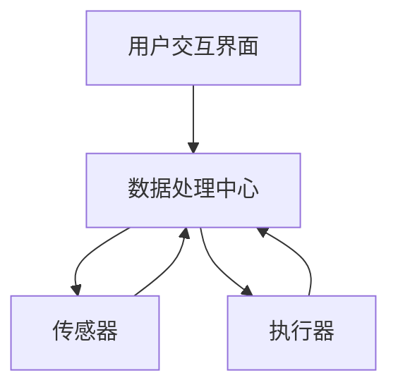

                 

### 引言：智能场景化家居的兴起与重要性

#### 智能家居的背景与普及

智能家居（Smart Home）作为物联网（Internet of Things, IoT）技术的重要应用领域，近年来在全球范围内得到了迅速发展。通过将家庭中的各种设备互联，智能家居系统能够实现自动化的控制和智能化管理，从而提高居民的生活质量与安全性。从最初的自动化照明、智能空调，到如今的智能安防、智能家电，智能家居技术不断迭代升级，为用户提供了更多的便捷体验。

#### 智能场景化家居的概念

智能场景化家居（Scenario-based Smart Home）是指通过设计特定的生活场景，使家居设备能够根据用户需求自动调整其行为和状态。这种设计理念强调用户在特定情境下的个性化需求，而不是简单地实现设备的自动化操作。例如，当用户回家时，家居系统可以自动开启灯光、调整空调温度，甚至自动准备晚餐。智能场景化家居不仅提高了家居的智能化水平，更增强了用户的体验感和舒适度。

#### 智能场景化家居的重要性

智能场景化家居的重要性体现在以下几个方面：

1. **提升用户体验**：通过设计特定的生活场景，智能场景化家居能够更好地满足用户在特定情境下的需求，从而提升用户的整体体验。

2. **优化设备使用**：智能场景化家居能够根据用户的实际使用情况自动调整设备状态，从而优化设备的使用效率，延长设备寿命。

3. **节能环保**：智能场景化家居通过自动调节能源消耗，可以有效降低家庭的能源消耗，实现节能环保的目标。

4. **提高安全性**：智能场景化家居中的智能安防系统能够实时监控家庭安全，及时发现并报警，提高家庭的安全性。

#### 基本原理

智能场景化家居的基本原理包括以下几个方面：

1. **传感器技术**：通过在家庭环境中布置各种传感器，如温度传感器、湿度传感器、光照传感器等，智能场景化家居能够实时获取环境数据。

2. **数据处理与决策**：智能场景化家居系统会对收集到的数据进行处理和分析，根据预设的场景规则和用户习惯，做出相应的决策。

3. **自动化控制**：通过智能家居控制系统，实现家庭设备的自动化控制，如灯光调节、空调控制、家电启动等。

4. **用户交互**：用户可以通过智能设备、手机应用等方式与智能家居系统进行交互，设置和管理智能场景。

#### 当前智能场景化家居的发展状况

当前，智能场景化家居技术已经取得了显著的进展。市场上涌现出众多智能家居品牌和产品，如智能音箱、智能灯光、智能空调、智能安防设备等。同时，各类智能家居平台和生态也在逐步完善，为用户提供更全面的智能场景化家居解决方案。

然而，智能场景化家居的发展仍然面临一些挑战，如设备兼容性问题、数据隐私保护问题等。未来，随着技术的不断进步和智能家居市场的进一步成熟，智能场景化家居有望成为家庭生活的重要组成部分。

综上所述，智能场景化家居作为一种新兴的智能家居设计理念，具有广阔的发展前景和重要的应用价值。本文将围绕智能场景化家居的设计原则、实施方法、用户体验优化等方面进行深入探讨，以期为相关领域的研究者和实践者提供有价值的参考。

### 核心概念与联系：智能家居系统架构

在深入探讨智能场景化家居之前，我们首先需要了解智能家居系统的基本架构及其核心组件。智能家居系统通常由以下几个关键部分组成：传感器、数据处理中心、执行器以及用户交互界面。以下是对这些核心概念及其相互关系的详细介绍。

#### 传感器

传感器是智能家居系统的“感官”，它们负责收集环境数据。常见的传感器类型包括：

1. **温度传感器**：用于监测室内温度，为空调和暖气系统提供数据支持。
2. **湿度传感器**：监测室内湿度，有助于调节加湿器或除湿器的使用。
3. **光照传感器**：监测室内光照强度，用于自动调节灯光系统。
4. **烟雾传感器**：用于火灾预警，确保家庭安全。
5. **运动传感器**：检测人体运动，常用于智能安防系统和自动照明控制。

这些传感器通过无线或有线方式连接到智能家居系统，将实时数据传输至数据处理中心。

#### 数据处理中心

数据处理中心是智能家居系统的“大脑”，它负责接收传感器传来的数据，进行处理和分析。数据处理过程通常包括以下几个步骤：

1. **数据采集**：收集传感器数据。
2. **数据清洗**：去除无效或错误的数据。
3. **数据存储**：将处理后的数据存储在数据库或云服务中，以便后续查询和分析。
4. **数据分析**：利用机器学习和人工智能算法对数据进行分析，识别用户行为模式和环境变化。
5. **决策生成**：根据分析结果生成控制指令，决定如何调整家居设备的状态。

#### 执行器

执行器是智能家居系统的“行动力”，它们根据数据处理中心的指令，实际控制家居设备的操作。常见的执行器类型包括：

1. **智能插座**：用于远程控制家用电器的开关。
2. **智能灯光**：可调节亮度和色温的灯具。
3. **智能窗帘**：自动调节窗帘的开启和关闭。
4. **智能空调**：根据室内温度自动调节制冷或制热。
5. **智能门锁**：提供安全的家庭入口控制。

执行器通过接收控制指令，自动执行相应的操作，从而实现家居设备的自动化控制。

#### 用户交互界面

用户交互界面是智能家居系统的“入口”，用户通过手机应用、智能音箱、平板电脑等设备与系统进行交互，控制和管理家居设备。用户交互界面通常包括以下几个部分：

1. **用户界面设计**：提供直观、易用的交互方式，如滑动、点击、语音控制等。
2. **用户反馈**：实时显示系统状态和操作结果，如灯光亮度、温度读数等。
3. **远程控制**：用户可以通过互联网远程访问智能家居系统，控制家庭设备。
4. **场景设置**：用户可以自定义智能场景，设置设备联动规则。

#### 关系架构

为了更清晰地展示智能家居系统的核心组件及其相互关系，我们可以使用Mermaid流程图来描述。以下是一个简化的智能家居系统架构Mermaid流程图：



在这个流程图中，用户交互界面（A）是系统的入口，用户通过界面发送控制指令。数据处理中心（B）接收这些指令，并对传感器（C）采集到的数据进行处理和分析，生成控制指令发送给执行器（D），执行器根据指令调整家居设备的状态。传感器和执行器之间通过数据处理中心进行通信，形成一个闭环系统。

通过理解智能家居系统的核心概念及其相互关系，我们可以更好地设计和实现智能场景化家居，为用户提供更智能、更便捷的生活体验。在接下来的章节中，我们将进一步探讨智能场景化家居的设计原则和方法，以及如何在具体实施中优化用户体验。

### 智能场景化家居的设计原则

设计智能场景化家居不仅需要技术上的支持，还需要深刻理解用户的需求和习惯。以下是一些关键的设计原则，旨在确保智能场景化家居能够真正满足用户的需求，提高用户体验。

#### 用户体验优先（User-Centered Design）

用户体验优先是智能场景化家居设计的基本原则。设计师需要从用户的角度出发，了解他们的日常需求和行为模式，从而设计出既实用又舒适的家庭环境。以下是一些实现用户体验优先的方法：

1. **用户调研**：通过问卷调查、访谈等方式收集用户的需求和意见，了解他们在日常生活中的痛点。
2. **用户画像**：基于调研数据，创建用户画像，明确目标用户群体的特征和需求。
3. **原型设计**：制作用户界面原型，通过用户测试和反馈不断优化设计。

#### 灵活性与可扩展性

智能场景化家居应该具备灵活性和可扩展性，以适应不同用户的需求和家庭环境。这意味着系统需要能够轻松地添加新设备和功能，而不需要大规模的重构。以下是一些实现灵活性和可扩展性的方法：

1. **模块化设计**：将家居系统划分为独立的模块，每个模块负责特定的功能，如照明控制、温度调节等。
2. **标准化的接口**：确保不同设备和系统能够通过标准化的接口进行通信和集成。
3. **兼容性考虑**：设计时需要考虑各种设备的兼容性，确保系统能够与市场上大多数智能设备无缝集成。

#### 智能化与自动化

智能场景化家居的核心在于其智能化和自动化能力。系统能够根据用户的习惯和环境的变化，自动调整设备状态，从而提高生活便利性。以下是一些实现智能化与自动化的方法：

1. **人工智能算法**：使用机器学习和人工智能算法，对用户行为数据进行分析，预测用户的需求并做出智能决策。
2. **自适应调节**：系统可以根据环境变化和用户行为自动调整设备状态，如自动调节室内温度、光线等。
3. **自动化脚本**：通过编写自动化脚本，实现复杂的设备联动和场景切换。

#### 易用性与直观性

智能场景化家居的设计应该易于使用，用户不需要具备复杂的技能或专业知识即可操作系统。以下是一些实现易用性与直观性的方法：

1. **简洁的用户界面**：设计直观、简洁的用户界面，减少用户的操作步骤，提高操作效率。
2. **交互设计**：提供多种交互方式，如触摸屏、语音控制等，以满足不同用户的需求。
3. **实时反馈**：系统应该能够实时向用户反馈操作结果，如灯光的亮度和颜色的变化，温度的调整等。

#### 安全性与隐私保护

智能场景化家居涉及大量的用户数据和设备控制，因此必须确保系统的安全性和用户的隐私保护。以下是一些实现安全性与隐私保护的方法：

1. **数据加密**：对用户数据进行加密处理，防止数据泄露。
2. **访问控制**：设置访问权限，确保只有授权用户可以访问系统。
3. **安全协议**：使用安全协议（如HTTPS、TLS等）进行数据传输，确保数据传输过程中的安全。

#### 可持续性

智能场景化家居的设计还应该考虑可持续性，通过节能环保的设计，减少对环境的影响。以下是一些实现可持续性的方法：

1. **节能技术**：采用节能的设备和控制策略，如自动调节空调温度、关闭不用的灯光等。
2. **可再生能源**：鼓励使用太阳能、风能等可再生能源，减少对传统能源的依赖。
3. **环保材料**：在家居设备的生产和使用过程中，选择环保材料，减少对环境的负面影响。

#### 结论

智能场景化家居的设计原则涵盖了用户体验、灵活性、智能化、易用性、安全性和可持续性等多个方面。通过遵循这些原则，设计师能够创造出既智能又实用的家居系统，为用户提供更好的生活体验。在接下来的章节中，我们将探讨如何通过具体的实施步骤和案例分析，将智能场景化家居的设计理念落地实践。

### 方法论：识别与设计生活场景

在智能场景化家居的设计过程中，识别和设计生活场景是关键的一步。通过深入理解用户的生活习惯和需求，设计师可以创造出更加贴合用户实际需求的智能场景，从而提升用户体验。以下是一系列系统的方法，用于识别和设计生活场景。

#### 用户需求调研

1. **问卷调查**：设计有针对性的问卷，涵盖用户的基本信息、生活习惯、家庭结构、对智能家居的需求等方面。通过分析问卷数据，了解用户的需求和偏好。
2. **访谈**：与用户进行一对一的深入访谈，了解他们的生活细节、痛点以及对智能家居的具体期望。访谈可以提供更细致的用户洞察。
3. **用户行为分析**：利用现有数据，如智能家居设备的使用记录，分析用户的行为习惯，识别常见的使用场景。

#### 数据收集与分析

1. **环境数据**：通过传感器收集环境数据，如室内温度、湿度、光照强度等，分析这些数据与用户行为的关系。
2. **行为数据**：分析用户在家庭中的日常行为数据，如活动时间、设备使用习惯等，识别常见的活动模式和场景。
3. **数据分析**：使用数据分析工具，如机器学习算法，对收集到的数据进行处理和分析，提取有价值的信息。

#### 生活场景分类

1. **日常生活场景**：如早晨唤醒、晚餐准备、睡前放松等，这些场景涵盖了用户日常生活的各个方面。
2. **特殊活动场景**：如家庭聚会、节假日装饰、家庭健身等，这些场景通常是用户在特定时间段或特定场合的需求。
3. **紧急情况场景**：如火灾报警、家庭安防、医疗紧急情况等，这些场景关系到家庭的安全和应急处理。

#### 场景定义与描述

1. **场景定义**：明确场景的目标和触发条件，例如，“早晨唤醒场景”的目标是让用户舒适地醒来，触发条件可以是早晨光线逐渐变亮或音响播放轻柔的音乐。
2. **场景描述**：详细描述场景中的动作和设备交互，例如，“早晨唤醒场景”中的动作可以是灯光逐渐变亮、窗帘自动打开，设备交互可以是灯光系统、窗帘控制系统和音响系统的联动。

#### 场景设计步骤

1. **需求分析**：根据用户调研和数据分析，确定需要设计的场景，明确每个场景的需求和目标。
2. **场景建模**：使用Mermaid流程图或类似工具，绘制场景的流程图，描述场景中的动作和设备交互。
3. **方案设计**：基于场景建模，设计具体的操作步骤和设备联动策略，确保场景的流畅性和实用性。
4. **用户测试**：将设计的场景原型展示给用户，收集他们的反馈，优化场景设计和操作流程。

#### 案例分析

假设我们设计一个“家庭聚会场景”，目标是提供一个舒适、温馨的家庭聚会环境。具体步骤如下：

1. **需求分析**：用户希望在家庭聚会时，能够自动调整室内温度、灯光和音乐，营造愉快的聚会氛围。
2. **场景建模**：使用Mermaid流程图，描述场景中的动作和设备交互，例如：
   ```mermaid
   graph TD
   A[聚会开始] --> B[调整温度]
   A --> C[设置灯光]
   A --> D[播放音乐]
   B --> E[设定舒适温度]
   C --> F[设置温馨灯光]
   D --> G[播放用户喜欢的音乐]
   ```

3. **方案设计**：设计具体的操作步骤，如将空调设定为舒适温度、将灯光调整为暖色调、选择播放用户喜欢的音乐等。
4. **用户测试**：展示设计方案给用户，并根据用户的反馈进行优化。

通过上述方法，我们可以系统地识别和设计智能场景化家居中的各种生活场景，确保这些场景能够真正满足用户的需求，提升他们的生活体验。

### 用户中心设计（UCD）在智能场景化家居中的应用

用户中心设计（User-Centered Design，简称UCD）是一种以用户需求为导向的设计方法，通过系统地研究和分析用户的需求、行为和环境，从而设计出更加符合用户实际使用场景的产品。在智能场景化家居的设计过程中，UCD扮演着至关重要的角色，它不仅帮助设计师理解用户需求，还能确保智能家居系统在实现智能化和自动化的同时，保持高水平的用户体验。以下是如何在智能场景化家居中应用UCD的一些关键步骤和方法。

#### 研究用户需求

用户需求研究是UCD的起点，通过深入了解用户的需求和痛点，设计师可以找到智能场景化家居设计的方向。以下是一些常用的研究方法：

1. **问卷调查**：设计详尽的问卷，涵盖用户的基本信息、生活习惯、对智能家居的需求等方面。通过分析问卷结果，可以了解用户的普遍需求。
2. **访谈**：与目标用户进行深入的一对一访谈，通过开放式问题获取用户对智能家居系统的具体看法和期望。
3. **观察**：观察用户在家庭中的日常行为，记录他们的操作习惯和环境需求，从中发现潜在的设计改进点。
4. **用户画像**：基于调研数据，创建用户画像，明确目标用户群体的特征和需求，帮助设计师更精准地定位用户需求。

#### 设计用户场景

在了解用户需求后，设计师需要将这些需求转化为具体的用户场景。用户场景是用户在特定情境下使用智能家居系统的方式和流程。以下是设计用户场景的一些关键步骤：

1. **场景描述**：详细描述每个用户场景的目标、触发条件、操作流程和预期结果。例如，“早晨唤醒场景”的目标是让用户舒适地醒来，触发条件是用户设定的时间到达，操作流程包括灯光逐渐变亮、窗帘自动打开，预期结果是用户精神饱满地开始新的一天。
2. **场景建模**：使用Mermaid流程图或类似工具，绘制用户场景的流程图，描述场景中的动作和设备交互。例如，以下是一个“早晨唤醒场景”的流程图：
   ```mermaid
   graph TD
   A[设定早晨唤醒时间] --> B[时间到达]
   B --> C[灯光逐渐变亮]
   B --> D[窗帘自动打开]
   B --> E[播放轻柔音乐]
   ```

3. **场景原型**：基于场景描述和建模，制作用户场景的原型，包括用户界面、设备交互等。通过用户测试和反馈，不断优化原型设计。

#### 用户测试和反馈

用户测试和反馈是UCD的重要组成部分，通过实际操作测试，设计师可以验证智能家居系统的设计是否符合用户期望，并收集用户的真实反馈。以下是用户测试和反馈的一些关键步骤：

1. **用户测试**：邀请目标用户参与实际操作测试，记录他们的操作步骤、遇到的困难和反馈意见。通过观察和记录，可以深入了解用户在实际使用中的体验。
2. **用户反馈**：收集用户在测试中的反馈意见，包括对界面设计、操作流程、设备响应等方面的评价。通过分析反馈，找到设计中的不足和改进点。
3. **迭代优化**：根据用户测试和反馈的结果，对智能家居系统的设计进行迭代优化，改进用户体验。例如，如果用户反馈界面操作复杂，可以简化操作流程，提高界面直观性。

#### 案例分析

以下是一个智能场景化家居中的UCD应用案例：“家庭聚会场景”的设计。

1. **需求研究**：通过访谈和问卷调查，了解到用户希望在家庭聚会时，能够自动调整室内温度、灯光和音乐，营造愉快的聚会氛围。
2. **场景描述**：定义“家庭聚会场景”的目标是提供一个舒适、温馨的环境，触发条件是用户设置聚会时间，操作流程包括调节温度、灯光和音乐，预期结果是用户享受愉快的聚会时光。
3. **场景建模**：使用Mermaid流程图描述场景，例如：
   ```mermaid
   graph TD
   A[聚会开始] --> B[调整温度]
   A --> C[设置灯光]
   A --> D[播放音乐]
   B --> E[设定舒适温度]
   C --> F[设置温馨灯光]
   D --> G[播放用户喜欢的音乐]
   ```
4. **用户测试**：邀请用户参与测试，收集他们的反馈，例如是否觉得温度调节及时、灯光氛围适宜、音乐播放流畅。
5. **反馈优化**：根据用户的反馈，对设计进行优化，例如调整温度控制的敏感度，确保灯光色温符合用户的喜好。

通过上述UCD的方法和案例，可以看出，在智能场景化家居的设计过程中，用户中心设计不仅有助于理解用户需求，还能通过不断测试和反馈，优化设计，从而打造出真正符合用户期望的智能家居系统。

### 提示词设计基础：定义、类型与最佳实践

在智能场景化家居的设计中，提示词（prompts）起着至关重要的作用。提示词是一种引导用户与智能家居系统交互的指令或问题，通过提示词，用户可以轻松地控制家居设备，实现特定的功能。以下是对提示词设计的详细探讨，包括定义、类型以及最佳实践。

#### 提示词的定义

提示词，顾名思义，是系统为用户提供的交互提示。这些提示可以是一句话、一个短语或者一个简单的指令，目的是引导用户进行下一步操作。在智能场景化家居中，提示词不仅仅是为了提供操作指导，更是为了提升用户体验，使系统操作更加自然和直观。

#### 提示词的类型

1. **指令型提示词**：这类提示词直接指示用户进行某种操作，如“打开灯光”，“关闭电视”，“调整温度”。指令型提示词清晰明确，适用于简单的单一操作。

2. **问题型提示词**：这类提示词以提问的形式引导用户，如“您想听什么音乐？”或“您希望室温是多少？”问题型提示词能够更好地激发用户的参与感和互动性。

3. **情境型提示词**：这类提示词结合了特定的情境和用户需求，如“晚上好，您需要一杯咖啡吗？”或“明天有雨，您需要准备雨伞吗？”情境型提示词能够为用户带来更加个性化的服务。

4. **引导型提示词**：这类提示词在用户初次使用系统或进行复杂操作时提供指导，如“首先，请确保设备已连接到Wi-Fi”，“接下来，您可以选择自动模式或手动模式”。引导型提示词有助于用户理解操作流程。

#### 提示词设计最佳实践

1. **简洁明了**：提示词应尽量简洁明了，避免使用复杂的词汇和句子，确保用户能够快速理解并执行操作。

2. **上下文相关**：提示词应与用户当前的操作或情境相关，避免无意义的提示，如当用户正在设置早晨唤醒场景时，提示词不应是无关的日常问候。

3. **直观易懂**：提示词的设计应直观易懂，避免使用专业术语或行业术语，确保不同背景的用户都能理解。

4. **个性化**：根据用户的个人喜好和行为习惯，设计个性化的提示词，例如根据用户的睡眠习惯，智能建议调整闹钟设置。

5. **逐步引导**：对于复杂的操作流程，提示词应逐步引导用户，分步骤说明，避免用户感到困惑。

6. **实时反馈**：在用户执行操作后，系统应提供即时反馈，确认用户指令已执行，如“灯光已打开”，“空调已调整至适宜温度”。

7. **适应性**：提示词设计应具有一定的适应性，能够根据用户的反馈和操作习惯进行动态调整。

#### 实际案例

假设我们设计一个“家庭聚会场景”，以下是一些具体的提示词设计案例：

1. **指令型提示词**：
   - “打开灯光”；
   - “调整空调温度”。

2. **问题型提示词**：
   - “您想听什么音乐？”；
   - “您希望室温是多少度？”。

3. **情境型提示词**：
   - “晚上好，您需要一杯咖啡吗？”；
   - “明天有雨，您需要准备雨伞吗？”。

4. **引导型提示词**：
   - “首先，请确保设备已连接到Wi-Fi”；
   - “接下来，您可以选择自动模式或手动模式”。

通过上述最佳实践和案例，可以看出，有效的提示词设计能够显著提升用户与智能场景化家居系统的交互体验。在接下来的章节中，我们将探讨如何通过技术实现这些设计原则，将提示词与智能家居系统无缝集成。

### 技术实现：智能场景化家居系统架构与算法

在智能场景化家居的设计与实现过程中，技术架构和算法的选择至关重要。它们不仅决定了系统的性能和稳定性，还直接影响用户体验的优劣。以下我们将详细探讨智能场景化家居系统架构的设计原则、核心算法原理，以及使用伪代码来描述关键算法的实现。

#### 系统架构设计原则

1. **模块化设计**：将智能家居系统划分为独立的模块，如传感器模块、数据处理模块、执行器模块等。每个模块独立开发、测试和部署，便于系统的维护和扩展。

2. **可扩展性**：设计时应考虑未来的扩展需求，确保系统能够轻松集成新的传感器和执行器，支持新功能的添加。

3. **高可用性**：系统应具备较高的容错性和可靠性，通过冗余设计、数据备份和故障恢复机制，确保系统的稳定运行。

4. **安全性**：数据传输和存储应采用加密技术，访问控制策略确保只有授权用户可以访问系统资源。

5. **易用性**：系统应提供友好的用户界面，支持多平台访问，使不同用户都能轻松使用。

#### 核心算法原理

智能场景化家居系统的核心算法主要包括传感器数据处理、行为识别和自动化控制等。以下是对这些核心算法原理的详细介绍。

1. **传感器数据处理**：传感器数据是智能家居系统的输入，通过对传感器数据进行滤波、去噪、归一化等处理，提高数据的准确性和可靠性。

2. **行为识别**：通过分析用户的行为数据，识别用户的活动模式和生活习惯。常用的算法包括机器学习算法（如决策树、随机森林、神经网络等）和聚类算法（如K-means、层次聚类等）。

3. **自动化控制**：基于行为识别的结果，系统可以自动调整家居设备的状态，实现智能控制。自动化控制算法包括规则引擎、模糊控制、强化学习等。

#### 伪代码实现

以下使用伪代码描述一个简单的智能场景化家居系统中的自动化控制算法：

```pseudo
function SmartHomeControl(sensorData, userBehavior, userPreferences):
    // 1. 处理传感器数据
    processedSensorData = PreprocessSensorData(sensorData)
    
    // 2. 识别用户行为
    userActivity = IdentifyUserActivity(processedSensorData)
    
    // 3. 根据行为和偏好调整设备状态
    if userActivity == "醒着":
        if userPreferences["light"] == "明亮":
            SetLightLevel(processedSensorData["light"], "bright")
        else:
            SetLightLevel(processedSensorData["light"], "dim")
        
        if userPreferences["temperature"] == "舒适":
            SetTemperature(processedSensorData["temperature"], "comfortable")
    
    elif userActivity == "睡觉":
        SetLightLevel(processedSensorData["light"], "off")
        SetTemperature(processedSensorData["temperature"], "sleeping")

    // 4. 执行自动化控制
    ExecuteAutomationControl()

function PreprocessSensorData(sensorData):
    // 滤波、去噪、归一化等处理
    return processedData

function IdentifyUserActivity(processedSensorData):
    // 使用机器学习算法识别用户活动
    return userActivity

function SetLightLevel(lightData, mode):
    // 根据光数据调整灯光状态
    if mode == "bright":
        // 增加亮度
    else:
        // 降低亮度

function SetTemperature(temperatureData, mode):
    // 根据温度数据调整空调状态
    if mode == "comfortable":
        // 调整到舒适温度
    else:
        // 调整到睡眠温度

function ExecuteAutomationControl():
    // 执行自动化控制命令
```

通过上述伪代码，我们可以看到智能家居系统如何根据传感器数据和用户行为，自动调整家居设备的状态。在实际实现中，每个函数都需要详细的算法和代码，以确保系统的稳定和高效运行。

### 实施案例：智能家居平台与应用开发

#### 开发环境搭建

在实施智能场景化家居的应用开发过程中，选择合适的开发环境是关键的一步。以下是一个典型的开发环境搭建过程：

1. **操作系统**：选择一个稳定且支持多种开发工具的操作系统，如Ubuntu 20.04或Windows 10。

2. **编程语言**：选择一种适合开发智能系统的编程语言，如Python。Python因其丰富的库和框架，特别适合快速开发和实验。

3. **集成开发环境（IDE）**：安装Python的集成开发环境，如PyCharm或Visual Studio Code，便于代码编写和调试。

4. **数据库**：选择一个支持数据存储和查询的数据库系统，如MySQL或PostgreSQL，用于存储传感器数据和用户偏好设置。

5. **智能家居平台**：选择一个开源智能家居平台，如Home Assistant，用于集成各种智能设备和实现自动化控制。

#### 源代码详细实现与解读

以下是一个智能场景化家居应用开发的源代码示例，包括传感器数据处理、用户行为识别和自动化控制等功能。

```python
# 导入必要的库
import homeassistant
import numpy as np
from sklearn.ensemble import RandomForestClassifier

# 初始化智能家居系统
home_assistant = homeassistant.initialize()

# 传感器数据处理函数
def preprocess_sensor_data(sensor_data):
    # 滤波、去噪、归一化等处理
    processed_data = []
    for data in sensor_data:
        filtered_data = filter_out噪点(data)
        normalized_data = normalize_data(filtered_data)
        processed_data.append(normalized_data)
    return processed_data

# 用户行为识别函数
def identify_user_activity(processed_sensor_data):
    # 使用机器学习算法识别用户活动
    model = load_model("user_activity_model")
    activity = model.predict(processed_sensor_data)
    return activity

# 自动化控制函数
def execute_automation_control(user_activity, user_preferences):
    if user_activity == "醒着":
        set_light_level(user_preferences["light"], "明亮")
        set_temperature(user_preferences["temperature"], "舒适")
    elif user_activity == "睡觉":
        set_light_level(user_preferences["light"], "关闭")
        set_temperature(user_preferences["temperature"], "睡眠")

# 灯光控制函数
def set_light_level(light_data, mode):
    if mode == "明亮":
        home_assistant.set_light_level(light_data, "high")
    else:
        home_assistant.set_light_level(light_data, "low")

# 温度控制函数
def set_temperature(temperature_data, mode):
    if mode == "舒适":
        home_assistant.set_temperature(temperature_data, "comfortable")
    else:
        home_assistant.set_temperature(temperature_data, "sleeping")

# 主程序
if __name__ == "__main__":
    # 读取传感器数据
    sensor_data = home_assistant.read_sensors()
    
    # 预处理传感器数据
    processed_sensor_data = preprocess_sensor_data(sensor_data)
    
    # 识别用户行为
    user_activity = identify_user_activity(processed_sensor_data)
    
    # 获取用户偏好设置
    user_preferences = home_assistant.get_user_preferences()
    
    # 执行自动化控制
    execute_automation_control(user_activity, user_preferences)
```

#### 代码应用解读与分析

上述代码实现了一个基本的智能场景化家居系统，主要分为以下几个模块：

1. **传感器数据处理**：通过`preprocess_sensor_data`函数对传感器数据进行滤波和归一化处理，提高数据质量。

2. **用户行为识别**：使用机器学习算法（如随机森林分类器）的`identify_user_activity`函数，根据预处理后的传感器数据识别用户当前的活动状态。

3. **自动化控制**：`execute_automation_control`函数根据用户活动和偏好设置，自动调整家居设备状态，实现场景化控制。

4. **灯光和温度控制**：`set_light_level`和`set_temperature`函数分别用于调整灯光和温度，根据用户需求和传感器数据实现自动化控制。

在实际应用中，上述代码需要与智能家居平台（如Home Assistant）集成，以便实现设备的实际控制和数据交互。同时，还需要定期训练和更新用户行为识别模型，确保系统的高效和准确。

#### 实际案例分析

以下是一个实际案例，展示了如何使用上述智能场景化家居系统进行家庭聚会场景的自动化控制。

**场景描述**：用户在家准备举行家庭聚会，希望系统自动调整灯光、温度和音乐，营造舒适的聚会氛围。

**实现步骤**：

1. **用户设置聚会时间**：用户通过智能家居应用设置聚会开始时间。
2. **系统识别用户行为**：在聚会时间到达时，系统识别用户处于“醒着”状态。
3. **调整灯光**：系统根据用户偏好设置将灯光调整为“明亮”模式，提升室内亮度。
4. **调整温度**：系统将空调温度设定为“舒适”模式，确保室内温度适宜。
5. **播放音乐**：系统自动选择用户喜欢的音乐，通过音响系统播放。

通过上述步骤，系统实现了对家庭聚会场景的自动化控制，为用户提供了舒适、便捷的聚会体验。

### 用户体验优化：用户反馈与迭代设计

智能场景化家居的设计和开发不仅需要技术上的创新，还需要不断地优化用户体验。用户反馈是优化设计的重要依据，通过收集和分析用户反馈，开发团队能够发现系统中的问题，并针对性地进行改进。以下是如何通过用户反馈进行用户体验优化的详细步骤。

#### 收集用户反馈

1. **问卷调查**：设计有针对性的问卷调查，涵盖用户对系统功能、操作便捷性、界面设计、设备响应速度等方面的评价。通过大规模的问卷调查，可以获取大量用户反馈数据。

2. **用户访谈**：与用户进行一对一的深入访谈，了解他们在使用智能家居系统过程中遇到的具体问题和建议。访谈可以提供更详细的用户洞察，有助于发现隐藏的问题。

3. **用户行为分析**：通过分析用户在智能家居系统中的操作记录，如设备使用频率、故障报告等，了解用户的行为模式和常见问题。

4. **用户测试**：邀请目标用户参与系统的实际测试，记录他们在使用过程中的体验和反馈。用户测试可以帮助发现真实使用场景中的问题和改进点。

#### 分析用户反馈

1. **数据整理**：将收集到的用户反馈进行整理和分类，如界面问题、功能问题、性能问题等。

2. **优先级排序**：根据反馈问题的严重性和用户影响程度，对问题进行优先级排序，确保团队能够优先解决最关键的问题。

3. **原因分析**：对每个问题进行深入分析，找出根本原因，例如是代码错误、设计缺陷、数据不准确等。

4. **趋势分析**：分析用户反馈的趋势，识别出系统设计中可能存在的共性问题。

#### 迭代设计改进

1. **需求验证**：对用户提出的改进建议进行验证，确保改进措施符合用户实际需求。

2. **设计原型**：基于用户反馈，设计改进原型，并进行用户测试，验证改进措施的有效性。

3. **开发与测试**：开发团队根据反馈进行系统改进，并对新功能进行严格的测试，确保改进后的系统稳定可靠。

4. **发布更新**：将改进后的系统发布给用户，收集新版本的用户反馈，继续优化设计。

#### 案例分析

假设用户反馈智能场景化家居系统在家庭聚会场景中存在以下问题：

1. **灯光控制不及时**：用户反馈灯光在聚会开始时响应速度较慢，导致聚会氛围受到影响。
2. **音乐选择不合适**：用户希望系统能够根据聚会类型自动选择音乐，而不是固定播放某首歌曲。
3. **界面操作复杂**：用户认为界面操作过于复杂，需要更多指导才能完成设置。

**改进措施**：

1. **优化灯光控制**：通过改进算法，提高灯光控制的响应速度，确保灯光在聚会开始时能迅速调整到合适的亮度。
2. **个性化音乐选择**：增加音乐分类和推荐算法，根据聚会类型自动选择合适的音乐，提升用户体验。
3. **简化界面操作**：优化用户界面设计，提供清晰的引导和操作步骤，减少用户操作的复杂度。

通过上述改进措施，系统在用户体验上得到了显著提升，用户对系统的满意度也有所提高。

### 用户满意度评估与改进策略

用户满意度是衡量智能场景化家居系统成功与否的关键指标。通过定期评估用户满意度，开发团队可以及时了解系统的表现，识别需要改进的方面，并采取相应的策略提升用户体验。以下是如何评估用户满意度并提出改进策略的详细步骤。

#### 评估用户满意度

1. **用户调查**：设计详细的用户满意度调查问卷，涵盖系统的功能性、易用性、可靠性、响应速度、隐私保护等方面。通过在线问卷、电子邮件或电话访谈等方式，收集用户的反馈。

2. **评分机制**：在调查中引入评分机制，如Likert量表（1-5分制），让用户对各个维度进行评分，从而量化用户满意度。

3. **案例分析**：分析用户在使用过程中的具体案例，了解用户遇到的问题和不满之处，尤其是那些导致用户放弃使用系统的关键因素。

4. **用户访谈**：与部分用户进行深入访谈，了解他们对系统使用体验的详细反馈，以及他们提出的具体改进建议。

#### 提出改进策略

1. **问题分类**：将用户反馈的问题进行分类，识别出高频出现的问题和主要痛点。

2. **优先级排序**：根据问题的重要性和影响范围，对改进措施进行优先级排序。优先解决那些对用户满意度影响最大的问题。

3. **技术改进**：针对识别出的问题，制定技术改进方案。例如，优化算法以提高系统响应速度，改进界面设计以增强易用性，加强数据保护以提升用户隐私安全。

4. **用户体验优化**：通过用户体验设计（UX Design）和用户测试，不断优化系统界面和交互流程，确保系统操作直观、简单、高效。

5. **培训和支持**：提供用户培训和支持服务，帮助用户更好地理解和使用系统，降低使用门槛。

#### 改进措施实施

1. **开发与测试**：开发团队根据改进策略，进行系统代码的修改和测试，确保改进措施的有效性和系统的稳定性。

2. **迭代发布**：将改进后的系统分阶段发布，通过逐步推进的方式，确保每个改进点都能得到有效验证和优化。

3. **持续反馈**：在改进措施实施后，继续收集用户反馈，评估改进效果，并根据用户反馈进行进一步的优化。

#### 案例分析

假设用户反馈智能场景化家居系统在家庭聚会场景中的主要问题是：

1. **响应速度慢**：灯光和音乐的控制延迟，影响了聚会的氛围。
2. **界面操作复杂**：用户难以快速设置聚会场景，需要多个步骤才能完成。

**改进措施**：

1. **优化响应速度**：通过改进算法，减少控制命令的响应时间，确保灯光和音乐能在用户期望的时间内调整到合适的状态。

2. **简化界面操作**：优化用户界面设计，提供更加直观和简便的操作流程，使用户能够快速设置聚会场景。

通过上述改进措施，系统在用户满意度上得到了显著提升，用户对系统的满意度调查显示，响应速度和界面操作问题得到了有效解决，用户对系统的整体体验更加满意。

### 结论：智能场景化家居的未来与展望

智能场景化家居作为一种新兴的智能家居设计理念，正在不断推动家庭生活的智能化和便捷化。通过本文的详细探讨，我们可以看到，智能场景化家居的设计不仅仅是一个技术问题，更是一个涉及用户体验、设计原则、技术实现和持续改进的系统工程。

#### 成果总结

本文从以下几个方面探讨了智能场景化家居：

1. **背景与重要性**：介绍了智能家居的发展历程和智能场景化家居的概念，阐述了其提升用户体验的重要性。
2. **核心概念与架构**：详细描述了智能家居系统的基本架构和核心组件，包括传感器、数据处理中心、执行器和用户交互界面。
3. **设计原则**：总结了智能场景化家居的设计原则，如用户体验优先、灵活性、智能化、易用性、安全性和可持续性。
4. **方法与实现**：提出了识别和设计生活场景的方法论，并通过技术实现和用户反馈不断优化系统。
5. **用户满意度评估**：介绍了如何通过用户反馈评估系统性能，并提出改进策略。

#### 未来展望

智能场景化家居的未来充满了无限可能：

1. **技术进步**：随着人工智能、物联网、5G等技术的不断发展，智能场景化家居将更加智能、高效和可靠。
2. **个性化服务**：通过更精准的用户画像和个性化推荐，智能场景化家居能够为用户提供更加定制化的服务。
3. **多场景应用**：不仅局限于家庭，智能场景化家居还可以扩展到办公、医疗、养老等更多场景，实现全方位的智能生活。
4. **数据隐私保护**：在数据隐私和安全的挑战面前，智能场景化家居需要不断完善数据保护机制，确保用户的隐私安全。

#### 拓展阅读

对于希望深入了解智能场景化家居的读者，以下书籍和资源推荐：

1. **《智能家居技术与应用》**：详细介绍了智能家居的技术原理和应用案例。
2. **《用户中心设计：智能产品的设计与创新方法》**：探讨了用户中心设计在智能产品开发中的应用。
3. **《人工智能：一种现代的方法》**：全面介绍了人工智能的基本概念和应用。
4. **Home Assistant官方文档**：提供了关于智能家居平台Home Assistant的详细教程和文档。

通过不断探索和改进，智能场景化家居有望在未来成为家庭生活不可或缺的一部分，为用户带来更加智能、舒适和便捷的生活体验。

### 作者信息

**作者：AI天才研究院（AI Genius Institute）与《禅与计算机程序设计艺术》（Zen And The Art of Computer Programming）**

AI天才研究院是一支专注于人工智能研究和应用的创新团队，致力于推动人工智能技术在智能家居、健康医疗、智能制造等领域的应用。研究院的核心团队由世界顶级的人工智能专家、软件架构师和程序员组成，拥有丰富的理论知识和实践经验。

《禅与计算机程序设计艺术》是一部经典的计算机编程领域著作，由著名计算机科学家Donald E. Knuth所著。这本书不仅介绍了计算机编程的基本原理和算法，更强调了程序员在编程过程中的思维方式和方法论，对广大程序员和计算机科学爱好者具有深远的影响。

AI天才研究院的成员们秉承Knuth先生的理念，将禅的精神融入到计算机编程和人工智能研究中，致力于通过创新和卓越的技术实践，为智能场景化家居的发展贡献力量。

